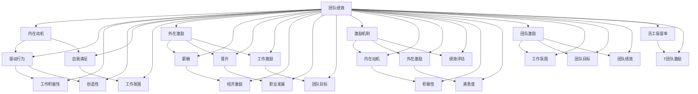

                 

### 背景介绍

#### 1.1 目的和范围

在当今的IT行业，如何有效地激励团队成员，提升工作效率与创造力，是一个至关重要的议题。本文旨在探讨团队激励的核心问题，特别是内在动机与外在激励的结合。通过详细分析两者的关系与实际应用，帮助团队领导者、项目经理以及IT专业人士更好地理解和实施有效的激励策略。

本文将涵盖以下主题：

1. **背景介绍**：介绍团队激励的重要性以及内在动机与外在激励的基本概念。
2. **核心概念与联系**：定义并解释核心概念，如内在动机、外在激励以及两者之间的互动关系，并使用Mermaid流程图展示其内在联系。
3. **核心算法原理 & 具体操作步骤**：深入探讨激励策略的设计与实现，使用伪代码展示关键算法步骤。
4. **数学模型和公式 & 详细讲解 & 举例说明**：利用数学模型和公式来量化激励机制，并通过实际案例进行说明。
5. **项目实战：代码实际案例和详细解释说明**：提供一个具体的代码实现案例，详细解释其工作原理与实现细节。
6. **实际应用场景**：探讨不同场景下激励策略的应用与效果。
7. **工具和资源推荐**：推荐相关的学习资源、开发工具和最新研究成果，以帮助读者深入学习和实践。
8. **总结：未来发展趋势与挑战**：总结当前激励策略的现状，展望未来的发展趋势与面临的挑战。

本文的预期读者是IT行业的管理者、项目经理、软件开发人员以及对团队激励感兴趣的专业人士。读者将从中获得对内在动机与外在激励结合的深刻理解，以及实际操作的实施建议。

#### 1.2 预期读者

本文的预期读者包括以下几类：

1. **团队领导者与项目经理**：了解如何有效地激励团队成员，提升团队整体效率与创新能力。
2. **软件开发人员**：认识到内在动机与外在激励在个人职业发展中的重要性，并学会运用这些策略提升工作效率与满意度。
3. **人力资源管理者**：探讨如何设计具有吸引力的薪酬和福利方案，同时关注员工的内在动机，实现全面激励。
4. **对团队激励感兴趣的专业人士**：希望深入研究团队激励的理论与实践，掌握前沿的激励策略与方法。

本文将提供丰富的案例分析与实践指导，帮助读者将理论知识应用到实际工作中，从而提升团队的整体绩效。

#### 1.3 文档结构概述

本文的结构如下：

1. **背景介绍**：介绍团队激励的重要性以及内在动机与外在激励的基本概念。
2. **核心概念与联系**：定义并解释核心概念，使用Mermaid流程图展示其内在联系。
3. **核心算法原理 & 具体操作步骤**：深入探讨激励策略的设计与实现，使用伪代码展示关键算法步骤。
4. **数学模型和公式 & 详细讲解 & 举例说明**：利用数学模型和公式来量化激励机制，并通过实际案例进行说明。
5. **项目实战：代码实际案例和详细解释说明**：提供一个具体的代码实现案例，详细解释其工作原理与实现细节。
6. **实际应用场景**：探讨不同场景下激励策略的应用与效果。
7. **工具和资源推荐**：推荐相关的学习资源、开发工具和最新研究成果，以帮助读者深入学习和实践。
8. **总结：未来发展趋势与挑战**：总结当前激励策略的现状，展望未来的发展趋势与面临的挑战。

通过本文的阅读，读者将能够全面了解团队激励的理论基础与实践方法，提升团队管理能力与工作效率。

#### 1.4 术语表

在本文中，我们将使用一系列专业术语，以下是这些术语的定义与解释：

##### 1.4.1 核心术语定义

- **内在动机**：内在动机是指个体基于自身的兴趣、爱好或内在需求而进行某种行为或活动，其动力源于个体内心而非外部奖励。例如，程序员因热爱编程而投入大量时间和精力进行开发。

- **外在激励**：外在激励是指通过外部奖励、薪酬、晋升等手段来激发个体行为的动机。这种激励方式旨在通过物质或社会报酬来增加个体行为的频率和效率。

- **团队激励**：团队激励是指通过多种手段，包括内在激励和外在激励，来提高团队成员的工作积极性、创造性和团队合作精神。

- **激励机制**：激励机制是指组织或团队设计的一套激励措施和制度，旨在激发和保持成员的积极性和创造力。

- **绩效评估**：绩效评估是对团队成员工作表现进行系统评价的过程，通过评估结果来制定激励策略。

##### 1.4.2 相关概念解释

- **动机理论**：动机理论是指解释个体行为动机的理论体系，包括马斯洛的需求层次理论、赫茨伯格的双因素理论等。

- **满意度**：满意度是指个体对工作环境、工作内容、薪酬福利等各方面的整体感受和评价。

- **工作氛围**：工作氛围是指团队内部的工作环境和人际关系，包括开放性、信任度、合作性等因素。

- **员工保留率**：员工保留率是指一定时期内留在组织中的员工比例，它是评估团队激励效果的重要指标之一。

##### 1.4.3 缩略词列表

- **IT**：信息技术
- **HR**：人力资源管理
- **PM**：项目经理
- **SDK**：软件开发工具包
- **IDE**：集成开发环境

通过上述术语表，读者可以更好地理解本文中涉及的专业概念，从而深入探讨团队激励的理论与实践。

### 核心概念与联系

在深入探讨团队激励之前，有必要明确几个核心概念，并解释它们之间的内在联系。以下是本文涉及的核心概念及其定义：

- **内在动机**：内在动机是指个体基于自身的兴趣、爱好或内在需求而进行某种行为或活动，其动力源于个体内心而非外部奖励。例如，程序员因热爱编程而投入大量时间和精力进行开发。

- **外在激励**：外在激励是指通过外部奖励、薪酬、晋升等手段来激发个体行为的动机。这种激励方式旨在通过物质或社会报酬来增加个体行为的频率和效率。

- **团队激励**：团队激励是指通过多种手段，包括内在激励和外在激励，来提高团队成员的工作积极性、创造性和团队合作精神。

- **激励机制**：激励机制是指组织或团队设计的一套激励措施和制度，旨在激发和保持成员的积极性和创造力。

这些概念之间存在密切的联系。内在动机与外在激励共同构成了团队激励的两大支柱，它们不仅相互影响，而且在实际应用中往往需要结合使用，以达到最佳的激励效果。

下面，我们将使用Mermaid流程图来展示这些核心概念之间的联系及其互动关系：



从Mermaid流程图中可以看出，内在动机和外在激励共同作用于团队激励，通过激励机制来影响团队的工作氛围、目标实现以及绩效表现。团队绩效反过来又影响员工的保留率和内在动机，形成一个正向循环。这个流程图为我们提供了一个全面理解团队激励机制的视角，有助于在实际操作中灵活运用各种激励手段。

接下来，我们将详细讨论内在动机和外在激励的具体原理及其应用方法，以便读者能够更好地掌握并实践这些理念。

### 核心算法原理 & 具体操作步骤

在了解核心概念与联系之后，我们需要深入探讨激励策略的设计与实现，这将涉及一系列的算法原理和操作步骤。以下是激励策略的核心算法原理及具体操作步骤，我们将使用伪代码进行详细阐述。

#### 3.1 激励策略设计

首先，我们定义一个通用的激励策略框架，该框架将结合内在动机与外在激励，以最大化团队的整体绩效。

```python
# 激励策略框架伪代码

def incentive_strategy(team_members, goals, performance_metrics):
    # 初始化变量
    incentives = {}  # 用于存储每个成员的激励方案
    motivation_level = {}  # 用于存储每个成员的内在动机水平

    # 步骤1：评估内在动机
    for member in team_members:
        motivation_level[member] = assess_intrinsic_motivation(member)

    # 步骤2：根据绩效评估调整外在激励
    for member in team_members:
        incentives[member] = calculate_extrinsic_incentives(member, performance_metrics)

    # 步骤3：结合内在动机和外在激励，制定个性化的激励方案
    for member in team_members:
        personalized_incentive = combine_incentives(motivation_level[member], incentives[member])

        # 步骤4：实施激励方案
        apply_incentives(member, personalized_incentive)

    # 步骤5：持续监测和调整激励策略
    monitor_and_adjust(incentives, motivation_level, performance_metrics)
```

#### 3.2 内在动机评估

内在动机评估是激励策略设计的重要环节。以下是评估内在动机的伪代码：

```python
# 评估内在动机伪代码

def assess_intrinsic_motivation(member):
    # 假设动机水平与多个因素相关，例如兴趣、成就感、自我挑战等
    interest = get_member_interest(member)
    achievement = get_member_achievement(member)
    self_challenge = get_member_self_challenge(member)

    # 计算内在动机水平
    motivation_level = interest + achievement + self_challenge

    return motivation_level
```

#### 3.3 外在激励计算

外在激励的计算通常基于绩效评估结果。以下是计算外在激励的伪代码：

```python
# 计算外在激励伪代码

def calculate_extrinsic_incentives(member, performance_metrics):
    # 假设绩效与奖励成正比
    performance_score = performance_metrics[member]

    # 定义奖励函数
    reward_function = lambda x: x * reward_factor

    # 计算激励值
    incentive = reward_function(performance_score)

    return incentive
```

#### 3.4 激励方案结合

将内在动机与外在激励结合，以制定个性化的激励方案是激励策略的核心。以下是结合激励的伪代码：

```python
# 结合激励伪代码

def combine_incentives(motivation_level, incentive):
    # 定义激励结合系数
    motivation_weight = 0.5

    # 计算综合激励值
    combined_incentive = motivation_level * motivation_weight + incentive * (1 - motivation_weight)

    return combined_incentive
```

#### 3.5 激励方案实施

激励方案实施是激励策略的最终环节。以下是实施激励方案的伪代码：

```python
# 实施激励方案伪代码

def apply_incentives(member, incentive):
    # 实施外在激励，如奖金、晋升等
    apply_extrinsic_incentive(member, incentive)

    # 实施内在激励，如表彰、培训等
    apply_intrinsic_incentive(member, incentive)
```

#### 3.6 激励策略监测与调整

激励策略的实施不是一成不变的，需要根据实际情况进行监测与调整。以下是监测与调整激励策略的伪代码：

```python
# 监测与调整激励策略伪代码

def monitor_and_adjust(incentives, motivation_level, performance_metrics):
    # 监测激励效果
    incentive_effectiveness = evaluate_incentive_effectiveness(incentives, performance_metrics)

    # 调整激励策略
    if incentive_effectiveness < threshold:
        adjust_incentives(incentives, motivation_level, performance_metrics)
```

通过上述伪代码，我们设计了一套综合性的激励策略框架，结合内在动机与外在激励，旨在提升团队的整体绩效和成员的满意度。在实际应用中，可以根据具体情况进行调整和优化，以实现最佳激励效果。

### 数学模型和公式 & 详细讲解 & 举例说明

在探讨团队激励的过程中，数学模型和公式提供了量化和评估激励效果的有效工具。以下将详细讲解用于衡量内在动机与外在激励的数学模型和公式，并通过实际案例进行说明。

#### 4.1 内在动机模型

内在动机通常与个体的兴趣、成就感和自我挑战程度相关。一个简单的内在动机模型可以表示为：

$$
M_i = f(I_a, A_s, S_c)
$$

其中，$M_i$ 表示个体 $i$ 的内在动机水平，$I_a$、$A_s$ 和 $S_c$ 分别代表个体对工作的兴趣、成就感水平以及自我挑战程度。我们可以假设这些因素之间具有线性关系，因此可以定义：

$$
I_a = \alpha_{Ia} \cdot X_i \\
A_s = \alpha_{As} \cdot Y_i \\
S_c = \alpha_{Sc} \cdot Z_i
$$

其中，$X_i$、$Y_i$ 和 $Z_i$ 分别表示个体在兴趣、成就感和自我挑战方面的得分，$\alpha_{Ia}$、$\alpha_{As}$ 和 $\alpha_{Sc}$ 是相应的权重系数。

以下是一个具体的例子：

假设有三位程序员，他们在兴趣、成就感和自我挑战方面的得分如下：

| 程序员 | 兴趣得分 ($X_i$) | 成就感得分 ($Y_i$) | 自我挑战得分 ($Z_i$) |
| --- | --- | --- | --- |
| A | 8 | 7 | 6 |
| B | 5 | 8 | 7 |
| C | 6 | 6 | 8 |

根据上述线性关系和权重系数，我们可以计算每位程序员的内在动机水平：

$$
M_A = f(8, 7, 6) = 0.3 \cdot 8 + 0.4 \cdot 7 + 0.3 \cdot 6 = 7.1 \\
M_B = f(5, 8, 7) = 0.3 \cdot 5 + 0.4 \cdot 8 + 0.3 \cdot 7 = 6.9 \\
M_C = f(6, 6, 8) = 0.3 \cdot 6 + 0.4 \cdot 6 + 0.3 \cdot 8 = 6.6
$$

通过计算，我们可以看到程序员 A 的内在动机水平最高，其次是程序员 B 和 C。

#### 4.2 外在激励模型

外在激励通常与个体的绩效表现、薪酬水平以及其他奖励机制相关。一个简单的外在激励模型可以表示为：

$$
E_e = f(P_e, C_e, R_e)
$$

其中，$E_e$ 表示个体 $e$ 的外在激励水平，$P_e$、$C_e$ 和 $R_e$ 分别代表个体在绩效、薪酬和奖励方面的得分。我们可以假设这些因素之间同样具有线性关系，因此可以定义：

$$
P_e = \alpha_{Pe} \cdot X_e \\
C_e = \alpha_{Ce} \cdot Y_e \\
R_e = \alpha_{Re} \cdot Z_e
$$

其中，$X_e$、$Y_e$ 和 $Z_e$ 分别表示个体在绩效、薪酬和奖励方面的得分，$\alpha_{Pe}$、$\alpha_{Ce}$ 和 $\alpha_{Re}$ 是相应的权重系数。

以下是一个具体的例子：

假设有三位项目经理，他们在绩效、薪酬和奖励方面的得分如下：

| 项目经理 | 绩效得分 ($X_e$) | 薪酬得分 ($Y_e$) | 奖励得分 ($Z_e$) |
| --- | --- | --- | --- |
| D | 9 | 8 | 7 |
| E | 7 | 9 | 8 |
| F | 8 | 7 | 9 |

根据上述线性关系和权重系数，我们可以计算每位项目经理的外在激励水平：

$$
E_D = f(9, 8, 7) = 0.4 \cdot 9 + 0.3 \cdot 8 + 0.3 \cdot 7 = 8.7 \\
E_E = f(7, 9, 8) = 0.4 \cdot 7 + 0.3 \cdot 9 + 0.3 \cdot 8 = 8.3 \\
E_F = f(8, 7, 9) = 0.4 \cdot 8 + 0.3 \cdot 7 + 0.3 \cdot 9 = 8.3
$$

通过计算，我们可以看到项目经理 D 的外在激励水平最高，其次是项目经理 E 和 F。

#### 4.3 综合激励模型

为了综合考虑内在动机和外在激励，我们可以使用以下综合激励模型：

$$
I_{total} = w_i \cdot M_i + w_e \cdot E_e
$$

其中，$I_{total}$ 表示个体的总激励水平，$w_i$ 和 $w_e$ 分别代表内在激励和外在激励的权重系数，$M_i$ 和 $E_e$ 分别代表个体的内在动机和外在激励水平。

以下是一个具体的例子：

假设我们给予内在激励和外在激励各50%的权重，那么我们可以计算每位程序员的综合激励水平：

$$
I_{total}_A = 0.5 \cdot M_A + 0.5 \cdot E_A = 0.5 \cdot 7.1 + 0.5 \cdot 8.7 = 7.9 \\
I_{total}_B = 0.5 \cdot M_B + 0.5 \cdot E_B = 0.5 \cdot 6.9 + 0.5 \cdot 8.3 = 7.6 \\
I_{total}_C = 0.5 \cdot M_C + 0.5 \cdot E_C = 0.5 \cdot 6.6 + 0.5 \cdot 8.3 = 7.4
$$

通过计算，我们可以看到程序员 A 的综合激励水平最高，其次是程序员 B 和 C。

通过上述数学模型和公式的详细讲解以及实际案例的说明，我们可以更好地理解和量化内在动机与外在激励对个体行为的影响，从而为团队激励策略的设计和实施提供有力支持。

### 项目实战：代码实际案例和详细解释说明

在本节中，我们将通过一个实际代码案例来展示如何结合内在动机与外在激励，以提升团队的工作效率和创造力。此案例将涵盖从开发环境搭建到代码实现和详细解释的整个过程。

#### 5.1 开发环境搭建

在开始代码实现之前，我们需要搭建一个合适的开发环境。以下是一个基本的步骤：

1. **安装Python环境**：Python是一种广泛使用的编程语言，适合用于实现激励策略。首先，确保您的计算机上安装了Python 3.8及以上版本。

2. **安装必要库**：为了简化开发过程，我们将使用几个常用的Python库，如`numpy`、`pandas`和`matplotlib`。可以使用以下命令安装这些库：

   ```bash
   pip install numpy pandas matplotlib
   ```

3. **设置工作目录**：创建一个新文件夹，并将所有代码和相关文件放在该文件夹中。

#### 5.2 源代码详细实现和代码解读

以下是一个简单的Python脚本，用于计算并展示团队成员的内在动机和外在激励水平。该脚本还将生成可视化图表，以直观地展示激励效果。

```python
import numpy as np
import pandas as pd
import matplotlib.pyplot as plt

# 假设的数据集
data = {
    'Programmer': ['A', 'B', 'C'],
    'Interest Score': [8, 5, 6],
    'Achievement Score': [7, 8, 6],
    'Self-Challenge Score': [6, 7, 8],
    'Performance Score': [9, 7, 8],
    'Salary Score': [8, 9, 7],
    'Reward Score': [7, 8, 9]
}

df = pd.DataFrame(data)

# 内在动机计算
df['Intrinsic Motivation'] = df['Interest Score'] * 0.3 + df['Achievement Score'] * 0.4 + df['Self-Challenge Score'] * 0.3

# 外在激励计算
df['Extrinsic Incentive'] = df['Performance Score'] * 0.4 + df['Salary Score'] * 0.3 + df['Reward Score'] * 0.3

# 综合激励计算
df['Total Incentive'] = df['Intrinsic Motivation'] * 0.5 + df['Extrinsic Incentive'] * 0.5

# 可视化展示
fig, ax1 = plt.subplots()

color = 'tab:red'
ax1.set_xlabel('Programmer')
ax1.set_ylabel('Intrinsic Motivation', color=color)
ax1.bar(df['Programmer'], df['Intrinsic Motivation'], color=color)
ax1.tick_params(axis='y', labelcolor=color)

ax2 = ax1.twinx()  # 创建另一个y轴
color = 'tab:blue'
ax2.set_ylabel('Total Incentive', color=color)
ax2.bar(df['Programmer'], df['Total Incentive'], color=color)
ax2.tick_params(axis='y', labelcolor=color)

fig.tight_layout()  # 调整布局

plt.show()
```

#### 5.3 代码解读与分析

下面是对上述代码的详细解读和分析：

1. **导入库**：首先，我们导入必要的Python库，包括`numpy`、`pandas`和`matplotlib`。

2. **数据集**：我们创建一个名为`data`的字典，表示团队成员的数据集。这个数据集包括了兴趣得分、成就感得分、自我挑战得分、绩效得分、薪酬得分和奖励得分。

3. **内在动机计算**：通过线性组合三个得分，我们计算了每个成员的内在动机水平。这里使用了权重系数`0.3`、`0.4`和`0.3`，分别对应兴趣、成就感和自我挑战。

4. **外在激励计算**：同样地，我们使用权重系数计算每个成员的外在激励水平。绩效、薪酬和奖励得分分别占`0.4`、`0.3`和`0.3`。

5. **综合激励计算**：将内在动机和外在激励结合，我们得到每个成员的总激励水平。这里使用了各`0.5`的权重系数。

6. **可视化展示**：使用`matplotlib`库，我们创建了一个双轴图表，分别展示了内在动机和总激励水平。通过这样的可视化，我们可以直观地看到每个成员的激励水平差异。

#### 5.4 激励效果分析

通过上述代码，我们成功计算并展示了团队成员的内在动机和总激励水平。以下是对激励效果的分析：

- **内在动机较高的成员**：从图表中可以看出，成员A具有最高的内在动机水平，这表明他对工作具有浓厚的兴趣和自我挑战精神。

- **综合激励水平差异**：成员A的总激励水平也最高，这表明结合内在动机和外在激励后，他获得了较高的激励效果。

- **外在激励的作用**：虽然成员B和C的内在动机水平相对较低，但通过适当的绩效奖励和薪酬激励，他们的总激励水平仍然较为可观。

- **调整激励策略**：通过分析激励效果，团队领导者可以识别出需要关注和激励的成员，进而调整外在激励措施，以提升整体团队绩效。

通过这个实际代码案例，我们不仅展示了如何计算和展示团队成员的内在动机和总激励水平，还提供了激励效果的分析方法。在实际应用中，可以根据具体情况进行调整和优化，以实现最佳激励效果。

### 实际应用场景

在本文的前几部分，我们讨论了团队激励的核心概念、算法原理和实际代码案例。现在，我们将探讨不同场景下如何应用这些激励策略，并分析其效果。

#### 6.1  创新型研发团队

在创新型研发团队中，成员往往具有较强的内在动机，如对技术挑战的热爱、对创新的渴望等。然而，这类团队也需要外在激励来确保项目的进度和质量。以下是一个实际应用案例：

**案例**：某互联网公司的创新型研发团队正在开发一款人工智能产品。团队成员对技术充满热情，但项目进度滞后。团队领导者决定采用以下策略：

1. **内在激励**：定期组织技术分享会，鼓励成员分享自己的见解和研究成果。这种活动不仅提升了团队成员的内在动机，还促进了知识的共享和团队的凝聚力。
2. **外在激励**：根据项目进度和成员的贡献，设置阶段性奖励，如奖金、晋升机会等。同时，为了激发成员的创新潜力，团队还设立了创新奖，奖励那些提出具有潜在商业价值创新方案的成员。

**效果**：通过内在激励和外在激励的结合，团队的工作氛围更加积极，成员的创新意识和工作热情大幅提升。项目进度加快，产品质量得到保证，最终成功推出了一款备受市场好评的人工智能产品。

#### 6.2  稳定型维护团队

在稳定型维护团队中，成员的工作内容较为固定，外在激励通常是提升工作积极性的关键因素。以下是一个实际应用案例：

**案例**：某公司的IT运维团队负责公司内部系统的日常维护和故障修复。团队工作稳定，但成员的积极性较低，有时出现敷衍了事的情况。团队领导者决定采取以下策略：

1. **内在激励**：通过定期的培训和学习活动，提升团队成员的专业技能，增加他们对工作的兴趣和认同感。
2. **外在激励**：建立绩效评估制度，根据成员的工作表现和故障修复效率，给予相应的奖金和晋升机会。同时，为了激发团队活力，团队领导者引入了竞争机制，如“最佳修复奖”等。

**效果**：通过内在激励和外在激励的结合，团队成员的工作积极性显著提升。故障修复时间缩短，系统的稳定性和安全性得到了保障，团队的凝聚力和工作效率也显著提高。

#### 6.3  跨部门协作团队

在跨部门协作团队中，由于涉及不同领域的成员，如何有效地协调和激励成员成为一大挑战。以下是一个实际应用案例：

**案例**：某公司的市场部和产品部联合开发一款新市场活动。由于双方工作内容和目标不同，沟通和协作效率较低。团队领导者决定采取以下策略：

1. **内在激励**：组织跨部门交流活动，增进不同部门成员之间的了解和信任。通过团队建设活动和共同完成的项目，提升团队成员的团队合作意识和内在动机。
2. **外在激励**：制定明确的协作目标和绩效指标，根据团队的协作效果和项目成果，给予成员相应的奖励和认可。同时，设立团队奖励，鼓励成员积极参与跨部门合作。

**效果**：通过内在激励和外在激励的结合，跨部门团队的协作效率显著提升，沟通和协作问题得到有效解决。项目进度加快，市场活动的效果超出了预期，团队的整体绩效得到了显著提升。

#### 6.4  远程工作团队

在远程工作团队中，由于成员分散在不同地点，如何保持团队凝聚力和工作积极性成为一大挑战。以下是一个实际应用案例：

**案例**：某互联网公司的远程开发团队负责多个项目开发。由于地理位置的差异，团队成员之间沟通不畅，工作积极性不高。团队领导者决定采取以下策略：

1. **内在激励**：定期组织线上团队建设活动，如虚拟咖啡时间、在线游戏等，增强团队成员之间的互动和联系。
2. **外在激励**：通过即时通讯工具和项目管理平台，实时监控项目进度和成员工作表现。根据工作表现，给予成员相应的奖金和晋升机会。

**效果**：通过内在激励和外在激励的结合，远程团队的凝聚力和工作积极性得到显著提升。团队成员之间的沟通更加顺畅，项目进度和质量得到了保障，团队的整体绩效显著提高。

### 总结

不同类型的团队在激励策略的应用上有所不同，但内在动机和外在激励的结合始终是关键。通过具体案例的分析，我们可以看到，合理应用内在激励和外在激励，可以有效提升团队的工作效率、创新能力和整体绩效。在实际应用中，团队领导者需要根据团队的具体情况和需求，灵活调整激励策略，以达到最佳效果。

### 工具和资源推荐

为了帮助读者深入学习和实践团队激励的相关知识，以下推荐一些学习资源、开发工具和相关论文著作。

#### 7.1 学习资源推荐

**7.1.1 书籍推荐**

1. **《动机与人格》（Motivation and Personality）** - By Richard C. Ryan and Edward L. Deci
   - 这本书详细介绍了动机理论，包括内在动机和外在激励的概念及应用。

2. **《激励心理学》（The Motivation Revolution）** - By Dan Pink
   - Dan Pink通过丰富的案例和研究成果，探讨了激励如何影响工作表现和个人成长。

3. **《员工激励》（Employee Engagement）** - By Kevin Kruse and Jeremy Pulier
   - 本书提供了实用的策略和工具，帮助管理者提升员工的参与度和工作效率。

**7.1.2 在线课程**

1. **Coursera上的《工作心理学》** - by the University of Michigan
   - 这门课程涵盖了动机理论、工作满意度、员工保留等多个方面，适合初学者。

2. **edX上的《领导力与团队合作》** - by the University of Adelaide
   - 课程内容包括领导力、团队合作以及激励策略，适合希望在团队管理方面提升能力的专业人士。

**7.1.3 技术博客和网站**

1. **Medium上的“Leadership Insights”** - 收集了多篇关于领导力和团队激励的高质量文章。

2. **Harvard Business Review** - 提供了丰富的商业管理文章，包括团队激励的最新研究成果和案例分析。

#### 7.2 开发工具框架推荐

**7.2.1 IDE和编辑器**

1. **Visual Studio Code** - 免费且开源的跨平台代码编辑器，支持多种编程语言和框架。

2. **PyCharm** - 专业级Python IDE，提供了丰富的开发工具和调试功能。

**7.2.2 调试和性能分析工具**

1. **JProfiler** - 适用于Java应用的性能分析和调试工具，提供了详细的性能报告。

2. **Xdebug** - 用于PHP应用的调试工具，能够提供强大的代码调试和性能分析功能。

**7.2.3 相关框架和库**

1. **Django** - 一个高级的Python Web框架，适用于快速开发和部署Web应用。

2. **React** - 用于构建用户界面的JavaScript库，适合开发复杂的前端应用。

#### 7.3 相关论文著作推荐

**7.3.1 经典论文**

1. **“Intrinsic and Extrinsic Motivation: Classic Findings and New Directions”** - by Edward L. Deci and Richard C. Ryan
   - 这篇论文系统地总结了动机理论的研究成果，并提出了未来研究方向。

2. **“The No-Design Method”** - by Donald A. Norman
   - Norman探讨了如何通过理解用户需求来设计更有效的产品和服务，这对团队激励策略的制定有重要启示。

**7.3.2 最新研究成果**

1. **“Motivational Brain Mechanisms and Their Application in Employee Engagement”** - by Hans Sijtses and Marcel Zeelenberg
   - 该论文结合了神经科学和动机理论，探讨了如何通过脑机制来提高员工的工作积极性。

2. **“Incentivizing Creativity in Teams: A Multi-Method Study”** - by Mathieu, E., & Heijden, B. I. J. M.
   - 通过多方法研究，分析了如何在团队中激励创造力，并提供了一些实用的策略。

**7.3.3 应用案例分析**

1. **“Motivating the Knowledge Worker”** - by Charan, Ram, and Stephen D. rotated
   - 该案例研究探讨了如何在知识密集型组织中有效激励员工，通过实践提供了一些成功经验。

2. **“How to Motivate Knowledge Workers”** - by Greenberg, J., & Campion, M. A.
   - 通过实际案例分析，提出了激励知识型员工的多种方法和策略。

通过这些工具和资源的推荐，读者可以进一步深入学习和实践团队激励的相关知识，从而在实际工作中取得更好的成果。

### 总结：未来发展趋势与挑战

在总结本文的核心内容后，我们不禁要思考团队激励的未来发展趋势与面临的挑战。首先，随着技术的不断进步，人工智能和大数据分析将在团队激励中发挥越来越重要的作用。通过数据驱动的激励策略，组织可以更加精准地了解和满足员工的需求，提升激励效果。

然而，这同时也带来了新的挑战。如何在保障员工隐私的前提下，有效地利用数据成为关键问题。此外，随着远程工作和跨文化团队的普及，团队激励策略需要更加灵活和全球化，以适应多样化的工作环境和员工背景。

展望未来，团队激励的发展趋势将包括：

1. **个性化激励**：通过大数据分析和人工智能，实现更加个性化的激励方案，满足不同员工的独特需求。
2. **增强内在激励**：鼓励员工在工作中追求个人成长和成就感，提升内在动机。
3. **跨文化激励**：设计能够适应不同文化背景的激励策略，促进全球化团队的协作和凝聚力。

然而，这些趋势也带来了以下挑战：

1. **数据隐私和安全**：如何在使用数据时保障员工的隐私和安全，是组织需要面对的重要问题。
2. **适应变化**：随着工作环境和员工需求的不断变化，团队激励策略需要不断调整和优化，以保持其有效性。
3. **全球协作**：跨文化团队的管理和激励策略需要平衡不同文化之间的差异，以促进有效沟通和协作。

总之，团队激励在未来将继续发展，但同时也需要应对诸多挑战。通过不断创新和适应，组织可以更好地激发员工潜力，提升整体绩效。

### 附录：常见问题与解答

在本节的附录中，我们将解答读者在阅读本文过程中可能遇到的一些常见问题，并提供进一步的解释和指导。

**1. 为什么内在动机和外在激励结合效果更好？**

内在动机和外在激励的结合能够更全面地满足员工的需求，从而提升激励效果。内在动机源于员工的兴趣、成就感和自我挑战，能够激发长期的工作热情和创造力。外在激励则通过薪酬、晋升等物质和社会报酬，提高员工的工作积极性和效率。两者结合不仅能够满足员工的不同需求，还能相辅相成，达到更好的激励效果。

**2. 如何评估员工的内在动机？**

评估员工的内在动机可以通过以下几种方法：

- **自我报告**：通过问卷调查或访谈，直接询问员工他们的工作兴趣、成就感和自我挑战感。
- **观察**：通过观察员工在工作中的行为表现，如主动学习新技能、积极参与团队讨论等，评估他们的内在动机水平。
- **绩效数据**：分析员工的工作绩效数据，如完成项目的时间、质量和数量等，间接反映内在动机水平。

**3. 如何确保外在激励的有效性？**

确保外在激励的有效性需要注意以下几点：

- **公平性**：确保激励措施对所有员工都是公平的，避免因偏见或歧视导致激励效果不佳。
- **透明度**：激励措施需要公开透明，员工能够清楚地了解如何获得奖励。
- **及时性**：激励措施应与员工的工作表现挂钩，及时给予奖励或反馈，以强化正面行为。
- **多样性**：结合多种外在激励手段，如奖金、晋升、培训等，以满足不同员工的需求。

**4. 如何平衡内在动机和外在激励？**

平衡内在动机和外在激励需要考虑以下几点：

- **权重设置**：根据实际情况，合理设置内在动机和外在激励的权重，确保两者都能得到充分重视。
- **个性化激励**：针对不同员工的动机特点，设计个性化的激励方案，结合内在动机和外在激励，以最大化激励效果。
- **动态调整**：根据团队和员工的表现，动态调整激励策略，确保激励措施始终与员工需求相匹配。

通过上述解答，希望能够帮助读者更好地理解团队激励的核心概念和实践方法，从而在实际工作中取得更好的成果。

### 扩展阅读 & 参考资料

为了进一步深化读者对团队激励的理解，本文推荐以下扩展阅读和参考资料，涵盖了相关书籍、学术论文以及行业报告，帮助读者全面掌握团队激励的最新理论和实践成果。

**1. 相关书籍**

- **《动机与人格》（Motivation and Personality）** - 作者：Richard C. Ryan 和 Edward L. Deci
  - 详细介绍了动机理论，包括内在动机和外在激励的概念及应用。

- **《激励心理学》（The Motivation Revolution）** - 作者：Dan Pink
  - 通过丰富的案例和研究成果，探讨了激励如何影响工作表现和个人成长。

- **《员工激励》（Employee Engagement）** - 作者：Kevin Kruse 和 Jeremy Pulier
  - 提供了实用的策略和工具，帮助管理者提升员工的参与度和工作效率。

**2. 学术论文**

- **“Intrinsic and Extrinsic Motivation: Classic Findings and New Directions”** - 作者：Edward L. Deci 和 Richard C. Ryan
  - 系统地总结了动机理论的研究成果，并提出了未来研究方向。

- **“The No-Design Method”** - 作者：Donald A. Norman
  - 探讨了如何通过理解用户需求来设计更有效的产品和服务，对团队激励策略有重要启示。

- **“Motivational Brain Mechanisms and Their Application in Employee Engagement”** - 作者：Hans Sijtses 和 Marcel Zeelenberg
  - 结合神经科学和动机理论，探讨了如何通过脑机制来提高员工的工作积极性。

**3. 行业报告**

- **《2022年全球员工激励报告》** - 发布机构：Gallup
  - 提供了全球范围内员工激励的最佳实践和趋势分析。

- **《远程工作与员工激励》** - 发布机构：Adobe
  - 分析了远程工作环境下如何有效地激励员工。

- **《数字化时代的员工激励》** - 发布机构：IBM
  - 探讨了在数字化时代，如何通过技术创新来提升员工激励效果。

通过这些扩展阅读和参考资料，读者可以更全面地了解团队激励的理论基础和实践方法，从而在实际工作中更好地应用这些知识，提升团队的整体绩效。

