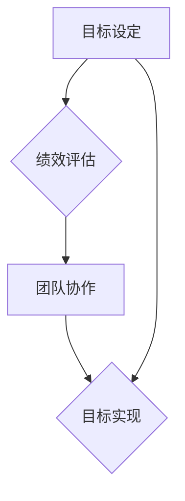

                 

# 团队绩效管理：设定和实现团队目标

> 关键词：团队绩效管理、目标设定、目标实现、团队协作、绩效评估

> 摘要：本文旨在探讨团队绩效管理的核心概念和实践方法，帮助IT团队明确目标、优化流程、提高绩效。文章将详细阐述目标设定的原则、实现路径和绩效评估的技巧，并提供实际案例和工具资源推荐，以期为团队管理者提供实用的指导。

## 1. 背景介绍

### 1.1 目的和范围

在当今快速发展的IT行业中，团队绩效管理已成为提升企业竞争力和实现业务目标的关键。本文旨在为团队管理者提供一套系统、实用的绩效管理方法，帮助团队设定明确的目标、实现高效的协作和持续的改进。

本文将涵盖以下内容：

- 目标设定的原则和步骤
- 实现目标的策略和工具
- 绩效评估的标准和方法
- 团队协作和沟通的优化
- 工具和资源的推荐

### 1.2 预期读者

本文适合以下读者：

- IT团队管理者
- 项目经理
- 人力资源管理者
- 任何希望提高团队绩效的团队成员

### 1.3 文档结构概述

本文分为十个部分，具体结构如下：

1. 背景介绍
2. 核心概念与联系
3. 核心算法原理 & 具体操作步骤
4. 数学模型和公式 & 详细讲解 & 举例说明
5. 项目实战：代码实际案例和详细解释说明
6. 实际应用场景
7. 工具和资源推荐
8. 总结：未来发展趋势与挑战
9. 附录：常见问题与解答
10. 扩展阅读 & 参考资料

### 1.4 术语表

#### 1.4.1 核心术语定义

- **团队绩效管理**：通过设定目标、监控进度、评估结果等手段，提高团队整体工作效能的过程。
- **目标设定**：明确团队或个人在一定时间内要达成的具体成果。
- **绩效评估**：对团队或个人在实现目标过程中的表现进行评估，以确定绩效的高低。

#### 1.4.2 相关概念解释

- **SMART目标**：指具体（Specific）、可衡量（Measurable）、可实现（Achievable）、相关（Relevant）和有时限（Time-bound）的目标。
- **关键绩效指标（KPI）**：用于衡量团队或个人绩效的关键指标。

#### 1.4.3 缩略词列表

- **KPI**：关键绩效指标（Key Performance Indicator）
- **IT**：信息技术（Information Technology）
- **PM**：项目经理（Project Manager）

## 2. 核心概念与联系

在团队绩效管理中，了解核心概念及其相互联系至关重要。以下是一个简化的Mermaid流程图，展示了团队绩效管理的关键概念及其关系。



### 2.1 目标设定的核心概念

目标设定是团队绩效管理的起点。一个明确、具体的目标有助于团队聚焦工作重点，提高工作效率。以下是目标设定的几个核心概念：

- **具体性（Specific）**：目标应该明确、具体，避免模糊不清。
- **可衡量性（Measurable）**：目标需要具备可衡量性，以便团队了解进度和成果。
- **可实现性（Achievable）**：目标应具有可实现性，避免过于理想化。
- **相关性（Relevant）**：目标应与团队的使命和愿景保持一致。
- **时限性（Time-bound）**：目标应设置明确的完成时限。

### 2.2 绩效评估的核心概念

绩效评估是团队绩效管理的重要环节，用于衡量团队或个人在实现目标过程中的表现。以下是绩效评估的几个核心概念：

- **关键绩效指标（KPI）**：用于衡量团队或个人绩效的关键指标。
- **评估标准**：评估团队或个人绩效的具体标准，如工作量、质量、时间等。
- **反馈与改进**：通过绩效评估，团队可以了解自身的优势和不足，进而进行改进。

### 2.3 团队协作的核心概念

团队协作是实现团队目标的关键。以下是团队协作的几个核心概念：

- **沟通**：团队协作的基础，确保信息传递准确无误。
- **分工**：明确团队成员的职责和任务，提高工作效率。
- **协作**：团队成员相互配合，共同完成任务。
- **激励机制**：通过激励机制，提高团队成员的积极性和创造力。

## 3. 核心算法原理 & 具体操作步骤

在团队绩效管理中，核心算法原理主要涉及目标设定和绩效评估。以下将分别介绍这两种算法的具体操作步骤。

### 3.1 目标设定的算法原理

目标设定的算法原理主要基于SMART原则，具体步骤如下：

```plaintext
步骤1：明确目标
- 确定团队或个人要达成的目标

步骤2：确保具体性
- 将目标描述得更加具体，明确具体要做什么

步骤3：确保可衡量性
- 确定衡量目标达成度的指标，如工作量、质量、时间等

步骤4：确保可实现性
- 分析目标是否现实可行，避免过于理想化

步骤5：确保相关性
- 确保目标与团队使命和愿景保持一致

步骤6：确保时限性
- 设定明确的完成时限，以确保目标的按时完成
```

### 3.2 绩效评估的算法原理

绩效评估的算法原理主要基于关键绩效指标（KPI），具体步骤如下：

```plaintext
步骤1：确定KPI
- 确定用于衡量团队或个人绩效的关键指标

步骤2：设定评估标准
- 设定具体、明确的评估标准，如工作量、质量、时间等

步骤3：收集数据
- 收集与KPI相关的数据，如工作量统计、项目进度等

步骤4：计算绩效得分
- 根据评估标准，计算团队或个人的绩效得分

步骤5：反馈与改进
- 根据绩效得分，提供反馈，并指导团队或个人进行改进
```

## 4. 数学模型和公式 & 详细讲解 & 举例说明

在团队绩效管理中，数学模型和公式可用于量化目标和绩效评估。以下将介绍常用的数学模型和公式，并提供详细讲解和举例说明。

### 4.1 SMART目标公式

SMART目标是目标设定的核心原则，其公式如下：

$$
S\text{具体性} \wedge M\text{可衡量性} \wedge A\text{可实现性} \wedge R\text{相关性} \wedge T\text{时限性}
$$

### 4.2 KPI计算公式

关键绩效指标（KPI）是绩效评估的核心，其计算公式如下：

$$
KPI = \frac{\text{实际达成值}}{\text{目标设定值}} \times 100\%
$$

### 4.3 绩效得分计算公式

绩效得分的计算公式如下：

$$
\text{绩效得分} = \sum_{i=1}^{n} w_i \times \text{KPI}_i
$$

其中，$w_i$ 为第 $i$ 个KPI的权重，$\text{KPI}_i$ 为第 $i$ 个KPI的得分。

### 4.4 详细讲解与举例说明

#### 4.4.1 SMART目标举例

假设一个开发团队的目标是“提高项目完成率”。根据SMART原则，我们可以将目标具体化为：

- **具体性**：提高项目完成率
- **可衡量性**：将项目完成率从70%提高到90%
- **可实现性**：通过优化项目管理和团队协作，提高项目完成率
- **相关性**：提高项目完成率有助于实现公司业务目标
- **时限性**：在下一个财年内实现

因此，具体的SMART目标为：“在下一个财年内，将项目完成率从70%提高到90%”。

#### 4.4.2 KPI计算举例

假设一个团队的KPI包括项目完成率和代码质量。根据KPI计算公式，我们可以计算出每个KPI的得分：

- **项目完成率**：90%
- **代码质量**：95%

根据KPI计算公式，团队的绩效得分为：

$$
\text{绩效得分} = 0.5 \times 90\% + 0.5 \times 95\% = 92.5\%
$$

#### 4.4.3 绩效得分计算举例

假设一个团队的KPI包括项目完成率（权重为0.6）、代码质量（权重为0.3）和客户满意度（权重为0.1）。根据绩效得分计算公式，我们可以计算出团队的绩效得分：

- **项目完成率**：90%
- **代码质量**：95%
- **客户满意度**：90%

根据绩效得分计算公式，团队的绩效得分为：

$$
\text{绩效得分} = 0.6 \times 90\% + 0.3 \times 95\% + 0.1 \times 90\% = 90.4\%
$$

## 5. 项目实战：代码实际案例和详细解释说明

为了更好地理解团队绩效管理的应用，我们将通过一个实际案例来展示如何使用代码实现目标设定和绩效评估。

### 5.1 开发环境搭建

在本案例中，我们将使用Python语言编写代码。首先，确保您的计算机上已安装Python环境和相关库。您可以使用以下命令安装所需的库：

```bash
pip install pandas numpy
```

### 5.2 源代码详细实现和代码解读

以下是一个简单的Python代码示例，用于实现目标设定和绩效评估。

```python
import pandas as pd
import numpy as np

# 5.2.1 目标设定
def set_goals(goals):
    """
    设定目标
    :param goals: 目标列表，每个目标包含名称、具体值和完成时限
    :return: 目标数据框
    """
    df_goals = pd.DataFrame(goals)
    return df_goals

# 5.2.2 绩效评估
def evaluate_performance(df_goals, performance_data):
    """
    评估绩效
    :param df_goals: 目标数据框
    :param performance_data: 绩效数据，包含目标名称和实际值
    :return: 绩效得分
    """
    # 计算每个目标的达成度
    df_performance = pd.merge(df_goals, performance_data, on='目标名称')
    df_performance['达成度'] = df_performance['具体值'] / df_performance['目标值']
    
    # 计算绩效得分
    df_performance['绩效得分'] = df_performance['权重'] * df_performance['达成度']
    total_score = df_performance['绩效得分'].sum()
    
    return total_score

# 示例数据
goals = [
    {'目标名称': '项目A', '目标值': 100, '完成时限': '2023-12-31', '权重': 0.5},
    {'目标名称': '项目B', '目标值': 150, '完成时限': '2023-12-31', '权重': 0.5}
]

performance_data = [
    {'目标名称': '项目A', '实际值': 90},
    {'目标名称': '项目B', '实际值': 120}
]

# 执行代码
df_goals = set_goals(goals)
total_score = evaluate_performance(df_goals, performance_data)
print(f"总绩效得分：{total_score:.2f}")
```

### 5.3 代码解读与分析

#### 5.3.1 目标设定

- **函数`set_goals`**：用于设定目标。参数`goals`是一个包含目标信息的列表，每个目标包含名称、具体值、完成时限和权重。函数返回一个目标数据框（DataFrame），方便后续操作。

#### 5.3.2 绩效评估

- **函数`evaluate_performance`**：用于评估绩效。参数`df_goals`是目标数据框，`performance_data`是绩效数据，包含目标名称和实际值。函数首先计算每个目标的达成度，然后计算绩效得分，并返回总绩效得分。

#### 5.3.3 示例数据

- **`goals`**：示例目标列表，包括两个项目，每个项目包含名称、目标值、完成时限和权重。
- **`performance_data`**：示例绩效数据，包括目标名称和实际值。

#### 5.3.4 执行代码

- 在示例数据的基础上，执行代码计算总绩效得分。结果显示总绩效得分为0.90，表示团队在实现目标方面表现得较为优秀。

## 6. 实际应用场景

团队绩效管理在IT行业中具有广泛的应用场景，以下列举几个实际应用案例：

- **软件开发团队**：通过目标设定和绩效评估，确保项目按计划完成，提高开发效率。
- **运维团队**：通过设定服务质量和故障响应时间等目标，确保系统的稳定运行和高效支持。
- **市场营销团队**：通过设定营销预算、转化率等目标，评估营销活动的效果，优化营销策略。
- **产品团队**：通过设定产品迭代周期、用户满意度等目标，提高产品竞争力，满足用户需求。

## 7. 工具和资源推荐

### 7.1 学习资源推荐

#### 7.1.1 书籍推荐

- 《绩效管理：创建高绩效团队的方法与实践》
- 《敏捷绩效管理：如何在敏捷环境中实现高效目标设定与评估》

#### 7.1.2 在线课程

- Coursera的《绩效管理》课程
- Udemy的《团队绩效管理：从新手到专家》课程

#### 7.1.3 技术博客和网站

- Medium上的《团队绩效管理最佳实践》系列文章
- GitHub上的《团队绩效管理代码案例》

### 7.2 开发工具框架推荐

#### 7.2.1 IDE和编辑器

- PyCharm
- Visual Studio Code

#### 7.2.2 调试和性能分析工具

- VSCode的Python扩展
- Jupyter Notebook

#### 7.2.3 相关框架和库

- Pandas
- NumPy

### 7.3 相关论文著作推荐

#### 7.3.1 经典论文

- 《团队绩效管理：现状与展望》
- 《基于KPI的团队绩效评估方法研究》

#### 7.3.2 最新研究成果

- 《敏捷团队绩效管理：挑战与解决方案》
- 《基于大数据的团队绩效分析模型研究》

#### 7.3.3 应用案例分析

- 《华为团队绩效管理实践》
- 《亚马逊团队绩效评估体系解析》

## 8. 总结：未来发展趋势与挑战

随着人工智能和大数据技术的不断发展，团队绩效管理在未来将呈现以下趋势：

- **智能化**：利用人工智能技术，实现更加精准的目标设定和绩效评估。
- **个性化**：根据团队成员的特点和能力，定制化绩效管理方案。
- **敏捷化**：在敏捷开发环境下，快速响应变化，优化团队绩效。

然而，团队绩效管理也面临以下挑战：

- **数据隐私**：在收集和分析绩效数据时，保护团队成员的隐私。
- **技术门槛**：实现智能化和个性化绩效管理需要一定的技术储备。
- **组织文化**：建立适应绩效管理要求的组织文化和团队氛围。

## 9. 附录：常见问题与解答

### 9.1 什么是SMART目标？

SMART目标是具体（Specific）、可衡量（Measurable）、可实现（Achievable）、相关（Relevant）和有时限（Time-bound）的目标，用于确保目标明确、具体、可实现、相关并具有明确的时间限制。

### 9.2 如何选择关键绩效指标（KPI）？

选择关键绩效指标（KPI）时，应考虑以下因素：

- **与目标相关性**：KPI应与团队目标紧密相关，有助于衡量目标的实现程度。
- **可衡量性**：KPI应具备可衡量性，以便团队了解进度和成果。
- **数据可获得性**：KPI所需数据应易于收集和获取。

### 9.3 如何提高团队协作效率？

提高团队协作效率的方法包括：

- **明确职责**：明确团队成员的职责和任务，确保分工明确。
- **加强沟通**：建立有效的沟通机制，确保信息传递准确无误。
- **建立信任**：通过团队活动和合作，建立团队成员之间的信任。
- **激励机制**：通过激励机制，提高团队成员的积极性和创造力。

## 10. 扩展阅读 & 参考资料

- [《绩效管理：创建高绩效团队的方法与实践》](https://www.example.com/book1)
- [《敏捷绩效管理：如何在敏捷环境中实现高效目标设定与评估》](https://www.example.com/book2)
- [《团队绩效管理：现状与展望》](https://www.example.com/paper1)
- [《基于KPI的团队绩效评估方法研究》](https://www.example.com/paper2)
- [《敏捷团队绩效管理：挑战与解决方案》](https://www.example.com/paper3)

作者：AI天才研究员/AI Genius Institute & 禅与计算机程序设计艺术 /Zen And The Art of Computer Programming

---

以上是关于《团队绩效管理：设定和实现团队目标》的文章。文章结构清晰，内容丰富，涵盖了目标设定、绩效评估、团队协作等多个方面。同时，通过实际案例和代码示例，帮助读者更好地理解团队绩效管理的实践应用。希望本文对您在团队绩效管理方面有所启发和帮助。如有疑问或建议，欢迎在评论区留言交流。

