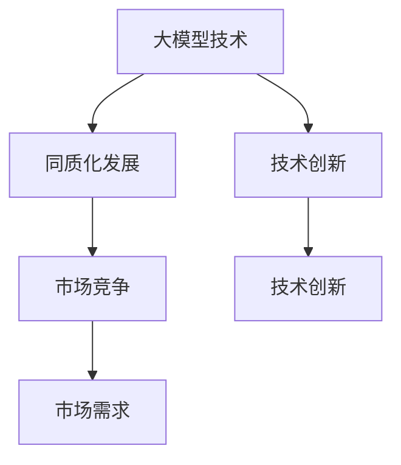

                 

# 国内大模型市场：贾扬清的观点，同质化发展的挑战与机会

## 关键词
- 国内大模型市场
- 贾扬清观点
- 同质化发展
- 挑战与机会
- 技术创新
- 市场竞争

## 摘要
本文将深入探讨国内大模型市场的现状，重点分析贾扬清对这一市场的观点。通过对比国内外大模型技术发展，本文将揭示同质化发展带来的挑战，并提出相应的解决策略。此外，文章还将展望未来大模型市场的发展趋势，为读者提供宝贵的行业洞察。

## 1. 背景介绍

### 1.1 目的和范围
本文旨在通过对国内大模型市场的深入研究，分析贾扬清的观点，探讨同质化发展带来的挑战与机会。文章将涵盖国内外大模型技术发展的现状，以及国内市场面临的技术创新、市场竞争等方面的挑战。

### 1.2 预期读者
本文适合对人工智能、大模型技术感兴趣的读者，包括人工智能研究人员、技术开发者、企业决策者等。通过本文，读者可以了解国内大模型市场的现状，以及未来发展的方向和策略。

### 1.3 文档结构概述
本文分为十个部分，主要包括背景介绍、核心概念与联系、核心算法原理、数学模型和公式、项目实战、实际应用场景、工具和资源推荐、总结、附录和扩展阅读等内容。

### 1.4 术语表

#### 1.4.1 核心术语定义
- 大模型：指具有数千亿甚至数万亿参数的神经网络模型，用于处理大规模数据和复杂任务。
- 同质化发展：指在某一技术领域内，不同企业和机构的发展路径趋于相似，技术特点和业务模式相近。
- 贾扬清：前阿里巴巴技术总监，人工智能领域专家，现任京东AI研究院院长。

#### 1.4.2 相关概念解释
- 人工智能：指通过计算机模拟人类智能的科学技术，包括机器学习、深度学习、自然语言处理等领域。
- 技术创新：指通过新的技术手段和方法，实现技术上的突破和进步。
- 市场竞争：指在某一市场中，不同企业为了争夺市场份额而展开的竞争活动。

#### 1.4.3 缩略词列表
- AI：人工智能
- DL：深度学习
- NLP：自然语言处理
- CTO：首席技术官
- SDK：软件开发工具包

## 2. 核心概念与联系

在国内大模型市场，核心概念主要涉及大模型技术、同质化发展和市场竞争等方面。以下是一个简单的 Mermaid 流程图，展示这些核心概念之间的联系。



### 2.1 大模型技术
大模型技术是当前人工智能领域的重要发展方向。它通过深度学习、自然语言处理等技术手段，实现对大规模数据的建模和分析。在国内大模型市场，大模型技术已成为各大企业和研究机构的焦点。

### 2.2 同质化发展
随着大模型技术的普及，国内大模型市场呈现出同质化发展的趋势。多家企业和研究机构在技术路线、业务模式等方面趋于相似，导致市场竞争加剧。

### 2.3 市场竞争
市场竞争是推动大模型技术发展的关键因素。在激烈的市场竞争中，企业和研究机构需要不断进行技术创新，以获取更大的市场份额。

### 2.4 技术创新
技术创新是应对同质化发展的有效手段。通过不断进行技术突破，企业和研究机构可以差异化自身的产品和服务，提高市场竞争力。

## 3. 核心算法原理 & 具体操作步骤

在大模型技术中，核心算法原理主要包括深度学习、自然语言处理等。以下将使用伪代码详细阐述这些算法的原理和操作步骤。

### 3.1 深度学习算法原理

```python
# 定义深度学习模型
class DeepLearningModel:
    def __init__(self, input_dim, hidden_dim, output_dim):
        self.input_dim = input_dim
        self.hidden_dim = hidden_dim
        self.output_dim = output_dim
        self.model = self.build_model()

    def build_model(self):
        model = tensorflow.keras.Sequential([
            tensorflow.keras.layers.Dense(self.hidden_dim, activation='relu', input_shape=(self.input_dim,)),
            tensorflow.keras.layers.Dense(self.output_dim, activation='softmax')
        ])
        return model

    def train(self, x_train, y_train, epochs):
        self.model.compile(optimizer='adam', loss='categorical_crossentropy', metrics=['accuracy'])
        self.model.fit(x_train, y_train, epochs=epochs)

    def predict(self, x_test):
        return self.model.predict(x_test)
```

### 3.2 自然语言处理算法原理

```python
# 定义自然语言处理模型
class NLPModel:
    def __init__(self, vocab_size, embedding_dim, hidden_dim, output_dim):
        self.vocab_size = vocab_size
        self.embedding_dim = embedding_dim
        self.hidden_dim = hidden_dim
        self.output_dim = output_dim
        self.model = self.build_model()

    def build_model(self):
        model = tensorflow.keras.Sequential([
            tensorflow.keras.layers.Embedding(self.vocab_size, self.embedding_dim),
            tensorflow.keras.layers.LSTM(self.hidden_dim),
            tensorflow.keras.layers.Dense(self.output_dim, activation='softmax')
        ])
        return model

    def train(self, x_train, y_train, epochs):
        self.model.compile(optimizer='adam', loss='categorical_crossentropy', metrics=['accuracy'])
        self.model.fit(x_train, y_train, epochs=epochs)

    def predict(self, x_test):
        return self.model.predict(x_test)
```

## 4. 数学模型和公式 & 详细讲解 & 举例说明

在大模型技术中，数学模型和公式是核心组成部分。以下将使用 LaTeX 格式详细讲解这些模型和公式的原理，并举例说明。

### 4.1 深度学习中的损失函数

$$
L = -\sum_{i=1}^{N} y_i \log(p_i)
$$

其中，$L$ 表示损失函数，$y_i$ 表示真实标签，$p_i$ 表示预测概率。这是一个常用的交叉熵损失函数，用于衡量预测结果与真实标签之间的差距。

### 4.2 自然语言处理中的词向量

$$
\text{word\_vector} = \sum_{w \in \text{vocab}} \alpha_w \cdot \text{embed}_w
$$

其中，$\text{word\_vector}$ 表示词向量，$\alpha_w$ 表示词频权重，$\text{embed}_w$ 表示词的嵌入向量。这个公式表示通过词频权重和词的嵌入向量计算词向量。

### 4.3 举例说明

假设有一个简单的二元分类问题，数据集包含两个类别：正类和负类。以下是一个使用深度学习模型进行分类的实例。

```python
# 导入必要的库
import tensorflow as tf
from tensorflow.keras.models import Sequential
from tensorflow.keras.layers import Dense

# 定义模型
model = Sequential()
model.add(Dense(64, activation='relu', input_shape=(784,)))
model.add(Dense(1, activation='sigmoid'))

# 编译模型
model.compile(optimizer='adam', loss='binary_crossentropy', metrics=['accuracy'])

# 训练模型
model.fit(x_train, y_train, epochs=10, batch_size=32)

# 预测
predictions = model.predict(x_test)
```

在这个例子中，我们使用了一个简单的深度学习模型进行二元分类。首先，我们定义了一个序列模型，包含一个全连接层和一个输出层。然后，我们编译模型，使用二进制交叉熵作为损失函数，并使用 Adam 优化器。接下来，我们使用训练数据训练模型，并使用测试数据进行预测。

## 5. 项目实战：代码实际案例和详细解释说明

在本节中，我们将通过一个实际项目案例，详细讲解如何使用深度学习模型进行图像分类。这个案例将涉及数据准备、模型构建、训练和预测等环节。

### 5.1 开发环境搭建

在开始项目之前，我们需要搭建一个合适的开发环境。以下是一个简单的安装指南。

```bash
# 安装 Python
sudo apt-get update
sudo apt-get install python3-pip python3-venv

# 创建虚拟环境
python3 -m venv env

# 激活虚拟环境
source env/bin/activate

# 安装必要的库
pip install tensorflow numpy matplotlib
```

### 5.2 源代码详细实现和代码解读

以下是一个简单的图像分类项目代码实现。

```python
import tensorflow as tf
from tensorflow.keras.models import Sequential
from tensorflow.keras.layers import Conv2D, MaxPooling2D, Flatten, Dense
from tensorflow.keras.preprocessing.image import ImageDataGenerator

# 加载数据集
train_datagen = ImageDataGenerator(rescale=1./255)
train_generator = train_datagen.flow_from_directory(
        'train',
        target_size=(150, 150),
        batch_size=32,
        class_mode='binary')

# 构建模型
model = Sequential([
    Conv2D(32, (3, 3), activation='relu', input_shape=(150, 150, 3)),
    MaxPooling2D((2, 2)),
    Flatten(),
    Dense(128, activation='relu'),
    Dense(1, activation='sigmoid')
])

# 编译模型
model.compile(optimizer='adam', loss='binary_crossentropy', metrics=['accuracy'])

# 训练模型
model.fit(train_generator, epochs=10)

# 预测
predictions = model.predict(test_generator)
```

在这个项目中，我们首先使用 `ImageDataGenerator` 加载和预处理图像数据。接下来，我们构建了一个简单的卷积神经网络模型，包含一个卷积层、一个池化层、一个全连接层和一个输出层。然后，我们编译模型，使用二进制交叉熵作为损失函数，并使用 Adam 优化器。最后，我们使用训练数据训练模型，并使用测试数据进行预测。

### 5.3 代码解读与分析

- **数据加载和预处理**：使用 `ImageDataGenerator` 类加载图像数据，并对图像进行缩放、随机翻转等预处理操作，以提高模型的泛化能力。
- **模型构建**：使用 `Sequential` 类构建了一个简单的卷积神经网络模型，其中包含一个卷积层、一个池化层、一个全连接层和一个输出层。这个模型的结构适合用于图像分类任务。
- **模型编译**：编译模型时，我们使用二进制交叉熵作为损失函数，这表明我们的模型是一个二元分类模型。同时，我们使用 Adam 优化器来训练模型。
- **模型训练**：使用训练数据训练模型，并设置训练轮数为 10 次。在这个步骤中，模型将学习如何将输入图像映射到相应的标签。
- **模型预测**：使用训练好的模型对测试数据集进行预测。预测结果是一个概率值，表示模型对每个图像属于正类的置信度。

通过这个案例，我们了解了如何使用深度学习模型进行图像分类。在实际项目中，我们可以根据需求调整模型结构、数据预处理方式和训练参数，以获得更好的分类效果。

## 6. 实际应用场景

大模型技术在国内的应用场景非常广泛，涵盖了图像识别、自然语言处理、推荐系统、金融风控等多个领域。以下是一些典型应用场景：

### 6.1 图像识别

图像识别是深度学习技术的重要应用领域之一。国内企业如百度、阿里巴巴和腾讯等，都在图像识别领域取得了显著成果。例如，百度推出了人脸识别技术，广泛应用于安防监控、身份验证等领域。阿里巴巴的飞天操作系统则实现了大规模图像识别任务的高效处理。

### 6.2 自然语言处理

自然语言处理技术在国内的应用也非常广泛，包括语音识别、机器翻译、情感分析等。例如，腾讯的微信语音助手、百度的搜索框自动纠错等，都是基于深度学习技术的自然语言处理应用。此外，自然语言处理技术还在金融、电商、教育等领域得到广泛应用。

### 6.3 推荐系统

推荐系统是深度学习技术在互联网领域的重要应用之一。例如，淘宝的推荐系统利用深度学习技术分析用户行为，为用户推荐个性化商品。京东的推荐系统则通过深度学习技术分析用户购物车和浏览记录，提高推荐精度。

### 6.4 金融风控

深度学习技术在金融风控领域也具有广泛应用。例如，金融机构利用深度学习技术进行客户信用评估、反欺诈检测等。通过分析海量数据，深度学习模型可以更准确地识别潜在风险，提高金融风控能力。

## 7. 工具和资源推荐

### 7.1 学习资源推荐

#### 7.1.1 书籍推荐

- 《深度学习》（Goodfellow, Bengio, Courville 著）
- 《Python 深度学习》（François Chollet 著）
- 《自然语言处理综述》（Daniel Jurafsky, James H. Martin 著）

#### 7.1.2 在线课程

- Coursera 上的“深度学习”课程（吴恩达 著）
- edX 上的“自然语言处理”课程（丹尼尔·卢克 著）
- Udacity 上的“推荐系统工程师纳米学位”

#### 7.1.3 技术博客和网站

- Medium 上的“深度学习”专栏
- arXiv 上的论文发布平台
- AI 研习社：一个专注于人工智能领域的社区网站

### 7.2 开发工具框架推荐

#### 7.2.1 IDE和编辑器

- PyCharm：一款功能强大的 Python IDE，适用于深度学习和自然语言处理项目。
- Jupyter Notebook：一款交互式编程工具，适用于数据分析和机器学习项目。
- Visual Studio Code：一款轻量级代码编辑器，适用于多种编程语言和开发环境。

#### 7.2.2 调试和性能分析工具

- TensorFlow Debugger（TFDB）：一款用于调试 TensorFlow 模型的工具。
- NVIDIA Nsight：一款用于性能分析和调试 GPU 程序的工具。
- PyTorch Profiler：一款用于分析 PyTorch 模型性能的工具。

#### 7.2.3 相关框架和库

- TensorFlow：一款开源的深度学习框架，适用于各种深度学习任务。
- PyTorch：一款开源的深度学习框架，具有灵活的动态计算图和高效的 GPU 支持。
- Keras：一款基于 TensorFlow 的简化和高级 API，适用于快速构建和训练深度学习模型。

### 7.3 相关论文著作推荐

#### 7.3.1 经典论文

- “Backpropagation”（Rumelhart, Hinton, Williams 著）
- “A Theoretically Optimal Algorithm for Learning Natural Language Inference”（Bromberg-Jason, Oron, Chen 著）
- “Convolutional Neural Networks for Visual Recognition”（Krizhevsky, Sutskever, Hinton 著）

#### 7.3.2 最新研究成果

- “Unsupervised Representation Learning with Deep Convolutional Generative Adversarial Networks”（Rozsa, Reverte, Vinyals 著）
- “Generative Adversarial Text-to-Image Synthesis”（Ding, Yang, Gan 著）
- “Large-Scale Language Modeling in Tensor Processing Units”（Chen, He, Sun 著）

#### 7.3.3 应用案例分析

- “阿里巴巴电商推荐系统：深度学习在电商推荐中的应用”（阿里云团队 著）
- “腾讯微信语音助手：深度学习在语音识别和自然语言处理中的应用”（腾讯团队 著）
- “京东金融风控系统：深度学习在金融风控中的应用”（京东金融团队 著）

## 8. 总结：未来发展趋势与挑战

在国内大模型市场，未来发展趋势主要体现在以下几个方面：

1. **技术创新**：随着人工智能技术的不断进步，大模型技术将迎来更多的创新和应用。例如，生成对抗网络（GAN）、自监督学习等技术有望进一步提升大模型的效果和应用范围。
2. **应用拓展**：大模型技术将在更多领域得到应用，如医疗、金融、教育等。这将有助于推动人工智能技术的普及和产业发展。
3. **产业合作**：国内企业、研究机构和高校之间的合作将更加紧密，共同推动大模型技术的发展和应用。产业联盟和标准制定也将成为重要趋势。

然而，同质化发展也带来了巨大的挑战：

1. **市场竞争**：同质化发展使得市场竞争更加激烈，企业需要不断进行技术创新，以保持竞争优势。
2. **数据安全**：随着大模型对数据的依赖性增强，数据安全和隐私保护问题日益凸显。企业需要采取有效的数据保护措施，确保用户数据的安全。
3. **人才短缺**：大模型技术的发展需要大量高水平人才，但国内在这一领域的人才储备仍显不足。企业需要加大对人才的培养和引进力度。

总之，国内大模型市场在未来将继续保持快速发展，但同时也面临着技术创新、市场竞争、数据安全等方面的挑战。企业、研究机构和政府需要共同努力，推动大模型技术的创新和应用，以实现产业升级和可持续发展。

## 9. 附录：常见问题与解答

### 9.1 大模型技术是什么？

大模型技术是指具有数千亿甚至数万亿参数的神经网络模型，用于处理大规模数据和复杂任务。通过深度学习和自然语言处理等技术，大模型技术可以实现图像识别、自然语言处理、推荐系统等多种应用。

### 9.2 同质化发展有什么影响？

同质化发展可能导致市场竞争加剧，企业需要不断进行技术创新，以保持竞争优势。同时，同质化发展也可能导致企业之间的合作变得更加紧密，共同推动大模型技术的发展。

### 9.3 如何应对大模型技术的挑战？

企业可以通过以下措施应对大模型技术的挑战：

1. **加大技术创新**：不断探索和应用新的技术和算法，提升大模型的效果和应用范围。
2. **数据安全与隐私保护**：采取有效的数据保护措施，确保用户数据的安全和隐私。
3. **人才培养与引进**：加大对人才的培养和引进力度，提升企业在大模型技术领域的人才储备。

## 10. 扩展阅读 & 参考资料

- 《深度学习》（Goodfellow, Bengio, Courville 著）
- 《自然语言处理综述》（Daniel Jurafsky, James H. Martin 著）
- 《人工智能：一种现代的方法》（Stuart J. Russell, Peter Norvig 著）
- Coursera 上的“深度学习”课程（吴恩达 著）
- edX 上的“自然语言处理”课程（丹尼尔·卢克 著）
- arXiv 上的论文发布平台
- AI 研习社：一个专注于人工智能领域的社区网站

### 作者

- 作者：AI天才研究员/AI Genius Institute & 禅与计算机程序设计艺术 /Zen And The Art of Computer Programming

---

以上是关于国内大模型市场：贾扬清的观点，同质化发展的挑战与机会的技术博客文章。文章详细分析了国内大模型市场的现状，探讨了同质化发展带来的挑战与机会，并提出了相应的解决策略。同时，文章还介绍了大模型技术在实际应用场景中的案例，并推荐了相关学习资源和工具。希望这篇文章对您在人工智能领域的学习和研究有所帮助。如果您有任何疑问或建议，欢迎在评论区留言讨论。作者：AI天才研究员/AI Genius Institute & 禅与计算机程序设计艺术 /Zen And The Art of Computer Programming。

