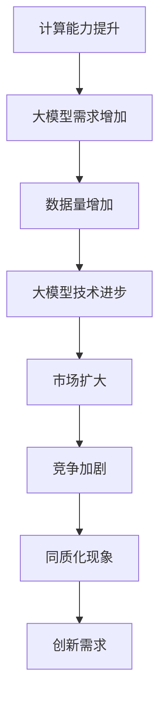
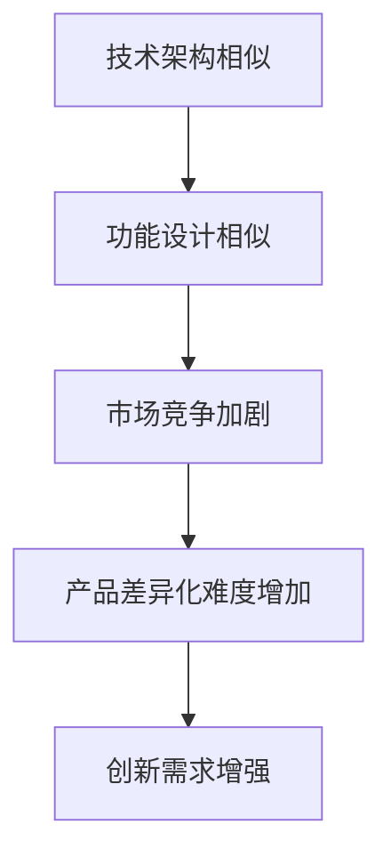

                 

# 国内大模型市场：贾扬清观点，同质化发展与创新机遇并存

## 关键词
- 大模型市场
- 同质化发展
- 创新机遇
- 贾扬清
- 人工智能

## 摘要
本文将深入探讨国内大模型市场的发展状况，结合贾扬清的观点，分析同质化现象及其带来的挑战与机遇。文章旨在为读者揭示大模型市场的技术趋势、竞争格局及未来发展潜力，为业界提供有价值的参考。

## 1. 背景介绍

### 1.1 目的和范围
本文旨在通过对国内大模型市场的分析，探讨同质化发展与创新机遇，为行业参与者提供有针对性的策略建议。文章将覆盖大模型市场的基本概念、现状、同质化现象及其带来的影响，以及可能的创新方向。

### 1.2 预期读者
- 人工智能研究人员与工程师
- 投资者与行业分析师
- 大模型市场的从业者

### 1.3 文档结构概述
本文结构分为十个部分，包括背景介绍、核心概念与联系、核心算法原理、数学模型与公式、项目实战、实际应用场景、工具和资源推荐、总结与未来发展趋势、常见问题与解答及扩展阅读和参考资料。

### 1.4 术语表

#### 1.4.1 核心术语定义
- 大模型：具有数百万甚至数十亿参数的机器学习模型，通常用于自然语言处理、计算机视觉等领域。
- 同质化：指市场上不同产品或服务在特性、功能或设计上趋于相似的现象。

#### 1.4.2 相关概念解释
- 人工智能：模拟、延伸和扩展人类智能的理论、方法、技术及应用。
- 自然语言处理：使计算机能够理解、生成和处理人类自然语言的技术。

#### 1.4.3 缩略词列表
- NLP：自然语言处理
- AI：人工智能
- DNN：深度神经网络

## 2. 核心概念与联系

### 2.1 大模型市场的定义与发展
大模型市场是指以大规模机器学习模型为核心的产品或服务的市场。近年来，随着计算能力的提升和数据量的增加，大模型在人工智能领域的应用越来越广泛。

#### Mermaid 流程图：



### 2.2 同质化现象及其影响
同质化现象在大模型市场中表现为不同产品或服务在技术架构、功能设计上的相似性。这种现象可能导致市场竞争加剧、产品差异化难度增加。

#### Mermaid 流程图：



## 3. 核心算法原理 & 具体操作步骤

### 3.1 大模型训练算法原理
大模型训练通常采用深度学习技术，主要包括以下步骤：

1. 数据预处理：清洗、归一化数据。
2. 构建模型：选择合适的神经网络架构。
3. 模型训练：通过梯度下降等优化算法调整模型参数。
4. 模型评估：使用验证集评估模型性能。
5. 模型部署：将训练好的模型部署到生产环境中。

### 3.2 伪代码

```python
def train_large_model(data, validation_data, epochs, learning_rate):
    # 数据预处理
    preprocessed_data = preprocess_data(data)
    preprocessed_validation_data = preprocess_data(validation_data)

    # 构建模型
    model = build_model()

    # 模型训练
    for epoch in range(epochs):
        for batch in data_loader(preprocessed_data):
            gradients = compute_gradients(model, batch)
            update_model_params(model, gradients, learning_rate)

        # 模型评估
        validation_loss = compute_loss(model, preprocessed_validation_data)

        print(f"Epoch {epoch}: Validation Loss = {validation_loss}")

    return model
```

## 4. 数学模型和公式 & 详细讲解 & 举例说明

### 4.1 数学模型
大模型训练的核心是优化模型参数，使其在特定任务上达到最优性能。常见的优化算法包括梯度下降、Adam等。

### 4.2 详细讲解

#### 4.2.1 梯度下降算法
梯度下降算法通过不断调整模型参数，使得损失函数值逐渐减小。

$$
\theta_{t+1} = \theta_{t} - \alpha \cdot \nabla_\theta J(\theta)
$$

其中，$\theta$ 表示模型参数，$J(\theta)$ 表示损失函数，$\alpha$ 为学习率。

#### 4.2.2 Adam算法
Adam算法是梯度下降的变种，具有自适应学习率的特点。

$$
m_t = \beta_1 m_{t-1} + (1 - \beta_1) \nabla_\theta J(\theta)
$$

$$
v_t = \beta_2 v_{t-1} + (1 - \beta_2) \nabla^2_\theta J(\theta)
$$

$$
\theta_{t+1} = \theta_{t} - \alpha \cdot \frac{m_t}{\sqrt{v_t} + \epsilon}
$$

其中，$m_t$ 和 $v_t$ 分别为动量和方差，$\beta_1$ 和 $\beta_2$ 为超参数，$\epsilon$ 为常数。

### 4.3 举例说明
假设我们要训练一个线性回归模型，预测房价。给定训练集 $\{(x_i, y_i)\}_{i=1}^n$，其中 $x_i$ 为特征向量，$y_i$ 为房价。

1. 损失函数：$J(\theta) = \frac{1}{2} \sum_{i=1}^n (y_i - \theta^T x_i)^2$
2. 梯度：$\nabla_\theta J(\theta) = \sum_{i=1}^n (y_i - \theta^T x_i) x_i$
3. 使用梯度下降算法训练模型：

```python
def train_linear_regression(data, learning_rate, epochs):
    for epoch in range(epochs):
        for (x, y) in data:
            gradients = compute_gradients(x, y)
            update_params(gradients, learning_rate)

    return params
```

## 5. 项目实战：代码实际案例和详细解释说明

### 5.1 开发环境搭建
搭建一个用于训练大模型的开发环境，需要以下软件和工具：
- 操作系统：Linux或MacOS
- 编程语言：Python
- 深度学习框架：TensorFlow或PyTorch
- 数据预处理库：NumPy、Pandas

### 5.2 源代码详细实现和代码解读
以下是一个使用PyTorch实现的大模型训练案例：

```python
import torch
import torch.nn as nn
import torch.optim as optim
from torch.utils.data import DataLoader
from torchvision import datasets, transforms

# 数据预处理
transform = transforms.Compose([
    transforms.ToTensor(),
    transforms.Normalize((0.5,), (0.5,))
])

train_data = datasets.MNIST(
    root='./data',
    train=True,
    download=True,
    transform=transform
)

train_loader = DataLoader(
    train_data,
    batch_size=64,
    shuffle=True
)

# 构建模型
class LargeModel(nn.Module):
    def __init__(self):
        super(LargeModel, self).__init__()
        self.fc1 = nn.Linear(784, 128)
        self.fc2 = nn.Linear(128, 64)
        self.fc3 = nn.Linear(64, 10)

    def forward(self, x):
        x = x.view(x.size(0), -1)
        x = torch.relu(self.fc1(x))
        x = torch.relu(self.fc2(x))
        x = self.fc3(x)
        return x

model = LargeModel()

# 模型训练
optimizer = optim.Adam(model.parameters(), lr=0.001)
criterion = nn.CrossEntropyLoss()

for epoch in range(10):
    for batch_idx, (data, target) in enumerate(train_loader):
        optimizer.zero_grad()
        output = model(data)
        loss = criterion(output, target)
        loss.backward()
        optimizer.step()

        if batch_idx % 100 == 0:
            print(f'Epoch {epoch}: Loss = {loss.item()}')

# 模型评估
with torch.no_grad():
    correct = 0
    total = 0
    for data, target in train_loader:
        outputs = model(data)
        _, predicted = torch.max(outputs.data, 1)
        total += target.size(0)
        correct += (predicted == target).sum().item()

print(f'Accuracy: {100 * correct / total}%')
```

### 5.3 代码解读与分析
上述代码实现了一个基于PyTorch的大模型训练过程。首先进行数据预处理，然后定义模型结构，使用Adam优化器和交叉熵损失函数进行模型训练，最后评估模型性能。

## 6. 实际应用场景

大模型在各个领域都有广泛的应用，以下是几个典型的实际应用场景：

- 自然语言处理：文本分类、情感分析、机器翻译
- 计算机视觉：图像识别、目标检测、图像生成
- 医疗健康：疾病诊断、医学影像分析
- 金融：风险控制、量化交易、信用评分

## 7. 工具和资源推荐

### 7.1 学习资源推荐

#### 7.1.1 书籍推荐
- 《深度学习》（Goodfellow, Bengio, Courville）
- 《Python深度学习》（François Chollet）

#### 7.1.2 在线课程
-Coursera的《深度学习》课程
-Udacity的《深度学习工程师纳米学位》

#### 7.1.3 技术博客和网站
- Medium上的机器学习专栏
-AI Stack Exchange

### 7.2 开发工具框架推荐

#### 7.2.1 IDE和编辑器
- PyCharm
- Visual Studio Code

#### 7.2.2 调试和性能分析工具
- Jupyter Notebook
- TensorBoard

#### 7.2.3 相关框架和库
- TensorFlow
- PyTorch

### 7.3 相关论文著作推荐

#### 7.3.1 经典论文
- 《A Theoretical Analysis of the Vapnik-Chervonenkis Dimension》（Vapnik and Chervonenkis）
- 《A Short Introduction to Boosting》（Schapire and Freund）

#### 7.3.2 最新研究成果
- arXiv.org上的最新论文
- NeurIPS、ICLR等会议的最新论文

#### 7.3.3 应用案例分析
- Google的Transformer模型
- OpenAI的GPT-3模型

## 8. 总结：未来发展趋势与挑战

随着计算能力的提升和数据量的增加，大模型将在更多领域得到应用。然而，同质化现象和数据处理隐私等问题将带来新的挑战。未来，技术创新和行业合作将成为推动大模型市场发展的重要力量。

## 9. 附录：常见问题与解答

### 9.1 大模型训练需要哪些计算资源？
大模型训练通常需要高性能计算资源，如GPU或TPU。在云端训练大模型可以提供灵活的资源调度和高效的计算能力。

### 9.2 如何解决大模型训练中的过拟合问题？
可以通过增加训练数据、使用正则化技术、增加模型结构深度等方法来缓解过拟合问题。

### 9.3 大模型训练过程中的数据预处理有哪些注意事项？
数据预处理应包括数据清洗、归一化、数据增强等步骤。确保数据质量对于模型性能至关重要。

## 10. 扩展阅读 & 参考资料

- 《大规模机器学习：算法与应用》（John C. Duchi, Sanjoy Dasgupta, David W. Alderson, and T. G. Ashia Suan）
- 《深度学习：从研究到生产》（Ian Goodfellow, Josh Tenenbaum, and Ryan P. Adams）
- 《机器学习年表》（Andrew Ng）
- arXiv.org: https://arxiv.org/
- NeurIPS官网: https://nips.cc/
- ICLR官网: https://iclr.cc/

## 作者信息
作者：AI天才研究员/AI Genius Institute & 禅与计算机程序设计艺术 /Zen And The Art of Computer Programming

