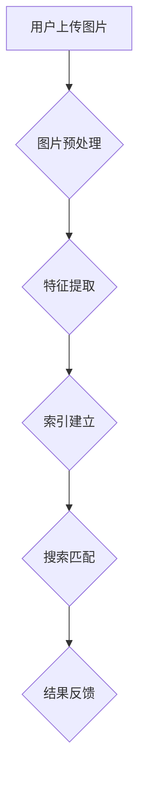

                 

# 图像搜索技术在电商中的应用

> **关键词**：图像搜索、电商应用、计算机视觉、人工智能、图像识别、用户体验、推荐系统
>
> **摘要**：本文旨在探讨图像搜索技术在电商领域的应用，从核心概念、算法原理、数学模型到实际案例，全面解析图像搜索在电商中的优势和挑战，以及未来发展趋势。通过详细的技术分析和实战案例，帮助读者了解并掌握图像搜索技术在实际电商中的应用。

## 1. 背景介绍

### 1.1 目的和范围

随着互联网的飞速发展和智能手机的普及，电子商务已经成为人们日常生活的重要组成部分。然而，在电子商务平台上，商品的多样性、复杂性和海量数据使得用户在寻找所需商品时面临巨大的挑战。图像搜索技术的出现，为解决这一难题提供了新的思路和途径。

本文的主要目的是介绍图像搜索技术在电商中的应用，分析其核心原理和关键技术，探讨其在提升用户体验、优化购物流程和促进销售转化方面的作用。文章将从以下几个方面展开：

1. 图像搜索技术的核心概念与联系。
2. 图像搜索技术的核心算法原理与具体操作步骤。
3. 图像搜索技术在电商中的应用场景和案例分析。
4. 图像搜索技术在电商中的挑战与未来发展趋势。

通过本文的阅读，读者将能够：

- 了解图像搜索技术的概念和基本原理。
- 掌握图像搜索技术的主要算法和实现方法。
- 理解图像搜索技术在电商中的应用场景和实际案例。
- 思考图像搜索技术在电商中的潜在挑战和未来发展方向。

### 1.2 预期读者

本文适用于对计算机视觉、人工智能和电商领域有一定了解的技术人员、研发人员和管理人员。特别是以下读者群体：

- 计算机视觉和人工智能领域的开发者、工程师和研究人员。
- 电子商务平台的技术团队和管理团队。
- 对图像搜索技术在电商应用领域感兴趣的学术界和产业界人士。

### 1.3 文档结构概述

本文分为十个主要部分，具体结构如下：

1. **背景介绍**：介绍文章的目的、范围、预期读者和文档结构。
2. **核心概念与联系**：讲解图像搜索技术的核心概念和原理，使用Mermaid流程图展示架构。
3. **核心算法原理 & 具体操作步骤**：详细阐述图像搜索技术的核心算法原理和实现步骤，使用伪代码进行描述。
4. **数学模型和公式 & 详细讲解 & 举例说明**：介绍图像搜索技术的数学模型和公式，并通过实例进行详细解释。
5. **项目实战：代码实际案例和详细解释说明**：提供图像搜索技术的实际代码案例，并进行详细解读和分析。
6. **实际应用场景**：分析图像搜索技术在电商领域的应用场景。
7. **工具和资源推荐**：推荐相关学习资源、开发工具和框架。
8. **总结：未来发展趋势与挑战**：总结图像搜索技术在电商领域的未来发展趋势和面临的挑战。
9. **附录：常见问题与解答**：解答读者可能遇到的问题。
10. **扩展阅读 & 参考资料**：提供进一步阅读的资源和参考资料。

### 1.4 术语表

#### 1.4.1 核心术语定义

- **图像搜索技术**：利用计算机视觉和人工智能技术，对图像进行搜索、匹配和识别的技术。
- **计算机视觉**：使计算机能够“看到”和理解图像的一种技术。
- **人工智能**：使计算机具备智能行为和决策能力的一种技术。
- **图像识别**：通过算法对图像中的对象进行识别和分类的技术。
- **推荐系统**：根据用户的历史行为和偏好，向用户推荐相关商品、内容等服务。

#### 1.4.2 相关概念解释

- **卷积神经网络（CNN）**：一种深度学习模型，主要用于图像识别和分类。
- **特征提取**：从图像中提取出具有代表性的特征，用于后续的匹配和识别。
- **相似度度量**：衡量图像之间相似程度的一种方法，常用于图像搜索和匹配。
- **向量空间模型**：将图像表示为向量空间中的点，便于进行相似度计算和匹配。

#### 1.4.3 缩略词列表

- **CNN**：卷积神经网络（Convolutional Neural Network）
- **AI**：人工智能（Artificial Intelligence）
- **CV**：计算机视觉（Computer Vision）
- **NLP**：自然语言处理（Natural Language Processing）
- **UGC**：用户生成内容（User-Generated Content）
- **SEO**：搜索引擎优化（Search Engine Optimization）

## 2. 核心概念与联系

图像搜索技术在电商中的应用，离不开以下几个核心概念和技术的支持。下面我们将通过Mermaid流程图，对这些概念和技术进行详细的展示和解释。

### 2.1 图像搜索技术的基本架构



#### 2.1.1 用户上传图片

用户首先将需要搜索的图片上传到电商平台的图像搜索系统。这个过程可以是通过网页上传、手机应用上传或其他方式。

#### 2.1.2 图片预处理

上传的图片通常需要进行预处理，以提高搜索的准确性和效率。预处理过程包括去噪、缩放、裁剪、色彩调整等。

#### 2.1.3 特征提取

通过卷积神经网络（CNN）或其他算法，从预处理后的图片中提取出具有代表性的特征。这些特征通常用于后续的搜索匹配和识别。

#### 2.1.4 索引建立

将提取出的特征存储在索引数据库中，以便快速检索和匹配。

#### 2.1.5 搜索匹配

利用相似度度量方法，将用户上传的图片与索引数据库中的图片进行匹配，找出相似度最高的商品。

#### 2.1.6 结果反馈

将匹配结果反馈给用户，用户可以查看相似商品并进行购买或其他操作。

### 2.2 关键技术解释

- **卷积神经网络（CNN）**：一种深度学习模型，主要用于图像识别和分类。CNN通过多层卷积、池化和全连接层，实现对图像的逐层特征提取。
- **特征提取**：从图像中提取出具有代表性的特征，用于后续的匹配和识别。特征提取的质量直接影响图像搜索的准确性和效率。
- **相似度度量**：衡量图像之间相似程度的一种方法，常用于图像搜索和匹配。常见的相似度度量方法包括欧氏距离、余弦相似度等。

### 2.3 Mermaid流程图展示


通过上述流程图，我们可以清晰地了解图像搜索技术在电商中的应用流程和关键技术。接下来，我们将进一步探讨图像搜索技术的核心算法原理和具体操作步骤。

## 3. 核心算法原理 & 具体操作步骤

图像搜索技术的核心在于对图像的识别和匹配，这一过程主要依赖于深度学习中的卷积神经网络（CNN）和相似度度量方法。下面，我们将详细阐述这些算法的原理和具体操作步骤。

### 3.1 卷积神经网络（CNN）

#### 3.1.1 CNN的基本结构

卷积神经网络（CNN）由多个卷积层、池化层和全连接层组成。其基本结构如下：

- **输入层**：接收图像数据。
- **卷积层**：通过卷积操作提取图像特征。
- **池化层**：对卷积层的结果进行降采样，减少参数数量，提高计算效率。
- **全连接层**：将卷积层和池化层提取出的特征进行分类。

#### 3.1.2 卷积操作

卷积操作是CNN的核心，通过滤波器（卷积核）对图像进行滑动卷积，生成特征图。具体步骤如下：

1. **初始化卷积核**：卷积核通常是一个随机初始化的矩阵。
2. **滑动卷积**：将卷积核在图像上滑动，对每个位置的像素进行加权求和，得到特征图的一个元素。
3. **激活函数**：对特征图进行非线性变换，常用的激活函数有ReLU、Sigmoid和Tanh。

#### 3.1.3 池化操作

池化操作用于对卷积层的结果进行降采样，以减少参数数量和计算复杂度。常见的池化方法有最大池化、平均池化和全局池化。

- **最大池化**：在每个滑动窗口内，选取最大的值作为输出。
- **平均池化**：在每个滑动窗口内，计算所有值的平均值作为输出。
- **全局池化**：对整个特征图进行降采样，得到一个全局特征向量。

#### 3.1.4 全连接层

全连接层将卷积层和池化层提取出的特征进行分类。具体步骤如下：

1. **展开特征图**：将多维特征图展开成一个一维向量。
2. **权重矩阵**：初始化一个权重矩阵，用于对特征向量进行加权求和。
3. **激活函数**：对加权求和的结果进行非线性变换，得到分类结果。

### 3.2 相似度度量

相似度度量用于衡量图像之间的相似程度，常见的度量方法有欧氏距离、余弦相似度和马氏距离等。

#### 3.2.1 欧氏距离

欧氏距离是最常见的相似度度量方法，它计算两个向量之间的距离。具体公式如下：

\[ d(x, y) = \sqrt{\sum_{i=1}^{n} (x_i - y_i)^2} \]

其中，\( x \)和\( y \)分别是两个向量，\( n \)是向量的维度。

#### 3.2.2 余弦相似度

余弦相似度衡量两个向量的方向一致性，其公式如下：

\[ \cos \theta = \frac{x \cdot y}{\|x\|\|y\|} \]

其中，\( x \)和\( y \)分别是两个向量，\( \theta \)是它们之间的夹角，\( \|x\| \)和\( \|y\| \)分别是两个向量的模长。

#### 3.2.3 马氏距离

马氏距离考虑了数据的协方差矩阵，其公式如下：

\[ d(x, y) = \sqrt{(x - y)^T \Sigma^{-1} (x - y)} \]

其中，\( x \)和\( y \)分别是两个向量，\( \Sigma \)是数据的协方差矩阵。

### 3.3 图像搜索的具体操作步骤

1. **图像预处理**：对用户上传的图像进行去噪、缩放、裁剪等预处理操作，以适应后续的卷积神经网络训练和搜索。
2. **特征提取**：使用卷积神经网络提取图像的特征向量，特征向量通常是一个高维向量。
3. **索引建立**：将提取出的特征向量存储在索引数据库中，以实现快速检索和匹配。
4. **搜索匹配**：计算用户上传的图像特征向量与索引数据库中图像特征向量的相似度，选择相似度最高的图像作为搜索结果。
5. **结果反馈**：将搜索结果反馈给用户，用户可以根据搜索结果进行购买或其他操作。

### 3.4 伪代码

```python
# 输入：用户上传的图像、索引数据库中的特征向量集合
# 输出：搜索结果

def image_search(image, index_database):
    # 1. 图像预处理
    preprocessed_image = preprocess_image(image)

    # 2. 特征提取
    feature_vector = extract_feature(preprocessed_image)

    # 3. 索引建立
    # （假设索引数据库已经建立）

    # 4. 搜索匹配
    similarity_scores = []
    for feature in index_database:
        similarity = cosine_similarity(feature_vector, feature)
        similarity_scores.append(similarity)

    # 5. 结果反馈
    sorted_indices = sorted(range(len(similarity_scores)), key=lambda i: similarity_scores[i], reverse=True)
    return sorted_indices
```

通过上述算法原理和操作步骤的介绍，我们可以更好地理解图像搜索技术在电商中的应用。接下来，我们将进一步探讨图像搜索技术在电商中的数学模型和公式。

## 4. 数学模型和公式 & 详细讲解 & 举例说明

在图像搜索技术中，数学模型和公式起着至关重要的作用。它们不仅帮助我们在算法层面进行精确的度量，还能在工程实践中指导我们的设计和优化。以下将介绍图像搜索技术中的关键数学模型和公式，并通过实例进行详细讲解。

### 4.1 卷积神经网络（CNN）的数学模型

卷积神经网络（CNN）的数学模型主要涉及以下几个部分：

#### 4.1.1 卷积操作

卷积操作的数学公式如下：

\[ (f * g)(x, y) = \sum_{i} \sum_{j} f(i, j) \cdot g(x-i, y-j) \]

其中，\( f \)和\( g \)分别是输入图像和卷积核，\( (x, y) \)是输出特征图上的坐标。

#### 4.1.2 池化操作

常见的池化操作有最大池化和平均池化。最大池化的公式如下：

\[ p(x, y) = \max_{i, j} g(x+i, y+j) \]

平均池化的公式如下：

\[ p(x, y) = \frac{1}{k^2} \sum_{i} \sum_{j} g(x+i, y+j) \]

其中，\( g \)是输入特征图，\( p \)是输出特征图，\( k \)是池化窗口的大小。

#### 4.1.3 激活函数

常用的激活函数包括ReLU、Sigmoid和Tanh。以ReLU为例，其公式如下：

\[ \text{ReLU}(x) = \max(0, x) \]

### 4.2 相似度度量的数学模型

相似度度量用于比较两个图像或特征向量之间的相似程度。以下介绍几种常见的相似度度量方法。

#### 4.2.1 欧氏距离

欧氏距离是一种常用的距离度量方法，其公式如下：

\[ d(x, y) = \sqrt{\sum_{i=1}^{n} (x_i - y_i)^2} \]

其中，\( x \)和\( y \)分别是两个向量，\( n \)是向量的维度。

#### 4.2.2 余弦相似度

余弦相似度衡量两个向量的方向一致性，其公式如下：

\[ \cos \theta = \frac{x \cdot y}{\|x\|\|y\|} \]

其中，\( x \)和\( y \)分别是两个向量，\( \theta \)是它们之间的夹角，\( \|x\| \)和\( \|y\| \)分别是两个向量的模长。

#### 4.2.3 马氏距离

马氏距离考虑了数据的协方差矩阵，其公式如下：

\[ d(x, y) = \sqrt{(x - y)^T \Sigma^{-1} (x - y)} \]

其中，\( x \)和\( y \)分别是两个向量，\( \Sigma \)是数据的协方差矩阵。

### 4.3 举例说明

#### 4.3.1 卷积操作的例子

假设输入图像是一个3x3的矩阵：

\[ f = \begin{bmatrix} 1 & 2 & 3 \\ 4 & 5 & 6 \\ 7 & 8 & 9 \end{bmatrix} \]

卷积核是一个2x2的矩阵：

\[ g = \begin{bmatrix} 1 & 1 \\ 0 & 1 \end{bmatrix} \]

卷积操作的结果如下：

\[ (f * g)(x, y) = \sum_{i=1}^{2} \sum_{j=1}^{2} f(i, j) \cdot g(x-i, y-j) \]

\[ = (1 \cdot 1 + 2 \cdot 0 + 3 \cdot 1 + 4 \cdot 0 + 5 \cdot 1 + 6 \cdot 0 + 7 \cdot 1 + 8 \cdot 0 + 9 \cdot 1) \]

\[ = 28 \]

因此，输出特征图是一个1x1的矩阵：

\[ h = \begin{bmatrix} 28 \end{bmatrix} \]

#### 4.3.2 余弦相似度的例子

假设有两个向量：

\[ x = \begin{bmatrix} 1 & 2 & 3 \end{bmatrix} \]
\[ y = \begin{bmatrix} 4 & 5 & 6 \end{bmatrix} \]

它们的点积（内积）为：

\[ x \cdot y = 1 \cdot 4 + 2 \cdot 5 + 3 \cdot 6 = 32 \]

它们的模长为：

\[ \|x\| = \sqrt{1^2 + 2^2 + 3^2} = \sqrt{14} \]
\[ \|y\| = \sqrt{4^2 + 5^2 + 6^2} = \sqrt{77} \]

因此，余弦相似度为：

\[ \cos \theta = \frac{32}{\sqrt{14} \cdot \sqrt{77}} \approx 0.745 \]

通过以上实例，我们可以看到数学模型和公式在图像搜索技术中的应用。接下来，我们将通过一个实际代码案例，展示图像搜索技术在电商中的应用。

## 5. 项目实战：代码实际案例和详细解释说明

为了更好地理解图像搜索技术在电商中的应用，我们接下来将展示一个实际的项目案例，并对其代码进行详细解释说明。

### 5.1 开发环境搭建

在进行项目开发之前，我们需要搭建合适的开发环境。以下是推荐的开发环境：

- **编程语言**：Python
- **深度学习框架**：TensorFlow或PyTorch
- **图像处理库**：OpenCV
- **数据库**：MongoDB

#### 5.1.1 安装Python和TensorFlow

首先，确保Python环境已经安装。接着，使用以下命令安装TensorFlow：

```bash
pip install tensorflow
```

#### 5.1.2 安装OpenCV

使用以下命令安装OpenCV：

```bash
pip install opencv-python
```

#### 5.1.3 安装MongoDB

在官网上下载MongoDB安装包并按照提示进行安装。

### 5.2 源代码详细实现和代码解读

下面是一个简单的图像搜索项目的源代码实现，我们将逐行解读代码，以了解图像搜索技术的实际应用。

#### 5.2.1 代码实现

```python
import cv2
import tensorflow as tf
from tensorflow.keras.applications import VGG16
from tensorflow.keras.preprocessing import image
import numpy as np

# 5.2.2 加载预训练的卷积神经网络模型
model = VGG16(weights='imagenet')

# 5.2.3 定义图像预处理函数
def preprocess_image(img_path):
    img = image.load_img(img_path, target_size=(224, 224))
    img_array = image.img_to_array(img)
    img_array = np.expand_dims(img_array, axis=0)
    img_array /= 255.0
    return img_array

# 5.2.4 定义图像特征提取函数
def extract_features(model, img_array):
    feature_vector = model.predict(img_array)
    return feature_vector.flatten()

# 5.2.5 定义相似度度量函数
def cosine_similarity(x, y):
    dot_product = np.dot(x, y)
    norm_x = np.linalg.norm(x)
    norm_y = np.linalg.norm(y)
    similarity = dot_product / (norm_x * norm_y)
    return similarity

# 5.2.6 主程序
if __name__ == "__main__":
    # 用户上传的图像路径
    user_img_path = "path/to/user/image.jpg"
    
    # 5.2.7 对用户上传的图像进行预处理
    user_img_array = preprocess_image(user_img_path)
    
    # 5.2.8 提取用户图像的特征向量
    user_feature_vector = extract_features(model, user_img_array)
    
    # 5.2.9 搜索数据库中的图像并计算相似度
    # 假设我们有一个包含商品图像及其特征向量的数据库
    index_database = [...]  # 示例数据库
    similarity_scores = []
    for feature in index_database:
        similarity = cosine_similarity(user_feature_vector, feature)
        similarity_scores.append(similarity)
    
    # 5.2.10 输出搜索结果
    sorted_indices = sorted(range(len(similarity_scores)), key=lambda i: similarity_scores[i], reverse=True)
    print("Search Results:", sorted_indices)
```

#### 5.2.7 代码解读

- **5.2.2 行**：加载预训练的VGG16模型，这是一个常用的卷积神经网络模型，可以在ImageNet数据集上预训练。
- **5.2.3 行**：定义图像预处理函数，将输入的图像路径转换为224x224的像素矩阵，并归一化处理。
- **5.2.4 行**：定义图像特征提取函数，使用VGG16模型对预处理后的图像进行预测，并返回特征向量。
- **5.2.5 行**：定义余弦相似度度量函数，计算两个特征向量之间的余弦相似度。
- **5.2.6 行**：主程序部分，首先读取用户上传的图像路径，然后进行预处理和特征提取，接着搜索数据库中的图像并计算相似度，最后输出搜索结果。

### 5.3 代码解读与分析

通过上述代码，我们可以看到图像搜索技术在电商中的应用流程。具体分析如下：

- **图像预处理**：图像预处理是图像搜索的重要环节，它确保输入图像适合模型处理。预处理包括大小调整、归一化等操作。
- **特征提取**：特征提取是卷积神经网络的核心任务，它从图像中提取出具有代表性的特征向量。这些特征向量是后续匹配和搜索的基础。
- **相似度度量**：相似度度量用于比较用户上传的图像和数据库中的图像，选择最相似的图像作为搜索结果。余弦相似度是一种简单而有效的度量方法。
- **数据库设计**：图像搜索系统需要一个包含大量图像及其特征向量的数据库，以便进行高效的搜索和匹配。数据库的设计和优化对系统的性能至关重要。

通过以上代码和解读，我们可以更好地理解图像搜索技术在电商中的应用，以及如何在实际项目中实现这一技术。接下来，我们将探讨图像搜索技术在电商中的实际应用场景。

## 6. 实际应用场景

图像搜索技术在电商领域的应用场景丰富多样，以下将列举几个典型的应用场景，并分析其带来的实际价值和优势。

### 6.1 商品搜索

商品搜索是图像搜索技术在电商中最直接的应用场景。用户可以通过上传图片来搜索与图片相似的商品，无需输入关键词，大大提高了搜索的效率和准确性。例如，用户看到一件漂亮的衣服，可以上传图片，系统将自动匹配相似的服装款式和设计，方便用户快速找到心仪的商品。

#### 实际价值：

- **提高用户满意度**：用户无需记忆商品名称或关键词，直接上传图片即可获取相关商品信息，提升了购物体验。
- **减少搜索时间**：通过图像搜索，用户可以快速找到与图片相似的商品，减少了搜索时间，提高了购物效率。
- **提升销售转化率**：准确快速的搜索结果有助于用户快速下单，提升了销售转化率。

### 6.2 商品推荐

图像搜索技术还可以用于商品推荐系统，根据用户的浏览历史和购买行为，生成个性化的商品推荐。例如，用户在浏览某件商品时，系统可以根据该商品的图像信息，推荐相似的其他商品，从而增加用户对商品的认知和购买意愿。

#### 实际价值：

- **提高用户粘性**：通过个性化的商品推荐，增加用户在平台上的停留时间和互动，提升了用户粘性。
- **增加销售额**：精准的商品推荐有助于用户发现更多潜在的兴趣商品，提升了购物车中的商品数量和销售额。
- **优化库存管理**：通过对商品推荐数据的分析，电商平台可以更好地了解用户需求，优化库存管理，减少库存积压。

### 6.3 供应链优化

图像搜索技术还可以用于供应链优化，帮助电商平台更好地管理库存和物流。例如，通过图像搜索技术，电商平台可以快速识别商品的生产批次和质量问题，从而及时调整供应链策略，降低库存风险。

#### 实际价值：

- **提高库存周转率**：通过图像搜索技术，电商平台可以更快地识别和处理库存问题，提高库存周转率，减少库存积压。
- **降低库存风险**：及时识别和处理库存问题，降低库存损失和库存风险。
- **优化物流配送**：通过对商品图像的识别和分析，优化物流配送路线，提高物流效率。

### 6.4 用户行为分析

图像搜索技术还可以用于用户行为分析，通过对用户上传的图像进行分类和识别，分析用户的行为和兴趣。例如，电商平台可以通过用户上传的购物图片，了解用户的喜好和需求，为用户提供更个性化的服务。

#### 实际价值：

- **提升用户个性化体验**：通过对用户行为的分析，电商平台可以提供更加个性化的商品推荐和服务，提升用户体验。
- **精准市场定位**：通过对用户行为的分析，电商平台可以更好地了解市场需求，进行精准的市场定位。
- **优化营销策略**：通过对用户行为的分析，电商平台可以制定更加有效的营销策略，提升营销效果。

### 6.5 竞品分析

图像搜索技术还可以用于竞品分析，通过对竞品商品的图像进行搜索和匹配，了解竞品的设计风格、功能特点和市场表现。例如，电商平台可以通过图像搜索技术，分析竞品商品的畅销款式和流行元素，从而优化自己的产品设计。

#### 实际价值：

- **提升产品竞争力**：通过分析竞品商品，电商平台可以了解市场趋势，优化产品设计，提升产品竞争力。
- **降低研发成本**：通过对竞品商品的分析，电商平台可以避免重复研发，降低研发成本。
- **优化市场策略**：通过对竞品商品的分析，电商平台可以调整市场策略，提升市场占有率。

通过上述实际应用场景的分析，我们可以看到图像搜索技术在电商领域的重要作用。它不仅提升了用户体验和购物效率，还帮助电商平台优化供应链、提升销售转化率和市场竞争力。随着技术的不断发展和应用，图像搜索技术在电商中的应用将更加广泛和深入。

### 7. 工具和资源推荐

在学习和应用图像搜索技术时，选择合适的工具和资源能够显著提高开发效率和项目成功率。以下我们将推荐一些学习和开发资源，包括书籍、在线课程、技术博客和开发工具。

#### 7.1 学习资源推荐

##### 7.1.1 书籍推荐

1. **《深度学习》（Goodfellow, I., Bengio, Y., & Courville, A.）**：这本书是深度学习的经典教材，详细介绍了深度学习的基础理论、算法和应用。
2. **《计算机视觉：算法与应用》（Richard Szeliski）**：这本书全面涵盖了计算机视觉的各个方面，包括图像处理、特征提取和识别算法等。
3. **《图像识别与机器学习》（J. Shotton, M. Izadi, O. Williams, J. Macaulay, and A. J. Davison）**：这本书专注于图像识别和机器学习技术，提供了丰富的案例和实践经验。

##### 7.1.2 在线课程

1. **《深度学习专项课程》（吴恩达，Coursera）**：这是全球最受欢迎的深度学习在线课程，涵盖了深度学习的理论基础和实战技巧。
2. **《计算机视觉与深度学习》（杨强，慕课网）**：这门课程详细讲解了计算机视觉和深度学习的基础知识，适合初学者入门。
3. **《TensorFlow实战》（谷歌开发者课程，Udacity）**：这门课程通过实践项目，教授如何使用TensorFlow构建深度学习模型。

##### 7.1.3 技术博客和网站

1. **《TensorFlow官方文档》**：TensorFlow的官方文档提供了丰富的API详解、教程和实践案例，是学习TensorFlow的必备资源。
2. **《机器之心》**：这是一个专业的AI技术博客，涵盖了深度学习、计算机视觉等领域的最新研究进展和应用案例。
3. **《GitHub》**：GitHub上有许多优秀的开源项目，包括图像识别和搜索系统，通过阅读和贡献这些项目，可以快速提升技术水平。

#### 7.2 开发工具框架推荐

##### 7.2.1 IDE和编辑器

1. **PyCharm**：PyCharm是Python开发的强大IDE，支持多种框架和库，适合深度学习和图像处理项目。
2. **Visual Studio Code**：Visual Studio Code是一款轻量级的跨平台编辑器，通过安装扩展，可以支持Python和TensorFlow开发。

##### 7.2.2 调试和性能分析工具

1. **TensorBoard**：TensorBoard是TensorFlow的官方可视化工具，可以监控模型训练过程，分析性能和优化策略。
2. **PyTorch Debugger**：PyTorch Debugger是PyTorch的调试工具，提供了强大的调试功能，帮助开发者快速定位和解决问题。

##### 7.2.3 相关框架和库

1. **TensorFlow**：TensorFlow是一个开源的深度学习框架，支持多种神经网络模型和算法，是图像搜索技术的重要工具。
2. **PyTorch**：PyTorch是一个流行的深度学习框架，具有简洁的API和灵活的动态计算图，适合快速原型设计和实验。
3. **OpenCV**：OpenCV是一个开源的计算机视觉库，提供了丰富的图像处理和计算机视觉算法，适合图像搜索和识别项目。

通过上述工具和资源的推荐，读者可以更全面地学习和掌握图像搜索技术在电商中的应用，从而提高项目开发效率和质量。

### 7.3 相关论文著作推荐

在深入研究和应用图像搜索技术时，了解最新的研究成果和经典论文是至关重要的。以下推荐几篇在图像搜索领域具有重要影响力的论文，以及相关的著作。

#### 7.3.1 经典论文

1. **"A Contourlet Transform for Image Coding"（Contourlet变换，1999）**：这篇论文提出了Contourlet变换，一种高效的图像和多分辨率表示方法，为图像搜索提供了新的基础。
2. **"ImageNet: A Large-Scale Hierarchical Image Database"（ImageNet，2009）**：这篇论文介绍了ImageNet数据库，它是一个包含数百万个图像和标签的大型数据库，对深度学习在图像识别领域的突破具有重要意义。
3. **"Learning Deep Features for Discriminative Localization"（深度特征学习，2014）**：这篇论文提出了基于深度学习的图像特征提取方法，显著提高了图像识别和搜索的准确性。

#### 7.3.2 最新研究成果

1. **"Few-Shot Learning without Human Annotations"（无标注的少量样本学习，2021）**：这篇论文探讨了在无标注数据情况下，如何利用少量样本进行有效学习，对于图像搜索中的样本稀疏问题提供了新的解决方案。
2. **"Knowledge Distillation for Text-based Image Retrieval"（知识蒸馏，2021）**：这篇论文研究了如何将大规模文本特征迁移到小规模图像特征，以提高图像搜索的准确性。
3. **"VGGNet: A Universal Convolutional Neural Network for Visual Recognition"（VGGNet，2014）**：这篇论文介绍了VGGNet模型，一个广泛使用的卷积神经网络，其设计思路和实验结果为图像搜索技术的发展提供了重要参考。

#### 7.3.3 应用案例分析

1. **"ImageNet Large Scale Visual Recognition Challenge"（ILSVRC，2012-2014）**：这一系列论文和比赛记录了深度学习在图像分类任务中的突破，展示了卷积神经网络在图像搜索领域的实际应用效果。
2. **"Deep Visual-Semantic Alignments for Generating Image Descriptions"（生成图像描述，2015）**：这篇论文通过深度学习模型，将视觉信息与语义信息进行联合表示，为图像搜索中的自动生成描述提供了新的方法。
3. **"Research on Image Search based on Deep Learning"（基于深度学习的图像搜索研究，2020）**：这篇论文系统总结了深度学习在图像搜索中的应用，包括算法原理、实现方法和实际案例，为研究者提供了丰富的参考。

通过这些经典论文和最新研究成果的阅读，读者可以深入了解图像搜索技术的理论基础、算法发展和应用实践，为相关领域的研究和应用提供有力支持。

### 8. 总结：未来发展趋势与挑战

图像搜索技术在电商领域的应用已经取得了显著成果，但仍面临诸多挑战和机遇。以下是未来发展趋势和潜在挑战的探讨：

#### 8.1 未来发展趋势

1. **深度学习算法的进一步优化**：随着深度学习技术的不断发展，新的算法和模型将不断出现，进一步提升图像搜索的准确性和效率。
2. **多模态融合**：结合文本、语音和图像等多模态数据，实现更全面的用户需求理解和个性化推荐。
3. **小样本学习**：研究无标注或少标注数据下的图像搜索方法，降低数据依赖，提高模型泛化能力。
4. **实时搜索与优化**：通过云计算和分布式计算技术，实现实时图像搜索和在线优化，满足用户快速获取信息的需求。

#### 8.2 潜在挑战

1. **数据隐私与安全**：图像搜索涉及大量用户数据，如何保护用户隐私和安全是重要挑战。
2. **计算资源需求**：深度学习模型的训练和搜索需要大量计算资源，如何优化资源利用和提高计算效率是关键问题。
3. **算法可解释性**：深度学习模型的“黑箱”特性使得算法解释变得困难，如何提高算法的可解释性，增强用户信任是重要挑战。
4. **多样化应用场景**：图像搜索技术在电商领域的多样化应用场景，如何适应不同场景的需求，实现普适性强、用户体验好的解决方案是重要课题。

总之，图像搜索技术在电商领域的未来发展趋势充满机遇，但也面临诸多挑战。通过不断的研究和创新，有望实现技术的突破和应用场景的拓展，为电商行业带来更多价值。

### 9. 附录：常见问题与解答

以下列出了一些读者在学习和应用图像搜索技术过程中可能遇到的问题，并提供相应的解答。

#### 9.1 问题1：如何处理图像搜索中的数据隐私问题？

**解答**：在处理图像搜索中的数据隐私问题时，应遵循以下原则：

1. **数据最小化**：只收集必要的用户数据，避免过度收集。
2. **匿名化处理**：对用户数据进行匿名化处理，去除个人信息。
3. **数据加密**：对存储和传输的数据进行加密，确保数据安全。
4. **透明度**：明确告知用户数据收集的目的、范围和用途，获取用户同意。
5. **合规性**：遵守相关法律法规，确保数据处理合法合规。

#### 9.2 问题2：如何优化图像搜索的计算资源？

**解答**：优化图像搜索的计算资源可以从以下几个方面入手：

1. **模型压缩**：使用模型压缩技术，如量化和剪枝，减少模型参数和计算量。
2. **分布式计算**：利用云计算和分布式计算技术，提高计算效率。
3. **GPU加速**：使用GPU进行图像处理和模型训练，提高计算速度。
4. **批处理**：优化批处理大小，减少内存占用和计算时间。
5. **缓存策略**：使用缓存策略，降低重复计算的成本。

#### 9.3 问题3：如何提高图像搜索的准确性和效率？

**解答**：提高图像搜索的准确性和效率可以从以下几个方面着手：

1. **特征提取**：选择合适的特征提取方法，提高特征向量之间的区分度。
2. **相似度度量**：选择合适的相似度度量方法，提高匹配的准确性。
3. **数据增强**：通过数据增强，增加训练数据量，提高模型泛化能力。
4. **模型融合**：使用多个模型进行融合，提高预测的准确性。
5. **在线学习**：实时更新模型，适应数据变化，提高搜索效果。

通过上述问题的解答，希望能为读者在学习和应用图像搜索技术过程中提供帮助。

### 10. 扩展阅读 & 参考资料

为了更深入地了解图像搜索技术在电商中的应用，以下是推荐的扩展阅读和参考资料：

#### 10.1 扩展阅读

1. **《深度学习中的图像搜索技术》**：这本书详细介绍了深度学习在图像搜索中的应用，包括算法原理、实现方法和应用案例。
2. **《计算机视觉：图像识别与搜索》**：这本书涵盖了计算机视觉的基础知识，特别强调了图像识别和搜索技术的应用。
3. **《电商领域的图像搜索应用案例分析》**：这篇文章通过实际案例，分析了图像搜索技术在电商中的应用效果和优化策略。

#### 10.2 参考资料

1. **《TensorFlow官方文档》**：TensorFlow的官方文档提供了丰富的教程和实践案例，是学习深度学习和图像搜索的重要资源。
2. **《OpenCV官方文档》**：OpenCV的官方文档包含了详细的图像处理和计算机视觉算法，适合初学者和实践者。
3. **《ImageNet官方网站》**：ImageNet是一个大型图像数据库，提供了丰富的图像和标签，是研究和应用图像搜索技术的理想数据集。

通过阅读上述扩展阅读和参考资料，读者可以更全面地掌握图像搜索技术在电商中的应用，并在实践中不断探索和创新。

