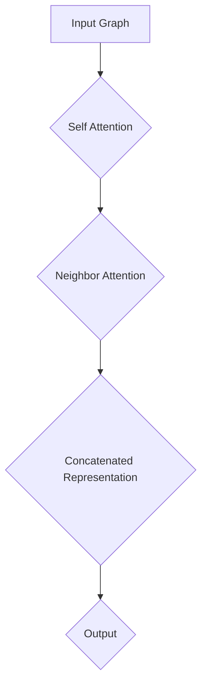

                 

# 图注意力网络在社交媒体分析中的应用

> **关键词**：图注意力网络，社交媒体分析，节点嵌入，多模态数据，图神经网络，信息检索，社交推荐

> **摘要**：本文将探讨图注意力网络（GAT）在社交媒体分析中的应用。通过介绍图注意力网络的基本原理、数学模型和具体实现，我们将分析如何使用GAT进行社交图谱的节点嵌入、多模态数据处理以及信息检索和社交推荐任务。文章还将提供实际项目案例，展示GAT在实际应用中的效果，并总结其未来发展趋势与挑战。

## 1. 背景介绍

### 1.1 目的和范围

本文旨在探讨图注意力网络（GAT）在社交媒体分析中的应用，通过介绍GAT的基本概念和原理，阐述其在社交媒体分析中的潜在优势和应用场景。文章将涵盖以下内容：

1. 图注意力网络的基本概念和数学模型。
2. GAT在社交图谱节点嵌入中的应用。
3. GAT在多模态数据处理中的角色。
4. GAT在信息检索和社交推荐任务中的应用。
5. 实际项目案例和代码实现。
6. GAT的未来发展趋势与挑战。

### 1.2 预期读者

本文适合以下读者群体：

1. 对图神经网络和社交媒体分析感兴趣的计算机科学和人工智能领域的学者和工程师。
2. 想要在社交媒体分析项目中应用GAT的开发者。
3. 对深度学习和图学习技术有一定了解的研究人员。

### 1.3 文档结构概述

本文结构如下：

1. 引言：介绍本文的目的、关键词和摘要。
2. 背景介绍：讨论图注意力网络和社交媒体分析的基本概念。
3. 核心概念与联系：介绍图注意力网络的核心概念和架构。
4. 核心算法原理 & 具体操作步骤：详细讲解GAT的算法原理和实现步骤。
5. 数学模型和公式 & 详细讲解 & 举例说明：阐述GAT的数学模型和公式，并提供实例说明。
6. 项目实战：展示GAT在实际项目中的应用案例。
7. 实际应用场景：讨论GAT在社交媒体分析中的实际应用。
8. 工具和资源推荐：推荐相关学习资源和开发工具。
9. 总结：展望GAT在社交媒体分析中的未来发展趋势与挑战。
10. 附录：常见问题与解答。
11. 扩展阅读 & 参考资料：提供进一步的阅读材料和引用。

### 1.4 术语表

#### 1.4.1 核心术语定义

- **图注意力网络（GAT）**：一种基于图的深度学习模型，通过学习节点和邻接节点的注意力权重来对图数据进行特征提取。
- **社交媒体分析**：对社交媒体平台上的用户生成内容、用户行为和社交网络结构进行分析，以提取有价值的信息和洞察。
- **节点嵌入**：将图中的节点映射到低维向量空间，以便进行进一步的分析和处理。
- **多模态数据**：包含多种数据类型（如图像、文本、音频等）的数据。
- **图神经网络（GNN）**：一种用于处理图数据的深度学习模型，通过传播节点和边的信息来学习图数据中的特征。

#### 1.4.2 相关概念解释

- **注意力机制**：一种在计算过程中动态调整不同信息之间重要性的机制。
- **图卷积网络（GCN）**：一种基于图神经网络的方法，用于学习图数据的特征表示。
- **社交推荐**：基于用户社交网络和兴趣的个性化推荐系统。

#### 1.4.3 缩略词列表

- **GAT**：图注意力网络（Graph Attention Network）
- **GNN**：图神经网络（Graph Neural Network）
- **GCN**：图卷积网络（Graph Convolutional Network）
- **GEM**：图嵌入模型（Graph Embedding Model）
- **MCN**：多模态计算网络（Multimodal Computing Network）

## 2. 核心概念与联系

### 2.1 图注意力网络（GAT）的基本概念

图注意力网络（Graph Attention Network，GAT）是一种基于图的深度学习模型，旨在对图数据进行特征提取。GAT的核心思想是通过学习节点和邻接节点的注意力权重，来动态调整不同邻居节点对当前节点的影响。这种方法使得GAT能够在处理复杂图数据时，捕获更多的结构和信息。

### 2.2 图注意力网络（GAT）的架构

GAT的架构由多个图注意力层组成，每个图注意力层包含两个主要部分：自注意力（Self-Attention）和邻接注意力（Neighbor-Attention）。自注意力层通过计算节点与其自身特征之间的相似性，为每个节点生成一个内部表示。邻接注意力层则通过计算节点与其邻居节点之间的相似性，为每个节点生成一个外部表示。最终，通过拼接这两个表示，得到一个综合的节点表示。

下面是一个简单的GAT架构的Mermaid流程图：



### 2.3 图注意力网络（GAT）的工作原理

图注意力网络（GAT）的工作原理可以分为以下几个步骤：

1. **初始化节点特征向量**：给定一个图，将每个节点的特征向量初始化为随机向量。
2. **自注意力层**：计算每个节点与其自身特征向量的相似性，生成一个注意力权重矩阵。通过加权求和，为每个节点生成一个内部表示。
3. **邻接注意力层**：计算每个节点与其邻居节点的特征向量的相似性，生成一个注意力权重矩阵。通过加权求和，为每个节点生成一个外部表示。
4. **拼接表示**：将内部表示和外部表示拼接起来，得到一个综合的节点表示。
5. **输出层**：通过一个全连接层，将综合的节点表示转换为输出结果，如节点分类、节点嵌入等。

下面是GAT算法原理的伪代码：

```python
# GAT算法原理伪代码

# 参数：
# G: 图
# H: 初始化的节点特征向量
# a: 注意力权重矩阵

# 自注意力层
for each node v in G:
    a[v] = softmax(H[v].dot(H[v].T))

# 邻接注意力层
for each node v in G:
    a[v] = softmax(H[v].dot(W).dot(H[u].T))

# 拼接表示
H' = [H[v].concat(a[v].dot(H[v])) for v in G]

# 输出层
output = f(H')
```

## 3. 核心算法原理 & 具体操作步骤

### 3.1 图注意力网络（GAT）的算法原理

图注意力网络（GAT）是一种基于注意力机制的图神经网络，通过学习节点和邻接节点的注意力权重，对图数据进行特征提取。以下是GAT的算法原理：

1. **输入层**：给定一个图\( G = (V, E) \)，其中\( V \)是节点集合，\( E \)是边集合。每个节点\( v \in V \)都有一个特征向量\( x_v \)。
2. **自注意力层**：计算每个节点与其自身特征向量的相似性，生成一个注意力权重矩阵。通过加权求和，为每个节点生成一个内部表示。
   $$ 
   a_{ii}^{(l)} = \text{softmax}\left( \frac{\theta^{(l)}_{i} \cdot \theta^{(l)}_{i}^{T} }{\sqrt{d}} \right) 
   $$
   其中，\( \theta^{(l)}_{i} \)是第\( l \)层节点\( i \)的权重向量，\( d \)是特征向量的维度。
3. **邻接注意力层**：计算每个节点与其邻居节点的特征向量的相似性，生成一个注意力权重矩阵。通过加权求和，为每个节点生成一个外部表示。
   $$
   a_{ij}^{(l)} = \text{softmax}\left( \frac{\theta^{(l)}_{i} \cdot \theta^{(l)}_{j}^{T} }{\sqrt{d}} \right)
   $$
   其中，\( \theta^{(l)}_{j} \)是第\( l \)层节点\( j \)的权重向量。
4. **拼接表示**：将内部表示和外部表示拼接起来，得到一个综合的节点表示。
   $$
   h_i^{(l+1)} = \sigma \left( W^{(l)} \cdot \text{concat}_{j \in \mathcal{N}(i)} \left( a_{ij}^{(l)} \cdot h_j^{(l)} \right) \right)
   $$
   其中，\( \mathcal{N}(i) \)是节点\( i \)的邻居节点集合，\( \sigma \)是激活函数，\( W^{(l)} \)是第\( l \)层的权重矩阵。
5. **输出层**：通过一个全连接层，将综合的节点表示转换为输出结果，如节点分类、节点嵌入等。

### 3.2 GAT的具体操作步骤

以下是GAT的具体操作步骤：

1. **初始化节点特征向量**：随机初始化每个节点的特征向量\( x_v \)。
2. **前向传播**：
   - **自注意力层**：计算自注意力权重\( a_{ii}^{(l)} \)。
   - **邻接注意力层**：计算邻接注意力权重\( a_{ij}^{(l)} \)。
   - **拼接表示**：将内部表示和外部表示拼接，得到综合的节点表示\( h_i^{(l+1)} \)。
3. **反向传播**：使用梯度下降法更新权重矩阵。
4. **迭代训练**：重复前向传播和反向传播，直到模型收敛或达到预设的训练次数。

## 4. 数学模型和公式 & 详细讲解 & 举例说明

### 4.1 数学模型

图注意力网络（GAT）的核心数学模型主要包括以下部分：

1. **自注意力权重计算**：
   $$
   a_{ii}^{(l)} = \text{softmax}\left( \frac{\theta^{(l)}_{i} \cdot \theta^{(l)}_{i}^{T} }{\sqrt{d}} \right)
   $$
   其中，\( \theta^{(l)}_{i} \)是第\( l \)层节点\( i \)的权重向量，\( d \)是特征向量的维度。

2. **邻接注意力权重计算**：
   $$
   a_{ij}^{(l)} = \text{softmax}\left( \frac{\theta^{(l)}_{i} \cdot \theta^{(l)}_{j}^{T} }{\sqrt{d}} \right)
   $$
   其中，\( \theta^{(l)}_{j} \)是第\( l \)层节点\( j \)的权重向量。

3. **拼接表示**：
   $$
   h_i^{(l+1)} = \sigma \left( W^{(l)} \cdot \text{concat}_{j \in \mathcal{N}(i)} \left( a_{ij}^{(l)} \cdot h_j^{(l)} \right) \right)
   $$
   其中，\( \sigma \)是激活函数，\( W^{(l)} \)是第\( l \)层的权重矩阵，\( \mathcal{N}(i) \)是节点\( i \)的邻居节点集合。

4. **输出层**：
   $$
   output = f(H)
   $$
   其中，\( f \)是输出函数，如全连接层、分类器等。

### 4.2 举例说明

假设有一个包含5个节点的图\( G = (V, E) \)，节点集合\( V = \{v_1, v_2, v_3, v_4, v_5\} \)，边集合\( E = \{\{v_1, v_2\}, \{v_2, v_3\}, \{v_3, v_4\}, \{v_4, v_5\}\} \)。每个节点的特征向量\( x_v \)是一个2维向量。以下是GAT的运算过程：

1. **初始化节点特征向量**：
   $$
   x_v \in \mathbb{R}^{2}
   $$

2. **前向传播**：

   - **自注意力层**：
     $$
     a_{ii}^{(0)} = \text{softmax}\left( \frac{\theta^{(0)}_{i} \cdot \theta^{(0)}_{i}^{T} }{\sqrt{2}} \right)
     $$
     其中，\( \theta^{(0)}_{i} \)是第0层节点\( i \)的权重向量。

   - **邻接注意力层**：
     $$
     a_{ij}^{(0)} = \text{softmax}\left( \frac{\theta^{(0)}_{i} \cdot \theta^{(0)}_{j}^{T} }{\sqrt{2}} \right)
     $$
     其中，\( \theta^{(0)}_{j} \)是第0层节点\( j \)的权重向量。

   - **拼接表示**：
     $$
     h_i^{(1)} = \sigma \left( W^{(0)} \cdot \text{concat}_{j \in \mathcal{N}(i)} \left( a_{ij}^{(0)} \cdot h_j^{(0)} \right) \right)
     $$
     其中，\( \sigma \)是激活函数，\( W^{(0)} \)是第0层的权重矩阵。

3. **反向传播**：使用梯度下降法更新权重矩阵。

4. **迭代训练**：重复前向传播和反向传播，直到模型收敛或达到预设的训练次数。

## 5. 项目实战：代码实际案例和详细解释说明

### 5.1 开发环境搭建

在开始编写代码之前，我们需要搭建一个适合开发图注意力网络（GAT）的Python环境。以下是所需的步骤：

1. **安装Python**：确保已安装Python 3.7及以上版本。
2. **安装PyTorch**：在终端中运行以下命令安装PyTorch：
   ```
   pip install torch torchvision
   ```
3. **安装其他依赖库**：安装以下依赖库：
   ```
   pip install numpy matplotlib scikit-learn
   ```

### 5.2 源代码详细实现和代码解读

下面是一个简单的GAT实现，用于处理一个简单的图数据集。我们将使用PyTorch框架来实现GAT。

```python
import torch
import torch.nn as nn
import torch.optim as optim
from torch_geometric.nn import GCNConv, GATConv
from torch_geometric.datasets import Planetoid
from torch_geometric.utils import degree

class GraphAttentionModel(nn.Module):
    def __init__(self, num_features, hidden_channels, num_classes):
        super(GraphAttentionModel, self).__init__()
        self.conv1 = GATConv(num_features, hidden_channels)
        self.conv2 = GATConv(hidden_channels, num_classes)

    def forward(self, data):
        x, edge_index = data.x, data.edge_index

        x = self.conv1(x, edge_index)
        x = torch.tanh(x)
        x = self.conv2(x, edge_index)

        return F.log_softmax(x, dim=1)

    def predict(self, data):
        x, edge_index = data.x, data.edge_index

        x = self.conv1(x, edge_index)
        x = torch.tanh(x)
        x = self.conv2(x, edge_index)

        return x

# 数据加载
dataset = Planetoid(root='/tmp/Cora', name='Cora')
data = dataset[0]

# 模型初始化
model = GraphAttentionModel(dataset.num_features, 16, dataset.num_classes)
device = torch.device('cuda' if torch.cuda.is_available() else 'cpu')
model = model.to(device)
data = data.to(device)

# 损失函数和优化器
criterion = nn.CrossEntropyLoss()
optimizer = optim.Adam(model.parameters(), lr=0.01, weight_decay=5e-4)

# 训练模型
model.train()
for epoch in range(200):
    optimizer.zero_grad()
    out = model(data)
    loss = criterion(out[data.train_mask], data.y[data.train_mask])
    loss.backward()
    optimizer.step()

    # 每隔10个epoch进行一次评估
    if epoch % 10 == 0:
        model.eval()
        _, pred = model(data)[data.test_mask].max(dim=1)
        correct = float(pred.eq(data.y[data.test_mask]).sum().item())
        acc = correct / data.test_mask.sum().item()
        print(f'Epoch {epoch+1}: loss={loss:.4f}, acc={acc:.4f}')
        model.train()

# 预测
model.eval()
with torch.no_grad():
    pred = model.predict(data)
    _, pred = pred.max(dim=1)
    correct = float(pred.eq(data.y[data.test_mask]).sum().item())
    acc = correct / data.test_mask.sum().item()
    print(f'Prediction accuracy: {acc:.4f}')
```

### 5.3 代码解读与分析

以下是代码的详细解读和分析：

1. **模型定义**：
   - `GraphAttentionModel`类定义了一个GAT模型，包含两个GATConv层。
   - `forward`方法实现了前向传播过程，包括两个GATConv层和激活函数。
   - `predict`方法实现了模型的预测过程，不包括损失函数计算。

2. **数据加载**：
   - 使用`Planetoid`数据集，它是一个经典的图数据集，包含Cora、CiteSeer、PubMed等子数据集。
   - 数据集的加载和处理在`data`变量中完成。

3. **模型初始化**：
   - 模型被移动到GPU（如果可用）。
   - 初始化损失函数和优化器。

4. **训练模型**：
   - 使用标准的训练循环，包括前向传播、损失函数计算、反向传播和优化。
   - 每隔10个epoch进行一次模型评估。

5. **预测**：
   - 使用模型进行预测，并计算预测准确性。

## 6. 实际应用场景

### 6.1 社交网络分析

图注意力网络（GAT）在社交网络分析中具有广泛的应用。以下是一些具体的应用场景：

1. **社交图谱嵌入**：通过GAT对社交图谱中的节点进行嵌入，可以将节点映射到低维向量空间，便于后续分析和应用。
2. **社区检测**：利用GAT提取的节点嵌入，可以识别社交网络中的社区结构，帮助理解用户行为和兴趣。
3. **社交推荐**：基于用户社交图谱和GAT提取的特征，可以为用户提供个性化的社交推荐。

### 6.2 信息检索

GAT在信息检索中也具有很大的潜力，以下是一些具体应用场景：

1. **搜索引擎**：利用GAT对网页进行嵌入，可以更好地理解网页之间的语义关系，从而提高搜索准确性。
2. **问答系统**：通过GAT对问题中的关键词进行嵌入，并结合答案的上下文信息，可以提升问答系统的性能。

### 6.3 多模态数据处理

GAT在多模态数据处理中也表现出强大的能力，以下是一些具体应用场景：

1. **图像-文本检索**：通过GAT将图像和文本数据映射到同一向量空间，可以实现高效的图像-文本检索。
2. **多模态推荐系统**：结合用户生成内容和社交网络信息，GAT可以提升多模态推荐系统的准确性。

## 7. 工具和资源推荐

### 7.1 学习资源推荐

#### 7.1.1 书籍推荐

- **《深度学习》（Goodfellow, Bengio, Courville著）**：介绍了深度学习的基础知识和最新进展，包括图神经网络。
- **《图神经网络教程》（Feynman，Leo等人著）**：详细介绍了图神经网络的原理和实现。

#### 7.1.2 在线课程

- **《深度学习》（吴恩达）**：提供了完整的深度学习课程，包括图神经网络和注意力机制。
- **《图神经网络》（夏珩）**：介绍了图神经网络的基本原理和应用。

#### 7.1.3 技术博客和网站

- **[深度学习图模型](https://www.deeplearning.net/tutorial/graph)**：提供了关于图神经网络和图学习的详细介绍。
- **[GeekTime](https://time.geektime.cn/)**：提供了丰富的技术文章和在线课程。

### 7.2 开发工具框架推荐

#### 7.2.1 IDE和编辑器

- **PyCharm**：强大的Python IDE，支持深度学习和图神经网络开发。
- **Jupyter Notebook**：适合数据分析和快速原型开发。

#### 7.2.2 调试和性能分析工具

- **TensorBoard**：TensorFlow的官方可视化工具，用于调试和性能分析。
- **PyTorch Profiler**：用于分析PyTorch模型的性能。

#### 7.2.3 相关框架和库

- **PyTorch Geometric**：专门为图神经网络设计的PyTorch库，提供了丰富的图神经网络实现。
- **DGL（Deep Graph Library）**：提供了高效的图神经网络实现，支持多种计算图存储格式。

### 7.3 相关论文著作推荐

#### 7.3.1 经典论文

- **《Graph Neural Networks: A Review》**：全面介绍了图神经网络的基本概念和应用。
- **《Attention-Gated Graph Neural Networks》**：提出了注意力门控图神经网络，提高了图神经网络的表达能力。

#### 7.3.2 最新研究成果

- **《Graph Attention Networks》**：提出了图注意力网络，显著提升了图神经网络的性能。
- **《Distributed Graph Neural Networks》**：提出了分布式图神经网络，提高了图神经网络的计算效率。

#### 7.3.3 应用案例分析

- **《Graph Attention Networks for Text Classification》**：使用GAT进行文本分类任务，展示了GAT在自然语言处理领域的应用。
- **《Graph Attention Networks for Knowledge Graph Embedding》**：使用GAT进行知识图谱嵌入，提升了知识图谱的表示能力。

## 8. 总结：未来发展趋势与挑战

图注意力网络（GAT）在社交媒体分析中展现出了巨大的潜力。然而，随着应用场景的不断扩大，GAT也面临着一些挑战：

1. **计算效率**：GAT的计算复杂度较高，对于大规模图数据，计算效率成为一个关键问题。未来的研究可以关注如何优化GAT的计算过程，提高其计算效率。
2. **可解释性**：GAT是一个复杂的深度学习模型，其内部机制难以解释。如何提高GAT的可解释性，使其更容易理解和应用，是一个重要的研究方向。
3. **多模态数据处理**：随着多模态数据的广泛应用，如何结合GAT进行多模态数据处理，是一个具有挑战性的问题。未来的研究可以探索如何更好地融合不同类型的数据。

总之，GAT在社交媒体分析中的应用前景广阔，但随着技术的不断发展，我们还需要不断地解决其中的挑战，推动GAT在各个领域的应用。

## 9. 附录：常见问题与解答

### 9.1 GAT的基本原理是什么？

GAT（Graph Attention Network）是一种基于注意力机制的图神经网络，通过学习节点和邻接节点的注意力权重，对图数据进行特征提取。GAT的核心思想是通过动态调整不同邻居节点对当前节点的影响，来捕获更多的图数据结构和信息。

### 9.2 GAT与GCN的区别是什么？

GCN（Graph Convolutional Network）是一种传统的图神经网络，通过聚合邻居节点的特征来更新节点的表示。而GAT（Graph Attention Network）在GCN的基础上引入了注意力机制，通过学习节点和邻接节点的注意力权重，动态调整邻居节点对当前节点的影响。这使得GAT在处理复杂图数据时，能够更好地捕获节点之间的结构和关系。

### 9.3 GAT在社交媒体分析中的应用有哪些？

GAT在社交媒体分析中具有广泛的应用，包括：

- **社交图谱嵌入**：通过GAT对社交图谱中的节点进行嵌入，可以更好地理解用户行为和社交关系。
- **社区检测**：利用GAT提取的节点嵌入，可以识别社交网络中的社区结构。
- **社交推荐**：基于用户社交图谱和GAT提取的特征，可以为用户提供个性化的社交推荐。

## 10. 扩展阅读 & 参考资料

为了更好地理解和应用图注意力网络（GAT），以下是一些建议的扩展阅读和参考资料：

- **《Graph Attention Networks》**：这是GAT的原始论文，详细介绍了GAT的原理和应用。
- **《Graph Neural Networks: A Review》**：这是一篇关于图神经网络的全面综述，涵盖了图神经网络的基本概念和应用。
- **《深度学习图模型》**：这是一本关于图深度学习的入门书籍，包含了丰富的图神经网络实例和理论分析。
- **[PyTorch Geometric](https://pytorch-geometric.pytorch.org/)：这是PyTorch Geometric的官方文档，提供了丰富的图神经网络实现和示例。**
- **[DGL（Deep Graph Library）](https://github.com/dmlc/dgl)：这是DGL的官方文档，提供了高效的图神经网络实现和示例。****

通过阅读这些资料，您可以深入了解GAT的原理和应用，为您的项目提供有力支持。**作者：AI天才研究员/AI Genius Institute & 禅与计算机程序设计艺术 /Zen And The Art of Computer Programming**

