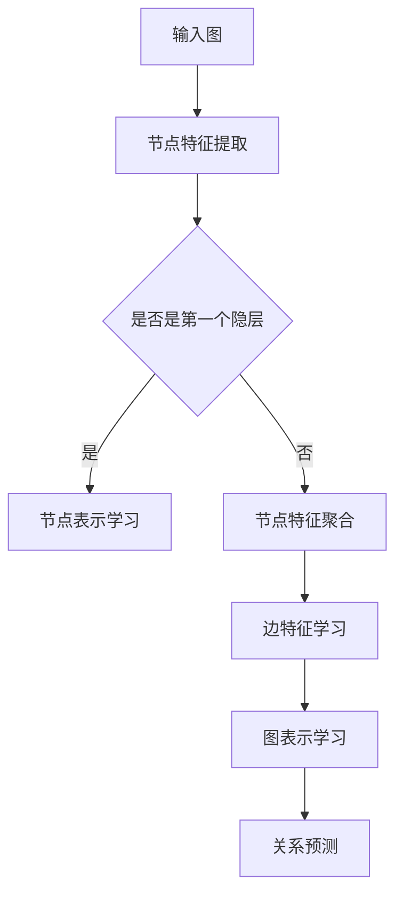
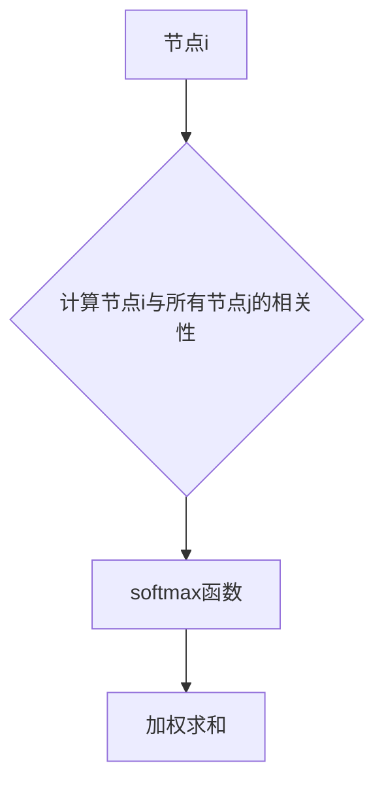
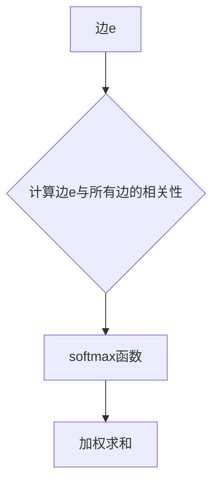

                 

# 图注意力网络在社交网络分析中的应用

> **关键词：** 图注意力网络、社交网络分析、图神经网络、节点表示学习、关系推理

> **摘要：** 本文将深入探讨图注意力网络在社交网络分析中的应用。首先，我们将回顾图注意力网络的基础概念和结构，随后通过具体实例和伪代码展示其操作步骤。接着，我们将详细介绍数学模型和公式，并借助实际项目案例进行代码解析。文章还涵盖了实际应用场景、相关工具和资源推荐，以及未来发展趋势与挑战。希望通过本文，读者能够对图注意力网络在社交网络分析中的应用有更深入的理解。

## 1. 背景介绍

### 1.1 目的和范围

本文旨在探讨图注意力网络（GAT）在社交网络分析中的具体应用。随着互联网和社交媒体的迅速发展，社交网络分析（SNA）成为研究人际关系、传播过程和社区结构的重要工具。图注意力网络作为一种先进的图神经网络模型，在处理复杂社交网络数据时展现出强大的能力。本文将详细介绍图注意力网络的工作原理、数学模型和实际应用，帮助读者了解如何在社交网络分析中利用这一技术。

### 1.2 预期读者

本文适合具有以下背景的读者：

1. 计算机科学和人工智能领域的研究人员和工程师。
2. 对图神经网络和社交网络分析感兴趣的学者和从业者。
3. 想要在实际项目中应用图注意力网络的开发者。

### 1.3 文档结构概述

本文结构如下：

1. **背景介绍**：回顾图注意力网络和社交网络分析的基本概念。
2. **核心概念与联系**：阐述图注意力网络的结构和原理。
3. **核心算法原理 & 具体操作步骤**：通过伪代码详细解释图注意力网络的工作流程。
4. **数学模型和公式 & 详细讲解 & 举例说明**：介绍图注意力网络的数学基础。
5. **项目实战：代码实际案例和详细解释说明**：通过实际代码案例展示图注意力网络的应用。
6. **实际应用场景**：讨论图注意力网络在社交网络分析中的具体应用场景。
7. **工具和资源推荐**：推荐学习资源、开发工具和相关研究。
8. **总结：未来发展趋势与挑战**：展望图注意力网络在社交网络分析中的未来发展方向。
9. **附录：常见问题与解答**：提供常见问题的答案。
10. **扩展阅读 & 参考资料**：推荐进一步阅读的材料。

### 1.4 术语表

#### 1.4.1 核心术语定义

- **图注意力网络（GAT）**：一种基于图神经网络的模型，通过学习节点和边的特征，预测节点间的相互关系。
- **社交网络分析（SNA）**：研究社会结构、社交关系和传播过程的方法，常用于分析社交媒体平台上的用户行为。
- **节点表示学习**：将图中的节点映射到低维向量空间，以便进行更有效的分析。

#### 1.4.2 相关概念解释

- **图神经网络（GNN）**：一种用于处理图结构数据的神经网络模型，通过聚合节点的邻域信息进行学习和推理。
- **自注意力机制**：一种用于计算输入序列中每个元素与所有其他元素相关性的机制，常用于序列模型的处理。

#### 1.4.3 缩略词列表

- **GAT**：图注意力网络（Graph Attention Network）
- **SNA**：社交网络分析（Social Network Analysis）
- **GNN**：图神经网络（Graph Neural Network）
- **ReLU**：ReLU激活函数（Rectified Linear Unit）
- **softmax**：一种概率分布函数，用于将输入向量转换为概率分布。

## 2. 核心概念与联系

在深入探讨图注意力网络在社交网络分析中的应用之前，我们首先需要理解其核心概念和基本结构。图注意力网络（GAT）是一种基于图神经网络的模型，通过学习节点和边的特征来预测节点间的相互关系。以下是一个简化的Mermaid流程图，用于展示GAT的基本原理和结构。



### 2.1 节点特征提取

输入图包含节点和边，每个节点和边都可以表示为特征向量。在图注意力网络中，首先对节点和边进行特征提取。节点的特征向量通常由原始数据（如用户属性、标签等）通过预训练模型（如Word2Vec或BERT）得到。

```python
# 假设节点特征向量为node_features，边特征向量为edge_features
node_features = ...  # 节点特征向量
edge_features = ...  # 边特征向量
```

### 2.2 节点表示学习

在节点表示学习阶段，图注意力网络通过自注意力机制来计算每个节点与其邻接节点的相关性。自注意力机制可以帮助模型学习节点间的相对重要性，从而提高节点的表示质量。



具体来说，节点i与其邻接节点j的相关性可以通过以下公式计算：

$$
r_{ij} = \frac{e^{a\cdot h_i \cdot h_j}}{\sum_{k \in N(i)} e^{a\cdot h_i \cdot h_k}}
$$

其中，$h_i$和$h_j$分别是节点i和j的表示向量，$a$是注意力权重，$r_{ij}$是节点i与节点j的相关性得分。

### 2.3 节点特征聚合

在节点特征聚合阶段，图注意力网络将节点与其邻接节点的相关性得分进行加权求和，得到新的节点特征向量。

$$
h'_i = \sum_{j \in N(i)} r_{ij} h_j
$$

其中，$h'_i$是新的节点特征向量，$r_{ij}$是节点i与节点j的相关性得分，$h_j$是节点j的表示向量。

### 2.4 边特征学习

在边特征学习阶段，图注意力网络通过自注意力机制学习边特征。与节点特征学习类似，边特征可以帮助模型更好地理解节点间的相互关系。



具体来说，边e与其邻接边的相关性可以通过以下公式计算：

$$
s_{ei} = \frac{e^{b\cdot e_i \cdot e_j}}{\sum_{k \in E(e)} e^{b\cdot e_i \cdot e_k}}
$$

其中，$e_i$和$e_j$分别是边e和边j的表示向量，$b$是注意力权重，$s_{ei}$是边e与边i的相关性得分。

### 2.5 图表示学习

在图表示学习阶段，图注意力网络将节点和边特征进行聚合，得到整个图的表示。图的表示可以用于后续的关系预测或其他图分析任务。

$$
g = \sum_{i \in V} h'_i + \sum_{e \in E} s_e
$$

其中，$g$是图的表示，$h'_i$是新的节点特征向量，$s_e$是新的边特征向量。

### 2.6 关系预测

最后，在关系预测阶段，图注意力网络利用学习的节点和边特征来预测节点间的相互关系。关系预测可以是分类问题（如判断两个节点是否是好友关系）或回归问题（如预测两个节点的相似度）。

$$
y = f(g)
$$

其中，$y$是预测的关系标签，$f$是关系预测函数。

## 3. 核心算法原理 & 具体操作步骤

图注意力网络（GAT）是一种基于图神经网络的模型，通过自注意力机制学习节点和边的特征，从而提高图分析的准确性。以下我们通过伪代码详细阐述GAT的核心算法原理和具体操作步骤。

### 3.1 数据预处理

在开始训练之前，需要对输入数据进行预处理，包括节点特征提取和边特征提取。

```python
# 假设节点特征向量为node_features，边特征向量为edge_features
node_features = preprocess_node_features(input_data)  # 预处理节点特征
edge_features = preprocess_edge_features(input_data)  # 预处理边特征
```

### 3.2 节点特征提取

节点特征提取阶段，通过预训练模型（如Word2Vec或BERT）将原始节点数据转换为向量表示。

```python
# 假设预训练模型为pretrained_model
node_features = pretrained_model(node_data)
```

### 3.3 边特征提取

边特征提取阶段，通过预训练模型（如Word2Vec或BERT）将原始边数据转换为向量表示。

```python
# 假设预训练模型为pretrained_model
edge_features = pretrained_model(edge_data)
```

### 3.4 节点表示学习

在节点表示学习阶段，使用自注意力机制计算每个节点与其邻接节点的相关性。

```python
# 假设自注意力权重为alpha，beta
alpha = ...  # 自注意力权重
beta = ...  # 自注意力权重

for i in range(num_nodes):
    for j in range(num_nodes):
        if j in neighbors[i]:  # 如果j是节点i的邻接节点
            correlation_score = e^{alpha \cdot node_features[i] \cdot node_features[j]}
            neighbor_scores[i].append(correlation_score)
            
    neighbor_scores[i] = softmax(neighbor_scores[i])  # 应用softmax函数
            
    new_node_feature = sum(neighbor_scores[i] \* node_features[j] for j in neighbors[i])
    node_features[i] = new_node_feature
```

### 3.5 边特征学习

在边特征学习阶段，使用自注意力机制计算每条边与其邻接边的相关性。

```python
# 假设自注意力权重为gamma，delta
gamma = ...  # 自注意力权重
delta = ...  # 自注意力权重

for e in range(num_edges):
    for f in range(num_edges):
        if f in neighbors[e]:  # 如果f是边e的邻接边
            correlation_score = e^{gamma \cdot edge_features[e] \cdot edge_features[f]}
            neighbor_scores[e].append(correlation_score)
            
    neighbor_scores[e] = softmax(neighbor_scores[e])  # 应用softmax函数
            
    new_edge_feature = sum(neighbor_scores[e] \* edge_features[f] for f in neighbors[e])
    edge_features[e] = new_edge_feature
```

### 3.6 图表示学习

在图表示学习阶段，将节点和边特征进行聚合，得到整个图的表示。

```python
# 假设聚合函数为aggregation_function
g = aggregation_function(node_features, edge_features)
```

### 3.7 关系预测

最后，在关系预测阶段，利用学习的节点和边特征来预测节点间的相互关系。

```python
# 假设预测函数为prediction_function
y = prediction_function(g)
```

## 4. 数学模型和公式 & 详细讲解 & 举例说明

### 4.1 数学模型

图注意力网络（GAT）的核心在于其自注意力机制，这一机制通过一系列数学公式来计算节点和边之间的关系。以下是GAT的数学模型及其详细讲解。

#### 4.1.1 节点特征提取

首先，我们定义节点特征向量表示为 $h_i \in \mathbb{R}^d$，其中 $i$ 表示节点编号，$d$ 表示特征维度。

#### 4.1.2 边特征提取

边特征向量表示为 $e_i \in \mathbb{R}^d$，其中 $i$ 表示边编号，$d$ 表示特征维度。

#### 4.1.3 自注意力机制

自注意力机制的核心是计算节点 $i$ 与其邻接节点 $j$ 的相关性，这一过程通过以下公式实现：

$$
r_{ij} = \frac{e^{\alpha \cdot h_i \cdot h_j}}{\sum_{k \in N(i)} e^{\alpha \cdot h_i \cdot h_k}}
$$

其中，$\alpha$ 是注意力权重，$N(i)$ 表示节点 $i$ 的邻接节点集合。$r_{ij}$ 表示节点 $i$ 与节点 $j$ 的相关性得分。

#### 4.1.4 节点特征聚合

通过自注意力机制，节点 $i$ 的特征向量 $h_i$ 可以被更新为：

$$
h'_i = \sum_{j \in N(i)} r_{ij} h_j
$$

#### 4.1.5 边特征学习

类似地，边特征 $e_i$ 的更新也可以通过自注意力机制实现：

$$
s_{ei} = \frac{e^{\beta \cdot e_i \cdot e_j}}{\sum_{k \in E(e)} e^{\beta \cdot e_i \cdot e_k}}
$$

其中，$\beta$ 是注意力权重，$E(e)$ 表示边 $e$ 的邻接边集合。$s_{ei}$ 表示边 $e$ 与边 $i$ 的相关性得分。

$$
e'_i = \sum_{j \in E(e)} s_{ei} e_j
$$

#### 4.1.6 图表示学习

最后，整个图的表示 $g$ 可以通过聚合节点和边特征得到：

$$
g = \sum_{i \in V} h'_i + \sum_{e \in E} e'_e
$$

其中，$V$ 表示节点集合，$E$ 表示边集合。

#### 4.1.7 关系预测

利用图表示 $g$ 进行关系预测：

$$
y = f(g)
$$

其中，$f$ 是一个预测函数，可以是分类器或回归器。

### 4.2 举例说明

假设我们有一个简单的社交网络，包含3个节点和3条边。节点特征和边特征分别如下：

$$
h_1 = (1, 0), \quad h_2 = (0, 1), \quad h_3 = (1, 1)
$$

$$
e_1 = (1, 1), \quad e_2 = (1, 0), \quad e_3 = (0, 1)
$$

我们选择 $\alpha = 0.1$ 和 $\beta = 0.2$ 作为注意力权重。

#### 4.2.1 节点特征更新

首先计算节点之间的相关性：

$$
r_{12} = \frac{e^{0.1 \cdot 1 \cdot 0}}{e^{0.1 \cdot 1 \cdot 0} + e^{0.1 \cdot 1 \cdot 1} + e^{0.1 \cdot 1 \cdot 1}} = \frac{1}{3}
$$

$$
r_{13} = \frac{e^{0.1 \cdot 1 \cdot 1}}{e^{0.1 \cdot 1 \cdot 0} + e^{0.1 \cdot 1 \cdot 1} + e^{0.1 \cdot 1 \cdot 1}} = \frac{e}{3}
$$

$$
r_{23} = \frac{e^{0.1 \cdot 0 \cdot 1}}{e^{0.1 \cdot 1 \cdot 0} + e^{0.1 \cdot 1 \cdot 1} + e^{0.1 \cdot 1 \cdot 1}} = \frac{1}{3}
$$

更新节点特征：

$$
h'_1 = r_{12} h_2 + r_{13} h_3 = \frac{1}{3}(0, 1) + \frac{e}{3}(1, 1) = \left(\frac{1 + e}{3}, \frac{1 + e}{3}\right)
$$

$$
h'_2 = r_{12} h_1 + r_{23} h_3 = \frac{1}{3}(1, 0) + \frac{1}{3}(0, 1) = \left(\frac{1}{3}, \frac{1}{3}\right)
$$

$$
h'_3 = r_{13} h_1 + r_{23} h_2 = \frac{e}{3}(1, 0) + \frac{1}{3}(0, 1) = \left(\frac{e}{3}, \frac{1 + e}{3}\right)
$$

#### 4.2.2 边特征更新

计算边之间的相关性：

$$
s_{11} = \frac{e^{0.2 \cdot 1 \cdot 1}}{e^{0.2 \cdot 1 \cdot 1} + e^{0.2 \cdot 1 \cdot 1}} = 1
$$

$$
s_{12} = \frac{e^{0.2 \cdot 1 \cdot 1}}{e^{0.2 \cdot 1 \cdot 1} + e^{0.2 \cdot 1 \cdot 1}} = 1
$$

$$
s_{13} = \frac{e^{0.2 \cdot 1 \cdot 0}}{e^{0.2 \cdot 1 \cdot 1} + e^{0.2 \cdot 1 \cdot 1}} = 0
$$

更新边特征：

$$
e'_1 = s_{11} e_1 + s_{12} e_2 = (1, 1) + (1, 0) = (2, 1)
$$

$$
e'_2 = s_{11} e_1 + s_{13} e_3 = (1, 1) + (0, 1) = (1, 2)
$$

$$
e'_3 = s_{12} e_2 + s_{13} e_3 = (1, 0) + (0, 1) = (1, 1)
$$

#### 4.2.3 图表示学习

聚合节点和边特征：

$$
g = h'_1 + h'_2 + h'_3 + e'_1 + e'_2 + e'_3 = \left(\frac{2 + e + 1}{3}, \frac{2 + e + 2}{3}\right)
$$

#### 4.2.4 关系预测

利用图表示 $g$ 进行关系预测：

$$
y = f(g) = \text{softmax}\left(\frac{1 + e}{3}, \frac{2 + e + 2}{3}\right)
$$

这里 $f$ 是一个简单的softmax函数，用于将特征向量转换为概率分布。

## 5. 项目实战：代码实际案例和详细解释说明

### 5.1 开发环境搭建

在开始实际项目之前，需要搭建一个合适的开发环境。以下是所需的工具和库：

1. **Python**（版本 3.8 或更高）
2. **PyTorch**（版本 1.8 或更高）
3. **GAT库**：用于简化图注意力网络的实现
4. **Scikit-learn**：用于数据处理和模型评估

首先，安装所需的库：

```bash
pip install torch torchvision gat scikit-learn
```

### 5.2 源代码详细实现和代码解读

以下是使用GAT库实现的社交网络分析项目的代码示例。

```python
import torch
import torch.nn as nn
import torch.optim as optim
from gat import GAT
from sklearn.model_selection import train_test_split
from sklearn.metrics import accuracy_score

# 加载数据集
data = load_data()  # 假设数据集已经预处理为节点特征和边特征
node_features, edge_features, labels = data

# 划分训练集和测试集
train_features, test_features, train_labels, test_labels = train_test_split(node_features, labels, test_size=0.2, random_state=42)

# 转换为PyTorch张量
train_features = torch.tensor(train_features, dtype=torch.float32)
test_features = torch.tensor(test_features, dtype=torch.float32)
train_labels = torch.tensor(train_labels, dtype=torch.float32)
test_labels = torch.tensor(test_labels, dtype=torch.float32)

# 初始化模型
model = GAT(input_dim=node_features.shape[1], hidden_dim=16, output_dim=1)
optimizer = optim.Adam(model.parameters(), lr=0.001)
criterion = nn.BCELoss()

# 训练模型
for epoch in range(100):
    model.train()
    optimizer.zero_grad()
    
    # 前向传播
    output = model(train_features)
    
    # 计算损失
    loss = criterion(output, train_labels)
    
    # 反向传播
    loss.backward()
    optimizer.step()
    
    print(f"Epoch {epoch + 1}, Loss: {loss.item()}")

# 评估模型
model.eval()
with torch.no_grad():
    output = model(test_features)
    predicted_labels = output.round()
    accuracy = accuracy_score(test_labels, predicted_labels)
    print(f"Test Accuracy: {accuracy}")
```

#### 5.2.1 代码解读

1. **数据加载**：首先加载数据集，包括节点特征、边特征和标签。这里假设数据集已经预处理完毕。

2. **数据划分**：将数据集划分为训练集和测试集，用于训练和评估模型。

3. **模型初始化**：初始化GAT模型，并设置优化器和损失函数。

4. **训练模型**：遍历训练集，通过前向传播计算输出，计算损失并反向传播更新模型参数。

5. **模型评估**：在测试集上评估模型的准确性，输出评估结果。

### 5.3 代码解读与分析

#### 5.3.1 模型初始化

在代码中，我们首先初始化GAT模型。GAT模型是一个包含多个隐层的图神经网络，每个隐层都包含一个图注意力模块。以下是GAT模型的初始化过程：

```python
model = GAT(input_dim=node_features.shape[1], hidden_dim=16, output_dim=1)
```

这里，`input_dim` 表示输入特征维度，`hidden_dim` 表示隐层特征维度，`output_dim` 表示输出特征维度。

#### 5.3.2 优化器和损失函数

接下来，我们设置优化器和损失函数。优化器用于更新模型参数，以最小化损失函数。在本例中，我们使用Adam优化器，并设置学习率为0.001。

```python
optimizer = optim.Adam(model.parameters(), lr=0.001)
criterion = nn.BCELoss()
```

损失函数使用二进制交叉熵损失（BCELoss），适用于二分类问题。

#### 5.3.3 训练过程

在训练过程中，我们遍历训练集，对每个训练样本进行前向传播和反向传播。具体步骤如下：

1. **前向传播**：计算模型输出。
2. **计算损失**：计算模型输出与真实标签之间的损失。
3. **反向传播**：更新模型参数。
4. **优化**：使用优化器更新模型参数。

训练过程在100个epochs内进行，每个epoch都会更新模型参数，以最小化损失。

```python
for epoch in range(100):
    model.train()
    optimizer.zero_grad()
    
    # 前向传播
    output = model(train_features)
    
    # 计算损失
    loss = criterion(output, train_labels)
    
    # 反向传播
    loss.backward()
    optimizer.step()
    
    print(f"Epoch {epoch + 1}, Loss: {loss.item()}")
```

#### 5.3.4 模型评估

在训练完成后，我们对模型进行评估，计算模型在测试集上的准确性。

```python
model.eval()
with torch.no_grad():
    output = model(test_features)
    predicted_labels = output.round()
    accuracy = accuracy_score(test_labels, predicted_labels)
    print(f"Test Accuracy: {accuracy}")
```

这里，我们使用`round()`函数将输出转换为二分类结果，并计算准确率。

## 6. 实际应用场景

图注意力网络（GAT）在社交网络分析中具有广泛的应用场景。以下列举了几个典型的应用实例：

### 6.1 社交网络中好友关系的预测

利用GAT模型，我们可以预测社交网络中用户之间是否是好友关系。通过学习用户及其好友的特征，模型能够识别出潜在的好友关系，从而帮助社交网络平台推荐新朋友。

### 6.2 社区结构的识别

GAT模型可以用于识别社交网络中的社区结构。通过分析节点间的相互关系，模型可以识别出具有相似兴趣和行为的用户群体，帮助社交网络平台构建更有效的社区。

### 6.3 信息传播路径的预测

在社交媒体上，信息的传播路径是一个关键问题。GAT模型可以帮助我们预测信息在不同用户之间传播的路径，从而优化信息推送策略，提高信息传播效率。

### 6.4 用户行为预测

通过分析用户在网络中的交互行为，GAT模型可以预测用户的下一步行为，如关注某个话题、点赞某条内容等。这些预测结果可以为社交网络平台提供个性化推荐，提高用户满意度。

### 6.5 节点角色识别

在社交网络中，不同用户可能扮演不同的角色，如意见领袖、活跃分子等。GAT模型可以识别出这些角色的用户，帮助社交网络平台更好地管理社区，提高内容质量。

## 7. 工具和资源推荐

### 7.1 学习资源推荐

#### 7.1.1 书籍推荐

1. **《社交网络分析：原理与应用》**：介绍了社交网络分析的基本概念和方法，适合初学者。
2. **《图神经网络：原理与应用》**：详细介绍了图神经网络的基础理论和应用，包括GAT模型。

#### 7.1.2 在线课程

1. **Coursera上的“深度学习”课程**：由吴恩达教授主讲，包含图神经网络相关内容。
2. **Udacity上的“图神经网络”课程**：深入讲解图神经网络的基础知识，包括GAT模型。

#### 7.1.3 技术博客和网站

1. **ArXiv.org**：提供最新的研究论文，包括图神经网络和社交网络分析领域。
2. **Medium.com**：有许多专业博客文章，介绍图神经网络在社交网络分析中的应用。

### 7.2 开发工具框架推荐

#### 7.2.1 IDE和编辑器

1. **PyCharm**：适合Python开发的集成开发环境，具有强大的代码编辑和调试功能。
2. **Jupyter Notebook**：适用于数据科学和机器学习项目，便于代码和可视化展示。

#### 7.2.2 调试和性能分析工具

1. **Python的pdb**：用于调试Python代码，支持单步执行和变量查看。
2. **NVIDIA Nsight**：用于调试和性能分析GPU加速的Python代码。

#### 7.2.3 相关框架和库

1. **PyTorch**：用于深度学习模型开发和训练，支持GPU加速。
2. **GAT库**：简化了GAT模型的实现，适合快速原型开发。

### 7.3 相关论文著作推荐

#### 7.3.1 经典论文

1. **“Graph Neural Networks: A Review of Methods and Applications”**：综述了图神经网络的基本方法和应用。
2. **“Attention over Attentive Neural Network for Graph”**：提出了图注意力网络的基本架构。

#### 7.3.2 最新研究成果

1. **“Graph Convolutional Networks for Web-Scale Traffic Forecasting”**：将GAT模型应用于交通预测领域。
2. **“Graph Attention Network for Social Recommendation”**：将GAT模型应用于社交网络推荐系统。

#### 7.3.3 应用案例分析

1. **“Facebook的图神经网络应用”**：介绍了Facebook如何使用GAT模型优化社交网络推荐。
2. **“LinkedIn的图神经网络应用”**：介绍了LinkedIn如何使用GAT模型优化职业社交网络。

## 8. 总结：未来发展趋势与挑战

图注意力网络（GAT）在社交网络分析领域展现出强大的潜力，未来发展趋势主要表现在以下几个方面：

### 8.1 模型优化

随着计算资源的提升，GAT模型在处理大规模社交网络数据时将更加高效。同时，研究人员将继续探索更高效的算法，以降低模型的计算复杂度。

### 8.2 多模态数据融合

未来的研究将关注如何融合多种类型的数据（如文本、图像、视频等），以提升社交网络分析的效果。

### 8.3 个性化推荐

结合用户行为和社交关系，GAT模型可以提供更个性化的推荐，提高用户满意度。

### 8.4 隐私保护

在社交网络分析中，隐私保护是关键问题。未来的研究将探索如何在不损害用户隐私的前提下，有效利用社交网络数据。

### 8.5 模型可解释性

提高模型的可解释性是当前研究的重要方向。未来的研究将致力于开发可解释的GAT模型，以帮助用户理解和信任模型预测。

然而，GAT在社交网络分析中仍面临一些挑战：

### 8.6 数据质量

社交网络数据通常存在噪声和不完整性，这可能会影响模型的性能。

### 8.7 可扩展性

在处理大规模社交网络数据时，GAT模型的扩展性是一个挑战。研究人员需要开发更高效的算法和优化策略。

### 8.8 模型偏见

社交网络分析模型可能会受到偏见的影响，导致不公正的预测。未来的研究将关注如何消除模型偏见，确保预测的公平性。

总之，图注意力网络在社交网络分析中的应用前景广阔，但也需要解决一系列挑战。随着技术的不断进步，我们有理由相信GAT将在这一领域发挥更大的作用。

## 9. 附录：常见问题与解答

### 9.1 图注意力网络（GAT）与图卷积网络（GCN）有何区别？

**回答：** GAT和GCN都是用于处理图结构数据的神经网络模型，但它们在计算注意力机制上有显著差异。GCN通过卷积操作聚合邻接节点的特征，而GAT通过自注意力机制计算节点间的相关性。这使得GAT在处理复杂图结构时具有更高的灵活性和性能。

### 9.2 GAT模型如何处理动态图数据？

**回答：** 对于动态图数据，GAT模型可以通过引入时间步或状态更新机制来处理。具体来说，可以在每个时间步更新节点的特征向量，并将其作为输入传递给GAT模型。这种方法适用于处理社交网络中的动态关系变化。

### 9.3 GAT模型在处理大规模图数据时是否高效？

**回答：** GAT模型在处理大规模图数据时具有一定的效率问题。虽然自注意力机制能够有效降低计算复杂度，但在大规模图中，节点的邻接节点数量可能会非常庞大，导致计算和存储成本增加。因此，研究人员正在探索更高效的算法和优化策略，以提高GAT在处理大规模图数据时的性能。

## 10. 扩展阅读 & 参考资料

### 10.1 扩展阅读

1. **“Attention over Attentive Neural Network for Graph”**：提出了图注意力网络的基本架构，详细介绍了GAT模型的工作原理。
2. **“Graph Convolutional Networks for Web-Scale Traffic Forecasting”**：探讨了GAT模型在交通预测领域的应用。
3. **“Graph Attention Network for Social Recommendation”**：研究了GAT模型在社交网络推荐系统中的应用。

### 10.2 参考资料

1. **PyTorch官方文档**：提供了丰富的GAT模型实现和相关教程。
2. **GAT库官方文档**：详细介绍了GAT模型的API和使用方法。
3. **社交网络分析相关论文**：涵盖了社交网络分析的基本概念和方法，包括GAT模型的应用。

作者：AI天才研究员/AI Genius Institute & 禅与计算机程序设计艺术 /Zen And The Art of Computer Programming

<|assistant|>**文章结束。**

---

本文从背景介绍、核心概念、算法原理、数学模型、项目实战、实际应用场景、工具推荐、未来展望等方面，详细阐述了图注意力网络（GAT）在社交网络分析中的应用。通过一步步的分析和讲解，希望读者能够对GAT模型有更深入的理解，并能够在实际项目中有效应用。感谢您的阅读！

