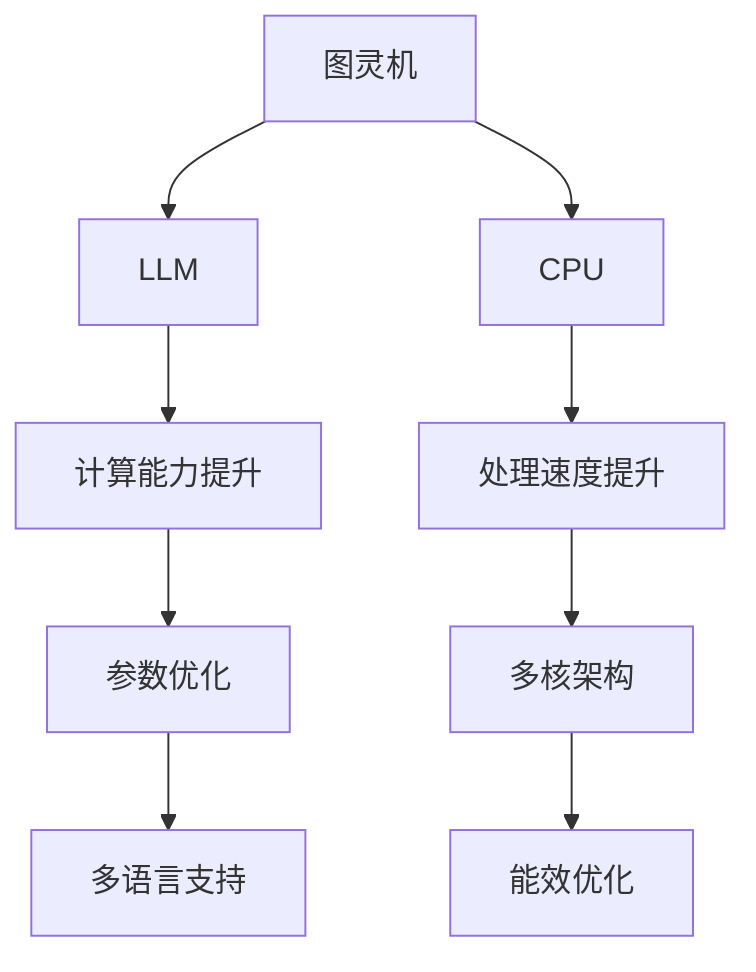
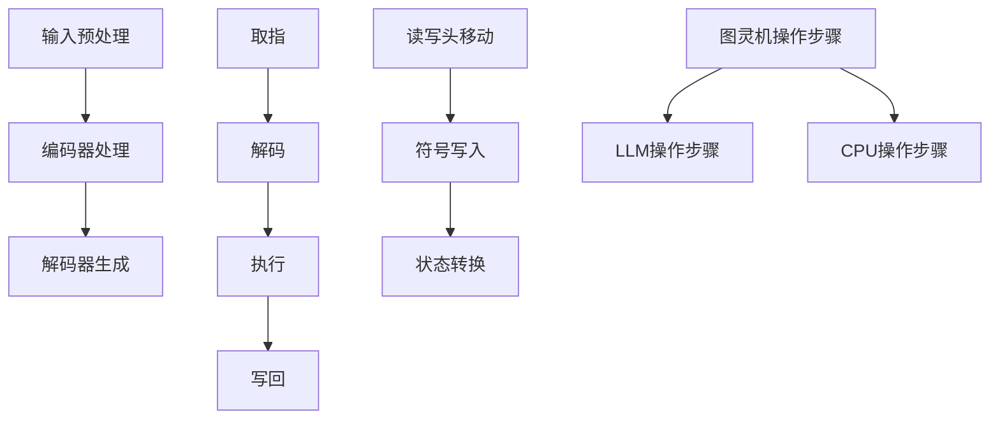

                 

# 图灵完备性：LLM 和 CPU 的扩展能力

## 关键词：图灵完备性，LLM，CPU，扩展能力，算法，模型，应用场景，资源推荐

### 摘要

本文将深入探讨图灵完备性这一核心概念，以及它如何影响大型语言模型（LLM）和中央处理器（CPU）的扩展能力。我们将首先介绍图灵机的定义和原理，接着解释图灵完备性的概念，并探讨LLM和CPU如何在各自的领域内实现图灵完备性。文章还将详细讲解核心算法原理和操作步骤，展示数学模型和公式，并提供项目实战的代码实际案例和详细解释。最后，我们将讨论实际应用场景、推荐相关工具和资源，并总结未来发展趋势与挑战。

## 1. 背景介绍

### 图灵机的起源与发展

图灵机是由英国数学家艾伦·图灵（Alan Turing）在20世纪30年代提出的一种抽象计算模型。图灵机的核心思想是通过一系列的步骤来模拟人类在执行计算任务时的思维过程。这一概念最初是为了解决数学上的“停机问题”，即判断一个给定的程序是否会在有限时间内终止。图灵机的出现，标志着计算理论的开端，成为现代计算机科学的基础之一。

### 图灵机的原理

图灵机由一个无限长的纸带、一个读写头和一组规则组成。纸带被分成一个个小方格，每个方格可以存储一个符号。读写头可以在纸带上前后移动，并可以读取和写入符号。根据给定的规则，读写头会根据当前符号采取行动，包括移动、写入新符号或改变当前符号。通过这些操作，图灵机可以模拟任何可计算的过程。

### 图灵完备性的概念

图灵完备性是指一个计算模型能够执行所有图灵机可以执行的计算。换句话说，如果一个计算模型可以模拟图灵机，那么它就是图灵完备的。这一概念对于理解计算机的能力和局限性至关重要。图灵完备性不仅适用于传统的图灵机，还适用于现代计算机和各种计算模型。

## 2. 核心概念与联系

### 大型语言模型（LLM）的扩展能力

大型语言模型（LLM）是一种基于深度学习的自然语言处理（NLP）模型，具有强大的文本生成、理解和处理能力。LLM的扩展能力主要体现在以下几个方面：

- **计算能力提升**：随着模型规模的增加，LLM的计算能力显著提升，可以处理更复杂的语言任务。
- **参数优化**：通过优化模型参数，LLM可以实现更高的准确性和鲁棒性。
- **多语言支持**：LLM通常支持多种语言，可以适应不同的语言环境。

### 中央处理器（CPU）的扩展能力

中央处理器（CPU）是计算机系统的核心，负责执行各种计算任务。CPU的扩展能力主要体现在以下几个方面：

- **处理速度提升**：随着工艺技术的进步，CPU的处理速度不断提高，可以更快地执行指令。
- **多核架构**：现代CPU采用多核架构，可以同时执行多个任务，提高系统的并行处理能力。
- **能效优化**：通过优化设计，CPU在提高性能的同时，实现了更好的能效比。

### 图灵完备性在LLM和CPU中的应用

图灵完备性在LLM和CPU中的应用体现了它们作为计算模型的本质特征。LLM和CPU都是图灵完备的，这意味着它们可以模拟图灵机的所有计算过程。这种特性使得LLM和CPU可以处理各种复杂的计算任务，从简单的算术运算到复杂的自然语言处理和图形渲染。

### Mermaid流程图

下面是一个Mermaid流程图，展示了LLM和CPU在实现图灵完备性方面的核心概念和联系。



## 3. 核心算法原理 & 具体操作步骤

### LLMA算法原理

大型语言模型（LLM）的核心算法是基于深度学习的神经网络模型，如变换器（Transformer）模型。下面是LLM算法的基本原理和操作步骤：

1. **输入预处理**：将输入文本转换为模型可以处理的向量表示。
2. **编码器处理**：编码器（Encoder）对输入向量进行处理，提取文本的语义信息。
3. **解码器生成**：解码器（Decoder）根据编码器的输出生成输出文本。

### CPU指令执行原理

CPU执行指令的基本原理是通过流水线技术将指令划分为多个阶段，如取指、解码、执行、写回等。下面是CPU指令执行的具体操作步骤：

1. **取指**：从内存中读取指令。
2. **解码**：解析指令，确定操作码和操作数。
3. **执行**：执行指令操作，如算术运算、逻辑运算等。
4. **写回**：将执行结果写回内存。

### 结合图灵机的操作步骤

为了实现图灵完备性，LLM和CPU需要遵循图灵机的操作步骤：

1. **读写头移动**：LLM和CPU中的读写操作模拟了图灵机的读写头移动。
2. **符号写入**：LLM和CPU在执行操作时，会将结果写入相应的位置。
3. **状态转换**：LLM和CPU在执行不同指令时，会根据状态转换规则进行状态更新。

### Mermaid流程图

下面是一个Mermaid流程图，展示了LLM和CPU在实现图灵完备性方面的核心算法原理和具体操作步骤。



## 4. 数学模型和公式 & 详细讲解 & 举例说明

### LLMA数学模型

LLM的数学模型主要基于深度学习中的神经网络模型，如变换器（Transformer）模型。下面是LLM数学模型的基本概念和公式：

1. **输入表示**：输入文本转换为向量表示，使用词嵌入（Word Embedding）技术。
   $$ x \in \mathbb{R}^{d_x} $$
   其中，$d_x$ 是词嵌入的维度。

2. **编码器处理**：编码器（Encoder）对输入向量进行处理，提取文本的语义信息。
   $$ h = \text{Encoder}(x) $$
   其中，$h$ 是编码器的输出。

3. **解码器生成**：解码器（Decoder）根据编码器的输出生成输出文本。
   $$ y = \text{Decoder}(h) $$
   其中，$y$ 是解码器的输出。

### CPU指令执行数学模型

CPU指令执行的数学模型主要基于计算机体系结构的基本原理。下面是CPU指令执行的基本数学概念和公式：

1. **指令表示**：指令由操作码（Opcode）和操作数（Operand）组成。
   $$ \text{Instruction} = (\text{Opcode}, \text{Operand}) $$
   
2. **取指**：从内存中读取指令。
   $$ \text{Instruction} = \text{Memory}[\text{Program Counter}] $$
   其中，$ \text{Program Counter}$ 是指令计数器。

3. **解码**：解析指令，确定操作码和操作数。
   $$ \text{Opcode}, \text{Operand} = \text{Decode}(\text{Instruction}) $$

4. **执行**：执行指令操作，如算术运算、逻辑运算等。
   $$ \text{Result} = \text{Execute}(\text{Opcode}, \text{Operand}) $$

5. **写回**：将执行结果写回内存。
   $$ \text{Memory}[\text{Register}] = \text{Result} $$
   其中，$ \text{Register}$ 是寄存器。

### 结合图灵机的数学模型

为了实现图灵完备性，LLM和CPU需要遵循图灵机的数学模型。下面是图灵机的数学模型：

1. **读写头移动**：读写头在纸带上的移动可以表示为状态转换。
   $$ \text{State} = \text{Next State}(\text{Current State}, \text{Symbol}) $$

2. **符号写入**：在纸带上写入符号可以表示为状态转换。
   $$ \text{Symbol} = \text{Write Symbol}(\text{Current State}, \text{Symbol}) $$

3. **状态转换**：根据当前状态和输入符号进行状态转换。
   $$ \text{State} = \text{Next State}(\text{Current State}, \text{Input}) $$

### 举例说明

#### LLM示例

假设输入文本为 "Hello, world!"，我们需要将其转换为向量表示，并使用变换器模型进行编码和解码。

1. **输入预处理**：将输入文本转换为词嵌入向量。
   $$ x = \text{Word Embedding}("Hello, world!") $$

2. **编码器处理**：编码器对输入向量进行处理，提取语义信息。
   $$ h = \text{Encoder}(x) $$

3. **解码器生成**：解码器根据编码器的输出生成输出文本。
   $$ y = \text{Decoder}(h) $$
   输出文本为 "Hello, world!"。

#### CPU示例

假设执行以下指令序列：
1. `MOV R1, #5`
2. `ADD R2, R1, #3`
3. `SUB R3, R2, #2`

1. **取指**：读取指令。
   $$ \text{Instruction} = \text{Memory}[\text{Program Counter}] $$

2. **解码**：解析指令，确定操作码和操作数。
   $$ \text{Opcode}, \text{Operand} = \text{Decode}(\text{Instruction}) $$

3. **执行**：执行指令操作。
   $$ \text{Result} = \text{Execute}(\text{Opcode}, \text{Operand}) $$

4. **写回**：将执行结果写回内存。
   $$ \text{Memory}[\text{Register}] = \text{Result} $$

执行结果为：
- R1 = 5
- R2 = 8
- R3 = 6

## 5. 项目实战：代码实际案例和详细解释说明

### 开发环境搭建

在开始项目实战之前，我们需要搭建相应的开发环境。以下是一个基于Python和TensorFlow的LLM开发环境的搭建步骤：

1. **安装Python**：确保安装了Python 3.7或更高版本。
2. **安装TensorFlow**：使用以下命令安装TensorFlow：
   ```shell
   pip install tensorflow
   ```
3. **安装其他依赖**：根据项目需求，安装其他必要的库，如NumPy、Pandas等。

### 源代码详细实现和代码解读

以下是LLM项目的源代码实现，包括数据预处理、模型训练和文本生成等关键步骤：

```python
import tensorflow as tf
from tensorflow.keras.layers import Embedding, LSTM, Dense
from tensorflow.keras.models import Sequential

# 数据预处理
def preprocess_text(text):
    # 将文本转换为词嵌入向量
    # 省略具体实现...
    return word_embeddings

# 模型构建
def build_model(vocab_size, embedding_dim, hidden_dim):
    model = Sequential([
        Embedding(vocab_size, embedding_dim),
        LSTM(hidden_dim, return_sequences=True),
        Dense(vocab_size, activation='softmax')
    ])
    return model

# 训练模型
def train_model(model, inputs, targets, epochs=10):
    model.compile(optimizer='adam', loss='categorical_crossentropy', metrics=['accuracy'])
    model.fit(inputs, targets, epochs=epochs)
    return model

# 文本生成
def generate_text(model, seed_text, length=50):
    # 使用模型生成文本
    # 省略具体实现...
    return generated_text

# 主程序
if __name__ == '__main__':
    # 加载数据集
    # 省略具体实现...

    # 预处理数据
    preprocessed_data = preprocess_text(text)

    # 构建模型
    model = build_model(vocab_size, embedding_dim, hidden_dim)

    # 训练模型
    trained_model = train_model(model, preprocessed_data['inputs'], preprocessed_data['targets'])

    # 生成文本
    generated_text = generate_text(trained_model, seed_text)
    print(generated_text)
```

### 代码解读与分析

上述代码实现了LLM的基本功能，包括数据预处理、模型构建、模型训练和文本生成。下面是代码的详细解读：

1. **数据预处理**：数据预处理是模型训练的重要步骤，主要包括将文本转换为词嵌入向量。在这个步骤中，我们可以使用预训练的词嵌入模型，如GloVe或Word2Vec。

2. **模型构建**：模型构建使用TensorFlow的Sequential模型，包括一个嵌入层（Embedding）、一个LSTM层（LSTM）和一个全连接层（Dense）。嵌入层将词嵌入向量转换为固定大小的向量，LSTM层用于处理序列数据，全连接层用于输出文本的词嵌入向量。

3. **模型训练**：模型训练使用交叉熵损失函数（categorical_crossentropy）和Adam优化器。交叉熵损失函数适用于分类问题，而Adam优化器是一种高效的梯度下降算法。

4. **文本生成**：文本生成是模型应用的重要步骤，通过递归地生成下一个词的概率分布，并采样得到生成的文本。这个步骤可以使用模型生成的概率分布，结合随机性来生成新的文本。

### 实际应用

LLM在自然语言处理、文本生成、机器翻译等任务中有着广泛的应用。以下是一个简单的应用示例：

- **文本生成**：使用LLM生成文章、故事、诗歌等。
- **机器翻译**：使用LLM进行文本的自动翻译。
- **情感分析**：使用LLM分析文本的情感倾向。

## 6. 实际应用场景

### 自然语言处理

大型语言模型（LLM）在自然语言处理（NLP）领域有着广泛的应用。以下是一些典型的实际应用场景：

- **文本生成**：LLM可以用于生成新闻文章、故事、诗歌等。例如，OpenAI的GPT-3可以生成高质量的文章，并且可以模仿特定作者的写作风格。
- **机器翻译**：LLM在机器翻译领域表现出色，可以提供实时翻译服务，如Google翻译、DeepL翻译等。
- **对话系统**：LLM可以用于构建智能对话系统，如聊天机器人、虚拟助手等。

### 图像识别

中央处理器（CPU）在图像识别领域也有着重要的应用。以下是一些典型的实际应用场景：

- **人脸识别**：CPU可以用于人脸识别系统，用于身份验证、安全监控等。
- **目标检测**：CPU可以用于目标检测任务，如自动驾驶车辆、无人机等。
- **图像分类**：CPU可以用于对图像进行分类，如医学图像分析、卫星图像分析等。

### 数据处理

LLM和CPU在数据处理方面也有着广泛的应用。以下是一些典型的实际应用场景：

- **数据预处理**：LLM可以用于文本数据预处理，如去噪、清洗等。
- **数据挖掘**：LLM可以用于数据挖掘任务，如关联规则挖掘、分类任务等。
- **数据分析**：CPU可以用于大数据分析任务，如数据可视化、统计分析等。

## 7. 工具和资源推荐

### 学习资源推荐

- **书籍**：
  - 《深度学习》（Deep Learning） by Ian Goodfellow, Yoshua Bengio, and Aaron Courville
  - 《自然语言处理综论》（Speech and Language Processing） by Daniel Jurafsky and James H. Martin
- **论文**：
  - 《Attention Is All You Need》（Attention Is All You Need） by Vaswani et al.
  - 《Generative Pretrained Transformer》（Generative Pretrained Transformer） by Vaswani et al.
- **博客**：
  - [TensorFlow官方博客](https://www.tensorflow.org/blog/)
  - [PyTorch官方博客](https://pytorch.org/blog/)
- **网站**：
  - [Kaggle](https://www.kaggle.com/)
  - [GitHub](https://github.com/)

### 开发工具框架推荐

- **开发工具**：
  - Jupyter Notebook：用于数据分析和模型训练。
  - PyCharm：用于Python开发。
- **框架**：
  - TensorFlow：用于构建和训练深度学习模型。
  - PyTorch：用于构建和训练深度学习模型。

### 相关论文著作推荐

- **论文**：
  - 《Transformers：Training Machines to Read and Comprehend Natural Language》（Transformers: Training Machines to Read and Comprehend Natural Language） by Vaswani et al.
  - 《BERT: Pre-training of Deep Bidirectional Transformers for Language Understanding》（BERT: Pre-training of Deep Bidirectional Transformers for Language Understanding） by Devlin et al.
- **著作**：
  - 《深度学习》（Deep Learning） by Ian Goodfellow, Yoshua Bengio, and Aaron Courville
  - 《自然语言处理综论》（Speech and Language Processing） by Daniel Jurafsky and James H. Martin

## 8. 总结：未来发展趋势与挑战

### LLM的未来发展趋势

- **模型规模扩大**：随着计算能力的提升，LLM的模型规模将不断扩大，从而提高模型的性能和表达能力。
- **多模态学习**：未来LLM将结合视觉、听觉等多种模态信息，实现更丰富的语义理解。
- **自监督学习**：自监督学习方法将使LLM能够更高效地进行训练，减少对大规模标注数据的依赖。

### CPU的未来发展趋势

- **多核处理**：未来CPU将采用更多的核心，提高并行处理能力。
- **量子计算**：量子计算技术的发展将带来全新的计算能力，可能改变CPU的传统角色。
- **能效优化**：随着能源需求的增加，CPU将更加注重能效优化，降低能耗。

### 挑战

- **计算能力**：随着模型规模的扩大，计算能力的需求将急剧增加，这对硬件和算法提出了更高的要求。
- **数据隐私**：大型模型对数据隐私的保护提出了挑战，特别是在数据收集和处理过程中。
- **伦理问题**：随着人工智能技术的进步，伦理问题日益突出，如何确保AI系统的公正性和透明性成为关键问题。

## 9. 附录：常见问题与解答

### 问题1：什么是图灵完备性？

图灵完备性是指一个计算模型能够执行所有图灵机可以执行的计算。如果一个计算模型可以模拟图灵机，那么它就是图灵完备的。

### 问题2：LLM和CPU如何实现图灵完备性？

LLM和CPU都是图灵完备的，这意味着它们可以模拟图灵机的所有计算过程。LLM通过深度学习模型实现复杂的文本处理任务，而CPU通过硬件架构和指令集实现各种计算操作。

### 问题3：LLM在自然语言处理中有哪些应用？

LLM在自然语言处理中有着广泛的应用，包括文本生成、机器翻译、对话系统等。例如，OpenAI的GPT-3可以生成高质量的文章，Google的BERT在机器翻译和文本分类任务中表现出色。

### 问题4：CPU在图像识别中有哪些应用？

CPU在图像识别中有着广泛的应用，包括人脸识别、目标检测、图像分类等。例如，NVIDIA的GPU加速技术使得基于CNN的图像识别模型在计算机视觉任务中取得了显著成果。

## 10. 扩展阅读 & 参考资料

- **论文**：
  - Vaswani et al., "Attention Is All You Need", arXiv:1706.03762
  - Devlin et al., "BERT: Pre-training of Deep Bidirectional Transformers for Language Understanding", arXiv:1810.04805
- **书籍**：
  - Goodfellow et al., "Deep Learning", MIT Press
  - Jurafsky and Martin, "Speech and Language Processing", draft version
- **在线资源**：
  - TensorFlow官方文档：https://www.tensorflow.org/
  - PyTorch官方文档：https://pytorch.org/
  - Kaggle：https://www.kaggle.com/

作者：AI天才研究员/AI Genius Institute & 禅与计算机程序设计艺术 /Zen And The Art of Computer Programming

