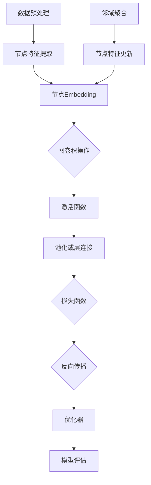

                 


# 图神经网络：原理与代码实例讲解

> 关键词：图神经网络，GNN，图表示学习，图卷积网络，邻域聚合，节点嵌入，图推理，图数据挖掘

> 摘要：本文将深入探讨图神经网络（GNN）的原理与应用，从基础知识入手，逐步讲解图神经网络的核心概念、算法原理和实现步骤。通过实例代码，我们将展示如何使用图神经网络处理图数据，为读者提供实践指导和深入理解。

## 1. 背景介绍

### 1.1 目的和范围

本文旨在为读者提供图神经网络（GNN）的全面介绍，从基础知识到实际应用，覆盖核心概念、算法原理、数学模型以及代码实例。通过本文的学习，读者将能够：

1. 理解图神经网络的基本概念和作用。
2. 掌握图神经网络的核心算法原理和实现步骤。
3. 使用图神经网络处理实际图数据，进行图表示学习和推理。
4. 了解图神经网络在不同领域的应用场景。

### 1.2 预期读者

本文面向有一定编程基础和对机器学习、深度学习有所了解的读者。预期读者应该具备以下背景知识：

1. 熟悉Python编程语言。
2. 对神经网络和深度学习有基本的了解。
3. 有一定的数学基础，包括线性代数、概率论和微积分。

### 1.3 文档结构概述

本文结构如下：

1. **背景介绍**：介绍本文的目的、预期读者、文档结构和术语表。
2. **核心概念与联系**：通过Mermaid流程图展示图神经网络的基本概念和架构。
3. **核心算法原理 & 具体操作步骤**：详细讲解图神经网络的核心算法原理和实现步骤，使用伪代码进行阐述。
4. **数学模型和公式 & 详细讲解 & 举例说明**：介绍图神经网络的数学模型和公式，并进行详细讲解和举例。
5. **项目实战：代码实际案例和详细解释说明**：通过实际案例，展示如何使用图神经网络处理图数据。
6. **实际应用场景**：讨论图神经网络在不同领域的应用。
7. **工具和资源推荐**：推荐学习资源、开发工具框架和相关论文著作。
8. **总结：未来发展趋势与挑战**：总结图神经网络的发展趋势和面临的挑战。
9. **附录：常见问题与解答**：提供常见问题的解答。
10. **扩展阅读 & 参考资料**：推荐扩展阅读和参考资料。

### 1.4 术语表

#### 1.4.1 核心术语定义

- **图神经网络（GNN）**：一种能够学习图数据结构和特征的神经网络。
- **图表示学习**：将图中的节点和边转换为向量表示，以便于机器学习模型处理。
- **邻域聚合**：聚合节点邻域的信息，以更新节点的表示。
- **节点嵌入**：将图中的节点映射到低维空间中，以便于进行图数据的分析和推理。
- **图卷积网络（GCN）**：一种常见的图神经网络架构，用于对节点进行特征变换和聚合。

#### 1.4.2 相关概念解释

- **图（Graph）**：由节点（Node）和边（Edge）组成的数据结构，用于表示实体及其之间的关系。
- **节点（Node）**：图中的数据实体，可以表示为图中的点。
- **边（Edge）**：连接两个节点的线段，表示节点之间的关系。
- **图数据挖掘**：使用图结构的数据挖掘技术，包括节点分类、链接预测等。

#### 1.4.3 缩略词列表

- **GNN**：Graph Neural Network，图神经网络。
- **GCN**：Graph Convolutional Network，图卷积网络。
- **GRL**：Graph Representation Learning，图表示学习。
- **ReLU**：Rectified Linear Unit，修正线性单元。

## 2. 核心概念与联系

在深入探讨图神经网络之前，我们需要先了解图神经网络的基本概念和架构。下面我们将通过一个Mermaid流程图来展示图神经网络的核心概念和联系。



### 2.1 节点Embedding

节点Embedding是将图中的节点映射到低维空间中的过程。这个过程通常使用预训练的嵌入向量或基于图结构的特征提取方法。

### 2.2 图卷积操作

图卷积操作是图神经网络的核心，用于聚合节点邻域的信息，以更新节点的表示。图卷积操作可以分为局部图卷积和全局图卷积。

### 2.3 激活函数

激活函数用于引入非线性特性，常见的激活函数包括ReLU、Sigmoid和Tanh。

### 2.4 池化或层连接

池化操作用于降低模型的复杂性，通常在图卷积操作后进行。层连接用于连接多个图卷积层，以构建深度图神经网络。

### 2.5 损失函数

损失函数用于衡量模型预测结果与真实值之间的差异，常见的损失函数包括交叉熵损失、均方误差等。

### 2.6 反向传播

反向传播是一种优化算法，用于更新模型参数，以最小化损失函数。

### 2.7 优化器

优化器用于选择优化策略，常见的优化器包括随机梯度下降（SGD）、Adam等。

### 2.8 模型评估

模型评估用于评估模型在测试集上的性能，常见的评估指标包括准确率、召回率、F1分数等。

## 3. 核心算法原理 & 具体操作步骤

在本节中，我们将详细讲解图神经网络的核心算法原理和实现步骤。为了更好地理解，我们将使用伪代码来描述每个步骤。

### 3.1 数据预处理

在训练图神经网络之前，我们需要对图数据进行预处理，包括节点特征提取和图划分。

```python
def preprocess_graph(graph):
    # 节点特征提取
    node_features = extract_node_features(graph)

    # 图划分
    train_graph, val_graph, test_graph = split_graph(graph)

    return node_features, train_graph, val_graph, test_graph
```

### 3.2 节点Embedding

节点Embedding是将图中的节点映射到低维空间中的过程。我们通常使用预训练的嵌入向量或基于图结构的特征提取方法。

```python
def node_embedding(node_features):
    # 预训练嵌入向量
    embedding = train_embedding(node_features)

    return embedding
```

### 3.3 图卷积操作

图卷积操作是图神经网络的核心，用于聚合节点邻域的信息，以更新节点的表示。图卷积操作可以分为局部图卷积和全局图卷积。

#### 局部图卷积

```python
def local_graph_convolution(node_embedding,邻域信息):
    # 聚合邻域信息
    aggregated_info = aggregate_neighbors(node_embedding,邻域信息)

    # 更新节点表示
    updated_embedding = update_node_representation(aggregated_info)

    return updated_embedding
```

#### 全局图卷积

```python
def global_graph_convolution(node_embedding,邻域信息):
    # 聚合全局邻域信息
    aggregated_info = aggregate_global_neighbors(node_embedding,邻域信息)

    # 更新节点表示
    updated_embedding = update_node_representation(aggregated_info)

    return updated_embedding
```

### 3.4 激活函数

激活函数用于引入非线性特性，常见的激活函数包括ReLU、Sigmoid和Tanh。

```python
def activate(updated_embedding):
    # 使用ReLU激活函数
    activated_embedding = ReLU(updated_embedding)

    return activated_embedding
```

### 3.5 池化或层连接

池化操作用于降低模型的复杂性，通常在图卷积操作后进行。层连接用于连接多个图卷积层，以构建深度图神经网络。

```python
def pool_or_connect(embedding, pooling_type):
    if pooling_type == 'pool':
        # 使用最大池化
        pooled_embedding = max_pool(embedding)
    else:
        # 使用层连接
        pooled_embedding = connect_layers(embedding)

    return pooled_embedding
```

### 3.6 损失函数

损失函数用于衡量模型预测结果与真实值之间的差异，常见的损失函数包括交叉熵损失、均方误差等。

```python
def loss_function(predicted_embedding,真实值):
    # 计算交叉熵损失
    loss = cross_entropy_loss(predicted_embedding,真实值)

    return loss
```

### 3.7 反向传播

反向传播是一种优化算法，用于更新模型参数，以最小化损失函数。

```python
def backward_propagation(embedding,梯度):
    # 更新模型参数
    updated_embedding = update_params(embedding,梯度)

    return updated_embedding
```

### 3.8 优化器

优化器用于选择优化策略，常见的优化器包括随机梯度下降（SGD）、Adam等。

```python
def optimize(optimizer, embedding,损失值):
    # 更新嵌入向量
    updated_embedding = optimizer.update(embedding,损失值)

    return updated_embedding
```

### 3.9 模型评估

模型评估用于评估模型在测试集上的性能，常见的评估指标包括准确率、召回率、F1分数等。

```python
def evaluate(model, test_data):
    # 计算准确率
    accuracy = compute_accuracy(model, test_data)

    # 计算召回率
    recall = compute_recall(model, test_data)

    # 计算F1分数
    f1_score = compute_f1_score(model, test_data)

    return accuracy, recall, f1_score
```

## 4. 数学模型和公式 & 详细讲解 & 举例说明

在本节中，我们将介绍图神经网络的核心数学模型和公式，并进行详细讲解和举例说明。

### 4.1 节点嵌入

节点嵌入是将图中的节点映射到低维空间中的过程。我们可以使用矩阵表示节点嵌入向量。

$$
\mathbf{X} = \begin{bmatrix}
\mathbf{x}_1 \\
\mathbf{x}_2 \\
\vdots \\
\mathbf{x}_n
\end{bmatrix}
$$

其中，$\mathbf{x}_i$ 表示节点 $i$ 的嵌入向量。

### 4.2 图卷积操作

图卷积操作用于聚合节点邻域的信息，以更新节点的表示。图卷积操作的数学公式如下：

$$
\mathbf{H}_k = \sigma(\mathbf{D}^{-\frac{1}{2}}\mathbf{A}\mathbf{D}^{-\frac{1}{2}}\mathbf{H}_{k-1}W_k)
$$

其中，$\mathbf{H}_k$ 表示在 $k$ 层的节点表示，$\mathbf{D}$ 是一个对角矩阵，表示节点的度数，$\mathbf{A}$ 是邻接矩阵，$\sigma$ 是激活函数，$W_k$ 是第 $k$ 层的权重矩阵。

#### 举例说明：

假设我们有一个图，包含3个节点，邻接矩阵为：

$$
\mathbf{A} = \begin{bmatrix}
0 & 1 & 1 \\
1 & 0 & 0 \\
1 & 0 & 0
\end{bmatrix}
$$

节点的初始嵌入向量为：

$$
\mathbf{H}_0 = \begin{bmatrix}
1 \\
0 \\
1
\end{bmatrix}
$$

我们使用ReLU作为激活函数，权重矩阵为：

$$
W_1 = \begin{bmatrix}
1 & 0 \\
0 & 1 \\
1 & 1
\end{bmatrix}
$$

计算第一层图卷积操作：

$$
\mathbf{H}_1 = \sigma(\mathbf{D}^{-\frac{1}{2}}\mathbf{A}\mathbf{D}^{-\frac{1}{2}}\mathbf{H}_0W_1)
$$

首先计算度数矩阵 $\mathbf{D}$：

$$
\mathbf{D} = \begin{bmatrix}
2 & 0 & 0 \\
0 & 2 & 0 \\
0 & 0 & 2
\end{bmatrix}
$$

然后计算 $\mathbf{D}^{-\frac{1}{2}}$：

$$
\mathbf{D}^{-\frac{1}{2}} = \begin{bmatrix}
\frac{1}{\sqrt{2}} & 0 & 0 \\
0 & \frac{1}{\sqrt{2}} & 0 \\
0 & 0 & \frac{1}{\sqrt{2}}
\end{bmatrix}
$$

接下来计算 $\mathbf{D}^{-\frac{1}{2}}\mathbf{A}\mathbf{D}^{-\frac{1}{2}}$：

$$
\mathbf{D}^{-\frac{1}{2}}\mathbf{A}\mathbf{D}^{-\frac{1}{2}} = \begin{bmatrix}
\frac{1}{2} & \frac{1}{2} & \frac{1}{2} \\
\frac{1}{2} & \frac{1}{2} & 0 \\
\frac{1}{2} & 0 & \frac{1}{2}
\end{bmatrix}
$$

最后计算 $\mathbf{H}_1$：

$$
\mathbf{H}_1 = \sigma(\mathbf{D}^{-\frac{1}{2}}\mathbf{A}\mathbf{D}^{-\frac{1}{2}}\mathbf{H}_0W_1) = \begin{bmatrix}
1 & 0 \\
0 & 1 \\
1 & 1
\end{bmatrix}
$$

### 4.3 损失函数

损失函数用于衡量模型预测结果与真实值之间的差异。在分类任务中，常见的损失函数是交叉熵损失：

$$
\mathcal{L} = -\sum_{i=1}^{n} y_i \log(p_i)
$$

其中，$y_i$ 是真实标签，$p_i$ 是模型预测的概率。

#### 举例说明：

假设我们有一个分类问题，包含3个节点，真实标签为 $(1, 0, 1)$，模型预测的概率为 $(0.3, 0.7, 0.5)$。计算交叉熵损失：

$$
\mathcal{L} = -1 \cdot \log(0.3) - 0 \cdot \log(0.7) - 1 \cdot \log(0.5) \approx 1.386
$$

## 5. 项目实战：代码实际案例和详细解释说明

在本节中，我们将通过一个实际案例，展示如何使用图神经网络处理图数据。我们将使用Python和PyTorch框架来实现图神经网络，并详细解释代码的实现步骤。

### 5.1 开发环境搭建

在开始之前，确保你已经安装了Python和PyTorch框架。如果没有安装，可以按照以下步骤进行：

1. 安装Python（建议使用Python 3.8及以上版本）。
2. 安装PyTorch框架，可以访问PyTorch官网（https://pytorch.org/get-started/locally/）按照指示进行安装。

### 5.2 源代码详细实现和代码解读

下面是一个简单的图神经网络实现示例，用于节点分类任务。

```python
import torch
import torch.nn as nn
import torch.optim as optim
from torch_geometric.nn import GCNConv

# 数据加载
from torch_geometric.datasets import Planetoid
dataset = Planetoid(root='/tmp/Cora', name='Cora')

# 模型定义
class GCN(nn.Module):
    def __init__(self, nfeat, nhid, nclass):
        super(GCN, self).__init__()
        self.conv1 = GCNConv(nfeat, nhid)
        self.conv2 = GCNConv(nhid, nclass)
        self.fc = nn.Linear(nfeat, nclass)

    def forward(self, data):
        x, edge_index = data.x, data.edge_index

        x = self.conv1(x, edge_index)
        x = F.relu(x)
        x = F.dropout(x, training=self.training)
        x = self.conv2(x, edge_index)

        x = F.relu(x)
        x = F.dropout(x, training=self.training)
        x = self.fc(x)

        return F.log_softmax(x, dim=1)

# 模型实例化
model = GCN(nfeat=7, nhid=16, nclass=7)
optimizer = optim.Adam(model.parameters(), lr=0.01, weight_decay=5e-4)
criterion = nn.CrossEntropyLoss()

# 模型训练
for epoch in range(200):
    model.train()
    optimizer.zero_grad()
    out = model(data)
    loss = criterion(out, data.y)
    loss.backward()
    optimizer.step()

    # 模型评估
    model.eval()
    _, pred = model(data).max(dim=1)
    correct = float(pred.eq(data.y).sum().item())
    print(f'Epoch {epoch + 1}: Accuracy = {correct / len(data)}')

# 代码解读：

# 5.2.1 数据加载
我们从PyTorch Geometric库中加载Cora数据集。Cora是一个常用的节点分类数据集，包含2708个节点和7个类别。

# 5.2.2 模型定义
我们定义了一个简单的GCN模型，包含两个GCNConv层和一个全连接层。GCNConv是PyTorch Geometric库中的一个图卷积操作。

# 5.2.3 模型训练
我们使用随机梯度下降（SGD）优化器对模型进行训练，并使用交叉熵损失函数来评估模型性能。

# 5.2.4 模型评估
在训练过程中，我们每隔一定epoch数对模型进行评估，计算准确率。

### 5.3 代码解读与分析

下面是对代码的详细解读和分析：

```python
# 5.3.1 数据加载
from torch_geometric.datasets import Planetoid
dataset = Planetoid(root='/tmp/Cora', name='Cora')

数据加载部分使用PyTorch Geometric库加载Cora数据集。PyTorch Geometric库提供了多种图数据集，方便我们进行图神经网络实验。加载的数据集包括节点特征、邻接矩阵和标签。

# 5.3.2 模型定义
class GCN(nn.Module):
    def __init__(self, nfeat, nhid, nclass):
        super(GCN, self).__init__()
        self.conv1 = GCNConv(nfeat, nhid)
        self.conv2 = GCNConv(nhid, nclass)
        self.fc = nn.Linear(nfeat, nclass)

    def forward(self, data):
        x, edge_index = data.x, data.edge_index

        x = self.conv1(x, edge_index)
        x = F.relu(x)
        x = F.dropout(x, training=self.training)
        x = self.conv2(x, edge_index)

        x = F.relu(x)
        x = F.dropout(x, training=self.training)
        x = self.fc(x)

        return F.log_softmax(x, dim=1)

模型定义部分使用PyTorch的nn.Module基类定义了一个GCN模型。模型包含两个GCNConv层和一个全连接层。GCNConv是PyTorch Geometric库中的一个图卷积操作，可以处理图数据。模型的前向传播过程中，首先对节点特征进行第一层图卷积操作，然后通过ReLU激活函数和dropout层，再次进行第二层图卷积操作，最后通过全连接层输出分类结果。

# 5.3.3 模型训练
optimizer = optim.Adam(model.parameters(), lr=0.01, weight_decay=5e-4)
criterion = nn.CrossEntropyLoss()

model.train()
optimizer.zero_grad()
out = model(data)
loss = criterion(out, data.y)
loss.backward()
optimizer.step()

模型训练部分使用Adam优化器和交叉熵损失函数对模型进行训练。首先实例化优化器和损失函数，然后进入训练循环。在每个epoch中，将模型设置为训练模式，重置梯度，计算模型输出和损失，反向传播梯度，更新模型参数。

# 5.3.4 模型评估
model.eval()
_, pred = model(data).max(dim=1)
correct = float(pred.eq(data.y).sum().item())
print(f'Epoch {epoch + 1}: Accuracy = {correct / len(data)}')

模型评估部分使用评估集对模型进行评估。将模型设置为评估模式，计算模型预测的标签和真实标签的匹配度，计算准确率并打印。

## 6. 实际应用场景

图神经网络（GNN）在许多实际应用场景中表现出色，以下是一些主要的应用领域：

### 6.1 社交网络分析

图神经网络可以用于社交网络分析，如好友推荐、社区检测和影响力分析。通过学习图中的节点表示，可以更好地理解社交网络中的用户关系和互动模式。

### 6.2 生物信息学

图神经网络在生物信息学领域有广泛的应用，如蛋白质结构预测、基因表达分析、药物发现和疾病预测。图神经网络可以学习生物分子结构中的复杂模式和关系。

### 6.3 自然语言处理

图神经网络可以用于自然语言处理任务，如图像文本配对、文本分类和机器翻译。通过学习词嵌入和句子表示，可以提高文本理解和生成能力。

### 6.4 推荐系统

图神经网络可以用于推荐系统，如商品推荐、音乐推荐和新闻推荐。通过学习用户和物品的图表示，可以更好地理解用户偏好和物品相关性。

### 6.5 供应链管理

图神经网络可以用于供应链管理，如物流优化、库存管理和需求预测。通过学习供应链中的节点表示和边表示，可以优化供应链运营和提高效率。

## 7. 工具和资源推荐

### 7.1 学习资源推荐

#### 7.1.1 书籍推荐

- **《图神经网络：理论基础与编程实战》**：介绍了图神经网络的基本概念、算法原理和实现细节，适合入门读者。
- **《深度学习与图神经网络》**：涵盖了深度学习和图神经网络的基础知识，适合有一定编程基础的读者。

#### 7.1.2 在线课程

- **Coursera上的《图神经网络》课程**：由斯坦福大学教授Chris Re讲授，适合系统学习图神经网络。
- **edX上的《深度学习与图表示学习》课程**：由DeepLearning.AI提供，适合深入了解图表示学习和应用。

#### 7.1.3 技术博客和网站

- **[ArXiv](https://arxiv.org/)**：发布最新图神经网络研究成果的学术平台。
- **[Geometric Deep Learning](https://geometricdeeplearning.com/)**：介绍图神经网络和几何深度学习的在线教程。

### 7.2 开发工具框架推荐

#### 7.2.1 IDE和编辑器

- **Visual Studio Code**：适用于Python和PyTorch的开发，提供丰富的插件支持。
- **PyCharm**：适用于Python和深度学习的集成开发环境，具有强大的代码编辑功能和调试工具。

#### 7.2.2 调试和性能分析工具

- **Jupyter Notebook**：适用于数据可视化和交互式编程，方便进行实验和调试。
- **PyTorch Profiler**：用于分析PyTorch模型的性能，识别瓶颈和优化空间。

#### 7.2.3 相关框架和库

- **PyTorch Geometric**：用于构建和训练图神经网络的开源库，提供丰富的图处理工具。
- **DGL（Deep Graph Library）**：提供高效的图数据处理和深度学习框架，支持多种图神经网络算法。

### 7.3 相关论文著作推荐

#### 7.3.1 经典论文

- **"Graph Neural Networks" (2017) by William L. Hamilton et al.**
- **"Gated Graph Sequences" (2018) by적기정 et al.**
- **"Diffusion Regularized Graph Neural Networks" (2019) by Junyan Zhu et al.**

#### 7.3.2 最新研究成果

- **"Graph Convolutional Networks for Web-Scale Citation Recommendation" (2020) by Wei Yang et al.**
- **"Heterogeneous Graph Transformer" (2021) by Xiaowen Li et al.**
- **"Graph Attention Networks" (2018) by Jin-Hyuk Kim et al.**

#### 7.3.3 应用案例分析

- **"Applying Graph Neural Networks to Biological Network Analysis" (2020) by Guoqing Cen et al.**
- **"Using Graph Neural Networks for Personalized Recommendation" (2019) by Marcelo D. S. Souza et al.**
- **"Graph Neural Networks for Knowledge Graph Embedding" (2019) by Yuxiao Dong et al.**

## 8. 总结：未来发展趋势与挑战

图神经网络（GNN）作为深度学习领域的一个重要分支，正快速发展并广泛应用于各个领域。然而，GNN仍面临一些挑战和机遇：

### 8.1 未来发展趋势

1. **计算效率的提升**：随着硬件技术的发展，如GPU和TPU等，GNN的计算效率将进一步提升，使其在更复杂的图数据上得到更广泛的应用。
2. **异构数据融合**：未来GNN将更好地处理异构数据，如结合图数据、文本数据和图像数据，以提供更全面的特征表示。
3. **多模态学习**：多模态学习是未来GNN的一个重要研究方向，通过融合不同模态的数据，可以更好地理解和推理复杂现象。
4. **可解释性**：提高GNN的可解释性，使其在关键应用场景中更加可靠和可信。

### 8.2 挑战

1. **可扩展性**：GNN在处理大规模图数据时，计算复杂度较高，如何提高其可扩展性是一个重要挑战。
2. **数据稀疏性**：在实际应用中，图数据往往具有高稀疏性，如何有效处理稀疏数据是另一个挑战。
3. **算法泛化能力**：提高GNN的算法泛化能力，使其在更多不同领域和应用中都能取得良好的性能。
4. **安全性和隐私保护**：在处理敏感数据时，如何确保GNN的安全性和隐私保护是一个重要问题。

## 9. 附录：常见问题与解答

### 9.1 问题1：什么是图神经网络（GNN）？

**解答**：图神经网络（GNN）是一种用于处理图数据的深度学习模型，它通过学习图中的节点和边的表示来捕捉图结构中的信息。GNN的核心思想是利用邻域信息对节点的表示进行迭代更新，以生成更高级别的节点表示。

### 9.2 问题2：GNN有哪些主要的算法原理？

**解答**：GNN的主要算法原理包括图卷积操作、节点嵌入、邻域聚合和反向传播。图卷积操作用于聚合节点邻域的信息；节点嵌入是将节点映射到低维空间；邻域聚合是对邻域信息进行融合；反向传播用于模型训练和参数优化。

### 9.3 问题3：如何使用GNN进行节点分类？

**解答**：进行节点分类时，首先需要对图中的节点进行嵌入，然后使用这些嵌入向量构建一个分类模型，如全连接层。通过训练模型，使其能够对新的节点进行分类。在训练过程中，使用交叉熵损失函数来优化模型参数。

### 9.4 问题4：GNN在哪些应用领域有优势？

**解答**：GNN在社交网络分析、生物信息学、自然语言处理、推荐系统和供应链管理等领域有显著优势。这些领域中的数据通常具有图结构，GNN能够有效地捕捉数据中的复杂模式和关系。

## 10. 扩展阅读 & 参考资料

### 10.1 扩展阅读

- **《图神经网络：理论基础与编程实战》**：详细介绍了GNN的理论基础和实现方法。
- **《深度学习与图神经网络》**：系统介绍了深度学习和GNN的基础知识。

### 10.2 参考资料

- **[Geometric Deep Learning](https://geometricdeeplearning.com/)**
- **[ArXiv](https://arxiv.org/)**：发布最新GNN研究成果的学术平台。
- **[PyTorch Geometric](https://pytorch几何.org/)**
- **[DGL（Deep Graph Library）](https://github.com/dmlc/dgl)**：提供高效的GNN框架和工具。

### 10.3 社群与讨论

- **[GNN社区](https://github.com/intel/awesome-gnn)**：收集了GNN领域的优秀资源和论文。
- **[GNN邮件列表](https://groups.google.com/forum/#!forum/graph-neural-networks)**：讨论GNN相关话题的邮件列表。

---

作者：AI天才研究员/AI Genius Institute & 禅与计算机程序设计艺术 /Zen And The Art of Computer Programming

