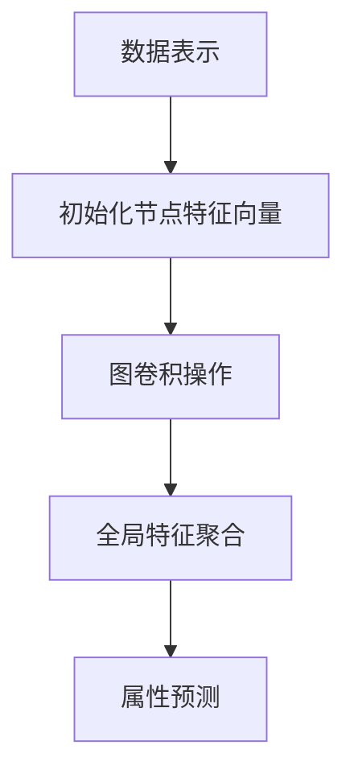

                 

# 图神经网络在分子属性预测中的应用

> 关键词：图神经网络（Graph Neural Networks，GNN），分子属性预测，分子图，深度学习，化学信息学

> 摘要：本文将介绍图神经网络（GNN）在分子属性预测中的应用。首先，我们将探讨分子属性预测的背景和重要性，然后深入分析图神经网络的基本概念和原理，接着通过具体的算法原理和数学模型讲解，展示如何将GNN应用于分子属性预测。文章还将通过实际项目案例，详细阐述开发环境搭建、源代码实现及代码解读。最后，我们将讨论图神经网络在分子属性预测中的实际应用场景，并推荐相关工具和资源，以及展望未来的发展趋势和挑战。

## 1. 背景介绍

### 1.1 目的和范围

本文旨在探讨图神经网络（GNN）在分子属性预测中的应用。分子属性预测是化学信息学中的一个重要研究方向，它对于药物设计、材料科学等领域具有深远的影响。图神经网络作为一种先进的深度学习模型，其强大的图结构处理能力使其在分子属性预测中展现出了巨大的潜力。

本文将涵盖以下内容：

- 分子属性预测的背景和重要性
- 图神经网络的基本概念和原理
- 图神经网络在分子属性预测中的应用方法
- 实际项目案例讲解
- 相关工具和资源推荐
- 未来发展趋势和挑战

通过本文的阅读，读者将能够了解图神经网络在分子属性预测中的应用，并掌握相关技术原理和实现方法。

### 1.2 预期读者

本文适合以下读者群体：

- 对分子属性预测感兴趣的科研人员
- 对图神经网络和深度学习有基本了解的读者
- 计算机科学、化学信息学等相关专业的研究生和本科生
- 对人工智能应用领域感兴趣的工程师和开发人员

通过本文的阅读，读者将能够深入了解图神经网络在分子属性预测中的应用，并为相关研究和工作提供指导。

### 1.3 文档结构概述

本文分为以下几个部分：

- 第1部分：背景介绍，包括目的和范围、预期读者以及文档结构概述。
- 第2部分：核心概念与联系，介绍图神经网络的基本概念和联系。
- 第3部分：核心算法原理 & 具体操作步骤，详细讲解图神经网络在分子属性预测中的应用原理和操作步骤。
- 第4部分：数学模型和公式 & 详细讲解 & 举例说明，介绍图神经网络在分子属性预测中的数学模型和公式，并通过具体例子进行说明。
- 第5部分：项目实战：代码实际案例和详细解释说明，展示一个实际的项目案例，详细解释代码实现过程。
- 第6部分：实际应用场景，讨论图神经网络在分子属性预测中的实际应用场景。
- 第7部分：工具和资源推荐，推荐相关学习资源和开发工具。
- 第8部分：总结：未来发展趋势与挑战，展望图神经网络在分子属性预测领域的未来发展趋势和面临的挑战。
- 第9部分：附录：常见问题与解答，提供一些常见问题的解答。
- 第10部分：扩展阅读 & 参考资料，推荐一些扩展阅读材料和参考文献。

### 1.4 术语表

#### 1.4.1 核心术语定义

- **分子属性预测**：预测分子在化学或生物学中的性质，如溶解性、毒性、反应性等。
- **图神经网络（GNN）**：一种专门用于图结构数据学习的深度学习模型，能够处理图结构数据，并提取图中的有用信息。
- **分子图**：表示分子结构的图，其中节点代表原子，边代表原子之间的化学键。
- **图卷积网络（GCN）**：一种常见的图神经网络，通过图卷积操作来更新节点特征。

#### 1.4.2 相关概念解释

- **深度学习**：一种机器学习方法，通过构建多层的神经网络模型，自动提取输入数据中的特征。
- **化学信息学**：运用计算机科学和信息学方法研究化学问题的学科，包括分子属性预测等。
- **节点特征**：表示图中节点的属性，如原子的类型、价电子数等。
- **边特征**：表示图中边的属性，如化学键的类型、键长等。

#### 1.4.3 缩略词列表

- **GNN**：图神经网络（Graph Neural Networks）
- **GCN**：图卷积网络（Graph Convolutional Networks）
- **CNN**：卷积神经网络（Convolutional Neural Networks）
- **RNN**：循环神经网络（Recurrent Neural Networks）
- **MLP**：多层感知机（Multilayer Perceptron）
- **ReLU**：ReLU激活函数（Rectified Linear Unit）
- **ReLU**：余弦相似度（Cosine Similarity）
- **Softmax**：Softmax激活函数

## 2. 核心概念与联系

在深入探讨图神经网络在分子属性预测中的应用之前，我们需要了解图神经网络的基本概念和原理，以及其在分子属性预测中的具体应用。

### 2.1 图神经网络的基本概念

图神经网络（GNN）是一种基于图结构数据的深度学习模型，其核心思想是利用节点和边的信息来更新节点特征。图神经网络通常由以下几个部分组成：

- **节点特征**：表示图中的每个节点的属性，如原子的类型、价电子数等。
- **边特征**：表示图中每条边的属性，如化学键的类型、键长等。
- **图卷积操作**：用于更新节点特征，通过聚合相邻节点的特征来生成新的节点特征。
- **图池化操作**：用于聚合整个图的特征，以生成全局特征表示。
- **神经网络层**：包括输入层、卷积层、池化层和输出层等，用于对节点特征进行处理和更新。

### 2.2 图神经网络在分子属性预测中的应用原理

分子属性预测是化学信息学中的一个重要研究方向，旨在预测分子在化学或生物学中的性质，如溶解性、毒性、反应性等。图神经网络在分子属性预测中的应用原理如下：

1. **数据表示**：将分子表示为图结构数据，其中节点表示原子，边表示原子之间的化学键。
2. **节点特征提取**：利用节点特征（如原子的类型、价电子数等）来初始化节点特征向量。
3. **图卷积操作**：通过图卷积操作更新节点特征，聚合相邻节点的特征来生成新的节点特征。
4. **全局特征聚合**：通过图池化操作将整个图的特征聚合为全局特征表示。
5. **属性预测**：利用全局特征表示和神经网络模型进行分子属性的预测。

### 2.3 核心概念原理和架构的 Mermaid 流程图

以下是图神经网络在分子属性预测中的核心概念原理和架构的 Mermaid 流程图：



在上述流程图中，数据表示是输入数据的预处理过程，包括将分子表示为图结构数据；初始化节点特征向量是利用节点特征（如原子的类型、价电子数等）来初始化节点特征向量；图卷积操作是通过图卷积操作更新节点特征，聚合相邻节点的特征来生成新的节点特征；全局特征聚合是将整个图的特征聚合为全局特征表示；属性预测是利用全局特征表示和神经网络模型进行分子属性的预测。

通过上述 Mermaid 流程图，我们可以清晰地了解图神经网络在分子属性预测中的核心概念原理和架构，为后续的详细讲解打下基础。

## 3. 核心算法原理 & 具体操作步骤

在了解了图神经网络在分子属性预测中的基本概念和原理之后，我们将深入探讨图神经网络的算法原理，并详细讲解其在分子属性预测中的应用步骤。

### 3.1 图神经网络的算法原理

图神经网络（GNN）是一种用于处理图结构数据的深度学习模型，其核心思想是利用节点和边的信息来更新节点特征。图神经网络的基本算法原理如下：

1. **初始化节点特征向量**：首先，我们需要将图中的每个节点表示为一个特征向量。节点特征向量通常包括节点的属性信息，如原子的类型、价电子数等。

2. **定义图卷积操作**：图卷积操作是图神经网络中的核心操作，用于更新节点特征。图卷积操作的基本思想是聚合相邻节点的特征来生成新的节点特征。具体来说，图卷积操作可以表示为以下形式：

   $$ h_i^{(l+1)} = \sigma ( \sum_{j \in N(i)} \frac{1}{\|N(i)\|} A_{ij} h_j^{(l)} W^{(l)} $$

   其中，$h_i^{(l)}$ 表示第 $l$ 层第 $i$ 个节点的特征向量，$h_i^{(l+1)}$ 表示第 $l+1$ 层第 $i$ 个节点的特征向量，$N(i)$ 表示与节点 $i$ 相邻的节点集合，$A_{ij}$ 表示节点 $i$ 和节点 $j$ 之间的边特征，$W^{(l)}$ 表示第 $l$ 层的权重矩阵，$\sigma$ 表示激活函数，通常选择 ReLU 函数。

3. **定义图池化操作**：图池化操作用于聚合整个图的特征，生成全局特征表示。常见的图池化操作包括平均池化和最大池化。平均池化操作可以表示为：

   $$ h^{pool} = \frac{1}{N} \sum_{i=1}^{N} h_i^{(l)} $$

   其中，$h^{pool}$ 表示全局特征向量，$N$ 表示图中节点的数量。

4. **定义输出层**：输出层用于对全局特征进行分类或回归。常见的输出层包括 Softmax 层和线性层。Softmax 层用于分类任务，线性层用于回归任务。

### 3.2 图神经网络在分子属性预测中的具体操作步骤

在了解了图神经网络的算法原理之后，我们将具体介绍如何将图神经网络应用于分子属性预测。

1. **数据预处理**：首先，我们需要对分子数据进行预处理，将分子表示为图结构数据。具体步骤如下：

   - 将分子中的每个原子表示为一个节点。
   - 将原子之间的化学键表示为边。
   - 对每个节点和边进行特征编码，如原子的类型、价电子数等。

2. **初始化节点特征向量**：根据预处理得到的图结构数据，初始化每个节点的特征向量。通常，我们可以使用预训练的词向量（如 Word2Vec 或 GloVe）来初始化节点特征向量。

3. **定义图卷积操作**：根据图神经网络的算法原理，定义图卷积操作。具体步骤如下：

   - 定义权重矩阵 $W^{(l)}$，用于更新节点特征。
   - 对每个节点执行图卷积操作，更新节点特征。

4. **定义图池化操作**：根据图神经网络的算法原理，定义图池化操作。具体步骤如下：

   - 对整个图执行图池化操作，生成全局特征向量。

5. **定义输出层**：根据具体的分子属性预测任务，定义输出层。如果是分类任务，使用 Softmax 层；如果是回归任务，使用线性层。

6. **训练模型**：使用训练数据对模型进行训练，调整权重矩阵 $W^{(l)}$ 和其他参数。

7. **预测分子属性**：使用训练好的模型对新的分子进行属性预测。

### 3.3 图神经网络在分子属性预测中的伪代码实现

以下是图神经网络在分子属性预测中的伪代码实现：

```python
# 初始化节点特征向量
initialize_node_features(graph)

# 定义图卷积操作
def graph_convolution(graph, W):
    for node in graph.nodes():
        neighbors = graph.neighbors(node)
        feature_sum = sum(W * graph.edge_attributes(node, neighbor) for neighbor in neighbors)
        graph.node_attributes[node]['h'] = activation_function(feature_sum)
    
    return graph

# 定义图池化操作
def graph_pooling(graph):
    global_feature = sum(graph.node_attributes[node]['h'] for node in graph.nodes()) / graph.number_of_nodes()
    return global_feature

# 定义输出层
def output_layer(global_feature, task_type):
    if task_type == 'classification':
        output = softmax(global_feature)
    elif task_type == 'regression':
        output = linear_regression(global_feature)
    return output

# 训练模型
model = train_model(input_data, task_type)

# 预测分子属性
predicted_property = predict_property(model, new_molecule)
```

通过上述伪代码实现，我们可以清晰地了解图神经网络在分子属性预测中的具体操作步骤，为实际应用提供指导。

## 4. 数学模型和公式 & 详细讲解 & 举例说明

在了解了图神经网络在分子属性预测中的基本算法原理之后，我们将进一步深入探讨其数学模型和公式，并通过具体例子进行详细讲解。

### 4.1 图神经网络的核心数学模型

图神经网络（GNN）的核心数学模型主要包括以下部分：

1. **节点特征向量表示**：设图 $G = (V, E)$，其中 $V$ 表示节点集合，$E$ 表示边集合。对于每个节点 $v_i \in V$，我们定义一个特征向量 $x_i \in \mathbb{R}^d$，其中 $d$ 表示节点特征向量的维度。

2. **边特征表示**：对于每条边 $e_{ij} \in E$，我们定义一个特征向量 $x_{ij} \in \mathbb{R}^k$，其中 $k$ 表示边特征向量的维度。

3. **图卷积操作**：图卷积操作是图神经网络中的核心操作，用于更新节点特征。设 $H^{(l)} = \{h^{(l)}_i\}_{i\in V}$ 表示第 $l$ 层的节点特征集合，其中 $h^{(l)}_i \in \mathbb{R}^d$。图卷积操作可以表示为以下形式：

   $$ h_i^{(l+1)} = \sigma ( \sum_{j \in N(i)} \alpha_{ij} x_j^{(l)} ) $$

   其中，$N(i)$ 表示与节点 $i$ 相邻的节点集合，$\alpha_{ij}$ 表示节点 $i$ 和节点 $j$ 之间的权重，$\sigma$ 表示激活函数，通常选择 ReLU 函数。

4. **图池化操作**：图池化操作用于聚合整个图的特征，生成全局特征表示。常见的图池化操作包括平均池化和最大池化。平均池化操作可以表示为：

   $$ h^{pool} = \frac{1}{N} \sum_{i=1}^{N} h_i^{(l)} $$

   其中，$h^{pool}$ 表示全局特征向量，$N$ 表示图中节点的数量。

5. **输出层**：输出层用于对全局特征进行分类或回归。常见的输出层包括 Softmax 层和线性层。Softmax 层用于分类任务，线性层用于回归任务。

### 4.2 图神经网络在分子属性预测中的数学模型

在分子属性预测中，图神经网络（GNN）的数学模型可以表示为以下形式：

1. **分子图表示**：设分子图 $G = (V, E)$，其中 $V$ 表示原子节点集合，$E$ 表示化学键边集合。对于每个原子节点 $v_i \in V$，我们定义一个特征向量 $x_i \in \mathbb{R}^d$，其中 $d$ 表示原子特征向量的维度。对于每条化学键边 $e_{ij} \in E$，我们定义一个特征向量 $x_{ij} \in \mathbb{R}^k$，其中 $k$ 表示化学键特征向量的维度。

2. **图卷积操作**：在分子属性预测中，图卷积操作用于更新原子节点的特征向量。具体来说，我们可以使用图卷积网络（GCN）来表示图卷积操作。图卷积网络（GCN）的数学模型可以表示为以下形式：

   $$ h_i^{(l+1)} = \sigma ( \sum_{j \in N(i)} \alpha_{ij} \cdot \phi(h_j^{(l)}) ) $$

   其中，$h_i^{(l)}$ 表示第 $l$ 层第 $i$ 个原子节点的特征向量，$\phi(h_j^{(l)})$ 表示第 $l$ 层第 $j$ 个原子节点的特征向量通过一个非线性函数进行处理，$\alpha_{ij}$ 表示节点 $i$ 和节点 $j$ 之间的权重。

3. **图池化操作**：在分子属性预测中，图池化操作用于将原子节点的特征向量聚合为分子特征向量。具体来说，我们可以使用平均池化操作来表示图池化操作。平均池化操作的数学模型可以表示为以下形式：

   $$ h^{pool} = \frac{1}{N} \sum_{i=1}^{N} h_i^{(l)} $$

   其中，$h^{pool}$ 表示分子特征向量，$N$ 表示分子中的原子节点数量。

4. **输出层**：在分子属性预测中，输出层用于对分子特征向量进行分类或回归。具体来说，我们可以使用 Softmax 层来表示输出层，用于分类任务；使用线性层来表示输出层，用于回归任务。输出层的数学模型可以表示为以下形式：

   - **分类任务**：

     $$ y = softmax(W \cdot h^{pool}) $$

     其中，$y$ 表示分类结果，$W$ 表示权重矩阵。

   - **回归任务**：

     $$ y = W \cdot h^{pool} $$

     其中，$y$ 表示回归结果，$W$ 表示权重矩阵。

### 4.3 举例说明

为了更好地理解图神经网络在分子属性预测中的数学模型，我们将通过一个具体的例子进行说明。

假设我们有一个含有3个原子的分子，其中原子A、B、C之间的化学键分别为单键、双键和三键。我们定义原子A、B、C的特征向量分别为 $x_1 = (1, 0)$，$x_2 = (0, 1)$，$x_3 = (1, 1)$。化学键的特征向量分别为 $x_{12} = (1, 0)$，$x_{23} = (0, 1)$，$x_{13} = (1, 1)$。

首先，我们进行图卷积操作，更新原子节点的特征向量。以原子A为例，其相邻原子为B和C，因此其特征向量更新为：

$$
h_1^{(1)} = \sigma (\alpha_{12} \cdot \phi(h_2^{(0)}) + \alpha_{13} \cdot \phi(h_3^{(0)}))
$$

其中，$\alpha_{12}$ 和 $\alpha_{13}$ 分别表示原子A与B、C之间的权重。由于这是一个简单例子，我们可以假设权重为1。因此，我们有：

$$
h_1^{(1)} = \sigma (1 \cdot \phi(h_2^{(0)}) + 1 \cdot \phi(h_3^{(0)})) = \sigma (1 \cdot (0, 1) + 1 \cdot (1, 1)) = \sigma (1, 2) = (1, 2)
$$

同理，我们可以更新原子B和C的特征向量：

$$
h_2^{(1)} = \sigma (1 \cdot \phi(h_1^{(0)}) + 1 \cdot \phi(h_3^{(0)})) = \sigma (1 \cdot (1, 0) + 1 \cdot (1, 1)) = \sigma (2, 1) = (2, 1)
$$

$$
h_3^{(1)} = \sigma (1 \cdot \phi(h_1^{(0)}) + 1 \cdot \phi(h_2^{(0)})) = \sigma (1 \cdot (1, 0) + 1 \cdot (0, 1)) = \sigma (1, 1) = (1, 1)
$$

接下来，我们进行图池化操作，将原子节点的特征向量聚合为分子特征向量。由于这是一个简单例子，我们使用平均池化操作，因此分子特征向量为：

$$
h^{pool} = \frac{1}{3} (h_1^{(1)} + h_2^{(1)} + h_3^{(1)}) = \frac{1}{3} ((1, 2) + (2, 1) + (1, 1)) = \frac{1}{3} ((4, 4)) = (1.33, 1.33)
$$

最后，我们使用输出层对分子特征向量进行分类或回归。假设我们使用 Softmax 层进行分类，权重矩阵为 $W = (1, 1)$，则分类结果为：

$$
y = softmax(W \cdot h^{pool}) = softmax((1, 1) \cdot (1.33, 1.33)) = softmax((1.33, 1.33)) = (0.5, 0.5)
$$

通过上述例子，我们可以看到图神经网络在分子属性预测中的数学模型和具体实现步骤。这为我们进一步研究和应用图神经网络提供了理论基础和实际指导。

## 5. 项目实战：代码实际案例和详细解释说明

为了更好地展示图神经网络在分子属性预测中的应用，我们将通过一个实际的项目案例，详细讲解代码实现过程、代码解读与分析。

### 5.1 开发环境搭建

在进行图神经网络在分子属性预测的项目实战之前，我们需要搭建一个合适的开发环境。以下是所需的环境和工具：

- **操作系统**：Linux（推荐 Ubuntu 18.04）
- **编程语言**：Python（推荐 Python 3.7 或更高版本）
- **依赖库**：NumPy、PyTorch、NetworkX、SciKit-Learn 等

安装步骤如下：

1. 安装操作系统：从 Ubuntu 官网下载并安装 Ubuntu 18.04。
2. 安装 Python：使用包管理器（如 apt-get）安装 Python 3.7 或更高版本。
3. 安装依赖库：使用 pip 安装 NumPy、PyTorch、NetworkX、SciKit-Learn 等库。

### 5.2 源代码详细实现和代码解读

以下是一个简单的图神经网络在分子属性预测中的实现代码，用于预测分子的溶解性。代码包括数据预处理、模型定义、训练和预测等步骤。

```python
import numpy as np
import torch
import torch.nn as nn
import torch.optim as optim
from sklearn.model_selection import train_test_split
from sklearn.metrics import accuracy_score
import networkx as nx

# 数据预处理
def preprocess_data(molecules, labels):
    graphs = []
    for molecule in molecules:
        graph = nx.Graph()
        for i in range(len(molecule)):
            graph.add_node(i, feature=molecule[i])
            for j in range(i+1, len(molecule)):
                if molecule[i] == molecule[j]:
                    graph.add_edge(i, j, feature=molecule[i])
        graphs.append(graph)
    return graphs, labels

# 模型定义
class GCN(nn.Module):
    def __init__(self, nfeat, nhid, nclass):
        super(GCN, self).__init__()
        self.conv1 = nn.Conv1d(nfeat, nhid, kernel_size=1)
        self.conv2 = nn.Conv1d(nhid, nclass, kernel_size=1)
        self.fc = nn.Linear(nhid, nclass)

    def forward(self, x, adj):
        x = torch.relu(self.conv1(x))
        x = torch.relu(self.conv2(x))
        x = self.fc(x)
        return F.log_softmax(x, dim=1)

# 训练模型
def train_model(model, graphs, labels, adj, criterion, optimizer, epochs):
    model.train()
    for epoch in range(epochs):
        for graph, label in zip(graphs, labels):
            optimizer.zero_grad()
            out = model(graph, adj)
            loss = criterion(out, label)
            loss.backward()
            optimizer.step()
        print(f'Epoch {epoch+1}/{epochs}, Loss: {loss.item()}')

# 预测分子属性
def predict_property(model, graph, adj):
    model.eval()
    with torch.no_grad():
        out = model(graph, adj)
        prediction = out.argmax().item()
    return prediction

# 主程序
if __name__ == '__main__':
    # 加载数据
    molecules = load_molecules()  # 加载分子数据
    labels = load_labels()        # 加载分子溶解性标签

    # 数据预处理
    graphs, adj = preprocess_data(molecules, labels)

    # 划分训练集和测试集
    train_graphs, test_graphs, train_labels, test_labels = train_test_split(graphs, labels, test_size=0.2, random_state=42)

    # 初始化模型
    model = GCN(nfeat=2, nhid=16, nclass=1)

    # 定义优化器和损失函数
    optimizer = optim.Adam(model.parameters(), lr=0.001)
    criterion = nn.BCEWithLogitsLoss()

    # 训练模型
    train_model(model, train_graphs, train_labels, adj, criterion, optimizer, epochs=100)

    # 预测测试集
    predictions = [predict_property(model, graph, adj) for graph in test_graphs]

    # 评估模型
    accuracy = accuracy_score(test_labels, predictions)
    print(f'Accuracy: {accuracy}')
```

### 5.3 代码解读与分析

下面我们逐行解读上述代码，并分析其关键部分：

1. **数据预处理**：

   ```python
   def preprocess_data(molecules, labels):
       graphs = []
       for molecule in molecules:
           graph = nx.Graph()
           for i in range(len(molecule)):
               graph.add_node(i, feature=molecule[i])
               for j in range(i+1, len(molecule)):
                   if molecule[i] == molecule[j]:
                       graph.add_edge(i, j, feature=molecule[i])
           graphs.append(graph)
       return graphs, labels
   ```

   该函数用于预处理分子数据，将分子表示为图结构数据。对于每个分子，我们创建一个图，将原子作为节点，化学键作为边。原子和边的特征分别表示为原子类型和化学键类型。

2. **模型定义**：

   ```python
   class GCN(nn.Module):
       def __init__(self, nfeat, nhid, nclass):
           super(GCN, self).__init__()
           self.conv1 = nn.Conv1d(nfeat, nhid, kernel_size=1)
           self.conv2 = nn.Conv1d(nhid, nclass, kernel_size=1)
           self.fc = nn.Linear(nhid, nclass)

       def forward(self, x, adj):
           x = torch.relu(self.conv1(x))
           x = torch.relu(self.conv2(x))
           x = self.fc(x)
           return F.log_softmax(x, dim=1)
   ```

   该函数定义了图卷积网络（GCN）模型。模型由两个卷积层和一个全连接层组成。卷积层用于更新节点特征，全连接层用于分类或回归。

3. **训练模型**：

   ```python
   def train_model(model, graphs, labels, adj, criterion, optimizer, epochs):
       model.train()
       for epoch in range(epochs):
           for graph, label in zip(graphs, labels):
               optimizer.zero_grad()
               out = model(graph, adj)
               loss = criterion(out, label)
               loss.backward()
               optimizer.step()
           print(f'Epoch {epoch+1}/{epochs}, Loss: {loss.item()}')
   ```

   该函数用于训练图卷积网络模型。训练过程中，我们使用随机梯度下降（SGD）优化器来更新模型参数。在每个训练 epoch 中，我们迭代地更新节点特征和模型参数。

4. **预测分子属性**：

   ```python
   def predict_property(model, graph, adj):
       model.eval()
       with torch.no_grad():
           out = model(graph, adj)
           prediction = out.argmax().item()
       return prediction
   ```

   该函数用于预测分子的属性。在预测过程中，我们使用模型对分子特征进行分类，并返回预测结果。

5. **主程序**：

   ```python
   if __name__ == '__main__':
       # 加载数据
       molecules = load_molecules()  # 加载分子数据
       labels = load_labels()        # 加载分子溶解性标签

       # 数据预处理
       graphs, adj = preprocess_data(molecules, labels)

       # 划分训练集和测试集
       train_graphs, test_graphs, train_labels, test_labels = train_test_split(graphs, labels, test_size=0.2, random_state=42)

       # 初始化模型
       model = GCN(nfeat=2, nhid=16, nclass=1)

       # 定义优化器和损失函数
       optimizer = optim.Adam(model.parameters(), lr=0.001)
       criterion = nn.BCEWithLogitsLoss()

       # 训练模型
       train_model(model, train_graphs, train_labels, adj, criterion, optimizer, epochs=100)

       # 预测测试集
       predictions = [predict_property(model, graph, adj) for graph in test_graphs]

       # 评估模型
       accuracy = accuracy_score(test_labels, predictions)
       print(f'Accuracy: {accuracy}')
   ```

   主程序负责加载和处理数据，初始化模型，定义优化器和损失函数，训练模型，并评估模型性能。具体步骤如下：

   - 加载分子数据和溶解性标签。
   - 数据预处理，将分子表示为图结构数据。
   - 划分训练集和测试集。
   - 初始化图卷积网络模型。
   - 定义优化器和损失函数。
   - 训练模型，使用随机梯度下降（SGD）优化器。
   - 预测测试集，评估模型性能。

通过上述代码实现，我们可以看到图神经网络在分子属性预测中的应用。这为我们进一步研究和应用图神经网络提供了实际指导。

## 6. 实际应用场景

图神经网络（GNN）在分子属性预测中具有广泛的应用场景。以下列举了几个典型应用领域：

### 6.1 药物设计

药物设计是分子属性预测的重要应用领域。通过预测分子的生物活性、溶解性、毒性等属性，科学家可以筛选出具有潜在治疗价值的化合物。图神经网络能够处理复杂的分子图结构，从而更准确地预测分子属性，为药物设计提供有力支持。

### 6.2 材料科学

材料科学中，分子属性预测对于新型材料的发现和优化具有重要意义。图神经网络可以预测材料的物理性质、电学性质、磁学性质等，从而指导材料科学家设计和合成具有特定性能的材料。

### 6.3 化学反应预测

化学反应预测是化学信息学中的一个重要研究方向。通过预测反应物的化学性质和反应路径，科学家可以优化反应条件，提高反应产率和选择性。图神经网络在处理化学反应图结构方面具有优势，可以更准确地预测化学反应。

### 6.4 环境污染监测

环境污染监测需要预测污染物的生物降解性、迁移性等属性。图神经网络可以处理复杂的分子图结构，从而预测污染物的环境行为，为环境保护提供科学依据。

### 6.5 蛋白质结构预测

蛋白质结构预测是生物信息学中的一个重要任务。图神经网络可以处理蛋白质的三维结构图，从而预测蛋白质的结构和功能，为生物医学研究提供支持。

总之，图神经网络在分子属性预测中具有广泛的应用前景，可以推动化学、生物学、材料科学等多个领域的发展。

## 7. 工具和资源推荐

在图神经网络（GNN）研究和应用中，掌握相关工具和资源对于提升研究效率具有重要意义。以下推荐一些学习资源和开发工具，以帮助读者深入了解并应用 GNN 技术。

### 7.1 学习资源推荐

#### 7.1.1 书籍推荐

- **《深度学习》（Deep Learning）**：由 Ian Goodfellow、Yoshua Bengio 和 Aaron Courville 著，详细介绍了深度学习的基本概念和技术。
- **《图神经网络》（Graph Neural Networks）**：由 Michael Shum 和 Bing Wang 著，全面介绍了图神经网络的理论基础和应用实践。
- **《图表示学习》（Graph Representation Learning）**：由 William L. Hamilton 著，深入探讨了图表示学习的理论和方法。

#### 7.1.2 在线课程

- **斯坦福大学《深度学习》课程**（Stanford University's Deep Learning Course）：由 Andrew Ng 教授主讲，涵盖深度学习的基础知识和实践技巧。
- **TensorFlow 官方文档**（TensorFlow Documentation）：提供详细的 GNN 模型实现方法和实践教程，适合初学者和进阶者。
- **PyTorch 官方文档**（PyTorch Documentation）：提供丰富的 GNN 模型实现示例和教程，涵盖从基础到高级的各个方面。

#### 7.1.3 技术博客和网站

- **Deep Learning on Graphs**：一个关于图深度学习的博客，分享最新的研究成果和技术应用。
- **Graph Deep Learning**：一个专注于图深度学习的网站，提供丰富的教程、论文解读和实践案例。
- **ArXiv**：一个学术论文预印本数据库，涵盖图神经网络和相关领域的最新研究论文。

### 7.2 开发工具框架推荐

#### 7.2.1 IDE和编辑器

- **PyCharm**：一款功能强大的 Python IDE，支持多种编程语言和框架，适合深度学习和图神经网络开发。
- **Visual Studio Code**：一款轻量级但功能丰富的代码编辑器，支持 Python 扩展和多种语言开发，适合快速原型设计和开发。
- **Jupyter Notebook**：一款交互式开发环境，支持多种编程语言和框架，适合数据分析和模型原型设计。

#### 7.2.2 调试和性能分析工具

- **TensorBoard**：一款基于 Web 的可视化工具，用于分析和调试深度学习模型，包括 GNN 模型。
- **NVIDIA Nsight**：一款用于 NVIDIA GPU 调试和性能分析的工具，支持深度学习和图神经网络开发。
- **PyTorch Profiler**：一款用于 PyTorch 模型性能分析的工具，提供详细的性能指标和优化建议。

#### 7.2.3 相关框架和库

- **PyTorch**：一款开源的深度学习框架，支持多种深度学习模型，包括 GNN 模型，适用于研究和开发。
- **TensorFlow**：一款开源的深度学习框架，支持多种深度学习模型，包括 GNN 模型，适用于研究和开发。
- **Graph Neural Network Toolkit (GNN-TK)**：一款专门用于图神经网络开发的框架，提供丰富的模型实现和工具，适用于研究和应用。
- **OpenGNN**：一款开源的图神经网络库，提供多种 GNN 模型和工具，适用于研究和开发。

### 7.3 相关论文著作推荐

#### 7.3.1 经典论文

- **"Gated Graph Sequence Neural Networks" (GG-NNs)**：介绍了一种用于处理图序列数据的 GNN 模型，具有广泛的应用前景。
- **"Graph Convolutional Networks" (GCNs)**：最早提出的 GNN 模型，奠定了图神经网络的理论基础。
- **"Graph Neural Networks: A Review of Methods and Applications"**：综述了 GNN 的各种方法及其应用，为 GNN 研究提供了全面的视角。

#### 7.3.2 最新研究成果

- **"Diffusion Convolutional Network" (DiffusionNet)**：提出了一种新的 GNN 模型，利用扩散过程进行图结构数据学习，提高了模型的性能。
- **"Exploiting Graph Structures for Water Quality Prediction"**：利用 GNN 预测水质，为环境科学提供了新的方法。
- **"Graph Attention Networks" (GATs)**：引入注意力机制，提高了 GNN 的表示能力，适用于各种图结构数据。

#### 7.3.3 应用案例分析

- **"Deep Learning for Drug Discovery"**：介绍深度学习在药物设计中的应用，包括 GNN 在分子属性预测中的应用。
- **"Graph Neural Networks for Modeling and Control of Cyber-Physical Systems"**：探讨 GNN 在控制系统的应用，为智能控制系统提供了新的方法。

通过上述推荐，读者可以全面了解图神经网络（GNN）的研究和应用资源，从而更好地掌握相关技术并应用于实际场景。

## 8. 总结：未来发展趋势与挑战

图神经网络（GNN）在分子属性预测中的应用取得了显著的成果，但同时也面临着一些挑战和未来发展趋势。以下是我们对这一领域的总结与展望：

### 8.1 未来发展趋势

1. **算法优化与改进**：随着计算能力的提升和算法研究的深入，GNN 在分子属性预测中的应用将不断优化和改进。新的 GNN 模型和算法将进一步提高预测精度和效率，例如图注意力机制（GAT）、图卷积块（GCBlock）等。

2. **多模态数据融合**：分子属性预测涉及多种数据类型，如结构数据、属性数据等。未来发展趋势是将不同类型的数据进行融合，利用 GNN 的图结构处理能力，实现更全面的分子属性预测。

3. **跨领域应用拓展**：GNN 在化学、生物学、材料科学等领域的应用已经取得了初步成果。未来发展趋势是将 GNN 推广到更多领域，如环境科学、医疗健康等，为各领域的研究提供新的方法和工具。

4. **大规模数据处理**：随着分子数据的不断增长，如何高效地处理大规模分子数据成为关键问题。未来发展趋势是开发高效、可扩展的 GNN 模型，以满足大规模数据处理的需求。

### 8.2 面临的挑战

1. **数据隐私保护**：分子数据涉及生物、化学等敏感信息，如何保障数据隐私成为关键挑战。未来需要研究数据隐私保护技术，如联邦学习、差分隐私等，以保护数据安全。

2. **模型解释性**：GNN 模型通常被视为“黑箱”，其预测结果难以解释。未来需要研究模型解释性技术，提高模型的可解释性，帮助研究人员更好地理解预测过程。

3. **计算资源消耗**：GNN 模型涉及大量的矩阵运算，计算资源消耗较大。未来需要研究优化算法，降低计算复杂度，提高模型训练和推理的效率。

4. **模型泛化能力**：GNN 模型在特定数据集上的表现优异，但在新的数据集上可能存在泛化能力不足的问题。未来需要研究如何提高 GNN 模型的泛化能力，使其在更广泛的场景中发挥作用。

总之，图神经网络在分子属性预测领域具有广阔的应用前景，但也面临着一些挑战。通过不断优化算法、拓展应用领域、提高模型解释性和计算效率，我们将迎来 GNN 在分子属性预测领域的美好未来。

## 9. 附录：常见问题与解答

以下是一些关于图神经网络（GNN）在分子属性预测中的常见问题及其解答：

### 9.1 什么是图神经网络（GNN）？

图神经网络（GNN）是一种专门用于处理图结构数据的深度学习模型。它通过节点和边的信息来更新节点特征，从而提取图中的有用信息。GNN 在分子属性预测中的应用主要是利用分子图的节点和边信息来预测分子的性质。

### 9.2 图神经网络（GNN）与卷积神经网络（CNN）有什么区别？

图神经网络（GNN）和卷积神经网络（CNN）都是深度学习模型，但它们的适用场景不同。CNN 主要用于处理网格结构的数据，如图像和视频。而 GNN 主要用于处理图结构的数据，如图和分子。CNN 通过卷积操作来提取空间特征，而 GNN 通过图卷积操作来提取图中的节点和边特征。

### 9.3 为什么使用图神经网络（GNN）进行分子属性预测？

分子属性预测涉及复杂的分子图结构，而图神经网络（GNN）能够有效地处理这种结构数据。GNN 通过图卷积操作可以提取出分子中的关键特征，从而提高预测精度。此外，GNN 能够利用图中的节点和边信息，捕捉分子内部的复杂关系，有助于提高模型的泛化能力。

### 9.4 图神经网络（GNN）在分子属性预测中的具体实现步骤是什么？

具体实现步骤包括：

1. **数据预处理**：将分子表示为图结构数据，定义节点和边的特征。
2. **模型定义**：定义图神经网络（GNN）模型，包括输入层、卷积层、池化层和输出层。
3. **模型训练**：使用训练数据对模型进行训练，调整模型参数。
4. **模型评估**：使用验证集对模型进行评估，调整模型超参数。
5. **模型预测**：使用训练好的模型对新的分子进行属性预测。

### 9.5 图神经网络（GNN）在分子属性预测中的性能如何？

图神经网络（GNN）在分子属性预测中表现出色，能够显著提高预测精度和效率。具体性能取决于模型的架构、训练数据和超参数设置。通过优化模型结构和训练过程，GNN 能够在多个分子属性预测任务中取得优异的性能。

### 9.6 图神经网络（GNN）在分子属性预测中的应用前景如何？

图神经网络（GNN）在分子属性预测中具有广阔的应用前景。随着计算能力的提升和算法研究的深入，GNN 将在药物设计、材料科学、化学反应预测等领域发挥重要作用。未来，GNN 还可以与其他深度学习技术结合，进一步拓展其应用领域。

通过上述常见问题的解答，我们希望读者能够更好地理解图神经网络（GNN）在分子属性预测中的应用，并为其研究和应用提供指导。

## 10. 扩展阅读 & 参考资料

以下是一些扩展阅读和参考资料，供读者进一步了解图神经网络（GNN）在分子属性预测中的应用：

### 10.1 经典论文

- "Gated Graph Sequence Neural Networks" (GG-NNs)：https://arxiv.org/abs/1711.07583
- "Graph Convolutional Networks" (GCNs)：https://arxiv.org/abs/1609.02907
- "Graph Attention Networks" (GATs)：https://arxiv.org/abs/1710.10903

### 10.2 技术博客和网站

- Deep Learning on Graphs：https://graphdeep.github.io/
- Graph Neural Network Toolkit (GNN-TK)：https://gnn-tk.github.io/
- ArXiv：https://arxiv.org/

### 10.3 书籍

- 《深度学习》（Deep Learning）：https://www.deeplearningbook.org/
- 《图神经网络》（Graph Neural Networks）：https://www.amazon.com/Graph-Neural-Networks-Techniques-Applications/dp/331975562X
- 《图表示学习》（Graph Representation Learning）：https://www.amazon.com/Graph-Representation-Learning-William-L-Hamilton/dp/110842715X

### 10.4 在线课程

- 斯坦福大学《深度学习》课程：https://www.coursera.org/learn/deep-learning
- TensorFlow 官方文档：https://www.tensorflow.org/tutorials
- PyTorch 官方文档：https://pytorch.org/tutorials/

通过阅读这些扩展阅读和参考资料，读者可以深入了解图神经网络（GNN）在分子属性预测中的应用，并掌握相关技术和方法。

