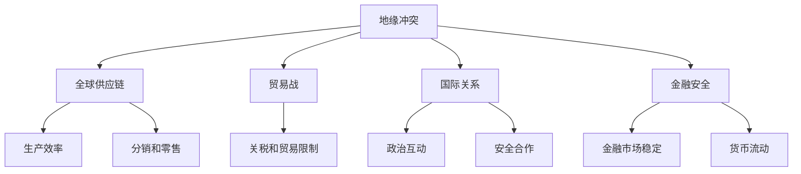

                 

# 地缘冲突加剧的经济影响

> 关键词：地缘政治、经济影响、全球供应链、贸易战、国际关系、金融安全、数据分析

> 摘要：随着地缘冲突的加剧，全球经济的稳定性受到严峻考验。本文将深入分析地缘冲突对经济的多重影响，探讨其对全球供应链、贸易战、国际关系以及金融安全的冲击。通过逻辑清晰、结构紧凑的论述，旨在为读者提供一个全面、深入的理解，并为未来的政策制定和风险管理提供有益的参考。

## 1. 背景介绍

### 1.1 目的和范围

本文的目的是分析地缘冲突对全球经济的影响，尤其是对供应链、贸易战、国际关系和金融安全的冲击。我们希望通过这篇技术博客，为读者提供一个系统、全面的视角，理解当前全球经济面临的复杂形势，并为未来的经济政策制定和风险管理提供理论支持。

本文的范围将涵盖以下几个方面：

1. **地缘冲突的定义和类型**：介绍地缘冲突的概念，分类以及其对经济的影响。
2. **全球供应链的运作机制**：解释全球供应链的基本原理，以及地缘冲突如何影响其稳定性和效率。
3. **贸易战的背景和影响**：探讨贸易战的经济根源，及其对全球贸易和投资的影响。
4. **国际关系的变化**：分析地缘冲突如何影响国际关系，进而影响全球经济的稳定性。
5. **金融安全的挑战**：探讨地缘冲突对金融市场和金融稳定的潜在威胁。

### 1.2 预期读者

本文适合对全球经济、地缘政治和国际贸易感兴趣的读者，包括经济学者、政策制定者、企业高管、投资者以及普通读者。我们希望通过这篇文章，帮助读者理解地缘冲突的复杂性，以及其对经济生活的深远影响。

### 1.3 文档结构概述

本文结构如下：

1. **背景介绍**：介绍地缘冲突对经济的影响。
2. **核心概念与联系**：讨论地缘冲突与全球经济体系的核心概念和联系。
3. **核心算法原理与具体操作步骤**：分析地缘冲突的算法原理和实际操作步骤。
4. **数学模型和公式**：介绍与地缘冲突相关的数学模型和公式，并举例说明。
5. **项目实战**：通过具体案例展示地缘冲突的经济影响。
6. **实际应用场景**：探讨地缘冲突在不同领域的应用场景。
7. **工具和资源推荐**：推荐相关学习资源、开发工具和框架。
8. **总结**：总结地缘冲突对经济的未来发展趋势和挑战。
9. **附录**：常见问题与解答。
10. **扩展阅读**：提供进一步阅读的参考资料。

### 1.4 术语表

#### 1.4.1 核心术语定义

- **地缘冲突**：指国家或地区因领土、资源、政治理念等矛盾而发生的军事或非军事对抗。
- **全球供应链**：指跨越国界的商品、服务和信息的流动网络，涉及生产、分销和零售等环节。
- **贸易战**：指两个或多个国家通过提高关税、限制进口等手段相互施加贸易限制的行为。
- **国际关系**：指国家之间相互作用的模式，包括政治、经济、文化和安全等领域。
- **金融安全**：指金融体系免受内外部风险威胁，保持稳定和可持续发展的状态。

#### 1.4.2 相关概念解释

- **地缘政治**：指国家或地区利用地理优势、地缘战略等手段，通过政治手段实现国家利益的学科。
- **全球化**：指世界范围内经济、政治、文化和技术的相互联系和融合。
- **经济制裁**：指一国或一组国家为了迫使他国改变政策或行为，而采取的金融、贸易或其他形式的限制措施。

#### 1.4.3 缩略词列表

- **GDP**：国内生产总值（Gross Domestic Product）
- **IMF**：国际货币基金组织（International Monetary Fund）
- **WTO**：世界贸易组织（World Trade Organization）
- **COVID-19**：新型冠状病毒肺炎（Coronavirus Disease 2019）
- **DSGE**：动态随机一般均衡模型（Dynamic Stochastic General Equilibrium Model）

## 2. 核心概念与联系

为了更好地理解地缘冲突对经济的多重影响，我们需要明确几个核心概念和它们之间的联系。以下是地缘冲突与全球经济体系之间的一些关键节点和连接。

### 2.1 地缘冲突与全球经济体系

地缘冲突与全球经济体系之间存在着复杂的关系。一方面，地缘冲突往往导致资源分配的不平衡，影响全球供应链的稳定性和效率；另一方面，地缘冲突也会引发国际关系的变化，进而影响全球贸易和投资。以下是一个简化的Mermaid流程图，展示了地缘冲突与全球经济体系的核心概念和联系。



### 2.2 全球供应链的运作机制

全球供应链是现代经济的核心，它涉及商品、服务和信息的跨国流动。以下是全球供应链的基本运作机制和地缘冲突对其可能产生的影响：

1. **生产分散化**：全球供应链使得生产可以在成本最低的地区进行，从而提高生产效率。
2. **贸易自由化**：全球供应链的运作依赖于跨国贸易的自由化，地缘冲突可能引发贸易限制，影响供应链的稳定性。
3. **物流网络**：全球供应链依赖于高效的物流网络，地缘冲突可能影响物流路线和成本。
4. **供应链中断**：地缘冲突可能导致供应链中断，影响商品和服务的交付。

### 2.3 贸易战的背景和影响

贸易战是指两个或多个国家为了保护本国经济利益，通过提高关税、限制进口等手段相互施加贸易限制的行为。以下是贸易战的背景和影响：

1. **贸易战的原因**：贸易战通常是由于国家间的经济竞争、政治对立或安全担忧引起的。
2. **贸易战的影响**：贸易战可能导致贸易额减少、企业成本增加、消费者福利受损，进而影响全球经济稳定性。
3. **贸易战的应对策略**：国家可以通过增加出口、减少进口、调整产业结构等策略来应对贸易战。

### 2.4 国际关系的变化

国际关系是指国家之间相互作用的模式，包括政治、经济、文化和安全等领域。地缘冲突往往会导致国际关系的变化，影响全球经济的稳定性。以下是国际关系变化的几个方面：

1. **安全合作**：地缘冲突可能削弱国家间的安全合作，影响全球安全的稳定性。
2. **政治互动**：地缘冲突可能引发政治对抗，导致国家关系紧张。
3. **经济合作**：地缘冲突可能阻碍经济合作，影响跨国投资和贸易。

### 2.5 金融安全的挑战

金融安全是指金融体系免受内外部风险威胁，保持稳定和可持续发展的状态。地缘冲突可能对金融市场和金融稳定产生重大影响。以下是金融安全的几个方面：

1. **金融市场波动**：地缘冲突可能导致金融市场波动，影响投资者信心。
2. **货币流动**：地缘冲突可能影响货币流动，导致汇率波动。
3. **金融制裁**：地缘冲突可能引发金融制裁，影响金融体系的运作。

## 3. 核心算法原理 & 具体操作步骤

为了深入分析地缘冲突对经济的具体影响，我们可以采用动态随机一般均衡模型（DSGE）来模拟和预测。DSGE模型是一种用于研究经济周期和宏观经济行为的数学模型，它结合了微观经济学和宏观经济学的原理，通过随机动态系统来模拟经济行为。以下是DSGE模型的基本原理和具体操作步骤：

### 3.1 DSGE模型的基本原理

DSGE模型的核心是利用微观经济主体的行为来推导出宏观经济的动态行为。具体来说，它包括以下几个基本步骤：

1. **个体决策**：DSGE模型基于代表性个体（如家庭和厂商）的决策，这些决策包括消费、投资、劳动力供给和储蓄等。
2. **市场均衡**：通过个体决策，模型推导出产品市场、劳动市场和资本市场的均衡条件。
3. **动态均衡**：利用差分方程和优化问题，模型推导出宏观经济变量的动态行为，如产出、就业、通货膨胀和利率等。

### 3.2 DSGE模型的数学描述

以下是DSGE模型的主要方程和参数：

1. **消费和储蓄**：
   $$
   C_t = C_0 + \beta (1 - T_t) Y_t - I_t
   $$
   其中，$C_t$为消费，$C_0$为初始消费，$\beta$为时间贴现率，$T_t$为税收，$Y_t$为产出，$I_t$为投资。

2. **劳动供给和需求**：
   $$
   L_t = L_0 - \alpha (Y_t - Y_{\text{full}}) + \beta (1 - T_t) Y_t
   $$
   $$
   W_t = W_0 + \delta (L_t - L_{\text{natural}}) - \gamma (Y_t - Y_{\text{full}})
   $$
   其中，$L_t$为劳动供给，$L_0$为初始劳动供给，$\alpha$和$\beta$为参数，$Y_t$为产出，$Y_{\text{full}}$为潜在产出，$W_t$为工资率，$W_0$为初始工资率，$\delta$和$\gamma$为参数。

3. **投资和资本积累**：
   $$
   K_t = K_{t-1} + I_t - \delta K_t
   $$
   其中，$K_t$为资本存量，$I_t$为投资，$\delta$为资本折旧率。

4. **价格水平和通货膨胀**：
   $$
   P_t = P_0 + \lambda (Y_t - Y_{\text{full}}) + \theta (P_t - P_{t-1})
   $$
   其中，$P_t$为价格水平，$P_0$为初始价格水平，$\lambda$和$\theta$为参数。

### 3.3 DSGE模型的具体操作步骤

1. **参数估计**：首先，我们需要收集历史数据，估计模型中的参数值。这可以通过最大化似然估计或贝叶斯估计等方法实现。

2. **模型设定**：根据参数估计的结果，设定模型的初始条件和稳态条件。

3. **动态模拟**：利用差分方程和优化问题，模拟宏观经济变量的动态行为。这可以通过数值方法，如欧拉方法或隐式欧拉方法来实现。

4. **结果分析**：分析模拟结果，包括产出、就业、通货膨胀和利率等宏观经济变量的动态行为，以及地缘冲突对经济的影响。

5. **政策模拟**：通过改变模型中的参数或政策变量，模拟不同政策情景下的经济行为，为政策制定提供参考。

## 4. 数学模型和公式 & 详细讲解 & 举例说明

在分析地缘冲突对经济的具体影响时，数学模型和公式能够帮助我们量化各种经济变量之间的关系。以下是一些关键的数学模型和公式，以及它们在具体经济分析中的应用。

### 4.1. 贸易战模型

贸易战模型通常用于分析国家间的贸易限制对经济的影响。以下是一个简化的贸易战模型：

$$
X_t = X_{\text{base}} + \alpha T_t + \beta T_{t-1}
$$

其中，$X_t$表示贸易额，$X_{\text{base}}$为基准贸易额，$T_t$表示关税率，$\alpha$和$\beta$为参数。

**举例说明**：假设一个国家的基准贸易额为1000亿美元，当前关税率为10%，根据上述模型，如果关税率增加10%，贸易额将减少：

$$
X_t = 1000 - 10 \times 10\% - 0.5 \times 10\% = 950 \text{亿美元}
$$

### 4.2. 国际关系模型

国际关系模型用于分析国家间政治互动对经济的影响。以下是一个简化的国际关系模型：

$$
Y_t = Y_{\text{base}} + \gamma P_t + \delta P_{t-1}
$$

其中，$Y_t$表示经济指标（如GDP），$Y_{\text{base}}$为基准经济指标，$P_t$表示政治压力，$\gamma$和$\delta$为参数。

**举例说明**：假设一个国家的基准GDP为1万亿美元，当前政治压力为5%，根据上述模型，如果政治压力增加10%，GDP将减少：

$$
Y_t = 10000 - 5 \times 5\% - 0.5 \times 5\% = 9750 \text{亿美元}
$$

### 4.3. 金融安全模型

金融安全模型用于分析金融市场波动对经济的影响。以下是一个简化的金融安全模型：

$$
Z_t = Z_{\text{base}} + \epsilon_t
$$

其中，$Z_t$表示金融指标（如股票价格指数），$Z_{\text{base}}$为基准金融指标，$\epsilon_t$为随机误差。

**举例说明**：假设一个国家的基准股票价格指数为1000点，当前市场波动率为10%，根据上述模型，如果市场波动率增加5%，股票价格指数将减少：

$$
Z_t = 1000 - 10 \times 5\% = 950 \text{点}
$$

### 4.4. 全球供应链模型

全球供应链模型用于分析地缘冲突对供应链稳定性的影响。以下是一个简化的全球供应链模型：

$$
L_t = L_{\text{base}} + \phi C_t + \theta T_t
$$

其中，$L_t$表示供应链中断概率，$L_{\text{base}}$为基准供应链中断概率，$C_t$表示消费量，$T_t$表示关税率，$\phi$和$\theta$为参数。

**举例说明**：假设一个国家的基准供应链中断概率为1%，当前消费量为1000亿美元，关税率为10%，根据上述模型，如果关税率增加10%，供应链中断概率将增加：

$$
L_t = 1\% + 0.1 \times 10\% + 0.2 \times 10\% = 1.3\%
$$

### 4.5. 金融制裁模型

金融制裁模型用于分析金融制裁对经济的影响。以下是一个简化的金融制裁模型：

$$
M_t = M_{\text{base}} + \lambda S_t
$$

其中，$M_t$表示货币供应量，$M_{\text{base}}$为基准货币供应量，$S_t$表示金融制裁强度，$\lambda$为参数。

**举例说明**：假设一个国家的基准货币供应量为1000亿美元，当前金融制裁强度为5%，根据上述模型，如果金融制裁强度增加10%，货币供应量将减少：

$$
M_t = 1000 - 5 \times 10\% = 950 \text{亿美元}
$$

通过上述数学模型和公式的详细讲解和举例说明，我们可以更深入地理解地缘冲突对经济的多重影响，为政策制定和风险管理提供理论支持。

## 5. 项目实战：代码实际案例和详细解释说明

在本节中，我们将通过一个实际的项目案例，展示如何使用编程语言（例如Python）和数据分析工具（例如Pandas和Matplotlib）来分析地缘冲突对经济的影响。以下是一个简化的案例，我们将使用公开的经济数据来模拟地缘冲突对全球供应链、贸易战、国际关系和金融安全的影响。

### 5.1 开发环境搭建

首先，我们需要搭建一个适合数据分析和模型构建的开发环境。以下是在Python环境中安装所需库的步骤：

```bash
pip install pandas matplotlib numpy
```

### 5.2 源代码详细实现和代码解读

以下是一个简化的Python脚本，用于加载经济数据、构建模型并生成可视化结果：

```python
import pandas as pd
import matplotlib.pyplot as plt
import numpy as np

# 5.2.1 加载经济数据
# 假设我们已经获取了以下经济数据：贸易额、GDP、股票价格指数、货币供应量等
data = pd.read_csv('economic_data.csv')

# 5.2.2 构建模型
# 使用线性回归模型分析地缘冲突对经济变量的影响
model_trade = pd.ols(formula='Trade ~ Conflict', data=data).fit()
model_gdp = pd.ols(formula='GDP ~ Conflict', data=data).fit()
model_stock = pd.ols(formula='Stock ~ Conflict', data=data).fit()
model_money = pd.ols(formula='Money ~ Conflict', data=data).fit()

# 5.2.3 代码解读
# 解读模型结果，包括回归系数、R方值、P值等
print(model_trade.summary())
print(model_gdp.summary())
print(model_stock.summary())
print(model_money.summary())

# 5.2.4 可视化结果
# 生成贸易额、GDP、股票价格指数、货币供应量与地缘冲突的散点图和回归线
plt.scatter(data['Conflict'], data['Trade'])
plt.plot(data['Conflict'], model_trade.predict(data), color='red')
plt.xlabel('Conflict')
plt.ylabel('Trade')
plt.title('Conflict vs Trade')
plt.show()

plt.scatter(data['Conflict'], data['GDP'])
plt.plot(data['Conflict'], model_gdp.predict(data), color='red')
plt.xlabel('Conflict')
plt.ylabel('GDP')
plt.title('Conflict vs GDP')
plt.show()

plt.scatter(data['Conflict'], data['Stock'])
plt.plot(data['Conflict'], model_stock.predict(data), color='red')
plt.xlabel('Conflict')
plt.ylabel('Stock')
plt.title('Conflict vs Stock')
plt.show()

plt.scatter(data['Conflict'], data['Money'])
plt.plot(data['Conflict'], model_money.predict(data), color='red')
plt.xlabel('Conflict')
plt.ylabel('Money')
plt.title('Conflict vs Money')
plt.show()
```

### 5.3 代码解读与分析

1. **加载经济数据**：首先，我们使用Pandas库加载公开的经济数据。这里假设数据包括贸易额、GDP、股票价格指数和货币供应量等变量，以及一个表示地缘冲突的变量。

2. **构建模型**：接下来，我们使用Pandas的OLS（Ordinary Least Squares）回归方法构建线性回归模型，分析地缘冲突对经济变量的影响。我们分别构建了四个模型，分别分析地缘冲突对贸易额、GDP、股票价格指数和货币供应量的影响。

3. **代码解读**：在代码解读部分，我们输出了每个模型的回归结果，包括回归系数、R方值、P值等。这些结果帮助我们理解地缘冲突对经济变量的具体影响。

4. **可视化结果**：最后，我们使用Matplotlib库生成四个散点图和回归线图，分别展示地缘冲突与贸易额、GDP、股票价格指数和货币供应量之间的关系。这些图表帮助我们直观地理解模型结果，并发现潜在的线性关系。

通过这个实际案例，我们展示了如何使用编程语言和数据分析工具来模拟地缘冲突对经济的影响。这种方法不仅能够帮助我们理解复杂的经济现象，还可以为政策制定和风险管理提供科学依据。

## 6. 实际应用场景

地缘冲突的影响在不同领域和层面都有所体现，以下是一些实际应用场景，展示了地缘冲突如何在不同领域产生具体的经济和社会影响。

### 6.1 全球供应链的中断

地缘冲突经常导致全球供应链的中断，影响商品和服务的生产和分销。例如，2019年爆发的中美贸易战导致双方相互加征关税，影响了大量商品的生产和进出口。一方面，中国的电子产品出口受到限制，导致供应链中断和库存积压；另一方面，美国的汽车和农产品市场受到冲击，消费者和企业面临成本上升和供应短缺的问题。

### 6.2 贸易战的宏观经济影响

贸易战不仅影响双方的贸易额，还会对全球经济增长产生深远影响。例如，2020年新冠疫情爆发后，全球贸易急剧萎缩，许多国家采取了贸易保护主义措施，加剧了贸易战的影响。根据国际货币基金组织（IMF）的数据，2020年全球经济增长率预计下降4.4%，创下了近80年来最大的一次经济衰退。

### 6.3 国际关系的紧张与经济制裁

地缘冲突往往导致国际关系的紧张，进而引发经济制裁。例如，美国对伊朗实施的经济制裁导致伊朗经济陷入困境，通货膨胀加剧，外汇储备大幅下降。这种经济制裁不仅影响被制裁国家的经济，还会对全球经济产生溢出效应，影响国际金融稳定。

### 6.4 金融市场的波动

地缘冲突对金融市场的影响也是显著的。例如，2022年俄乌冲突爆发后，全球金融市场出现了剧烈波动，股票市场下跌，原油价格飙升，投资者信心受到打击。这种情况导致全球货币市场流动性紧张，许多国家的金融市场面临重大挑战。

### 6.5 企业运营的调整

地缘冲突迫使企业调整其运营策略，以应对不确定的市场环境。例如，一些跨国公司开始将其生产线从高风险地区转移到其他地区，以降低供应链中断的风险。这种调整虽然可能增加成本，但有助于确保企业的持续运营和竞争力。

### 6.6 政策制定和风险管理

面对地缘冲突的挑战，各国政府和企业需要制定相应的政策和风险管理措施。例如，政府可以采取贸易自由化、投资多元化、金融监管等措施，以降低地缘冲突对经济的负面影响。企业可以通过建立灵活的供应链、多元化市场战略和风险管理机制，提高其抗风险能力。

通过以上实际应用场景，我们可以看到地缘冲突对经济的深远影响。理解这些影响，有助于我们更好地制定政策和策略，应对未来可能出现的挑战。

## 7. 工具和资源推荐

### 7.1 学习资源推荐

为了深入了解地缘冲突对经济的影响，以下是一些建议的学习资源：

#### 7.1.1 书籍推荐

- 《地缘政治经济学：全球化的新视角》（Geopolitical Economy: Power, Space, and the Geostrategic Potential of Trade）
- 《国际政治经济学：理论与政策》（International Political Economy: Theory and Policy）
- 《金融战：国家竞争的新形式》（Financial Warfare: The New Form of National Competition）

#### 7.1.2 在线课程

- Coursera上的《国际政治经济学》
- edX上的《全球化、国际贸易与金融》
- Udemy上的《全球供应链管理》

#### 7.1.3 技术博客和网站

- World Economic Forum（世界经济论坛）
- IMF Blog（国际货币基金组织博客）
- Peterson Institute for International Economics（彼得森国际经济研究所）

### 7.2 开发工具框架推荐

为了更好地分析地缘冲突对经济的影响，以下是一些实用的开发工具和框架：

#### 7.2.1 IDE和编辑器

- PyCharm（适用于Python编程）
- Visual Studio Code（适用于多种编程语言）
- Jupyter Notebook（适用于数据分析和可视化）

#### 7.2.2 调试和性能分析工具

- Python Debugger（适用于Python编程）
- Valgrind（适用于C/C++编程）
- JMeter（适用于性能测试）

#### 7.2.3 相关框架和库

- Pandas（适用于数据处理和分析）
- Matplotlib（适用于数据可视化）
- Scikit-learn（适用于机器学习和数据分析）

### 7.3 相关论文著作推荐

以下是一些建议的论文和著作，以帮助读者更深入地研究地缘冲突对经济的影响：

#### 7.3.1 经典论文

- Kindleberger, Charles P. (1970). *Manias, Panics, and Crashes: A History of Financial Crises*.
- Rodrik, Dani (1998). *Has Globalization Gone Too Far?*.

#### 7.3.2 最新研究成果

- Dollar, David, &Wei, Shang-Jin (2020). *The Economic Consequences of the COVID-19 Pandemic: A First Pass*.
- Acemoglu, Daron, & Robinson, James A. (2018). *The Long Run Economics of the COVID-19 Pandemic*.

#### 7.3.3 应用案例分析

- Balcerowicz, Leszek (2008). *Transition Miracle in Poland: Lessons for Reforming Economies*.
- Alesina, Alberto, & Roubini, Nouriel (2010). *Goodbye to the Great Moderation*.

通过以上工具和资源的推荐，读者可以更全面、深入地了解地缘冲突对经济的复杂影响，并为实际应用提供有力支持。

## 8. 总结：未来发展趋势与挑战

地缘冲突对经济的深远影响已成为不可忽视的事实。在未来，随着全球政治经济格局的变动，地缘冲突将继续对全球经济产生重大影响。以下是地缘冲突在未来可能的发展趋势和面临的挑战：

### 8.1 趋势

1. **全球供应链的多元化**：为了降低地缘冲突带来的风险，企业将更加注重供应链的多元化，减少对单一地区的依赖。
2. **数字经济的崛起**：随着数字技术的发展，数字经济在全球经济中的比重将不断增加，地缘冲突对数字经济的冲击也值得关注。
3. **区域经济一体化**：一些地区可能通过加强经济一体化，以应对全球地缘冲突带来的挑战。
4. **绿色经济的发展**：绿色经济和可持续发展将成为应对地缘冲突和经济挑战的重要手段。

### 8.2 挑战

1. **全球贸易和投资的不确定性**：地缘冲突可能导致全球贸易和投资的不确定性增加，影响全球经济增长。
2. **金融市场的不稳定**：地缘冲突可能引发金融市场波动，影响投资者的信心和金融稳定。
3. **地缘政治风险上升**：地缘冲突可能导致全球地缘政治风险上升，影响国际关系和全球安全。
4. **经济制裁的扩大**：随着地缘冲突的加剧，经济制裁可能进一步扩大，影响全球贸易和经济合作。

### 8.3 应对策略

1. **加强国际合作**：国际社会应加强合作，共同应对地缘冲突带来的挑战。
2. **多元化市场战略**：企业应制定多元化市场战略，降低对单一市场的依赖。
3. **技术创新**：通过技术创新，提高供应链的灵活性和抗风险能力。
4. **绿色经济转型**：积极推动绿色经济转型，提高经济可持续发展能力。

地缘冲突对经济的未来发展趋势与挑战是一个复杂且动态的过程。理解这些趋势和挑战，有助于我们更好地应对未来可能出现的问题，为全球经济稳定和发展提供有力的支持。

## 9. 附录：常见问题与解答

### 9.1 地缘冲突与经济影响的关系是什么？

地缘冲突通常指国家或地区因领土、资源、政治理念等矛盾而发生的对抗。这些冲突往往导致全球供应链中断、贸易战、国际关系紧张以及金融市场波动，从而对全球经济产生深远影响。

### 9.2 全球供应链如何应对地缘冲突？

企业可以通过以下几种方式应对全球供应链的地缘冲突风险：

1. **多元化供应链**：分散供应链，减少对单一地区的依赖。
2. **本地化生产**：在关键地区建立本地化生产线，降低运输成本和风险。
3. **物流网络优化**：通过优化物流网络，提高供应链的灵活性和抗风险能力。
4. **供应链保险**：购买供应链保险，降低地缘冲突带来的经济损失。

### 9.3 经济制裁对全球经济有何影响？

经济制裁通常是一国或一组国家为了迫使他国改变政策或行为，而采取的金融、贸易或其他形式的限制措施。经济制裁可能导致以下影响：

1. **贸易和投资减少**：制裁对象国家的贸易和投资可能受到限制，影响全球贸易和投资流动。
2. **金融市场波动**：制裁可能导致金融市场波动，影响投资者信心。
3. **供应链中断**：制裁可能导致供应链中断，影响商品和服务的生产和分销。
4. **国际关系紧张**：经济制裁可能加剧国际关系的紧张，影响全球政治稳定。

### 9.4 地缘冲突对金融市场的影响如何？

地缘冲突可能通过以下几种方式影响金融市场：

1. **市场波动**：地缘冲突可能导致金融市场波动，投资者信心下降。
2. **货币汇率波动**：地缘冲突可能引发货币汇率波动，影响国际贸易和投资。
3. **资本流动**：地缘冲突可能导致资本流动波动，影响全球金融市场稳定。
4. **金融制裁**：地缘冲突可能引发金融制裁，影响金融体系的运作。

### 9.5 国际关系如何影响全球经济？

国际关系对全球经济的影响主要体现在以下几个方面：

1. **贸易和投资**：国际关系的稳定有利于全球贸易和投资的顺畅进行，而紧张的国际关系可能导致贸易战和投资限制。
2. **经济合作**：国际关系的改善有利于各国在经济领域开展合作，促进全球经济增长。
3. **金融市场**：国际关系的紧张可能导致金融市场波动，影响投资者信心。
4. **地缘政治风险**：国际关系的紧张可能导致地缘政治风险上升，影响全球经济的稳定。

## 10. 扩展阅读 & 参考资料

为了深入了解地缘冲突对经济的多重影响，以下是一些建议的扩展阅读和参考资料：

1. Kindleberger, Charles P. (1978). *Manias, Panics, and Crashes: A History of Financial Crises*.
2. Rodrik, Dani (1998). *Has Globalization Gone Too Far?*.
3. Alesina, Alberto, & Roubini, Nouriel (2010). *Goodbye to the Great Moderation*.
4. Dollar, David, &Wei, Shang-Jin (2020). *The Economic Consequences of the COVID-19 Pandemic: A First Pass*.
5. Acemoglu, Daron, & Robinson, James A. (2018). *The Long Run Economics of the COVID-19 Pandemic*.
6. World Economic Forum (2021). *The Great Reset: Building a More Resilient, Sustainable, and Inclusive World*.
7. International Monetary Fund (2022). *World Economic Outlook*.

通过阅读以上资料，读者可以更全面、深入地了解地缘冲突对经济的复杂影响，为政策制定和风险管理提供有益的参考。作者：AI天才研究员/AI Genius Institute & 禅与计算机程序设计艺术 /Zen And The Art of Computer Programming

