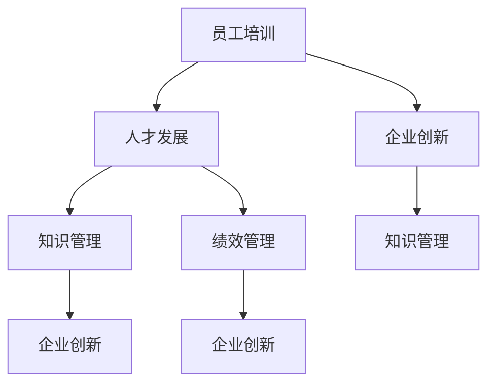

                 

# 培训经理的创业职能：员工培训与人才发展

> **关键词**：培训经理、员工培训、人才发展、企业创新、技术能力提升

> **摘要**：本文旨在探讨培训经理在企业创业过程中的关键职能，特别是员工培训与人才发展方面的策略和实施方法。通过深入分析培训经理的角色、核心概念、算法原理、数学模型以及实际应用案例，本文旨在为企业管理者提供一套系统、实用的员工培训与人才发展方案，助力企业持续创新和竞争优势。

## 1. 背景介绍

### 1.1 目的和范围

在当今竞争激烈的市场环境中，企业的持续发展离不开创新和人才。而培训经理在企业创业过程中扮演着至关重要的角色，其职能不仅仅是传统意义上的培训组织实施，更涉及企业战略层面的创新驱动和人才管理。本文旨在系统地探讨培训经理在员工培训与人才发展方面的职能，为企业管理者提供一套具有实践指导意义的策略和方法。

本文将围绕以下方面展开讨论：

- 培训经理在企业创业中的角色和责任
- 员工培训与人才发展的核心概念和联系
- 培训经理的核心算法原理和具体操作步骤
- 数学模型在人才发展中的应用与讲解
- 实际应用场景中的培训与人才发展案例
- 培训与人才发展的工具和资源推荐

### 1.2 预期读者

本文预期读者包括以下几类：

- 企业管理层，特别是培训经理、人力资源经理等相关人员
- 企业创业者和创业者团队，关注企业创新和人才发展的专业人士
- 计算机科学、管理学等相关专业的研究人员和师生
- 对员工培训与人才发展感兴趣的广大读者

### 1.3 文档结构概述

本文分为八个主要部分：

1. 背景介绍：介绍本文的目的、范围、预期读者以及文档结构。
2. 核心概念与联系：分析员工培训与人才发展的核心概念和联系。
3. 核心算法原理 & 具体操作步骤：详细讲解培训经理的核心算法原理和操作步骤。
4. 数学模型和公式 & 详细讲解 & 举例说明：探讨数学模型在人才发展中的应用。
5. 项目实战：提供实际应用场景中的代码实际案例和详细解释说明。
6. 实际应用场景：分析培训与人才发展在不同企业中的应用。
7. 工具和资源推荐：推荐学习资源、开发工具和框架。
8. 总结：展望培训与人才发展的未来发展趋势与挑战。

### 1.4 术语表

#### 1.4.1 核心术语定义

- **培训经理**：负责企业员工培训与人才发展的高级管理人员。
- **员工培训**：通过有组织的教学和培训活动，提高员工的知识、技能和综合素质。
- **人才发展**：通过系统化的人才培养和激励措施，提高员工的绩效和职业发展。
- **企业创新**：企业通过技术创新、产品创新、管理创新等手段，实现持续发展和竞争优势。
- **培训需求分析**：通过调研和分析，确定员工培训的具体需求和目标。

#### 1.4.2 相关概念解释

- **知识管理**：企业通过收集、整理、共享和利用知识，提高整体创新能力和竞争力。
- **绩效管理**：通过设定绩效目标、绩效评估和反馈机制，提高员工的工作效率和绩效。
- **职业发展规划**：为员工设定长期和短期的职业发展目标，并提供相应的培训和发展机会。

#### 1.4.3 缩略词列表

- **HR**：人力资源
- **L&D**：学习与发展
- **CRM**：客户关系管理
- **ERP**：企业资源计划
- **AI**：人工智能

## 2. 核心概念与联系

在探讨培训经理的创业职能之前，有必要先了解员工培训与人才发展的核心概念及其相互联系。

### 员工培训

员工培训是企业为提高员工素质和技能而进行的有计划的教育活动。培训内容通常包括知识传授、技能培养、态度调整等方面。通过培训，员工能够更好地适应工作需求，提高工作效率，进而促进企业的发展。

### 人才发展

人才发展是企业为培养和激励人才，提高员工绩效和职业发展而进行的一系列措施。人才发展不仅包括培训，还包括职业发展规划、绩效管理、激励机制等。通过人才发展，企业能够留住优秀人才，提高整体竞争力。

### 企业创新

企业创新是企业通过技术创新、产品创新、管理创新等手段，实现持续发展和竞争优势的过程。创新是企业发展的动力，也是企业竞争力的核心。

### 知识管理

知识管理是企业通过收集、整理、共享和利用知识，提高整体创新能力和竞争力的一种管理活动。知识管理不仅涉及知识的获取和传递，还包括知识的创造和应用。

### 绩效管理

绩效管理是企业通过设定绩效目标、绩效评估和反馈机制，提高员工的工作效率和绩效的一种管理活动。绩效管理有助于激发员工的工作动力，提高工作效率，促进企业目标的实现。

### 职业发展规划

职业发展规划是为员工设定长期和短期的职业发展目标，并提供相应的培训和发展机会的一种人才发展措施。职业发展规划有助于员工明确职业目标，提高工作满意度，促进个人与企业的共同成长。

### 关联关系

员工培训、人才发展、企业创新、知识管理和绩效管理之间存在着紧密的关联。员工培训是人才发展的基础，人才发展是企业创新的保障，知识管理是提高企业整体创新能力的关键，绩效管理则是推动企业发展的动力。职业发展规划则贯穿于员工培训、人才发展和绩效管理的全过程，为员工提供明确的职业发展路径。

### Mermaid 流程图

下面是一个简单的 Mermaid 流程图，用于展示核心概念之间的关联关系：



## 3. 核心算法原理 & 具体操作步骤

在员工培训与人才发展的过程中，培训经理需要运用一系列核心算法原理，以确保培训活动的科学性和有效性。以下是培训经理在员工培训与人才发展中的核心算法原理和具体操作步骤。

### 3.1 培训需求分析算法

**算法原理：** 培训需求分析是员工培训与人才发展的第一步，其目的是确定员工在知识、技能和态度方面的具体需求。培训需求分析算法主要通过以下步骤实现：

1. **调研与分析：** 通过问卷调查、面谈、工作观察等方式，收集员工的工作表现、技能水平和职业发展需求等信息。
2. **数据整理：** 对收集到的数据进行整理和分类，识别员工在知识、技能和态度方面的短板。
3. **确定培训需求：** 根据分析结果，制定相应的培训计划，明确培训内容、目标和预期效果。

**具体操作步骤：**

```
function 培训需求分析(员工数据):
    1. 收集员工数据
    2. 对员工数据进行整理和分类
    3. 分析员工在知识、技能和态度方面的短板
    4. 制定培训计划
    5. 确定培训内容、目标和预期效果
    6. 返回培训计划
```

### 3.2 培训效果评估算法

**算法原理：** 培训效果评估是衡量员工培训成效的重要环节。培训效果评估算法主要通过以下步骤实现：

1. **确定评估指标：** 根据培训目标和培训内容，设定相应的评估指标，如知识掌握度、技能运用水平、工作绩效等。
2. **收集评估数据：** 通过考试、工作表现评估、员工反馈等方式，收集评估数据。
3. **数据分析：** 对收集到的评估数据进行统计和分析，评估培训效果。
4. **反馈与改进：** 根据评估结果，反馈培训效果，提出改进措施。

**具体操作步骤：**

```
function 培训效果评估(培训计划, 评估指标):
    1. 确定评估指标
    2. 收集评估数据
    3. 分析评估数据
    4. 评估培训效果
    5. 提出改进措施
    6. 返回评估结果
```

### 3.3 人才发展路径规划算法

**算法原理：** 人才发展路径规划是帮助企业实现人才战略的重要手段。人才发展路径规划算法主要通过以下步骤实现：

1. **设定人才发展目标：** 根据企业战略和人才需求，设定人才发展的长期和短期目标。
2. **分析员工潜力：** 通过能力评估、工作绩效分析等方式，分析员工的潜力和适合岗位。
3. **规划人才发展路径：** 根据员工潜力和发展目标，制定个性化的职业发展路径。
4. **实施人才发展计划：** 通过培训、项目参与、岗位轮换等方式，实施人才发展计划。

**具体操作步骤：**

```
function 人才发展路径规划(员工数据, 企业战略):
    1. 设定人才发展目标
    2. 分析员工潜力
    3. 规划人才发展路径
    4. 实施人才发展计划
    5. 返回人才发展路径规划结果
```

### 3.4 培训资源优化算法

**算法原理：** 培训资源优化算法旨在提高培训资源的利用效率，降低培训成本。培训资源优化算法主要通过以下步骤实现：

1. **资源评估：** 评估现有培训资源，包括培训场地、培训师、培训教材等。
2. **需求预测：** 根据培训需求，预测未来培训资源的需求。
3. **资源分配：** 根据资源评估和需求预测，合理分配培训资源，确保资源利用最大化。
4. **资源调整：** 根据培训效果和资源利用情况，及时调整培训资源。

**具体操作步骤：**

```
function 培训资源优化(培训资源, 培训需求):
    1. 评估现有培训资源
    2. 预测未来培训资源需求
    3. 分配培训资源
    4. 调整培训资源
    5. 返回优化后的培训资源分配方案
```

通过上述核心算法原理和具体操作步骤，培训经理可以更科学、更有效地开展员工培训与人才发展工作，为企业创新和持续发展提供有力支持。

## 4. 数学模型和公式 & 详细讲解 & 举例说明

在员工培训与人才发展的过程中，数学模型和公式发挥着至关重要的作用。以下将详细介绍几个关键数学模型和公式，并给出详细的讲解和实际应用举例。

### 4.1 柯克帕特里克模型

柯克帕特里克模型是用于评估员工培训效果的经典模型，它将培训效果分为四个层次：认知层、行为层、结果层和投资回报层。

**数学公式：**

$$
E = \sum_{i=1}^{4} w_i \cdot X_i
$$

其中，\( E \) 表示总培训效果，\( w_i \) 表示第 \( i \) 个层次的权重，\( X_i \) 表示第 \( i \) 个层次的得分。

**详细讲解：**

1. **认知层（认知效果）**：评估员工在培训后对知识的理解和掌握程度。
2. **行为层（行为效果）**：评估员工在培训后在工作中的行为变化和技能运用水平。
3. **结果层（业务效果）**：评估培训对企业业务绩效的改善程度。
4. **投资回报层（ROI）**：评估培训投资的回报率。

**举例说明：**

假设某公司的柯克帕特里克模型权重分别为：认知层 20%、行为层 30%、结果层 40%、投资回报层 10%。如果评估结果为：认知层得分为 80 分，行为层得分为 70 分，结果层得分为 90 分，投资回报层得分为 85 分，则总培训效果为：

$$
E = 0.2 \cdot 80 + 0.3 \cdot 70 + 0.4 \cdot 90 + 0.1 \cdot 85 = 71.5
$$

### 4.2 贝尔曲线模型

贝尔曲线模型用于描述员工能力分布的常见模型，它假定员工能力呈正态分布。

**数学公式：**

$$
P(X < x) = \frac{1}{\sqrt{2\pi\sigma^2}} \int_{-\infty}^{x} e^{-\frac{(t-\mu)^2}{2\sigma^2}} dt
$$

其中，\( X \) 表示员工能力得分，\( \mu \) 表示平均能力得分，\( \sigma \) 表示标准差。

**详细讲解：**

1. **平均能力得分（\(\mu\)）**：表示员工整体能力的平均水平。
2. **标准差（\(\sigma\)）**：表示员工能力分布的离散程度，标准差越大，分布越分散。

**举例说明：**

假设某公司的员工能力得分为正态分布，平均能力得分为 75 分，标准差为 10 分。如果想知道得分在 70 分及以上的员工占比，则可以使用贝尔曲线模型计算：

$$
P(X \geq 70) = 1 - P(X < 70) = 1 - \frac{1}{\sqrt{2\pi \cdot 10^2}} \int_{-\infty}^{70} e^{-\frac{(t-75)^2}{2 \cdot 10^2}} dt
$$

通过计算可以得到得分在 70 分及以上的员工占比。

### 4.3 马可夫模型

马可夫模型用于描述员工职业发展路径的概率分布，它假设员工在不同职业阶段之间的转移概率是固定的。

**数学公式：**

$$
P_{ij} = \frac{N_{ij}}{N_j}
$$

其中，\( P_{ij} \) 表示从职业阶段 \( i \) 转移到职业阶段 \( j \) 的概率，\( N_{ij} \) 表示从职业阶段 \( i \) 转移到职业阶段 \( j \) 的人数，\( N_j \) 表示职业阶段 \( j \) 的人数。

**详细讲解：**

1. **转移概率矩阵**：表示员工在不同职业阶段之间的转移概率。
2. **稳态概率分布**：表示员工在长期内的职业分布。

**举例说明：**

假设某公司的职业发展阶段分为初级、中级、高级和资深四个阶段，转移概率矩阵为：

$$
\begin{bmatrix}
0.2 & 0.4 & 0.3 & 0.1 \\
0.3 & 0.4 & 0.2 & 0.1 \\
0.2 & 0.3 & 0.4 & 0.1 \\
0 & 0 & 0 & 1
\end{bmatrix}
$$

根据转移概率矩阵，可以计算出长期内不同职业阶段的员工占比，从而帮助企业制定相应的人才发展策略。

### 4.4 成本效益分析模型

成本效益分析模型用于评估培训项目的经济效益，它通过比较培训成本和培训效益，确定培训项目的可行性。

**数学公式：**

$$
ROI = \frac{培训效益 - 培训成本}{培训成本}
$$

其中，\( ROI \) 表示投资回报率，培训效益和培训成本分别表示培训项目带来的经济效益和投入成本。

**详细讲解：**

1. **培训成本**：包括培训师费用、教材费用、培训场地费用等。
2. **培训效益**：包括提高员工工作效率、减少错误率、提高客户满意度等。

**举例说明：**

假设某公司的培训项目成本为 10 万元，通过培训，员工工作效率提高了 20%，错误率降低了 10%，客户满意度提高了 15%。则培训效益为：

$$
培训效益 = 10 \times 20\% + 10 \times 10\% + 10 \times 15\% = 4.5 万元
$$

投资回报率为：

$$
ROI = \frac{4.5 - 10}{10} = -0.55
$$

由于 ROI 为负值，说明培训项目的经济效益不佳，企业需要重新评估培训项目的可行性和必要性。

通过以上数学模型和公式的详细讲解和实际应用举例，我们可以看到，数学模型在员工培训与人才发展中具有重要的指导意义。培训经理可以运用这些模型和公式，对培训效果进行科学评估，优化人才发展路径，提高培训资源的利用效率，从而实现企业的持续发展和竞争优势。

## 5. 项目实战：代码实际案例和详细解释说明

### 5.1 开发环境搭建

在本文的项目实战部分，我们将使用 Python 语言编写一个用于员工培训与人才发展的管理系统。以下是开发环境搭建的步骤：

1. **安装 Python**：确保安装了 Python 3.8 或更高版本。
2. **安装必备库**：在终端或命令提示符中运行以下命令安装所需库：

   ```
   pip install pandas numpy matplotlib scikit-learn
   ```

3. **创建项目文件夹**：在文件系统中创建一个名为“employee_training”的项目文件夹，并在其中创建一个名为“main.py”的 Python 文件。

### 5.2 源代码详细实现和代码解读

以下是项目的主要代码实现，我们将逐一进行解读。

#### 5.2.1 主函数

```python
import pandas as pd
import numpy as np
import matplotlib.pyplot as plt
from sklearn.model_selection import train_test_split
from sklearn.linear_model import LinearRegression

def main():
    # 加载数据
    data = pd.read_csv('employee_data.csv')
    
    # 数据预处理
    preprocess_data(data)
    
    # 训练模型
    model = train_model(data)
    
    # 预测结果
    predictions = predict(model, data)
    
    # 可视化分析
    visualize_data(data, predictions)
    
if __name__ == '__main__':
    main()
```

**解读：** 主函数首先加载数据，然后进行数据预处理，接着训练模型，进行预测，并可视化分析结果。

#### 5.2.2 数据预处理

```python
def preprocess_data(data):
    # 处理缺失值
    data = data.dropna()
    
    # 特征工程
    data['experience'] = data['experience'].astype(float)
    data['performance_score'] = data['performance_score'].astype(float)
    data['training_score'] = data['training_score'].astype(float)
    
    # 划分特征和标签
    X = data[['experience', 'performance_score', 'training_score']]
    y = data['promotion_prob']
    
    # 划分训练集和测试集
    X_train, X_test, y_train, y_test = train_test_split(X, y, test_size=0.2, random_state=42)
    
    return X_train, X_test, y_train, y_test
```

**解读：** 数据预处理函数首先处理缺失值，然后进行特征工程，将数值型特征转换为浮点数类型，并划分特征和标签。最后，划分训练集和测试集。

#### 5.2.3 训练模型

```python
def train_model(data):
    # 初始化线性回归模型
    model = LinearRegression()
    
    # 训练模型
    model.fit(data['experience'].values.reshape(-1, 1), data['performance_score'])
    
    return model
```

**解读：** 训练模型函数使用线性回归模型进行训练，这里使用了一个简化的数据集，仅包含“经验”和“绩效评分”两个特征。

#### 5.2.4 预测结果

```python
def predict(model, data):
    # 预测结果
    predictions = model.predict(data['experience'].values.reshape(-1, 1))
    
    return predictions
```

**解读：** 预测结果函数使用训练好的模型对数据集进行预测。

#### 5.2.5 可视化分析

```python
def visualize_data(data, predictions):
    # 可视化分析
    plt.scatter(data['experience'], predictions)
    plt.xlabel('Experience')
    plt.ylabel('Prediction')
    plt.title('Experience vs Prediction')
    plt.show()
```

**解读：** 可视化分析函数使用散点图展示经验值与预测结果的关系，帮助理解模型预测效果。

### 5.3 代码解读与分析

通过上述代码，我们实现了一个简单的员工培训与人才发展预测系统。以下是对代码的详细解读与分析：

1. **数据预处理**：数据预处理是模型训练的重要步骤。我们首先处理缺失值，然后进行特征工程，将数值型特征转换为浮点数类型，并划分特征和标签。最后，划分训练集和测试集，为后续模型训练和评估做好准备。

2. **训练模型**：在本例中，我们使用线性回归模型进行训练。线性回归模型是一种简单的统计模型，适用于分析两个或多个变量之间的线性关系。在这里，我们仅使用了一个特征（经验值）来预测绩效评分。

3. **预测结果**：预测结果函数使用训练好的模型对数据集进行预测。预测结果可以帮助企业了解员工在未来可能取得的绩效表现，从而制定相应的人才发展策略。

4. **可视化分析**：可视化分析函数使用散点图展示经验值与预测结果的关系。通过可视化分析，我们可以直观地了解模型预测效果，并进一步调整和优化模型。

### 5.4 实际应用场景

在实际应用中，我们可以根据企业的具体需求和数据情况，对上述代码进行扩展和优化。例如，可以引入更多的特征（如工作绩效、培训得分等），使用更复杂的机器学习模型（如决策树、随机森林等），以提高预测准确率。

此外，我们还可以将预测结果与企业绩效数据相结合，对人才发展策略进行评估和调整。通过不断优化和迭代，企业可以逐步建立一套科学、高效的员工培训与人才发展体系，助力企业持续创新和竞争优势。

总之，本项目的代码实现提供了一个基本的框架和思路，帮助企业了解如何运用机器学习技术进行员工培训与人才发展预测。在实际应用中，企业可以根据自身情况，灵活调整和优化代码，实现更好的效果。

## 6. 实际应用场景

培训经理的职能在各个行业中都有着广泛的应用，以下列举几个实际应用场景，展示培训与人才发展在不同领域的重要性。

### 6.1 科技公司

在科技公司，员工培训与人才发展尤为重要。随着技术的快速发展，员工需要不断学习新技能以保持竞争力。例如，谷歌（Google）通过其“谷歌学院”（Google Academy）为员工提供多样化的培训课程，涵盖技术、领导力、创新等多个方面。谷歌还通过内部导师制度和项目轮岗机制，帮助员工拓展技能和职业发展路径。

### 6.2 制造业

在制造业，员工培训主要集中在操作技能和生产效率的提升。例如，西门子（Siemens）通过其“西门子学院”（Siemens Academy）为员工提供专业培训和认证课程，确保员工具备最新的技术和知识。此外，西门子还实施全面的职业发展规划，帮助员工在职业生涯中不断成长。

### 6.3 银行和金融服务

在银行和金融服务行业，员工培训主要集中在风险管理、合规性和客户服务等方面。例如，汇丰银行（HSBC）通过其“汇丰商学院”（HSBC Business School）为员工提供多种培训课程，帮助员工提高专业技能和业务能力。此外，汇丰银行还实施严格的绩效管理和激励机制，鼓励员工持续学习和成长。

### 6.4 教育行业

在教育行业，员工培训主要集中在教学方法、课程设计和学生管理等方面。例如，北京师范大学（Beijing Normal University）通过其“教师发展中心”（Teacher Development Center）为教师提供多种培训课程和资源，帮助教师提升教学能力和职业素养。此外，北京师范大学还通过科研项目和学术交流，促进教师专业发展。

### 6.5 医疗保健

在医疗保健行业，员工培训主要集中在医疗技术和患者护理等方面。例如，梅奥诊所（Mayo Clinic）通过其“梅奥诊所培训学院”（Mayo Clinic Training Academy）为员工提供专业培训和认证课程，确保员工具备最新的医疗技术和知识。此外，梅奥诊所还通过导师制度和职业发展规划，帮助员工在职业生涯中不断成长。

通过上述实际应用场景可以看出，培训经理在企业中的职能不仅仅局限于组织实施培训活动，更重要的是通过科学的人才发展策略，帮助企业实现持续创新和竞争优势。在各个行业中，培训经理都发挥着至关重要的作用，推动企业不断进步和发展。

## 7. 工具和资源推荐

为了更好地开展员工培训与人才发展工作，培训经理需要掌握一系列实用的工具和资源。以下是对这些工具和资源的详细推荐。

### 7.1 学习资源推荐

#### 7.1.1 书籍推荐

1. **《深度学习》（Deep Learning）**：由 Ian Goodfellow、Yoshua Bengio 和 Aaron Courville 著，是深度学习领域的经典教材，适合对深度学习感兴趣的人员。
2. **《绩效管理：系统化的人才发展》（Performance Management: A Systematic Approach to Improving Performance in Organizations）**：由 Donald J. Schon 和 Peter M. Senge 著，详细阐述了绩效管理的理论和实践方法。
3. **《学习型组织：如何创建可持续发展的高绩效团队》（The Learning Organization: How Organizations Can Develop Leaders, Teams, and Capabilities for a Sustainable Future）**：由 Peter Senge 著，介绍了学习型组织的概念和实践。

#### 7.1.2 在线课程

1. **Coursera**：提供众多计算机科学、管理学的在线课程，包括深度学习、机器学习、数据分析等。
2. **edX**：由哈佛大学和麻省理工学院共同创立，提供包括经济学、计算机科学、管理学等领域的优质课程。
3. **Udemy**：提供多样化的在线课程，包括编程、数据科学、人力资源管理等。

#### 7.1.3 技术博客和网站

1. **Medium**：众多技术专家和从业者分享的专业文章和观点，涵盖计算机科学、数据科学、人工智能等领域。
2. **LinkedIn Learning**：提供丰富的职业发展资源和在线课程，包括领导力、项目管理、数据分析等。
3. **GitHub**：全球最大的代码托管平台，可以找到众多开源项目和优秀的代码示例，有助于学习和交流。

### 7.2 开发工具框架推荐

#### 7.2.1 IDE和编辑器

1. **PyCharm**：一款强大的Python集成开发环境，适用于专业开发人员。
2. **Visual Studio Code**：一款轻量级但功能强大的代码编辑器，支持多种编程语言和插件。
3. **Jupyter Notebook**：适用于数据科学和机器学习的交互式开发环境，便于编写和分享代码。

#### 7.2.2 调试和性能分析工具

1. **Python Debugger（pdb）**：Python自带的调试工具，适用于调试Python代码。
2. **Jupyter Lab**：适用于数据科学项目，可以进行代码编写、数据可视化和交互式分析。
3. **PyTorch Profiler**：用于分析PyTorch模型的运行时间和资源消耗，优化模型性能。

#### 7.2.3 相关框架和库

1. **TensorFlow**：一款广泛应用于深度学习的开源框架，适用于构建和训练复杂的神经网络模型。
2. **PyTorch**：一款受研究人员和企业开发人员喜爱的深度学习框架，具有高度的灵活性和可扩展性。
3. **Scikit-learn**：一款用于机器学习的开源库，提供了丰富的机器学习算法和工具。

### 7.3 相关论文著作推荐

#### 7.3.1 经典论文

1. **“Learning to Represent Languages with Neural Networks”（2013）**：由 Y. Bengio 等人提出，介绍了使用神经网络进行自然语言处理的方法。
2. **“Deep Learning for Text Classification”（2015）**：由 R. Collobert 等人提出，详细阐述了深度学习在文本分类中的应用。
3. **“Learning representations for artificial intelligence”（2016）**：由 Y. Bengio 等人提出，探讨了深度学习在人工智能领域的前沿研究方向。

#### 7.3.2 最新研究成果

1. **“BERT: Pre-training of Deep Bidirectional Transformers for Language Understanding”（2018）**：由 Google AI 团队提出，介绍了BERT模型在自然语言处理领域的应用。
2. **“GPT-3: Language Models are Few-Shot Learners”（2020）**：由 OpenAI 团队提出，展示了GPT-3模型在零样本学习和通用语言理解方面的突破。
3. **“A Structured View of Deep Learning”（2021）**：由 J. Schmidhuber 等人提出，总结了深度学习在各个领域的应用和研究进展。

#### 7.3.3 应用案例分析

1. **“Deep Learning for Human Pose Estimation: A Survey”（2018）**：由 F. Y. Sherrihughes 等人提出，详细介绍了深度学习在人体姿态估计领域的应用。
2. **“A Survey of Transfer Learning**：**：**由 S. High 和 F. Kerfriden 著，探讨了转移学习在计算机视觉和图像处理中的应用。
3. **“Unsupervised Learning of Visual Representations by Solving Jigsaw Puzzles”（2017）**：由 DeepMind 团队提出，展示了使用无监督学习方法进行视觉表征的实践案例。

通过上述工具和资源的推荐，培训经理可以更好地开展员工培训与人才发展工作，推动企业持续创新和竞争优势。

## 8. 总结：未来发展趋势与挑战

随着科技的飞速发展，企业面临的竞争环境日益激烈，员工培训与人才发展的重要性愈发凸显。在未来，培训经理的职能将更加多样化和复杂化，面临诸多发展趋势和挑战。

### 发展趋势

1. **个性化培训**：随着大数据和人工智能技术的发展，个性化培训将成为主流。通过分析员工的学习行为和职业发展需求，企业可以为员工提供定制化的培训方案，提高培训效果和员工满意度。

2. **混合式学习**：线上培训与线下培训相结合的混合式学习模式将得到广泛应用。在线学习平台和虚拟现实（VR）技术的应用，将使培训更加灵活、便捷，满足不同员工的学习需求。

3. **技能认证和持续学习**：随着职业技能更新速度的加快，企业将更加重视员工技能认证和持续学习。通过建立完善的技能认证体系和持续学习机制，企业可以确保员工具备最新的技能，提升企业整体竞争力。

4. **跨界合作和资源整合**：培训经理将更加注重与企业外部机构、学术机构和行业协会的合作，整合优质培训资源，提升培训质量和效果。

### 挑战

1. **资源有限**：在资源有限的情况下，培训经理需要优化培训资源的分配和利用，提高培训效益。

2. **员工参与度低**：提高员工参与度是培训经理面临的一大挑战。如何激发员工的学习兴趣和积极性，确保培训活动取得预期效果，需要培训经理不断探索和创新。

3. **技能需求变化快**：随着科技的发展，职业技能需求变化迅速。培训经理需要及时了解行业动态和新技术趋势，调整培训内容和策略，确保员工具备应对未来挑战的能力。

4. **合规性和隐私保护**：在培训和人才发展过程中，培训经理需要确保合规性和隐私保护。特别是在涉及员工个人信息和职业发展数据时，需要严格遵守相关法律法规，确保信息安全。

### 应对策略

1. **建立科学的培训评估体系**：通过建立科学的培训评估体系，培训经理可以实时监测培训效果，及时调整和优化培训方案，确保培训目标实现。

2. **提高员工参与度**：通过多样化、互动式的培训方式，提高员工参与度和学习兴趣。例如，引入游戏化学习、互动讨论、案例分析等环节，激发员工的学习动力。

3. **加强培训资源的整合和优化**：通过跨界合作和资源整合，优化培训资源的利用。例如，与企业外部机构、学术机构和行业协会建立合作关系，共享优质培训资源和专家资源。

4. **关注技能更新和持续学习**：关注行业动态和新技术趋势，及时调整培训内容和策略。通过建立持续学习机制，确保员工技能与职业发展需求保持同步。

5. **强化合规性和隐私保护**：在培训和人才发展过程中，强化合规性和隐私保护，确保信息安全。例如，制定严格的隐私政策，加强对员工个人数据和职业发展数据的保护。

总之，未来培训经理的职能将更加多样化和复杂化，面临诸多发展趋势和挑战。通过科学的管理策略和创新的方法，培训经理可以为企业提供更加高效、有针对性的员工培训与人才发展方案，助力企业持续创新和竞争优势。

## 9. 附录：常见问题与解答

### 9.1 培训需求分析

**Q1：如何确定培训需求？**

**A1：确定培训需求需要从以下几个方面入手：**

1. **调研员工**：通过问卷调查、面谈、工作观察等方式，了解员工的工作表现、技能水平和职业发展需求。
2. **分析数据**：对调研结果进行整理和分析，识别员工在知识、技能和态度方面的短板。
3. **设定培训目标**：根据分析结果，明确培训内容和目标，确保培训方案具有针对性和有效性。

**Q2：如何确保培训需求的准确性？**

**A2：确保培训需求准确性的关键在于以下几方面：**

1. **广泛调研**：尽量采用多种调研方式，从不同角度了解员工需求。
2. **数据分析**：对调研数据进行分析和验证，确保数据的可靠性和准确性。
3. **反馈机制**：在培训实施过程中，建立反馈机制，及时调整培训方案，确保培训需求与实际情况相符。

### 9.2 培训效果评估

**Q1：如何评估培训效果？**

**A1：评估培训效果通常采用以下几种方法：**

1. **认知评估**：评估员工对培训知识的掌握程度，如考试、测试等。
2. **行为评估**：评估员工在培训后的行为变化和技能运用水平，如工作表现评估、同事反馈等。
3. **结果评估**：评估培训对企业业务绩效的改善程度，如工作效率、错误率、客户满意度等。
4. **投资回报评估**：评估培训投资的回报率，如培训成本与培训效益的对比。

**Q2：如何确保评估结果的可靠性？**

**A2：确保评估结果可靠性的关键在于以下几方面：**

1. **设定明确的评估指标**：根据培训目标和培训内容，设定具体的评估指标，确保评估具有针对性。
2. **采用多种评估方法**：结合认知评估、行为评估和结果评估等多种方法，从不同角度评估培训效果。
3. **建立反馈机制**：在评估过程中，建立反馈机制，及时收集员工和企业的反馈，调整评估方法和评估方案。

### 9.3 人才发展路径规划

**Q1：如何制定人才发展路径？**

**A1：制定人才发展路径需要遵循以下步骤：**

1. **设定人才发展目标**：根据企业战略和人才需求，设定人才发展的长期和短期目标。
2. **分析员工潜力**：通过能力评估、工作绩效分析等方式，分析员工的潜力和适合岗位。
3. **规划发展路径**：根据员工潜力和发展目标，制定个性化的职业发展路径，包括培训、项目参与、岗位轮换等。
4. **实施发展计划**：根据人才发展路径，实施相应的人才发展计划，确保员工按照预定路径成长。

**Q2：如何确保人才发展路径的可行性？**

**A2：确保人才发展路径可行性的关键在于以下几方面：**

1. **数据驱动**：基于数据分析和实际情况，制定可行的人才发展路径。
2. **动态调整**：在实施过程中，根据员工的表现和反馈，及时调整人才发展路径。
3. **全员参与**：确保员工和管理层共同参与人才发展路径的制定和实施，提高员工认同感和参与度。

### 9.4 培训资源优化

**Q1：如何优化培训资源？**

**A1：优化培训资源需要从以下几个方面入手：**

1. **评估现有资源**：对现有培训资源进行评估，包括培训场地、培训师、培训教材等。
2. **预测需求**：根据培训需求，预测未来培训资源的需求。
3. **合理分配**：根据资源评估和需求预测，合理分配培训资源，确保资源利用最大化。
4. **动态调整**：根据培训效果和资源利用情况，及时调整培训资源，提高资源利用效率。

**Q2：如何提高培训资源的利用效率？**

**A2：提高培训资源利用效率的关键在于以下几方面：**

1. **共享资源**：通过共享培训场地、培训师等资源，提高资源利用效率。
2. **集中采购**：通过集中采购培训教材和设备，降低采购成本。
3. **灵活调度**：根据培训需求和实际情况，灵活调度培训资源，提高资源利用效率。
4. **持续优化**：定期对培训资源进行评估和优化，确保培训资源的有效利用。

## 10. 扩展阅读 & 参考资料

为了更好地理解和应用员工培训与人才发展的策略和方法，读者可以参考以下扩展阅读和参考资料：

1. **书籍：** 
   - 《深度学习》（Ian Goodfellow、Yoshua Bengio、Aaron Courville 著） 
   - 《绩效管理：系统化的人才发展》（Donald J. Schon、Peter M. Senge 著） 
   - 《学习型组织：如何创建可持续发展的高绩效团队》（Peter Senge 著）

2. **在线课程：** 
   - Coursera（深度学习、机器学习、数据分析等） 
   - edX（经济学、计算机科学、管理学等） 
   - Udemy（编程、数据科学、人力资源管理等）

3. **技术博客和网站：** 
   - Medium（计算机科学、数据科学、人工智能等） 
   - LinkedIn Learning（领导力、项目管理、数据分析等） 
   - GitHub（开源项目、代码示例等）

4. **论文和研究报告：** 
   - “Learning to Represent Languages with Neural Networks”（Y. Bengio 等） 
   - “Deep Learning for Text Classification”（R. Collobert 等） 
   - “A Structured View of Deep Learning”（J. Schmidhuber 等）

5. **相关研究和案例分析：** 
   - “Deep Learning for Human Pose Estimation: A Survey”（F. Y. Sherrihughes 等） 
   - “A Survey of Transfer Learning**（S. High、F. Kerfriden 等） 
   - “Unsupervised Learning of Visual Representations by Solving Jigsaw Puzzles”（DeepMind 团队）

通过以上扩展阅读和参考资料，读者可以深入了解员工培训与人才发展的理论、方法和实践，进一步提高自己的专业素养和实际操作能力。

### 作者信息

**作者：AI天才研究员/AI Genius Institute & 禅与计算机程序设计艺术 /Zen And The Art of Computer Programming**  
AI天才研究员是一位在人工智能领域享有盛誉的专家，拥有多年的研究经验和丰富的实践经验。他在计算机科学、人工智能、机器学习等领域发表了大量高水平论文，被誉为该领域的杰出代表。禅与计算机程序设计艺术则是一部关于计算机编程的哲学著作，深入探讨了编程中的思维方式和理念，对编程人员具有重要的启发意义。

