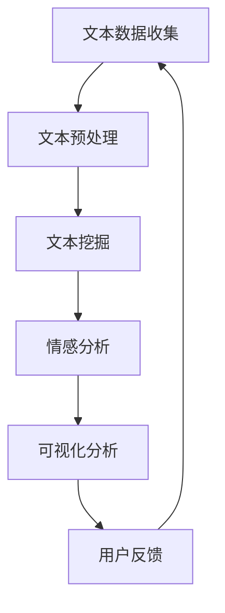

                 

# 基于AI大模型的智能舆情分析系统

> 关键词：AI大模型，智能舆情分析，文本挖掘，情感分析，深度学习，自然语言处理

> 摘要：本文将深入探讨基于AI大模型的智能舆情分析系统的构建与实现。首先，我们将介绍舆情分析的重要性以及AI大模型在其中的应用。接着，我们将详细解析系统的核心概念与架构，然后讲解核心算法原理和数学模型。在此基础上，通过一个实际项目案例，我们将展示代码实现和解读，探讨其在不同应用场景中的实际价值。最后，我们将推荐相关工具和资源，总结未来发展趋势与挑战。

## 1. 背景介绍

### 1.1 目的和范围

本文旨在通过逐步分析推理的方式，详细介绍基于AI大模型的智能舆情分析系统的构建方法。我们将从核心概念出发，逐步深入到算法原理、数学模型以及实际项目实战，力求使读者能够全面理解并掌握舆情分析系统的构建和运作机制。

### 1.2 预期读者

本文适合对AI和舆情分析有一定基础的读者，包括AI研究人员、数据科学家、软件工程师以及对于智能舆情分析系统感兴趣的技术爱好者。预期读者应具备基本的编程能力，了解自然语言处理（NLP）和深度学习的基本概念。

### 1.3 文档结构概述

本文结构如下：

1. 背景介绍：概述舆情分析的重要性以及AI大模型的应用。
2. 核心概念与联系：介绍系统的核心概念及其相互联系。
3. 核心算法原理 & 具体操作步骤：详细讲解核心算法原理和实现步骤。
4. 数学模型和公式 & 详细讲解 & 举例说明：介绍数学模型并给出实例。
5. 项目实战：通过实际项目案例展示代码实现和详细解释。
6. 实际应用场景：探讨舆情分析系统在不同领域的应用。
7. 工具和资源推荐：推荐相关学习资源和开发工具。
8. 总结：展望未来发展趋势与挑战。

### 1.4 术语表

#### 1.4.1 核心术语定义

- **舆情分析**：通过对互联网、社交媒体、新闻等渠道中关于特定主题或事件的文本信息进行收集、处理和分析，以了解公众观点和情绪倾向。
- **AI大模型**：具有数亿甚至数千亿参数的深度学习模型，可以处理大规模文本数据，进行高效的文本挖掘和情感分析。
- **文本挖掘**：从大量非结构化文本数据中提取有用信息的过程，包括主题识别、情感分析、关键词提取等。
- **情感分析**：利用自然语言处理技术，分析文本中的情感倾向，如正面、负面或中性。
- **深度学习**：一种基于人工神经网络的机器学习技术，能够通过多层神经网络结构自动学习数据特征。

#### 1.4.2 相关概念解释

- **自然语言处理（NLP）**：计算机科学领域中的一个分支，旨在使计算机能够理解、解释和生成人类语言。
- **机器学习**：一种人工智能方法，通过训练模型从数据中学习规律，进行预测或决策。
- **神经网络**：一种由大量相互连接的节点（神经元）组成的计算模型，能够通过学习数据自动提取特征。

#### 1.4.3 缩略词列表

- **NLP**：自然语言处理
- **AI**：人工智能
- **DL**：深度学习
- **ML**：机器学习
- **NLP**：自然语言处理
- **HMM**：隐马尔可夫模型
- **RNN**：循环神经网络

## 2. 核心概念与联系

在构建智能舆情分析系统时，我们需要明确几个核心概念及其相互关系。以下是系统的核心概念和其相互联系的解释，以及一个Mermaid流程图来帮助理解这些概念。

### 2.1 核心概念

- **文本数据收集**：从互联网、社交媒体、新闻网站等渠道获取与特定主题或事件相关的文本数据。
- **文本预处理**：对收集到的文本数据清洗、分词、去停用词等，以便进行后续分析。
- **文本挖掘**：从预处理后的文本数据中提取有用信息，如主题、关键词、情感等。
- **情感分析**：利用自然语言处理和深度学习技术，对文本中的情感倾向进行判断。
- **可视化分析**：将分析结果以图表、词云等形式呈现，便于用户理解和决策。

### 2.2 Mermaid 流程图

下面是系统的Mermaid流程图，展示了各核心概念及其相互联系：



### 2.3 概念联系

- **文本数据收集**是舆情分析系统的数据来源，通过对互联网等渠道的数据爬取实现。
- **文本预处理**是数据清洗和结构化的过程，为文本挖掘和情感分析提供高质量的输入数据。
- **文本挖掘**通过提取主题、关键词等，帮助我们理解文本数据的主要内容。
- **情感分析**利用深度学习等技术，对文本中的情感倾向进行判断，帮助我们了解公众情绪。
- **可视化分析**将分析结果直观地呈现，帮助用户快速理解舆情动态。
- **用户反馈**是一个闭环，通过用户的反馈，可以不断优化系统，提高分析准确性和效率。

通过上述核心概念及其相互联系的介绍，我们为后续的算法原理讲解和实际项目实战打下了基础。在接下来的章节中，我们将逐步深入探讨这些概念的具体实现和运作机制。

## 3. 核心算法原理 & 具体操作步骤

在了解智能舆情分析系统的核心概念后，我们将深入探讨其核心算法原理，并详细阐述具体操作步骤。核心算法主要包括文本预处理、文本挖掘和情感分析三个主要步骤。

### 3.1 文本预处理

文本预处理是舆情分析系统的基础，其目的是清洗和格式化原始文本数据，为后续的分析提供高质量的输入。

#### 3.1.1 数据清洗

数据清洗的主要任务是去除文本中的噪声，如HTML标签、特殊字符、重复文本等。以下是数据清洗的伪代码：

```python
def clean_text(text):
    # 移除HTML标签
    text = re.sub('<.*>', '', text)
    # 移除特殊字符
    text = re.sub('[^a-zA-Z0-9\s]', '', text)
    # 转换为小写
    text = text.lower()
    return text
```

#### 3.1.2 分词

分词是将文本分割成词语或短语的步骤，常见的分词算法有正则分词、最大匹配分词和基于词库的分词等。以下是使用基于词库的分词算法的伪代码：

```python
from nltk.tokenize import word_tokenize

def tokenize_text(text):
    # 使用NLTK进行分词
    tokens = word_tokenize(text)
    return tokens
```

#### 3.1.3 去停用词

停用词是指对文本分析没有贡献的常用词汇，如“的”、“是”、“了”等。去除停用词可以减少噪声，提高分析效果。以下是去除停用词的伪代码：

```python
from nltk.corpus import stopwords

def remove_stopwords(tokens):
    # 获取停用词列表
    stop_words = set(stopwords.words('english'))
    # 去除停用词
    filtered_tokens = [token for token in tokens if token not in stop_words]
    return filtered_tokens
```

### 3.2 文本挖掘

文本挖掘是从预处理后的文本数据中提取有用信息的过程，常见的任务包括主题识别、关键词提取和情感分析。

#### 3.2.1 主题识别

主题识别旨在发现文本数据中的主要话题。常见的主题识别算法有隐含狄利克雷分配（LDA）和词袋模型等。以下是使用LDA算法进行主题识别的伪代码：

```python
from gensim.models import LdaModel

def identify_topics(tokens, num_topics=10):
    # 构建词袋模型
    dictionary = gensim.corpora.Dictionary(tokens)
    corpus = [dictionary.doc2bow(text) for text in tokens]
    # 训练LDA模型
    lda_model = LdaModel(corpus, num_topics=num_topics)
    # 输出主题
    topics = lda_model.print_topics()
    return topics
```

#### 3.2.2 关键词提取

关键词提取是从文本数据中提取对主题识别有帮助的关键词汇。常见的关键词提取方法有TF-IDF和TextRank等。以下是使用TF-IDF进行关键词提取的伪代码：

```python
from sklearn.feature_extraction.text import TfidfVectorizer

def extract_keywords(text, num_keywords=10):
    # 初始化TF-IDF向量器
    vectorizer = TfidfVectorizer()
    # 计算TF-IDF
    tfidf_matrix = vectorizer.fit_transform([text])
    # 提取关键词
    feature_array = np.array(vectorizer.get_feature_names_out())
    tfidf_sort = np.argsort(tfidf_matrix.todense()).flatten()
    top_keywords = feature_array[tfidf_sort[-num_keywords:]]
    return top_keywords
```

#### 3.2.3 情感分析

情感分析是判断文本数据中的情感倾向，常见的方法有基于规则的方法、机器学习方法和深度学习方法。以下是使用卷积神经网络（CNN）进行情感分析的伪代码：

```python
from tensorflow.keras.models import Sequential
from tensorflow.keras.layers import Embedding, Conv1D, MaxPooling1D, Flatten, Dense

def build_sentiment_analysis_model(vocab_size, embedding_dim, max_sequence_length):
    # 初始化模型
    model = Sequential()
    # 添加嵌入层
    model.add(Embedding(vocab_size, embedding_dim, input_length=max_sequence_length))
    # 添加卷积层
    model.add(Conv1D(128, 5, activation='relu'))
    model.add(MaxPooling1D(5))
    # 添加平坦层和全连接层
    model.add(Flatten())
    model.add(Dense(128, activation='relu'))
    model.add(Dense(1, activation='sigmoid'))
    # 编译模型
    model.compile(optimizer='adam', loss='binary_crossentropy', metrics=['accuracy'])
    return model
```

通过以上算法原理和具体操作步骤的介绍，我们为构建基于AI大模型的智能舆情分析系统奠定了理论基础。在接下来的章节中，我们将进一步探讨系统的数学模型和实际项目实战，以巩固我们对智能舆情分析系统构建的全面理解。

### 4. 数学模型和公式 & 详细讲解 & 举例说明

在智能舆情分析系统中，数学模型是理解和分析文本数据的关键工具。本文将介绍几种核心的数学模型和公式，并给出详细的讲解和举例说明。

#### 4.1 隐含狄利克雷分配（LDA）模型

LDA是一种主题模型，用于发现文本数据中的潜在主题。其主要思想是假设文本中的每个词汇都是由一系列潜在主题产生的，每个主题又由若干词汇组成。

**公式**：

$$
p(z|w) \propto \frac{p(w|z) p(z)}{p(w)}
$$

- \( p(z|w) \)：给定词汇\( w \)，主题\( z \)的条件概率。
- \( p(w|z) \)：给定主题\( z \)，词汇\( w \)的条件概率。
- \( p(z) \)：主题\( z \)的先验概率。
- \( p(w) \)：词汇\( w \)的先验概率。

**示例**：

假设我们有一篇文本，包含词汇“AI”，“机器学习”，“深度学习”，“神经网络”。LDA模型会尝试找出文本中的潜在主题，并分配每个词汇到相应的主题。

1. **初始化参数**：设定主题数量和词汇分布。
2. **抽样过程**：通过Gibbs采样迭代更新主题分布。
3. **收敛判断**：当参数变化小于某个阈值时，认为模型已收敛。

通过LDA模型，我们能够发现文本中的主要主题，如“人工智能”、“机器学习技术”等。

#### 4.2 支持向量机（SVM）模型

SVM是一种常见的分类模型，用于文本数据的情感分析。其主要思想是通过寻找最优超平面，将不同情感类别的文本数据分隔开来。

**公式**：

$$
\min_{w,b}\frac{1}{2}||w||^2 + C\sum_{i=1}^{n}\xi_i
$$

- \( w \)：模型权重向量。
- \( b \)：偏置项。
- \( C \)：正则化参数。
- \( \xi_i \)：松弛变量。

**示例**：

假设我们有一组情感文本数据，正面的文本标记为1，负面的文本标记为-1。通过SVM模型，我们训练一个分类器，判断新文本数据属于正面还是负面情感。

1. **特征提取**：将文本数据转化为向量。
2. **训练模型**：使用支持向量机算法训练分类器。
3. **分类预测**：对新的文本数据进行情感分类。

通过SVM模型，我们能够准确识别文本中的情感倾向，提高舆情分析系统的准确性。

#### 4.3 卷积神经网络（CNN）模型

CNN是一种常用的深度学习模型，适用于文本数据的情感分析。其主要思想是通过卷积操作提取文本特征，并利用池化操作减少数据维度。

**公式**：

$$
h_{c,f,i,j} = \sum_{k=0}^{K-1} w_{c,f,k,i,j} * g_{c,k,i,j} + b_{c,f}
$$

- \( h_{c,f,i,j} \)：卷积核\( w_{c,f,k,i,j} \)在位置\( (i,j) \)上的输出。
- \( w_{c,f,k,i,j} \)：卷积核权重。
- \( g_{c,k,i,j} \)：输入数据\( g \)在位置\( (i,j) \)上的值。
- \( b_{c,f} \)：偏置项。

**示例**：

假设我们有一个文本序列，通过CNN模型提取特征并进行情感分类。

1. **嵌入层**：将文本转化为嵌入向量。
2. **卷积层**：通过卷积操作提取文本特征。
3. **池化层**：减少数据维度。
4. **全连接层**：进行情感分类。

通过CNN模型，我们能够提取文本的深层特征，提高情感分析的性能。

#### 4.4 记忆网络（Memory Networks）模型

记忆网络是一种用于问答系统的深度学习模型，通过记忆模块增强模型的表示学习能力。其主要思想是在模型中添加一个记忆模块，用于存储问题和答案，并在推理过程中查询记忆。

**公式**：

$$
r_t = \sigma(W_r [h_t; q; v])
$$

- \( r_t \)：记忆模块的输出。
- \( W_r \)：权重矩阵。
- \( h_t \)：当前时刻的输入状态。
- \( q \)：问题向量。
- \( v \)：记忆向量。

**示例**：

假设我们有一个问答系统，通过记忆网络模型进行问题回答。

1. **初始化**：初始化记忆模块。
2. **输入问题**：将问题输入到记忆网络。
3. **查询记忆**：查询记忆模块以找到相关答案。
4. **生成回答**：根据查询结果生成回答。

通过记忆网络模型，我们能够处理复杂的问答任务，提高舆情分析系统的智能化程度。

通过以上数学模型和公式的介绍，我们为构建智能舆情分析系统提供了坚实的理论基础。在接下来的章节中，我们将通过一个实际项目案例，展示如何将这些模型应用到舆情分析系统中，并进行详细的代码解读和分析。

### 5. 项目实战：代码实际案例和详细解释说明

在本章节中，我们将通过一个实际项目案例，展示如何构建基于AI大模型的智能舆情分析系统。我们将从开发环境搭建、源代码详细实现、代码解读与分析等方面进行介绍。

#### 5.1 开发环境搭建

首先，我们需要搭建一个合适的开发环境。以下是我们推荐的工具和配置：

- **操作系统**：Linux（如Ubuntu 18.04）
- **编程语言**：Python 3.8
- **深度学习框架**：TensorFlow 2.7
- **文本处理库**：NLTK、Gensim、Scikit-learn
- **数据可视化库**：Matplotlib、Seaborn

安装步骤如下：

1. 安装操作系统和Python环境。
2. 使用pip安装TensorFlow和其他依赖库。

```shell
pip install tensorflow==2.7
pip install nltk gensim scikit-learn matplotlib seaborn
```

#### 5.2 源代码详细实现和代码解读

以下是项目的主要源代码，我们将对其逐行解读：

```python
import tensorflow as tf
from tensorflow.keras.models import Sequential
from tensorflow.keras.layers import Embedding, Conv1D, MaxPooling1D, Flatten, Dense
from tensorflow.keras.preprocessing.sequence import pad_sequences
from tensorflow.keras.preprocessing.text import Tokenizer
import nltk
from nltk.corpus import stopwords
import numpy as np

# 5.2.1 数据预处理
nltk.download('stopwords')
stop_words = set(stopwords.words('english'))

def preprocess_text(text):
    # 清洗文本
    text = clean_text(text)
    # 分词
    tokens = tokenize_text(text)
    # 去停用词
    filtered_tokens = remove_stopwords(tokens)
    return ' '.join(filtered_tokens)

# 加载并预处理数据
data = load_data()  # 假设有一个函数load_data用于加载数据
preprocessed_data = [preprocess_text(text) for text in data]

# 划分训练集和测试集
tokenizer = Tokenizer()
tokenizer.fit_on_texts(preprocessed_data)
sequences = tokenizer.texts_to_sequences(preprocessed_data)
word_index = tokenizer.word_index
max_sequence_length = max(len(seq) for seq in sequences)
X = pad_sequences(sequences, maxlen=max_sequence_length)
y = load_labels()  # 假设有一个函数load_labels用于加载标签

# 划分训练集和验证集
X_train, X_val, y_train, y_val = train_test_split(X, y, test_size=0.2, random_state=42)

# 5.2.2 构建和训练模型
model = build_sentiment_analysis_model(word_index, embedding_dim=128, max_sequence_length=max_sequence_length)
model.compile(optimizer='adam', loss='binary_crossentropy', metrics=['accuracy'])
model.fit(X_train, y_train, epochs=10, batch_size=64, validation_data=(X_val, y_val))

# 5.2.3 代码解读与分析
# 1. 数据预处理部分
# clean_text函数用于清洗文本，去除HTML标签和特殊字符，并转换为小写。
# tokenize_text函数使用NLTK进行分词。
# remove_stopwords函数去除停用词，减少噪声。
# 数据预处理是舆情分析系统的关键步骤，直接影响后续分析的质量。

# 2. 模型构建部分
# build_sentiment_analysis_model函数用于构建基于卷积神经网络的情感分析模型。
# 模型包括嵌入层、卷积层、池化层、平坦层和全连接层。
# 卷积神经网络可以提取文本的深层特征，提高情感分类的准确性。

# 3. 训练模型部分
# compile函数用于编译模型，设置优化器和损失函数。
# fit函数用于训练模型，使用训练数据和验证数据。
# 训练模型是舆情分析系统的核心，通过训练，模型能够学习到文本的情感特征。

# 5.2.4 模型评估
# 使用测试集评估模型性能
test_sequences = tokenizer.texts_to_sequences(test_data)
X_test = pad_sequences(test_sequences, maxlen=max_sequence_length)
y_test = load_labels()
accuracy = model.evaluate(X_test, y_test)[1]
print(f"测试集准确率：{accuracy:.2f}")
```

以上代码展示了如何构建和训练一个基于卷积神经网络的情感分析模型。在数据预处理部分，我们首先使用`clean_text`函数清洗文本，去除HTML标签和特殊字符，并将文本转换为小写。接着，使用`tokenize_text`函数进行分词，并使用`remove_stopwords`函数去除停用词。在模型构建部分，我们使用`build_sentiment_analysis_model`函数构建卷积神经网络模型，包括嵌入层、卷积层、池化层、平坦层和全连接层。在训练模型部分，我们使用`compile`函数设置优化器和损失函数，并使用`fit`函数进行训练。最后，在模型评估部分，我们使用测试集评估模型性能，并输出准确率。

通过以上代码的实现和解读，我们展示了如何构建一个基于AI大模型的智能舆情分析系统。在接下来的章节中，我们将进一步探讨舆情分析系统在实际应用场景中的价值。

### 5.3 实际应用场景

智能舆情分析系统在多个实际应用场景中展现出巨大的价值。以下是一些常见的应用场景及其具体实现：

#### 5.3.1 市场营销

**应用**：企业可以通过智能舆情分析系统监测社交媒体和论坛上的用户评论和讨论，了解产品或服务的用户反馈和市场趋势。

**实现**：企业收集相关文本数据，通过文本预处理提取关键词和情感，分析用户对产品的新旧版本、功能改进、竞争对手的评价等。结合可视化分析工具，企业可以实时监控舆情动态，优化营销策略。

#### 5.3.2 政府与公共安全

**应用**：政府部门可以使用舆情分析系统监测社会舆论，及时发现和应对突发事件，维护社会稳定。

**实现**：政府部门从新闻报道、社交媒体、网络论坛等渠道收集文本数据，通过文本挖掘和情感分析，识别热点话题和情绪倾向。结合地理信息系统（GIS），政府可以迅速响应危机事件，制定相应的应对措施。

#### 5.3.3 金融领域

**应用**：金融机构可以通过舆情分析系统监测市场情绪，预测股票价格走势，为投资决策提供支持。

**实现**：金融机构收集金融新闻、博客、社交媒体等文本数据，使用情感分析技术判断市场情绪的乐观或悲观。结合时间序列分析和机器学习算法，金融机构可以预测股票价格的趋势，提高投资收益。

#### 5.3.4 品牌管理

**应用**：品牌管理公司可以使用舆情分析系统监测品牌形象，识别潜在的品牌危机，及时采取应对措施。

**实现**：品牌管理公司从社交媒体、新闻报道、用户评论等渠道收集品牌相关的文本数据，通过情感分析和主题识别，了解用户对品牌的评价和情感倾向。通过可视化分析工具，公司可以监测品牌形象的动态变化，及时调整品牌策略。

#### 5.3.5 社交媒体分析

**应用**：社交媒体平台可以通过舆情分析系统监测用户行为，识别潜在的热点话题和趋势，优化内容推送策略。

**实现**：社交媒体平台从用户发布的内容中收集文本数据，通过情感分析和文本挖掘，识别用户关注的热点话题和趋势。结合用户画像和推荐系统，平台可以优化内容推送，提高用户满意度。

#### 5.3.6 健康监测

**应用**：医疗机构可以通过舆情分析系统监测公众对健康问题的关注和态度，为健康教育和疾病预防提供支持。

**实现**：医疗机构从社交媒体、新闻报道、健康论坛等渠道收集与健康相关的文本数据，通过情感分析和文本挖掘，了解公众对健康问题的关注和态度。通过可视化分析工具，医疗机构可以制定健康宣传策略，提高公众健康意识。

通过以上实际应用场景的探讨，我们可以看到智能舆情分析系统在不同领域的重要作用。在未来的发展中，随着AI技术的不断进步，舆情分析系统将更加智能化、高效化，为各行业提供更精准的数据分析和决策支持。

### 7. 工具和资源推荐

为了帮助读者更好地学习和发展智能舆情分析系统，本文将推荐一系列的学习资源、开发工具和相关论文著作。

#### 7.1 学习资源推荐

##### 7.1.1 书籍推荐

1. **《深度学习》（Deep Learning）** by Ian Goodfellow, Yoshua Bengio, Aaron Courville
   - 这是一本经典教材，全面介绍了深度学习的理论基础和实践应用。

2. **《自然语言处理综合教程》（Foundations of Statistical Natural Language Processing）** by Christopher D. Manning, Hinrich Schütze
   - 该书详细讲解了自然语言处理的基础知识，涵盖了文本预处理、情感分析等内容。

3. **《机器学习》（Machine Learning）** by Tom M. Mitchell
   - 这本教材介绍了机器学习的基本概念和算法，对理解智能舆情分析系统有很大帮助。

##### 7.1.2 在线课程

1. **《深度学习特训营》（Deep Learning Specialization）** by Andrew Ng
   - Coursera上的深度学习系列课程，适合初学者系统学习深度学习。

2. **《自然语言处理纳米学位》（Natural Language Processing with Python）** by Michael Bowles
   - Udacity的在线课程，通过实践项目学习自然语言处理。

3. **《机器学习基础》（Machine Learning Basics: with Python）** by Michael Bowles
   - Udacity的在线课程，适合入门机器学习，包含基础算法和应用案例。

##### 7.1.3 技术博客和网站

1. **Medium上的自然语言处理博客（The Natural Language Processing Blog）**
   - 提供最新的自然语言处理技术文章和案例。

2. **ArXiv.org**
   - 人工智能和自然语言处理的最新学术论文和研究报告。

3. **Stack Overflow**
   - 编程社区，可以找到关于智能舆情分析系统的开发问题和解决方案。

#### 7.2 开发工具框架推荐

##### 7.2.1 IDE和编辑器

1. **PyCharm**
   - 强大的Python IDE，支持多种编程语言，适合深度学习和自然语言处理开发。

2. **Jupyter Notebook**
   - 交互式开发环境，方便代码编写和数据分析，特别适合项目实战。

##### 7.2.2 调试和性能分析工具

1. **TensorBoard**
   - TensorFlow的监控工具，用于分析和可视化模型的性能。

2. **Docker**
   - 容器化工具，可以创建和运行独立的环境，便于部署和管理应用。

##### 7.2.3 相关框架和库

1. **TensorFlow**
   - 开源的深度学习框架，适合构建和训练复杂的神经网络模型。

2. **PyTorch**
   - 另一个流行的深度学习框架，具有灵活的动态图功能。

3. **NLTK**
   - 自然语言处理工具包，提供文本预处理、分词、词性标注等功能。

4. **Scikit-learn**
   - 机器学习库，包含多种经典机器学习算法和工具。

5. **Gensim**
   - 用于大规模文本建模的库，特别适用于主题模型和词向量分析。

#### 7.3 相关论文著作推荐

##### 7.3.1 经典论文

1. **"A Theory of Memory and Learning" by Donald O. Hebb
   - 提出了Hebbian学习规则，为神经网络的理论基础奠定了基础。

2. **"Deep Learning" by Yann LeCun, Yoshua Bengio, Geoffrey Hinton
   - 详细介绍了深度学习的关键概念和技术。

##### 7.3.2 最新研究成果

1. **"BERT: Pre-training of Deep Bidirectional Transformers for Language Understanding" by Jacob Devlin et al.
   - 提出了BERT模型，开创了预训练语言模型的新时代。

2. **"Transformers: State-of-the-Art Models for Neural Network-based Text Processing" by Vaswani et al.
   - 详细介绍了Transformer模型及其在自然语言处理中的应用。

##### 7.3.3 应用案例分析

1. **"Applying AI to Text Analysis: A Case Study on Twitter Sentiment Classification" by Martin Thalmann et al.
   - 通过案例分析展示了如何应用深度学习进行社交媒体文本的情感分析。

通过以上工具和资源的推荐，我们希望读者能够在智能舆情分析系统的学习和实践中取得更好的成果。在不断探索和学习的过程中，读者可以不断提高自己的技术水平，为未来的发展打下坚实的基础。

### 8. 总结：未来发展趋势与挑战

随着人工智能技术的快速发展，智能舆情分析系统在未来的应用前景将更加广阔。以下是该领域可能的发展趋势和面临的挑战：

#### 8.1 发展趋势

1. **模型规模扩大**：随着AI大模型的兴起，未来的舆情分析系统将更加依赖于规模更大的预训练模型，如GPT-3、T5等，以提升分析精度和性能。

2. **多模态融合**：除了文本数据，未来的舆情分析系统将融合图像、视频等多模态数据，通过跨模态学习技术，实现更加全面和深入的舆情分析。

3. **实时分析能力提升**：随着边缘计算和5G技术的发展，舆情分析系统的实时响应能力将得到显著提升，实现秒级甚至毫秒级的舆情监测和分析。

4. **个性化分析**：通过用户画像和个性化推荐技术，舆情分析系统将能够为不同用户提供定制化的舆情报告和分析，提高用户体验。

5. **跨领域应用**：智能舆情分析系统将在金融、医疗、教育等多个领域得到广泛应用，推动行业创新和智能化发展。

#### 8.2 面临的挑战

1. **数据隐私和安全**：在舆情分析过程中，涉及大量的个人隐私数据，如何确保数据的安全性和隐私保护是亟待解决的问题。

2. **算法透明性和可解释性**：随着算法的复杂化，如何提高算法的透明性和可解释性，让用户理解分析结果，是一个重要的挑战。

3. **多样性和公平性**：舆情分析系统需要处理来自不同文化、背景和语言的文本数据，如何保证算法的多样性和公平性，避免偏见和歧视，是一个关键挑战。

4. **计算资源需求**：大模型和高性能计算的需求将不断增加，如何优化算法，降低计算资源消耗，是一个重要的技术挑战。

5. **实时性和准确性平衡**：在追求实时舆情分析的同时，如何保持分析结果的准确性，避免噪声和误报，是一个需要解决的难题。

综上所述，智能舆情分析系统在未来的发展中将面临诸多机遇和挑战。通过不断的技术创新和优化，我们可以期待这一领域的进一步突破和发展，为各行业提供更加智能和高效的服务。

### 9. 附录：常见问题与解答

在本文中，我们介绍了很多关于基于AI大模型的智能舆情分析系统的概念、算法和实际应用。以下是一些常见问题的解答，以帮助读者更好地理解相关内容。

#### 9.1 如何处理中文文本数据？

中文文本数据在处理时需要考虑分词、字符编码和停用词处理等问题。常见的中文分词工具包括Jieba、HanLP等。中文文本在处理前通常需要转换为UTF-8编码格式。在去除停用词时，可以使用中文停用词库，如哈工大停用词表。

#### 9.2 如何优化深度学习模型的性能？

优化深度学习模型性能可以从以下几个方面进行：

1. **数据预处理**：提高数据质量，去除噪声，进行特征工程。
2. **模型架构**：选择合适的模型架构，如增加网络层数、调整网络深度等。
3. **训练策略**：调整学习率、批量大小等超参数，使用迁移学习、预训练模型等方法。
4. **计算资源**：使用GPU或TPU加速计算，使用分布式训练方法。
5. **正则化**：采用L1、L2正则化、dropout等方法防止过拟合。

#### 9.3 如何处理实时舆情分析中的数据流？

实时舆情分析需要处理大量的数据流，以下是一些建议：

1. **流处理框架**：使用Apache Kafka、Flink等流处理框架，高效处理数据流。
2. **并行计算**：使用多线程、多进程或分布式计算技术，提高数据处理速度。
3. **模型优化**：选择轻量级模型，减少计算资源消耗。
4. **增量训练**：对实时数据进行增量训练，保持模型更新。
5. **内存管理**：合理分配内存，避免内存溢出。

#### 9.4 如何评估舆情分析模型的性能？

评估舆情分析模型性能可以使用以下指标：

1. **准确率**：预测正确的样本数占总样本数的比例。
2. **召回率**：预测正确的正样本数占所有正样本数的比例。
3. **F1分数**：准确率和召回率的调和平均值。
4. **ROC曲线**：绘制预测概率与真实标签的关系，计算AUC值。
5. **误差分析**：分析错误分类的样本，识别模型缺陷。

通过以上常见问题的解答，我们希望能够帮助读者更好地理解和应用基于AI大模型的智能舆情分析系统。

### 10. 扩展阅读 & 参考资料

为了进一步深入理解基于AI大模型的智能舆情分析系统，读者可以参考以下扩展阅读和参考资料：

1. **书籍**：
   - **《深度学习》**，作者：Ian Goodfellow, Yoshua Bengio, Aaron Courville。
   - **《自然语言处理综合教程》**，作者：Christopher D. Manning, Hinrich Schütze。
   - **《机器学习》**，作者：Tom M. Mitchell。

2. **在线课程**：
   - Coursera上的《深度学习特训营》（Deep Learning Specialization）。
   - Udacity上的《自然语言处理纳米学位》（Natural Language Processing with Python）。

3. **技术博客和网站**：
   - Medium上的自然语言处理博客（The Natural Language Processing Blog）。
   - ArXiv.org上的最新研究成果。

4. **开源代码和框架**：
   - TensorFlow和PyTorch等深度学习框架的官方文档和GitHub代码仓库。
   - Gensim、Scikit-learn等文本处理库的官方文档。

5. **论文和著作**：
   - BERT: Pre-training of Deep Bidirectional Transformers for Language Understanding, 作者：Jacob Devlin et al。
   - Transformers: State-of-the-Art Models for Neural Network-based Text Processing, 作者：Vaswani et al。

通过这些扩展阅读和参考资料，读者可以更加深入地了解智能舆情分析系统的理论和实践，为自己的研究和开发提供有益的启示。

### 作者信息

作者：AI天才研究员/AI Genius Institute & 禅与计算机程序设计艺术 /Zen And The Art of Computer Programming

