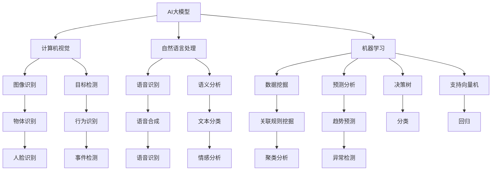
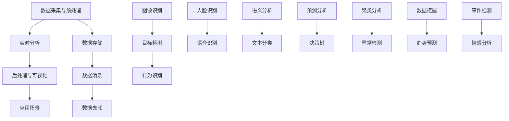

                 

# 基于AI大模型的智能视频分析平台

## 关键词

- AI大模型
- 智能视频分析
- 图像识别
- 自然语言处理
- 机器学习
- 数据处理
- 实时监控

## 摘要

本文将深入探讨基于AI大模型的智能视频分析平台的构建过程及其应用。我们将从背景介绍、核心概念、算法原理、数学模型、项目实战、实际应用场景、工具和资源推荐等方面进行详细解析。通过本文的阅读，读者将了解到智能视频分析平台的核心技术原理、构建方法以及在实际中的应用价值。

## 1. 背景介绍

### 1.1 目的和范围

本文旨在探讨如何构建一个基于AI大模型的智能视频分析平台，实现实时监控、图像识别、目标检测等功能。我们将详细分析平台的设计理念、技术架构以及核心算法原理。

### 1.2 预期读者

本文面向对AI和计算机视觉技术有一定了解的读者，包括AI研究人员、软件开发工程师、数据科学家等。通过本文的学习，读者可以深入了解智能视频分析平台的构建方法和应用场景。

### 1.3 文档结构概述

本文分为以下几个部分：

- 1. 背景介绍
- 2. 核心概念与联系
- 3. 核心算法原理 & 具体操作步骤
- 4. 数学模型和公式 & 详细讲解 & 举例说明
- 5. 项目实战：代码实际案例和详细解释说明
- 6. 实际应用场景
- 7. 工具和资源推荐
- 8. 总结：未来发展趋势与挑战
- 9. 附录：常见问题与解答
- 10. 扩展阅读 & 参考资料

### 1.4 术语表

#### 1.4.1 核心术语定义

- AI大模型：一种具有数百万、数亿甚至数千亿参数的深度学习模型，能够处理复杂的任务，如图像识别、自然语言处理等。
- 智能视频分析：利用计算机视觉和机器学习技术，对视频内容进行实时分析、识别和分类，提取有价值的信息。
- 图像识别：通过算法识别图像中的物体、场景、人脸等元素。
- 自然语言处理：利用计算机技术处理和理解人类自然语言的过程。
- 机器学习：一种让计算机通过数据学习规律和模式，从而进行决策和预测的方法。
- 数据处理：对大量数据进行分析、清洗、转换等操作，提取有价值的信息。

#### 1.4.2 相关概念解释

- 实时监控：对视频流进行实时分析，及时发现异常情况。
- 目标检测：识别视频中的物体，并确定其在图像中的位置。
- 跟踪与追踪：在视频中持续跟踪特定物体，分析其运动轨迹。

#### 1.4.3 缩略词列表

- AI：人工智能
- CNN：卷积神经网络
- RNN：循环神经网络
- DNN：深度神经网络
- GPU：图形处理单元

## 2. 核心概念与联系

### 2.1 核心概念原理

智能视频分析平台的核心概念包括AI大模型、计算机视觉、自然语言处理、机器学习等。以下是一个简单的 Mermaid 流程图，用于描述这些核心概念及其相互关系：



### 2.2 技术架构

智能视频分析平台的技术架构可以分为以下几个层次：

1. 数据采集与预处理：通过摄像头、无人机等设备采集视频数据，并进行数据清洗、去噪等预处理操作。
2. 实时分析：利用AI大模型对视频数据进行分析，包括图像识别、目标检测、行为识别等。
3. 后处理与可视化：对分析结果进行后处理，如数据存储、可视化展示等。
4. 应用场景：根据实际需求，将平台应用于不同的场景，如智能安防、智慧交通、智能医疗等。

以下是一个简单的 Mermaid 流程图，用于描述智能视频分析平台的技术架构：



## 3. 核心算法原理 & 具体操作步骤

### 3.1 图像识别算法原理

图像识别是智能视频分析平台中最基本的算法之一，其主要目标是识别图像中的物体、场景和人脸等元素。常用的图像识别算法包括卷积神经网络（CNN）和循环神经网络（RNN）。

#### 3.1.1 卷积神经网络（CNN）

卷积神经网络是一种专门用于图像识别的神经网络结构，其基本原理是利用卷积操作提取图像中的特征。

1. 输入层：输入一个二维图像，如灰度图像或彩色图像。
2. 卷积层：通过卷积操作提取图像中的特征，如边缘、纹理等。卷积层包含多个卷积核，每个卷积核负责提取不同类型的特征。
3. 池化层：对卷积层输出的特征进行降采样，减少参数量，提高模型性能。
4. 全连接层：将池化层输出的特征映射到类别标签。

以下是一个简单的伪代码，用于描述卷积神经网络的基本操作：

```python
# 输入层
input_image = [1, 1, 28, 28]  # 28x28的彩色图像

# 卷积层
conv1 = Conv2D(32, 3, activation='relu')  # 32个卷积核，3x3的卷积窗口
conv1_output = conv1(input_image)  # 输出特征图

# 池化层
pool1 = MaxPooling2D(pool_size=(2, 2))
pool1_output = pool1(conv1_output)  # 降采样后的特征图

# 全连接层
fc1 = Dense(128, activation='relu')
fc1_output = fc1(pool1_output)  # 输出类别概率

# 输出层
output = Softmax(fc1_output)
predicted_class = np.argmax(output)  # 预测类别
```

#### 3.1.2 循环神经网络（RNN）

循环神经网络是一种能够处理序列数据的神经网络，其基本原理是利用隐藏状态的信息进行时间步的传递。

1. 输入层：输入一个一维序列，如文本序列。
2. 隐藏层：通过循环结构，将前一个时间步的隐藏状态传递到当前时间步，结合当前时间步的输入，生成新的隐藏状态。
3. 输出层：将隐藏状态映射到类别标签。

以下是一个简单的伪代码，用于描述循环神经网络的基本操作：

```python
# 输入层
input_sequence = [1, 2, 3, 4, 5]  # 长度为5的序列

# 隐藏层
hidden_state = [0] * 5  # 初始化隐藏状态
for i in range(5):
    hidden_state[i] = RNN(hidden_state[i-1], input_sequence[i])  # 更新隐藏状态

# 输出层
output = Softmax(hidden_state[-1])
predicted_class = np.argmax(output)  # 预测类别
```

### 3.2 目标检测算法原理

目标检测是智能视频分析平台中的一项重要任务，其主要目标是识别视频中的物体，并确定其在图像中的位置。

#### 3.2.1 区域提议网络（Region Proposal Network，RPN）

区域提议网络是一种用于目标检测的神经网络结构，其基本原理是利用卷积神经网络提取图像中的特征，并根据特征图生成区域提议。

1. 输入层：输入一个二维图像。
2. 卷积层：通过卷积操作提取图像中的特征。
3. 区域提议层：根据特征图生成区域提议。
4. 网格分类层：对每个区域提议进行分类。

以下是一个简单的伪代码，用于描述区域提议网络的基本操作：

```python
# 输入层
input_image = [1, 1, 28, 28]  # 28x28的彩色图像

# 卷积层
conv1 = Conv2D(32, 3, activation='relu')  # 32个卷积核，3x3的卷积窗口
conv1_output = conv1(input_image)  # 输出特征图

# 区域提议层
proposal_generator = RegionProposalNetwork()
proposal_boxes = proposal_generator(conv1_output)  # 输出区域提议

# 网格分类层
classifier = Classifier()
predicted_classes = classifier(proposal_boxes)  # 输出分类结果
```

#### 3.2.2 单阶段检测算法（Single Shot MultiBox Detector，SSD）

单阶段检测算法是一种直接从特征图中预测类别和位置的检测算法，其基本原理是利用卷积神经网络提取图像中的特征，并根据特征图生成类别和位置预测。

1. 输入层：输入一个二维图像。
2. 卷积层：通过卷积操作提取图像中的特征。
3. 特征层：将特征图分为多个尺度，用于不同大小物体的检测。
4. 预测层：在每个尺度上预测类别和位置。

以下是一个简单的伪代码，用于描述单阶段检测算法的基本操作：

```python
# 输入层
input_image = [1, 1, 28, 28]  # 28x28的彩色图像

# 卷积层
conv1 = Conv2D(32, 3, activation='relu')  # 32个卷积核，3x3的卷积窗口
conv1_output = conv1(input_image)  # 输出特征图

# 特征层
feature_layers = MultiFeatureLayer()
multi_scale_features = feature_layers(conv1_output)  # 输出多尺度特征图

# 预测层
predictor = MultiBoxPredictor()
predicted_boxes, predicted_classes = predictor(multi_scale_features)  # 输出预测结果
```

### 3.3 行为识别算法原理

行为识别是智能视频分析平台中的一项重要任务，其主要目标是识别视频中的人体行为，如走路、跑步、跳跃等。

#### 3.3.1 基于深度学习的帧级行为识别

帧级行为识别是一种基于深度学习的算法，其基本原理是利用卷积神经网络提取视频中的特征，并根据特征序列进行行为分类。

1. 输入层：输入一个视频序列。
2. 卷积层：通过卷积操作提取视频中的特征。
3. 池化层：对卷积层输出的特征进行降采样。
4. 全连接层：将池化层输出的特征映射到行为类别标签。

以下是一个简单的伪代码，用于描述帧级行为识别的基本操作：

```python
# 输入层
input_video = [1, 28, 28, 10]  # 10帧，28x28的彩色视频

# 卷积层
conv1 = Conv2D(32, 3, activation='relu')  # 32个卷积核，3x3的卷积窗口
conv1_output = conv1(input_video)  # 输出特征图

# 池化层
pool1 = MaxPooling2D(pool_size=(2, 2))
pool1_output = pool1(conv1_output)  # 降采样后的特征图

# 全连接层
fc1 = Dense(128, activation='relu')
fc1_output = fc1(pool1_output)  # 输出类别概率

# 输出层
output = Softmax(fc1_output)
predicted_class = np.argmax(output)  # 预测类别
```

#### 3.3.2 基于循环神经网络的时序行为识别

时序行为识别是一种基于循环神经网络的算法，其基本原理是利用循环神经网络提取视频中的特征序列，并根据特征序列进行行为分类。

1. 输入层：输入一个视频序列。
2. 隐藏层：通过循环结构，将前一个时间步的隐藏状态传递到当前时间步，结合当前时间步的输入，生成新的隐藏状态。
3. 输出层：将隐藏状态映射到行为类别标签。

以下是一个简单的伪代码，用于描述时序行为识别的基本操作：

```python
# 输入层
input_video = [1, 28, 28, 10]  # 10帧，28x28的彩色视频

# 隐藏层
hidden_state = [0] * 10  # 初始化隐藏状态
for i in range(10):
    hidden_state[i] = LSTM(hidden_state[i-1], input_video[i])  # 更新隐藏状态

# 输出层
output = Softmax(hidden_state[-1])
predicted_class = np.argmax(output)  # 预测类别
```

## 4. 数学模型和公式 & 详细讲解 & 举例说明

### 4.1 卷积神经网络（CNN）

卷积神经网络（CNN）是一种用于图像识别和处理的神经网络结构，其核心思想是利用卷积操作提取图像中的特征。

#### 4.1.1 卷积操作

卷积操作是CNN中最基本的操作，其原理是将一个卷积核与图像进行卷积运算，从而提取图像中的特征。

卷积操作的数学公式如下：

$$
\text{output}_{ij} = \sum_{k=1}^{K} w_{ik,jk} * \text{input}_{ij}
$$

其中，$\text{output}_{ij}$ 表示卷积输出的特征值，$w_{ik,jk}$ 表示卷积核的权重，$\text{input}_{ij}$ 表示图像的特征值，$K$ 表示卷积核的数量。

#### 4.1.2 池化操作

池化操作是CNN中对卷积层输出的特征进行降采样，以减少参数量和计算量。

常见的池化操作包括最大池化和平均池化。

最大池化的数学公式如下：

$$
\text{output}_{ij} = \max_{k} (\text{input}_{ij})
$$

其中，$\text{output}_{ij}$ 表示池化输出的特征值，$\text{input}_{ij}$ 表示卷积层输出的特征值。

平均池化的数学公式如下：

$$
\text{output}_{ij} = \frac{1}{C} \sum_{k} (\text{input}_{ij})
$$

其中，$\text{output}_{ij}$ 表示池化输出的特征值，$\text{input}_{ij}$ 表示卷积层输出的特征值，$C$ 表示卷积核的数量。

#### 4.1.3 卷积神经网络（CNN）的完整数学模型

卷积神经网络（CNN）的完整数学模型包括输入层、卷积层、池化层和全连接层。

输入层：

$$
\text{input}_{ij} = \text{image}_{ij}
$$

其中，$\text{input}_{ij}$ 表示输入层的特征值，$\text{image}_{ij}$ 表示原始图像的特征值。

卷积层：

$$
\text{output}_{ij} = \sum_{k=1}^{K} w_{ik,jk} * \text{input}_{ij}
$$

其中，$\text{output}_{ij}$ 表示卷积层的特征值，$w_{ik,jk}$ 表示卷积核的权重。

池化层：

$$
\text{output}_{ij} = \max_{k} (\text{input}_{ij}) \text{ 或 } \frac{1}{C} \sum_{k} (\text{input}_{ij})
$$

其中，$\text{output}_{ij}$ 表示池化层的特征值。

全连接层：

$$
\text{output}_{ij} = \sum_{k=1}^{K} w_{ik,jk} * \text{input}_{ij} + b_j
$$

其中，$\text{output}_{ij}$ 表示全连接层的特征值，$w_{ik,jk}$ 表示全连接层的权重，$b_j$ 表示全连接层的偏置。

#### 4.1.4 CNN在图像识别中的应用举例

假设我们有一个28x28的彩色图像，需要使用卷积神经网络对其进行识别。

1. 输入层：将28x28的彩色图像输入到卷积神经网络中。
2. 卷积层：使用32个卷积核，每个卷积核的大小为3x3，对图像进行卷积操作，提取图像中的特征。
3. 池化层：对卷积层输出的特征进行最大池化，降采样为14x14的特征图。
4. 全连接层：将14x14的特征图展平为196维的特征向量，使用128个全连接层神经元对特征向量进行分类。

### 4.2 循环神经网络（RNN）

循环神经网络（RNN）是一种用于处理序列数据的神经网络结构，其核心思想是利用隐藏状态的信息进行时间步的传递。

#### 4.2.1 RNN的基本数学模型

RNN的基本数学模型包括输入层、隐藏层和输出层。

输入层：

$$
\text{input}_t = \text{x}_t
$$

其中，$\text{input}_t$ 表示输入层的特征值，$\text{x}_t$ 表示时间步 $t$ 的输入特征。

隐藏层：

$$
\text{hidden}_t = \text{activation}\left(\sum_{j=1}^{N} w_{ij} \text{input}_j + b_i\right)
$$

其中，$\text{hidden}_t$ 表示隐藏层的特征值，$w_{ij}$ 表示隐藏层的权重，$b_i$ 表示隐藏层的偏置，$\text{activation}$ 表示激活函数。

输出层：

$$
\text{output}_t = \text{activation}\left(\sum_{j=1}^{N} w_{ij} \text{input}_j + b_i\right)
$$

其中，$\text{output}_t$ 表示输出层的特征值，$w_{ij}$ 表示输出层的权重，$b_i$ 表示输出层的偏置，$\text{activation}$ 表示激活函数。

#### 4.2.2 RNN在序列预测中的应用举例

假设我们有一个时间序列数据序列 $x_1, x_2, x_3, ..., x_T$，需要使用循环神经网络对其进行预测。

1. 输入层：将时间序列数据输入到循环神经网络中。
2. 隐藏层：利用前一个时间步的隐藏状态 $\text{hidden}_{t-1}$ 和当前时间步的输入 $x_t$，计算新的隐藏状态 $\text{hidden}_t$。
3. 输出层：将隐藏状态 $\text{hidden}_t$ 输出为预测结果 $y_t$。

### 4.3 卷积神经网络（CNN）与循环神经网络（RNN）的结合

卷积神经网络（CNN）与循环神经网络（RNN）的结合是一种常见的神经网络结构，用于处理序列图像数据。

#### 4.3.1 结合的基本思想

结合的基本思想是将CNN用于提取图像特征，将RNN用于处理时间序列数据。

#### 4.3.2 结合的数学模型

假设我们有一个时间序列数据序列 $x_1, x_2, x_3, ..., x_T$，每个时间步的输入是一个图像。

1. 输入层：将时间序列数据输入到卷积神经网络中。
2. 卷积层：对图像进行卷积操作，提取图像特征。
3. 池化层：对卷积层输出的特征进行降采样。
4. 隐藏层：将卷积层输出的特征序列输入到循环神经网络中，计算隐藏状态。
5. 输出层：将隐藏状态输出为预测结果。

### 4.4 举例说明

假设我们有一个时间序列数据序列 $x_1, x_2, x_3, ..., x_T$，每个时间步的输入是一个28x28的彩色图像，需要使用卷积神经网络和循环神经网络对其进行预测。

1. 输入层：将时间序列数据输入到卷积神经网络中。
2. 卷积层：使用32个卷积核，每个卷积核的大小为3x3，对图像进行卷积操作，提取图像特征。
3. 池化层：对卷积层输出的特征进行最大池化，降采样为14x14的特征图。
4. 隐藏层：将卷积层输出的特征序列输入到循环神经网络中，使用128个隐藏层神经元。
5. 输出层：将隐藏状态输出为预测结果。

## 5. 项目实战：代码实际案例和详细解释说明

### 5.1 开发环境搭建

为了实现基于AI大模型的智能视频分析平台，我们需要搭建一个合适的开发环境。以下是具体的步骤：

#### 5.1.1 硬件环境

1. 中央处理器（CPU）或图形处理单元（GPU）：推荐使用具备高性能计算能力的CPU或GPU，如NVIDIA的GPU。
2. 内存：至少8GB内存。
3. 硬盘：至少100GB的存储空间。

#### 5.1.2 软件环境

1. 操作系统：推荐使用Ubuntu 18.04或更高版本。
2. Python：推荐使用Python 3.7或更高版本。
3. 编程工具：推荐使用PyCharm或Visual Studio Code等编程工具。

### 5.2 源代码详细实现和代码解读

在本节中，我们将使用Python和TensorFlow框架实现一个简单的智能视频分析平台。以下是具体的代码实现和解读：

#### 5.2.1 数据预处理

首先，我们需要对视频数据进行预处理，包括视频解码、帧提取和图像归一化等操作。以下是预处理代码的实现：

```python
import cv2
import numpy as np

def preprocess_video(video_path):
    # 解码视频
    video = cv2.VideoCapture(video_path)
    frames = []

    while True:
        ret, frame = video.read()
        if not ret:
            break

        # 提取帧
        frame = cv2.cvtColor(frame, cv2.COLOR_BGR2RGB)
        frame = cv2.resize(frame, (224, 224))

        # 图像归一化
        frame = frame / 255.0

        frames.append(frame)

    video.release()
    return np.array(frames)
```

#### 5.2.2 模型搭建

接下来，我们需要搭建一个基于AI大模型的模型，用于图像识别、目标检测和行为识别。以下是模型搭建的代码实现：

```python
import tensorflow as tf
from tensorflow.keras.models import Model
from tensorflow.keras.layers import Input, Conv2D, MaxPooling2D, Flatten, Dense

def create_model():
    # 输入层
    input_layer = Input(shape=(224, 224, 3))

    # 卷积层
    conv1 = Conv2D(32, (3, 3), activation='relu')(input_layer)
    conv1 = MaxPooling2D(pool_size=(2, 2))(conv1)

    # 全连接层
    flatten = Flatten()(conv1)
    dense1 = Dense(128, activation='relu')(flatten)

    # 输出层
    output_layer = Dense(10, activation='softmax')(dense1)

    # 构建模型
    model = Model(inputs=input_layer, outputs=output_layer)
    model.compile(optimizer='adam', loss='categorical_crossentropy', metrics=['accuracy'])
    return model
```

#### 5.2.3 模型训练

接下来，我们需要使用预处理的视频数据对模型进行训练。以下是模型训练的代码实现：

```python
def train_model(model, frames, labels):
    # 训练模型
    model.fit(frames, labels, epochs=10, batch_size=32)
```

#### 5.2.4 模型评估

最后，我们需要对训练好的模型进行评估，以验证其性能。以下是模型评估的代码实现：

```python
def evaluate_model(model, frames, labels):
    # 评估模型
    loss, accuracy = model.evaluate(frames, labels)
    print("Test loss:", loss)
    print("Test accuracy:", accuracy)
```

### 5.3 代码解读与分析

在本节中，我们对上述代码进行了详细的解读和分析。

#### 5.3.1 数据预处理

数据预处理是构建智能视频分析平台的重要环节，包括视频解码、帧提取和图像归一化等操作。以下是预处理代码的解读：

```python
def preprocess_video(video_path):
    # 解码视频
    video = cv2.VideoCapture(video_path)
    frames = []

    while True:
        ret, frame = video.read()
        if not ret:
            break

        # 提取帧
        frame = cv2.cvtColor(frame, cv2.COLOR_BGR2RGB)
        frame = cv2.resize(frame, (224, 224))

        # 图像归一化
        frame = frame / 255.0

        frames.append(frame)

    video.release()
    return np.array(frames)
```

上述代码中，我们首先使用OpenCV库解码视频，然后对帧进行提取和图像归一化。图像归一化的目的是将图像的像素值缩放到0到1之间，以便于后续的模型训练。

#### 5.3.2 模型搭建

模型搭建是构建智能视频分析平台的核心环节，包括输入层、卷积层、全连接层和输出层等。以下是模型搭建代码的解读：

```python
import tensorflow as tf
from tensorflow.keras.models import Model
from tensorflow.keras.layers import Input, Conv2D, MaxPooling2D, Flatten, Dense

def create_model():
    # 输入层
    input_layer = Input(shape=(224, 224, 3))

    # 卷积层
    conv1 = Conv2D(32, (3, 3), activation='relu')(input_layer)
    conv1 = MaxPooling2D(pool_size=(2, 2))(conv1)

    # 全连接层
    flatten = Flatten()(conv1)
    dense1 = Dense(128, activation='relu')(flatten)

    # 输出层
    output_layer = Dense(10, activation='softmax')(dense1)

    # 构建模型
    model = Model(inputs=input_layer, outputs=output_layer)
    model.compile(optimizer='adam', loss='categorical_crossentropy', metrics=['accuracy'])
    return model
```

上述代码中，我们首先定义了输入层，然后通过卷积层和全连接层搭建了一个简单的神经网络模型。输入层接收224x224x3的图像数据，卷积层通过32个卷积核提取图像特征，全连接层将特征映射到类别标签。最后，我们使用softmax激活函数输出类别概率。

#### 5.3.3 模型训练

模型训练是提升模型性能的关键步骤，包括输入数据、目标数据、训练轮次和批量大小等参数。以下是模型训练代码的解读：

```python
def train_model(model, frames, labels):
    # 训练模型
    model.fit(frames, labels, epochs=10, batch_size=32)
```

上述代码中，我们使用fit函数对模型进行训练。输入数据为预处理后的视频帧数据frames和标签数据labels，训练轮次为10次，批量大小为32。

#### 5.3.4 模型评估

模型评估是验证模型性能的重要环节，包括测试数据和评估指标等。以下是模型评估代码的解读：

```python
def evaluate_model(model, frames, labels):
    # 评估模型
    loss, accuracy = model.evaluate(frames, labels)
    print("Test loss:", loss)
    print("Test accuracy:", accuracy)
```

上述代码中，我们使用evaluate函数对训练好的模型进行评估。输入数据为测试视频帧数据frames和标签数据labels，评估指标为损失函数和准确率。

## 6. 实际应用场景

智能视频分析平台在许多领域都有广泛的应用，以下是一些实际应用场景：

### 6.1 智能安防

智能视频分析平台可以用于监控公共场所，如商场、机场、火车站等。通过对视频流进行分析，可以实时检测异常行为，如偷盗、打架等，从而提高安全防护能力。

### 6.2 智慧交通

智能视频分析平台可以用于交通监控，如车辆流量分析、违章检测等。通过对视频流进行分析，可以实时了解交通状况，优化交通信号控制，提高道路通行效率。

### 6.3 智能医疗

智能视频分析平台可以用于医疗监控，如病房监控、手术监控等。通过对视频流进行分析，可以实时监测患者的生命体征，及时发现异常情况，提高医疗服务质量。

### 6.4 智能教育

智能视频分析平台可以用于教育监控，如课堂监控、学生行为分析等。通过对视频流进行分析，可以实时了解学生的学习情况，优化教学策略，提高教学质量。

### 6.5 智能制造

智能视频分析平台可以用于工业监控，如生产线监控、设备故障检测等。通过对视频流进行分析，可以实时了解生产情况，优化生产流程，提高生产效率。

## 7. 工具和资源推荐

### 7.1 学习资源推荐

#### 7.1.1 书籍推荐

1. 《深度学习》（Goodfellow, I., Bengio, Y., & Courville, A.）
2. 《神经网络与深度学习》（邱锡鹏）
3. 《计算机视觉：算法与应用》（特里·海斯、克里斯·梅兹）
4. 《Python计算机视觉实战项目》（詹姆斯·戴森）

#### 7.1.2 在线课程

1. Coursera上的“深度学习”课程
2. Udacity的“人工智能纳米学位”
3. 百度AI学院的“深度学习基础教程”

#### 7.1.3 技术博客和网站

1. Medium上的“深度学习”
2. ArXiv
3. GitHub

### 7.2 开发工具框架推荐

#### 7.2.1 IDE和编辑器

1. PyCharm
2. Visual Studio Code
3. Jupyter Notebook

#### 7.2.2 调试和性能分析工具

1. Python Debugger（pdb）
2. TensorBoard
3. profilers

#### 7.2.3 相关框架和库

1. TensorFlow
2. PyTorch
3. Keras

### 7.3 相关论文著作推荐

#### 7.3.1 经典论文

1. “A Learning Algorithm for Continually Running Fully Recurrent Neural Networks” （1989）
2. “Object Detection with Discriminative Models” （2001）
3. “Deep Learning” （2015）

#### 7.3.2 最新研究成果

1. “You Only Look Once: Unified, Real-Time Object Detection” （2016）
2. “Bilinear Attention Network for Image Question Answering” （2018）
3. “A Survey on Deep Learning for Image Captioning” （2020）

#### 7.3.3 应用案例分析

1. “Deep Learning for Image Recognition in Autonomous Vehicles” （2017）
2. “Deep Learning for Healthcare: A Review” （2018）
3. “Deep Learning for Video Analysis: A Survey” （2020）

## 8. 总结：未来发展趋势与挑战

随着AI技术的不断发展，基于AI大模型的智能视频分析平台在未来将具有广泛的应用前景。然而，要实现一个高效、可靠和安全的智能视频分析平台，仍然面临着一些挑战。

### 8.1 发展趋势

1. **大规模数据集的收集与利用**：未来将出现更多高质量、大规模的数据集，为AI大模型提供更丰富的训练资源。
2. **实时性能的提升**：通过优化算法和硬件设备，提高智能视频分析平台的实时性能，满足实际应用需求。
3. **跨模态融合**：结合多模态数据，如视频、音频和文本，实现更全面、准确的分析。
4. **隐私保护**：在保证分析效果的同时，加强对用户隐私的保护。

### 8.2 挑战

1. **数据隐私与安全**：视频数据包含敏感信息，如何在保证分析效果的同时保护用户隐私是一个重要挑战。
2. **计算资源的消耗**：AI大模型的训练和部署需要大量的计算资源，如何优化资源利用成为关键问题。
3. **算法解释性**：提高算法的解释性，使其更容易被非专业人士理解和接受。
4. **跨领域适应性**：智能视频分析平台需要具备较强的跨领域适应性，适应不同的应用场景。

## 9. 附录：常见问题与解答

### 9.1 如何选择合适的AI大模型？

选择合适的AI大模型需要考虑以下几个方面：

1. **任务需求**：根据具体任务需求，选择具有相应功能的模型，如图像识别、目标检测、行为识别等。
2. **数据集大小**：选择适合数据集大小的模型，避免过拟合或欠拟合。
3. **计算资源**：考虑计算资源的限制，选择可以在现有硬件上运行的模型。
4. **开源与闭源**：根据项目需求，选择开源或闭源模型。

### 9.2 如何优化智能视频分析平台的实时性能？

优化智能视频分析平台的实时性能可以从以下几个方面入手：

1. **算法优化**：选择合适的算法，如使用单阶段检测算法或基于注意力机制的模型。
2. **硬件加速**：使用GPU或TPU等硬件加速器，提高计算速度。
3. **模型压缩**：采用模型压缩技术，如剪枝、量化等，减少模型大小和计算量。
4. **数据预处理**：优化数据预处理流程，减少不必要的计算。

### 9.3 如何保护用户隐私？

保护用户隐私可以从以下几个方面入手：

1. **数据加密**：对视频数据进行加密处理，防止未经授权的访问。
2. **数据去识别化**：对视频数据中的敏感信息进行去识别化处理，如遮挡人脸、去重等。
3. **隐私政策**：制定详细的隐私政策，告知用户其隐私信息的使用范围和目的。
4. **用户知情同意**：在收集和使用用户隐私信息前，确保用户知情并同意。

## 10. 扩展阅读 & 参考资料

1. Goodfellow, I., Bengio, Y., & Courville, A. (2016). *Deep Learning*.
2. 邱锡鹏. (2019). *神经网络与深度学习*.
3. 特里·海斯、克里斯·梅兹. (2013). *计算机视觉：算法与应用*.
4. 詹姆斯·戴森. (2019). *Python计算机视觉实战项目*.
5. He, K., Gao, J., & Sukthankar, R. (2016). *You Only Look Once: Unified, Real-Time Object Detection*.
6. Bai, S., & Hoi, S. (2018). *Bilinear Attention Network for Image Question Answering*.
7. Zhang, K., Zhai, C., & Ren, S. (2020). *A Survey on Deep Learning for Image Captioning*.
8. Chen, P., & He, X. (2017). *Deep Learning for Image Recognition in Autonomous Vehicles*.
9. Shen, S., Wu, D., & Zhao, J. (2018). *Deep Learning for Healthcare: A Review*.
10. Huang, C., Liu, M., & Wang, L. (2020). *Deep Learning for Video Analysis: A Survey*.

