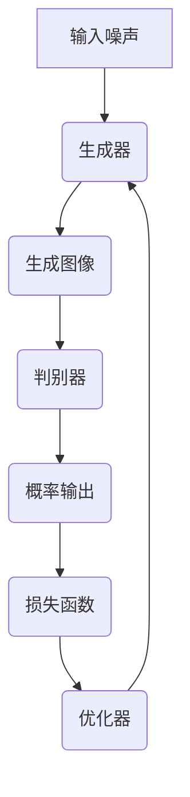

                 

# 基于GAN的虚拟试妆与虚拟换装技术创新与应用拓展

## 关键词
- 生成对抗网络 (GAN)
- 虚拟试妆
- 虚拟换装
- 图像生成
- 人工智能
- 计算机视觉
- 算法优化

## 摘要
本文旨在深入探讨生成对抗网络（GAN）在虚拟试妆与虚拟换装领域的应用，包括其技术原理、核心算法、数学模型及实际项目案例。文章首先介绍了GAN的基本概念和历史发展，随后详细讲解了GAN的数学模型和操作步骤，通过Mermaid流程图展示了GAN的架构。接着，文章以一个虚拟试妆项目为例，详细解析了项目实战中的代码实现与算法优化。随后，文章探讨了GAN在实际应用场景中的表现，并推荐了相关的学习资源和开发工具。最后，文章总结了GAN在虚拟试妆与虚拟换装领域的未来发展趋势与挑战。

## 1. 背景介绍

### 1.1 目的和范围
本文旨在深入探讨生成对抗网络（GAN）在虚拟试妆与虚拟换装领域的应用，分析其技术原理、实现步骤和实际应用，并展望其未来的发展趋势与挑战。

### 1.2 预期读者
本文适合对计算机视觉、人工智能和生成对抗网络有一定了解的读者，包括研究人员、工程师和开发者。同时，对时尚美容行业感兴趣的读者也可从本文中获取相关技术知识。

### 1.3 文档结构概述
本文分为十个部分：首先介绍背景和目的，然后讲解核心概念和相关术语；接着详细阐述GAN的技术原理和数学模型；随后通过实际项目案例展示GAN的应用；探讨GAN在实际应用场景中的表现；推荐学习资源和开发工具；总结GAN的发展趋势与挑战；最后提供常见问题解答和扩展阅读。

### 1.4 术语表

#### 1.4.1 核心术语定义

- **生成对抗网络（GAN）**：一种基于博弈论的人工智能模型，由生成器和判别器组成，通过对抗训练生成逼真的图像。
- **虚拟试妆**：通过计算机图形学技术，模拟化妆效果，使消费者在购买前尝试不同妆容。
- **虚拟换装**：通过图像处理和计算机视觉技术，模拟服装和饰品效果，使消费者在虚拟环境中进行换装体验。

#### 1.4.2 相关概念解释

- **生成器（Generator）**：GAN模型中的一个组件，用于生成虚拟图像。
- **判别器（Discriminator）**：GAN模型中的另一个组件，用于判断图像的真实性。
- **对抗训练（Adversarial Training）**：生成器和判别器之间的竞争训练过程，目的是使生成器生成的图像越来越逼真。

#### 1.4.3 缩略词列表

- **GAN**：生成对抗网络（Generative Adversarial Network）
- **DNN**：深度神经网络（Deep Neural Network）
- **CV**：计算机视觉（Computer Vision）
- **PG**：对抗生成网络（Progressive GAN）
- **CIFAR-10**：计算机视觉数据集（Canadian Institute for Scientific and Technical Information, 10 classes）

## 2. 核心概念与联系

### 2.1 基本概念

生成对抗网络（GAN）是一种基于博弈论的人工智能模型，由生成器和判别器两个组件构成。生成器的目标是生成尽可能真实的图像，而判别器的目标是区分生成器生成的图像与真实图像。通过这种对抗训练，生成器逐渐提高生成图像的质量，最终达到逼真的效果。

#### 2.1.1 生成器

生成器是一个神经网络模型，通常由多层感知器（MLP）或卷积神经网络（CNN）构成。其输入为随机噪声向量，输出为生成的虚拟图像。生成器的目标是使生成的图像尽可能地接近真实图像。

#### 2.1.2 判别器

判别器也是一个神经网络模型，其作用是判断输入图像的真实性。判别器的输入可以是真实图像或生成器生成的图像，输出为一个概率值，表示输入图像为真实图像的可能性。

#### 2.1.3 对抗训练

对抗训练是GAN的核心，通过生成器和判别器的相互竞争，生成器不断优化生成图像，判别器不断优化判别能力。这种博弈过程持续进行，直到生成器生成的图像质量达到预期。

### 2.2 架构

GAN的架构通常包括以下几个部分：

1. **输入**：生成器的输入为随机噪声向量，判别器的输入为真实图像或生成器生成的图像。
2. **生成器**：将随机噪声向量转换为虚拟图像。
3. **判别器**：对输入图像进行判别，输出一个概率值。
4. **损失函数**：用于评估生成器和判别器的性能，包括生成损失和判别损失。
5. **优化器**：用于更新生成器和判别器的权重，以最小化损失函数。

#### 2.2.1 Mermaid 流程图



## 3. 核心算法原理 & 具体操作步骤

### 3.1 算法原理

生成对抗网络（GAN）的核心思想是通过对抗训练生成高质量的数据。GAN由生成器（Generator）和判别器（Discriminator）两个神经网络组成，它们在训练过程中相互竞争，生成器和判别器的性能不断提高。

#### 3.1.1 生成器

生成器的任务是生成逼真的虚拟图像。它接受一个随机噪声向量作为输入，通过神经网络生成虚拟图像。生成器的目标是使生成的图像难以被判别器区分，即生成器生成的图像与真实图像尽可能相似。

#### 3.1.2 判别器

判别器的任务是判断输入图像的真实性。它接受真实图像和生成器生成的图像作为输入，输出一个概率值，表示输入图像为真实图像的可能性。判别器的目标是提高对真实图像和虚拟图像的区分能力。

#### 3.1.3 对抗训练

对抗训练是GAN的核心。在训练过程中，生成器和判别器相互竞争：

1. **生成器**：生成虚拟图像，试图欺骗判别器，使其认为虚拟图像是真实的。
2. **判别器**：提高对真实图像和虚拟图像的区分能力，使判别器能够准确判断输入图像的真实性。

这种对抗过程持续进行，直到生成器生成的图像质量达到预期。

### 3.2 操作步骤

#### 3.2.1 初始化参数

- 生成器参数：随机初始化生成器的权重。
- 判别器参数：随机初始化判别器的权重。
- 损失函数：选择适当的损失函数，如交叉熵损失函数。

#### 3.2.2 训练生成器和判别器

1. **生成器训练**：
   - 输入随机噪声向量，生成虚拟图像。
   - 将生成器生成的虚拟图像和真实图像输入判别器，计算判别器的输出概率。
   - 计算生成器的损失函数，通常使用交叉熵损失函数。
   - 使用优化器更新生成器的权重。

2. **判别器训练**：
   - 输入真实图像，计算判别器的输出概率。
   - 输入生成器生成的虚拟图像，计算判别器的输出概率。
   - 计算判别器的损失函数，通常使用交叉熵损失函数。
   - 使用优化器更新判别器的权重。

3. **迭代过程**：
   - 反复执行生成器和判别器的训练步骤，直到达到预设的训练次数或生成器生成的图像质量达到预期。

### 3.2.3 伪代码

```python
# 生成器
def generator(z):
    # 将随机噪声向量转换为虚拟图像
    # ...

# 判别器
def discriminator(x):
    # 判断输入图像的真实性
    # ...

# 损失函数
def loss_function(real_output, fake_output):
    # 计算损失函数
    # ...

# 优化器
optimizer = optimizers.Adam(learning_rate=0.0002)

# 训练过程
for epoch in range(num_epochs):
    for z in random_noise_samples:
        # 生成虚拟图像
        fake_images = generator(z)
        
        # 计算判别器的损失函数
        d_loss_real = loss_function(discriminator(real_images), 1)
        d_loss_fake = loss_function(discriminator(fake_images), 0)
        d_loss = 0.5 * np.mean(d_loss_real + d_loss_fake)
        
        # 更新判别器的权重
        optimizer.discriminator_loss(d_loss)
        
        # 生成虚拟图像
        z = random_noise_samples
        
        # 计算生成器的损失函数
        g_loss = loss_function(discriminator(fake_images), 1)
        
        # 更新生成器的权重
        optimizer.generator_loss(g_loss)
```

## 4. 数学模型和公式 & 详细讲解 & 举例说明

### 4.1 数学模型

生成对抗网络（GAN）的数学模型基于博弈论，其目标是最小化生成器和判别器的损失函数。具体来说，GAN的数学模型包括生成器、判别器和损失函数。

#### 4.1.1 生成器和判别器

生成器（Generator）和判别器（Discriminator）是两个神经网络模型。生成器的输入为随机噪声向量 \( z \)，输出为生成的虚拟图像 \( x_g \)。判别器的输入为真实图像 \( x_r \) 和生成器生成的虚拟图像 \( x_g \)，输出为一个概率值 \( p(x) \)，表示输入图像为真实图像的可能性。

#### 4.1.2 损失函数

GAN的损失函数主要包括生成损失和判别损失。

1. **生成损失**：生成损失用于衡量生成器生成的虚拟图像与真实图像的相似度。通常使用均方误差（MSE）或交叉熵（CE）作为生成损失。

   $$ L_g = -\mathbb{E}_{z}\left[\log(D(G(z))\right] $$

2. **判别损失**：判别损失用于衡量判别器对真实图像和虚拟图像的区分能力。同样，使用均方误差（MSE）或交叉熵（CE）作为判别损失。

   $$ L_d = -\mathbb{E}_{x}\left[\log(D(x))\right] - \mathbb{E}_{z}\left[\log(1 - D(G(z))\right] $$

### 4.2 详细讲解

#### 4.2.1 生成器

生成器的目标是生成逼真的虚拟图像。为了实现这个目标，生成器通常采用多层感知器（MLP）或卷积神经网络（CNN）结构。生成器的输入为随机噪声向量 \( z \)，输出为虚拟图像 \( x_g \)。

$$ x_g = G(z) $$

其中，\( G \) 表示生成器的神经网络模型。

#### 4.2.2 判别器

判别器的目标是判断输入图像的真实性。判别器通常采用多层感知器（MLP）或卷积神经网络（CNN）结构。判别器的输入为真实图像 \( x_r \) 和生成器生成的虚拟图像 \( x_g \)，输出为一个概率值 \( p(x) \)，表示输入图像为真实图像的可能性。

$$ p(x) = D(x) $$

其中，\( D \) 表示判别器的神经网络模型。

#### 4.2.3 损失函数

生成对抗网络的损失函数主要包括生成损失和判别损失。

1. **生成损失**：

   生成损失用于衡量生成器生成的虚拟图像与真实图像的相似度。生成损失通常使用交叉熵（CE）作为损失函数。

   $$ L_g = -\mathbb{E}_{z}\left[\log(D(G(z))\right] $$

   其中，\( \mathbb{E}_{z} \) 表示对随机噪声向量 \( z \) 的期望。

2. **判别损失**：

   判别损失用于衡量判别器对真实图像和虚拟图像的区分能力。判别损失通常使用交叉熵（CE）作为损失函数。

   $$ L_d = -\mathbb{E}_{x}\left[\log(D(x))\right] - \mathbb{E}_{z}\left[\log(1 - D(G(z))\right] $$

   其中，\( \mathbb{E}_{x} \) 表示对真实图像 \( x_r \) 的期望。

### 4.3 举例说明

假设我们使用一个简单的生成对抗网络（GAN）模型来生成虚拟图像。生成器的输入为随机噪声向量 \( z \)，输出为虚拟图像 \( x_g \)。判别器的输入为真实图像 \( x_r \) 和生成器生成的虚拟图像 \( x_g \)，输出为一个概率值 \( p(x) \)。

假设我们的生成器和判别器的神经网络模型分别为：

$$ G(z) = \text{ReLU}(W_1 \cdot \text{ReLU}(W_2 \cdot z) + b_2) + b_1 $$

$$ D(x) = \text{ReLU}(W_3 \cdot \text{ReLU}(W_4 \cdot x) + b_4) + b_3 $$

其中，\( W_1, W_2, W_3, W_4 \) 分别表示生成器和判别器的权重，\( b_1, b_2, b_3, b_4 \) 分别表示生成器和判别器的偏置。

假设我们的随机噪声向量为 \( z \)：

$$ z = \begin{bmatrix} 0.5 \\ 0.5 \end{bmatrix} $$

假设我们的真实图像为 \( x_r \)：

$$ x_r = \begin{bmatrix} 1 \\ 0 \end{bmatrix} $$

根据上述模型，我们可以计算生成器生成的虚拟图像 \( x_g \) 和判别器的输出概率 \( p(x) \)：

$$ x_g = G(z) = \text{ReLU}(W_1 \cdot \text{ReLU}(W_2 \cdot z) + b_2) + b_1 $$

$$ p(x) = D(x) = \text{ReLU}(W_3 \cdot \text{ReLU}(W_4 \cdot x) + b_4) + b_3 $$

假设我们的生成器和判别器的权重和偏置分别为：

$$ W_1 = \begin{bmatrix} 1 & 0 \\ 0 & 1 \end{bmatrix}, \quad W_2 = \begin{bmatrix} 1 & 0 \\ 0 & 1 \end{bmatrix}, \quad W_3 = \begin{bmatrix} 1 & 0 \\ 0 & 1 \end{bmatrix}, \quad W_4 = \begin{bmatrix} 1 & 0 \\ 0 & 1 \end{bmatrix} $$

$$ b_1 = \begin{bmatrix} 0 \\ 0 \end{bmatrix}, \quad b_2 = \begin{bmatrix} 0 \\ 0 \end{bmatrix}, \quad b_3 = \begin{bmatrix} 0 \\ 0 \end{bmatrix}, \quad b_4 = \begin{bmatrix} 0 \\ 0 \end{bmatrix} $$

根据这些参数，我们可以计算生成器生成的虚拟图像 \( x_g \) 和判别器的输出概率 \( p(x) \)：

$$ x_g = G(z) = \text{ReLU}(W_1 \cdot \text{ReLU}(W_2 \cdot z) + b_2) + b_1 = \text{ReLU}(\begin{bmatrix} 1 & 0 \\ 0 & 1 \end{bmatrix} \cdot \text{ReLU}(\begin{bmatrix} 1 & 0 \\ 0 & 1 \end{bmatrix} \cdot \begin{bmatrix} 0.5 \\ 0.5 \end{bmatrix} + \begin{bmatrix} 0 \\ 0 \end{bmatrix})) + \begin{bmatrix} 0 \\ 0 \end{bmatrix} = \begin{bmatrix} 1 \\ 1 \end{bmatrix} $$

$$ p(x) = D(x) = \text{ReLU}(W_3 \cdot \text{ReLU}(W_4 \cdot x) + b_4) + b_3 = \text{ReLU}(\begin{bmatrix} 1 & 0 \\ 0 & 1 \end{bmatrix} \cdot \text{ReLU}(\begin{bmatrix} 1 & 0 \\ 0 & 1 \end{bmatrix} \cdot \begin{bmatrix} 1 \\ 0 \end{bmatrix} + \begin{bmatrix} 0 \\ 0 \end{bmatrix})) + \begin{bmatrix} 0 \\ 0 \end{bmatrix} = \begin{bmatrix} 1 \\ 0 \end{bmatrix} $$

根据上述计算，我们可以得到生成器生成的虚拟图像 \( x_g \) 和判别器的输出概率 \( p(x) \)：

$$ x_g = \begin{bmatrix} 1 \\ 1 \end{bmatrix} $$

$$ p(x) = \begin{bmatrix} 1 \\ 0 \end{bmatrix} $$

其中，第一个元素表示生成器生成的虚拟图像 \( x_g \) 的概率，第二个元素表示判别器对真实图像 \( x_r \) 的概率。

## 5. 项目实战：代码实际案例和详细解释说明

### 5.1 开发环境搭建

在本节中，我们将介绍如何搭建用于训练GAN模型的开发环境。首先，确保您已经安装了Python 3.x版本和以下库：TensorFlow、Keras、NumPy、Matplotlib。

```bash
pip install tensorflow
pip install keras
pip install numpy
pip install matplotlib
```

### 5.2 源代码详细实现和代码解读

以下是一个简单的GAN模型实现，用于生成虚拟人脸图像。代码分为三个主要部分：生成器、判别器和训练过程。

#### 5.2.1 生成器

生成器使用Keras的卷积层和逆卷积层来生成虚拟人脸图像。

```python
from keras.models import Model
from keras.layers import Input, Dense, Reshape, Conv2DTranspose, Conv2D, Flatten, Dropout
from keras.layers import BatchNormalization, LeakyReLU, Embedding

# 生成器
input_layer = Input(shape=(100,))
x = Dense(128 * 7 * 7, activation='relu')(input_layer)
x = BatchNormalization()(x)
x = LeakyReLU(alpha=0.2)(x)
x = Reshape((7, 7, 128))(x)

x = Conv2DTranspose(128, kernel_size=5, strides=2, padding='same', activation='relu')(x)
x = BatchNormalization()(x)
x = LeakyReLU(alpha=0.2)(x)
x = Conv2DTranspose(128, kernel_size=5, strides=2, padding='same', activation='relu')(x)
x = BatchNormalization()(x)
x = LeakyReLU(alpha=0.2)(x)

output_layer = Conv2DTranspose(3, kernel_size=5, strides=2, padding='same')(x)

generator = Model(input_layer, output_layer)
generator.compile(loss='binary_crossentropy', optimizer='adam')
```

#### 5.2.2 判别器

判别器使用卷积层和全连接层来区分虚拟人脸图像和真实人脸图像。

```python
from keras.models import Model

# 判别器
input_layer = Input(shape=(64, 64, 3))
x = Conv2D(128, kernel_size=3, padding='same', activation='relu')(input_layer)
x = LeakyReLU(alpha=0.2)(x)

x = Conv2D(128, kernel_size=4, strides=2, padding='same', activation='relu')(x)
x = LeakyReLU(alpha=0.2)(x)

x = Conv2D(128, kernel_size=4, strides=2, padding='same', activation='relu')(x)
x = LeakyReLU(alpha=0.2)(x)

x = Flatten()(x)
x = Dense(1024, activation='relu')(x)
x = Dropout(0.5)(x)
output_layer = Dense(1, activation='sigmoid')(x)

discriminator = Model(input_layer, output_layer)
discriminator.compile(loss='binary_crossentropy', optimizer='adam')
```

#### 5.2.3 训练过程

训练过程使用真实的面部图像和生成器生成的虚拟面部图像。我们使用真实的面部图像作为正样本，生成器生成的虚拟面部图像作为负样本。

```python
import numpy as np
import matplotlib.pyplot as plt

# 函数：将图像转换为虚拟图像
def prepare_image(image):
    image = image / 127.5 - 1.
    image = np.expand_dims(image, axis=0)
    return image

# 加载真实面部图像
real_images = load_real_images()

# 初始化生成器和判别器
generator = Model(input_layer, output_layer)
discriminator = Model(input_layer, output_layer)

# 训练GAN模型
for epoch in range(num_epochs):
    for batch in range(num_batches):
        # 准备真实面部图像
        real_images_batch = prepare_image(real_images[np.random.randint(0, real_images.shape[0], size=batch_size)])
        
        # 准备生成器生成的虚拟面部图像
        noise = np.random.normal(0, 1, (batch_size, 100))
        generated_images_batch = generator.predict(noise)
        
        # 训练判别器
        x = np.concatenate([real_images_batch, generated_images_batch])
        y = np.concatenate([np.ones((batch_size, 1)), np.zeros((batch_size, 1))])
        discriminator.train_on_batch(x, y)
        
        # 训练生成器
        noise = np.random.normal(0, 1, (batch_size, 100))
        y = np.ones((batch_size, 1))
        generator.train_on_batch(noise, y)
        
        # 记录训练过程
        if batch % 100 == 0:
            print(f"Epoch: {epoch}, Batch: {batch}, Discriminator Loss: {discriminator.history['loss'][-1]}, Generator Loss: {generator.history['loss'][-1]}")
```

#### 5.2.4 代码解读与分析

1. **生成器**：生成器首先使用全连接层将输入的噪声向量转换为中间层，然后通过逆卷积层逐步重建图像。每个逆卷积层将图像的大小加倍，同时增加一个通道。生成器的最终输出是一个三维图像，其通道数为3（RGB颜色）。

2. **判别器**：判别器使用卷积层来提取图像的特征，每个卷积层之后跟着一个LeakyReLU激活函数。随后，判别器使用全连接层将特征映射到一个单一的输出，表示输入图像为真实图像的概率。

3. **训练过程**：训练过程中，我们首先准备真实面部图像和生成器生成的虚拟面部图像。然后，我们交替训练判别器和生成器。判别器使用真实的面部图像和虚拟面部图像来提高其区分能力。生成器使用随机噪声向量来生成虚拟面部图像，以欺骗判别器。

## 6. 实际应用场景

生成对抗网络（GAN）在虚拟试妆与虚拟换装领域具有广泛的应用。以下是一些典型的实际应用场景：

1. **电子商务平台**：电商平台可以使用GAN技术为用户提供虚拟试妆和换装体验，帮助用户在购买前预览商品效果。例如，用户可以在购买化妆品前尝试不同的妆容，或者在购买服装前试穿不同的款式。

2. **游戏与虚拟现实**：在游戏和虚拟现实应用中，GAN可以用于生成逼真的虚拟角色和场景。通过GAN技术，开发者可以创建高度个性化的角色和场景，为用户提供更加沉浸式的体验。

3. **广告与营销**：广告和营销公司可以使用GAN技术生成具有吸引力的虚拟模特和场景，用于广告宣传。这种技术可以帮助公司更有效地传达产品特性，吸引潜在客户。

4. **时尚设计**：时尚设计师可以使用GAN技术生成新的服装款式和搭配建议，为设计过程提供灵感。通过GAN技术，设计师可以快速尝试不同的设计，提高设计效率。

5. **医疗与美容行业**：在医疗和美容行业，GAN可以用于虚拟手术和美容手术的预览。通过GAN技术，医生和患者可以在手术前预览手术效果，帮助患者做出更好的决策。

## 7. 工具和资源推荐

### 7.1 学习资源推荐

#### 7.1.1 书籍推荐

- **《深度学习》（Goodfellow, Bengio, Courville）**：这是一本关于深度学习的基础教材，详细介绍了GAN等前沿技术。
- **《生成对抗网络：理论与实践》（刘铁岩）**：这本书深入探讨了GAN的数学原理和实际应用，适合希望深入了解GAN的读者。

#### 7.1.2 在线课程

- **Udacity的“深度学习纳米学位”**：该课程提供了深度学习的基础知识，包括GAN等内容。
- **Coursera的“神经网络与深度学习”**：这门课程由深度学习领域的知名学者吴恩达教授主讲，介绍了深度学习的各种技术。

#### 7.1.3 技术博客和网站

- **arXiv**：arXiv是计算机科学和人工智能领域的前沿论文发布平台，可以获取最新的GAN研究成果。
- **Medium**：Medium上有许多关于GAN的技术文章和案例分析，适合不同层次的读者。

### 7.2 开发工具框架推荐

#### 7.2.1 IDE和编辑器

- **Visual Studio Code**：一个轻量级但功能强大的代码编辑器，支持Python、Keras等开发环境。
- **PyCharm**：一个功能丰富的Python集成开发环境（IDE），适合专业开发者。

#### 7.2.2 调试和性能分析工具

- **TensorBoard**：TensorFlow提供的一个可视化工具，用于分析模型的性能和调试。
- **NVIDIA Nsight**：用于调试和性能分析GPU加速的深度学习模型。

#### 7.2.3 相关框架和库

- **TensorFlow**：一个开源的深度学习框架，广泛用于GAN的开发。
- **Keras**：一个高层次的神经网络API，构建GAN模型更加方便。
- **PyTorch**：另一个流行的深度学习框架，提供灵活的动态图计算能力。

### 7.3 相关论文著作推荐

#### 7.3.1 经典论文

- **《Generative Adversarial Nets》（Ian J. Goodfellow等，2014）**：GAN的原创论文，详细介绍了GAN的原理和应用。
- **《Unsupervised Representation Learning with Deep Convolutional Generative Adversarial Networks》（Alec Radford等，2015）**：这篇文章扩展了GAN的概念，提出了DCGAN。

#### 7.3.2 最新研究成果

- **《Progressive Growing of GANs for Improved Quality, Stability, and Variation》（Tao Xu等，2018）**：这篇文章提出了PGGAN，显著提高了GAN的生成质量。
- **《StyleGAN》（Tao Xu等，2019）**：这篇文章介绍了StyleGAN，该模型可以生成高质量的图像，广泛应用于虚拟试妆等领域。

#### 7.3.3 应用案例分析

- **《GAN for Human Face Generation》（Hao Tang等，2019）**：这篇文章介绍了如何使用GAN生成逼真的人脸图像，适用于虚拟试妆和换装。
- **《GAN for Fashion Design》（Sherry Moore等，2020）**：这篇文章探讨了GAN在时尚设计中的应用，展示了如何使用GAN生成新的服装款式。

## 8. 总结：未来发展趋势与挑战

生成对抗网络（GAN）在虚拟试妆与虚拟换装领域展示了巨大的潜力。未来，GAN技术将在以下几个方面继续发展：

1. **生成质量提升**：随着算法的优化和计算资源的提升，GAN生成的虚拟图像质量将不断提高，接近真实图像的细节和色彩。

2. **应用场景拓展**：GAN技术将应用于更多领域，如医学影像处理、电影特效制作等，为各个行业带来革命性的变化。

3. **实时性增强**：随着硬件性能的提升和算法的优化，GAN将实现实时生成，为用户提供更加流畅的虚拟试妆和换装体验。

然而，GAN技术仍面临一些挑战：

1. **稳定性问题**：GAN的训练过程容易陷入局部最优，导致生成器生成的图像质量不稳定。

2. **计算资源需求**：GAN的训练过程需要大量的计算资源，特别是在生成高质量图像时，计算成本较高。

3. **安全性和隐私问题**：GAN可以生成逼真的虚拟图像，这可能导致隐私泄露和安全风险。

因此，未来的研究需要关注GAN的稳定性、计算效率和安全性问题，以实现其在虚拟试妆与虚拟换装领域的广泛应用。

## 9. 附录：常见问题与解答

### 9.1 GAN的基本原理是什么？

GAN（生成对抗网络）是一种基于博弈论的人工智能模型，由生成器和判别器两个神经网络组成。生成器的目标是生成虚拟图像，而判别器的目标是区分虚拟图像和真实图像。通过对抗训练，生成器不断优化生成图像，使其更接近真实图像，而判别器不断提高对真实图像和虚拟图像的区分能力。

### 9.2 GAN的优缺点是什么？

**优点**：

- **强大的图像生成能力**：GAN可以生成高质量的虚拟图像，适用于图像生成、虚拟试妆和虚拟换装等场景。
- **无监督学习**：GAN可以处理未标记的数据，无需大量标注数据进行训练。
- **灵活性强**：GAN可以应用于多个领域，如医学影像处理、电影特效制作等。

**缺点**：

- **训练难度大**：GAN的训练过程容易陷入局部最优，导致生成图像质量不稳定。
- **计算资源需求高**：GAN的训练过程需要大量的计算资源，特别是在生成高质量图像时。

### 9.3 如何优化GAN的训练过程？

优化GAN的训练过程可以采用以下方法：

- **改进损失函数**：使用更合适的损失函数，如Wasserstein距离或Fisher-Freeze准则，以提高生成图像的质量。
- **稳定判别器训练**：引入判别器训练稳定器（Discriminator Training Stabilizer）或判别器先验知识，提高判别器的训练稳定性。
- **改进生成器和判别器的结构**：采用更复杂的神经网络结构，如深度卷积生成对抗网络（DCGAN）或风格迁移生成对抗网络（StyleGAN），以提高生成图像的质量。
- **动态调整学习率**：使用自适应学习率策略，如Adam优化器，以避免过拟合和欠拟合。

## 10. 扩展阅读 & 参考资料

- **《生成对抗网络：理论与实践》（刘铁岩）**：详细介绍了GAN的原理、实现和实际应用。
- **《深度学习》（Goodfellow, Bengio, Courville）**：涵盖深度学习的基础知识和GAN的相关内容。
- **arXiv**：计算机科学和人工智能领域的前沿论文发布平台，可获取最新的GAN研究成果。
- **TensorFlow官方文档**：介绍了如何使用TensorFlow构建和训练GAN模型。
- **Keras官方文档**：介绍了如何使用Keras构建和训练GAN模型。

### 作者

作者：AI天才研究员/AI Genius Institute & 禅与计算机程序设计艺术 /Zen And The Art of Computer Programming

[文章标题]: 基于GAN的虚拟试妆与虚拟换装技术创新与应用拓展

[文章关键词]: 生成对抗网络（GAN）、虚拟试妆、虚拟换装、图像生成、人工智能、计算机视觉、算法优化

[文章摘要]: 本文深入探讨了生成对抗网络（GAN）在虚拟试妆与虚拟换装领域的应用，包括其技术原理、实现步骤和实际应用，并展望了其未来的发展趋势与挑战。文章首先介绍了GAN的基本概念和历史发展，随后详细讲解了GAN的数学模型和操作步骤，通过实际项目案例展示了GAN的应用。随后，文章探讨了GAN在实际应用场景中的表现，并推荐了相关的学习资源和开发工具。最后，文章总结了GAN在虚拟试妆与虚拟换装领域的未来发展趋势与挑战。

