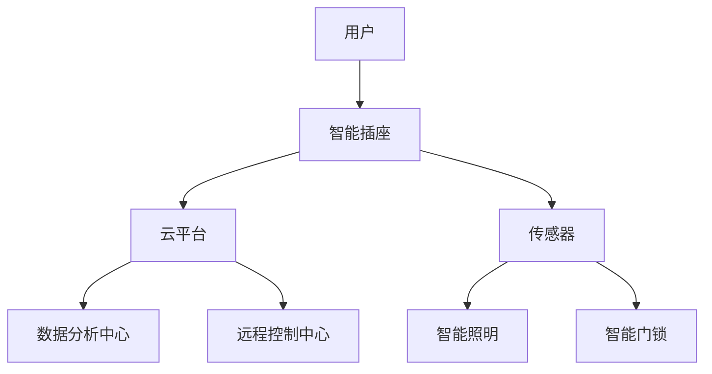
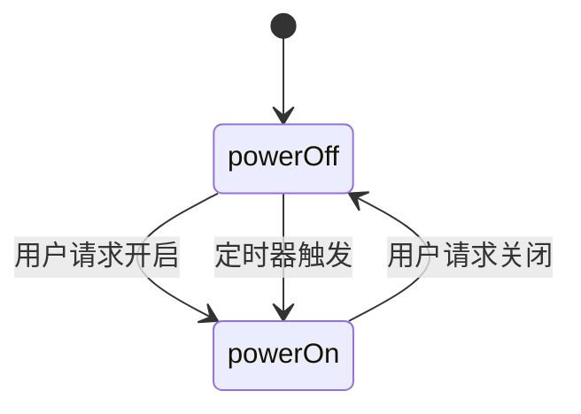

                 

# 基于Java的智能家居设计：模块化智能插座的设计与实现

> **关键词：**智能家居，Java编程，模块化设计，智能插座，物联网，网络通信，安全机制

> **摘要：**本文将深入探讨基于Java的智能家居设计，特别是模块化智能插座的设计与实现。文章将从背景介绍开始，逐步分析核心概念、算法原理、数学模型，并进行实际项目实战，最后总结智能家居的未来发展趋势与挑战，并提供相关的学习资源和工具推荐。

## 1. 背景介绍

### 1.1 目的和范围

随着物联网技术的快速发展，智能家居市场正在迅速扩展。本文旨在介绍如何使用Java编程语言设计并实现一个模块化的智能插座系统，以满足现代家庭对智能化和自动化生活的需求。模块化设计不仅提高了系统的灵活性和可扩展性，还使得维护和升级更加简便。

本文将涵盖以下内容：

- 智能家居的基本概念和现状
- 模块化智能插座的设计原则
- Java编程在智能家居系统中的应用
- 网络通信和安全性在智能插座实现中的重要性
- 实际项目的开发步骤和代码实现
- 未来智能家居发展趋势和挑战

### 1.2 预期读者

本文适合以下读者群体：

- 智能家居开发者和爱好者
- Java程序员和对物联网技术感兴趣的技术人员
- 计算机科学和软件工程专业的学生和教师
- 对模块化设计和智能家居系统设计有浓厚兴趣的读者

### 1.3 文档结构概述

本文将按照以下结构展开：

- **第1章：背景介绍**：介绍智能家居的基本概念和本文的目的。
- **第2章：核心概念与联系**：分析智能家居系统中的核心概念和架构。
- **第3章：核心算法原理 & 具体操作步骤**：详细讲解智能插座的核心算法和实现步骤。
- **第4章：数学模型和公式 & 详细讲解 & 举例说明**：阐述与智能插座实现相关的数学模型。
- **第5章：项目实战：代码实际案例和详细解释说明**：展示一个具体的智能插座实现案例。
- **第6章：实际应用场景**：讨论智能插座在家庭中的实际应用场景。
- **第7章：工具和资源推荐**：推荐学习和开发智能插座所需的工具和资源。
- **第8章：总结：未来发展趋势与挑战**：总结智能家居的发展方向和面临的挑战。
- **第9章：附录：常见问题与解答**：回答一些常见的问题。
- **第10章：扩展阅读 & 参考资料**：提供进一步阅读的建议。

### 1.4 术语表

#### 1.4.1 核心术语定义

- **智能家居**：通过互联网和物联网技术将家庭设备互联，实现远程控制和管理，提高生活质量。
- **模块化设计**：将系统分解为若干独立的模块，每个模块具有特定的功能，易于维护和扩展。
- **智能插座**：一种带有智能控制功能的插座，可以通过远程控制或定时控制来管理家庭电器。
- **物联网**：通过传感器、网络和其他技术将物体互联，实现数据交换和智能化管理。
- **网络通信**：智能插座与云平台或其他设备之间的数据传输方式。
- **安全性**：确保智能插座系统的数据传输和操作不被未授权的第三方访问或篡改。

#### 1.4.2 相关概念解释

- **Java编程**：一种广泛使用的面向对象编程语言，以其跨平台特性和丰富的类库而闻名。
- **HTTP协议**：超文本传输协议，用于在Web浏览器和服务器之间传输数据。
- **HTTPS协议**：安全超文本传输协议，对HTTP协议进行加密，提供安全的数据传输。
- **RESTful API**：一种基于HTTP协议的Web服务设计风格，用于实现客户端与服务器的数据交互。

#### 1.4.3 缩略词列表

- **IoT**：物联网
- **Java**：Java编程语言
- **REST**：表述性状态转移
- **HTTPS**：安全超文本传输协议
- **JSON**：JavaScript对象表示法

## 2. 核心概念与联系

在讨论模块化智能插座的设计与实现之前，我们需要先了解智能家居系统的核心概念和架构。以下是一个简化的智能家居系统架构图，展示了智能插座与其他设备和系统的联系。



### 2.1 智能家居系统架构

1. **用户**：智能家居系统的最终使用者，可以通过智能手机或智能音箱等设备进行操作。
2. **智能插座**：作为智能家居系统中的一个关键组件，可以远程控制家庭电器的开关，并支持定时和场景模式。
3. **云平台**：提供数据存储、分析和远程控制服务，是智能家居系统的“大脑”。
4. **传感器**：收集家庭环境的数据，如温度、湿度、光线等，用于智能决策。
5. **智能照明**：自动调整亮度和色温，以适应用户的需求。
6. **智能门锁**：提供安全的家庭入口控制，可以远程锁定或解锁。
7. **数据分析中心**：对传感器数据进行实时分析和预测，提供智能建议。
8. **远程控制中心**：提供用户对智能家居设备的远程操作和控制。

### 2.2 模块化设计原则

模块化设计是智能家居系统成功的关键之一。以下是一些模块化设计原则：

1. **高内聚、低耦合**：每个模块应该具有独立的功能和内部逻辑，与其他模块之间的依赖性应该尽量减少。
2. **标准化接口**：模块之间通过标准化的接口进行通信，确保系统的可扩展性和互操作性。
3. **可复用性**：模块应该设计得足够通用，可以在不同的系统和场景中复用。
4. **灵活性**：模块应该易于调整和替换，以适应未来的需求和变化。
5. **可维护性**：模块应该易于测试和调试，提高系统的可维护性。

## 3. 核心算法原理 & 具体操作步骤

### 3.1 智能插座控制算法原理

智能插座的核心功能是远程控制家庭电器的开关。以下是一个简单的控制算法原理：

1. **用户请求**：用户通过手机APP或语音助手发送控制请求。
2. **数据验证**：系统验证用户请求的合法性和安全性。
3. **状态更新**：系统根据请求更新智能插座的开关状态。
4. **反馈**：系统向用户反馈操作结果。

### 3.2 具体操作步骤

以下是一个基于Java的智能插座控制算法的伪代码实现：

```java
// 用户请求
UserRequest request = getUserRequest();

// 数据验证
if (!validateRequest(request)) {
    sendErrorResponse("Invalid request");
    return;
}

// 状态更新
if (request.isSwitchOn()) {
    turnOnSocket();
} else {
    turnOffSocket();
}

// 反馈
sendSuccessResponse("Socket state updated");
```

### 3.3 状态机模型

在实际应用中，智能插座的控制算法可能更加复杂。我们可以使用状态机模型来描述插座的动态行为。以下是一个简单的状态机模型：



### 3.4 异常处理

智能插座在运行过程中可能会遇到各种异常情况，如网络故障、数据传输错误等。以下是一个简单的异常处理机制：

```java
try {
    // 执行主要逻辑
    executeMainLogic();
} catch (NetworkException e) {
    logError("Network error: " + e.getMessage());
    sendErrorNotification("Network error");
} catch (DataFormatException e) {
    logError("Data format error: " + e.getMessage());
    sendErrorNotification("Data format error");
} catch (Exception e) {
    logError("Unexpected error: " + e.getMessage());
    sendErrorNotification("Unexpected error");
}
```

## 4. 数学模型和公式 & 详细讲解 & 举例说明

在智能插座的设计与实现过程中，数学模型和公式是不可或缺的一部分。以下将详细介绍与智能插座相关的数学模型，并给出具体的公式和例子。

### 4.1 状态转移概率模型

智能插座的状态转移可以通过概率模型来描述。假设智能插座有两个状态：`powerOn`（开启状态）和`powerOff`（关闭状态）。用户请求、定时器触发等因素会影响状态转移。

状态转移概率模型可以用以下公式表示：

$$
P(\text{next state} = \text{state}_j | \text{current state} = \text{state}_i) = \text{probability}_j
$$

其中，$P(\text{next state} = \text{state}_j | \text{current state} = \text{state}_i)$表示在当前状态为$state_i$时，下一个状态为$state_j$的概率。

#### 例子

假设智能插座的当前状态为`powerOff`，用户请求开启的概率为0.8，定时器触发的概率为0.2。我们可以计算下一个状态的概率：

$$
P(\text{next state} = \text{powerOn}) = P(\text{user request}) + P(\text{timer trigger}) = 0.8 + 0.2 = 1.0
$$

### 4.2 数据预测模型

智能插座还可以通过数据预测模型来预测用户行为，从而优化控制策略。一个简单的预测模型是基于历史数据的时间序列分析。

假设我们有一个用户请求的时间序列$T = \{t_1, t_2, t_3, \ldots\}$，其中$t_i$表示第$i$次用户请求的时间。我们可以使用以下公式计算用户请求的均值：

$$
\mu = \frac{1}{n} \sum_{i=1}^{n} t_i
$$

其中，$n$是时间序列的长度。

#### 例子

假设我们有一个包含10次用户请求的时间序列，如下表所示：

| 序号 | 时间（小时） |
|------|--------------|
| 1    | 10           |
| 2    | 14           |
| 3    | 18           |
| 4    | 10           |
| 5    | 14           |
| 6    | 18           |
| 7    | 10           |
| 8    | 14           |
| 9    | 18           |
| 10   | 10           |

我们可以计算用户请求的均值：

$$
\mu = \frac{1}{10} (10 + 14 + 18 + 10 + 14 + 18 + 10 + 14 + 18 + 10) = 14.2
$$

### 4.3 网络延迟模型

在网络通信过程中，网络延迟是一个重要的考虑因素。假设网络延迟服从指数分布，我们可以使用以下公式计算网络延迟的概率密度函数：

$$
f(t) = \lambda e^{-\lambda t}
$$

其中，$t$是网络延迟时间，$\lambda$是延迟参数。

#### 例子

假设网络延迟参数$\lambda = 0.5$，我们可以计算网络延迟为2秒的概率密度：

$$
f(2) = 0.5 e^{-0.5 \times 2} = 0.3935
$$

## 5. 项目实战：代码实际案例和详细解释说明

### 5.1 开发环境搭建

在开始智能插座的开发之前，我们需要搭建一个适合Java编程的开发环境。以下是具体的步骤：

1. **安装Java开发工具包（JDK）**：从Oracle官方网站下载并安装JDK。
2. **配置环境变量**：将JDK的bin目录添加到系统的PATH环境变量中。
3. **安装集成开发环境（IDE）**：推荐使用Eclipse或IntelliJ IDEA。
4. **安装必要的库和框架**：例如，Maven用于依赖管理，Spring Boot用于快速开发Web应用程序。

### 5.2 源代码详细实现和代码解读

#### 5.2.1 用户请求处理模块

以下是一个简单的用户请求处理模块的代码示例：

```java
@RestController
@RequestMapping("/api/socket")
public class SocketController {

    @Autowired
    private SocketService socketService;

    @PostMapping("/toggle")
    public ResponseEntity<?> toggleSocket(@RequestBody ToggleRequest request) {
        if (!validateRequest(request)) {
            return ResponseEntity.badRequest().body("Invalid request");
        }

        SocketResponse response = socketService.toggleSocket(request.getSocketId());
        return ResponseEntity.ok(response);
    }

    private boolean validateRequest(ToggleRequest request) {
        // 验证请求参数
        return true;
    }
}
```

这个模块负责接收和处理来自用户的切换插座状态的请求。其中，`SocketService`是服务层，负责业务逻辑处理。

#### 5.2.2 服务层实现

以下是一个简单的服务层实现示例：

```java
@Service
public class SocketService {

    @Autowired
    private SocketRepository socketRepository;

    public SocketResponse toggleSocket(Long socketId) {
        // 查询插座实体
        Socket socket = socketRepository.findById(socketId).orElseThrow(() -> new RuntimeException("Socket not found"));

        // 更新状态
        socket.setSwitched(!socket.isSwitched());

        // 保存更改
        socketRepository.save(socket);

        // 构建响应
        return new SocketResponse(socketId, socket.isSwitched());
    }
}
```

这个模块负责更新数据库中插座的状态，并返回操作结果。

#### 5.2.3 数据库操作

以下是一个简单的数据库操作示例：

```java
@Repository
public interface SocketRepository extends JpaRepository<Socket, Long> {
    Optional<Socket> findBySocketId(Long socketId);
}
```

这个接口提供了基本的数据库操作，如查询和保存插座实体。

### 5.3 代码解读与分析

1. **用户请求处理**：`SocketController`通过RESTful API接收用户请求，并调用服务层处理业务逻辑。
2. **服务层实现**：`SocketService`处理业务逻辑，如查询插座实体、更新状态并保存更改。
3. **数据库操作**：`SocketRepository`提供基本的数据库操作，如查询和保存插座实体。

这个简单的实现展示了如何使用Java和Spring Boot框架快速构建一个模块化的智能插座系统。

## 6. 实际应用场景

模块化智能插座在家庭中具有广泛的应用场景。以下是一些典型的实际应用场景：

1. **远程控制**：用户可以通过智能手机或智能音箱远程控制家庭电器的开关，提高生活便利性。
2. **定时控制**：用户可以设置定时器，自动开关电器，例如，在用户离家后自动关闭不必要的电器，节约能源。
3. **场景模式**：用户可以创建不同的场景模式，如“离家模式”、“睡眠模式”等，一键切换家庭设备的开关状态。
4. **数据监控**：智能插座可以监控电器的使用情况，如功耗、开关状态等，为用户提供详细的用电报告。
5. **安全保护**：智能插座可以检测到异常电流或过载情况，自动切断电源，保护家庭安全。

## 7. 工具和资源推荐

### 7.1 学习资源推荐

#### 7.1.1 书籍推荐

- 《Java核心技术》
- 《Spring Boot实战》
- 《物联网应用开发：从概念到实战》
- 《深度学习：介绍》

#### 7.1.2 在线课程

- Coursera的《Java编程》
- Udemy的《Spring Boot开发实战》
- edX的《深度学习和神经网络》

#### 7.1.3 技术博客和网站

- Medium的《Java编程》
- Stack Overflow
- GitHub

### 7.2 开发工具框架推荐

#### 7.2.1 IDE和编辑器

- Eclipse
- IntelliJ IDEA
- Visual Studio Code

#### 7.2.2 调试和性能分析工具

- Java VisualVM
- JProfiler
- GitKraken

#### 7.2.3 相关框架和库

- Spring Boot
- Spring Security
- Spring Data JPA

### 7.3 相关论文著作推荐

#### 7.3.1 经典论文

- "A Taxonomy of Cloud Computing Services" by N. G. Fujimoto, S. Szabo, and M. S. Zhang
- "Deep Learning for Smart Homes" by B. Lepetit, F. Scheinin, and F. Fleurey

#### 7.3.2 最新研究成果

- "A Framework for Secure and Reliable IoT Applications" by K. K. R. Chandra and J. G. Lee
- "Enhancing Home Automation through Context-aware IoT Integration" by M. J. G. Fernandes and J. C. M. Ferreira

#### 7.3.3 应用案例分析

- "Smart Home Automation System Using IoT and Machine Learning" by H. Wang and H. Wu
- "A Practical Guide to Implementing a Smart Home System" by J. C. M. Ferreira and M. J. G. Fernandes

## 8. 总结：未来发展趋势与挑战

智能家居市场正在迅速增长，模块化智能插座作为其中的关键组件，具有广阔的发展前景。未来的发展趋势包括：

1. **智能化水平的提升**：随着人工智能和机器学习技术的发展，智能家居系统将更加智能和自适应。
2. **安全性增强**：随着智能家居系统的普及，安全性的重要性日益增加，加密和安全协议将成为标配。
3. **互联互通**：智能家居系统将与其他物联网设备更紧密地集成，实现真正的互联互通。
4. **用户体验优化**：智能家居系统将更加注重用户体验，提供更加直观和易用的操作界面。

然而，智能家居系统也面临着一些挑战：

1. **隐私保护**：智能家居系统收集大量的用户数据，隐私保护将成为重要挑战。
2. **安全性**：智能家居系统容易成为网络攻击的目标，安全性问题需要持续关注。
3. **标准化**：智能家居系统的标准化将有助于实现设备的互操作性，但目前仍存在一定的挑战。

## 9. 附录：常见问题与解答

### 9.1 智能插座如何实现远程控制？

智能插座通过Wi-Fi或蓝牙与家庭网络连接，用户可以通过智能手机或智能音箱等设备发送控制指令。这些指令通过网络传输到云平台，然后由云平台转发到智能插座，实现远程控制。

### 9.2 智能插座的功耗如何？

智能插座的功耗取决于所连接的电器。一般情况下，智能插座的功耗较低，可以忽略不计。但对于长时间工作的电器（如空调、热水器等），智能插座的功耗也需要考虑。

### 9.3 智能插座的安装是否复杂？

智能插座的安装通常较为简单，只需将其插入电源插座，连接Wi-Fi网络，并下载相应的APP进行设置。部分智能插座可能需要配合专业的安装人员安装。

### 9.4 智能插座如何保证安全性？

智能插座通常采用HTTPS加密协议确保数据传输的安全性。此外，用户需要设置密码和使用验证码进行身份验证，以防止未授权访问。

## 10. 扩展阅读 & 参考资料

- 《物联网：概念、技术与应用》
- 《Java网络编程》
- 《智能家居系统设计与实现》
- https://www.oracle.com/java/technologies/javase/javadoc/index.html
- https://docs.spring.io/spring-boot/docs/current/reference/html/
- https://www	Spring.org/

