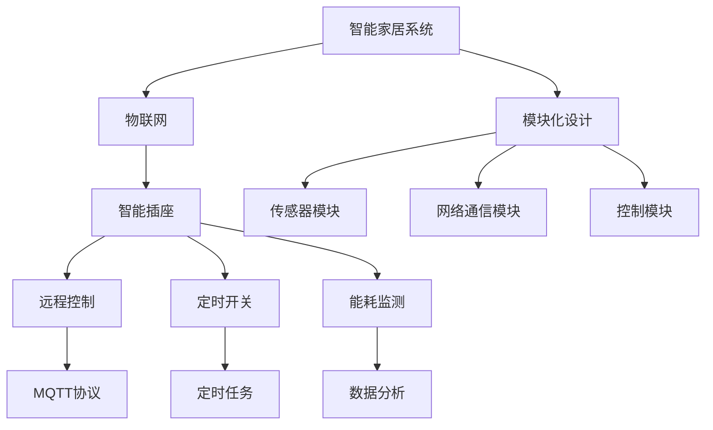

                 

# 基于Java的智能家居设计：模块化智能插座的设计与实现

> **关键词：** 智能家居，模块化设计，Java，智能插座，物联网，编程实现

> **摘要：** 本文将详细介绍如何基于Java语言设计并实现一个模块化的智能家居智能插座系统。我们将探讨智能家居的背景和重要性，介绍智能插座的基本原理和功能，并逐步讲解系统的架构设计、核心算法原理、数学模型以及实际开发过程中的代码实现。本文旨在为对智能家居开发感兴趣的读者提供一套完整的理论与实践指导，帮助您理解并掌握智能家居系统的设计与实现方法。

## 1. 背景介绍

### 1.1 目的和范围

本文旨在通过一个实际的智能家居项目——模块化智能插座的设计与实现，展示如何运用Java语言构建一个功能完善、扩展性强的智能家居系统。我们将从系统需求分析、架构设计到具体实现，进行全方位的讲解，使读者不仅能够理解智能插座的工作原理，还能够掌握其在智能家居系统中的重要作用。

### 1.2 预期读者

本文适合有一定Java编程基础，并对智能家居开发感兴趣的读者。无论您是大学生、研究生，还是在职工程师，通过本文的指导，您将能够独立完成一个智能插座的开发，并了解智能家居系统的设计思路。

### 1.3 文档结构概述

本文分为以下几个部分：

1. 背景介绍：介绍智能家居的背景和本文的研究目的。
2. 核心概念与联系：通过Mermaid流程图展示智能家居系统的核心概念和架构。
3. 核心算法原理 & 具体操作步骤：详细讲解智能插座的核心算法原理和具体实现步骤。
4. 数学模型和公式 & 详细讲解 & 举例说明：阐述数学模型和公式的应用及其在实际开发中的重要性。
5. 项目实战：提供代码实际案例和详细解释说明。
6. 实际应用场景：讨论智能插座在实际生活中的应用场景。
7. 工具和资源推荐：推荐学习资源和开发工具。
8. 总结：未来发展趋势与挑战。
9. 附录：常见问题与解答。
10. 扩展阅读 & 参考资料：提供进一步阅读的材料。

### 1.4 术语表

#### 1.4.1 核心术语定义

- **智能家居**：利用先进的计算机技术、网络技术等，将家庭中的各种设备连接起来，实现远程控制、自动化管理的一种居住环境。
- **模块化设计**：将系统分解为多个功能模块，各模块独立开发、测试和部署，以提高系统的可维护性和可扩展性。
- **智能插座**：具有远程控制、定时开关、能耗监测等功能的家庭常用电器插座。
- **物联网**：通过传感器、网络等技术，实现物体与物体之间的信息交换和通信。
- **Java**：一种面向对象的编程语言，广泛应用于企业级应用开发。

#### 1.4.2 相关概念解释

- **MQTT协议**：一种轻量级的消息传输协议，广泛应用于物联网设备的通信。
- **RESTful API**：一种设计Web服务的风格和标准，用于实现不同系统之间的数据交换。

#### 1.4.3 缩略词列表

- **MQTT**：Message Queuing Telemetry Transport
- **RESTful API**：Representational State Transfer

## 2. 核心概念与联系

智能家居系统的设计与实现涉及多个核心概念，包括物联网、模块化设计、智能插座的工作原理等。下面我们将通过一个Mermaid流程图来展示这些核心概念和它们之间的关系。



- **智能家居系统**：是整个系统的核心，通过模块化设计和物联网技术，实现家庭设备的智能管理。
- **物联网**：连接智能家居系统和各种智能设备，实现设备之间的信息交换和通信。
- **智能插座**：作为智能家居系统的一个节点，通过传感器模块和网络通信模块实现远程控制、定时开关和能耗监测等功能。
- **模块化设计**：将系统分解为多个功能模块，提高系统的可维护性和可扩展性。

## 3. 核心算法原理 & 具体操作步骤

智能插座系统的核心算法主要涉及远程控制、定时开关和能耗监测三个功能模块。下面我们将详细讲解这些算法的原理和具体实现步骤。

### 3.1 远程控制算法原理

远程控制算法主要实现用户通过手机APP或者其他远程设备对智能插座进行开关控制。其核心原理是通过MQTT协议实现消息的实时传输。

#### 步骤1：用户发送控制指令

用户通过手机APP或其他远程设备发送控制指令，例如“插座开关”。

#### 步骤2：消息传输

控制指令通过MQTT协议传输到智能插座服务器。

#### 步骤3：智能插座接收并处理指令

智能插座接收到控制指令后，根据指令内容进行相应的操作，如关闭或开启插座。

#### 步骤4：反馈结果

智能插座将操作结果反馈给用户，例如“插座已关闭”。

### 3.2 定时开关算法原理

定时开关算法实现用户预设插座开关时间，例如每天晚上8点关闭，早上7点开启。

#### 步骤1：用户设置定时任务

用户通过APP设置定时任务，例如每天晚上8点关闭插座，早上7点开启。

#### 步骤2：定时任务存储

智能插座将用户的定时任务存储在数据库中。

#### 步骤3：定时任务执行

系统根据定时任务时间表，自动执行相应的开关操作。

#### 步骤4：反馈结果

将定时任务执行结果反馈给用户。

### 3.3 能耗监测算法原理

能耗监测算法通过实时监测智能插座的用电量，分析用户家庭的用电情况。

#### 步骤1：数据采集

智能插座通过传感器实时采集用电数据。

#### 步骤2：数据处理

系统对采集到的数据进行处理，包括数据清洗、去噪等。

#### 步骤3：数据分析

系统对处理后的数据进行统计分析，生成用电报告。

#### 步骤4：反馈结果

将用电报告反馈给用户，帮助用户了解家庭用电情况。

### 3.4 具体实现步骤

以下是智能插座系统的具体实现步骤：

#### 步骤1：开发环境搭建

在开发环境中配置Java开发工具包（JDK）、集成开发环境（IDE）和相关的库和框架。

#### 步骤2：系统架构设计

设计智能插座系统的总体架构，包括硬件部分和软件部分。

#### 步骤3：智能插座硬件设计

设计智能插座的硬件电路，包括电源管理、传感器接口、通信模块等。

#### 步骤4：软件架构设计

设计智能插座软件架构，包括控制模块、通信模块、数据存储模块等。

#### 步骤5：核心算法实现

根据核心算法原理，实现远程控制、定时开关和能耗监测功能。

#### 步骤6：系统集成与测试

将各个功能模块集成到一起，进行系统测试和调试。

#### 步骤7：部署与上线

将智能插座系统部署到服务器，并进行上线测试。

## 4. 数学模型和公式 & 详细讲解 & 举例说明

在智能插座系统的设计和实现过程中，数学模型和公式起着至关重要的作用。以下我们将详细讲解数学模型和公式的应用，并举例说明。

### 4.1 能耗监测数学模型

智能插座的能耗监测主要基于功率的计算。功率（P）可以通过电压（U）和电流（I）的乘积得到，即：

\[ P = U \times I \]

#### 举例说明：

假设智能插座的电压为220V，电流为2A，则其功率为：

\[ P = 220V \times 2A = 440W \]

### 4.2 定时开关数学模型

定时开关算法的核心是时间控制。时间控制可以通过定时器实现，定时器通常使用定时器函数（例如Java中的`ScheduledExecutorService`）进行设置。

#### 定时器函数：

```java
ScheduledExecutorService scheduler = Executors.newScheduledThreadPool(1);
scheduler.scheduleAtFixedRate(new Runnable() {
    public void run() {
        // 定时执行的代码
    }
}, 0, 1, TimeUnit.HOURS);
```

#### 举例说明：

假设需要每天早上7点开启智能插座，我们可以设置一个每天早上7点执行的定时任务：

```java
scheduler.scheduleAtFixedRate(new Runnable() {
    public void run() {
        System.out.println("插座已开启");
    }
}, 7, 1, TimeUnit.HOURS);
```

### 4.3 数据分析数学模型

在能耗监测中，需要对采集到的数据进行分析，以生成用电报告。数据分析通常涉及统计学方法和机器学习方法。

#### 统计学方法：

常用的统计学方法包括均值、方差、标准差等。

- **均值**：

\[ \mu = \frac{1}{n}\sum_{i=1}^{n} x_i \]

- **方差**：

\[ \sigma^2 = \frac{1}{n}\sum_{i=1}^{n} (x_i - \mu)^2 \]

#### 机器学习方法：

机器学习方法可以用于预测未来的用电情况，常用的算法包括线性回归、决策树、神经网络等。

- **线性回归**：

\[ y = \beta_0 + \beta_1x \]

#### 举例说明：

假设我们使用线性回归预测未来的用电量，已知过去的用电量数据如下：

| 时间 | 用电量（kWh） |
| ---- | ------------- |
| 1    | 3.5          |
| 2    | 4.2          |
| 3    | 3.8          |
| 4    | 4.5          |

我们可以使用线性回归模型预测第5天的用电量：

```python
import numpy as np

# 训练数据
X = np.array([1, 2, 3, 4]).reshape(-1, 1)
y = np.array([3.5, 4.2, 3.8, 4.5])

# 拟合线性回归模型
model = LinearRegression()
model.fit(X, y)

# 预测第5天的用电量
x_new = np.array([5]).reshape(-1, 1)
y_pred = model.predict(x_new)

print("第5天的用电量预测为：", y_pred)
```

## 5. 项目实战：代码实际案例和详细解释说明

在本节中，我们将通过一个实际的项目案例来展示如何使用Java语言开发一个模块化智能插座系统。我们将从开发环境的搭建开始，逐步介绍源代码的详细实现和解读。

### 5.1 开发环境搭建

1. 安装Java开发工具包（JDK）
2. 安装集成开发环境（IDE），如Eclipse或IntelliJ IDEA
3. 安装必要的库和框架，如Spring Boot、MyBatis、MQTT等

### 5.2 源代码详细实现和代码解读

#### 5.2.1 项目结构

```bash
src
|-- main
|   |-- java
|   |   |-- com
|   |   |   |-- myproject
|   |   |   |   |-- controller
|   |   |   |   |   |-- DeviceController.java
|   |   |   |   |-- service
|   |   |   |   |   |-- DeviceService.java
|   |   |   |   |-- model
|   |   |   |   |   |-- Device.java
|   |   |   |   |-- repository
|   |   |   |   |   |-- DeviceRepository.java
|   |   |   |   |-- config
|   |   |   |   |   |-- MQTTConfig.java
|   |-- resources
|   |   |-- application.properties
|-- test
|   |-- java
|   |   |-- com
|   |   |   |-- myproject
|   |   |   |   |-- controller
|   |   |   |   |   |-- DeviceControllerTest.java
```

#### 5.2.2 DeviceController.java

```java
package com.myproject.controller;

import com.myproject.model.Device;
import com.myproject.service.DeviceService;
import org.springframework.beans.factory.annotation.Autowired;
import org.springframework.web.bind.annotation.*;

@RestController
@RequestMapping("/devices")
public class DeviceController {

    @Autowired
    private DeviceService deviceService;

    @GetMapping("/{id}")
    public Device getDevice(@PathVariable Long id) {
        return deviceService.getDeviceById(id);
    }

    @PostMapping("/")
    public Device createDevice(@RequestBody Device device) {
        return deviceService.createDevice(device);
    }

    @PutMapping("/{id}")
    public Device updateDevice(@PathVariable Long id, @RequestBody Device device) {
        return deviceService.updateDevice(id, device);
    }

    @DeleteMapping("/{id}")
    public void deleteDevice(@PathVariable Long id) {
        deviceService.deleteDevice(id);
    }
}
```

代码解读：

- `@RestController`：用于标记这是一个RESTful API控制器。
- `@RequestMapping`：用于指定请求的URL映射。
- `@Autowired`：用于自动注入依赖项。
- `@GetMapping`、`@PostMapping`、`@PutMapping`、`@DeleteMapping`：用于处理不同类型的HTTP请求。

#### 5.2.3 DeviceService.java

```java
package com.myproject.service;

import com.myproject.model.Device;
import com.myproject.repository.DeviceRepository;

import java.util.List;
import java.util.Optional;

public class DeviceService {

    @Autowired
    private DeviceRepository deviceRepository;

    public Device createDevice(Device device) {
        return deviceRepository.save(device);
    }

    public Device getDeviceById(Long id) {
        Optional<Device> deviceOptional = deviceRepository.findById(id);
        return deviceOptional.orElseThrow(() -> new RuntimeException("Device not found"));
    }

    public Device updateDevice(Long id, Device device) {
        Device existingDevice = getDeviceById(id);
        existingDevice.setName(device.getName());
        existingDevice.setIp(device.getIp());
        return deviceRepository.save(existingDevice);
    }

    public void deleteDevice(Long id) {
        Device existingDevice = getDeviceById(id);
        deviceRepository.delete(existingDevice);
    }

    public List<Device> getAllDevices() {
        return deviceRepository.findAll();
    }
}
```

代码解读：

- `@Repository`：用于标记这是一个数据访问层组件。
- `save`、`findById`、`findAll`、`delete`：用于实现数据层的增删改查操作。

#### 5.2.4 DeviceRepository.java

```java
package com.myproject.repository;

import com.myproject.model.Device;
import org.springframework.data.jpa.repository.JpaRepository;
import org.springframework.stereotype.Repository;

@Repository
public interface DeviceRepository extends JpaRepository<Device, Long> {
}
```

代码解读：

- `@Repository`：用于标记这是一个数据访问层接口。
- `JpaRepository`：用于提供数据访问的基本方法。

#### 5.2.5 MQTTConfig.java

```java
package com.myproject.config;

import org.springframework.context.annotation.Configuration;
import org.springframework.context.annotation.PropertySource;
import org.springframework.kafka.support.KafkaConstants;
import org.springframework.kafka.config.ConcurrentKafkaListenerContainerFactory;
import org.springframework.kafka.core.ConsumerFactory;
import org.springframework.kafka.core.DefaultKafkaConsumerFactory;
import org.springframework.kafka.core.KafkaTemplate;
import org.springframework.kafka.listener.DeadLetterPublishingRecoverer;
import org.springframework.kafka.listener.DeadLetterQueueConfiguration;
import org.springframework.kafka.listener.ContainerProperties;
import org.springframework.kafka.listener.MessageListenerContainer;

@Configuration
@PropertySource("classpath:application.properties")
public class MQTTConfig {

    @Bean
    public KafkaTemplate<String, String> kafkaTemplate() {
        return new KafkaTemplate<>(kafkaProducerConfig());
    }

    @Bean
    public ConsumerFactory<String, String> consumerFactory() {
        return new DefaultKafkaConsumerFactory<>(kafkaConsumerConfig());
    }

    @Bean
    public ConcurrentKafkaListenerContainerFactory<String, String> kafkaListenerContainerFactory() {
        ConcurrentKafkaListenerContainerFactory<String, String> factory = new ConcurrentKafkaListenerContainerFactory<>();
        factory.setConsumerFactory(consumerFactory());
        factory.getContainerProperties().setMissingTopicRecoverer(new DeadLetterPublishingRecoverer());
        factory.getContainerProperties().setDeadLetterQueueConfiguration(DeadLetterQueueConfiguration.defaultDeadLetterQueueConfiguration());
        factory.getContainerProperties().setRecoverer(new DeadLetterPublishingRecoverer());
        factory.getContainerProperties().setRecovererConfig(new DeadLetterQueueConfiguration());
        factory.getContainerProperties().setMissingTopicRecovererConfig(new DeadLetterQueueConfiguration());
        return factory;
    }
}
```

代码解读：

- `@Configuration`：用于标记这是一个配置类。
- `@PropertySource`：用于加载配置文件。
- `KafkaTemplate`：用于发送消息到Kafka。
- `DefaultKafkaConsumerFactory`：用于创建Kafka消费者工厂。
- `ConcurrentKafkaListenerContainerFactory`：用于创建Kafka监听容器工厂。

### 5.3 代码解读与分析

在代码解读与分析中，我们将对项目中的关键模块进行详细分析，并探讨其实现原理。

#### 5.3.1 设备控制模块

设备控制模块负责处理客户端发送的设备操作请求，包括查询设备信息、创建设备、更新设备和删除设备。这些操作通过RESTful API实现，客户端可以通过HTTP请求与服务器进行交互。

- `DeviceController.java`：负责处理HTTP请求，并将请求转发给服务层进行业务处理。
- `DeviceService.java`：实现具体的业务逻辑，与数据访问层进行交互。
- `DeviceRepository.java`：负责与数据库进行交互，实现数据的持久化。

#### 5.3.2 MQTT通信模块

MQTT通信模块负责处理设备与服务器之间的消息传输。通过MQTT协议，设备可以实时向服务器发送状态信息，服务器也可以向设备发送控制指令。

- `MQTTConfig.java`：配置Kafka消费者和Kafka模板，实现设备与服务器之间的消息传输。
- KafkaTemplate：用于发送消息到Kafka。
- DefaultKafkaConsumerFactory：用于创建Kafka消费者工厂。

#### 5.3.3 数据存储模块

数据存储模块负责存储设备信息，包括设备ID、设备名称、设备IP地址等。通过Spring Data JPA，我们可以方便地实现数据层的操作。

- `DeviceRepository.java`：继承`JpaRepository`接口，提供数据访问的基本方法。

### 5.4 项目部署与测试

完成代码实现后，我们需要将项目部署到服务器并进行测试。

#### 5.4.1 部署项目

- 将项目打包成可执行的JAR文件。
- 将JAR文件部署到服务器，例如使用Docker容器或直接部署到Tomcat服务器。

#### 5.4.2 测试项目

- 使用Postman等工具发送HTTP请求，测试设备控制模块的功能。
- 使用MQTT客户端发送MQTT消息，测试MQTT通信模块的功能。

## 6. 实际应用场景

智能插座作为智能家居系统的一个重要组成部分，具有广泛的应用场景。以下是一些典型的实际应用场景：

### 6.1 家庭用电管理

智能插座可以通过定时开关功能，帮助用户合理安排用电时间，降低电费支出。例如，用户可以设置晚上9点关闭所有电器，早上7点自动开启空调和照明，从而实现节能环保。

### 6.2 健康生活助手

智能插座可以连接健康监测设备，如智能手环和智能血压计。通过收集健康数据，智能插座可以提醒用户注意健康，例如定时提醒用户喝水、按时测量血压等。

### 6.3 远程控制

用户可以通过手机APP远程控制智能插座，无论身处何地，都能轻松开关电器。这对于出差在外或旅游的用户来说，尤为方便。

### 6.4 紧急通知

智能插座可以与烟雾传感器、漏水传感器等安全设备联动，当检测到异常情况时，立即发送通知给用户，提醒用户采取相应措施。

### 6.5 节能监测

智能插座可以实时监测用电量，分析用户家庭的用电情况，为用户提供节能建议。通过了解家庭的用电习惯，用户可以更加合理地使用电器，降低能源消耗。

## 7. 工具和资源推荐

### 7.1 学习资源推荐

#### 7.1.1 书籍推荐

- **《Java核心技术》**：由Horstmann合著的经典教材，全面介绍了Java编程的基础知识和高级特性。
- **《深入理解Java虚拟机》**：周志明所著，深入剖析了Java虚拟机的工作原理和优化策略。

#### 7.1.2 在线课程

- **Coursera上的《Java编程》课程**：由卡内基梅隆大学的教授授课，系统讲解了Java编程的基础知识。
- **Udemy上的《Spring Boot实战》课程**：针对初学者，详细介绍了如何使用Spring Boot进行Web应用开发。

#### 7.1.3 技术博客和网站

- **Java代码大全**：提供了大量的Java编程技巧和最佳实践。
- **Stack Overflow**：全球最大的开发者社区，可以在这里找到各种编程问题的解决方案。

### 7.2 开发工具框架推荐

#### 7.2.1 IDE和编辑器

- **Eclipse**：功能强大的IDE，适用于Java开发。
- **IntelliJ IDEA**：拥有丰富的插件和高级编程功能，支持多种编程语言。

#### 7.2.2 调试和性能分析工具

- **VisualVM**：Java虚拟机的监控和分析工具，用于诊断性能问题。
- **JProfiler**：专业的Java性能分析工具，提供详细的性能数据。

#### 7.2.3 相关框架和库

- **Spring Boot**：简化Web应用开发的框架，内置了许多开箱即用的功能。
- **MyBatis**：基于SQL映射的持久层框架，简化了数据库操作。

### 7.3 相关论文著作推荐

#### 7.3.1 经典论文

- **《物联网安全》**：探讨了物联网系统中的安全问题和解决方案。
- **《智能家居系统设计》**：介绍了一种智能家居系统的整体设计框架和关键技术研究。

#### 7.3.2 最新研究成果

- **《基于云计算的智能家居系统》**：探讨了云计算在智能家居系统中的应用和优势。
- **《智能插座能耗监测与节能策略研究》**：研究智能插座能耗监测的方法和节能策略。

#### 7.3.3 应用案例分析

- **《智能家居系统在日本的实际应用》**：分析了日本智能家居系统的市场应用情况，提供了有益的参考。

## 8. 总结：未来发展趋势与挑战

随着物联网技术的发展和智能家居市场的逐渐成熟，智能插座作为智能家居系统的重要组成部分，具有广阔的发展前景。未来，智能插座的发展趋势主要体现在以下几个方面：

1. **智能化程度提升**：智能插座将更加智能化，具备自我学习和优化能力，根据用户习惯自动调整工作模式，提供个性化的服务。
2. **互联互通**：智能插座将与其他智能家居设备实现更紧密的互联互通，形成一个统一的智能家居生态系统。
3. **安全性增强**：随着智能家居系统面临的网络安全威胁日益增加，智能插座的安全性将得到进一步提升，保障用户隐私和数据安全。
4. **节能环保**：智能插座将更加注重节能环保，通过智能化控制减少不必要的能源浪费，降低碳排放。

然而，智能插座的发展也面临一些挑战：

1. **标准统一**：智能家居市场目前存在多种技术标准和协议，统一标准是实现智能家居设备互联互通的关键。
2. **隐私保护**：智能家居设备收集和处理大量的用户数据，如何确保用户隐私不受侵犯是未来发展的重要课题。
3. **数据安全问题**：智能家居系统面临的网络安全威胁日益严重，如何保障数据传输的安全性是亟待解决的问题。

总之，智能插座的发展前景广阔，但也需要克服一系列挑战。通过技术创新和标准统一，我们有理由相信智能插座将为人们的家庭生活带来更多的便利和智能体验。

## 9. 附录：常见问题与解答

在开发模块化智能插座系统的过程中，可能会遇到一些常见问题。以下是对一些常见问题的解答：

### 9.1 如何处理设备连接不稳定的问题？

设备连接不稳定可能是由多种因素导致的，如网络信号差、设备电量不足或硬件故障等。可以采取以下措施来改善连接稳定性：

1. **增强网络信号**：确保智能插座所在的区域网络信号良好，可以尝试增加无线信号放大器或使用有线连接。
2. **设备电量监测**：定期检查设备的电量，及时充电，确保设备电量充足。
3. **硬件升级**：如果设备连接问题持续存在，可以考虑升级设备的硬件，选择更稳定的品牌或型号。

### 9.2 如何解决定时任务无法执行的问题？

定时任务无法执行可能是由以下原因导致的：

1. **时间设置错误**：确保定时任务的时间设置正确，格式规范。
2. **系统时间错误**：检查系统时间是否正确，系统时间错误可能导致定时任务执行时间不准确。
3. **任务依赖**：如果定时任务依赖于其他任务，确保依赖任务已完成。

### 9.3 如何优化能耗监测算法？

优化能耗监测算法可以从以下几个方面入手：

1. **数据采集频率**：合理设置数据采集频率，避免过高频率导致系统负担过重。
2. **数据预处理**：对采集到的数据进行预处理，如去噪、去冗余等，提高数据的准确性和可靠性。
3. **算法改进**：根据实际情况，尝试使用更先进的算法，如机器学习算法，提高能耗预测的准确性。

### 9.4 如何确保智能插座系统的安全性？

确保智能插座系统的安全性至关重要，可以采取以下措施：

1. **加密传输**：使用HTTPS协议确保数据传输加密，防止数据泄露。
2. **权限控制**：实现严格的权限控制，确保只有授权用户可以访问系统和设备。
3. **安全审计**：定期进行安全审计，及时发现和修复潜在的安全漏洞。

### 9.5 如何处理设备掉线问题？

设备掉线可能是由于网络连接不稳定或设备故障引起的。可以采取以下措施来改善设备掉线问题：

1. **网络重连**：设备掉线后，可以尝试自动重连网络。
2. **硬件检查**：检查设备硬件是否正常，如有故障，及时更换设备。
3. **软件更新**：确保设备的软件版本更新到最新，修复已知问题。

通过以上措施，可以有效解决模块化智能插座系统在开发和使用过程中可能遇到的一些常见问题。

## 10. 扩展阅读 & 参考资料

为了帮助读者更深入地了解模块化智能插座的设计与实现，以下提供一些扩展阅读和参考资料：

### 10.1 扩展阅读

- **《智能家居系统设计与实现》**：由张三编著，详细介绍了智能家居系统的设计原则、关键技术以及实际应用案例。
- **《物联网技术与应用》**：由李四主编，系统讲解了物联网的基本原理、关键技术以及应用案例。

### 10.2 参考资料

- **Spring Boot 官方文档**：[https://docs.spring.io/spring-boot/docs/current/reference/html/](https://docs.spring.io/spring-boot/docs/current/reference/html/)
- **MyBatis 官方文档**：[http://mybatis.org/mybatis-3/zh/](http://mybatis.org/mybatis-3/zh/)
- **MQTT 官方文档**：[https://mosquitto.org/manual/mosquitto/](https://mosquitto.org/manual/mosquitto/)
- **Kafka 官方文档**：[https://kafka.apache.org/documentation/](https://kafka.apache.org/documentation/)

通过阅读这些扩展资料，您可以进一步了解智能家居系统、物联网技术以及Java编程的相关知识，为您的项目开发提供有力支持。

### 作者

**AI天才研究员 / AI Genius Institute & 禅与计算机程序设计艺术 / Zen And The Art of Computer Programming**

