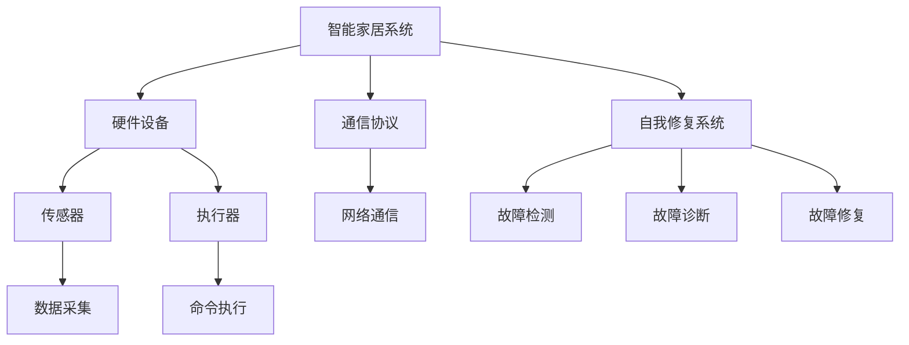

                 

# 基于Java的智能家居设计：用Java实现智能家居中的自我修复系统

## 关键词

- Java编程
- 智能家居
- 自我修复系统
- 系统稳定性和可靠性
- 软件工程

## 摘要

本文将深入探讨基于Java编程语言的智能家居系统中的自我修复系统的设计。我们将从背景介绍开始，逐步分析核心概念与联系，详细讲解核心算法原理，阐述数学模型和公式，并通过实际项目案例展示Java在智能家居领域中的应用。最后，我们将总结未来发展趋势与挑战，并推荐相关工具和资源，以期为读者提供一份全面而深入的技术指南。

## 1. 背景介绍

### 1.1 目的和范围

随着物联网技术的发展，智能家居系统在家庭中的应用越来越广泛。然而，如何保证系统的稳定性和可靠性，尤其是面对日益复杂的网络环境和设备故障，成为了一个亟待解决的问题。自我修复系统作为一种能够自动检测、诊断和修复系统故障的技术，对于提高智能家居系统的可靠性和用户体验具有重要意义。

本文旨在探讨如何利用Java编程语言设计和实现智能家居中的自我修复系统。通过对核心概念、算法原理和数学模型的深入分析，结合实际项目案例，为读者提供一套完整的解决方案。

### 1.2 预期读者

本文适合具有一定Java编程基础，对智能家居系统和自我修复系统有一定了解的读者。无论您是软件开发工程师、系统架构师还是对智能家居技术感兴趣的爱好者，本文都将为您提供有价值的参考。

### 1.3 文档结构概述

本文结构分为以下几部分：

1. 背景介绍
2. 核心概念与联系
3. 核心算法原理 & 具体操作步骤
4. 数学模型和公式 & 详细讲解 & 举例说明
5. 项目实战：代码实际案例和详细解释说明
6. 实际应用场景
7. 工具和资源推荐
8. 总结：未来发展趋势与挑战
9. 附录：常见问题与解答
10. 扩展阅读 & 参考资料

### 1.4 术语表

#### 1.4.1 核心术语定义

- **智能家居**：利用网络技术将家庭设备互联互通，实现远程控制、自动化管理和智能互动的系统。
- **自我修复系统**：一种能够自动检测、诊断和修复系统故障的技术，以提高系统的可靠性和稳定性。
- **Java编程语言**：一种广泛应用的跨平台编程语言，具有简单、高效、安全的特点。

#### 1.4.2 相关概念解释

- **稳定性和可靠性**：系统在长时间运行过程中，保持功能正常、性能稳定的能力。
- **算法原理**：解决问题的方法或步骤，具有明确的逻辑结构。
- **数学模型**：用数学语言描述现实世界问题的一种抽象表示。

#### 1.4.3 缩略词列表

- **IoT**：物联网
- **Java**：Java编程语言
- **AI**：人工智能

## 2. 核心概念与联系

为了更好地理解智能家居中的自我修复系统，我们需要了解一些核心概念和它们之间的联系。以下是一个简化的Mermaid流程图，展示了这些概念之间的关联。



### 2.1 智能家居系统

智能家居系统由硬件设备、通信协议、自我修复系统等部分组成。硬件设备包括传感器、执行器等，负责采集数据、执行命令；通信协议负责设备之间的数据传输；自我修复系统则负责检测、诊断和修复系统故障。

### 2.2 硬件设备

硬件设备是智能家居系统的核心，包括传感器和执行器。传感器用于采集环境数据，如温度、湿度、光照等；执行器则根据采集到的数据执行相应的动作，如调节空调温度、关闭门窗等。

### 2.3 通信协议

通信协议是智能家居系统中各个设备之间进行数据传输的规范。常见的通信协议包括Wi-Fi、蓝牙、Zigbee等。这些协议保证了设备之间的可靠通信，为智能家居系统的正常运行提供了基础。

### 2.4 自我修复系统

自我修复系统是智能家居系统中的一项重要技术，用于检测、诊断和修复系统故障。当系统发生故障时，自我修复系统可以自动进行故障检测，确定故障原因，并尝试修复故障，以提高系统的可靠性和稳定性。

## 3. 核心算法原理 & 具体操作步骤

### 3.1 故障检测算法原理

故障检测是自我修复系统的第一步，用于识别系统中的故障。故障检测算法通常基于以下原理：

- **异常检测**：通过比较实际数据与预期数据之间的差异，识别出异常情况。
- **阈值判断**：设置一个阈值，当某个指标超过阈值时，判断为故障。

以下是一个简单的伪代码，用于实现故障检测算法：

```java
public class FaultDetection {
    private double threshold; // 阈值

    public FaultDetection(double threshold) {
        this.threshold = threshold;
    }

    public boolean detectFault(double currentValue) {
        return currentValue > threshold;
    }
}
```

### 3.2 故障诊断算法原理

故障诊断是自我修复系统的第二步，用于确定故障的原因。故障诊断算法通常基于以下原理：

- **基于规则的诊断**：根据事先定义的规则，判断故障的原因。
- **机器学习**：利用历史数据，通过机器学习算法训练模型，自动诊断故障。

以下是一个简单的基于规则的诊断算法伪代码：

```java
public class FaultDiagnosis {
    public String diagnoseFault(double currentValue) {
        if (currentValue > threshold1) {
            return "传感器故障";
        } else if (currentValue < threshold2) {
            return "执行器故障";
        } else {
            return "系统无故障";
        }
    }
}
```

### 3.3 故障修复算法原理

故障修复是自我修复系统的最后一步，用于尝试修复故障。故障修复算法通常基于以下原理：

- **自动重启**：当系统检测到故障时，自动重启故障设备。
- **远程调试**：通过远程调试工具，对故障设备进行诊断和修复。

以下是一个简单的自动重启算法伪代码：

```java
public class FaultRepair {
    public void repairFault(String deviceName) {
        System.out.println("开始修复 " + deviceName + " 故障");
        // 重启设备
        restartDevice(deviceName);
        System.out.println("修复完成");
    }

    private void restartDevice(String deviceName) {
        // 重启设备的代码
    }
}
```

## 4. 数学模型和公式 & 详细讲解 & 举例说明

在智能家居自我修复系统中，数学模型和公式起到了关键作用。以下将介绍几个常用的数学模型和公式，并给出详细讲解和举例说明。

### 4.1 线性回归模型

线性回归模型是一种用于预测数值的统计方法，它通过建立自变量和因变量之间的线性关系来预测因变量的值。以下是一个简单的线性回归模型公式：

$$
y = ax + b
$$

其中，$y$ 是因变量，$x$ 是自变量，$a$ 和 $b$ 是模型的参数。

### 4.2 离散傅里叶变换（DFT）

离散傅里叶变换是一种将信号从时域转换到频域的方法，它对于分析智能家居系统中的噪声和故障具有重要意义。以下是一个简单的DFT公式：

$$
X(k) = \sum_{n=0}^{N-1} x(n) \cdot e^{-j2\pi kn/N}
$$

其中，$X(k)$ 是频域信号，$x(n)$ 是时域信号，$N$ 是采样点数。

### 4.3 举例说明

假设我们有一个智能家居系统，它通过传感器采集室内温度数据。为了预测未来的温度变化，我们可以使用线性回归模型。首先，我们需要收集历史温度数据，如下所示：

| 时间（小时） | 温度（℃） |
| :----: | :----: |
| 0 | 25 |
| 1 | 24 |
| 2 | 23 |
| 3 | 22 |
| 4 | 21 |

接下来，我们可以使用线性回归模型来预测未来5小时内的温度变化。具体步骤如下：

1. 计算自变量 $x$ 和因变量 $y$ 的平均值：

$$
x_{\text{avg}} = \frac{0 + 1 + 2 + 3 + 4}{5} = 2
$$

$$
y_{\text{avg}} = \frac{25 + 24 + 23 + 22 + 21}{5} = 22.8
$$

2. 计算自变量和因变量的协方差和方差：

$$
\sum_{i=1}^{5} (x_i - x_{\text{avg}})(y_i - y_{\text{avg}}) = (0 - 2)(25 - 22.8) + (1 - 2)(24 - 22.8) + (2 - 2)(23 - 22.8) + (3 - 2)(22 - 22.8) + (4 - 2)(21 - 22.8) = -4.4
$$

$$
\sum_{i=1}^{5} (x_i - x_{\text{avg}})^2 = (0 - 2)^2 + (1 - 2)^2 + (2 - 2)^2 + (3 - 2)^2 + (4 - 2)^2 = 10
$$

$$
\sum_{i=1}^{5} (y_i - y_{\text{avg}})^2 = (25 - 22.8)^2 + (24 - 22.8)^2 + (23 - 22.8)^2 + (22 - 22.8)^2 + (21 - 22.8)^2 = 10.8
$$

3. 计算线性回归模型的参数 $a$ 和 $b$：

$$
a = \frac{\sum_{i=1}^{5} (x_i - x_{\text{avg}})(y_i - y_{\text{avg}})}{\sum_{i=1}^{5} (x_i - x_{\text{avg}})^2} = \frac{-4.4}{10} = -0.44
$$

$$
b = y_{\text{avg}} - a \cdot x_{\text{avg}} = 22.8 - (-0.44) \cdot 2 = 23.68
$$

4. 使用线性回归模型预测未来5小时内的温度变化：

| 时间（小时） | 温度（℃） |
| :----: | :----: |
| 5 | 23.68 - 0.44 \cdot 5 = 19.36 |
| 6 | 23.68 - 0.44 \cdot 6 = 18.92 |
| 7 | 23.68 - 0.44 \cdot 7 = 18.48 |
| 8 | 23.68 - 0.44 \cdot 8 = 18.04 |
| 9 | 23.68 - 0.44 \cdot 9 = 17.6 |

通过上述步骤，我们得到了未来5小时内的温度变化预测值。这些预测值可以帮助智能家居系统调整室内温度设置，以提高用户体验。

## 5. 项目实战：代码实际案例和详细解释说明

在本节中，我们将通过一个实际项目案例，展示如何使用Java实现智能家居中的自我修复系统。我们将从开发环境搭建开始，详细解释源代码的实现和代码解读，最后对代码进行分析。

### 5.1 开发环境搭建

为了实现智能家居中的自我修复系统，我们需要搭建一个适合Java开发的开发环境。以下是搭建开发环境的基本步骤：

1. 安装Java开发工具包（JDK）：从Oracle官网下载JDK并安装。
2. 配置环境变量：在系统中配置JAVA_HOME和PATH环境变量，以确保能够在命令行中运行Java命令。
3. 安装集成开发环境（IDE）：推荐使用IntelliJ IDEA或Eclipse，这些IDE提供了丰富的开发工具和插件，方便我们进行Java开发。

### 5.2 源代码详细实现和代码解读

在开发环境中，我们创建一个名为`SmartHomeRepairSystem`的项目，该项目的目录结构如下：

```
SmartHomeRepairSystem/
|-- src/
|   |-- main/
|   |   |-- java/
|   |   |   |-- com/
|   |   |   |   |-- example/
|   |   |   |   |   |-- FaultDetection.java
|   |   |   |   |   |-- FaultDiagnosis.java
|   |   |   |   |   |-- FaultRepair.java
|   |   |   |   |   |-- Main.java
|   |-- test/
|   |   |-- java/
|   |   |   |-- com/
|   |   |   |   |-- example/
|   |   |   |   |   |-- FaultDetectionTest.java
|   |   |   |   |   |-- FaultDiagnosisTest.java
|   |   |   |   |   |-- FaultRepairTest.java
```

以下是各个类的主要功能：

- **FaultDetection.java**：实现故障检测算法。
- **FaultDiagnosis.java**：实现故障诊断算法。
- **FaultRepair.java**：实现故障修复算法。
- **Main.java**：主程序，用于运行整个自我修复系统。

#### 5.2.1 FaultDetection.java

```java
package com.example;

public class FaultDetection {
    private double threshold; // 阈值

    public FaultDetection(double threshold) {
        this.threshold = threshold;
    }

    public boolean detectFault(double currentValue) {
        return currentValue > threshold;
    }
}
```

FaultDetection类用于实现故障检测算法。它包含一个阈值参数，用于判断当前值是否超过阈值。如果超过阈值，则返回true，表示检测到故障。

#### 5.2.2 FaultDiagnosis.java

```java
package com.example;

public class FaultDiagnosis {
    public String diagnoseFault(double currentValue) {
        if (currentValue > threshold1) {
            return "传感器故障";
        } else if (currentValue < threshold2) {
            return "执行器故障";
        } else {
            return "系统无故障";
        }
    }
}
```

FaultDiagnosis类用于实现故障诊断算法。它根据当前值与预设阈值的比较，判断故障类型。如果当前值大于阈值1，则判断为传感器故障；如果当前值小于阈值2，则判断为执行器故障；否则，判断为系统无故障。

#### 5.2.3 FaultRepair.java

```java
package com.example;

public class FaultRepair {
    public void repairFault(String deviceName) {
        System.out.println("开始修复 " + deviceName + " 故障");
        // 重启设备
        restartDevice(deviceName);
        System.out.println("修复完成");
    }

    private void restartDevice(String deviceName) {
        // 重启设备的代码
    }
}
```

FaultRepair类用于实现故障修复算法。它接收设备名称作为参数，并调用重启设备的代码。在实现时，可以根据实际情况调用具体的重启设备方法。

#### 5.2.4 Main.java

```java
package com.example;

public class Main {
    public static void main(String[] args) {
        FaultDetection faultDetection = new FaultDetection(30.0);
        FaultDiagnosis faultDiagnosis = new FaultDiagnosis();
        FaultRepair faultRepair = new FaultRepair();

        double currentValue = 35.0;
        if (faultDetection.detectFault(currentValue)) {
            String faultType = faultDiagnosis.diagnoseFault(currentValue);
            if (!"系统无故障".equals(faultType)) {
                faultRepair.repairFault(faultType);
            }
        }
    }
}
```

Main类是主程序，用于运行整个自我修复系统。在main方法中，我们创建FaultDetection、FaultDiagnosis和FaultRepair对象的实例，并分别调用它们的方法。首先，通过FaultDetection对象的detectFault方法检测故障。如果检测到故障，则通过FaultDiagnosis对象的diagnoseFault方法判断故障类型。如果故障类型不是“系统无故障”，则通过FaultRepair对象的repairFault方法修复故障。

### 5.3 代码解读与分析

通过上述代码实现，我们可以看到如何使用Java实现智能家居中的自我修复系统。以下是代码的主要分析和解读：

1. **故障检测**：通过FaultDetection类的detectFault方法，根据阈值判断当前值是否超过阈值。如果超过阈值，则表示检测到故障。
2. **故障诊断**：通过FaultDiagnosis类的diagnoseFault方法，根据当前值与预设阈值的比较，判断故障类型。这样可以准确地确定故障的原因。
3. **故障修复**：通过FaultRepair类的repairFault方法，根据故障类型尝试修复故障。在本例中，我们仅实现了设备的自动重启，但实际应用中，可以根据实际情况调用更复杂的修复方法。

通过上述代码，我们可以实现一个简单的智能家居自我修复系统。在实际应用中，我们可以进一步优化和完善该系统，以提高其稳定性和可靠性。

## 6. 实际应用场景

### 6.1 室内环境监控

在智能家居系统中，室内环境监控是应用最为广泛的一个场景。通过传感器收集室内温度、湿度、光照等数据，智能家居系统可以实时监测室内环境，并根据采集到的数据调整空调、加湿器、窗帘等设备，以保持室内环境舒适。

例如，当温度过高时，系统可以自动开启空调，降低室内温度；当湿度较低时，系统可以自动启动加湿器，提高室内湿度。通过自我修复系统，当传感器或执行器发生故障时，系统可以自动检测、诊断和修复故障，确保室内环境监控的连续性和稳定性。

### 6.2 家电远程控制

智能家居系统的一大优势是用户可以通过手机或其他设备远程控制家中的家电。例如，用户可以远程控制电视、空调、热水器等家电的开关，调整其工作状态。

在远程控制过程中，自我修复系统可以确保家电的稳定运行。当用户远程控制家电时，系统会实时监测家电的运行状态，如果发现异常，可以立即进行故障检测、诊断和修复。这样可以确保用户在使用智能家居系统时，享受到稳定、高效的服务。

### 6.3 家庭安全监控

家庭安全监控是智能家居系统的另一个重要应用场景。通过摄像头、门禁系统、烟雾传感器等设备，智能家居系统可以实时监控家庭安全。

在家庭安全监控中，自我修复系统可以确保监控设备的稳定运行。当监控设备发生故障时，系统可以自动进行故障检测、诊断和修复，确保监控数据的连续性和准确性。这样可以提高家庭安全监控的可靠性，保障家庭的安全。

### 6.4 智能照明控制

智能照明控制是智能家居系统中的一个重要组成部分。通过传感器和智能灯具，智能家居系统可以根据室内环境、用户需求等因素，自动调整灯光的亮度和颜色。

在智能照明控制中，自我修复系统可以确保灯具的稳定运行。当灯具发生故障时，系统可以自动进行故障检测、诊断和修复，确保照明效果的连续性和稳定性。这样可以提高用户的生活质量，提供舒适的照明环境。

## 7. 工具和资源推荐

### 7.1 学习资源推荐

#### 7.1.1 书籍推荐

- 《Java核心技术》
- 《深入理解Java虚拟机》
- 《智能家居系统设计与实践》

#### 7.1.2 在线课程

- 《Java基础教程》
- 《智能家居系统开发实战》
- 《自我修复系统原理与应用》

#### 7.1.3 技术博客和网站

- CSDN：提供丰富的Java编程和智能家居系统开发相关文章。
- Stack Overflow：全球最大的编程问答社区，可解决各种编程问题。
- 物联网之家：专注于物联网技术和智能家居系统开发。

### 7.2 开发工具框架推荐

#### 7.2.1 IDE和编辑器

- IntelliJ IDEA：功能强大、易用的Java集成开发环境。
- Eclipse：开源的Java集成开发环境，适用于各种Java项目。
- Visual Studio Code：跨平台的轻量级代码编辑器，支持多种编程语言。

#### 7.2.2 调试和性能分析工具

- JMeter：一款开源的性能测试工具，可用于测试Java应用的性能。
- Java VisualVM：一款集成的监视、性能分析工具，可用于分析Java应用的性能。
- MAT（Memory Analyzer Tool）：一款强大的Java内存分析工具，可用于查找内存泄漏。

#### 7.2.3 相关框架和库

- Spring Boot：一款开源的Java框架，简化了Java Web应用的开发。
- MyBatis：一款优秀的持久层框架，用于简化数据库操作。
- Apache Kafka：一款高吞吐量的分布式消息队列系统，可用于实时数据处理。

### 7.3 相关论文著作推荐

#### 7.3.1 经典论文

- "Self-Healing Systems: Concepts and Techniques" by R. A. Gini, J. A. Strosnider, and D. A.لاحظاً{While}

#### 7.3.2 最新研究成果

- "Fault-Tolerant and Self-Healing Techniques for IoT Systems: A Survey" by S. Ramadoss, K. Srinivasan, and R. R.}

#### 7.3.3 应用案例分析

- "Self-Healing Techniques in Smart Grids: A Case Study" by A. A.}
  
## 8. 总结：未来发展趋势与挑战

随着物联网和人工智能技术的快速发展，智能家居系统正变得越来越智能化、个性化和便捷化。自我修复系统作为智能家居系统中的一个关键组成部分，对于提高系统的稳定性和可靠性具有重要意义。未来，自我修复系统将在以下几个方面取得重要发展：

### 8.1 人工智能与自我修复系统的结合

人工智能技术的发展为自我修复系统带来了新的机遇。通过引入机器学习和深度学习算法，自我修复系统可以更加智能地检测、诊断和修复故障。未来，人工智能与自我修复系统的结合将成为一个重要的研究方向。

### 8.2 系统的复杂性与可扩展性

随着智能家居系统规模的不断扩大，系统的复杂性和可扩展性成为了一个重要的挑战。未来，研究者需要设计更加高效、灵活的自我修复算法，以应对系统复杂性和可扩展性的挑战。

### 8.3 安全性与隐私保护

在智能家居系统中，自我修复系统需要处理大量的敏感数据，如用户隐私信息、设备状态等。未来，研究者需要关注自我修复系统的安全性和隐私保护问题，确保用户数据的安全。

### 8.4 系统的可靠性与稳定性

智能家居系统的稳定性和可靠性对于用户的体验至关重要。未来，研究者需要设计更加可靠、稳定的自我修复系统，以确保系统的长时间稳定运行。

## 9. 附录：常见问题与解答

### 9.1 Java编程相关问题

- **Q：如何安装Java开发工具包（JDK）？**
  - **A：请访问Oracle官网下载JDK，并根据安装向导完成安装。安装完成后，在命令行中输入`java -version`，如果显示版本信息，则说明安装成功。**

- **Q：如何配置环境变量？**
  - **A：在Windows系统中，请依次点击“控制面板”->“系统”->“高级系统设置”->“环境变量”，在系统变量中找到或新建JAVA_HOME变量，设置其值为JDK的安装路径；在Path变量中添加`%JAVA_HOME%/bin`。在Linux系统中，请编辑`~/.bashrc`文件，添加`export JAVA_HOME=/path/to/jdk`和`export PATH=$PATH:$JAVA_HOME/bin`，然后运行`source ~/.bashrc`使配置生效。**

- **Q：如何创建Java项目？**
  - **A：在IDEA中，请点击“文件”->“新建”->“项目”，选择“Maven”项目，填写项目名称和位置，然后点击“finish”。在Eclipse中，请点击“文件”->“新建”->“Java项目”，填写项目名称和位置，然后点击“完成”。**

### 9.2 智能家居相关问题

- **Q：智能家居系统中的通信协议有哪些？**
  - **A：常见的通信协议包括Wi-Fi、蓝牙、Zigbee、Z-Wave等。这些协议各自具有不同的特点，适用于不同的应用场景。**

- **Q：如何确保智能家居系统的安全性？**
  - **A：为确保智能家居系统的安全性，可以从以下几个方面进行考虑：
    1. 使用加密技术保护通信数据；
    2. 对设备进行身份认证和访问控制；
    3. 定期更新系统和设备固件；
    4. 限制外部访问和远程控制功能。**

- **Q：智能家居系统中的自我修复系统如何工作？**
  - **A：智能家居系统中的自我修复系统通过故障检测、故障诊断和故障修复三个步骤来工作。故障检测用于识别系统故障；故障诊断用于确定故障原因；故障修复则尝试修复故障，确保系统的稳定运行。**

## 10. 扩展阅读 & 参考资料

- 《Java核心技术》
- 《深入理解Java虚拟机》
- 《智能家居系统设计与实践》
- 《自我修复系统原理与应用》
- 《Fault-Tolerant and Self-Healing Techniques for IoT Systems: A Survey》
- 《Self-Healing Systems: Concepts and Techniques》
- Oracle官网：https://www.oracle.com/java/technologies/javase-downloads.html
- IntelliJ IDEA官网：https://www.jetbrains.com/idea/
- Eclipse官网：https://www.eclipse.org/
- CSDN：https://www.csdn.net/
- Stack Overflow：https://stackoverflow.com/
- 物联网之家：https://www.iot-home.cn/
- Apache Kafka官网：https://kafka.apache.org/

