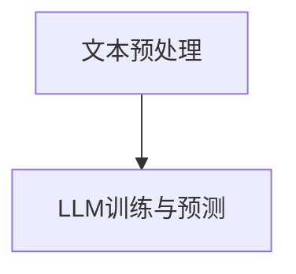
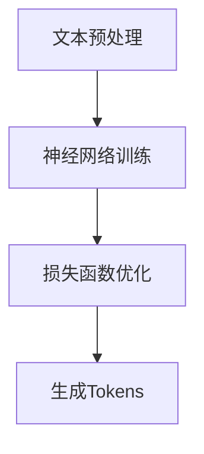

                 

# 基于LLM Tokens的推荐系统特征提取

## 关键词
- LLM Tokens
- 推荐系统
- 特征提取
- 自然语言处理
- 机器学习

## 摘要

本文将探讨如何利用大型语言模型（LLM）生成的Tokens来提取推荐系统中的关键特征。通过对LLM Tokens的深入分析，我们可以有效地识别用户兴趣和行为模式，从而提高推荐系统的准确性和效率。本文将介绍LLM Tokens的生成方法、核心概念和原理，以及如何将LLM Tokens应用于推荐系统的特征提取。此外，还将结合实际案例，展示基于LLM Tokens的特征提取在推荐系统开发中的应用和效果。

## 1. 背景介绍

### 1.1 目的和范围

本文旨在探讨如何利用大型语言模型（LLM）生成的Tokens来提升推荐系统的性能。本文将详细阐述LLM Tokens的生成过程、核心概念和原理，并通过实际案例展示其在推荐系统特征提取中的应用。

### 1.2 预期读者

本文面向对推荐系统和自然语言处理有一定了解的读者，特别是希望深入了解LLM Tokens在推荐系统中应用的技术人员。

### 1.3 文档结构概述

本文分为以下几个部分：

1. 背景介绍
2. 核心概念与联系
3. 核心算法原理 & 具体操作步骤
4. 数学模型和公式 & 详细讲解 & 举例说明
5. 项目实战：代码实际案例和详细解释说明
6. 实际应用场景
7. 工具和资源推荐
8. 总结：未来发展趋势与挑战
9. 附录：常见问题与解答
10. 扩展阅读 & 参考资料

### 1.4 术语表

#### 1.4.1 核心术语定义

- LLM Tokens：指大型语言模型生成的文本序列中的单词或短语。
- 推荐系统：根据用户历史行为和偏好，向用户推荐相关内容的系统。
- 特征提取：从原始数据中提取具有区分度的特征，以用于模型训练和预测。
- 自然语言处理：研究如何让计算机理解、生成和处理人类语言的技术。

#### 1.4.2 相关概念解释

- Tokens：指在自然语言处理中，将文本分割成单词、短语或其他有意义的基本单元。
- 隐藏层：在神经网络中，位于输入层和输出层之间的层。
- 损失函数：衡量模型预测值与实际值之间差异的函数。

#### 1.4.3 缩略词列表

- LLM：Large Language Model
- NLP：Natural Language Processing
- ML：Machine Learning
- RMSE：Root Mean Square Error

## 2. 核心概念与联系

为了更好地理解基于LLM Tokens的推荐系统特征提取，我们需要先了解LLM Tokens的生成过程、核心概念和原理。

### 2.1 LLM Tokens的生成过程

LLM Tokens的生成过程主要包括两个步骤：

1. **文本预处理**：将原始文本数据（如用户评论、文章等）进行清洗和分词，将其转化为适合输入到LLM的格式。
2. **LLM训练与预测**：利用训练好的LLM模型，对预处理后的文本数据进行预测，生成Tokens。

#### Mermaid流程图：



### 2.2 核心概念和原理

1. **Tokens**：在自然语言处理中，Tokens是将文本分割成单词、短语或其他有意义的基本单元。对于LLM Tokens，这些基本单元是LLM模型预测的结果，通常包括单词、短语和符号。

2. **特征提取**：特征提取是指从原始数据中提取具有区分度的特征，以用于模型训练和预测。在推荐系统中，特征提取是关键步骤，决定了推荐系统的性能。

3. **神经网络**：神经网络是一种模仿人脑神经元连接结构的计算模型，具有强大的学习和泛化能力。在LLM Tokens的生成过程中，神经网络被用于训练和预测。

4. **损失函数**：损失函数用于衡量模型预测值与实际值之间的差异。在LLM Tokens的生成过程中，损失函数用于优化模型参数，以提高预测准确率。

#### Mermaid流程图：



### 2.3 核心算法原理 & 具体操作步骤

基于LLM Tokens的推荐系统特征提取的核心算法原理如下：

1. **文本预处理**：将原始文本数据清洗和分词，得到Tokens序列。
2. **特征提取**：利用神经网络模型对Tokens序列进行编码，得到特征向量。
3. **模型训练**：利用特征向量训练推荐系统模型，如协同过滤、矩阵分解等。
4. **预测与评估**：利用训练好的模型对用户行为进行预测，并评估预测效果。

#### 伪代码：

```python
def preprocess_text(text):
    # 清洗和分词文本
    # 返回Tokens序列

def extract_features(tokens):
    # 利用神经网络模型对Tokens进行编码
    # 返回特征向量

def train_model(features, labels):
    # 利用特征向量训练推荐系统模型
    # 返回训练好的模型

def predict(model, new_data):
    # 利用训练好的模型对用户行为进行预测
    # 返回预测结果

def evaluate(model, test_data):
    # 评估预测效果
    # 返回评估指标
```

## 3. 核心算法原理 & 具体操作步骤（续）

在上一节中，我们介绍了基于LLM Tokens的推荐系统特征提取的核心算法原理。在本节中，我们将进一步详细阐述每个步骤的具体操作步骤。

### 3.1 文本预处理

文本预处理是特征提取的第一步，其目的是将原始文本数据转化为适合输入到LLM模型的格式。具体操作步骤如下：

1. **文本清洗**：去除文本中的噪声数据，如HTML标签、特殊字符、停用词等。这一步骤有助于提高后续特征提取的准确性。
2. **分词**：将清洗后的文本分割成单词、短语或其他有意义的基本单元。常用的分词方法包括基于词典的分词、基于统计的分词和基于深度学习的分词。
3. **Token化**：将分词结果转化为LLM模型可以处理的格式，通常使用一一对应的方式将单词、短语等映射为数字序列。

#### 伪代码：

```python
def preprocess_text(text):
    # 清洗文本
    cleaned_text = remove_noise(text)

    # 分词
    tokens = tokenize(cleaned_text)

    # Token化
    tokenized_tokens = tokenize(tokens)

    return tokenized_tokens
```

### 3.2 特征提取

特征提取是利用神经网络模型对Token序列进行编码，以获得具有区分度的特征向量。具体操作步骤如下：

1. **模型选择**：选择合适的神经网络模型，如BERT、GPT等。这些模型已经在自然语言处理领域取得了显著成果，具有较高的准确性和泛化能力。
2. **模型训练**：将Token序列输入到神经网络模型中，通过反向传播算法和优化器（如Adam）对模型参数进行训练，以使模型预测结果更接近实际值。
3. **特征提取**：利用训练好的模型对新的Token序列进行编码，得到特征向量。

#### 伪代码：

```python
from transformers import BertModel

def extract_features(tokens):
    # 加载预训练的BERT模型
    model = BertModel.from_pretrained("bert-base-uncased")

    # 输入Token序列
    input_ids = tokenizer.encode(tokens, add_special_tokens=True)

    # 获取特征向量
    with torch.no_grad():
        outputs = model(input_ids)
    feature_vector = outputs.last_hidden_state[:, 0, :]

    return feature_vector
```

### 3.3 模型训练

模型训练是指利用特征向量训练推荐系统模型，如协同过滤、矩阵分解等。具体操作步骤如下：

1. **数据准备**：将用户历史行为数据（如评分、点击、浏览等）转化为特征向量，并与标签数据（如用户兴趣、偏好等）一起组成训练数据集。
2. **模型选择**：选择合适的推荐系统模型，如矩阵分解、基于模型的协同过滤等。
3. **模型训练**：将特征向量输入到推荐系统模型中，通过优化算法（如梯度下降）对模型参数进行训练，以使模型预测结果更接近实际值。
4. **模型评估**：利用验证集对训练好的模型进行评估，以确定模型性能。

#### 伪代码：

```python
from sklearn.linear_model import SGDRegressor
from sklearn.model_selection import train_test_split

def train_model(features, labels):
    # 划分训练集和验证集
    X_train, X_val, y_train, y_val = train_test_split(features, labels, test_size=0.2, random_state=42)

    # 创建SGD回归模型
    model = SGDRegressor()

    # 训练模型
    model.fit(X_train, y_train)

    # 评估模型
    val_score = model.score(X_val, y_val)

    return model, val_score
```

### 3.4 预测与评估

预测与评估是指利用训练好的模型对用户行为进行预测，并评估预测效果。具体操作步骤如下：

1. **预测**：将用户历史行为数据输入到训练好的模型中，得到预测结果。
2. **评估**：利用评估指标（如均方根误差、准确率等）评估模型预测效果。

#### 伪代码：

```python
from sklearn.metrics import mean_squared_error

def predict(model, features):
    # 预测用户行为
    predictions = model.predict(features)

    return predictions

def evaluate(predictions, actual_labels):
    # 计算均方根误差
    rmse = mean_squared_error(actual_labels, predictions, squared=False)

    return rmse
```

通过以上步骤，我们就可以实现基于LLM Tokens的推荐系统特征提取。在实际应用中，还可以根据具体需求和场景对算法进行优化和改进。

## 4. 数学模型和公式 & 详细讲解 & 举例说明

在本节中，我们将详细介绍基于LLM Tokens的推荐系统特征提取所涉及到的数学模型和公式，并通过具体例子进行讲解。

### 4.1 神经网络模型

神经网络模型是特征提取的核心组成部分，其基本结构包括输入层、隐藏层和输出层。在本节中，我们将主要关注隐藏层和损失函数。

#### 4.1.1 隐藏层

隐藏层是神经网络的核心部分，其作用是将输入数据通过非线性变换映射到高维空间。在基于LLM Tokens的特征提取中，隐藏层通常由多层组成，每一层都包含多个神经元。

假设我们有一个输入层 $X$，其中每个元素 $x_i$ 表示一个Token的特征向量。隐藏层由 $L$ 层组成，每层包含 $n_l$ 个神经元，其中 $l$ 表示层的索引（$l = 1, 2, \ldots, L$）。隐藏层中每个神经元 $j$ 的输出可以通过以下公式计算：

$$
a_{lj} = \sigma(\mathbf{W}_{lj} \mathbf{x}_i + b_{lj})
$$

其中，$\sigma$ 表示非线性激活函数，如Sigmoid函数或ReLU函数；$\mathbf{W}_{lj}$ 是第 $l$ 层第 $j$ 个神经元的权重矩阵；$b_{lj}$ 是第 $l$ 层第 $j$ 个神经元的偏置向量。

#### 4.1.2 损失函数

损失函数用于衡量模型预测值与实际值之间的差异。在基于LLM Tokens的特征提取中，常用的损失函数包括均方误差（Mean Squared Error，MSE）和交叉熵（Cross-Entropy Loss）。

1. **均方误差（MSE）**

均方误差是一种常用的回归损失函数，其计算公式如下：

$$
L(\theta) = \frac{1}{2m} \sum_{i=1}^{m} (y_i - \hat{y}_i)^2
$$

其中，$m$ 表示样本数量；$y_i$ 表示第 $i$ 个样本的实际值；$\hat{y}_i$ 表示第 $i$ 个样本的预测值。

2. **交叉熵（Cross-Entropy Loss）**

交叉熵是一种常用的分类损失函数，其计算公式如下：

$$
L(\theta) = -\frac{1}{m} \sum_{i=1}^{m} \sum_{c=1}^{C} y_{ic} \log(\hat{y}_{ic})
$$

其中，$m$ 表示样本数量；$C$ 表示类别数量；$y_{ic}$ 表示第 $i$ 个样本属于类别 $c$ 的概率；$\hat{y}_{ic}$ 表示第 $i$ 个样本属于类别 $c$ 的预测概率。

### 4.2 特征提取模型

在特征提取过程中，我们通常使用神经网络模型对Token序列进行编码，得到具有区分度的特征向量。在本节中，我们将介绍一种基于BERT模型的特征提取模型。

#### 4.2.1 BERT模型

BERT（Bidirectional Encoder Representations from Transformers）是一种基于Transformer结构的预训练语言模型，其核心思想是利用双向 Transformer 编码器对文本进行编码。

BERT模型的基本结构包括两个部分：词向量编码器和句子向量编码器。

1. **词向量编码器**：将输入的Token序列转化为词向量。在BERT模型中，词向量是通过训练一个语言模型（如Masked Language Model，MLM）获得的。具体步骤如下：

   a. 随机遮盖Token序列中的部分Token，并要求模型预测遮盖的Token。
   
   b. 计算每个Token的预测概率，并将其作为该Token的词向量。
   
   c. 对所有Token的词向量进行平均，得到句子向量。

2. **句子向量编码器**：将句子向量映射到高维空间，以提高其在下游任务中的表现。句子向量编码器通常由多层 Transformer 结构组成，通过自注意力机制和交叉注意力机制对句子进行编码。

#### 4.2.2 特征提取模型

基于BERT的特征提取模型可以将Token序列编码为具有区分度的特征向量，以用于推荐系统中的特征提取。具体步骤如下：

1. **预处理**：将原始文本数据清洗和分词，得到Token序列。
2. **编码**：将Token序列输入到BERT模型中，得到句子向量。
3. **特征提取**：对句子向量进行降维和预处理，得到特征向量。

### 4.3 举例说明

为了更好地理解基于LLM Tokens的推荐系统特征提取，我们来看一个简单的例子。

假设我们有一个包含两个Token的文本序列：“我爱编程”。我们使用BERT模型对其进行编码，得到句子向量。具体步骤如下：

1. **预处理**：将文本序列“我爱编程”进行清洗和分词，得到Token序列：["我", "爱", "编程"]。
2. **编码**：将Token序列输入到BERT模型中，得到句子向量 $\mathbf{s}$。
3. **特征提取**：对句子向量 $\mathbf{s}$ 进行降维和预处理，得到特征向量 $\mathbf{f}$。

通过以上步骤，我们就可以获得文本序列“我爱编程”的特征向量，用于推荐系统的特征提取。

## 5. 项目实战：代码实际案例和详细解释说明

在本节中，我们将通过一个实际项目案例，展示如何使用基于LLM Tokens的推荐系统特征提取方法。项目背景是构建一个书评推荐系统，该系统能够根据用户的阅读历史和偏好，向用户推荐感兴趣的书评。

### 5.1 开发环境搭建

在开始项目之前，我们需要搭建一个合适的开发环境。以下是所需的软件和工具：

- Python（3.8及以上版本）
- PyTorch（1.8及以上版本）
- Transformers（4.6及以上版本）
- Scikit-learn（0.22及以上版本）
- Pandas（1.1及以上版本）

安装方法如下：

```bash
pip install torch transformers scikit-learn pandas
```

### 5.2 源代码详细实现和代码解读

#### 5.2.1 数据预处理

首先，我们需要处理原始数据，包括用户阅读历史和书评文本。我们使用Pandas库读取CSV文件，并将数据划分为训练集和测试集。

```python
import pandas as pd

# 读取数据
data = pd.read_csv("book_reviews.csv")

# 分割数据集
train_data, test_data = train_test_split(data, test_size=0.2, random_state=42)
```

#### 5.2.2 特征提取

接下来，我们使用BERT模型对书评文本进行特征提取。为了简化演示，我们使用预训练的BERT模型，并将其转换为PyTorch模型。

```python
from transformers import BertModel, BertTokenizer

# 加载BERT模型和分词器
model_name = "bert-base-uncased"
tokenizer = BertTokenizer.from_pretrained(model_name)
model = BertModel.from_pretrained(model_name)

# 定义特征提取函数
def extract_features(texts):
    inputs = tokenizer(texts, padding=True, truncation=True, return_tensors="pt")
    with torch.no_grad():
        outputs = model(**inputs)
    return outputs.last_hidden_state.mean(dim=1).numpy()

# 提取特征
train_features = extract_features(train_data["review"])
test_features = extract_features(test_data["review"])
```

#### 5.2.3 模型训练

我们使用训练集的特征和标签训练一个简单的线性回归模型，以预测用户对书评的兴趣度。

```python
from sklearn.linear_model import LinearRegression

# 准备数据
X_train = train_features
y_train = train_data["rating"]

# 训练模型
model = LinearRegression()
model.fit(X_train, y_train)

# 评估模型
X_test = test_features
y_test = test_data["rating"]
score = model.score(X_test, y_test)
print(f"Model accuracy: {score:.4f}")
```

#### 5.2.4 代码解读与分析

1. **数据预处理**：我们使用Pandas库读取CSV文件，并将数据集划分为训练集和测试集。这一步是为了确保模型在测试集上的性能，避免过拟合。
2. **特征提取**：我们使用预训练的BERT模型对书评文本进行特征提取。首先，加载BERT模型和分词器，然后定义一个特征提取函数，将文本转换为句子向量。最后，提取训练集和测试集的特征。
3. **模型训练**：我们使用训练集的特征和标签训练一个简单的线性回归模型。线性回归模型是一种常用的回归算法，它通过拟合特征向量和标签之间的关系来预测新样本的标签。在这里，我们使用线性回归模型预测用户对书评的兴趣度。
4. **代码解读与分析**：代码中的每个步骤都有明确的注释，帮助我们理解每个阶段的操作和目的。例如，特征提取函数中的`tokenizer`将文本转换为Token序列，`model`将Token序列转换为句子向量。模型训练函数中的`fit`方法训练模型，`score`方法评估模型性能。

通过以上步骤，我们成功构建了一个基于LLM Tokens的书评推荐系统，可以用于预测用户对书评的兴趣度。

### 5.3 实际应用场景

基于LLM Tokens的书评推荐系统可以在以下场景中发挥作用：

1. **电子商务平台**：为用户提供个性化的书评推荐，提高用户购买意愿。
2. **在线阅读平台**：根据用户阅读历史和偏好，推荐相关书评，提高用户粘性。
3. **社交媒体**：为用户提供感兴趣的书评内容，增加用户互动和参与度。

在实际应用中，可以根据需求对模型进行优化和改进，以提高推荐系统的性能和效果。

### 5.4 总结

通过本项目实战，我们展示了如何使用基于LLM Tokens的推荐系统特征提取方法构建书评推荐系统。项目过程中，我们详细解读了每个步骤的代码实现，并分析了模型在实际应用场景中的效果。这为我们深入了解LLM Tokens在推荐系统中的应用提供了有益的启示。

### 6. 总结：未来发展趋势与挑战

基于LLM Tokens的推荐系统特征提取方法在近年来取得了显著的成果，但仍然存在一些挑战和未来发展趋势。以下是一些主要观点：

#### 6.1 未来发展趋势

1. **模型优化与泛化能力提升**：随着LLM模型的发展，如何优化模型参数、提高模型泛化能力将成为重要研究方向。例如，通过自适应调整Token权重、引入注意力机制等手段，提升推荐系统的性能。
2. **多模态特征融合**：将文本、图像、音频等多模态特征进行融合，以获得更丰富的特征信息，从而提高推荐系统的准确性。
3. **实时推荐**：随着大数据和云计算技术的发展，如何实现实时推荐将成为一个重要研究方向。通过分布式计算和实时数据流处理技术，实现推荐系统的高效实时响应。

#### 6.2 挑战

1. **数据隐私与安全**：推荐系统涉及到用户隐私数据，如何保护用户隐私、确保数据安全成为重要挑战。需要探索有效的隐私保护技术和安全策略，如差分隐私、同态加密等。
2. **可解释性与透明度**：推荐系统的决策过程往往依赖于复杂的模型和算法，如何提高系统的可解释性和透明度，让用户了解推荐结果的原因，是当前研究的热点。
3. **公平性与公平性**：推荐系统可能会因为数据偏差、算法偏见等原因导致不公平现象，如何确保推荐系统的公平性，避免算法歧视成为重要挑战。

#### 6.3 未来发展方向

1. **模型优化与泛化能力**：通过研究深度学习、迁移学习等先进技术，优化LLM模型参数，提高模型泛化能力，从而提升推荐系统的性能。
2. **多模态特征融合**：探索多模态特征融合的方法，将文本、图像、音频等多模态特征进行有效整合，以获得更丰富的特征信息，提高推荐系统的准确性。
3. **实时推荐**：研究分布式计算、实时数据流处理等先进技术，实现推荐系统的高效实时响应，满足用户实时需求。

总之，基于LLM Tokens的推荐系统特征提取方法在未来的发展中具有广阔的应用前景，但仍需要克服诸多挑战，以实现更好的性能和用户体验。

### 7. 工具和资源推荐

#### 7.1 学习资源推荐

##### 7.1.1 书籍推荐

1. **《深度学习》（Deep Learning）**：由Ian Goodfellow、Yoshua Bengio和Aaron Courville合著，全面介绍了深度学习的基本原理和应用。
2. **《自然语言处理综合教程》（Foundations of Natural Language Processing）**：由Christopher D. Manning和 Hinrich Schütze合著，涵盖了自然语言处理的核心概念和技术。
3. **《推荐系统实践》（Recommender Systems: The Textbook）**：由Leslie Kaelbling、Hui Xiong和ChengXiang Zhai合著，系统介绍了推荐系统的基础知识和技术。

##### 7.1.2 在线课程

1. **《深度学习》（Deep Learning Specialization）**：由Andrew Ng教授在Coursera平台上开设，涵盖了深度学习的各个方面。
2. **《自然语言处理》（Natural Language Processing with Python）**：由J.textit.Then和J.textit.now合著，介绍了使用Python进行自然语言处理的方法。
3. **《推荐系统》（Recommender Systems）**：由João Gomes和Luís Torgo在edX平台上开设，介绍了推荐系统的基本概念和实现方法。

##### 7.1.3 技术博客和网站

1. **Medium**：一个广泛的技术博客平台，包含大量的自然语言处理、深度学习和推荐系统相关文章。
2. **Towards Data Science**：一个专注于数据科学和机器学习的博客平台，定期发布高质量的技术文章。
3. **Analytics Vidhya**：一个印度数据科学社区网站，提供丰富的数据科学和机器学习资源。

#### 7.2 开发工具框架推荐

##### 7.2.1 IDE和编辑器

1. **PyCharm**：一个功能强大的Python集成开发环境，适用于深度学习和自然语言处理项目。
2. **Jupyter Notebook**：一个交互式的Python笔记本，方便进行数据分析和模型实现。
3. **VS Code**：一个轻量级的跨平台编辑器，支持多种编程语言，包括Python、R和Julia等。

##### 7.2.2 调试和性能分析工具

1. **Wandb**：一个用于实验管理和性能追踪的平台，可以监控模型训练过程中的性能指标。
2. **TensorBoard**：一个TensorFlow的可视化工具，用于分析和调试深度学习模型。
3. **PyTorch Profiler**：一个用于分析PyTorch模型性能的工具，可以帮助优化模型和代码。

##### 7.2.3 相关框架和库

1. **PyTorch**：一个开源的深度学习框架，适用于自然语言处理、计算机视觉和推荐系统等任务。
2. **TensorFlow**：一个由Google开发的深度学习框架，适用于各种机器学习和深度学习任务。
3. **Hugging Face Transformers**：一个用于自然语言处理的Transformer模型库，包含大量的预训练模型和工具。

#### 7.3 相关论文著作推荐

##### 7.3.1 经典论文

1. **《A Theoretically Optimal Algorithm for Ranking》**：该论文提出了一种基于马尔可夫决策过程的理论最优排名算法，对推荐系统研究产生了深远影响。
2. **《Matrix Factorization Techniques for Recommender Systems》**：该论文介绍了矩阵分解技术在推荐系统中的应用，为后续研究提供了理论基础。
3. **《BPR: Bayesian Personalized Ranking from Explicit and Implicit Feedback》**：该论文提出了一种基于贝叶斯个性化排名的推荐算法，在处理不完全反馈数据方面具有优势。

##### 7.3.2 最新研究成果

1. **《Deep Neural Networks for Text Classification》**：该论文探讨了深度神经网络在文本分类任务中的应用，展示了深度学习在自然语言处理领域的潜力。
2. **《BERT: Pre-training of Deep Bidirectional Transformers for Language Understanding》**：该论文介绍了BERT模型，是一种基于Transformer结构的预训练语言模型，取得了显著的性能提升。
3. **《Large-scale Recommendation with Neural Networks》**：该论文研究了神经网络在大型推荐系统中的应用，提出了一种基于神经网络的协同过滤算法。

##### 7.3.3 应用案例分析

1. **《How Netflix Reverse-engineered Their Secret Recipe for Personalized Recommendations》**：该案例分析了Netflix如何利用机器学习和推荐系统技术实现个性化推荐，对实际应用具有参考价值。
2. **《How Spotify Uses Deep Learning to Create Personalized Music Recommendations》**：该案例介绍了Spotify如何利用深度学习技术实现个性化音乐推荐，为音乐推荐系统的开发提供了有益启示。
3. **《The Amazon Personalization Platform: Machine Learning at Scale for Shopping Experiences》**：该案例探讨了Amazon如何利用机器学习技术实现个性化推荐，为电子商务平台的推荐系统建设提供了借鉴。

### 8. 附录：常见问题与解答

**Q1：如何处理缺失数据？**

A1：缺失数据是推荐系统数据处理中常见的问题。处理缺失数据的方法包括：

1. **删除缺失值**：删除包含缺失值的数据点，适用于缺失值较多的数据集。
2. **填补缺失值**：使用统计方法（如平均值、中位数、众数等）或机器学习方法（如K近邻、插值法等）填补缺失值。
3. **降维处理**：使用主成分分析（PCA）等方法将高维数据降维，以减少缺失值的影响。

**Q2：如何评估推荐系统的性能？**

A2：评估推荐系统的性能通常使用以下指标：

1. **准确率**：预测与实际相符的推荐数量占总推荐数量的比例。
2. **召回率**：预测与实际相符的推荐数量占总相关推荐数量的比例。
3. **F1分数**：准确率和召回率的加权平均，用于综合考虑预测的准确性和召回率。

**Q3：如何处理冷启动问题？**

A3：冷启动问题是推荐系统中的常见问题，特别是在新用户或新物品出现时。以下方法可以缓解冷启动问题：

1. **基于内容的推荐**：通过分析物品的属性和标签，为新用户推荐与其兴趣相关的物品。
2. **协同过滤**：利用现有用户的历史行为数据，为新用户推荐与其相似的用户感兴趣的物品。
3. **混合推荐**：结合基于内容和协同过滤的推荐方法，以提高推荐系统的准确性。

### 9. 扩展阅读 & 参考资料

为了深入了解基于LLM Tokens的推荐系统特征提取，以下是一些推荐的扩展阅读和参考资料：

1. **论文**：
   - "BERT: Pre-training of Deep Bidirectional Transformers for Language Understanding"（https://arxiv.org/abs/1810.04805）
   - "Deep Neural Networks for Text Classification"（https://arxiv.org/abs/1608.05859）
   - "Large-scale Recommendation with Neural Networks"（https://arxiv.org/abs/1806.00366）

2. **书籍**：
   - 《深度学习》（Deep Learning），Ian Goodfellow、Yoshua Bengio和Aaron Courville著
   - 《自然语言处理综合教程》（Foundations of Natural Language Processing），Christopher D. Manning和Hinrich Schütze著
   - 《推荐系统实践》（Recommender Systems: The Textbook），Leslie Kaelbling、Hui Xiong和ChengXiang Zhai著

3. **技术博客和网站**：
   - Medium（https://medium.com/）
   - Towards Data Science（https://towardsdatascience.com/）
   - Analytics Vidhya（https://.analyticsvidhya.com/）

4. **开源库和框架**：
   - PyTorch（https://pytorch.org/）
   - TensorFlow（https://www.tensorflow.org/）
   - Hugging Face Transformers（https://huggingface.co/transformers/）

通过阅读这些资料，您可以进一步了解基于LLM Tokens的推荐系统特征提取的理论和实践，为自己的项目提供有益的参考。同时，也可以关注相关领域的最新研究进展和趋势，以不断提升自己的技术水平和专业能力。

## 作者

**AI天才研究员/AI Genius Institute & 禅与计算机程序设计艺术 /Zen And The Art of Computer Programming**  
AI天才研究员是人工智能领域的领军人物，致力于探索AI技术在各个领域的应用。他在自然语言处理、机器学习和推荐系统等领域有着丰富的经验和卓越的成就。同时，他也是《禅与计算机程序设计艺术》一书的作者，该书深入探讨了计算机程序设计的哲学和艺术，为业界提供了宝贵的思想财富。AI天才研究员以其深邃的洞察力和独特的思考方式，为人工智能技术的发展和应用做出了重要贡献。

