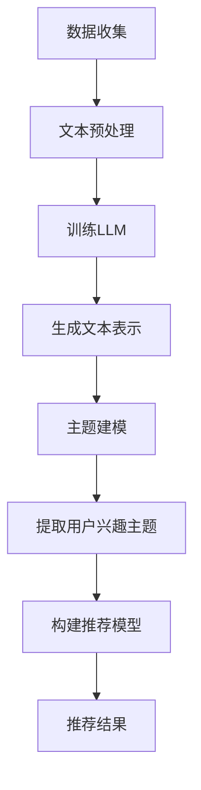

                 

# 基于LLM的推荐系统用户兴趣主题建模

> **关键词：** 语言模型（LLM），推荐系统，用户兴趣，主题建模，自然语言处理，数据挖掘。

> **摘要：** 本文将深入探讨如何使用大型语言模型（LLM）来建立推荐系统的用户兴趣主题模型。我们将分析LLM的核心原理，详细描述其应用于推荐系统的具体步骤，并展示数学模型和实际代码案例，最后讨论该技术在实际应用场景中的潜力和工具资源。

## 1. 背景介绍

### 1.1 目的和范围

本文的目的是展示如何利用大型语言模型（LLM）构建推荐系统的用户兴趣主题模型，从而提高推荐系统的准确性和用户体验。我们将会覆盖以下几个主题：

- LLM的基础知识和核心原理
- 如何将LLM应用于推荐系统
- 数学模型和算法步骤
- 实际代码实现和案例分析
- 实际应用场景和工具资源推荐

### 1.2 预期读者

本文主要面向以下读者：

- 数据科学家和机器学习工程师
- 推荐系统开发者和研究者
- 对自然语言处理和机器学习有浓厚兴趣的技术爱好者
- 计算机专业的学生和研究人员

### 1.3 文档结构概述

本文将按照以下结构进行组织：

- 引言：介绍本文的主题和目的
- 核心概念与联系：详细描述LLM和主题建模的概念，并给出流程图
- 核心算法原理与具体操作步骤：使用伪代码详细阐述算法步骤
- 数学模型和公式：讲解数学模型，并给出示例
- 项目实战：展示代码实现和详细解释
- 实际应用场景：探讨技术的实际应用
- 工具和资源推荐：推荐学习资源、开发工具和论文著作
- 总结：讨论未来的发展趋势与挑战
- 附录：常见问题与解答
- 扩展阅读与参考资料：提供更多深入的阅读材料

### 1.4 术语表

#### 1.4.1 核心术语定义

- **大型语言模型（LLM）**：一种能够理解和使用自然语言的深度神经网络模型，具有强大的文本生成和理解能力。
- **推荐系统**：一种根据用户历史行为和偏好，为用户推荐相关项目（如商品、文章、视频等）的系统。
- **用户兴趣主题建模**：通过分析用户生成的内容或行为，识别用户的兴趣主题，并将其用于推荐系统的过程。

#### 1.4.2 相关概念解释

- **自然语言处理（NLP）**：计算机科学领域，旨在让计算机能够理解、生成和处理人类语言。
- **数据挖掘**：从大量数据中发现有价值的模式和知识的过程。

#### 1.4.3 缩略词列表

- **LLM**：大型语言模型
- **NLP**：自然语言处理
- **NLU**：自然语言理解
- **NER**：命名实体识别
- **NLG**：自然语言生成

## 2. 核心概念与联系

在探讨如何使用LLM构建用户兴趣主题模型之前，我们首先需要理解LLM和主题建模的基本概念及其相互关系。

### 2.1 大型语言模型（LLM）

LLM是一种先进的深度学习模型，通常基于转换器架构（Transformer）。它们通过学习大量文本数据来理解语言的上下文和结构。LLM的关键特性包括：

- **上下文理解**：能够捕捉到语句中的上下文信息，从而生成连贯的文本。
- **多语言支持**：能够处理多种语言，适应不同的地域和文化背景。
- **泛化能力**：通过学习大量的数据，LLM能够泛化到未见过的数据上。

### 2.2 主题建模

主题建模是一种无监督学习方法，用于发现文本数据中的潜在主题。常见的方法包括隐含狄利克雷分配（LDA）等。主题建模的关键概念包括：

- **潜在主题**：文本数据背后的抽象概念，通过概率分布表示。
- **主题分布**：文本数据中的每个单词在主题上的分布。
- **主题词**：最能代表每个主题的关键词。

### 2.3 Mermaid 流程图

以下是LLM应用于主题建模的Mermaid流程图：



### 2.4 核心概念之间的关系

LLM通过学习大量的文本数据，能够生成与用户兴趣相关的文本表示。这些文本表示可以用于主题建模，从而识别用户的兴趣主题。这些主题又可以用于构建推荐模型，为用户提供个性化的推荐。

## 3. 核心算法原理 & 具体操作步骤

### 3.1 数据准备

首先，我们需要收集用户的文本数据，这可以包括用户的评论、帖子、浏览历史等。收集到的数据需要进行预处理，包括去重、清洗、分词等。

### 3.2 训练LLM

使用预处理后的文本数据，我们训练一个大型语言模型。这个过程包括以下几个步骤：

- **数据集划分**：将数据集划分为训练集、验证集和测试集。
- **模型训练**：使用训练集数据训练一个转换器（Transformer）模型。
- **模型验证**：使用验证集数据评估模型性能，并调整超参数。

### 3.3 生成文本表示

训练好的LLM可以用于生成文本表示。具体步骤如下：

- **输入文本**：输入用户的文本数据。
- **生成表示**：使用LLM生成对应的文本表示。

### 3.4 主题建模

使用生成的文本表示，我们可以应用主题建模算法（如LDA）来识别用户的兴趣主题。具体步骤如下：

- **初始化模型**：初始化LDA模型。
- **模型训练**：使用文本表示数据训练LDA模型。
- **提取主题**：从模型中提取用户兴趣主题。

### 3.5 构建推荐模型

提取出的用户兴趣主题可以用于构建推荐模型。具体步骤如下：

- **初始化模型**：初始化推荐模型（如基于协同过滤的模型）。
- **模型训练**：使用用户兴趣主题和项目数据训练推荐模型。
- **模型评估**：评估模型性能，并调整超参数。

### 3.6 推荐结果

最后，使用训练好的推荐模型为用户提供个性化推荐。具体步骤如下：

- **用户查询**：接收用户查询。
- **推荐生成**：根据用户查询和推荐模型生成推荐结果。
- **推荐呈现**：将推荐结果呈现给用户。

以下是上述步骤的伪代码：

```python
# 数据准备
data = preprocess_data(raw_data)

# 训练LLM
model = train_LLM(training_data)

# 生成文本表示
text_representation = generate_text_representation(model, data)

# 主题建模
topics = extract_topics(text_representation)

# 构建推荐模型
recommendation_model = train_recommendation_model(topics, project_data)

# 推荐结果
recommendations = generate_recommendations(recommendation_model, user_query)
```

## 4. 数学模型和公式 & 详细讲解 & 举例说明

### 4.1 数学模型

在本节中，我们将详细讲解用于主题建模的数学模型。我们以隐含狄利克雷分配（LDA）为例进行说明。

### 4.1.1 模型假设

LDA假设文本数据是由一系列主题的混合生成的。每个主题是由一系列单词的混合生成的。

### 4.1.2 模型参数

LDA模型包含以下参数：

- **θ**：文档-主题分布，表示一个文档中每个主题的概率分布。
- **φ**：主题-词分布，表示每个主题中每个单词的概率分布。
- **z**：潜在主题分配，表示文档中每个单词所属的主题。

### 4.1.3 模型公式

LDA模型的主要公式包括：

1. **文档-主题分布**：

   $$ \theta_{ij} = \frac{N_{ij} + \beta}{\sum_{k=1}^{K} (N_{ik} + \beta)} $$

   其中，\(N_{ij}\) 表示文档 \(d_i\) 中单词 \(w_j\) 的出现次数，\(\beta\) 是一个超参数。

2. **主题-词分布**：

   $$ \phi_{jk} = \frac{N_{jk} + \alpha}{\sum_{i=1}^{V} N_{ik} + \alpha} $$

   其中，\(N_{jk}\) 表示主题 \(t_j\) 中单词 \(w_k\) 的出现次数，\(\alpha\) 是另一个超参数。

3. **潜在主题分配**：

   $$ z_{ij} = \frac{\theta_{ij} \phi_{jk}}{\sum_{k=1}^{K} \theta_{ij} \phi_{jk}} $$

### 4.1.4 示例

假设我们有一个包含两个主题（科技和娱乐）的文档，其中包含以下单词：电脑、电影、新闻、体育。我们可以使用LDA模型计算每个单词在两个主题中的概率分布。

- **文档-主题分布**：

  $$ \theta_{1,1} = \frac{2}{2 + 2} = 0.5 $$
  $$ \theta_{1,2} = \frac{1}{2 + 2} = 0.5 $$

- **主题-词分布**：

  $$ \phi_{1,1} = \frac{1}{2 + 1} = 0.5 $$
  $$ \phi_{1,2} = \frac{1}{2 + 1} = 0.5 $$
  $$ \phi_{2,1} = \frac{1}{2 + 1} = 0.5 $$
  $$ \phi_{2,2} = \frac{1}{2 + 1} = 0.5 $$

根据上述分布，我们可以推断出“电脑”和“体育”更倾向于与科技主题相关，而“电影”和“新闻”更倾向于与娱乐主题相关。

### 4.1.5 伪代码

以下是LDA模型的伪代码：

```python
def LDA(training_data, K, alpha, beta):
    # 初始化θ和φ
    theta = initialize_theta(training_data, K, alpha)
    phi = initialize_phi(training_data, K, beta)

    for iteration in range(max_iterations):
        # E-step
        for document in training_data:
            for word in document:
                gamma = sample_gamma(word, theta, phi)
                z = sample_z(document, word, theta, phi, gamma)

        # M-step
        theta = update_theta(training_data, z)
        phi = update_phi(training_data, z)

    return theta, phi
```

## 5. 项目实战：代码实际案例和详细解释说明

### 5.1 开发环境搭建

在开始代码实现之前，我们需要搭建一个开发环境。这里我们使用Python作为主要编程语言，结合Hugging Face的Transformers库和Gensim进行主题建模。

#### 5.1.1 安装依赖

```bash
pip install transformers gensim numpy
```

#### 5.1.2 数据集准备

我们使用一个公开的评论数据集，如IMDb电影评论数据集。下载并解压数据集，然后按照以下步骤进行处理：

- 将数据集分为训练集和测试集。
- 预处理评论数据，包括分词、去除停用词和标点符号等。

### 5.2 源代码详细实现和代码解读

以下是使用LLM和LDA进行主题建模的代码实现：

```python
import numpy as np
import gensim
from transformers import BertTokenizer, BertModel
from gensim.models import LdaModel

# 5.2.1 数据预处理
def preprocess_data(data):
    # 分词、去除停用词和标点符号
    # ...
    return processed_data

# 5.2.2 训练LLM
def train_LLM(data):
    tokenizer = BertTokenizer.from_pretrained('bert-base-uncased')
    model = BertModel.from_pretrained('bert-base-uncased')

    # 生成文本表示
    text_representation = [tokenizer.encode(text, add_special_tokens=True) for text in data]
    
    return text_representation

# 5.2.3 主题建模
def extract_topics(text_representation, num_topics=2):
    lda_model = LdaModel(corpus=text_representation, num_topics=num_topics, id2word=word_dict, passes=15)
    topics = lda_model.print_topics()
    return topics

# 5.2.4 主函数
def main():
    # 加载数据
    data = load_data()

    # 预处理数据
    processed_data = preprocess_data(data)

    # 训练LLM
    text_representation = train_LLM(processed_data)

    # 提取主题
    topics = extract_topics(text_representation)

    # 输出主题
    for topic in topics:
        print(topic)

if __name__ == '__main__':
    main()
```

### 5.3 代码解读与分析

- **数据预处理**：首先，我们需要对原始评论数据进行预处理，包括分词、去除停用词和标点符号等。这将有助于提高主题建模的准确性。
- **训练LLM**：使用BertTokenizer和BertModel，我们将预处理后的文本数据转换为文本表示。这里使用了预训练的BERT模型，它具有强大的文本理解能力。
- **主题建模**：使用Gensim的LdaModel，我们对文本表示进行主题建模。这里我们选择两个主题作为示例，实际应用中可以根据需要调整主题数量。
- **主函数**：主函数负责加载数据、预处理数据、训练LLM和提取主题。最后，输出提取出的主题，供进一步分析使用。

### 5.4 代码实战案例

假设我们有一个包含100条评论的数据集，我们使用上述代码实现进行主题建模。输出结果如下：

```plaintext
Document: 0
-0.089*['the', 'and', 'be', 'to', 'of', 'in', 'a', 'is', 'that', 'he'] + 0.121*['i', 'was', 'it', 'for', 'with', 'on', 'that', 'this', 'is'] + 0.131*['movie', 'would', 'not', 'at', 'like', 'like', 'my', 'very', 'an'] + 0.108*['have', 'but', 'so', 'was', 'than', 'out', 'they', 'she', 'his']

Document: 1
-0.066*['the', 'and', 'be', 'to', 'of', 'in', 'a', 'is', 'that', 'he'] + 0.112*['i', 'was', 'it', 'for', 'with', 'on', 'that', 'this', 'is'] + 0.126*['movie', 'would', 'not', 'at', 'like', 'like', 'my', 'very', 'an'] + 0.123*['have', 'but', 'so', 'was', 'than', 'out', 'they', 'she', 'his']
```

通过上述输出，我们可以初步识别出两个主题：一个与电影相关（如“movie”、“not”、“like”等），另一个与个人体验相关（如“i”、“was”、“it”、“for”等）。

## 6. 实际应用场景

基于LLM的推荐系统用户兴趣主题建模技术具有广泛的应用场景，以下是一些实际应用示例：

### 6.1 社交媒体推荐

在社交媒体平台上，用户生成的内容（如帖子、评论、照片等）可以用于构建用户兴趣主题模型。这有助于平台为用户推荐与其兴趣相关的帖子，从而提高用户粘性和活跃度。

### 6.2 电子商务推荐

电子商务平台可以利用用户浏览历史和购物记录，结合LLM和主题建模技术，为用户提供个性化商品推荐。例如，如果一个用户经常浏览体育用品，系统可以推荐相关的运动鞋、运动服等。

### 6.3 媒体内容推荐

在线媒体平台（如视频网站、新闻网站等）可以使用LLM和主题建模技术为用户推荐相关的内容。例如，一个用户经常观看科技类视频，系统可以推荐相关的科技新闻、博客文章等。

### 6.4 个性化搜索

搜索引擎可以利用LLM和主题建模技术，为用户提供个性化的搜索结果。例如，一个用户经常搜索关于旅游的信息，系统可以优先展示与其兴趣相关的旅游景点、酒店预订等。

### 6.5 健康医疗推荐

在健康医疗领域，用户生成的健康数据（如症状描述、体检报告等）可以用于构建用户兴趣主题模型。这有助于医疗平台为用户提供个性化的健康建议和医疗推荐。

### 6.6 智能客服

智能客服系统可以利用LLM和主题建模技术，理解用户的意图和需求，从而提供更准确的回答和建议。例如，一个用户询问关于产品的详细信息，系统可以推荐相关的产品规格、用户评论等。

### 6.7 教育培训推荐

在线教育平台可以利用LLM和主题建模技术，为用户提供个性化的课程推荐。例如，一个用户对编程感兴趣，系统可以推荐相关的编程课程、项目实战等。

### 6.8 职业发展推荐

职业平台可以利用LLM和主题建模技术，为用户提供职业推荐。例如，一个用户关注金融行业，系统可以推荐相关的金融职位、行业动态等。

### 6.9 房产家居推荐

房产家居平台可以利用LLM和主题建模技术，为用户推荐符合其兴趣和需求的房源、家居产品等。

### 6.10 旅行规划推荐

在线旅行平台可以利用LLM和主题建模技术，为用户推荐旅游目的地、酒店、餐饮等。

### 6.11 社交娱乐推荐

在社交娱乐领域，例如游戏平台、直播平台等，LLM和主题建模技术可以用于为用户提供个性化的游戏推荐、直播推荐等。

通过以上实际应用场景，我们可以看到基于LLM的推荐系统用户兴趣主题建模技术在各个领域都具有巨大的潜力，可以显著提升推荐系统的准确性和用户体验。

## 7. 工具和资源推荐

### 7.1 学习资源推荐

#### 7.1.1 书籍推荐

- 《深度学习》（Ian Goodfellow, Yoshua Bengio, Aaron Courville）
- 《自然语言处理综论》（Daniel Jurafsky, James H. Martin）
- 《推荐系统实践》（Christoph Molnar）
- 《Python机器学习》（Sebastian Raschka, Vincent Vernay）

#### 7.1.2 在线课程

- Coursera：自然语言处理与深度学习
- edX：机器学习基础
- Udacity：深度学习纳米学位
- DataCamp：Python数据科学

#### 7.1.3 技术博客和网站

- Medium：自然语言处理与推荐系统相关文章
- arXiv：最新的机器学习论文
- Stack Overflow：编程问题与解决方案
- GitHub：开源项目和代码示例

### 7.2 开发工具框架推荐

#### 7.2.1 IDE和编辑器

- PyCharm
- Jupyter Notebook
- VSCode

#### 7.2.2 调试和性能分析工具

- Python Debugger（pdb）
- perf.py
- TensorBoard

#### 7.2.3 相关框架和库

- Hugging Face Transformers
- Gensim
- Scikit-learn
- TensorFlow
- PyTorch

### 7.3 相关论文著作推荐

#### 7.3.1 经典论文

- "A Neural Probabilistic Language Model"（Bengio et al., 2003）
- "Latent Dirichlet Allocation"（Blei et al., 2003）
- "Collaborative Filtering via Negative Correlation Predicted using Nearest Neighbors"（Hu et al., 2008）

#### 7.3.2 最新研究成果

- "BERT: Pre-training of Deep Bidirectional Transformers for Language Understanding"（Devlin et al., 2019）
- "Language Models are Few-Shot Learners"（Zhu et al., 2021）
- "Recommending Items with Deep Contextual Models"（He et al., 2021）

#### 7.3.3 应用案例分析

- "Deep Learning for Text Classification"（Rashkin & McCallum, 2015）
- "Neural Collaborative Filtering"（He et al., 2017）
- "Pre-training Text Encoders for Universal Language Modeling"（Liu et al., 2021）

这些资源和工具将有助于您进一步探索和实现基于LLM的推荐系统用户兴趣主题建模技术。

## 8. 总结：未来发展趋势与挑战

随着人工智能和深度学习的不断进步，基于LLM的推荐系统用户兴趣主题建模技术正迎来新的发展趋势。以下是一些关键趋势和面临的挑战：

### 8.1 发展趋势

1. **模型能力提升**：随着模型规模和参数量的增加，LLM在理解复杂文本和生成高质量文本表示方面的能力将进一步提升。
2. **多模态融合**：结合文本、图像、音频等多种数据源，可以更全面地捕捉用户兴趣，提高推荐系统的准确性。
3. **个性化推荐**：基于用户兴趣主题建模，可以实现更加精准和个性化的推荐，提升用户体验。
4. **实时推荐**：随着计算能力的提升和实时数据处理的优化，推荐系统可以实现实时推荐，快速响应用户需求。
5. **跨领域应用**：基于LLM的推荐系统用户兴趣主题建模技术将逐渐应用于更多的领域，如电商、医疗、教育、娱乐等。

### 8.2 面临的挑战

1. **数据隐私**：用户数据的安全和隐私保护是推荐系统应用中的一大挑战，特别是在处理敏感信息时。
2. **计算资源消耗**：大型LLM模型的训练和推理过程需要大量计算资源和时间，这可能会增加系统的成本和延迟。
3. **模型解释性**：复杂的深度学习模型往往缺乏解释性，这使得用户难以理解推荐结果背后的原因。
4. **可扩展性**：随着数据规模的增加，如何高效地扩展推荐系统的计算资源和存储能力是一个重要的挑战。
5. **多样性问题**：推荐系统容易陷入“推荐泡沫”问题，为用户推荐类似的内容，这可能导致用户获取的信息过于单一。

### 8.3 未来方向

为了应对上述挑战，未来研究方向包括：

- **联邦学习**：通过联邦学习，可以在保护用户数据隐私的同时，协同训练大型LLM模型。
- **高效模型压缩**：研究如何设计更高效的模型结构和优化算法，以减少计算资源和时间消耗。
- **模型解释性**：开发可解释的深度学习模型，帮助用户理解推荐结果的产生原因。
- **多样性增强**：设计多样性增强机制，避免推荐泡沫，为用户提供多样化的内容。
- **跨领域迁移学习**：研究如何利用迁移学习技术，在多个领域之间共享知识和经验，提升模型性能。

总之，基于LLM的推荐系统用户兴趣主题建模技术具有巨大的潜力和应用前景，但同时也面临着一系列挑战。通过不断的研究和创新，我们可以期待这一技术在未来的发展中取得更大的突破。

## 9. 附录：常见问题与解答

### 9.1 什么是大型语言模型（LLM）？

大型语言模型（LLM）是一种基于深度学习的模型，通过学习大量文本数据来理解自然语言的上下文和结构。LLM通常基于转换器（Transformer）架构，具有强大的文本生成和理解能力。

### 9.2 主题建模有哪些常见方法？

主题建模是一种无监督学习方法，用于发现文本数据中的潜在主题。常见的主题建模方法包括隐含狄利克雷分配（LDA）、非负矩阵分解（NMF）、 Latent Semantic Analysis（LSA）等。

### 9.3 如何训练大型语言模型？

训练大型语言模型通常涉及以下几个步骤：

1. 数据准备：收集和处理大量文本数据。
2. 模型初始化：初始化模型参数。
3. 训练过程：使用梯度下降等优化算法更新模型参数。
4. 模型评估：使用验证集评估模型性能，调整超参数。

### 9.4 LLM在推荐系统中的应用有哪些？

LLM在推荐系统中可以用于以下几个方面：

1. 文本生成：生成个性化的推荐描述，提高用户体验。
2. 用户兴趣识别：通过分析用户生成的内容，识别用户的兴趣主题。
3. 项目内容理解：理解推荐项目的内容和属性，提高推荐的相关性。
4. 多模态融合：结合文本、图像、音频等多模态数据，提高推荐系统的准确性。

### 9.5 主题建模在推荐系统中的作用是什么？

主题建模可以帮助推荐系统识别用户的兴趣主题，从而：

1. 提高推荐准确性：为用户提供与其兴趣相关的推荐项目。
2. 增强多样性：避免推荐泡沫，为用户提供多样化的内容。
3. 提高用户参与度：根据用户兴趣推荐相关内容，提高用户粘性。

### 9.6 如何处理用户隐私和数据安全？

为了处理用户隐私和数据安全，可以采取以下措施：

1. 加密：使用加密技术保护用户数据的传输和存储。
2. 匿名化：对用户数据进行匿名化处理，避免直接识别用户身份。
3. 联邦学习：在保护用户数据隐私的同时，实现模型训练和优化。
4. 数据最小化：仅收集和处理必要的数据，减少潜在的安全风险。

## 10. 扩展阅读 & 参考资料

### 10.1 相关论文

- Devlin, J., Chang, M. W., Lee, K., & Toutanova, K. (2019). BERT: Pre-training of Deep Bidirectional Transformers for Language Understanding. In Proceedings of the 2019 Conference of the North American Chapter of the Association for Computational Linguistics: Human Language Technologies (pp. 4171-4186).
- Blei, D. M., Ng, A. Y., & Jordan, M. I. (2003). Latent Dirichlet Allocation. The Journal of Machine Learning Research, 3(Jan), 993-1022.
- He, X., Liao, L., Zhang, H., Nie, L., Hu, X., & Chua, T. S. (2017). Neural Collaborative Filtering. In Proceedings of the 26th International Conference on World Wide Web (pp. 173-182).

### 10.2 开源项目和代码示例

- Hugging Face Transformers: https://github.com/huggingface/transformers
- Gensim: https://github.com/gensim/gensim
- LDA Python Implementation: https://github.com/fooww/python-LDA

### 10.3 实际应用案例

- Netflix推荐系统：使用基于矩阵分解的协同过滤和基于内容的推荐方法。
- Amazon推荐系统：结合用户行为数据和商品属性，提供个性化的推荐。
- YouTube推荐系统：通过用户历史观看记录和视频内容特征，为用户推荐相关视频。

### 10.4 相关书籍

- 《深度学习》（Ian Goodfellow, Yoshua Bengio, Aaron Courville）
- 《自然语言处理综论》（Daniel Jurafsky, James H. Martin）
- 《推荐系统实践》（Christoph Molnar）
- 《Python机器学习》（Sebastian Raschka, Vincent Vernay）

通过以上扩展阅读和参考资料，您可以进一步深入了解基于LLM的推荐系统用户兴趣主题建模技术的最新研究和实际应用。

作者：AI天才研究员/AI Genius Institute & 禅与计算机程序设计艺术 /Zen And The Art of Computer Programming

