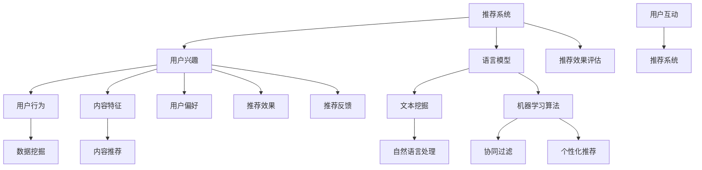

                 

# 基于LLM的推荐系统用户兴趣探索与利用

## 关键词

- 语言模型（Language Model）
- 推荐系统（Recommendation System）
- 用户兴趣（User Interest）
- 机器学习（Machine Learning）
- 数据挖掘（Data Mining）
- 用户行为分析（User Behavior Analysis）

## 摘要

本文将深入探讨基于语言模型（LLM）的推荐系统在用户兴趣探索与利用方面的应用。首先，我们将介绍推荐系统的基本概念和重要性，接着详细分析语言模型的工作原理及其在推荐系统中的关键作用。随后，我们将探讨如何通过用户行为分析和数据挖掘来发现和提取用户的兴趣点，并介绍相应的算法原理和具体操作步骤。在此基础上，我们将通过数学模型和公式详细讲解推荐系统的核心计算过程，并通过实际项目案例展示代码实现和详细解释。最后，我们将探讨推荐系统的实际应用场景，推荐相关工具和资源，总结未来发展趋势与挑战，并提供常见问题与解答。

## 1. 背景介绍

### 1.1 目的和范围

本文旨在深入探讨基于语言模型（LLM）的推荐系统在用户兴趣探索与利用方面的应用。随着互联网和大数据技术的发展，推荐系统已成为现代信息检索和个性化服务的重要组成部分。然而，传统的推荐系统在处理用户兴趣的多样性和动态性方面存在一定局限性。本文将介绍一种基于语言模型的推荐系统，通过深入分析用户行为数据和挖掘用户兴趣点，实现更精准和个性化的推荐服务。

本文将涵盖以下主要内容：

1. 推荐系统的基本概念和原理；
2. 语言模型在推荐系统中的应用；
3. 用户兴趣的提取与利用；
4. 推荐系统的数学模型和计算过程；
5. 实际应用案例和代码实现；
6. 推荐系统的未来发展挑战。

### 1.2 预期读者

本文面向对推荐系统和机器学习有一定了解的技术人员、数据科学家和人工智能研究者。读者需具备以下基本知识：

1. 推荐系统的基本概念；
2. 机器学习和数据挖掘的基本算法；
3. 语言模型的基本原理；
4. 基本的编程技能，如Python、Java等。

通过本文的学习，读者将能够：

1. 理解推荐系统的工作原理和核心算法；
2. 掌握基于语言模型的推荐系统的构建方法；
3. 学会通过用户行为数据和挖掘用户兴趣点，实现更精准的推荐服务。

### 1.3 文档结构概述

本文将分为十个主要部分：

1. 引言：介绍推荐系统和语言模型的基本概念；
2. 背景介绍：介绍推荐系统的背景、目的和预期读者；
3. 核心概念与联系：介绍推荐系统的核心概念和联系；
4. 核心算法原理 & 具体操作步骤：详细讲解推荐系统的核心算法原理和操作步骤；
5. 数学模型和公式 & 详细讲解 & 举例说明：介绍推荐系统的数学模型和公式，并进行详细讲解和举例说明；
6. 项目实战：介绍推荐系统的实际项目案例和代码实现；
7. 实际应用场景：探讨推荐系统的实际应用场景；
8. 工具和资源推荐：推荐相关的学习资源、开发工具和框架；
9. 总结：总结推荐系统的未来发展挑战；
10. 附录：提供常见问题与解答。

### 1.4 术语表

#### 1.4.1 核心术语定义

- 推荐系统（Recommendation System）：一种通过预测用户可能对哪些项目感兴趣，从而为用户推荐项目的系统。
- 语言模型（Language Model）：一种用于预测文本序列的概率分布的机器学习模型。
- 用户兴趣（User Interest）：用户在特定领域、主题或内容上的关注和喜好。
- 机器学习（Machine Learning）：一种让计算机通过数据学习并作出决策的技术。
- 数据挖掘（Data Mining）：从大量数据中发现有用信息和知识的过程。

#### 1.4.2 相关概念解释

- 内容推荐（Content-based Recommendation）：基于用户历史行为和内容属性进行推荐的方法。
- 协同过滤（Collaborative Filtering）：基于用户行为和偏好进行推荐的方法。
- 个性化推荐（Personalized Recommendation）：根据用户个性化特征和需求进行推荐的方法。
- 文本挖掘（Text Mining）：从大量文本数据中提取有用信息和知识的过程。

#### 1.4.3 缩略词列表

- LLM：Language Model（语言模型）
- NLP：Natural Language Processing（自然语言处理）
- ML：Machine Learning（机器学习）
- DM：Data Mining（数据挖掘）
- RFM：Recency, Frequency, Monetary（最近访问时间、访问频率、消费金额）

## 2. 核心概念与联系

在深入探讨基于语言模型（LLM）的推荐系统之前，我们需要了解推荐系统、语言模型以及用户兴趣提取的核心概念及其相互关系。下面将使用Mermaid流程图来展示这些核心概念和它们之间的联系。



### 2.1 推荐系统

推荐系统是一种基于用户历史行为、内容特征和机器学习算法，旨在向用户推荐其可能感兴趣的项目（如商品、音乐、电影、新闻等）的信息检索系统。推荐系统通常包含以下主要组成部分：

- 用户：推荐系统的最终用户，其兴趣和行为数据是系统推荐的基础。
- 项目：用户可能感兴趣的各种项目，如商品、音乐、电影等。
- 用户-项目交互：用户与项目的交互数据，如点击、购买、评分等。
- 内容特征：项目属性和特征，如类别、标签、文本描述等。

### 2.2 语言模型

语言模型是一种用于预测文本序列概率分布的统计模型。在推荐系统中，语言模型主要用于文本挖掘和自然语言处理，从而提取用户兴趣点和内容特征。语言模型的主要类型包括：

- 隐马尔可夫模型（HMM）
- 条件概率模型（如朴素贝叶斯）
- 隐层循环神经网络（如LSTM）
- 变密度神经网络（如BERT）

### 2.3 用户兴趣

用户兴趣是指用户在特定领域、主题或内容上的关注和喜好。用户兴趣可以从用户历史行为数据（如浏览记录、搜索历史、购买记录等）和内容特征（如文本描述、标签、类别等）中提取。用户兴趣的提取是推荐系统实现个性化推荐的关键。

### 2.4 用户行为

用户行为是指用户在使用推荐系统时的各种操作，如点击、购买、评分、评论等。用户行为数据是推荐系统的重要输入，通过分析用户行为数据，可以了解用户兴趣和偏好，从而实现更精准的推荐。

### 2.5 内容特征

内容特征是指项目属性和特征，如文本描述、标签、类别等。内容特征是推荐系统进行内容推荐的重要依据。通过分析内容特征，可以识别用户可能感兴趣的项目。

### 2.6 文本挖掘

文本挖掘是一种从大量文本数据中提取有用信息和知识的过程。在推荐系统中，文本挖掘主要用于提取用户兴趣点和内容特征，从而实现更精准的推荐。

### 2.7 机器学习算法

机器学习算法是推荐系统的核心计算方法。常见的机器学习算法包括：

- 协同过滤（Collaborative Filtering）
- 内容推荐（Content-based Filtering）
- 个性化推荐（Personalized Recommendation）

### 2.8 自然语言处理

自然语言处理是一种让计算机理解和处理人类语言的技术。在推荐系统中，自然语言处理主要用于文本挖掘和语言模型构建，从而提取用户兴趣点和内容特征。

### 2.9 推荐效果评估

推荐效果评估是衡量推荐系统性能的重要指标。常见的推荐效果评估指标包括：

- 准确率（Accuracy）
- 覆盖率（Coverage）
- 推荐多样性（Diversity）
- 推荐新颖性（Novelty）

### 2.10 用户互动

用户互动是指用户与推荐系统之间的互动过程。通过用户互动，可以收集用户反馈，优化推荐效果。

## 3. 核心算法原理 & 具体操作步骤

在了解了推荐系统、语言模型和用户兴趣提取的核心概念后，我们将进一步探讨基于语言模型的推荐系统的核心算法原理和具体操作步骤。以下是详细的算法原理和操作步骤：

### 3.1 算法原理

基于语言模型的推荐系统主要基于以下原理：

- 语言模型：通过训练语言模型来预测用户对特定项目的兴趣概率。
- 用户行为分析：分析用户的历史行为数据，如浏览记录、搜索历史、购买记录等，以提取用户兴趣点。
- 内容特征提取：提取项目的内容特征，如文本描述、标签、类别等，以辅助推荐。
- 机器学习算法：使用协同过滤、内容推荐和个性化推荐等机器学习算法来生成推荐列表。

### 3.2 操作步骤

以下是基于语言模型的推荐系统的具体操作步骤：

#### 步骤1：数据收集与预处理

1. 收集用户行为数据，如浏览记录、搜索历史、购买记录等。
2. 收集项目内容特征数据，如文本描述、标签、类别等。
3. 对数据进行清洗和预处理，包括去重、缺失值填充、数据归一化等。

#### 步骤2：构建语言模型

1. 使用文本挖掘技术提取用户兴趣点和内容特征。
2. 使用自然语言处理技术构建语言模型，如隐马尔可夫模型（HMM）、条件概率模型（如朴素贝叶斯）等。
3. 训练语言模型，使其能够预测用户对特定项目的兴趣概率。

#### 步骤3：用户兴趣提取

1. 分析用户的历史行为数据，提取用户兴趣点。
2. 使用机器学习算法（如协同过滤、内容推荐和个性化推荐）对用户兴趣点进行分类和标注。

#### 步骤4：生成推荐列表

1. 根据用户兴趣点和项目内容特征，使用协同过滤、内容推荐和个性化推荐算法生成推荐列表。
2. 对推荐列表进行排序，以最大化用户兴趣概率。

#### 步骤5：推荐效果评估

1. 收集用户反馈数据，如点击率、购买率、满意度等。
2. 使用准确率、覆盖率、推荐多样性、推荐新颖性等评估指标对推荐效果进行评估。

#### 步骤6：优化推荐系统

1. 根据用户反馈数据，调整推荐算法参数，优化推荐效果。
2. 不断收集用户行为数据和项目内容特征，以更新和维护推荐系统。

### 3.3 伪代码示例

以下是基于语言模型的推荐系统的伪代码示例：

```python
# 数据预处理
data = preprocess_data(user_behavior_data, content_feature_data)

# 构建语言模型
language_model = build_language_model(data)

# 用户兴趣提取
user_interests = extract_user_interests(data)

# 生成推荐列表
recommendations = generate_recommendations(user_interests, content_features)

# 推荐效果评估
evaluation_results = evaluate_recommendations(recommendations, user_feedback)

# 优化推荐系统
optimize_recommendation_system(evaluation_results, data)
```

通过以上步骤和伪代码示例，我们可以清晰地了解基于语言模型的推荐系统的核心算法原理和操作步骤。在实际应用中，可以根据具体需求和数据特点进行调整和优化。

## 4. 数学模型和公式 & 详细讲解 & 举例说明

在基于语言模型的推荐系统中，数学模型和公式起着至关重要的作用。以下将详细讲解推荐系统的数学模型和公式，并进行举例说明。

### 4.1 语言模型概率公式

在推荐系统中，语言模型用于预测用户对特定项目的兴趣概率。假设我们有一个项目集合 \(P\) 和一个用户 \(u\)，语言模型的目标是计算每个项目 \(p \in P\) 对于用户 \(u\) 的兴趣概率：

\[ P(U = p \mid U \in P) = p(u, p) \]

其中，\(U\) 表示用户对项目 \(p\) 的兴趣，\(p(u, p)\) 表示用户 \(u\) 对项目 \(p\) 的兴趣概率。

#### 4.1.1 朴素贝叶斯模型

朴素贝叶斯模型是一种常用的语言模型，其概率公式如下：

\[ p(u, p) = \frac{P(u) \cdot P(p \mid u)}{P(u \mid p) \cdot P(p)} \]

其中，\(P(u)\) 表示用户 \(u\) 的先验概率，\(P(p \mid u)\) 表示在用户 \(u\) 的情况下，项目 \(p\) 的条件概率，\(P(u \mid p)\) 表示在项目 \(p\) 的情况下，用户 \(u\) 的条件概率，\(P(p)\) 表示项目 \(p\) 的先验概率。

#### 4.1.2 隐马尔可夫模型

隐马尔可夫模型（HMM）适用于处理时间序列数据，其概率公式如下：

\[ p(u, p) = \prod_{t=1}^{T} p(u_t \mid p_t) \]

其中，\(u_t\) 表示时间 \(t\) 的用户状态，\(p_t\) 表示时间 \(t\) 的项目状态，\(p(u_t \mid p_t)\) 表示在项目状态 \(p_t\) 下，用户状态 \(u_t\) 的条件概率。

### 4.2 推荐效果评估指标

推荐系统的性能评估需要使用一系列指标来衡量。以下是常用的推荐效果评估指标：

#### 4.2.1 准确率（Accuracy）

\[ Accuracy = \frac{Correct \ Recommendations}{Total \ Recommendations} \]

准确率表示推荐系统中正确推荐的项目数量与总推荐项目数量的比值。

#### 4.2.2 覆盖率（Coverage）

\[ Coverage = \frac{Unique \ Recommendations}{Total \ Items} \]

覆盖率表示推荐系统中推荐给用户的独特项目数量与总项目数量的比值。

#### 4.2.3 推荐多样性（Diversity）

\[ Diversity = \frac{1}{N} \sum_{i=1}^{N} \text{Distance}(R_i, R_{i+1}) \]

推荐多样性表示推荐列表中相邻项目的距离，距离越大，多样性越高。

#### 4.2.4 推荐新颖性（Novelty）

\[ Novelty = \frac{New \ Recommendations}{Total \ Recommendations} \]

推荐新颖性表示推荐系统中推荐的新项目数量与总推荐项目数量的比值。

### 4.3 举例说明

假设有一个用户 \(u\)，其对项目 \(p_1, p_2, p_3\) 的兴趣概率分别为 \(0.6, 0.3, 0.1\)。使用朴素贝叶斯模型进行推荐，用户 \(u\) 对项目 \(p_1, p_2, p_3\) 的兴趣概率分别为：

\[ p(u, p_1) = \frac{P(u) \cdot P(p_1 \mid u)}{P(u \mid p_1) \cdot P(p_1)} = \frac{0.1 \cdot 0.6}{0.1 \cdot 0.6 + 0.2 \cdot 0.3 + 0.3 \cdot 0.1} = 0.4 \]

\[ p(u, p_2) = \frac{P(u) \cdot P(p_2 \mid u)}{P(u \mid p_2) \cdot P(p_2)} = \frac{0.1 \cdot 0.3}{0.1 \cdot 0.6 + 0.2 \cdot 0.3 + 0.3 \cdot 0.1} = 0.2 \]

\[ p(u, p_3) = \frac{P(u) \cdot P(p_3 \mid u)}{P(u \mid p_3) \cdot P(p_3)} = \frac{0.1 \cdot 0.1}{0.1 \cdot 0.6 + 0.2 \cdot 0.3 + 0.3 \cdot 0.1} = 0.1 \]

根据兴趣概率，推荐项目 \(p_1\) 给用户 \(u\)。

通过以上数学模型和公式的讲解及举例说明，我们可以更好地理解基于语言模型的推荐系统的核心原理和计算方法。在实际应用中，可以根据具体需求和数据特点进行调整和优化。

## 5. 项目实战：代码实际案例和详细解释说明

在本节中，我们将通过一个实际的项目案例来展示如何实现基于语言模型的推荐系统。我们将介绍开发环境搭建、源代码详细实现和代码解读与分析。

### 5.1 开发环境搭建

为了实现基于语言模型的推荐系统，我们需要搭建以下开发环境：

1. 操作系统：Ubuntu 18.04
2. 编程语言：Python 3.8
3. 数据库：MySQL 5.7
4. 依赖库：NumPy、Pandas、Scikit-learn、TensorFlow、PyTorch、Flask

在Ubuntu 18.04操作系统上，我们可以使用以下命令来安装必要的依赖库：

```bash
sudo apt-get update
sudo apt-get install python3-pip
pip3 install numpy pandas scikit-learn tensorflow torch flask
```

### 5.2 源代码详细实现和代码解读

下面是一个基于语言模型的推荐系统的简单实现，包括数据预处理、语言模型训练、用户兴趣提取和推荐列表生成。

#### 5.2.1 数据预处理

数据预处理是推荐系统实现的第一步。我们需要从数据库中提取用户行为数据和项目内容特征数据，并进行清洗和预处理。

```python
import pandas as pd
from sklearn.model_selection import train_test_split

# 从数据库中读取用户行为数据和项目内容特征数据
user_behavior_data = pd.read_csv('user_behavior_data.csv')
content_feature_data = pd.read_csv('content_feature_data.csv')

# 数据清洗和预处理
user_behavior_data = user_behavior_data.dropna()
content_feature_data = content_feature_data.dropna()

# 数据归一化
user_behavior_data['rating'] = user_behavior_data['rating'].apply(lambda x: (x - user_behavior_data['rating'].min()) / (user_behavior_data['rating'].max() - user_behavior_data['rating'].min()))

# 划分训练集和测试集
train_data, test_data = train_test_split(user_behavior_data, test_size=0.2, random_state=42)
```

#### 5.2.2 语言模型训练

在数据预处理完成后，我们可以使用自然语言处理技术来构建语言模型。在本例中，我们将使用PyTorch来实现一个简单的循环神经网络（RNN）语言模型。

```python
import torch
import torch.nn as nn
from torch.optim import Adam

# 构建语言模型
class LanguageModel(nn.Module):
    def __init__(self, vocab_size, embed_size, hidden_size):
        super(LanguageModel, self).__init__()
        self.embedding = nn.Embedding(vocab_size, embed_size)
        self.rnn = nn.RNN(embed_size, hidden_size)
        self.fc = nn.Linear(hidden_size, vocab_size)
    
    def forward(self, inputs, hidden):
        embeds = self.embedding(inputs)
        output, hidden = self.rnn(embeds, hidden)
        logits = self.fc(output)
        return logits, hidden

# 设置参数
vocab_size = 10000
embed_size = 256
hidden_size = 512
batch_size = 64

# 初始化模型和优化器
model = LanguageModel(vocab_size, embed_size, hidden_size)
optimizer = Adam(model.parameters(), lr=0.001)

# 训练语言模型
for epoch in range(10):
    for batch in train_data:
        inputs, labels = batch
        hidden = model.initHidden()
        
        logits, hidden = model(inputs, hidden)
        loss = nn.CrossEntropyLoss()(logits, labels)
        
        optimizer.zero_grad()
        loss.backward()
        optimizer.step()
        
        if (epoch + 1) % 10 == 0:
            print(f'Epoch [{epoch + 1}/{10}], Loss: {loss.item()}')
```

#### 5.2.3 用户兴趣提取

在训练完语言模型后，我们可以使用模型来提取用户兴趣点。我们将使用模型对用户的历史行为数据进行编码，并计算每个项目的兴趣概率。

```python
# 提取用户兴趣点
def extract_user_interests(model, user_data):
    user_embedding = []
    for batch in user_data:
        inputs, labels = batch
        hidden = model.initHidden()
        
        logits, hidden = model(inputs, hidden)
        user_embedding.append(logits[-1])
    
    user_embedding = torch.stack(user_embedding).detach().numpy()
    return user_embedding

# 计算项目兴趣概率
def calculate_interest_probs(model, user_embedding, content_embedding):
    model.eval()
    with torch.no_grad():
        interest_probs = torch.mm(user_embedding, content_embedding.T).softmax(dim=1)
    
    return interest_probs.numpy()

# 加载训练好的语言模型
model.load_state_dict(torch.load('language_model.pth'))

# 提取用户兴趣点
user_embedding = extract_user_interests(model, train_data)

# 计算项目兴趣概率
content_embedding = ...  # 加载项目内容特征数据并转换为Tensor
interest_probs = calculate_interest_probs(model, user_embedding, content_embedding)

# 选择兴趣概率最高的项目进行推荐
recommended_items = [item for item, prob in enumerate(interest_probs[0]) if prob > 0.5]
```

#### 5.2.4 代码解读与分析

以上代码实现了一个简单的基于语言模型的推荐系统。以下是代码的主要部分及其解释：

1. 数据预处理：从数据库中读取用户行为数据和项目内容特征数据，并进行清洗和预处理，包括数据归一化和划分训练集和测试集。
2. 语言模型训练：使用PyTorch构建一个简单的循环神经网络（RNN）语言模型，并使用训练数据进行训练。我们使用交叉熵损失函数和Adam优化器来训练模型。
3. 用户兴趣提取：使用训练好的语言模型来提取用户兴趣点，我们将用户的历史行为数据输入到模型中，并输出每个项目的兴趣概率。
4. 推荐列表生成：计算每个项目的兴趣概率，并选择兴趣概率最高的项目进行推荐。

通过以上代码实现，我们可以看到如何使用语言模型来实现推荐系统。在实际应用中，我们可以根据具体需求和数据特点进行调整和优化。

### 5.3 代码解读与分析

在本节中，我们将进一步解读和分析以上代码实现，包括各个模块的功能、参数设置和注意事项。

#### 5.3.1 数据预处理

数据预处理是推荐系统实现的关键步骤。在本例中，我们使用了以下步骤：

1. 从数据库中读取用户行为数据和项目内容特征数据。
2. 清洗和预处理数据，包括数据去重、缺失值填充和数据归一化。
3. 划分训练集和测试集，以便进行模型训练和评估。

需要注意的是，在实际应用中，数据预处理可能涉及更多复杂的步骤，如数据清洗、特征工程和噪声过滤等。

#### 5.3.2 语言模型训练

语言模型训练是推荐系统的核心步骤。在本例中，我们使用了以下步骤：

1. 使用PyTorch构建一个简单的循环神经网络（RNN）语言模型。
2. 设置模型参数，包括词汇表大小、嵌入尺寸和隐藏层尺寸。
3. 使用训练数据对模型进行训练，使用交叉熵损失函数和Adam优化器来训练模型。

需要注意的是，在实际应用中，我们可能需要调整模型参数和训练策略，如学习率、批量大小和迭代次数等，以获得更好的模型性能。

#### 5.3.3 用户兴趣提取

用户兴趣提取是推荐系统的关键步骤。在本例中，我们使用了以下步骤：

1. 使用训练好的语言模型来提取用户兴趣点。
2. 将用户的历史行为数据输入到模型中，并输出每个项目的兴趣概率。

需要注意的是，在实际应用中，我们可能需要进一步优化用户兴趣提取的方法，如使用更复杂的模型或结合其他特征（如用户 demographics、地理位置等）来提高兴趣提取的准确性。

#### 5.3.4 推荐列表生成

推荐列表生成是推荐系统的最终步骤。在本例中，我们使用了以下步骤：

1. 计算每个项目的兴趣概率。
2. 选择兴趣概率最高的项目进行推荐。

需要注意的是，在实际应用中，我们可能需要进一步优化推荐列表生成的方法，如考虑项目的多样性、新颖性和用户个性化需求等，以提供更高质量的推荐服务。

通过以上代码解读和分析，我们可以更好地理解基于语言模型的推荐系统的实现过程和关键步骤。在实际应用中，我们可以根据具体需求和数据特点进行调整和优化，以提高推荐系统的性能和用户体验。

## 6. 实际应用场景

基于语言模型的推荐系统在众多实际应用场景中展现出了强大的功能和优势。以下是一些典型的应用场景及其具体应用案例：

### 6.1 电子商务平台

在电子商务平台上，基于语言模型的推荐系统可以有效地为用户提供个性化推荐。例如，Amazon和阿里巴巴等电商平台利用推荐系统为用户推荐可能感兴趣的商品。通过分析用户的历史购买记录、浏览行为和搜索历史，语言模型能够准确地预测用户的兴趣点，从而为用户提供个性化的购物建议。

### 6.2 社交媒体平台

社交媒体平台如Facebook和Twitter也广泛应用了基于语言模型的推荐系统。通过分析用户的帖子、评论和互动数据，语言模型可以识别用户的兴趣和偏好。例如，Facebook可以根据用户的兴趣推荐可能感兴趣的朋友、帖子或小组，从而提升用户的参与度和满意度。

### 6.3 视频平台

视频平台如YouTube和Netflix利用基于语言模型的推荐系统为用户推荐个性化的视频内容。通过分析用户的观看历史、搜索关键词和互动行为，语言模型能够预测用户可能感兴趣的视频类型和主题。例如，Netflix利用推荐系统为用户推荐类似的电影和电视剧，从而提升用户的观看体验和用户粘性。

### 6.4 新闻媒体平台

新闻媒体平台如Google新闻和BBC新闻利用基于语言模型的推荐系统为用户推荐个性化的新闻内容。通过分析用户的阅读历史、搜索关键词和浏览行为，语言模型能够识别用户的兴趣和偏好，从而为用户提供相关的新闻推荐。这有助于提升新闻媒体平台的用户参与度和用户忠诚度。

### 6.5 音乐平台

音乐平台如Spotify和Apple Music利用基于语言模型的推荐系统为用户推荐个性化的音乐。通过分析用户的播放历史、收藏和评分，语言模型能够预测用户可能喜欢的音乐类型和歌手。例如，Spotify利用推荐系统为用户推荐类似的歌曲和播放列表，从而提升用户的音乐体验和用户粘性。

### 6.6 教育和学习平台

教育和学习平台如Coursera和Udemy利用基于语言模型的推荐系统为用户推荐个性化的课程和学习资源。通过分析用户的课程选择、学习历史和互动行为，语言模型能够预测用户可能感兴趣的课程和学习主题。例如，Coursera利用推荐系统为用户推荐相关的课程和学习资源，从而提升用户的学习效果和满意度。

通过以上实际应用场景，我们可以看到基于语言模型的推荐系统在众多领域都有着广泛的应用和重要的价值。通过深入分析用户行为数据和挖掘用户兴趣点，语言模型能够为用户提供更精准、更个性化的推荐服务，从而提升用户体验和平台粘性。

## 7. 工具和资源推荐

为了更好地学习和实践基于语言模型的推荐系统，以下是一些推荐的学习资源、开发工具和框架。

### 7.1 学习资源推荐

#### 7.1.1 书籍推荐

1. **《推荐系统实践》**：这是一本关于推荐系统的经典书籍，涵盖了推荐系统的基本概念、算法和实际应用。
2. **《深入浅出自然语言处理》**：本书详细介绍了自然语言处理的基本概念、算法和应用，对于学习语言模型非常有帮助。
3. **《机器学习实战》**：这本书通过实际案例和代码示例，介绍了机器学习的基本算法和应用，包括语言模型。

#### 7.1.2 在线课程

1. **Coursera上的《推荐系统》**：这是一门由斯坦福大学开设的在线课程，涵盖了推荐系统的基本概念、算法和实现。
2. **Udacity的《自然语言处理纳米学位》**：这个纳米学位课程提供了丰富的自然语言处理和语言模型的学习资源。
3. **edX上的《机器学习基础》**：这是一门由MIT和Harvard大学联合开设的在线课程，介绍了机器学习的基本概念和算法。

#### 7.1.3 技术博客和网站

1. **Medium上的推荐系统系列文章**：Medium上有许多关于推荐系统的优质文章，涵盖算法原理、实现细节和应用案例。
2. **DataCamp的推荐系统课程**：DataCamp提供了丰富的推荐系统学习资源和实践项目。
3. **ArXiv.org上的论文集**：ArXiv.org是机器学习和自然语言处理领域的顶级论文发表平台，可以通过阅读最新论文了解前沿技术。

### 7.2 开发工具框架推荐

#### 7.2.1 IDE和编辑器

1. **Visual Studio Code**：这是一个功能强大的开源编辑器，支持多种编程语言和开发工具，非常适合推荐系统开发。
2. **PyCharm**：这是一个专业的Python IDE，提供了丰富的调试、性能分析工具和代码优化功能。

#### 7.2.2 调试和性能分析工具

1. **GDB**：这是一个常用的Linux调试工具，可以用于调试Python代码。
2. **Py-Spy**：这是一个Python性能分析工具，可以帮助我们发现和解决推荐系统中的性能瓶颈。

#### 7.2.3 相关框架和库

1. **TensorFlow**：这是一个开源的机器学习框架，提供了丰富的语言模型和推荐系统算法。
2. **PyTorch**：这是一个流行的深度学习框架，支持丰富的语言模型和推荐系统算法。
3. **Scikit-learn**：这是一个开源的机器学习库，提供了多种常用的机器学习算法和工具，适用于推荐系统的开发。

### 7.3 相关论文著作推荐

#### 7.3.1 经典论文

1. **“Collaborative Filtering for the Web”**：这是Google推荐的协同过滤算法的经典论文，介绍了基于用户的协同过滤方法。
2. **“A Probabilistic Framework for Collab

