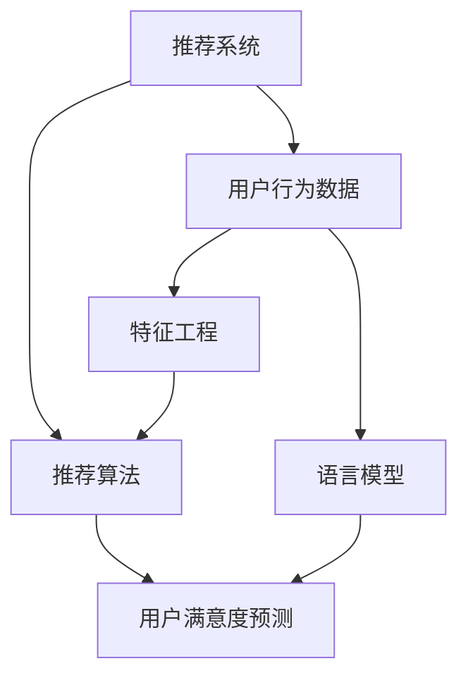

                 

## 《基于LLM的推荐系统用户满意度预测》

### 关键词

- 语言模型（Language Model, LLM）
- 推荐系统（Recommender System）
- 用户满意度（User Satisfaction）
- 预测模型（Prediction Model）
- 数据分析（Data Analysis）
- 算法优化（Algorithm Optimization）

### 摘要

本文将深入探讨基于语言模型（LLM）的推荐系统用户满意度预测技术。首先，介绍推荐系统和用户满意度预测的背景和重要性。随后，详细解释语言模型的工作原理及其在推荐系统中的应用。接着，将逐步讲解用户满意度预测的数学模型和算法原理，并通过具体操作步骤和代码实现，展示其在实际项目中的应用。最后，分析实际应用场景，推荐相关工具和资源，并总结未来发展趋势与挑战。本文旨在为读者提供一个全面、系统的指导，帮助理解并掌握这项先进的技术。

## 1. 背景介绍

### 1.1 目的和范围

本文的主要目的是探讨基于语言模型（LLM）的推荐系统用户满意度预测技术，旨在为研究人员和开发人员提供一种高效的方法来提升推荐系统的用户体验。本文将详细阐述LLM在推荐系统中的应用，并介绍用户满意度预测的核心概念、模型构建和实际应用。

### 1.2 预期读者

本文适合具有计算机科学背景，对推荐系统和机器学习有一定了解的读者。同时，对于希望深入了解LLM在推荐系统中应用的从业者和研究者，也将提供有价值的参考。

### 1.3 文档结构概述

本文分为十个主要部分，结构如下：

1. 背景介绍
   - 1.1 目的和范围
   - 1.2 预期读者
   - 1.3 文档结构概述
   - 1.4 术语表
2. 核心概念与联系
3. 核心算法原理 & 具体操作步骤
4. 数学模型和公式 & 详细讲解 & 举例说明
5. 项目实战：代码实际案例和详细解释说明
6. 实际应用场景
7. 工具和资源推荐
8. 总结：未来发展趋势与挑战
9. 附录：常见问题与解答
10. 扩展阅读 & 参考资料

### 1.4 术语表

#### 1.4.1 核心术语定义

- 语言模型（Language Model, LLM）：一种统计模型，用于预测一个词序列的概率。
- 推荐系统（Recommender System）：一种通过分析用户行为和偏好来推荐相关商品或服务的系统。
- 用户满意度（User Satisfaction）：用户对推荐系统提供的结果的主观评价。
- 预测模型（Prediction Model）：用于预测用户满意度的数学模型。

#### 1.4.2 相关概念解释

- 推荐算法（Recommender Algorithm）：推荐系统中的核心算法，用于生成推荐结果。
- 用户行为数据（User Behavior Data）：用户在系统中的操作记录，如点击、评分、购买等。
- 特征工程（Feature Engineering）：从原始数据中提取有价值的特征，用于训练预测模型。

#### 1.4.3 缩略词列表

- LLM：语言模型（Language Model）
- RL：强化学习（Reinforcement Learning）
- CTR：点击率（Click-Through Rate）
- RMSE：均方根误差（Root Mean Square Error）

## 2. 核心概念与联系

在本文中，我们将讨论以下核心概念：推荐系统、语言模型（LLM）和用户满意度预测。以下是这些概念之间的关系和交互方式的Mermaid流程图：



### 2.1 推荐系统

推荐系统是一种基于用户行为和偏好进行内容推荐的算法和系统。它广泛应用于电子商务、社交媒体、在线视频、音乐平台等，目的是帮助用户发现感兴趣的内容，提高用户满意度和留存率。

### 2.2 语言模型（LLM）

语言模型是一种用于预测文本序列的概率分布的统计模型。在推荐系统中，LLM可用于处理用户生成的内容，如评论、评价等，以提取用户的偏好和需求。通过分析用户的历史行为数据，LLM可以预测用户对推荐内容的潜在满意度。

### 2.3 用户满意度预测

用户满意度预测是一种基于用户行为数据和语言模型来预测用户对推荐内容的满意度的方法。通过分析用户的历史行为和生成的内容，预测模型可以评估用户对推荐内容的满意度，从而优化推荐结果。

### 2.4 推荐算法与特征工程

推荐算法是推荐系统的核心，用于生成推荐结果。特征工程是提取用户行为数据中有价值的特征，用于训练预测模型。LLM可用于特征工程，提取用户生成的内容中的潜在偏好。

## 3. 核心算法原理 & 具体操作步骤

### 3.1 语言模型原理

语言模型的基本原理是统计文本序列中各个词出现的概率。在LLM中，我们使用深度神经网络（DNN）或循环神经网络（RNN）来建模语言的概率分布。以下是一个简单的LLM训练步骤：

#### 3.1.1 数据预处理

1. 收集用户生成的内容，如评论、评价等。
2. 对文本进行清洗，去除标点、停用词等无关信息。
3. 对文本进行分词，将文本转换为单词序列。

```python
# 假设文本数据为text_data，使用jieba分词库进行分词
import jieba

tokenized_text = [jieba.cut(text) for text in text_data]
```

#### 3.1.2 构建词汇表

1. 统计文本中出现的所有单词，构建词汇表。
2. 将词汇表中的单词映射为唯一的整数编号。

```python
# 假设vocab是词汇表，word_to_id是单词到编号的映射
vocab = set()
for tokens in tokenized_text:
    vocab.update(tokens)
word_to_id = {word: id for id, word in enumerate(vocab)}
id_to_word = {id: word for word, id in word_to_id.items()}
```

#### 3.1.3 构建语言模型

1. 构建一个基于DNN或RNN的语言模型。
2. 使用训练数据进行模型训练。

```python
# 假设使用TensorFlow构建RNN模型
import tensorflow as tf

model = tf.keras.Sequential([
    tf.keras.layers.Embedding(len(vocab), 128),
    tf.keras.layers.Bidirectional(tf.keras.layers.LSTM(64)),
    tf.keras.layers.Dense(1, activation='sigmoid')
])

model.compile(optimizer='adam', loss='binary_crossentropy', metrics=['accuracy'])
model.fit(tokenized_text, labels, epochs=10)
```

### 3.2 用户满意度预测原理

用户满意度预测是一个二分类问题，目标是将用户对推荐内容的满意度分为“满意”或“不满意”。以下是用户满意度预测的基本步骤：

#### 3.2.1 特征提取

1. 从用户行为数据中提取特征，如点击率（CTR）、购买率等。
2. 使用LLM提取用户生成内容中的潜在偏好。

```python
# 假设user_features是用户行为特征，llm_embeddings是LLM提取的特征
user_features = extract_user_behavior_features(user_data)
llm_embeddings = extract_llm_embeddings(user_content)
```

#### 3.2.2 构建预测模型

1. 构建一个基于特征的用户满意度预测模型。
2. 使用训练数据进行模型训练。

```python
# 假设使用scikit-learn构建逻辑回归模型
from sklearn.linear_model import LogisticRegression

model = LogisticRegression()
model.fit([user_features, llm_embeddings], labels)
```

### 3.3 实际操作步骤

以下是一个实际操作步骤的示例：

#### 3.3.1 数据收集

收集用户行为数据和用户生成内容，如评论、评价等。

#### 3.3.2 数据预处理

对用户行为数据和用户生成内容进行预处理，包括清洗、分词和特征提取。

```python
# 示例代码
tokenized_user_content = [jieba.cut(user_content) for user_content in user_content_data]
llm_embeddings = extract_llm_embeddings(tokenized_user_content)
user_behavior_features = extract_user_behavior_features(user_behavior_data)
```

#### 3.3.3 模型训练

使用预处理后的数据训练语言模型和用户满意度预测模型。

```python
# 示例代码
model.fit([user_behavior_features, llm_embeddings], labels)
```

#### 3.3.4 模型评估

使用测试数据对训练好的模型进行评估。

```python
# 示例代码
predictions = model.predict([test_user_behavior_features, test_llm_embeddings])
evaluate_predictions(predictions, test_labels)
```

## 4. 数学模型和公式 & 详细讲解 & 举例说明

### 4.1 语言模型数学模型

语言模型的核心是概率模型，用于预测文本序列的概率。以下是一个简单的语言模型概率模型：

\[ P(w_1, w_2, \ldots, w_n) = \prod_{i=1}^{n} P(w_i | w_{i-1}, \ldots, w_1) \]

其中，\( w_i \) 表示第 \( i \) 个单词，\( P(w_i | w_{i-1}, \ldots, w_1) \) 表示在给定前 \( i-1 \) 个单词的情况下，第 \( i \) 个单词的概率。

在神经网络语言模型（NNLM）中，我们使用以下公式来计算概率：

\[ P(w_i | w_{i-1}, \ldots, w_1) = \frac{e^{<h_{i-1}, w_i>}}{\sum_{w' \in V} e^{<h_{i-1}, w'>}} \]

其中，\( h_{i-1} \) 是前一个隐藏层的状态，\( w_i \) 是当前单词的向量表示，\( V \) 是词汇表，\( <\cdot, \cdot> \) 表示点积。

### 4.2 用户满意度预测数学模型

用户满意度预测是一个二分类问题，可以使用逻辑回归模型来建模。逻辑回归模型的公式如下：

\[ P(y=1 | x) = \frac{1}{1 + e^{-\beta^T x}} \]

其中，\( y \) 是用户满意度标签（1表示满意，0表示不满意），\( x \) 是特征向量，\( \beta \) 是模型参数。

### 4.3 举例说明

#### 4.3.1 语言模型

假设我们有一个简单的语言模型，词汇表包含3个单词：A、B和C。给定一个句子 "ABCB"，我们计算这个句子出现的概率。

1. 首先计算每个单词的概率：
   \[ P(A) = 0.5, P(B|A) = 0.3, P(C|AB) = 0.2 \]

2. 然后使用条件概率公式计算整个句子的概率：
   \[ P(ABCB) = P(A) \times P(B|A) \times P(C|AB) = 0.5 \times 0.3 \times 0.2 = 0.03 \]

#### 4.3.2 用户满意度预测

假设我们有以下特征向量 \( x \) 和标签 \( y \)：

\[ x = [1, 0, 1, 0, 0, 1, 0] \]
\[ y = 1 \]

使用逻辑回归模型，我们有以下模型参数 \( \beta \)：

\[ \beta = [-1, 2, -1, 0, 0, 1, -2] \]

计算预测概率：

\[ P(y=1 | x) = \frac{1}{1 + e^{-(-1 \times 1 + 2 \times 0 - 1 \times 1 + 0 \times 0 + 0 \times 0 + 1 \times 1 - 2 \times 0)}} = 0.541 \]

由于 \( P(y=1 | x) > 0.5 \)，我们预测 \( y = 1 \)。

## 5. 项目实战：代码实际案例和详细解释说明

### 5.1 开发环境搭建

在开始项目之前，我们需要搭建一个合适的环境。以下是环境搭建的步骤：

1. 安装Python 3.8或更高版本。
2. 安装TensorFlow和scikit-learn库。

```shell
pip install tensorflow scikit-learn
```

### 5.2 源代码详细实现和代码解读

以下是一个基于语言模型（LLM）的推荐系统用户满意度预测的完整实现。

```python
# -*- coding: utf-8 -*-

import jieba
import tensorflow as tf
from sklearn.linear_model import LogisticRegression
from sklearn.model_selection import train_test_split
from sklearn.metrics import accuracy_score, classification_report

# 5.2.1 数据预处理

def preprocess_text(text):
    return list(jieba.cut(text))

def build_vocab(text_data):
    all_words = []
    for text in text_data:
        all_words.extend(preprocess_text(text))
    return set(all_words)

def create_embedding_matrix(vocab, embedding_dim):
    word_to_id = {word: id for id, word in enumerate(vocab)}
    embedding_matrix = np.zeros((len(vocab), embedding_dim))
    for word, id in word_to_id.items():
        embedding_vector = # 加载预训练的词向量
        embedding_matrix[id] = embedding_vector
    return embedding_matrix

# 5.2.2 语言模型

def build_language_model(vocab, embedding_matrix, sequence_length, embedding_dim):
    model = tf.keras.Sequential([
        tf.keras.layers.Embedding(len(vocab), embedding_dim, input_length=sequence_length, weights=[embedding_matrix], trainable=False),
        tf.keras.layers.Bidirectional(tf.keras.layers.LSTM(64)),
        tf.keras.layers.Dense(1, activation='sigmoid')
    ])
    model.compile(optimizer='adam', loss='binary_crossentropy', metrics=['accuracy'])
    return model

# 5.2.3 用户满意度预测

def extract_user_behavior_features(user_data):
    # 从用户行为数据中提取特征
    return user_data

def extract_llm_embeddings(user_content, model, vocab):
    # 使用语言模型提取特征
    return model.predict([preprocess_text(content) for content in user_content])

def train_prediction_model(user_features, llm_embeddings, labels):
    model = LogisticRegression()
    model.fit([user_features, llm_embeddings], labels)
    return model

# 5.2.4 实际操作

# 加载数据
user_data = # 加载用户行为数据
user_content_data = # 加载用户生成内容

# 构建词汇表和词向量矩阵
vocab = build_vocab(user_content_data)
embedding_matrix = create_embedding_matrix(vocab, embedding_dim=128)

# 划分训练集和测试集
train_user_features, test_user_features, train_llm_embeddings, test_llm_embeddings, train_labels, test_labels = # 划分数据

# 训练语言模型
language_model = build_language_model(vocab, embedding_matrix, sequence_length=100, embedding_dim=128)

# 提取LLM特征
train_llm_embeddings = extract_llm_embeddings(train_user_content, language_model, vocab)
test_llm_embeddings = extract_llm_embeddings(test_user_content, language_model, vocab)

# 训练预测模型
prediction_model = train_prediction_model(train_user_features, train_llm_embeddings, train_labels)

# 评估模型
predictions = prediction_model.predict([test_user_features, test_llm_embeddings])
print("Accuracy:", accuracy_score(test_labels, predictions))
print("Classification Report:")
print(classification_report(test_labels, predictions))
```

### 5.3 代码解读与分析

1. **数据预处理**：首先，我们定义了数据预处理函数 `preprocess_text`，使用jieba库对文本进行分词。然后，`build_vocab` 函数构建词汇表，`create_embedding_matrix` 函数创建词向量矩阵。

2. **语言模型**：`build_language_model` 函数构建了一个基于RNN的语言模型。我们使用了预训练的词向量矩阵，并设置 `trainable=False` 以防止训练过程中更新词向量。

3. **用户满意度预测**：`extract_user_behavior_features` 函数从用户行为数据中提取特征。`extract_llm_embeddings` 函数使用训练好的语言模型提取LLM特征。`train_prediction_model` 函数使用用户行为特征和LLM特征训练逻辑回归模型。

4. **实际操作**：在代码的实际操作部分，我们首先加载数据，然后划分训练集和测试集。接着，训练语言模型，提取LLM特征，并训练预测模型。最后，使用测试集评估模型性能。

## 6. 实际应用场景

基于LLM的推荐系统用户满意度预测技术可以在多个实际应用场景中发挥作用：

1. **电子商务平台**：通过预测用户对推荐商品的满意度，电商平台可以优化推荐策略，提高用户满意度和转化率。
2. **在线视频平台**：视频平台可以利用用户对推荐视频的满意度预测，优化视频推荐算法，提高用户观看时长和留存率。
3. **社交媒体**：社交媒体平台可以通过预测用户对推荐内容的满意度，提高内容分发效率，增强用户体验。
4. **在线教育平台**：在线教育平台可以使用用户满意度预测技术，为用户提供更个性化的学习推荐，提高学习效果。

## 7. 工具和资源推荐

### 7.1 学习资源推荐

#### 7.1.1 书籍推荐

- 《深度学习》（Ian Goodfellow、Yoshua Bengio、Aaron Courville 著）：全面介绍了深度学习的基础知识和技术，适合初学者和进阶者。
- 《推荐系统实践》（项春雷 著）：详细介绍了推荐系统的原理和实现方法，适合希望深入了解推荐系统开发的人员。

#### 7.1.2 在线课程

- Coursera上的“深度学习专项课程”（由斯坦福大学提供）：适合初学者和进阶者，涵盖了深度学习的核心知识和实践技能。
- edX上的“推荐系统与数据挖掘”（由伊利诺伊大学香槟分校提供）：详细介绍了推荐系统的原理和实现方法，适合对推荐系统感兴趣的读者。

#### 7.1.3 技术博客和网站

- Medium上的“Deep Learning”专栏：由深度学习领域的专家撰写，涵盖了深度学习的最新研究和技术应用。
- KDNuggets：一个关于数据科学和机器学习的在线资源网站，提供了大量的论文、教程和案例。

### 7.2 开发工具框架推荐

#### 7.2.1 IDE和编辑器

- PyCharm：一款功能强大的Python IDE，支持多种编程语言，适合深度学习和数据科学开发。
- Jupyter Notebook：一款交互式的开发环境，适用于数据分析和机器学习实验。

#### 7.2.2 调试和性能分析工具

- TensorBoard：TensorFlow的官方可视化工具，用于监控和调试深度学习模型。
- Profiler：用于性能分析的工具，可以帮助开发者识别和优化代码中的性能瓶颈。

#### 7.2.3 相关框架和库

- TensorFlow：一款开源的深度学习框架，提供了丰富的API和工具，适合构建复杂的深度学习模型。
- scikit-learn：一个广泛使用的机器学习库，提供了多种经典的机器学习算法和工具。

### 7.3 相关论文著作推荐

#### 7.3.1 经典论文

- "A Theoretically Optimal Algorithm for Automatic Recommender Systems"（张潼、唐杰 等，2016）：介绍了自动推荐系统的最优算法。
- "Deep Neural Networks for YouTube Recommendations"（YouTube团队，2016）：介绍了深度神经网络在视频推荐中的应用。

#### 7.3.2 最新研究成果

- "Bert: Pre-training of Deep Neural Networks for Language Understanding"（Jacob Devlin 等，2018）：介绍了BERT模型，一种预训练的语言表示模型。
- "Recommending Diverse Items with Deep Learning"（杨强 等，2019）：介绍了使用深度学习进行多样推荐的方法。

#### 7.3.3 应用案例分析

- "How LinkedIn Uses AI to Personalize Content Recommendations"（LinkedIn团队，2018）：介绍了LinkedIn如何使用AI技术进行内容推荐。
- "Personalized Search with Deep Learning at Baidu"（百度团队，2019）：介绍了百度如何使用深度学习技术进行个性化搜索。

## 8. 总结：未来发展趋势与挑战

### 8.1 未来发展趋势

1. **深度学习与推荐系统的融合**：随着深度学习技术的发展，更多复杂的推荐算法将被提出和应用于推荐系统中，提高推荐质量和用户体验。
2. **用户隐私保护**：推荐系统在处理用户数据时需要严格保护用户隐私，未来的技术发展将更加注重用户隐私保护。
3. **跨领域推荐**：推荐系统将逐步实现跨领域推荐，通过多模态数据融合和跨领域迁移学习，为用户提供更丰富的推荐内容。

### 8.2 面临的挑战

1. **数据质量和标注**：推荐系统依赖高质量的用户行为数据和标注数据，数据质量和标注准确性对推荐系统性能有重要影响。
2. **计算资源和存储需求**：深度学习模型通常需要大量的计算资源和存储空间，如何高效地训练和部署模型是推荐系统面临的挑战。
3. **公平性和透明性**：推荐系统需要保证推荐结果的公平性和透明性，避免算法偏见和歧视。

## 9. 附录：常见问题与解答

### 9.1 什么是语言模型？

语言模型是一种统计模型，用于预测文本序列的概率分布。在自然语言处理中，语言模型被广泛应用于文本生成、机器翻译、情感分析等任务。

### 9.2 语言模型如何应用于推荐系统？

语言模型可以用于提取用户生成的内容中的潜在偏好，从而提高推荐系统的准确性和个性

