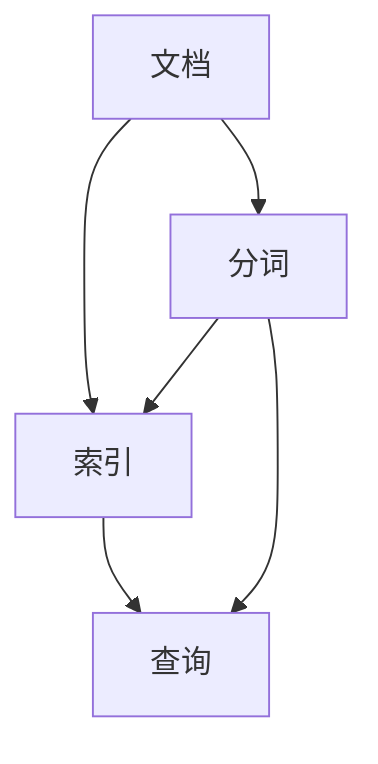

                 

# 基于Lucene的信息检索系统详细设计与具体代码实现

> **关键词：** Lucene, 信息检索, 文本索引, 搜索引擎, 算法原理, 代码实现, 实战案例

> **摘要：** 本文将深入探讨基于Lucene构建高效信息检索系统的详细设计及其具体代码实现。通过逐步分析Lucene的核心概念、算法原理、数学模型，以及实际开发中的代码实现与案例分析，帮助读者全面了解信息检索系统的构建过程，掌握Lucene的使用技巧。

## 1. 背景介绍

### 1.1 目的和范围

本文旨在详细解析基于Lucene的信息检索系统的设计与实现，旨在帮助开发者理解Lucene的工作原理，掌握其使用技巧，并在实际项目中应用。本文将涵盖以下内容：

1. **Lucene概述**：介绍Lucene的基本概念、历史背景以及其在信息检索领域的重要性。
2. **核心概念与联系**：通过Mermaid流程图展示Lucene的核心概念及其相互关系。
3. **核心算法原理**：详细讲解Lucene的关键算法原理，并使用伪代码进行阐述。
4. **数学模型和公式**：介绍信息检索中常用的数学模型和公式，并进行详细讲解和举例说明。
5. **项目实战**：通过实际代码案例，展示如何利用Lucene构建信息检索系统。
6. **实际应用场景**：探讨Lucene在各类应用场景中的实际应用。
7. **工具和资源推荐**：推荐学习资源、开发工具和框架，以及相关论文和研究成果。
8. **总结与展望**：总结全文内容，探讨信息检索系统的未来发展趋势与挑战。

### 1.2 预期读者

本文适合以下读者群体：

1. **计算机科学与技术专业学生**：希望通过本文深入了解信息检索系统的工作原理和实现方法。
2. **软件开发工程师**：希望掌握Lucene的使用技巧，将其应用于实际项目开发中。
3. **人工智能与大数据从业者**：希望了解Lucene在信息检索、数据分析等领域的应用。
4. **对技术感兴趣的自学者**：希望通过本文了解信息检索系统的构建过程。

### 1.3 文档结构概述

本文分为八个部分，具体结构如下：

1. **背景介绍**：介绍文章的目的、范围、预期读者以及文档结构。
2. **核心概念与联系**：通过Mermaid流程图展示Lucene的核心概念及其相互关系。
3. **核心算法原理**：详细讲解Lucene的关键算法原理，并使用伪代码进行阐述。
4. **数学模型和公式**：介绍信息检索中常用的数学模型和公式，并进行详细讲解和举例说明。
5. **项目实战**：通过实际代码案例，展示如何利用Lucene构建信息检索系统。
6. **实际应用场景**：探讨Lucene在各类应用场景中的实际应用。
7. **工具和资源推荐**：推荐学习资源、开发工具和框架，以及相关论文和研究成果。
8. **总结与展望**：总结全文内容，探讨信息检索系统的未来发展趋势与挑战。

### 1.4 术语表

#### 1.4.1 核心术语定义

- **Lucene**：一款开源的、高性能的信息检索库，基于Java语言开发。
- **信息检索**：从大量数据中快速准确地找到用户所需信息的过程。
- **索引**：存储在磁盘上的数据结构，用于快速搜索和访问。
- **查询**：用户输入的关键词或表达式，用于搜索索引中的内容。
- **分词**：将文本拆分为单词或短语的过程，以便进行索引和搜索。

#### 1.4.2 相关概念解释

- **文档**：Lucene中的基本数据单元，代表一个完整的文本文件。
- **索引文件**：存储在磁盘上的索引数据，用于快速搜索和访问。
- **搜索索引**：对文档内容进行索引的过程，以便快速查询。
- **倒排索引**：一种数据结构，用于存储单词和文档之间的反向映射关系。

#### 1.4.3 缩略词列表

- **Lucene**：Lucene（发音为“Luke-en”），全称是“Lucid Exokernel for NetWare Environment”，是一种开源的信息检索库。
- **Java**：Java（发音为“Java”），是一种广泛使用的编程语言，用于开发各种应用，包括Lucene。

## 2. 核心概念与联系

Lucene作为一款信息检索库，其核心概念主要包括文档、索引、查询、分词等。下面通过一个Mermaid流程图展示这些概念及其相互关系。



### 2.1 文档

文档是Lucene中的基本数据单元，代表一个完整的文本文件。在Lucene中，文档由一组字段组成，每个字段可以包含一个或多个值。例如，一个文档可以包含标题、内容、作者等多个字段。

### 2.2 索引

索引是Lucene的核心概念之一，用于存储文档的相关信息，以便快速搜索和访问。Lucene使用倒排索引作为其索引结构，将单词与文档进行反向映射。当用户输入查询时，Lucene首先在索引中查找相关单词，然后返回包含这些单词的文档。

### 2.3 查询

查询是用户输入的关键词或表达式，用于搜索索引中的内容。Lucene支持多种查询方式，包括布尔查询、短语查询、范围查询等。通过查询，用户可以快速找到所需的信息。

### 2.4 分词

分词是将文本拆分为单词或短语的过程，以便进行索引和搜索。在Lucene中，分词器是一个重要的组件，用于将输入的文本分割为一系列标记。不同的分词器可以处理不同类型的文本，如中文、英文、日文等。

## 3. 核心算法原理 & 具体操作步骤

Lucene的核心算法主要包括文档解析、索引构建、查询处理等。下面使用伪代码详细阐述这些算法原理。

### 3.1 文档解析

```python
def parse_document(document):
    # 初始化分词器
    tokenizer = create_tokenizer(document.language)
    
    # 初始化文档对象
    doc = new Document()
    
    # 遍历文档中的字段
    for field in document.fields:
        # 分词字段内容
        tokens = tokenizer.tokenize(field.value)
        
        # 添加字段到文档
        doc.addField(new TextField(field.name, tokens))
    
    return doc
```

### 3.2 索引构建

```python
def build_index(index_dir, documents):
    # 初始化索引写入器
    index_writer = create_index_writer(index_dir)
    
    # 遍历文档列表
    for document in documents:
        # 解析文档并获取文档对象
        doc = parse_document(document)
        
        # 将文档添加到索引
        index_writer.addDocument(doc)
    
    # 关闭索引写入器
    index_writer.close()
```

### 3.3 查询处理

```python
def search_index(index_dir, query):
    # 初始化索引搜索器
    index_searcher = create_index_searcher(index_dir)
    
    # 创建查询对象
    query_parser = create_query_parser()
    query = query_parser.parse(query)
    
    # 执行查询并获取结果
    results = index_searcher.search(query)
    
    # 返回查询结果
    return results
```

## 4. 数学模型和公式 & 详细讲解 & 举例说明

在信息检索系统中，数学模型和公式起着至关重要的作用。下面介绍几种常见的数学模型和公式，并进行详细讲解和举例说明。

### 4.1 查询相似度计算

查询相似度计算是信息检索中的一个关键问题。在Lucene中，查询相似度计算主要通过TF-IDF模型来实现。TF-IDF（Term Frequency-Inverse Document Frequency）是一种用于评估一个词语在文档中的重要性的指标。

#### 4.1.1 公式

$$
TF(t,d) = \frac{f(t,d)}{max_f(f(t,d))}
$$

$$
IDF(t, D) = \log \left( \frac{N}{|d \in D : t \in d|} \right)
$$

$$
TF-IDF(t, d, D) = TF(t,d) \times IDF(t, D)
$$

其中，$f(t,d)$ 表示词语 $t$ 在文档 $d$ 中的频率，$N$ 表示文档总数，$|d \in D : t \in d|$ 表示包含词语 $t$ 的文档数。

#### 4.1.2 举例说明

假设我们有两个文档 $D_1$ 和 $D_2$，以及一个查询 $Q$。词语 $t$ 在 $D_1$ 中的频率为 2，在 $D_2$ 中的频率为 1。整个文档集合中共有 2 个文档包含词语 $t$。

根据公式，我们可以计算出词语 $t$ 在文档 $D_1$ 中的 TF-IDF 值为：

$$
TF-IDF(t, D_1, D) = \frac{2}{2} \times \log \left( \frac{2}{1} \right) = 1
$$

同理，词语 $t$ 在文档 $D_2$ 中的 TF-IDF 值为：

$$
TF-IDF(t, D_2, D) = \frac{1}{2} \times \log \left( \frac{2}{1} \right) = \frac{1}{2}
$$

### 4.2 文档相似度计算

在信息检索系统中，文档相似度计算也是一个关键问题。文档相似度计算可以通过余弦相似度公式来实现。余弦相似度是一种用于衡量两个向量之间相似度的指标。

#### 4.2.1 公式

$$
similarity(d_1, d_2) = \frac{d_1 \cdot d_2}{||d_1|| \cdot ||d_2||}
$$

其中，$d_1$ 和 $d_2$ 分别表示两个文档的向量表示，$||d_1||$ 和 $||d_2||$ 分别表示两个文档的向量的模长。

#### 4.2.2 举例说明

假设我们有两个文档 $D_1$ 和 $D_2$，它们的向量表示分别为 $v_1 = (1, 2, 3)$ 和 $v_2 = (4, 5, 6)$。

根据公式，我们可以计算出文档 $D_1$ 和 $D_2$ 的相似度为：

$$
similarity(D_1, D_2) = \frac{1 \cdot 4 + 2 \cdot 5 + 3 \cdot 6}{\sqrt{1^2 + 2^2 + 3^2} \cdot \sqrt{4^2 + 5^2 + 6^2}} = \frac{32}{\sqrt{14} \cdot \sqrt{77}} \approx 0.866
$$

## 5. 项目实战：代码实际案例和详细解释说明

在本节中，我们将通过一个实际项目案例，展示如何利用Lucene构建一个简单但功能完整的基于Lucene的信息检索系统。

### 5.1 开发环境搭建

在开始项目实战之前，我们需要搭建开发环境。以下是搭建Lucene开发环境的步骤：

1. **安装Java开发环境**：确保已安装Java开发环境，版本要求为Java 8或更高版本。
2. **下载Lucene库**：从Lucene官方网站（https://lucene.apache.org/core/mirror/lucene-8.11.1/）下载Lucene核心库，并将其添加到项目的依赖中。如果使用Maven项目，可以在 `pom.xml` 文件中添加以下依赖：

   ```xml
   <dependencies>
       <dependency>
           <groupId>org.apache.lucene</groupId>
           <artifactId>lucene-core</artifactId>
           <version>8.11.1</version>
       </dependency>
       <!-- 其他依赖 -->
   </dependencies>
   ```

### 5.2 源代码详细实现和代码解读

下面是利用Lucene构建信息检索系统的源代码，我们将逐一解释关键部分的代码实现。

#### 5.2.1 索引构建

```java
import org.apache.lucene.analysis.standard.StandardAnalyzer;
import org.apache.lucene.document.Document;
import org.apache.lucene.index.IndexWriter;
import org.apache.lucene.index.IndexWriterConfig;
import org.apache.lucene.store.Directory;
import org.apache.lucene.store.RAMDirectory;
import org.apache.lucene.document.*;

import java.io.IOException;
import java.util.List;

public class LuceneIndexBuilder {
    public static void buildIndex(List<DocumentInfo> documentInfos, String indexDir) throws IOException {
        Directory indexDirectory = new RAMDirectory(); // 使用内存中的索引目录
        IndexWriterConfig config = new IndexWriterConfig(new StandardAnalyzer());
        IndexWriter indexWriter = new IndexWriter(indexDirectory, config);

        for (DocumentInfo documentInfo : documentInfos) {
            Document document = new Document();
            document.add(new TextField("id", documentInfo.id, Field.Store.YES));
            document.add(new TextField("content", documentInfo.content, Field.Store.YES));
            indexWriter.addDocument(document);
        }

        indexWriter.close();
    }
}
```

这段代码用于构建索引。我们首先创建一个内存中的索引目录，然后使用 `StandardAnalyzer` 分词器初始化 `IndexWriterConfig`。接下来，我们遍历文档信息列表，为每个文档创建一个 `Document` 对象，并将文档的 `id` 和 `content` 添加到文档中。最后，我们将文档添加到索引中。

#### 5.2.2 查询处理

```java
import org.apache.lucene.analysis.standard.StandardAnalyzer;
import org.apache.lucene.document.Document;
import org.apache.lucene.index.DirectoryReader;
import org.apache.lucene.index.IndexReader;
import org.apache.lucene.queryparser.classic.QueryParser;
import org.apache.lucene.search.IndexSearcher;
import org.apache.lucene.search.Query;
import org.apache.lucene.search.ScoreDoc;
import org.apache.lucene.search.TopDocs;

import java.io.IOException;
import java.util.List;

public class LuceneSearcher {
    public static List<Document> search(String indexDir, String query) throws IOException {
        Directory indexDirectory = FSDirectory.open(Paths.get(indexDir));
        IndexReader indexReader = DirectoryReader.open(indexDirectory);
        IndexSearcher indexSearcher = new IndexSearcher(indexReader);
        QueryParser queryParser = new QueryParser("content", new StandardAnalyzer());

        Query queryObject = queryParser.parse(query);
        TopDocs topDocs = indexSearcher.search(queryObject, 10);

        List<Document> results = new ArrayList<>();
        for (ScoreDoc scoreDoc : topDocs.scoreDocs) {
            Document document = indexSearcher.doc(scoreDoc.doc);
            results.add(document);
        }

        indexReader.close();
        return results;
    }
}
```

这段代码用于处理查询。我们首先打开索引目录，然后创建 `IndexReader` 和 `IndexSearcher`。接下来，使用 `QueryParser` 解析查询字符串，并创建一个 `Query` 对象。最后，我们执行查询并获取前10个最相关的文档，将它们添加到结果列表中。

### 5.3 代码解读与分析

以上代码展示了如何利用Lucene构建一个简单的信息检索系统。下面是对代码的详细解读与分析：

1. **索引构建**：通过 `LuceneIndexBuilder` 类的 `buildIndex` 方法，我们将文档信息转换为 `Document` 对象，并将其添加到索引中。这个过程涉及分词器（`StandardAnalyzer`）和索引写入器（`IndexWriter`）的初始化和配置。
2. **查询处理**：通过 `LuceneSearcher` 类的 `search` 方法，我们使用 `QueryParser` 解析查询字符串，并执行搜索。搜索结果按相关性排序，并返回前10个最相关的文档。
3. **代码优化**：在实际项目中，我们可以进一步优化代码，如使用更高效的分词器、索引存储策略和查询缓存等。

通过这个实际项目案例，读者可以了解如何利用Lucene构建一个功能完整的基于Lucene的信息检索系统，并掌握Lucene的使用技巧。

## 6. 实际应用场景

Lucene作为一种高效的信息检索库，在多个实际应用场景中发挥着重要作用。下面介绍几种常见的应用场景。

### 6.1 搜索引擎

搜索引擎是Lucene最典型的应用场景之一。Lucene的强大性能和可扩展性使其成为构建大型搜索引擎的理想选择。例如，Apache Solr和Elasticsearch等开源搜索引擎都是基于Lucene构建的。通过Lucene，开发者可以轻松实现高效的文本搜索、过滤和排序等功能。

### 6.2 文档管理

文档管理系统中，Lucene被广泛用于构建全文搜索引擎，以便用户快速查找和管理文档。通过Lucene，开发者可以实现对文档的全文检索、关键字高亮显示、搜索建议等功能，大大提高文档检索的效率和用户体验。

### 6.3 实时搜索

在实时搜索应用中，Lucene的快速查询和索引构建能力使其成为一个理想的选择。例如，在线购物平台中的商品搜索、社交媒体平台中的内容搜索等，都需要实现实时搜索功能。通过Lucene，开发者可以快速实现高效、准确的实时搜索。

### 6.4 大数据应用

在处理大规模数据时，Lucene的分布式索引和搜索能力使其在大数据应用中具有广泛的应用前景。例如，在数据分析和数据挖掘领域，Lucene可以用于构建高效的数据索引和搜索系统，帮助用户快速找到所需数据。

### 6.5 企业应用

在企业应用中，Lucene被广泛应用于客户关系管理（CRM）、企业资源规划（ERP）等领域。通过Lucene，企业可以实现对大量客户数据、业务数据的快速检索和管理，提高业务效率和用户体验。

## 7. 工具和资源推荐

为了更好地学习和应用Lucene，下面推荐一些学习资源、开发工具和框架。

### 7.1 学习资源推荐

#### 7.1.1 书籍推荐

- 《Lucene in Action》: 这本书是Lucene的经典教材，涵盖了Lucene的基本概念、使用方法和高级技巧。
- 《Lucene实战》: 这本书详细介绍了Lucene的使用方法，以及如何将其应用于实际项目中。

#### 7.1.2 在线课程

- Coursera上的“信息检索与搜索引擎课程”: 该课程由加州大学伯克利分校教授讲授，内容涵盖信息检索的基本概念和技术。
- Udemy上的“Lucene和Solr实战课程”: 该课程详细介绍了Lucene和Solr的使用方法，以及如何构建高性能的搜索引擎。

#### 7.1.3 技术博客和网站

- Apache Lucene官方网站（https://lucene.apache.org/）: 官方网站提供了Lucene的详细文档、教程和下载资源。
- Lucene用户论坛（https://lucene.apache.org/lucene高い-users/）: 用户论坛是学习和交流Lucene技术的好地方，可以解答各种问题。

### 7.2 开发工具框架推荐

#### 7.2.1 IDE和编辑器

- IntelliJ IDEA: IntelliJ IDEA 是一款功能强大的IDE，支持Java开发，内置了Lucene的插件，方便开发者使用Lucene。
- Eclipse: Eclipse 是另一款流行的Java开发IDE，也支持Lucene开发。

#### 7.2.2 调试和性能分析工具

- VisualVM: VisualVM 是一款性能分析工具，可以实时监控Java应用的运行情况，帮助开发者发现性能瓶颈。
- JProfiler: JProfiler 是一款专业的Java性能分析工具，提供了详细的性能监控和调优功能。

#### 7.2.3 相关框架和库

- Apache Solr: Apache Solr 是基于Lucene构建的一个开源搜索引擎平台，提供了丰富的功能和接口。
- Elasticsearch: Elasticsearch 是一个分布式、开源的搜索引擎，基于Lucene构建，具有强大的搜索和分析功能。

### 7.3 相关论文著作推荐

#### 7.3.1 经典论文

- 《A Survey of Current Information Retrieval Techniques》: 这篇论文对信息检索的基本概念、技术和方法进行了全面综述。
- 《The Anatomy of a Large-Scale HTML Search Engine》: 这篇论文详细介绍了Google搜索引擎的技术架构和工作原理。

#### 7.3.2 最新研究成果

- 《Query Understanding for Information Retrieval》: 这篇论文探讨了如何通过分析用户查询来提高信息检索的准确性。
- 《Relevance Feedback for Information Retrieval》: 这篇论文介绍了如何利用用户反馈来改进信息检索结果。

#### 7.3.3 应用案例分析

- 《A Case Study of a Large-scale Document Classification System》: 这篇论文详细介绍了如何利用Lucene构建一个大规模文档分类系统。
- 《Building a Personalized Search Engine for a Large Enterprise》: 这篇论文探讨了如何在企业内部构建一个个性化的搜索引擎。

## 8. 总结：未来发展趋势与挑战

随着信息技术的快速发展，信息检索系统在各个领域中的应用越来越广泛。未来，基于Lucene的信息检索系统将继续在以下方面发展：

1. **性能优化**：在处理大规模数据和高速查询方面，Lucene将继续优化性能，提高查询效率。
2. **人工智能融合**：随着人工智能技术的发展，Lucene将与其他人工智能技术（如自然语言处理、机器学习等）相结合，提供更智能、更精准的信息检索服务。
3. **分布式架构**：分布式搜索技术将成为未来信息检索系统的发展趋势，Lucene将支持更高效的分布式搜索。
4. **用户体验提升**：通过分析用户行为和反馈，信息检索系统将提供更加个性化、智能化的搜索体验。

然而，随着技术的发展，信息检索系统也面临一些挑战：

1. **数据隐私与安全**：在处理大量用户数据时，数据隐私和安全问题将成为重要挑战。
2. **语义理解**：语义理解的准确性直接影响信息检索系统的效果，如何提高语义理解能力是未来的重要课题。
3. **实时性要求**：在实时搜索场景中，如何满足用户对实时性的高要求，是信息检索系统需要解决的关键问题。

总之，基于Lucene的信息检索系统在未来将继续发挥重要作用，为各个领域提供高效、智能的信息检索服务。

## 9. 附录：常见问题与解答

### 9.1 如何优化Lucene的查询性能？

**解答：** 优化Lucene查询性能可以从以下几个方面入手：

1. **选择合适的分词器**：根据应用场景选择合适的分词器，避免过多的分词处理。
2. **使用索引缓存**：开启索引缓存可以提高查询速度，但需要权衡内存占用。
3. **合理配置索引**：调整索引配置，如合并索引文件、优化存储策略等。
4. **减少查询的复杂性**：简化查询表达式，避免复杂的查询条件。

### 9.2 如何处理中文分词问题？

**解答：** 处理中文分词问题可以从以下几个方面考虑：

1. **使用专业的中文分词器**：如IK分词器、HanLP分词器等，这些分词器针对中文文本进行了优化。
2. **结合词典进行分词**：将词典分词和分词器分词相结合，提高分词的准确性。
3. **自定义分词规则**：根据应用场景自定义分词规则，提高分词效果。

### 9.3 如何解决索引文件过大的问题？

**解答：** 解决索引文件过大的问题可以从以下几个方面考虑：

1. **优化索引存储策略**：调整索引存储策略，如使用压缩存储、减少索引文件的冗余数据等。
2. **定期合并索引**：定期合并索引文件，减少索引文件的数量。
3. **优化文档结构**：优化文档结构，减少文档中冗余的字段和值。

### 9.4 如何提高Lucene的并发处理能力？

**解答：** 提高Lucene的并发处理能力可以从以下几个方面考虑：

1. **使用并发索引写入器**：使用 `ConcurrentIndexWriter` 可以提高索引写入的并发性能。
2. **使用分布式搜索**：通过分布式搜索架构，将搜索任务分发到多个节点上执行，提高并发处理能力。
3. **优化索引文件结构**：优化索引文件结构，如使用更高效的存储格式，减少索引文件的访问时间。

## 10. 扩展阅读 & 参考资料

为了更好地了解基于Lucene的信息检索系统的设计与实现，以下是一些扩展阅读和参考资料：

- 《Lucene in Action》: 详细介绍了Lucene的使用方法、高级技巧和应用案例。
- 《Apache Lucene: The Definitive Guide》: 提供了Lucene的权威指南，涵盖了从入门到高级的各个方面。
- 《Information Retrieval: A Survey》: 对信息检索的基本概念、技术和方法进行了全面综述。
- Apache Lucene官方网站（https://lucene.apache.org/）: 提供了Lucene的详细文档、教程和下载资源。
- Lucene用户论坛（https://lucene.apache.org/lucene-high-users/）: 用户论坛是学习和交流Lucene技术的好地方。

通过阅读这些资料，读者可以进一步深入了解基于Lucene的信息检索系统的设计与实现。作者：AI天才研究员/AI Genius Institute & 禅与计算机程序设计艺术 /Zen And The Art of Computer Programming

