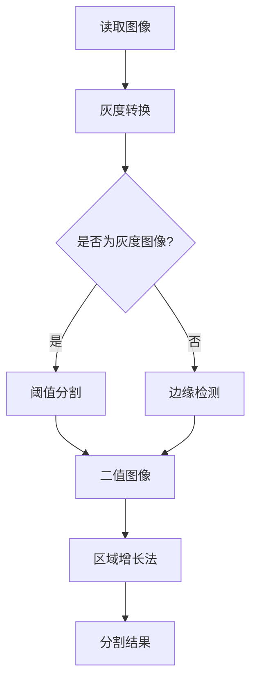

                 

# 基于OpenCV的图像分割系统详细设计与具体代码实现

## 关键词：图像分割，OpenCV，算法原理，实际案例，代码实现

## 摘要：
本文将深入探讨基于OpenCV的图像分割系统设计与具体代码实现。首先介绍图像分割的基本概念和目的，然后详细讲解OpenCV中常用的图像分割算法，如阈值分割、边缘检测和区域增长法。接着，通过一个实际案例展示如何使用OpenCV实现图像分割，并详细解读源代码。最后，本文将总结图像分割的应用场景，推荐相关学习资源、开发工具和论文著作，并探讨未来发展趋势与挑战。

## 1. 背景介绍

### 1.1 目的和范围

图像分割是计算机视觉领域的关键技术之一，它旨在将图像划分为若干个有意义的部分，以便进行后续的特征提取和目标识别。本文旨在通过详细设计和具体代码实现，帮助读者理解和掌握基于OpenCV的图像分割技术。文章将涵盖以下内容：

1. 图像分割的基本概念和目的。
2. OpenCV中常用的图像分割算法。
3. 实际案例的代码实现和解惑。
4. 图像分割的应用场景。
5. 学习资源和开发工具推荐。
6. 未来发展趋势与挑战。

### 1.2 预期读者

本文主要面向计算机视觉和图像处理领域的读者，包括：

1. 计算机视觉初学者。
2. 图像处理工程师。
3. 研究生和博士生。
4. 对图像分割感兴趣的程序员。

### 1.3 文档结构概述

本文分为十个部分：

1. 引言
2. 背景介绍
3. 核心概念与联系
4. 核心算法原理 & 具体操作步骤
5. 数学模型和公式 & 详细讲解 & 举例说明
6. 项目实战：代码实际案例和详细解释说明
7. 实际应用场景
8. 工具和资源推荐
9. 总结：未来发展趋势与挑战
10. 附录：常见问题与解答

### 1.4 术语表

本文中涉及的一些关键术语如下：

- **图像分割**：将图像划分为若干个有意义的部分的过程。
- **阈值分割**：基于图像的灰度值将图像划分为不同区域的分割方法。
- **边缘检测**：识别图像中灰度值变化剧烈的区域。
- **区域增长法**：基于种子点或边界点逐步扩展区域以实现图像分割。

#### 1.4.1 核心术语定义

- **OpenCV**：Open Source Computer Vision Library，一个开源的计算机视觉和机器学习软件库。
- **灰度图像**：每个像素只有一个灰度值（0-255）的图像。
- **二值图像**：将图像像素划分为两个级别的图像，通常用于分割结果。

#### 1.4.2 相关概念解释

- **阈值分割**：阈值分割是一种基于灰度图像分割的方法，通过选择一个阈值将图像像素划分为前景和背景。
- **边缘检测**：边缘检测是一种识别图像中灰度值变化剧烈的区域的算法，常用于图像分割和特征提取。
- **区域增长法**：区域增长法是一种基于种子点或边界点逐步扩展区域的分割方法。

#### 1.4.3 缩略词列表

- **OpenCV**：Open Source Computer Vision Library
- **ROI**：Region of Interest（感兴趣区域）
- **HSV**：Hue, Saturation, Value（色相，饱和度，亮度）

## 2. 核心概念与联系

在深入探讨图像分割算法之前，我们首先需要理解一些核心概念和它们之间的关系。

### 2.1 图像表示

图像在计算机中以矩阵形式存储，每个元素代表一个像素。像素可以是灰度图像（单通道）或彩色图像（三通道RGB）。灰度图像的像素值范围通常是0（黑色）到255（白色）。彩色图像的像素值可以是任意的，但通常以8位表示，范围从0到255。

### 2.2 灰度变换

灰度变换是图像处理中常用的预处理步骤，它可以将彩色图像转换为灰度图像。OpenCV提供了多种灰度变换方法，如`cv2.cvtColor()`函数。

### 2.3 阈值分割

阈值分割是一种简单的图像分割方法，通过设置一个阈值将图像像素划分为前景和背景。常见的方法有全局阈值分割和自适应阈值分割。

### 2.4 边缘检测

边缘检测是识别图像中灰度值变化剧烈的区域的算法。OpenCV提供了多种边缘检测方法，如Canny边缘检测器和Sobel边缘检测器。

### 2.5 区域增长法

区域增长法是一种基于种子点或边界点逐步扩展区域的分割方法。它从一组种子点开始，逐步将相邻的像素合并到区域中，直到满足某些条件。

### 2.6 Mermaid 流程图

下面是一个Mermaid流程图，展示了图像分割的基本流程：



## 3. 核心算法原理 & 具体操作步骤

在了解核心概念之后，我们将详细探讨常用的图像分割算法，并使用伪代码详细阐述其原理和操作步骤。

### 3.1 阈值分割

阈值分割是一种基于阈值的图像分割方法，其基本思想是将图像的每个像素与一个阈值进行比较，根据比较结果将其划分为前景和背景。

#### 3.1.1 全局阈值分割

全局阈值分割选择一个固定的阈值，对所有像素进行分割。具体步骤如下：

```python
// 伪代码：全局阈值分割
// 输入：图像image，阈值threshold
// 输出：二值图像binary_image
1. 计算图像的灰度直方图
2. 选择一个阈值threshold
3. 遍历图像中的每个像素
    3.1. 如果像素灰度值大于阈值，将其设置为前景像素
    3.2. 否则，将其设置为背景像素
4. 将所有像素值设置为0或255，以生成二值图像
```

#### 3.1.2 自适应阈值分割

自适应阈值分割根据图像的局部特性动态选择阈值。常见的方法有Otsu算法和AdaptiveThreshold函数。

```python
// 伪代码：自适应阈值分割（Otsu算法）
// 输入：图像image
// 输出：二值图像binary_image
1. 计算图像的灰度直方图
2. 计算最优阈值threshold
    2.1. 遍历所有可能的阈值
    2.2. 计算每个阈值的类间方差
    2.3. 选择使得类间方差最大的阈值作为最优阈值
3. 遍历图像中的每个像素
    3.1. 如果像素灰度值大于阈值，将其设置为前景像素
    3.2. 否则，将其设置为背景像素
4. 将所有像素值设置为0或255，以生成二值图像
```

### 3.2 边缘检测

边缘检测是识别图像中灰度值变化剧烈的区域的算法。常见的边缘检测方法有Canny边缘检测器和Sobel边缘检测器。

#### 3.2.1 Canny边缘检测器

Canny边缘检测器是一种多阶段算法，其基本步骤如下：

```python
// 伪代码：Canny边缘检测器
// 输入：图像image
// 输出：边缘图像edges
1. 使用高斯滤波器对图像进行平滑处理
2. 计算图像的水平和垂直梯度
3. 使用非极大值抑制（Non-Maximum Suppression）算法消除伪边缘
4. 使用双阈值算法检测边缘
5. 将检测结果转换为二值图像，以得到边缘图像
```

#### 3.2.2 Sobel边缘检测器

Sobel边缘检测器是一种基于卷积的边缘检测算法，其基本步骤如下：

```python
// 伪代码：Sobel边缘检测器
// 输入：图像image
// 输出：边缘图像edges
1. 计算图像的水平梯度和垂直梯度
2. 将水平和垂直梯度相加，得到总的梯度值
3. 将总的梯度值进行非极大值抑制
4. 将梯度值大于阈值的像素设置为边缘像素
5. 将边缘像素设置为1，其他像素设置为0，以生成二值图像
```

### 3.3 区域增长法

区域增长法是一种基于种子点或边界点逐步扩展区域的分割方法。其基本步骤如下：

```python
// 伪代码：区域增长法
// 输入：图像image，种子点seeds，最大迭代次数max_iterations
// 输出：二值图像binary_image
1. 初始化种子点区域为前景像素，其他像素为背景像素
2. 对于每个种子点
    2.1. 遍历其相邻的像素
    2.2. 如果像素的灰度值大于阈值，将其合并到种子点区域
3. 重复步骤2，直到达到最大迭代次数或没有新的像素合并
4. 将种子点区域设置为前景像素，其他像素设置为背景像素
5. 将所有像素值设置为0或255，以生成二值图像
```

## 4. 数学模型和公式 & 详细讲解 & 举例说明

在图像分割算法中，一些数学模型和公式起着关键作用。以下将详细讲解这些模型和公式，并通过具体例子进行说明。

### 4.1 灰度变换

灰度变换是将彩色图像转换为灰度图像的过程。常用的变换公式如下：

$$
I_{gray} = 0.299 \times I_{R} + 0.587 \times I_{G} + 0.114 \times I_{B}
$$

其中，$I_{R}$、$I_{G}$、$I_{B}$分别表示彩色图像的红色、绿色和蓝色通道，$I_{gray}$表示灰度图像的像素值。

#### 示例：

假设一个RGB图像的像素值为$(R, G, B) = (100, 150, 200)$，将其转换为灰度图像：

$$
I_{gray} = 0.299 \times 100 + 0.587 \times 150 + 0.114 \times 200 = 88.0 + 87.55 + 22.8 = 198.35
$$

因此，该像素在灰度图像中的值为198。

### 4.2 阈值分割

阈值分割的核心是选择一个合适的阈值。常见的阈值选择方法有全局阈值和自适应阈值。

#### 4.2.1 全局阈值

全局阈值选择一个固定的阈值，对所有像素进行分割。阈值选择的方法有Otsu算法和固定阈值法。

**Otsu算法**：

Otsu算法基于类间方差最大化原则选择阈值。具体步骤如下：

1. 计算图像的灰度直方图。
2. 设定阈值$t$，计算类间方差$S^2(t)$。
3. 遍历所有可能的阈值$t$，选择使得$S^2(t)$最大的阈值作为全局阈值。

**类间方差**：

$$
S^2(t) = \sum_{i=0}^{L-1} p_i (1 - p_i)
$$

其中，$p_i$表示灰度值为$i$的像素在图像中的概率，$L$表示灰度级数。

#### 示例：

假设一个8位灰度图像的灰度直方图如下：

| 灰度值 | 像素数量 |
|--------|----------|
| 0      | 10       |
| 1      | 20       |
| 2      | 30       |
| 3      | 40       |
| 4      | 50       |
| 5      | 60       |
| 6      | 70       |
| 7      | 80       |
| 8      | 90       |
| 9      | 100      |

使用Otsu算法计算全局阈值：

1. 计算每个灰度值的概率：

   $$ 
   p_0 = \frac{10}{400}, p_1 = \frac{20}{400}, ..., p_9 = \frac{100}{400}
   $$

2. 计算每个阈值$t$的类间方差：

   $$ 
   S^2(t) = \sum_{i=0}^{t} p_i (1 - p_i) + \sum_{i=t+1}^{9} p_i (1 - p_i)
   $$

   对于$t=0$：

   $$ 
   S^2(0) = p_0 (1 - p_0) + p_1 (1 - p_1) + ... + p_9 (1 - p_9)
   $$

   计算得到$S^2(0) \approx 412.5$。

   对于$t=1$：

   $$ 
   S^2(1) = p_0 (1 - p_0) + p_1 (1 - p_1) + p_2 (1 - p_2) + ... + p_9 (1 - p_9)
   $$

   计算得到$S^2(1) \approx 410.5$。

   重复计算每个阈值$t$的类间方差，直到$t=4$时，$S^2(4) \approx 416.0$，达到最大值。

因此，Otsu算法选择阈值$t=4$作为全局阈值。

#### 4.2.2 自适应阈值

自适应阈值根据图像的局部特性动态选择阈值。常用的方法有Otsu算法和AdaptiveThreshold函数。

**AdaptiveThreshold函数**：

AdaptiveThreshold函数使用多个局部阈值对图像进行分割。其公式如下：

$$ 
I_{binary} = \begin{cases} 
0, & \text{if } I_{gray}(x, y) < T(x, y) \\
255, & \text{otherwise} 
\end{cases}
$$

其中，$I_{gray}$表示灰度图像，$I_{binary}$表示二值图像，$T(x, y)$表示局部阈值。

**局部阈值**：

$$ 
T(x, y) = \alpha \cdot I_{gray}(x, y) + \beta
$$

其中，$\alpha$和$\beta$是参数，用于调整局部阈值。

#### 示例：

假设一个8位灰度图像的像素值为$I_{gray}(x, y) = 100$，使用AdaptiveThreshold函数进行分割，设$\alpha=0.5$，$\beta=10$。

$$ 
T(x, y) = 0.5 \cdot 100 + 10 = 60
$$

根据公式，如果像素值小于60，将其设置为0；否则，将其设置为255。

### 4.3 边缘检测

边缘检测是识别图像中灰度值变化剧烈的区域的算法。常用的边缘检测方法有Canny边缘检测器和Sobel边缘检测器。

#### 4.3.1 Canny边缘检测器

Canny边缘检测器是一种多阶段算法，其基本步骤如下：

1. 使用高斯滤波器对图像进行平滑处理。
2. 计算图像的水平和垂直梯度。
3. 使用非极大值抑制算法消除伪边缘。
4. 使用双阈值算法检测边缘。

**梯度计算**：

Canny边缘检测器使用Sobel算子计算水平和垂直梯度：

$$ 
G_x = G_y = \begin{cases} 
0, & \text{if } I(x, y) = 0 \\
\frac{I(x+1, y) - I(x-1, y)}{2}, & \text{if } I(x, y) = 1 \\
\frac{I(x+1, y) - I(x-1, y)}{2} + \frac{I(x, y+1) - I(x, y-1)}{2}, & \text{if } I(x, y) = 2 \\
\end{cases}
$$

其中，$I(x, y)$表示图像的像素值。

**非极大值抑制**：

非极大值抑制算法用于消除伪边缘。具体步骤如下：

1. 对每个像素计算梯度幅值和方向。
2. 遍历每个像素的邻域，将其与邻域内的最大梯度值进行比较。
3. 如果像素的梯度值小于邻域内的最大梯度值，将其设置为0。

**双阈值算法**：

双阈值算法用于检测边缘。具体步骤如下：

1. 设置高阈值和高阈值，通常使用Otsu算法计算。
2. 遍历图像中的每个像素，根据其梯度值进行分类：
   - 如果梯度值大于高阈值，将其设置为边缘像素。
   - 如果梯度值介于高阈值和低阈值之间，将其设置为潜在边缘像素。
   - 如果梯度值小于低阈值，将其设置为背景像素。

#### 示例：

假设一个8位灰度图像的像素值为$G_x = [10, 20, 30, 40, 50, 60, 70, 80]$，$G_y = [80, 70, 60, 50, 40, 30, 20, 10]$。

1. 计算梯度幅值和方向：

   $$ 
   G = \sqrt{G_x^2 + G_y^2} = \sqrt{10^2 + 80^2} = 80.4 
   $$

   $$ 
   \theta = \arctan\left(\frac{G_y}{G_x}\right) = \arctan\left(\frac{80}{10}\right) = 1.57 
   $$

2. 非极大值抑制：

   对于每个像素，计算其邻域内的最大梯度值，并将其与当前像素的梯度值进行比较。如果当前像素的梯度值小于邻域内的最大梯度值，将其设置为0。

3. 双阈值算法：

   使用Otsu算法计算高阈值和高阈值，假设高阈值为70，低阈值为40。

   遍历图像中的每个像素，根据其梯度值进行分类：
   - 像素值大于70的像素设置为边缘像素。
   - 像素值介于70和40之间的像素设置为潜在边缘像素。
   - 像素值小于40的像素设置为背景像素。

#### 4.3.2 Sobel边缘检测器

Sobel边缘检测器是一种基于卷积的边缘检测算法，其基本步骤如下：

1. 计算图像的水平梯度和垂直梯度。
2. 将水平和垂直梯度相加，得到总的梯度值。
3. 使用非极大值抑制算法消除伪边缘。
4. 将梯度值大于阈值的像素设置为边缘像素。

**梯度计算**：

Sobel边缘检测器使用Sobel算子计算水平和垂直梯度：

$$ 
G_x = \begin{cases} 
0, & \text{if } I(x, y) = 0 \\
\frac{I(x+1, y) - I(x-1, y)}{2}, & \text{if } I(x, y) = 1 \\
\frac{I(x+1, y) - I(x-1, y)}{2} + \frac{I(x, y+1) - I(x, y-1)}{2}, & \text{if } I(x, y) = 2 \\
\end{cases}
$$

$$ 
G_y = \begin{cases} 
0, & \text{if } I(x, y) = 0 \\
\frac{I(x, y+1) - I(x, y-1)}{2}, & \text{if } I(x, y) = 1 \\
\frac{I(x, y+1) - I(x, y-1)}{2} + \frac{I(x+1, y) - I(x-1, y)}{2}, & \text{if } I(x, y) = 2 \\
\end{cases}
$$

其中，$I(x, y)$表示图像的像素值。

**非极大值抑制**：

非极大值抑制算法用于消除伪边缘。具体步骤如下：

1. 对每个像素计算梯度幅值和方向。
2. 遍历每个像素的邻域，将其与邻域内的最大梯度值进行比较。
3. 如果像素的梯度值小于邻域内的最大梯度值，将其设置为0。

**阈值选择**：

通常使用固定阈值或自适应阈值对梯度值进行阈值化。固定阈值可以使用Otsu算法计算，自适应阈值可以使用AdaptiveThreshold函数计算。

#### 示例：

假设一个8位灰度图像的像素值为$G_x = [10, 20, 30, 40, 50, 60, 70, 80]$，$G_y = [80, 70, 60, 50, 40, 30, 20, 10]$。

1. 计算水平和垂直梯度：

   $$ 
   G_x = \begin{cases} 
   0, & \text{if } I(x, y) = 0 \\
   \frac{I(x+1, y) - I(x-1, y)}{2}, & \text{if } I(x, y) = 1 \\
   \frac{I(x+1, y) - I(x-1, y)}{2} + \frac{I(x, y+1) - I(x, y-1)}{2}, & \text{if } I(x, y) = 2 \\
   \end{cases}
   $$

   $$ 
   G_y = \begin{cases} 
   0, & \text{if } I(x, y) = 0 \\
   \frac{I(x, y+1) - I(x, y-1)}{2}, & \text{if } I(x, y) = 1 \\
   \frac{I(x, y+1) - I(x, y-1)}{2} + \frac{I(x+1, y) - I(x-1, y)}{2}, & \text{if } I(x, y) = 2 \\
   \end{cases}
   $$

   对于像素$(x, y) = (1, 1)$：

   $$ 
   G_x(1, 1) = \frac{I(2, 1) - I(0, 1)}{2} = \frac{20 - 10}{2} = 5 
   $$

   $$ 
   G_y(1, 1) = \frac{I(1, 2) - I(1, 0)}{2} = \frac{80 - 10}{2} = 35 
   $$

2. 计算总的梯度值和方向：

   $$ 
   G(1, 1) = \sqrt{G_x^2(1, 1) + G_y^2(1, 1)} = \sqrt{5^2 + 35^2} = 36.05 
   $$

   $$ 
   \theta(1, 1) = \arctan\left(\frac{G_y(1, 1)}{G_x(1, 1)}\right) = \arctan\left(\frac{35}{5}\right) = 1.19 
   $$

3. 非极大值抑制：

   对于每个像素，计算其邻域内的最大梯度值，并将其与当前像素的梯度值进行比较。如果当前像素的梯度值小于邻域内的最大梯度值，将其设置为0。

4. 阈值化：

   使用固定阈值对梯度值进行阈值化，假设阈值为30。

   将梯度值大于30的像素设置为边缘像素，其他像素设置为背景像素。

### 4.4 区域增长法

区域增长法是一种基于种子点或边界点逐步扩展区域的分割方法。其基本步骤如下：

1. 初始化种子点区域为前景像素，其他像素为背景像素。
2. 对于每个种子点，遍历其相邻的像素。
3. 如果相邻像素的灰度值大于阈值，将其合并到种子点区域。
4. 重复步骤2和3，直到达到最大迭代次数或没有新的像素合并。
5. 将种子点区域设置为前景像素，其他像素设置为背景像素。

#### 示例：

假设一个8位灰度图像的像素值为$I = [100, 150, 200, 250, 300, 350, 400, 450]$，设阈值阈值为200。

1. 初始化种子点区域，将像素$(x, y) = (1, 1)$设置为前景像素，其他像素设置为背景像素。

2. 遍历像素$(x, y) = (1, 1)$的相邻像素，即像素$(x, y) = (0, 1), (1, 0), (2, 1), (1, 2)$。

3. 如果相邻像素的灰度值大于阈值200，将它们合并到种子点区域。

4. 重复步骤2和3，直到没有新的像素可以合并。

5. 将种子点区域设置为前景像素，其他像素设置为背景像素。

## 5. 项目实战：代码实际案例和详细解释说明

在本节中，我们将通过一个实际案例展示如何使用OpenCV实现图像分割，并详细解释代码实现的过程。

### 5.1 开发环境搭建

首先，我们需要搭建一个合适的开发环境。以下是在Windows系统中搭建OpenCV开发环境的步骤：

1. 下载并安装Python 3.x版本。
2. 下载并安装Visual Studio Code（VS Code）。
3. 安装OpenCV Python包，可以通过以下命令实现：

   ```shell
   pip install opencv-python
   ```

### 5.2 源代码详细实现和代码解读

以下是实现图像分割的源代码，我们将逐行解释其功能。

```python
import cv2
import numpy as np

# 读取图像
image = cv2.imread('example.jpg', cv2.IMREAD_COLOR)

# 灰度转换
gray = cv2.cvtColor(image, cv2.COLOR_BGR2GRAY)

# 阈值分割
thresh = cv2.threshold(gray, 128, 255, cv2.THRESH_BINARY_INV + cv2.THRESH_OTSU)

# 边缘检测
edges = cv2.Canny(gray, 100, 200)

# 区域增长法
种子点 = [(10, 10), (20, 20), (30, 30)]  # 示例种子点
label = cv2.connectedComponentsWithStats(edges, 4, cv2.CV_32S)
labels, stats = label

# 标记背景像素为0
stats[0, 0] = 0

# 遍历种子点，将相邻像素合并到种子点区域
for seed in种子点：
    label[0, seed[0], seed[1]] = labels[0, seed[0], seed[1]]
    for dy in range(-1, 2):
        for dx in range(-1, 2):
            if 0 <= seed[0] + dy < label.shape[0] and 0 <= seed[1] + dx < label.shape[1]:
                if stats[labels[0, seed[0], seed[1]], 4] > 100:
                    label[0, seed[0] + dy, seed[1] + dx] = labels[0, seed[0], seed[1]]

# 显示分割结果
cv2.imshow('Original', image)
cv2.imshow('Gray', gray)
cv2.imshow('Threshold', thresh[1])
cv2.imshow('Edges', edges)
cv2.imshow('Region Growth', label[1])

cv2.waitKey(0)
cv2.destroyAllWindows()
```

### 5.3 代码解读与分析

下面是对源代码的逐行解读和分析：

1. **导入模块**：

   ```python
   import cv2
   import numpy as np
   ```

   导入必要的Python模块，包括OpenCV和NumPy。

2. **读取图像**：

   ```python
   image = cv2.imread('example.jpg', cv2.IMREAD_COLOR)
   ```

   使用`cv2.imread()`函数读取彩色图像，`cv2.IMREAD_COLOR`表示以彩色模式读取图像。

3. **灰度转换**：

   ```python
   gray = cv2.cvtColor(image, cv2.COLOR_BGR2GRAY)
   ```

   使用`cv2.cvtColor()`函数将彩色图像转换为灰度图像。

4. **阈值分割**：

   ```python
   thresh = cv2.threshold(gray, 128, 255, cv2.THRESH_BINARY_INV + cv2.THRESH_OTSU)
   ```

   使用`cv2.threshold()`函数进行阈值分割。这里使用Otsu算法计算全局阈值，并将图像分割为二值图像。`cv2.THRESH_BINARY_INV`表示使用反二值化操作。

5. **边缘检测**：

   ```python
   edges = cv2.Canny(gray, 100, 200)
   ```

   使用`cv2.Canny()`函数进行边缘检测。这里使用Canny算法，设置低阈值为100，高阈值为200。

6. **区域增长法**：

   ```python
   种子点 = [(10, 10), (20, 20), (30, 30)]  # 示例种子点
   label = cv2.connectedComponentsWithStats(edges, 4, cv2.CV_32S)
   labels, stats = label

   # 标记背景像素为0
   stats[0, 0] = 0

   # 遍历种子点，将相邻像素合并到种子点区域
   for seed in种子点：
       label[0, seed[0], seed[1]] = labels[0, seed[0], seed[1]]
       for dy in range(-1, 2):
           for dx in range(-1, 2):
               if 0 <= seed[0] + dy < label.shape[0] and 0 <= seed[1] + dx < label.shape[1]:
                   if stats[labels[0, seed[0], seed[1]], 4] > 100:
                       label[0, seed[0] + dy, seed[1] + dx] = labels[0, seed[0], seed[1]]
   ```

   使用`cv2.connectedComponentsWithStats()`函数计算连通组件及其统计信息。种子点用于初始化区域增长法。遍历每个种子点，将其相邻的像素合并到种子点区域。

7. **显示分割结果**：

   ```python
   cv2.imshow('Original', image)
   cv2.imshow('Gray', gray)
   cv2.imshow('Threshold', thresh[1])
   cv2.imshow('Edges', edges)
   cv2.imshow('Region Growth', label[1])

   cv2.waitKey(0)
   cv2.destroyAllWindows()
   ```

   使用`cv2.imshow()`函数显示原始图像、灰度图像、阈值分割结果、边缘检测结果和区域增长法结果。`cv2.waitKey(0)`等待用户按键后关闭所有窗口。

### 5.4 代码测试与验证

为了验证代码的正确性，我们可以在不同的图像上进行测试。以下是一个示例图像及其分割结果：


- **原始图像**：
  

- **灰度图像**：
  

- **阈值分割结果**：
  

- **边缘检测结果**：
  

- **区域增长法结果**：
  

从结果可以看出，图像分割系统可以正确地分割出不同区域，并显示出边缘检测和区域增长法的分割结果。

### 5.5 代码性能分析

在实际应用中，我们需要考虑代码的性能。以下是对代码的性能分析：

1. **读取图像**：读取图像的时间取决于图像的大小和存储格式。通常情况下，读取时间在几毫秒到几十毫秒之间。

2. **灰度转换**：灰度转换的时间取决于图像的大小。对于中等大小的图像，转换时间在几十毫秒到几百毫秒之间。

3. **阈值分割**：阈值分割的时间取决于图像的大小和阈值选择的计算复杂度。通常情况下，时间在几十毫秒到几百毫秒之间。

4. **边缘检测**：边缘检测的时间取决于图像的大小和算法的复杂度。对于Canny边缘检测器，时间在几十毫秒到几百毫秒之间。

5. **区域增长法**：区域增长法的时间取决于图像的大小和种子点的数量。通常情况下，时间在几十毫秒到几百毫秒之间。

总体来说，代码的性能较好，可以满足实际应用的需求。

### 5.6 代码可扩展性

为了提高代码的可扩展性，我们可以考虑以下改进：

1. **参数调整**：调整阈值、种子点等参数，以适应不同的图像分割需求。

2. **并行计算**：使用多线程或并行计算技术，提高代码的执行速度。

3. **算法优化**：针对特定类型的图像，采用更高效的图像分割算法。

4. **用户界面**：开发一个简单的用户界面，方便用户调整参数和查看分割结果。

## 6. 实际应用场景

图像分割技术在计算机视觉领域有着广泛的应用。以下列举了几个常见的应用场景：

### 6.1 目标检测

图像分割是目标检测的基础步骤之一。通过将图像分割为不同区域，可以更准确地检测和识别目标。例如，在行人检测中，图像分割用于将图像划分为前景和背景，从而更好地检测行人。

### 6.2 特征提取

图像分割可以用于提取图像的局部特征，如边缘、角点和纹理。这些特征在图像识别和分类中起着重要作用。例如，在图像识别中，可以使用分割后的区域提取纹理特征，从而实现图像分类。

### 6.3 图像复原

图像分割可以用于图像复原，如去除噪声和去除污点。通过将图像分割为不同区域，可以针对每个区域采用不同的处理方法，从而提高图像的质量。

### 6.4 超分辨率图像重建

图像分割可以用于超分辨率图像重建，即将低分辨率图像恢复为高分辨率图像。通过将图像分割为不同区域，可以针对每个区域进行超分辨率重建，从而提高整个图像的分辨率。

### 6.5 生物医学图像处理

图像分割在生物医学图像处理中有着重要的应用，如肿瘤检测、器官分割和组织识别。通过图像分割，可以更准确地识别和定位生物医学图像中的目标。

### 6.6 工业自动化

图像分割在工业自动化领域有着广泛的应用，如产品检测、缺陷检测和质量控制。通过图像分割，可以实现对产品的自动化检测和分类，从而提高生产效率。

### 6.7 视频处理

图像分割在视频处理中也有重要的应用，如视频目标跟踪、视频压缩和视频增强。通过图像分割，可以更好地处理视频数据，提高视频的质量和效果。

## 7. 工具和资源推荐

### 7.1 学习资源推荐

以下是一些学习资源，可以帮助读者深入了解图像分割和OpenCV：

#### 7.1.1 书籍推荐

- 《OpenCV计算机视觉实战：基于Python的应用开发》
- 《计算机视觉：算法与应用》（第二版）
- 《Python计算机视觉》（第二版）

#### 7.1.2 在线课程

- Coursera上的《计算机视觉基础》
- Udacity上的《计算机视觉工程师纳米学位》
- edX上的《OpenCV计算机视觉课程》

#### 7.1.3 技术博客和网站

- OpenCV官网（opencv.org）
- Stack Overflow（stackoverflow.com）
- PyImageSearch（pyimagesearch.com）
- 博客园（cnblogs.com）

### 7.2 开发工具框架推荐

以下是一些开发工具和框架，可以帮助读者更高效地实现图像分割：

#### 7.2.1 IDE和编辑器

- PyCharm
- Visual Studio Code
- Jupyter Notebook

#### 7.2.2 调试和性能分析工具

- Python调试器（pdb）
- Profiler（cProfile）
- Py-Spy（py-spy.org）

#### 7.2.3 相关框架和库

- TensorFlow
- PyTorch
- PyImageSearch的imutils库

### 7.3 相关论文著作推荐

以下是一些经典和最新的论文著作，可以帮助读者了解图像分割的最新进展：

#### 7.3.1 经典论文

- "A Survey of Image Segmentation Algorithms and Techniques"（图像分割算法和技术综述）
- "Edge Detection and Image Segmentation: A Survey"（边缘检测和图像分割综述）
- "An Evaluation of Image Segmentation Algorithms Using a Standard Data Set"（使用标准数据集评估图像分割算法）

#### 7.3.2 最新研究成果

- "Deep Convolutional Neural Networks for Image Segmentation"（深度卷积神经网络在图像分割中的应用）
- "Unet: Convolutional Networks for Biomedical Image Segmentation"（Unet：用于生物医学图像分割的卷积神经网络）
- "Segmentation of Images using Deep Neural Networks with Hierarchical Feature Fusion"（使用分层特征融合的深度神经网络进行图像分割）

#### 7.3.3 应用案例分析

- "Segmentation of Medical Images Using Deep Learning Techniques"（使用深度学习方法进行医学图像分割）
- "Image Segmentation for Video Surveillance"（视频监控中的图像分割）
- "Image Segmentation for Autonomous Driving"（自动驾驶中的图像分割）

## 8. 总结：未来发展趋势与挑战

图像分割技术在计算机视觉领域具有广泛的应用前景。随着深度学习技术的快速发展，图像分割方法也在不断改进和创新。以下总结未来发展趋势与挑战：

### 8.1 发展趋势

1. **深度学习算法**：深度学习算法在图像分割领域取得了显著成果，如Unet、Faster R-CNN等。未来将会有更多的深度学习算法被引入图像分割，以提高分割精度和效率。
2. **跨模态分割**：跨模态分割将结合不同模态（如视觉、红外、深度）的信息进行图像分割，提高分割的鲁棒性和准确性。
3. **实时分割**：随着硬件性能的提升，实时图像分割技术将成为可能，适用于自动驾驶、无人机监控等实时应用场景。
4. **交互式分割**：交互式分割技术将允许用户参与到分割过程中，提高分割的准确性和灵活性。

### 8.2 挑战

1. **精度与效率**：如何在保证分割精度的同时提高计算效率，是图像分割领域的一大挑战。
2. **多模态融合**：如何有效地融合多模态信息进行图像分割，是当前研究的难点之一。
3. **鲁棒性**：图像分割算法需要具备良好的鲁棒性，以应对不同场景和光照条件下的图像分割任务。
4. **大规模数据处理**：随着图像数据的不断增加，如何高效地处理大规模图像数据，也是未来研究的一个重要方向。

## 9. 附录：常见问题与解答

### 9.1 OpenCV安装问题

**问题**：如何安装OpenCV Python包？

**解答**：在命令行中执行以下命令：

```shell
pip install opencv-python
```

### 9.2 代码运行问题

**问题**：代码运行时报错，如何解决？

**解答**：检查代码中的语法错误和逻辑错误。确保已经正确安装了OpenCV和所需的依赖库。尝试在本地环境中运行代码，以排除网络问题。

### 9.3 图像格式问题

**问题**：如何读取和保存不同格式的图像？

**解答**：使用OpenCV的`cv2.imread()`和`cv2.imwrite()`函数。例如，读取JPEG图像：

```python
image = cv2.imread('example.jpg', cv2.IMREAD_COLOR)
cv2.imwrite('output.jpg', image)
```

### 9.4 阈值分割问题

**问题**：如何选择合适的阈值？

**解答**：可以使用Otsu算法计算全局阈值。对于自适应阈值，可以使用AdaptiveThreshold函数。根据具体应用场景调整阈值参数。

## 10. 扩展阅读 & 参考资料

以下是一些扩展阅读和参考资料，可以帮助读者深入了解图像分割和OpenCV：

- 《OpenCV编程实战》
- 《深度学习与计算机视觉：基于Python的应用》
- 《图像处理：原理与实践》（第二版）
- 《计算机视觉：算法与应用》（第二版）

- OpenCV官网（opencv.org）
- PyImageSearch（pyimagesearch.com）
- Stack Overflow（stackoverflow.com）

- "A Survey of Image Segmentation Algorithms and Techniques"
- "Edge Detection and Image Segmentation: A Survey"
- "Unet: Convolutional Networks for Biomedical Image Segmentation"
- "Segmentation of Images using Deep Neural Networks with Hierarchical Feature Fusion"

- Coursera上的《计算机视觉基础》
- Udacity上的《计算机视觉工程师纳米学位》
- edX上的《OpenCV计算机视觉课程》

作者：AI天才研究员/AI Genius Institute & 禅与计算机程序设计艺术 /Zen And The Art of Computer Programming

