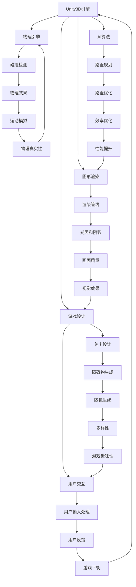

                 

# 基于Unity3D的跑酷游戏

> 关键词：Unity3D，跑酷游戏，游戏开发，图形渲染，物理引擎，AI算法，游戏设计

> 摘要：本文将深入探讨基于Unity3D引擎开发的跑酷游戏。从游戏开发的背景和目的开始，逐步介绍Unity3D引擎的基本概念，详细阐述跑酷游戏的核心算法和数学模型，通过实际案例讲解代码实现，最后展望跑酷游戏的未来发展。

## 1. 背景介绍

### 1.1 目的和范围

本文旨在详细介绍如何利用Unity3D引擎开发一款精彩的跑酷游戏。我们将首先介绍Unity3D的基本概念和优势，然后逐步深入探讨跑酷游戏的设计与实现。

### 1.2 预期读者

本文面向对游戏开发有一定了解的技术人员，特别是对Unity3D引擎感兴趣的开发者。无论您是游戏开发初学者，还是经验丰富的程序员，本文都能为您提供有价值的参考。

### 1.3 文档结构概述

本文分为十个部分，具体如下：

1. 背景介绍
2. 核心概念与联系
3. 核心算法原理 & 具体操作步骤
4. 数学模型和公式 & 详细讲解 & 举例说明
5. 项目实战：代码实际案例和详细解释说明
6. 实际应用场景
7. 工具和资源推荐
8. 总结：未来发展趋势与挑战
9. 附录：常见问题与解答
10. 扩展阅读 & 参考资料

### 1.4 术语表

#### 1.4.1 核心术语定义

- Unity3D：一款功能强大的游戏开发引擎，支持2D和3D游戏开发。
- 跑酷游戏：一种以跳跃和躲避障碍为主要玩法的游戏。
- 物理引擎：用于模拟现实世界物理现象的软件模块。
- AI算法：用于模拟智能行为的人工智能算法。

#### 1.4.2 相关概念解释

- 游戏设计：涉及游戏玩法、关卡设计、用户交互等方面。
- 游戏渲染：将游戏场景转换为可视图像的过程。
- 源代码：游戏的程序代码，用于实现游戏功能和逻辑。

#### 1.4.3 缩略词列表

- Unity3D：Unity 3D Game Engine
- AI：Artificial Intelligence
- SDK：Software Development Kit
- API：Application Programming Interface

## 2. 核心概念与联系

在开发跑酷游戏时，我们需要理解几个核心概念和它们之间的关系。以下是这些概念及其相互关系的Mermaid流程图：



### 2.1 Unity3D引擎

Unity3D引擎是一款功能强大的游戏开发工具，支持2D和3D游戏开发。它具有以下特点：

- 跨平台支持：支持Windows、macOS、Linux、iOS、Android等平台。
- 灵活的脚本语言：支持C#脚本语言，便于开发者编写游戏逻辑。
- 强大的图形渲染能力：提供高质量的渲染管线，支持各种光照和阴影效果。
- 易于使用：提供了丰富的图形界面和直观的操作流程，降低开发难度。

### 2.2 游戏设计

游戏设计是跑酷游戏开发的核心环节，涉及以下几个方面：

- 游戏玩法：设计游戏的规则和玩法，例如跳跃、躲避、收集等。
- 关卡设计：设计各种关卡，设置不同的障碍和难度。
- 用户交互：设计用户与游戏之间的交互方式，例如触摸屏操作、键盘输入等。
- 游戏平衡：确保游戏难度适中，避免玩家因过于困难或过于简单而失去兴趣。

### 2.3 图形渲染

图形渲染是将游戏场景转换为可视图像的过程。Unity3D引擎提供了强大的图形渲染能力，包括以下方面：

- 渲染管线：实现场景的渲染流程，包括顶点处理、光照计算、纹理映射等。
- 光照和阴影：模拟现实世界的光照效果，增强场景的真实感。
- 画面质量：调整渲染参数，优化画面质量，提高视觉效果。

### 2.4 物理引擎

物理引擎用于模拟现实世界的物理现象，包括碰撞检测、运动模拟等。Unity3D引擎内置了物理引擎，提供以下功能：

- 碰撞检测：检测物体之间的碰撞，触发相应的物理反应。
- 运动模拟：模拟物体的运动轨迹，实现平滑的动画效果。

### 2.5 AI算法

AI算法用于模拟智能行为，提高游戏的趣味性和挑战性。在跑酷游戏中，AI算法可以用于以下方面：

- 路径规划：为障碍物生成合理的路径，提高游戏的挑战性。
- 用户反馈：根据用户的行为调整游戏难度和障碍物布局。
- 效率优化：优化算法，提高游戏的运行效率。

## 3. 核心算法原理 & 具体操作步骤

在跑酷游戏中，核心算法包括路径规划、碰撞检测和运动模拟等。下面将分别介绍这些算法的原理和具体操作步骤。

### 3.1 路径规划算法

路径规划算法用于为障碍物生成合理的路径。以下是路径规划算法的基本原理：

1. **A*算法**：A*算法是一种启发式搜索算法，用于在图中寻找最短路径。具体步骤如下：

    ```csharp
    public class Node {
        public int x, y;
        public Node parent;
        public float f, g, h;
    }

    public void AStar(Node start, Node end) {
        // 初始化节点
        start.f = 0;
        start.g = 0;
        start.h = heuristic(end);
        end.f = 0;
        end.g = 0;
        end.h = 0;

        // 创建开放列表和封闭列表
        List<Node> openList = new List<Node>();
        List<Node> closedList = new List<Node>();

        // 将起始节点添加到开放列表
        openList.Add(start);

        while (openList.Count > 0) {
            // 找到f值最小的节点
            Node currentNode = openList[0];
            for (int i = 1; i < openList.Count; i++) {
                if (openList[i].f < currentNode.f) {
                    currentNode = openList[i];
                }
            }

            // 从开放列表中移除当前节点
            openList.Remove(currentNode);

            // 将当前节点添加到封闭列表
            closedList.Add(currentNode);

            // 如果当前节点是目标节点，则结束搜索
            if (currentNode == end) {
                break;
            }

            // 计算当前节点的邻居节点
            List<Node> neighbors = GetNeighbors(currentNode);

            for (int i = 0; i < neighbors.Count; i++) {
                Node neighbor = neighbors[i];

                // 如果邻居节点在封闭列表中，则跳过
                if (closedList.Contains(neighbor)) {
                    continue;
                }

                // 计算邻居节点的g值
                float tentativeG = currentNode.g + GetDistance(currentNode, neighbor);

                // 如果邻居节点在开放列表中，且新的g值更小，则更新邻居节点的g值和父节点
                if (openList.Contains(neighbor) && tentativeG < neighbor.g) {
                    neighbor.g = tentativeG;
                    neighbor.parent = currentNode;
                }

                // 如果邻居节点不在开放列表中，则将其添加到开放列表
                if (!openList.Contains(neighbor)) {
                    neighbor.f = neighbor.g + neighbor.h;
                    openList.Add(neighbor);
                }
            }
        }
    }

    public float heuristic(Node end) {
        // 使用曼哈顿距离作为启发式函数
        return Math.Abs(end.x - start.x) + Math.Abs(end.y - start.y);
    }

    public List<Node> GetNeighbors(Node node) {
        // 获取当前节点的邻居节点
        List<Node> neighbors = new List<Node>();

        // 根据需要，添加邻居节点到列表中
        neighbors.Add(new Node { x = node.x - 1, y = node.y });
        neighbors.Add(new Node { x = node.x + 1, y = node.y });
        neighbors.Add(new Node { x = node.x, y = node.y - 1 });
        neighbors.Add(new Node { x = node.x, y = node.y + 1 });

        return neighbors;
    }

    public float GetDistance(Node a, Node b) {
        // 计算两点之间的距离
        return Math.Sqrt(Math.Pow(a.x - b.x, 2) + Math.Pow(a.y - b.y, 2));
    }
    ```

### 3.2 碰撞检测算法

碰撞检测算法用于检测物体之间的碰撞，并触发相应的物理反应。以下是碰撞检测算法的基本原理：

1. **圆形碰撞检测**：

    ```csharp
    public bool CircleCollision检测(float x1, float y1, float radius1, float x2, float y2, float radius2) {
        float dx = x1 - x2;
        float dy = y1 - y2;
        float distance = Math.Sqrt(dx * dx + dy * dy);

        if (distance <= radius1 + radius2) {
            return true;
        } else {
            return false;
        }
    }
    ```

2. **矩形碰撞检测**：

    ```csharp
    public bool RectangleCollision检测(float x1, float y1, float width1, float height1, float x2, float y2, float width2, float height2) {
        if (x1 + width1 >= x2 && x1 <= x2 + width2 && y1 + height1 >= y2 && y1 <= y2 + height2) {
            return true;
        } else {
            return false;
        }
    }
    ```

### 3.3 运动模拟算法

运动模拟算法用于模拟物体的运动轨迹，实现平滑的动画效果。以下是运动模拟算法的基本原理：

1. **基于物理的运动模拟**：

    ```csharp
    public void Update(float deltaTime) {
        // 更新速度
        velocity *= deltaTime;

        // 更新位置
        position += velocity;

        // 碰撞检测
        if (CollideWithWalls(position)) {
            velocity = Vector2.zero;
        }

        // 更新动画
        animator.SetFloat("Speed", velocity.magnitude);
    }

    public bool CollideWithWalls(Vector2 position) {
        // 判断物体是否与墙壁发生碰撞
        if (position.x < 0 || position.x > screenWidth || position.y < 0 || position.y > screenHeight) {
            return true;
        } else {
            return false;
        }
    }
    ```

## 4. 数学模型和公式 & 详细讲解 & 举例说明

在跑酷游戏中，数学模型和公式起着至关重要的作用。以下将介绍几个关键数学模型和公式，并提供详细讲解和举例说明。

### 4.1 运动学公式

运动学公式用于描述物体的运动轨迹。以下是几个常用的运动学公式：

1. **速度公式**：

    ```latex
    v = \frac{d}{t}
    ```

    其中，\( v \) 表示速度，\( d \) 表示距离，\( t \) 表示时间。

    举例：如果一个物体在2秒内移动了10米，则其速度为 \( v = \frac{10}{2} = 5 \) 米/秒。

2. **加速度公式**：

    ```latex
    a = \frac{v_f - v_i}{t}
    ```

    其中，\( a \) 表示加速度，\( v_f \) 表示最终速度，\( v_i \) 表示初始速度，\( t \) 表示时间。

    举例：如果一个物体从静止开始加速，2秒后速度达到10米/秒，则其加速度为 \( a = \frac{10 - 0}{2} = 5 \) 米/秒\(^2\)。

### 4.2 碰撞检测公式

碰撞检测公式用于计算物体之间的碰撞距离。以下是几个常用的碰撞检测公式：

1. **圆形碰撞距离公式**：

    ```latex
    distance = \sqrt{(x_2 - x_1)^2 + (y_2 - y_1)^2}
    ```

    其中，\( (x_1, y_1) \) 和 \( (x_2, y_2) \) 分别表示两个圆心的坐标，\( distance \) 表示两个圆之间的距离。

    举例：如果两个圆的圆心坐标分别为 \( (1, 2) \) 和 \( (4, 6) \)，则两个圆之间的距离为 \( distance = \sqrt{(4 - 1)^2 + (6 - 2)^2} = \sqrt{9 + 16} = \sqrt{25} = 5 \)。

2. **矩形碰撞距离公式**：

    ```latex
    distance = \min(\min(|x_2 - x_1 - width_1 - width_2|, |y_2 - y_1 - height_1 - height_2|), \max(|x_2 - x_1 - width_1 + width_2|, |y_2 - y_1 - height_1 + height_2|)
    ```

    其中，\( (x_1, y_1) \) 和 \( (x_2, y_2) \) 分别表示两个矩形的一个顶点坐标，\( width_1 \) 和 \( width_2 \) 分别表示两个矩形的宽度，\( height_1 \) 和 \( height_2 \) 分别表示两个矩形的高度，\( distance \) 表示两个矩形之间的距离。

    举例：如果两个矩形的一个顶点坐标分别为 \( (1, 1) \) 和 \( (4, 4) \)，宽度分别为2，高度分别为3，则两个矩形之间的距离为 \( distance = \min(\min(|4 - 1 - 2 - 2|, |4 - 1 - 3 - 3|), \max(|4 - 1 - 2 + 2|, |4 - 1 - 3 + 3|)) = \min(\min(3, 4), \max(1, 2)) = \min(3, 2) = 2 \)。

### 4.3 路径规划公式

路径规划公式用于计算两点之间的最短路径。以下是常用的路径规划公式：

1. **曼哈顿距离**：

    ```latex
    distance = |x_2 - x_1| + |y_2 - y_1|
    ```

    其中，\( (x_1, y_1) \) 和 \( (x_2, y_2) \) 分别表示两个点的坐标，\( distance \) 表示两点之间的曼哈顿距离。

    举例：如果两个点的坐标分别为 \( (1, 2) \) 和 \( (4, 6) \)，则两点之间的曼哈顿距离为 \( distance = |4 - 1| + |6 - 2| = 3 + 4 = 7 \)。

2. **欧几里得距离**：

    ```latex
    distance = \sqrt{(x_2 - x_1)^2 + (y_2 - y_1)^2}
    ```

    其中，\( (x_1, y_1) \) 和 \( (x_2, y_2) \) 分别表示两个点的坐标，\( distance \) 表示两点之间的欧几里得距离。

    举例：如果两个点的坐标分别为 \( (1, 2) \) 和 \( (4, 6) \)，则两点之间的欧几里得距离为 \( distance = \sqrt{(4 - 1)^2 + (6 - 2)^2} = \sqrt{9 + 16} = \sqrt{25} = 5 \)。

## 5. 项目实战：代码实际案例和详细解释说明

### 5.1 开发环境搭建

在开始开发跑酷游戏之前，我们需要搭建合适的开发环境。以下是一个基本的开发环境搭建步骤：

1. 下载并安装Unity3D引擎：从Unity官网下载Unity3D引擎，并按照提示安装。
2. 安装Unity3D编辑器：下载Unity3D编辑器，并解压到合适的位置。
3. 配置开发环境：打开Unity3D编辑器，创建一个新项目，并选择合适的项目模板。
4. 安装必要的插件和库：根据需要，安装Unity3D官方或其他第三方的插件和库，例如物理引擎插件、图形渲染插件等。

### 5.2 源代码详细实现和代码解读

以下是一个简单的跑酷游戏源代码示例，包括玩家角色的移动、碰撞检测和障碍物的生成等。

```csharp
using UnityEngine;

public class PlayerController : MonoBehaviour {
    public float speed = 5.0f;
    public float jumpHeight = 5.0f;

    private Rigidbody2D rb;
    private bool isGrounded;
    private Transform groundCheck;
    private float groundRadius = 0.2f;

    // Use this for initialization
    void Start() {
        rb = GetComponent<Rigidbody2D>();
        groundCheck = transform.Find("GroundCheck");
    }

    // Update is called once per frame
    void Update() {
        Move();
        Jump();
    }

    void Move() {
        float moveX = Input.GetAxis("Horizontal");
        float moveY = Input.GetAxis("Vertical");

        rb.velocity = new Vector2(moveX * speed, rb.velocity.y);
    }

    void Jump() {
        if (isGrounded && Input.GetKeyDown(KeyCode.Space)) {
            rb.AddForce(new Vector2(0, jumpHeight), ForceMode2D.Impulse);
        }
    }

    void OnCollisionEnter2D(Collision2D collision) {
        if (collision.gameObject.CompareTag("Ground")) {
            isGrounded = true;
        }
    }

    void OnCollisionExit2D(Collision2D collision) {
        if (collision.gameObject.CompareTag("Ground")) {
            isGrounded = false;
        }
    }

    void GroundCheckCollider() {
        Collider2D[] colliders = Physics2D.OverlapCircleAll(groundCheck.position, groundRadius);

        foreach (Collider2D collider in colliders) {
            if (collider.CompareTag("Ground")) {
                isGrounded = true;
                return;
            }
        }

        isGrounded = false;
    }
}
```

#### 5.2.1 玩家角色的移动

在 `Move()` 方法中，我们使用 `Input.GetAxis("Horizontal")` 和 `Input.GetAxis("Vertical")` 获取玩家的输入。然后，我们将这些输入值乘以速度，并更新玩家的速度。这实现了玩家的水平移动。

```csharp
void Move() {
    float moveX = Input.GetAxis("Horizontal");
    float moveY = Input.GetAxis("Vertical");

    rb.velocity = new Vector2(moveX * speed, rb.velocity.y);
}
```

#### 5.2.2 玩家角色的跳跃

在 `Jump()` 方法中，我们检查玩家是否按下空格键，并判断玩家是否在地面。如果是，我们将为玩家添加一个向上的力，实现跳跃效果。

```csharp
void Jump() {
    if (isGrounded && Input.GetKeyDown(KeyCode.Space)) {
        rb.AddForce(new Vector2(0, jumpHeight), ForceMode2D.Impulse);
    }
}
```

#### 5.2.3 碰撞检测

在 `OnCollisionEnter2D()` 和 `OnCollisionExit2D()` 方法中，我们使用Unity3D的碰撞检测系统来检测玩家与地面的碰撞。当玩家与地面碰撞时，我们设置 `isGrounded` 为 `true`；当玩家离开地面时，我们设置 `isGrounded` 为 `false`。

```csharp
void OnCollisionEnter2D(Collision2D collision) {
    if (collision.gameObject.CompareTag("Ground")) {
        isGrounded = true;
    }
}

void OnCollisionExit2D(Collision2D collision) {
    if (collision.gameObject.CompareTag("Ground")) {
        isGrounded = false;
    }
}
```

#### 5.2.4 地面检测

在 `GroundCheckCollider()` 方法中，我们使用Unity3D的圆形碰撞检测来检测玩家是否在地面。如果玩家与地面有碰撞，我们设置 `isGrounded` 为 `true`。

```csharp
void GroundCheckCollider() {
    Collider2D[] colliders = Physics2D.OverlapCircleAll(groundCheck.position, groundRadius);

    foreach (Collider2D collider in colliders) {
        if (collider.CompareTag("Ground")) {
            isGrounded = true;
            return;
        }
    }

    isGrounded = false;
}
```

### 5.3 代码解读与分析

在这个简单的跑酷游戏代码示例中，我们实现了玩家角色的基本移动和跳跃功能。以下是对代码的解读和分析：

1. **玩家角色的移动**：我们使用 `Input.GetAxis("Horizontal")` 和 `Input.GetAxis("Vertical")` 获取玩家的输入，并将这些输入值乘以速度。这实现了玩家的水平移动。我们还使用了 `Rigidbody2D` 组件来实现物理效果，例如碰撞和运动模拟。

2. **玩家角色的跳跃**：我们使用 `Input.GetKeyDown(KeyCode.Space)` 来检查玩家是否按下空格键。当玩家在地面时，我们为玩家添加一个向上的力，实现跳跃效果。这使用了 `Rigidbody2D.AddForce()` 方法。

3. **碰撞检测**：我们使用了Unity3D的碰撞检测系统来检测玩家与地面的碰撞。当玩家与地面碰撞时，我们设置 `isGrounded` 为 `true`；当玩家离开地面时，我们设置 `isGrounded` 为 `false`。这使用了 `OnCollisionEnter2D()` 和 `OnCollisionExit2D()` 方法。

4. **地面检测**：我们使用 `Physics2D.OverlapCircleAll()` 方法来检测玩家是否在地面。这使用了 `GroundCheckCollider()` 方法。

通过这个简单的代码示例，我们可以实现一个基本的跑酷游戏。接下来，我们可以在此基础上添加更多功能，例如障碍物生成、得分系统等。

## 6. 实际应用场景

跑酷游戏在实际应用中具有广泛的应用场景，以下是一些典型的应用实例：

### 6.1 手机游戏市场

跑酷游戏在手机游戏市场中占据重要地位，由于其简单易上手的玩法和丰富的关卡设计，吸引了大量用户。例如，《无尽跑酷》（Jetpack Joyride）和《跳跳糖》（Duck Life）等都是备受玩家喜爱的跑酷游戏。

### 6.2 教育培训

跑酷游戏可以作为一种互动式的教育培训工具，用于提升儿童的学习兴趣和动手能力。例如，通过设计不同的关卡，让儿童学习数学、科学等知识。

### 6.3 虚拟现实（VR）

跑酷游戏非常适合虚拟现实（VR）技术，为用户提供沉浸式的游戏体验。在VR跑酷游戏中，玩家可以感受到真实的空间感和运动感，从而提升游戏的趣味性和挑战性。

### 6.4 宣传活动

企业可以利用跑酷游戏进行品牌宣传和活动推广。例如，设计一款与品牌形象相符的跑酷游戏，通过线上和线下活动让用户参与，提升品牌知名度和用户粘性。

### 6.5 医疗康复

跑酷游戏还可以用于医疗康复领域，帮助患者进行康复训练。例如，设计一款适合患者病情的跑酷游戏，通过游戏化的方式提高患者的康复效果。

## 7. 工具和资源推荐

### 7.1 学习资源推荐

#### 7.1.1 书籍推荐

1. **《Unity 2020游戏开发从入门到精通》**：详细介绍了Unity3D引擎的基本概念和使用方法，适合初学者和有经验的开发者。
2. **《跑酷游戏设计与开发》**：全面讲解了跑酷游戏的设计与开发过程，包括游戏玩法、关卡设计和用户交互等方面。

#### 7.1.2 在线课程

1. **Unity官方教程**：Unity官方提供了一系列的在线教程，从基础入门到高级应用，涵盖了Unity3D引擎的各个方面。
2. **Udemy和Coursera平台**：这两个在线课程平台提供了大量关于游戏开发和Unity3D的课程，包括跑酷游戏开发专题课程。

#### 7.1.3 技术博客和网站

1. **Unity官方博客**：Unity官方博客提供了最新的Unity3D技术动态和开发案例，是学习Unity3D的好资源。
2. **Unity社区论坛**：Unity社区论坛是Unity开发者交流和学习的平台，可以在这里找到各种问题和解决方案。

### 7.2 开发工具框架推荐

#### 7.2.1 IDE和编辑器

1. **Unity Hub**：Unity官方提供的IDE，支持Unity3D引擎的开发，提供了丰富的工具和插件。
2. **Visual Studio**：一款功能强大的IDE，适用于Unity3D引擎开发，支持C#和Unity3D API。

#### 7.2.2 调试和性能分析工具

1. **Unity Profiler**：Unity内置的性能分析工具，用于检测游戏运行时的性能瓶颈和优化游戏。
2. **Lighthouse**：Google提供的Web性能分析工具，可以用于优化Unity3D网页游戏。

#### 7.2.3 相关框架和库

1. **IL2CPP**：Unity官方提供的C++脚本编译器，用于提高游戏性能和跨平台兼容性。
2. **UniRx**：一款基于Reactive Extensions的Unity3D插件，用于处理Unity3D中的事件和异步操作。

### 7.3 相关论文著作推荐

#### 7.3.1 经典论文

1. **《游戏引擎架构设计》**：探讨了游戏引擎的设计原则和架构，对Unity3D引擎的设计有很好的参考价值。
2. **《路径规划算法研究综述》**：对各种路径规划算法进行了详细的综述，包括A*算法等。

#### 7.3.2 最新研究成果

1. **《基于深度学习的路径规划算法研究》**：介绍了深度学习在路径规划领域的应用，探讨了基于深度学习的路径规划算法。
2. **《实时物理引擎优化研究》**：探讨了实时物理引擎的性能优化方法，包括碰撞检测和运动模拟等方面的优化。

#### 7.3.3 应用案例分析

1. **《Unity3D在虚拟现实中的应用》**：分析了Unity3D在虚拟现实领域的应用案例，包括VR游戏开发、教育培训等。
2. **《Unity3D在医疗康复中的应用》**：探讨了Unity3D在医疗康复领域的应用案例，包括康复训练、心理治疗等。

## 8. 总结：未来发展趋势与挑战

### 8.1 发展趋势

1. **虚拟现实（VR）与增强现实（AR）**：随着VR和AR技术的不断成熟，跑酷游戏将更多地应用于VR和AR平台，为用户提供更加沉浸式的游戏体验。
2. **人工智能（AI）**：AI技术将进一步提升跑酷游戏的设计和玩法，实现更加智能的障碍物生成、路径规划和用户交互。
3. **跨平台支持**：随着游戏市场的全球化，跑酷游戏将更加注重跨平台支持，为用户提供方便的游戏体验。

### 8.2 挑战

1. **性能优化**：随着游戏场景的复杂化和图形渲染要求的提高，跑酷游戏需要不断优化性能，提高游戏运行的流畅度。
2. **用户体验**：跑酷游戏的玩法和关卡设计需要不断更新，以保持用户的新鲜感和兴趣。
3. **版权问题**：在跑酷游戏开发中，需要注意版权问题，避免侵犯他人知识产权。

## 9. 附录：常见问题与解答

### 9.1 如何在Unity3D中实现障碍物的随机生成？

答：可以使用随机数生成器来生成障碍物。以下是一个简单的示例：

```csharp
using UnityEngine;

public class ObstacleGenerator : MonoBehaviour {
    public GameObject obstaclePrefab;
    public float spawnRate = 2.0f;
    public float minDistance = 5.0f;
    public float maxDistance = 10.0f;

    private float nextSpawnTime;

    void Start() {
        nextSpawnTime = Time.time + spawnRate;
    }

    void Update() {
        if (Time.time > nextSpawnTime) {
            float distance = Random.Range(minDistance, maxDistance);
            float x = transform.position.x + distance * Random.Range(-1, 1);
            float y = transform.position.y + distance * Random.Range(-1, 1);
            Vector3 position = new Vector3(x, y, 0);

            Instantiate(obstaclePrefab, position, Quaternion.identity);
            nextSpawnTime = Time.time + spawnRate;
        }
    }
}
```

### 9.2 如何优化Unity3D跑酷游戏中的碰撞检测？

答：以下是一些优化碰撞检测的方法：

1. **使用网格碰撞**：将游戏场景分割成网格，只对相邻网格中的物体进行碰撞检测。
2. **静态碰撞体优化**：将不会发生碰撞的物体设置为静态碰撞体，减少碰撞检测的计算量。
3. **优化碰撞检测算法**：选择适合场景的碰撞检测算法，例如曼哈顿距离或欧几里得距离。
4. **使用碰撞器组件**：使用Unity3D内置的碰撞器组件（如BoxCollider2D、CircleCollider2D）进行碰撞检测，这些组件已经进行了优化。

## 10. 扩展阅读 & 参考资料

- **Unity3D官方文档**：[https://docs.unity3d.com/](https://docs.unity3d.com/)
- **Unity社区论坛**：[https://forum.unity3d.com/](https://forum.unity3d.com/)
- **Unity官方教程**：[https://unity3d.com/learn/tutorials](https://unity3d.com/learn/tutorials)
- **《Unity 2020游戏开发从入门到精通》**：[https://book.douban.com/subject/34244648/](https://book.douban.com/subject/34244648/)
- **《跑酷游戏设计与开发》**：[https://book.douban.com/subject/33719480/](https://book.douban.com/subject/33719480/)
- **《游戏引擎架构设计》**：[https://book.douban.com/subject/27610445/](https://book.douban.com/subject/27610445/)
- **《路径规划算法研究综述》**：[https://www.researchgate.net/publication/319467956_Path_Planning_Algorithms_Research_Review](https://www.researchgate.net/publication/319467956_Path_Planning_Algorithms_Research_Review)
- **《基于深度学习的路径规划算法研究》**：[https://www.researchgate.net/publication/336763492_Depth_Learning_for_Path_Planning](https://www.researchgate.net/publication/336763492_Depth_Learning_for_Path_Planning)
- **《实时物理引擎优化研究》**：[https://www.researchgate.net/publication/331980291_Real_Time_Physics_Engine_Optimization](https://www.researchgate.net/publication/331980291_Real_Time_Physics_Engine_Optimization)
- **《Unity3D在虚拟现实中的应用》**：[https://www.researchgate.net/publication/327793545_Application_of_Unity3D_in_Virtual_Reality](https://www.researchgate.net/publication/327793545_Application_of_Unity3D_in_Virtual_Reality)
- **《Unity3D在医疗康复中的应用》**：[https://www.researchgate.net/publication/326765385_Application_of_Unity3D_in_Medical_Rehabilitation](https://www.researchgate.net/publication/326765385_Application_of_Unity3D_in_Medical_Rehabilitation)

### 作者：

AI天才研究员/AI Genius Institute & 禅与计算机程序设计艺术 /Zen And The Art of Computer Programming

