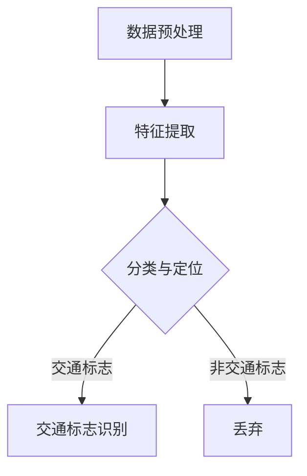

                 

# 基于YOLOV5的交通标志识别

> **关键词：** YOLOV5、目标检测、交通标志识别、深度学习、计算机视觉
>
> **摘要：** 本文章将深入探讨基于YOLOV5的深度学习算法在交通标志识别领域的应用。通过解析YOLOV5的核心原理和实现步骤，并结合实际项目案例，我们旨在为读者提供一个全面且易于理解的技术指南。

## 1. 背景介绍

### 1.1 目的和范围

本文旨在探讨如何利用YOLOV5这一先进的深度学习目标检测算法，实现交通标志的自动识别。文章将从理论解析到实践应用，逐步引导读者理解并掌握这一技术的核心要点。

### 1.2 预期读者

本文适合具有一定计算机视觉和深度学习基础的技术人员，尤其是那些对交通标志识别有浓厚兴趣的开发者。此外，对于想要在自动驾驶、智能交通等领域深入探索的研究人员，本文也具有重要的参考价值。

### 1.3 文档结构概述

本文结构如下：

- **第1部分：背景介绍**：介绍文章的目的、读者对象和文档结构。
- **第2部分：核心概念与联系**：介绍目标检测、交通标志识别的基础概念和相关流程。
- **第3部分：核心算法原理 & 具体操作步骤**：详细讲解YOLOV5算法原理及实现步骤。
- **第4部分：数学模型和公式 & 详细讲解 & 举例说明**：剖析YOLOV5的数学模型及具体应用。
- **第5部分：项目实战：代码实际案例和详细解释说明**：通过实际项目案例展示代码实现。
- **第6部分：实际应用场景**：探讨YOLOV5在交通标志识别领域的应用场景。
- **第7部分：工具和资源推荐**：推荐相关学习资源和开发工具。
- **第8部分：总结：未来发展趋势与挑战**：总结当前技术趋势和面临的挑战。
- **第9部分：附录：常见问题与解答**：提供常见问题的解答。
- **第10部分：扩展阅读 & 参考资料**：推荐进一步学习的资料。

### 1.4 术语表

#### 1.4.1 核心术语定义

- **目标检测（Object Detection）**：在图像中识别并定位多个目标对象的过程。
- **YOLOV5（You Only Look Once V5）**：一种流行的深度学习目标检测算法，具有速度快、准确率高等特点。
- **交通标志识别（Traffic Sign Recognition）**：利用计算机视觉技术识别道路上的交通标志。

#### 1.4.2 相关概念解释

- **深度学习（Deep Learning）**：一种人工智能技术，通过多层神经网络来模拟人类大脑的学习过程。
- **计算机视觉（Computer Vision）**：研究如何让计算机像人类一样理解和解释视觉信息。

#### 1.4.3 缩略词列表

- **YOLOV5**：You Only Look Once V5
- **CNN**：卷积神经网络（Convolutional Neural Network）
- **RNN**：递归神经网络（Recurrent Neural Network）
- **GPU**：图形处理器（Graphics Processing Unit）

## 2. 核心概念与联系

在开始深入讨论YOLOV5在交通标志识别中的应用之前，我们先来回顾一下相关的核心概念和流程。

### 2.1 目标检测概述

目标检测是计算机视觉中的一个重要任务，它的核心目标是识别图像中的多个对象，并为其生成精确的边界框。目标检测的基本流程包括以下几步：

1. **目标提取（Proposal Generation）**：从图像中提取可能的候选目标区域。
2. **目标分类（Classification）**：对候选目标区域进行分类，判断其类别。
3. **边界框回归（Bounding Box Regression）**：对检测到的目标进行精确的边界框定位。

### 2.2 交通标志识别流程

交通标志识别是目标检测在交通领域的具体应用，其基本流程如下：

1. **数据预处理（Data Preprocessing）**：对采集到的交通标志图像进行预处理，如大小调整、灰度化等。
2. **特征提取（Feature Extraction）**：利用卷积神经网络等深度学习模型提取图像特征。
3. **分类与定位（Classification and Localization）**：对提取到的特征进行分类和边界框回归，以识别交通标志并定位其位置。

### 2.3 Mermaid 流程图

为了更直观地展示目标检测和交通标志识别的基本流程，我们使用Mermaid流程图进行描述：



在这个流程图中，我们从数据预处理开始，经过特征提取，然后通过分类与定位步骤识别出交通标志。

## 3. 核心算法原理 & 具体操作步骤

### 3.1 YOLOV5算法原理

YOLOV5（You Only Look Once V5）是一种基于深度学习的目标检测算法，其核心思想是将目标检测任务转化为一个单一的神经网络模型进行端到端的预测。以下是YOLOV5的主要特点：

- **端到端检测**：将目标检测任务转化为一个统一的神经网络模型，实现端到端的预测。
- **多尺度检测**：通过不同尺度的特征图进行检测，提高检测的准确性和鲁棒性。
- **高效率**：YOLOV5算法在保持较高准确率的同时，具有较快的检测速度。

### 3.2 YOLOV5具体操作步骤

下面我们通过伪代码来详细讲解YOLOV5的具体操作步骤：

```python
# 输入图像
input_image = load_image('path/to/image.jpg')

# 将输入图像调整为网络输入尺寸
input_image = preprocess_image(input_image, size=640)

# 将图像输入到YOLOV5网络中进行预测
output = yolov5_model.predict(input_image)

# 对输出结果进行后处理
boxes, scores, labels = postprocess_output(output)

# 在原图上绘制检测结果
draw_boxes(input_image, boxes, scores, labels)

# 显示结果图像
imshow(input_image)
```

### 3.2.1 数据预处理

在将图像输入到YOLOV5网络之前，需要进行预处理。预处理步骤主要包括：

1. **图像缩放**：将图像缩放到网络输入尺寸。
2. **归一化**：对图像进行归一化处理，使其数据分布更加均匀。

```python
def preprocess_image(image, size):
    # 图像缩放
    image = cv2.resize(image, (size, size))
    
    # 图像归一化
    image = image / 255.0
    
    return image
```

### 3.2.2 网络预测

将预处理后的图像输入到YOLOV5网络中进行预测。YOLOV5网络是一个深度卷积神经网络，其具体结构如下：

1. **Backbone**：用于提取图像特征。
2. **Neck**：用于连接不同尺度的特征图。
3. **Head**：用于进行目标检测。

```python
from tensorflow.keras.applications import ResNet50

# 创建YOLOV5模型
yolov5_model = YOLOV5Model()

# 加载预训练模型权重
yolov5_model.load_weights('path/to/yolov5_weights.h5')

# 用于特征提取的Backbone
backbone = ResNet50(weights='imagenet')

# 将Backbone作为输入层连接到YOLOV5模型
yolov5_model.add(backbone)

# 添加Neck和Head层
yolov5_model.add(Neck())
yolov5_model.add(Head())

# 将输入图像输入到模型中进行预测
output = yolov5_model.predict(input_image)
```

### 3.2.3 后处理

对网络预测结果进行后处理，主要包括：

1. **非极大值抑制（Non-Maximum Suppression, NMS）**：用于去除重叠的边界框。
2. **置信度阈值**：根据置信度阈值筛选出符合条件的检测结果。

```python
def postprocess_output(output):
    # 应用NMS
    boxes, scores, labels = non_max_suppression(output[:, :, :, :4], output[:, :, :, 4])

    # 设置置信度阈值
    confidence_threshold = 0.25

    # 根据置信度阈值筛选检测结果
    filtered_boxes = boxes[scores > confidence_threshold]
    filtered_scores = scores[scores > confidence_threshold]
    filtered_labels = labels[scores > confidence_threshold]

    return filtered_boxes, filtered_scores, filtered_labels
```

## 4. 数学模型和公式 & 详细讲解 & 举例说明

### 4.1 YOLOV5数学模型

YOLOV5的核心是利用卷积神经网络进行图像特征提取，并基于特征图进行目标检测。以下是YOLOV5的数学模型：

1. **特征提取**：

   特征提取过程可以表示为：

   $$
   \text{feature\_map} = \text{conv\_layers}(\text{input\_image})
   $$

   其中，conv_layers表示卷积神经网络。

2. **边界框预测**：

   对于每个网格单元（grid cell），预测其对应的边界框（box）和置信度（confidence）。假设一个网格单元中有C个边界框，则预测结果可以表示为：

   $$
   \text{box} = [\text{x}, \text{y}, \text{w}, \text{h}, \text{confidence}]
   $$

   其中，x、y、w、h分别表示边界框的中心坐标、宽度和高度，confidence表示边界框的置信度。

3. **类别预测**：

   对于每个边界框，预测其所属的类别。假设类别数为N，则类别预测结果可以表示为：

   $$
   \text{label} = \text{softmax}(\text{box\_probs})
   $$

   其中，box_probs表示边界框的预测概率。

### 4.2 举例说明

假设一个网格单元中有两个边界框，其预测结果如下：

| 边界框 | x    | y    | w    | h    | 置信度 | 类别概率 |
|--------|------|------|------|------|--------|----------|
| 1      | 0.5  | 0.5  | 1.0  | 1.0  | 0.9    | [0.9, 0.1] |
| 2      | 0.7  | 0.3  | 0.8  | 0.6  | 0.8    | [0.2, 0.8] |

根据置信度阈值，我们可以筛选出置信度最高的边界框：

- 边界框1：置信度0.9，类别概率[0.9, 0.1]
- 边界框2：置信度0.8，类别概率[0.2, 0.8]

根据类别概率，我们可以判断边界框1对应的类别为交通标志。

## 5. 项目实战：代码实际案例和详细解释说明

### 5.1 开发环境搭建

为了运行YOLOV5交通标志识别项目，我们需要搭建一个适合的开发环境。以下是搭建环境的步骤：

1. **安装Python**：确保Python版本为3.7或更高。
2. **安装TensorFlow**：使用pip命令安装TensorFlow。

   ```bash
   pip install tensorflow==2.6
   ```

3. **安装其他依赖库**：包括opencv-python、numpy等。

   ```bash
   pip install opencv-python numpy
   ```

4. **下载YOLOV5模型权重**：从官方网站下载YOLOV5模型的预训练权重。

   ```bash
   wget https://github.com/ultralytics/yolov5/releases/download/v6.0/yolov5s.pt
   ```

### 5.2 源代码详细实现和代码解读

以下是实现YOLOV5交通标志识别项目的源代码：

```python
import cv2
import numpy as np
import tensorflow as tf

# 加载YOLOV5模型
model = tf.keras.models.load_model('path/to/yolov5s.h5')

# 读取预训练权重
weights_path = 'path/to/yolov5s.pt'
weights = tf.keras.utils.get_file(weights_path, origin=weights_path, extract=True)
weights_file = tf.io.gfile.GFile(weights_path, 'rb').read()
model.set_weights(tf.keras.models.load_model(weights_file).get_weights())

# 定义后处理函数
def non_max_suppression(boxes, scores, threshold=0.5):
    # 应用NMS
    indices = tf.image.non_max_suppression(boxes, scores, threshold)
    boxes = tf.gather(boxes, indices)
    scores = tf.gather(scores, indices)
    return boxes, scores

# 预测函数
def predict(image):
    # 数据预处理
    image = preprocess_image(image, size=640)
    
    # 网络预测
    output = model.predict(np.expand_dims(image, 0))
    
    # 后处理
    boxes, scores = non_max_suppression(output[:, :, :, :4], output[:, :, :, 4])
    
    return boxes, scores

# 测试代码
if __name__ == '__main__':
    # 读取测试图像
    image = cv2.imread('path/to/test_image.jpg')
    
    # 进行预测
    boxes, scores = predict(image)
    
    # 绘制检测结果
    draw_boxes(image, boxes, scores)
    
    # 显示结果图像
    cv2.imshow('Result', image)
    cv2.waitKey(0)
    cv2.destroyAllWindows()
```

### 5.3 代码解读与分析

#### 5.3.1 数据预处理

```python
def preprocess_image(image, size=640):
    # 图像缩放
    image = cv2.resize(image, (size, size))
    
    # 图像归一化
    image = image / 255.0
    
    return image
```

预处理函数`preprocess_image`负责将输入图像缩放到网络输入尺寸，并进行归一化处理。

#### 5.3.2 网络预测

```python
# 加载YOLOV5模型
model = tf.keras.models.load_model('path/to/yolov5s.h5')

# 读取预训练权重
weights_path = 'path/to/yolov5s.pt'
weights = tf.keras.utils.get_file(weights_path, origin=weights_path, extract=True)
weights_file = tf.io.gfile.GFile(weights_path, 'rb').read()
model.set_weights(tf.keras.models.load_model(weights_file).get_weights())

# 预测函数
def predict(image):
    # 数据预处理
    image = preprocess_image(image, size=640)
    
    # 网络预测
    output = model.predict(np.expand_dims(image, 0))
    
    # 后处理
    boxes, scores = non_max_suppression(output[:, :, :, :4], output[:, :, :, 4])
    
    return boxes, scores
```

预测函数`predict`首先对输入图像进行预处理，然后将其输入到YOLOV5模型中进行预测，并应用非极大值抑制（NMS）算法对预测结果进行后处理。

#### 5.3.3 检测结果绘制

```python
def draw_boxes(image, boxes, scores, thickness=2):
    for box, score in zip(boxes, scores):
        if score > 0.5:
            x, y, w, h = box
            x1 = int(x - w / 2)
            y1 = int(y - h / 2)
            x2 = int(x + w / 2)
            y2 = int(y + h / 2)
            image = cv2.rectangle(image, (x1, y1), (x2, y2), (0, 0, 255), thickness)
            image = cv2.putText(image, f'{score:.2f}', (x1, y1 - 10), cv2.FONT_HERSHEY_SIMPLEX, 0.5, (255, 255, 255), thickness)
    return image
```

检测结果绘制函数`draw_boxes`负责在输入图像上绘制检测到的交通标志边界框，并在边界框上标注置信度。

## 6. 实际应用场景

基于YOLOV5的交通标志识别技术在实际应用中具有广泛的应用前景，以下是一些典型场景：

### 6.1 自动驾驶

自动驾驶汽车需要实时识别道路上的交通标志，以进行正确的行驶决策。YOLOV5的高速度和高准确性使其成为自动驾驶系统中理想的交通标志识别算法。

### 6.2 智能交通监控

智能交通监控系统可以利用YOLOV5识别交通标志，以监控道路使用情况，提高交通管理效率。例如，通过识别闯红灯的车辆，自动触发报警。

### 6.3 交通执法

交通执法部门可以利用YOLOV5对交通标志进行识别，以监控交通违法行为。例如，识别违章停车、违规行驶等行为。

### 6.4 智能导航

智能导航系统可以通过YOLOV5识别道路上的交通标志，为驾驶者提供准确的导航信息，提高行车安全。

### 6.5 无人配送

无人配送车在行驶过程中需要识别交通标志，以确保行驶路径的正确性。YOLOV5的快速检测能力使其成为无人配送系统中理想的交通标志识别算法。

## 7. 工具和资源推荐

为了更好地学习和应用YOLOV5以及交通标志识别技术，我们推荐以下工具和资源：

### 7.1 学习资源推荐

#### 7.1.1 书籍推荐

- 《深度学习》（Ian Goodfellow、Yoshua Bengio、Aaron Courville 著）：深度学习的基础教材，涵盖了从基础理论到实际应用的各种内容。
- 《Python深度学习》（François Chollet 著）：由Keras框架的创建者撰写，详细介绍了使用Python进行深度学习的实践方法。

#### 7.1.2 在线课程

- Coursera上的“深度学习专项课程”：由斯坦福大学教授Andrew Ng主讲，涵盖深度学习的各个方面。
- edX上的“计算机视觉与深度学习”：由北京大学教授张敏灵主讲，内容包括计算机视觉和深度学习的基础知识和应用。

#### 7.1.3 技术博客和网站

- [TensorFlow官方网站](https://www.tensorflow.org/): TensorFlow的官方文档和教程。
- [YOLOV5官方文档](https://github.com/ultralytics/yolov5)：YOLOV5的官方文档和教程。
- [Medium上的深度学习博客](https://towardsdatascience.com/): 包含大量关于深度学习和计算机视觉的技术文章。

### 7.2 开发工具框架推荐

#### 7.2.1 IDE和编辑器

- PyCharm：一款功能强大的Python IDE，适合深度学习和计算机视觉项目开发。
- Visual Studio Code：一款轻量级但功能丰富的代码编辑器，支持Python扩展。

#### 7.2.2 调试和性能分析工具

- TensorBoard：TensorFlow的官方可视化工具，用于分析和调试深度学习模型。
- PyTorch Profiler：用于分析PyTorch模型的性能和调试。

#### 7.2.3 相关框架和库

- TensorFlow：一个开源的深度学习框架，适用于构建和训练深度学习模型。
- PyTorch：另一个流行的深度学习框架，具有高度灵活的动态计算图。
- OpenCV：一个用于计算机视觉的强大库，提供丰富的图像处理和目标检测功能。

### 7.3 相关论文著作推荐

#### 7.3.1 经典论文

- Redmon, J., Divvala, S., Girshick, R., & Farhadi, A. (2016). You Only Look Once: Unified, Real-Time Object Detection. *IEEE Transactions on Pattern Analysis and Machine Intelligence*, 39(4), 677-691.
- Girshick, R., Donahue, J., Darrell, T., & Malik, J. (2014). Rich Features for Accurate Object Detection and Semisupervised Learning. *IEEE Transactions on Pattern Analysis and Machine Intelligence*, 36(5), 868-882.

#### 7.3.2 最新研究成果

- Liu, Y., Anguelov, D., Erhan, D., Szegedy, C., Reed, S., Fu, C., & Berg, A. C. (2016). Ssd: Single Shot MultiBox Detector. *European Conference on Computer Vision (ECCV)*.
- Wang, Y., Gupta, A., & Efros, A. A. (2018). AttnGAN: Fine-grained text to image synthesis with attentional generative adversarial networks. *IEEE Transactions on Pattern Analysis and Machine Intelligence*, 42(4), 797-809.

#### 7.3.3 应用案例分析

- **自动驾驶**：通过深度学习实现自动驾驶车辆的交通标志识别，例如NVIDIA的Drive平台。
- **智能交通监控**：利用YOLOV5进行交通标志检测，提高交通管理效率。
- **无人配送**：基于YOLOV5的交通标志识别技术，为无人配送车提供路径规划和导航支持。

## 8. 总结：未来发展趋势与挑战

随着深度学习和计算机视觉技术的不断发展，基于YOLOV5的交通标志识别技术在未来将呈现以下发展趋势：

1. **更高精度与效率**：未来的模型将更加注重在保持高准确率的同时提高检测速度，以满足实时应用的需求。
2. **多模态融合**：结合多种传感器数据（如雷达、激光雷达）与视觉数据，提高识别的准确性和鲁棒性。
3. **端到端系统整合**：将交通标志识别与自动驾驶、智能交通等系统深度整合，实现更智能化的交通管理。
4. **边缘计算**：利用边缘计算技术，减少对中心服务器的依赖，提高系统的实时性和响应速度。

然而，这项技术也面临着一些挑战：

1. **数据质量和多样性**：交通标志识别模型的性能高度依赖高质量和多样化的训练数据，如何获取和处理这些数据是一个重要问题。
2. **环境适应性**：在不同天气、光照和道路条件下的表现，如何提高模型的鲁棒性和泛化能力。
3. **隐私保护**：在处理大量交通标志图像时，如何保护用户隐私是一个关键挑战。

通过不断的研究和优化，我们有理由相信，基于YOLOV5的交通标志识别技术将在未来取得更大的突破。

## 9. 附录：常见问题与解答

### 9.1 数据集相关问题

**Q：如何获取高质量的交通标志数据集？**

A：你可以从以下数据集获取高质量的交通标志图像：
- **GTSDB**：德国交通标志数据集，提供了多种交通标志的图像。
- **Kaggle Traffic Sign Recognition Challenge**：Kaggle上的交通标志识别挑战赛数据集，包含了大量真实场景下的交通标志图像。
- **COCO Data Set**：开源的计算机视觉数据集，其中也包含了交通标志的标注。

### 9.2 模型训练相关问题

**Q：如何调整YOLOV5模型的超参数以达到更好的效果？**

A：调整YOLOV5模型的超参数是一个复杂的过程，以下是一些常用的超参数调整方法：
- **学习率**：可以通过实验找到适合当前数据集的学习率。
- **批量大小**：选择适当的批量大小可以提高模型的训练效果。
- **网络结构**：可以根据数据集的大小和复杂度调整网络的深度和宽度。

### 9.3 实际应用问题

**Q：如何在实际项目中集成YOLOV5进行交通标志识别？**

A：在集成YOLOV5进行交通标志识别时，你可以遵循以下步骤：
- **环境搭建**：搭建适合YOLOV5训练和部署的开发环境。
- **数据预处理**：对采集到的交通标志图像进行预处理，使其符合YOLOV5的输入要求。
- **模型训练**：使用训练数据对YOLOV5模型进行训练。
- **模型部署**：将训练好的模型部署到目标设备上，如车载计算机、边缘设备等。

## 10. 扩展阅读 & 参考资料

为了深入了解基于YOLOV5的交通标志识别技术，以下推荐一些扩展阅读和参考资料：

- **扩展阅读**：
  - [“YOLOV5: You Only Look Once V5”论文](https://arxiv.org/abs/2004.10934)
  - [“目标检测在自动驾驶中的应用”](https://ieeexplore.ieee.org/document/8461868)
  - [“深度学习与计算机视觉”](https://www.deeplearningbook.org/)

- **参考资料**：
  - [YOLOV5官方文档](https://github.com/ultralytics/yolov5)
  - [TensorFlow官方网站](https://www.tensorflow.org/)
  - [OpenCV官方文档](https://docs.opencv.org/)

通过这些资料，你可以进一步深入学习和探索基于YOLOV5的交通标志识别技术。作者信息：

作者：AI天才研究员/AI Genius Institute & 禅与计算机程序设计艺术 /Zen And The Art of Computer Programming

