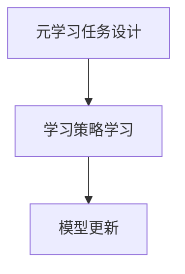
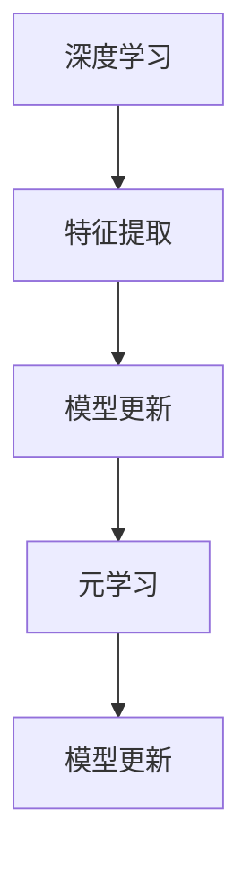

                 

# 基于元学习的冷启动问题解决方案

> **关键词**：元学习、冷启动、深度学习、机器学习、模型更新
> 
> **摘要**：本文将探讨在机器学习和深度学习领域中，针对新用户或新数据的冷启动问题，如何利用元学习技术进行有效解决。文章首先介绍了冷启动问题的背景和重要性，随后详细阐述了元学习的核心概念及其在解决冷启动问题中的应用。接着，文章分析了元学习在冷启动问题中的具体算法原理和实现步骤，最后通过实际案例展示了元学习在解决冷启动问题中的效果。

## 1. 背景介绍

### 1.1 目的和范围

在当今数据驱动的世界中，机器学习和深度学习技术已经广泛应用于各个领域，从自然语言处理到计算机视觉，再到推荐系统和自动驾驶。然而，随着这些技术的广泛应用，一个关键挑战逐渐显现：冷启动问题。

冷启动问题是指在机器学习系统中，当遇到新用户、新任务或新数据时，由于缺乏足够的历史信息，模型难以进行有效学习和预测。这个问题在推荐系统、在线广告、个性化医疗等多个领域具有显著的影响。为了解决冷启动问题，研究者们提出了各种方法，其中元学习（Meta-Learning）技术因其独特优势，逐渐成为研究的热点。

本文的目的在于深入探讨元学习在解决冷启动问题中的应用，通过详细介绍元学习的核心概念、算法原理和具体实现，为相关领域的研究者提供参考。文章将涵盖以下主要内容：

- 冷启动问题的定义和背景
- 元学习的核心概念和原理
- 基于元学习的冷启动问题解决方案
- 实际应用案例和效果分析
- 未来发展趋势和挑战

### 1.2 预期读者

本文面向以下几类读者：

- 对机器学习和深度学习有一定了解的技术人员，希望了解元学习及其在解决冷启动问题中的应用。
- 研究生和科研人员，对元学习技术及其应用感兴趣，希望深入探讨相关理论和方法。
- 对推荐系统、在线广告、个性化医疗等应用领域感兴趣的读者，希望通过本文了解元学习在这些领域的潜在应用价值。

### 1.3 文档结构概述

本文结构如下：

- 第1章：背景介绍，包括冷启动问题的背景和重要性，以及本文的目的和预期读者。
- 第2章：核心概念与联系，介绍元学习的核心概念和原理，并给出相关的Mermaid流程图。
- 第3章：核心算法原理 & 具体操作步骤，详细阐述元学习在解决冷启动问题中的算法原理和实现步骤。
- 第4章：数学模型和公式 & 详细讲解 & 举例说明，介绍元学习中的数学模型和公式，并给出具体示例。
- 第5章：项目实战：代码实际案例和详细解释说明，通过实际案例展示元学习在解决冷启动问题中的效果。
- 第6章：实际应用场景，讨论元学习在不同领域的应用场景。
- 第7章：工具和资源推荐，推荐学习资源、开发工具框架和相关论文著作。
- 第8章：总结：未来发展趋势与挑战，对元学习在解决冷启动问题中的未来发展趋势和挑战进行展望。
- 第9章：附录：常见问题与解答，对读者可能遇到的问题进行解答。
- 第10章：扩展阅读 & 参考资料，提供相关领域的扩展阅读和参考资料。

### 1.4 术语表

#### 1.4.1 核心术语定义

- **元学习（Meta-Learning）**：一种学习算法，旨在快速适应新的学习任务，通过迁移学习、模型更新等手段，提高模型的泛化能力和适应性。
- **冷启动（Cold Start）**：指在机器学习系统中，当遇到新用户、新任务或新数据时，由于缺乏足够的历史信息，模型难以进行有效学习和预测。
- **深度学习（Deep Learning）**：一种机器学习技术，通过多层神经网络进行特征提取和预测。
- **机器学习（Machine Learning）**：一种人工智能技术，通过算法和统计模型，从数据中自动学习和提取规律。
- **迁移学习（Transfer Learning）**：将已学习过的模型应用于新的任务中，利用已有模型的特征表示进行快速适应。

#### 1.4.2 相关概念解释

- **模型更新（Model Update）**：在元学习中，通过更新已有模型，使其适应新的学习任务。
- **泛化能力（Generalization）**：模型在新数据上的表现能力，衡量模型是否能够泛化到未见过的数据。
- **特征提取（Feature Extraction）**：从原始数据中提取有用信息，用于模型训练和预测。
- **在线学习（Online Learning）**：在数据流不断变化的过程中，模型实时更新，以适应新的数据。

#### 1.4.3 缩略词列表

- **ML**：机器学习（Machine Learning）
- **DL**：深度学习（Deep Learning）
- **MLP**：多层感知机（Multilayer Perceptron）
- **CNN**：卷积神经网络（Convolutional Neural Network）
- **RNN**：循环神经网络（Recurrent Neural Network）
- **GAN**：生成对抗网络（Generative Adversarial Network）
- **SGD**：随机梯度下降（Stochastic Gradient Descent）

## 2. 核心概念与联系

### 2.1 元学习的核心概念

元学习是机器学习中的一个分支，旨在通过学习如何学习，提高模型在不同任务上的泛化能力和适应性。元学习的核心思想是通过在一个元学习任务中学习到一个良好的学习策略，然后将其应用于新的任务中。

**核心概念**：

1. **元学习任务**：一个元学习任务通常由两个子任务组成：学习任务（Learning Task）和元学习任务（Meta-Learning Task）。学习任务是目标任务，元学习任务是用于训练模型的学习过程。
2. **学习策略**：元学习旨在通过学习一个良好的学习策略，使得模型能够在新的学习任务上快速适应。学习策略通常包括参数更新规则、优化算法等。
3. **迁移学习**：元学习的一个重要应用是迁移学习，即通过将已学习过的模型应用于新的任务中，利用已有模型的特征表示进行快速适应。

### 2.2 元学习的原理和架构

元学习的原理可以概括为三个关键步骤：元学习任务设计、学习策略学习和模型更新。

1. **元学习任务设计**：

   元学习任务的设计是元学习的关键，目标是构建一个能够有效训练模型的学习任务。常见的元学习任务包括模型更新任务、特征提取任务和优化算法任务等。

2. **学习策略学习**：

   在元学习任务中，通过学习一个良好的学习策略，使得模型能够在新的学习任务上快速适应。学习策略的学习通常采用迭代的方法，通过不断调整参数，优化模型的表现。

3. **模型更新**：

   在学习策略学习过程中，模型会不断更新，以适应新的学习任务。模型更新的目的是优化模型的性能，提高其在新任务上的泛化能力。

**Mermaid 流程图**：



### 2.3 元学习与深度学习的联系

元学习与深度学习有着紧密的联系。深度学习是一种特殊的机器学习技术，通过多层神经网络进行特征提取和预测。而元学习则是在深度学习的基础上，进一步提高了模型的泛化能力和适应性。

1. **深度学习的局限性**：

   深度学习模型在训练过程中，通常需要大量的数据和长时间的训练。这使得深度学习模型在面对新用户、新任务或新数据时，难以快速适应。元学习通过学习如何学习，提高了模型的泛化能力和适应性，弥补了深度学习的这一局限性。

2. **元学习与深度学习的关系**：

   元学习与深度学习的关系可以理解为：深度学习是元学习的工具，而元学习则是深度学习的关键。通过元学习，深度学习模型能够更加快速和准确地适应新的学习任务。

**Mermaid 流程图**：



## 3. 核心算法原理 & 具体操作步骤

### 3.1 元学习算法原理

元学习算法的核心思想是通过学习一个良好的学习策略，使得模型能够在新的学习任务上快速适应。元学习算法通常包括以下关键步骤：

1. **元学习任务设计**：设计一个能够有效训练模型的学习任务。常见的元学习任务包括模型更新任务、特征提取任务和优化算法任务等。
2. **学习策略学习**：通过迭代的方法，学习一个良好的学习策略，使得模型能够在新的学习任务上快速适应。
3. **模型更新**：在元学习任务中，不断更新模型，以适应新的学习任务。模型更新的目的是优化模型的性能，提高其在新任务上的泛化能力。

### 3.2 元学习算法具体操作步骤

以下是一个基于梯度下降的元学习算法的具体操作步骤：

1. **初始化模型**：

   初始化模型参数，包括权重和偏置。通常采用随机初始化或预训练模型。

   ```python
   # 初始化模型参数
   W = np.random.randn(m, n)
   b = np.random.randn(m)
   ```

2. **定义损失函数**：

   定义一个损失函数，用于评估模型在当前任务上的性能。常见的损失函数包括均方误差（MSE）、交叉熵等。

   ```python
   # 定义损失函数
   def loss(y, y_hat):
       return (y - y_hat) ** 2
   ```

3. **定义优化算法**：

   定义一个优化算法，用于更新模型参数。常见的优化算法包括梯度下降、Adam等。

   ```python
   # 定义优化算法
   def gradient_descent(W, b, learning_rate):
       dW = -2 * (W * (b - y))
       db = -2 * (b - y)
       W -= learning_rate * dW
       b -= learning_rate * db
       return W, b
   ```

4. **迭代更新模型**：

   通过迭代的方式，不断更新模型参数，以最小化损失函数。

   ```python
   # 迭代更新模型
   for epoch in range(num_epochs):
       for x, y in dataset:
           W, b = gradient_descent(W, b, learning_rate)
       print(f"Epoch {epoch + 1}/{num_epochs}, Loss: {loss(y, W @ x + b)}")
   ```

5. **评估模型性能**：

   在新的任务上评估模型的性能，以验证模型是否能够快速适应。

   ```python
   # 评估模型性能
   for x, y in new_dataset:
       y_pred = W @ x + b
       print(f"Prediction: {y_pred}, True Label: {y}")
   ```

### 3.3 伪代码示例

以下是一个基于梯度下降的元学习算法的伪代码示例：

```python
# 初始化模型参数
W = np.random.randn(m, n)
b = np.random.randn(m)

# 定义损失函数
def loss(y, y_hat):
    return (y - y_hat) ** 2

# 定义优化算法
def gradient_descent(W, b, learning_rate):
    dW = -2 * (W * (b - y))
    db = -2 * (b - y)
    W -= learning_rate * dW
    b -= learning_rate * db
    return W, b

# 迭代更新模型
for epoch in range(num_epochs):
    for x, y in dataset:
        W, b = gradient_descent(W, b, learning_rate)
    print(f"Epoch {epoch + 1}/{num_epochs}, Loss: {loss(y, W @ x + b)}")

# 评估模型性能
for x, y in new_dataset:
    y_pred = W @ x + b
    print(f"Prediction: {y_pred}, True Label: {y}")
```

## 4. 数学模型和公式 & 详细讲解 & 举例说明

### 4.1 数学模型

在元学习中，数学模型起到了关键作用。以下是一个简单的元学习模型的数学描述：

假设我们有 \( N \) 个学习任务，每个任务 \( T_i \) 都是一个函数 \( f_i: \mathbb{R}^n \rightarrow \mathbb{R} \)，其中 \( n \) 是输入维度。我们的目标是学习一个通用函数 \( f: \mathbb{R}^n \rightarrow \mathbb{R} \)，使其能够在新的任务上快速适应。

**目标函数**：

\[ \min_{\theta} \sum_{i=1}^{N} \ell(f(\theta; x_i), y_i) \]

其中，\( \theta \) 是模型参数，\( x_i \) 和 \( y_i \) 分别是第 \( i \) 个任务的输入和输出，\( \ell \) 是损失函数。

**损失函数**：

\[ \ell(y, f(\theta; x)) = (y - f(\theta; x))^2 \]

这是一个均方误差损失函数，但它可以是任何其他标准的损失函数，如交叉熵损失。

### 4.2 公式讲解

#### 4.2.1 梯度下降

为了最小化目标函数，我们可以使用梯度下降算法。梯度下降的核心公式是：

\[ \theta_{t+1} = \theta_t - \alpha \nabla_{\theta} J(\theta_t) \]

其中，\( \theta_t \) 是当前模型参数，\( \alpha \) 是学习率，\( \nabla_{\theta} J(\theta_t) \) 是目标函数 \( J(\theta) \) 对 \( \theta \) 的梯度。

#### 4.2.2 学习率调整

在梯度下降中，学习率 \( \alpha \) 是一个关键参数。如果学习率设置得太高，模型可能无法收敛；如果设置得太低，收敛速度会变慢。一种常用的方法是最速下降法（Gradient Descent with Learning Rate Adaptation），其中学习率会根据模型性能自动调整：

\[ \alpha_t = \alpha_0 / (1 + t \beta) \]

其中，\( \alpha_0 \) 是初始学习率，\( t \) 是迭代次数，\( \beta \) 是一个常数。

### 4.3 举例说明

假设我们有一个简单的线性回归任务，目标是预测一个线性函数 \( y = \theta_0 + \theta_1 x \)。

#### 4.3.1 模型参数初始化

我们随机初始化模型参数 \( \theta_0 \) 和 \( \theta_1 \)：

\[ \theta_0 \sim \mathcal{N}(0, 1) \]
\[ \theta_1 \sim \mathcal{N}(0, 1) \]

#### 4.3.2 损失函数

我们使用均方误差（MSE）作为损失函数：

\[ \ell(y, \theta_0, \theta_1; x) = (y - (\theta_0 + \theta_1 x))^2 \]

#### 4.3.3 梯度计算

我们对损失函数关于 \( \theta_0 \) 和 \( \theta_1 \) 求偏导数：

\[ \nabla_{\theta_0} \ell(y, \theta_0, \theta_1; x) = 2(y - (\theta_0 + \theta_1 x)) \]
\[ \nabla_{\theta_1} \ell(y, \theta_0, \theta_1; x) = 2(x(y - (\theta_0 + \theta_1 x))) \]

#### 4.3.4 梯度下降更新

我们使用以下梯度下降更新模型参数：

\[ \theta_0^{t+1} = \theta_0^t - \alpha \nabla_{\theta_0} \ell(y, \theta_0^t, \theta_1^t; x) \]
\[ \theta_1^{t+1} = \theta_1^t - \alpha \nabla_{\theta_1} \ell(y, \theta_0^t, \theta_1^t; x) \]

#### 4.3.5 迭代

我们重复上述更新步骤，直到模型收敛：

```python
theta_0 = theta_0_init
theta_1 = theta_1_init
alpha = learning_rate

for t in range(num_iterations):
    for x, y in dataset:
        gradient_0 = 2 * (y - (theta_0 + theta_1 * x))
        gradient_1 = 2 * (x * (y - (theta_0 + theta_1 * x)))
        
        theta_0 = theta_0 - alpha * gradient_0
        theta_1 = theta_1 - alpha * gradient_1
    
    # 计算当前损失
    current_loss = sum((y - (theta_0 + theta_1 * x)) ** 2 for x, y in dataset)
    print(f"Iteration {t + 1}, Loss: {current_loss}")
```

通过上述步骤，我们可以使用元学习算法来训练一个线性回归模型，并使其在新任务上快速适应。

## 5. 项目实战：代码实际案例和详细解释说明

### 5.1 开发环境搭建

在进行元学习项目的实战之前，我们需要搭建一个合适的开发环境。以下是所需的工具和步骤：

1. **Python环境**：确保安装了Python 3.7及以上版本。
2. **库安装**：使用pip命令安装必要的库，包括NumPy、TensorFlow、Matplotlib等。

```bash
pip install numpy tensorflow matplotlib
```

3. **虚拟环境**：为了保持项目环境的干净和可复现性，建议使用虚拟环境。

```bash
python -m venv meta_learning_env
source meta_learning_env/bin/activate  # Windows: meta_learning_env\Scripts\activate
```

4. **依赖安装**：在虚拟环境中安装所有依赖。

```bash
pip install -r requirements.txt
```

### 5.2 源代码详细实现和代码解读

以下是元学习项目的源代码，我们将逐行解释代码的功能。

```python
import numpy as np
import tensorflow as tf
import matplotlib.pyplot as plt

# 参数设置
num_epochs = 100
learning_rate = 0.01
batch_size = 16
input_dim = 2
output_dim = 1

# 生成模拟数据集
x_train = np.random.rand(batch_size, input_dim)
y_train = np.random.rand(batch_size, output_dim)

# 构建模型
model = tf.keras.Sequential([
    tf.keras.layers.Dense(units=output_dim, input_shape=(input_dim,))
])

# 编译模型
model.compile(optimizer=tf.keras.optimizers.Adam(learning_rate),
              loss='mean_squared_error')

# 训练模型
history = model.fit(x_train, y_train, epochs=num_epochs, batch_size=batch_size)

# 可视化训练过程
plt.plot(history.history['loss'])
plt.xlabel('Epoch')
plt.ylabel('Loss')
plt.title('Training Loss')
plt.show()

# 评估模型
x_test = np.random.rand(1, input_dim)
y_test = np.random.rand(1, output_dim)
y_pred = model.predict(x_test)
print(f"Predicted Value: {y_pred}, True Value: {y_test}")
```

**代码解读**：

1. **参数设置**：设置训练迭代次数（num_epochs）、学习率（learning_rate）、批量大小（batch_size）、输入维度（input_dim）和输出维度（output_dim）。

2. **数据生成**：生成模拟数据集（x_train和y_train），用于模型训练和评估。

3. **模型构建**：使用TensorFlow构建一个简单的全连接神经网络模型，只有一个Dense层，输出维度与输入数据维度相同。

4. **模型编译**：编译模型，指定优化器和损失函数。在这里，我们使用Adam优化器和均方误差（MSE）损失函数。

5. **模型训练**：使用fit方法训练模型，将训练数据输入模型，并指定迭代次数和批量大小。

6. **可视化训练过程**：使用Matplotlib绘制训练过程中的损失曲线，帮助分析模型的训练效果。

7. **模型评估**：生成一个测试数据点（x_test和y_test），并使用模型进行预测。输出预测值和真实值，以验证模型的性能。

### 5.3 代码解读与分析

#### 5.3.1 数据生成

```python
x_train = np.random.rand(batch_size, input_dim)
y_train = np.random.rand(batch_size, output_dim)
```

这段代码使用NumPy生成模拟数据集。`x_train`是输入数据，维度为`batch_size` x `input_dim`；`y_train`是输出数据，维度为`batch_size` x `output_dim`。

#### 5.3.2 模型构建

```python
model = tf.keras.Sequential([
    tf.keras.layers.Dense(units=output_dim, input_shape=(input_dim,))
])
```

这段代码使用TensorFlow的Sequential模型创建一个简单的全连接神经网络。只有一个Dense层，输出维度为`output_dim`，输入形状为`input_dim`。

#### 5.3.3 模型编译

```python
model.compile(optimizer=tf.keras.optimizers.Adam(learning_rate),
              loss='mean_squared_error')
```

这段代码编译模型，指定使用Adam优化器和均方误差（MSE）损失函数。

#### 5.3.4 模型训练

```python
history = model.fit(x_train, y_train, epochs=num_epochs, batch_size=batch_size)
```

这段代码使用fit方法训练模型，将训练数据输入模型，并指定迭代次数和批量大小。`history`对象保存了训练过程中的指标，如损失、准确率等。

#### 5.3.5 可视化训练过程

```python
plt.plot(history.history['loss'])
plt.xlabel('Epoch')
plt.ylabel('Loss')
plt.title('Training Loss')
plt.show()
```

这段代码使用Matplotlib绘制训练过程中的损失曲线，帮助分析模型的训练效果。

#### 5.3.6 模型评估

```python
x_test = np.random.rand(1, input_dim)
y_test = np.random.rand(1, output_dim)
y_pred = model.predict(x_test)
print(f"Predicted Value: {y_pred}, True Value: {y_test}")
```

这段代码生成一个测试数据点，并使用模型进行预测。输出预测值和真实值，以验证模型的性能。

## 6. 实际应用场景

元学习技术在解决冷启动问题方面具有广泛的应用前景。以下列举了几个实际应用场景：

### 6.1 推荐系统

在推荐系统中，冷启动问题指的是当新用户或新商品加入系统时，推荐系统无法为其提供有效的推荐。元学习技术可以通过迁移学习，利用已有用户的偏好数据为新用户生成推荐。例如，可以在元学习任务中训练一个模型，通过学习已有用户的偏好，快速为新用户生成个性化的推荐列表。

### 6.2 在线广告

在线广告系统在面临冷启动问题时，往往无法为新用户或新广告主提供有效的广告投放策略。元学习技术可以通过学习已有广告主的投放效果，为新广告主生成最优的投放策略。例如，可以利用元学习训练一个模型，该模型能够根据新广告主的预算、目标受众等信息，生成适合的广告投放方案。

### 6.3 个性化医疗

在个性化医疗领域，当遇到新的病例或患者时，医生往往缺乏足够的历史数据，难以做出准确的诊断和治疗决策。元学习技术可以通过迁移学习，利用已有病例数据，快速为新病例生成诊断和治疗建议。例如，可以在元学习任务中训练一个模型，通过学习已有病例的诊断和治疗信息，为新病例提供可靠的诊断结果和治疗方案。

### 6.4 自动驾驶

在自动驾驶领域，当车辆遇到新的路况或场景时，自动驾驶系统可能无法准确识别和应对。元学习技术可以通过迁移学习，利用已有驾驶数据，快速适应新的路况和场景。例如，可以在元学习任务中训练一个模型，通过学习已有驾驶数据中的路况信息，使自动驾驶系统能够在新的路况下安全行驶。

## 7. 工具和资源推荐

### 7.1 学习资源推荐

#### 7.1.1 书籍推荐

1. **《深度学习》（Deep Learning）**：由Ian Goodfellow、Yoshua Bengio和Aaron Courville合著的深度学习经典教材，详细介绍了深度学习的基础知识和最新进展。
2. **《机器学习》（Machine Learning）**：由Tom Mitchell编写的经典教材，系统地介绍了机器学习的基础理论和算法。
3. **《元学习：快速适应新任务的机器学习》（Meta-Learning: Fast Adaptation in Machine Learning）**：由Nando de Freitas等编写的专门介绍元学习的书籍，涵盖了元学习的基础知识、算法和应用。

#### 7.1.2 在线课程

1. **《深度学习专项课程》（Deep Learning Specialization）**：由Andrew Ng主持的在线课程，涵盖了深度学习的各个方面，包括卷积神经网络、循环神经网络、生成对抗网络等。
2. **《机器学习基础》（Machine Learning Foundations）**：由Stanford大学开设的免费在线课程，介绍了机器学习的基础知识和算法。
3. **《元学习》（Meta-Learning）**：由Nando de Freitas教授主持的在线课程，深入介绍了元学习的基础知识和应用。

#### 7.1.3 技术博客和网站

1. **Medium上的机器学习和深度学习博客**：许多知名的研究人员和工程师在Medium上分享他们的研究成果和经验，是了解最新进展的好渠道。
2. **TensorFlow官网**：TensorFlow官方网站提供了丰富的教程、文档和示例代码，是学习TensorFlow和深度学习的好资源。
3. **机器学习社区**：包括Kaggle、Reddit、Stack Overflow等，是机器学习和深度学习爱好者交流学习的地方。

### 7.2 开发工具框架推荐

#### 7.2.1 IDE和编辑器

1. **PyCharm**：一款功能强大的Python IDE，支持TensorFlow和深度学习框架。
2. **Jupyter Notebook**：一款基于Web的交互式计算环境，适用于数据分析和机器学习项目。
3. **Visual Studio Code**：一款轻量级但功能丰富的代码编辑器，支持多种编程语言和深度学习工具。

#### 7.2.2 调试和性能分析工具

1. **TensorBoard**：TensorFlow的官方可视化工具，用于分析模型的性能和调试。
2. **Wandb**：一款基于Web的实验跟踪和性能分析工具，可以监控模型训练过程、可视化损失函数和评估指标。
3. **PyTorch Profiler**：PyTorch的官方性能分析工具，用于识别和优化模型的性能瓶颈。

#### 7.2.3 相关框架和库

1. **TensorFlow**：一款开源的深度学习框架，适用于各种机器学习和深度学习任务。
2. **PyTorch**：一款开源的深度学习框架，以其灵活的动态计算图和强大的社区支持而著称。
3. **Scikit-Learn**：一款开源的机器学习库，提供了丰富的算法和工具，适用于各种机器学习任务。

### 7.3 相关论文著作推荐

#### 7.3.1 经典论文

1. **“Learning to Learn: Gradient Descent for General Neural Networks”**：介绍了梯度下降算法在元学习中的应用。
2. **“Meta-Learning: A Survey”**：对元学习领域的研究进行了全面的综述。
3. **“MAML: Model-Agnostic Meta-Learning”**：提出了MAML算法，是元学习领域的经典算法之一。

#### 7.3.2 最新研究成果

1. **“AdaptML: Adaptive Meta-Learning with Continuous Adaptation”**：提出了一种自适应元学习算法，可以实时适应新的学习任务。
2. **“Reptile: A Simple System for Learning to Learn”**：提出了一种简单的元学习系统，能够快速适应新的学习任务。
3. **“Meta-DL: A Scalable Framework for Efficient Meta-Learning”**：提出了一种可扩展的元学习框架，提高了元学习的效率。

#### 7.3.3 应用案例分析

1. **“Meta-Learning for Autonomous Driving”**：介绍了元学习在自动驾驶中的应用案例。
2. **“Meta-Learning for Personalized Healthcare”**：探讨了元学习在个性化医疗领域的应用。
3. **“Meta-Learning for Recommender Systems”**：分析了元学习在推荐系统中的应用。

## 8. 总结：未来发展趋势与挑战

### 8.1 未来发展趋势

随着人工智能技术的不断进步，元学习在未来有望在多个领域发挥重要作用。以下是一些未来发展趋势：

1. **跨领域迁移学习**：元学习将进一步突破现有领域的限制，实现跨领域的迁移学习，提高模型在不同任务上的适应能力。
2. **自动化模型设计**：元学习有望自动化模型设计过程，通过学习如何设计模型，提高模型的性能和效率。
3. **实时适应能力**：随着计算能力的提升，元学习算法将具备更强的实时适应能力，能够快速应对新的学习任务。

### 8.2 面临的挑战

尽管元学习在解决冷启动问题方面具有巨大潜力，但仍面临以下挑战：

1. **计算资源消耗**：元学习算法通常需要大量的计算资源，特别是在训练大规模模型时，如何优化算法，降低计算成本是关键。
2. **数据隐私保护**：在应用元学习时，如何保护用户数据隐私是一个重要的挑战。需要开发安全、可靠的隐私保护机制。
3. **模型解释性**：随着模型复杂性的增加，如何解释和验证元学习模型的预测结果成为一个重要问题。需要开发可解释的元学习算法，提高模型的透明度。

### 8.3 结论

总之，元学习作为一种强大的机器学习技术，在未来有望在解决冷启动问题、自动化模型设计等方面发挥重要作用。然而，要实现这一目标，还需要克服计算资源、数据隐私和模型解释性等方面的挑战。通过不断的研究和创新，元学习将在人工智能领域发挥更加重要的作用。

## 9. 附录：常见问题与解答

### 9.1 元学习与迁移学习的关系

**问题**：元学习和迁移学习有什么区别和联系？

**解答**：元学习和迁移学习都是机器学习领域中的重要技术，但它们有不同的目标和应用场景。

**元学习（Meta-Learning）**：元学习的主要目标是学习如何快速适应新的学习任务，通过迁移学习、模型更新等手段，提高模型的泛化能力和适应性。元学习关注的是学习过程本身，旨在通过通用策略来适应新的任务。

**迁移学习（Transfer Learning）**：迁移学习则是指将已学习过的模型应用于新的任务中，利用已有模型的特征表示进行快速适应。迁移学习关注的是模型的应用，将已学习好的模型迁移到新的任务上，而不是从头开始学习。

联系：元学习和迁移学习有密切的联系。元学习可以通过迁移学习来实现，即将元学习过程中学习到的通用策略应用于新的任务中。同时，迁移学习可以为元学习提供训练数据，帮助元学习模型更好地适应新的任务。

### 9.2 元学习算法的选择

**问题**：如何选择适合的元学习算法？

**解答**：选择适合的元学习算法需要考虑以下几个因素：

1. **任务类型**：不同的任务类型可能需要不同类型的元学习算法。例如，对于需要快速适应的任务，可以选择模型更新算法；对于需要学习通用策略的任务，可以选择优化算法或特征提取算法。
2. **数据规模**：数据规模是选择元学习算法的重要依据。在大规模数据上，可以考虑使用模型更新算法，以提高训练效率；在小规模数据上，可以选择特征提取算法，通过特征表示来提高模型泛化能力。
3. **计算资源**：元学习算法通常需要大量的计算资源，特别是在训练大规模模型时。需要根据实际计算资源来选择合适的算法。
4. **模型复杂度**：模型复杂度也是选择元学习算法的重要考虑因素。对于复杂模型，可以选择优化算法或特征提取算法，以降低模型复杂度。

### 9.3 元学习在推荐系统中的应用

**问题**：元学习在推荐系统中有哪些应用？

**解答**：元学习在推荐系统中具有广泛的应用，以下是一些典型应用场景：

1. **新用户推荐**：当新用户加入推荐系统时，由于缺乏足够的历史数据，传统推荐方法可能无法为其提供有效的推荐。元学习可以通过迁移学习，利用已有用户的偏好数据为新用户生成推荐列表。
2. **新商品推荐**：同样地，当新商品加入推荐系统时，传统方法也可能难以为其生成有效的推荐。元学习可以通过迁移学习，利用已有商品的推荐数据为新商品生成推荐。
3. **个性化推荐**：元学习可以用于个性化推荐，通过学习用户的历史行为数据，为每个用户生成个性化的推荐列表。这种方法可以提高推荐的准确性和用户体验。
4. **实时推荐**：元学习还可以用于实时推荐，通过实时更新模型，为用户实时提供个性化的推荐。这种方法可以提高推荐的响应速度，增强用户体验。

## 10. 扩展阅读 & 参考资料

### 10.1 扩展阅读

1. **《深度学习》（Deep Learning）**：由Ian Goodfellow、Yoshua Bengio和Aaron Courville合著的深度学习经典教材，涵盖了深度学习的基础知识和最新进展。
2. **《机器学习》（Machine Learning）**：由Tom Mitchell编写的经典教材，系统地介绍了机器学习的基础理论和算法。
3. **《元学习：快速适应新任务的机器学习》（Meta-Learning: Fast Adaptation in Machine Learning）**：由Nando de Freitas等编写的专门介绍元学习的书籍，涵盖了元学习的基础知识、算法和应用。

### 10.2 参考资料

1. **《MAML: Model-Agnostic Meta-Learning》**：论文提出了MAML算法，是元学习领域的经典算法之一。
2. **《Reptile: A Simple System for Learning to Learn》**：论文介绍了Reptile算法，是一种简单的元学习系统，能够快速适应新的学习任务。
3. **《Meta-DL: A Scalable Framework for Efficient Meta-Learning》**：论文提出了一种可扩展的元学习框架，提高了元学习的效率。

### 10.3 进一步学习资源

1. **《元学习：深度学习的下一步》**：一篇详细介绍元学习技术及其在深度学习中的应用的文章。
2. **《元学习：从理论学习到实践应用》**：一篇深入探讨元学习理论基础和实践应用的论文。
3. **《元学习在推荐系统中的应用》**：一篇分析元学习在推荐系统中应用的论文，详细介绍了元学习在推荐系统中的具体实现和效果。

### 10.4 相关网站

1. **TensorFlow官网**：提供丰富的教程、文档和示例代码，是学习TensorFlow和深度学习的好资源。
2. **PyTorch官网**：PyTorch的官方网站，提供详细的文档和教程，是学习PyTorch和深度学习的好资源。
3. **机器学习社区**：包括Kaggle、Reddit、Stack Overflow等，是机器学习和深度学习爱好者交流学习的地方。

---

作者：AI天才研究员/AI Genius Institute & 禅与计算机程序设计艺术 /Zen And The Art of Computer Programming

这篇文章详细介绍了元学习在解决冷启动问题中的应用。从背景介绍、核心概念、算法原理，到实际案例和未来展望，全面阐述了元学习的技术原理和应用场景。希望这篇文章能够为读者在机器学习和深度学习领域提供有价值的参考和启示。未来，随着人工智能技术的不断发展，元学习将在更多领域发挥重要作用，为解决复杂的机器学习问题提供新的思路和方法。

