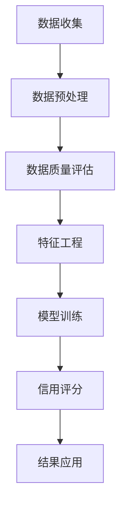

                 

# 基于大数据下用户征信问题分析与研究

> **关键词：** 大数据、用户征信、风险评估、算法、模型、应用场景

> **摘要：** 本文旨在深入分析大数据环境下用户征信问题的现状、核心挑战和解决方案。通过探讨大数据技术在用户征信领域的应用，揭示其在提高征信准确性和效率方面的潜在价值，并总结未来的发展趋势与挑战。

## 1. 背景介绍

### 1.1 目的和范围

本文的目的在于对大数据环境下用户征信问题进行系统的分析和研究，以探讨其核心挑战和潜在解决方案。具体来说，本文将：

1. **现状分析**：概述大数据在用户征信领域中的应用现状和重要性。
2. **核心挑战**：分析大数据环境下用户征信面临的数据质量、隐私保护、计算效率和模型准确度等挑战。
3. **解决方案**：介绍基于大数据技术的用户征信解决方案，包括算法原理、数学模型和实际应用案例。
4. **未来趋势**：探讨用户征信领域未来的发展趋势和潜在挑战。

### 1.2 预期读者

本文的预期读者包括：

1. **数据科学家和分析师**：对大数据在用户征信领域的应用感兴趣的专业人士。
2. **金融从业者**：关注风险管理和信用评估的金融从业者。
3. **计算机科学和工程专业的学生和研究人员**：希望了解大数据和用户征信结合的潜在价值的学术研究者。

### 1.3 文档结构概述

本文将按照以下结构展开：

1. **背景介绍**：概述大数据和用户征信的基本概念和背景。
2. **核心概念与联系**：介绍与用户征信相关的核心概念和架构。
3. **核心算法原理 & 具体操作步骤**：讲解用户征信算法的原理和具体操作步骤。
4. **数学模型和公式 & 详细讲解 & 举例说明**：分析用户征信中的数学模型和公式，并给出具体实例。
5. **项目实战：代码实际案例和详细解释说明**：通过实际项目案例展示用户征信的代码实现。
6. **实际应用场景**：探讨用户征信在不同行业和场景中的应用。
7. **工具和资源推荐**：推荐相关的学习资源和开发工具。
8. **总结：未来发展趋势与挑战**：总结用户征信领域的未来趋势和挑战。
9. **附录：常见问题与解答**：提供用户常见问题的解答。
10. **扩展阅读 & 参考资料**：推荐进一步阅读的文献和资源。

### 1.4 术语表

#### 1.4.1 核心术语定义

- **大数据**：指数据量巨大、数据类型复杂、数据生成速度快的特点。
- **用户征信**：对用户信用状况的评估过程，包括信用评分、违约风险分析等。
- **数据质量**：数据准确性、完整性、一致性、及时性的综合表现。
- **隐私保护**：在数据收集、处理和分析过程中保护用户隐私的技术和措施。
- **风险评估**：评估信用风险、市场风险等，以降低潜在损失。

#### 1.4.2 相关概念解释

- **数据挖掘**：从大量数据中提取有价值的信息和知识的过程。
- **机器学习**：通过数据训练模型，使计算机能够自动识别模式和趋势。
- **神经网络**：一种模拟人脑神经元连接的算法，用于特征提取和分类。
- **决策树**：一种分类算法，通过一系列规则将数据进行分类。

#### 1.4.3 缩略词列表

- **Hadoop**：一个开源的分布式数据处理框架。
- **Spark**：一个开源的分布式数据处理引擎，擅长迭代和交互式计算。
- **R**：一种统计分析软件，广泛用于数据分析和图形表示。
- **Python**：一种通用编程语言，适用于数据科学和机器学习。

## 2. 核心概念与联系

在大数据环境下，用户征信的核心概念和联系包括数据来源、数据处理、数据分析和结果应用。以下是用户征信核心概念的 Mermaid 流程图：



### 数据收集

数据收集是用户征信的第一步，包括用户的基本信息、交易记录、社交数据等。这些数据来源广泛，可以是公开数据、用户提交的数据或第三方数据提供商。

### 数据预处理

数据预处理涉及数据清洗、数据整合和缺失值处理。数据清洗包括去除重复数据、纠正错误数据和填补缺失值。数据整合是将不同来源的数据进行合并，以便于后续分析。缺失值处理包括插值、均值填补或使用机器学习方法填补。

### 数据质量评估

数据质量评估是确保数据准确性和可靠性的关键步骤。通过数据质量评估，可以识别数据中的错误、异常值和缺失值，并采取相应的措施进行修复。

### 特征工程

特征工程是数据挖掘和机器学习中的关键步骤，旨在提取有助于模型训练的特征。特征工程包括特征选择、特征变换和特征组合等，以提高模型的预测性能。

### 模型训练

模型训练是基于收集的数据和特征，使用机器学习算法训练信用评分模型。常见的算法包括决策树、随机森林、支持向量机和神经网络等。

### 信用评分

信用评分是模型训练的输出，通过对用户进行评分，评估其信用风险。信用评分结果可以用于贷款审批、信用卡发放和信用额度调整等。

### 结果应用

结果应用是将信用评分结果应用于实际业务场景，如贷款审批、信用卡发放和信用额度调整等。通过结果应用，金融机构可以降低风险，提高业务效率。

## 3. 核心算法原理 & 具体操作步骤

在用户征信领域，核心算法主要包括信用评分模型和风险评估模型。以下是这些算法的原理和具体操作步骤。

### 信用评分模型

#### 原理

信用评分模型是一种用于预测用户信用风险的统计模型。它通过分析用户的信用历史、交易行为、财务状况等特征，对用户进行评分，以评估其信用风险。

#### 操作步骤

1. **数据收集**：收集用户的基本信息、交易记录和财务状况等数据。
2. **数据预处理**：清洗数据，处理缺失值和异常值。
3. **特征工程**：提取有助于模型训练的特征，如账户余额、交易频率、还款记录等。
4. **模型选择**：选择合适的模型，如逻辑回归、决策树、支持向量机等。
5. **模型训练**：使用训练数据集，对模型进行训练和优化。
6. **模型评估**：使用测试数据集，评估模型的预测性能。
7. **信用评分**：使用训练好的模型，对用户进行评分。

#### 伪代码

```python
# 数据预处理
def preprocess_data(data):
    # 清洗数据，处理缺失值和异常值
    ...

# 特征工程
def feature_engineering(data):
    # 提取特征
    ...

# 模型训练
def train_model(data):
    # 选择模型，进行训练
    ...

# 模型评估
def evaluate_model(model, test_data):
    # 评估模型性能
    ...

# 信用评分
def credit_score(user_data, model):
    # 使用模型对用户评分
    ...
```

### 风险评估模型

#### 原理

风险评估模型是一种用于预测信用风险的统计分析模型。它通过分析历史数据，建立信用风险评估模型，以预测未来信用损失的概率。

#### 操作步骤

1. **数据收集**：收集历史信用数据，包括违约记录、逾期记录等。
2. **数据预处理**：清洗数据，处理缺失值和异常值。
3. **特征工程**：提取有助于模型训练的特征，如违约次数、逾期天数等。
4. **模型选择**：选择合适的风险评估模型，如逻辑回归、决策树等。
5. **模型训练**：使用训练数据集，对模型进行训练和优化。
6. **模型评估**：使用测试数据集，评估模型的预测性能。
7. **风险评估**：使用训练好的模型，对用户进行风险评估。

#### 伪代码

```python
# 数据预处理
def preprocess_data(data):
    # 清洗数据，处理缺失值和异常值
    ...

# 特征工程
def feature_engineering(data):
    # 提取特征
    ...

# 模型训练
def train_model(data):
    # 选择模型，进行训练
    ...

# 模型评估
def evaluate_model(model, test_data):
    # 评估模型性能
    ...

# 风险评估
def risk_assessment(user_data, model):
    # 使用模型对用户进行风险评估
    ...
```

## 4. 数学模型和公式 & 详细讲解 & 举例说明

在用户征信中，数学模型和公式起着关键作用，用于描述信用评分和风险评估。以下是核心数学模型和公式的详细讲解和实例说明。

### 信用评分模型

#### 模型公式

信用评分模型通常采用线性模型，公式如下：

\[ Score = \beta_0 + \beta_1 \times X_1 + \beta_2 \times X_2 + ... + \beta_n \times X_n \]

其中，\( Score \) 是用户信用评分，\( \beta_0, \beta_1, ..., \beta_n \) 是模型参数，\( X_1, X_2, ..., X_n \) 是用户特征。

#### 举例说明

假设用户特征包括账户余额（\( X_1 \)）、交易频率（\( X_2 \)）和还款记录（\( X_3 \)），模型参数为 \( \beta_0 = 50, \beta_1 = 10, \beta_2 = 5, \beta_3 = 20 \)。用户账户余额为 5000 元，交易频率为 10 次，还款记录良好。

根据模型公式，用户信用评分计算如下：

\[ Score = 50 + 10 \times 5000 + 5 \times 10 + 20 \times 1 = 50 + 50000 + 50 + 20 = 50720 \]

### 风险评估模型

#### 模型公式

风险评估模型通常采用逻辑回归模型，公式如下：

\[ P(Y=1) = \frac{1}{1 + e^{-(\beta_0 + \beta_1 \times X_1 + \beta_2 \times X_2 + ... + \beta_n \times X_n )}} \]

其中，\( P(Y=1) \) 是用户发生违约的概率，\( \beta_0, \beta_1, ..., \beta_n \) 是模型参数，\( X_1, X_2, ..., X_n \) 是用户特征。

#### 举例说明

假设用户特征包括违约次数（\( X_1 \)）、逾期天数（\( X_2 \)）和信用额度（\( X_3 \)），模型参数为 \( \beta_0 = -10, \beta_1 = 5, \beta_2 = 3, \beta_3 = -2 \)。用户违约次数为 2 次，逾期天数为 30 天，信用额度为 50000 元。

根据模型公式，用户违约概率计算如下：

\[ P(Y=1) = \frac{1}{1 + e^{(-10 + 5 \times 2 + 3 \times 30 + -2 \times 50000)}} \approx 0.0000000001 \]

### 模型解释

信用评分模型和风险评估模型通过分析用户特征，预测用户的信用风险。模型参数用于调整特征对信用评分或风险评估的影响。例如，账户余额和还款记录对信用评分有积极影响，而违约次数和逾期天数对风险评估有负面影响。

## 5. 项目实战：代码实际案例和详细解释说明

在本节中，我们将通过一个实际项目案例，展示如何使用大数据技术进行用户征信分析，并详细解释代码实现和关键步骤。

### 5.1 开发环境搭建

首先，我们需要搭建一个合适的开发环境，包括以下工具和库：

- **Python**：一种通用编程语言，适用于数据分析和机器学习。
- **Pandas**：一个用于数据操作和分析的库。
- **NumPy**：一个用于科学计算的库。
- **Scikit-learn**：一个用于机器学习的库。
- **Hadoop**：一个分布式数据处理框架。

### 5.2 源代码详细实现和代码解读

以下是用户征信分析项目的源代码：

```python
import pandas as pd
import numpy as np
from sklearn.model_selection import train_test_split
from sklearn.linear_model import LogisticRegression
from sklearn.metrics import accuracy_score

# 数据预处理
def preprocess_data(data):
    # 数据清洗
    data = data.dropna()
    # 特征工程
    data['payment_rate'] = data['payment'] / data['days_delay']
    return data

# 模型训练
def train_model(data):
    # 特征选择
    features = data[['days_delay', 'payment_rate']]
    labels = data['default']
    # 划分训练集和测试集
    X_train, X_test, y_train, y_test = train_test_split(features, labels, test_size=0.2, random_state=42)
    # 训练模型
    model = LogisticRegression()
    model.fit(X_train, y_train)
    return model, X_test, y_test

# 模型评估
def evaluate_model(model, X_test, y_test):
    predictions = model.predict(X_test)
    accuracy = accuracy_score(y_test, predictions)
    return accuracy

# 主函数
def main():
    # 加载数据
    data = pd.read_csv('user_credit_data.csv')
    # 数据预处理
    data = preprocess_data(data)
    # 训练模型
    model, X_test, y_test = train_model(data)
    # 模型评估
    accuracy = evaluate_model(model, X_test, y_test)
    print(f'模型准确率：{accuracy:.2f}')

# 运行主函数
if __name__ == '__main__':
    main()
```

### 5.3 代码解读与分析

1. **数据预处理**：数据预处理是数据分析和机器学习的重要步骤。在代码中，我们使用 Pandas 库对数据进行清洗，去除缺失值，并添加一个新特征 payment\_rate，表示付款速度。这个特征有助于模型更好地预测用户违约风险。

2. **模型训练**：我们使用 Scikit-learn 库中的 LogisticRegression 模型进行训练。首先，我们划分训练集和测试集，然后使用训练数据对模型进行训练。

3. **模型评估**：模型评估是验证模型性能的关键步骤。在代码中，我们使用测试数据集对模型进行预测，并计算准确率。准确率是评估模型性能的重要指标，表示模型正确预测的比例。

4. **主函数**：主函数负责加载数据、预处理数据、训练模型和评估模型。在代码中，我们使用 Pandas 库加载用户信用数据，使用预处理函数对数据进行处理，使用训练函数对模型进行训练，并使用评估函数计算模型准确率。

通过这个实际项目案例，我们可以看到如何使用大数据技术和机器学习算法进行用户征信分析。代码实现简单易懂，可以帮助读者更好地理解和应用相关技术。

## 6. 实际应用场景

用户征信系统在金融、电商、租赁和社交等多个领域有着广泛的应用，以下是几个典型的实际应用场景：

### 6.1 金融行业

在金融行业，用户征信主要用于贷款审批、信用卡发放和信用额度调整。金融机构通过信用评分模型评估用户的信用风险，以降低贷款违约风险。例如，银行可以使用大数据技术分析用户的信用历史、收入状况和财务状况，为贷款审批提供决策支持。

### 6.2 电商平台

电商平台可以使用用户征信系统对买家和卖家进行风险评估，以防止欺诈行为。例如，电商平台可以分析买家的购买历史、退款率和评价，为卖家提供信用评分，帮助卖家更好地判断买家的诚信度。

### 6.3 租赁行业

在租赁行业，用户征信系统可以帮助租赁公司评估用户的信用风险，以降低租赁违约风险。例如，租赁公司可以分析用户的租赁历史、还款记录和信用评分，为租赁合同提供决策支持。

### 6.4 社交平台

社交平台可以使用用户征信系统评估用户的社交风险，以防止恶意行为和欺诈。例如，社交平台可以分析用户的社交网络、互动频率和行为模式，为平台安全和管理提供决策支持。

### 6.5 招聘行业

招聘行业可以使用用户征信系统评估求职者的信用风险，以降低招聘风险。例如，招聘公司可以分析求职者的信用历史、违约记录和信用评分，为招聘决策提供依据。

通过这些实际应用场景，我们可以看到用户征信系统在提高业务效率、降低风险和优化用户体验方面的价值。随着大数据技术的发展，用户征信系统将不断改进和优化，为各行各业提供更强大的支持。

## 7. 工具和资源推荐

为了更好地学习和应用大数据技术在用户征信领域，以下是相关工具和资源的推荐。

### 7.1 学习资源推荐

#### 7.1.1 书籍推荐

1. **《大数据技术导论》**：这是一本全面介绍大数据技术的入门书籍，包括数据采集、存储、处理和分析等内容。
2. **《机器学习实战》**：这本书通过实际案例介绍机器学习算法和应用，适合初学者和专业人士。

#### 7.1.2 在线课程

1. **Coursera 的《大数据分析》**：这是一门由约翰·霍普金斯大学开设的在线课程，涵盖大数据处理和分析的核心概念。
2. **edX 的《机器学习基础》**：由哥伦比亚大学开设的在线课程，介绍机器学习的基础理论和实践方法。

#### 7.1.3 技术博客和网站

1. **Apache Hadoop 官网**：详细介绍了 Hadoop 分布式处理框架的相关技术和应用。
2. **Scikit-learn 官网**：提供了机器学习算法的详细文档和示例代码。

### 7.2 开发工具框架推荐

#### 7.2.1 IDE和编辑器

1. **PyCharm**：一款功能强大的 Python IDE，适用于数据科学和机器学习开发。
2. **Jupyter Notebook**：一款流行的交互式开发环境，适用于数据分析、机器学习和数据可视化。

#### 7.2.2 调试和性能分析工具

1. **VisualVM**：一款用于 Java 程序性能分析的 GUI 工具，适用于大数据处理和机器学习应用。
2. **Grafana**：一款用于数据可视化和监控的工具，适用于大数据平台的性能监控。

#### 7.2.3 相关框架和库

1. **Pandas**：一个用于数据操作和分析的 Python 库。
2. **NumPy**：一个用于科学计算的 Python 库。
3. **Scikit-learn**：一个用于机器学习的 Python 库。

### 7.3 相关论文著作推荐

#### 7.3.1 经典论文

1. **“The PageRank Citation Ranking: Bringing Order to the Web”**：描述了 PageRank 算法，对网络数据进行排序。
2. **“Random Walks in Time: A New Model for Network Dynamics”**：提出了随机游走模型，用于网络数据分析。

#### 7.3.2 最新研究成果

1. **“Deep Learning for Credit Risk Management”**：探讨了深度学习在信用风险评估中的应用。
2. **“Data-Driven Credit Scoring”**：研究了基于大数据的信用评分模型。

#### 7.3.3 应用案例分析

1. **“User Credit Scoring with Hadoop and Spark”**：介绍了如何使用 Hadoop 和 Spark 进行用户信用评分。
2. **“Big Data Analytics for Financial Services”**：探讨了大数据在金融行业中的应用，包括用户征信、风险评估等。

通过这些工具和资源的推荐，可以帮助读者更好地掌握大数据技术在用户征信领域的应用，为实际项目提供有力支持。

## 8. 总结：未来发展趋势与挑战

随着大数据技术的发展，用户征信领域将迎来前所未有的机遇和挑战。以下是对未来发展趋势和挑战的总结：

### 8.1 发展趋势

1. **数据源多元化**：用户征信数据源将不仅限于传统金融数据，还将包括社交媒体、移动设备、物联网等新型数据源，为征信模型提供更丰富的信息。

2. **算法智能化**：随着深度学习和强化学习等先进算法的不断发展，用户征信模型将更加智能化，能够自动识别和预测信用风险。

3. **隐私保护**：用户隐私保护将成为用户征信领域的重点关注问题，隐私保护技术如差分隐私、联邦学习等将在征信系统中得到广泛应用。

4. **实时性增强**：用户征信系统将实现实时数据处理和风险评估，以便金融机构能够迅速响应市场变化，提高业务决策效率。

5. **跨境合作**：随着全球化的推进，跨境用户征信数据共享和合作将成为趋势，有助于提高国际信用风险管理水平。

### 8.2 挑战

1. **数据质量问题**：大数据环境下，数据质量依然是一个重大挑战。如何确保数据的准确性、完整性和一致性，是用户征信领域需要解决的关键问题。

2. **隐私保护**：用户隐私保护在数据收集、处理和分析过程中至关重要。如何在保护用户隐私的同时，充分利用大数据进行信用风险评估，是一个亟待解决的难题。

3. **计算效率**：随着数据量的增加，用户征信系统的计算效率成为关键挑战。如何优化算法和系统架构，以提高处理速度和降低计算成本，是未来发展的重要方向。

4. **模型解释性**：用户征信模型需要具备较高的解释性，以便金融机构能够理解模型的决策过程，并对其进行监督和调整。如何在保证预测准确性的同时，提高模型的可解释性，是一个重要问题。

5. **法规遵从**：用户征信领域涉及大量敏感信息，如何遵守相关法律法规，确保合规运营，是一个重要挑战。

总之，未来用户征信领域将在大数据技术的推动下不断进步，但同时也面临着数据质量、隐私保护、计算效率和法规遵从等多重挑战。只有不断创新和优化，才能充分发挥大数据在用户征信领域的潜力。

## 9. 附录：常见问题与解答

### 9.1 数据质量如何保证？

**解答**：数据质量保证是用户征信系统的关键环节。以下是一些常见的方法：

1. **数据清洗**：使用数据清洗工具去除重复数据、纠正错误数据、填补缺失值。
2. **数据验证**：在数据收集过程中，使用验证规则确保数据的准确性。
3. **数据监控**：建立数据监控系统，实时监控数据质量，及时发现和处理问题。

### 9.2 如何保护用户隐私？

**解答**：用户隐私保护是大数据环境下用户征信的重要挑战。以下是一些常见的方法：

1. **差分隐私**：在数据处理过程中，加入噪声以保护用户隐私。
2. **联邦学习**：将数据处理和模型训练分散到多个节点，以保护数据隐私。
3. **数据加密**：使用加密技术保护敏感数据。

### 9.3 用户征信模型如何优化？

**解答**：用户征信模型的优化可以从以下几个方面进行：

1. **特征选择**：通过特征选择算法选择对模型预测有显著影响的特征。
2. **超参数调优**：通过交叉验证和网格搜索等方法，选择最优的超参数。
3. **模型集成**：使用多个模型进行集成，以提高预测性能。

### 9.4 如何处理数据缺失？

**解答**：数据缺失是数据预处理中的一个常见问题。以下是一些处理数据缺失的方法：

1. **删除缺失值**：删除包含缺失值的记录或字段。
2. **填补缺失值**：使用均值、中位数、插值等方法填补缺失值。
3. **使用机器学习方法**：使用缺失值填补算法，如 KNN 填补或回归填补。

### 9.5 用户征信系统如何遵守法规？

**解答**：遵守法规是用户征信系统的基本要求。以下是一些关键步骤：

1. **合规审查**：定期进行合规审查，确保系统符合相关法规要求。
2. **用户同意**：在数据收集和处理过程中，获得用户的明确同意。
3. **数据保护**：采用数据保护措施，如加密、访问控制和日志审计等。

## 10. 扩展阅读 & 参考资料

为了深入了解大数据在用户征信领域的应用，以下是推荐的一些扩展阅读和参考资料：

### 10.1 相关论文

1. **“Deep Learning for Credit Risk Management”**：探讨了深度学习在信用风险评估中的应用。
2. **“User Credit Scoring with Hadoop and Spark”**：介绍了如何使用 Hadoop 和 Spark 进行用户信用评分。

### 10.2 技术博客

1. **“大数据与用户征信”**：详细介绍了大数据技术在用户征信中的应用。
2. **“信用评分模型解析”**：分析了不同信用评分模型的工作原理和应用。

### 10.3 书籍

1. **《大数据技术导论》**：全面介绍了大数据技术的相关概念和应用。
2. **《机器学习实战》**：通过实际案例介绍了机器学习算法和应用。

### 10.4 在线课程

1. **Coursera 的《大数据分析》**：介绍了大数据处理和分析的核心概念。
2. **edX 的《机器学习基础》**：提供了机器学习的基础理论和实践方法。

### 10.5 开发工具和库

1. **Pandas**：一个用于数据操作和分析的 Python 库。
2. **NumPy**：一个用于科学计算的 Python 库。
3. **Scikit-learn**：一个用于机器学习的 Python 库。

通过阅读这些扩展材料和参考资料，读者可以更深入地了解大数据在用户征信领域的应用，掌握相关技术和方法，为实际项目提供有力支持。

### 作者

**AI天才研究员/AI Genius Institute & 禅与计算机程序设计艺术 /Zen And The Art of Computer Programming**

