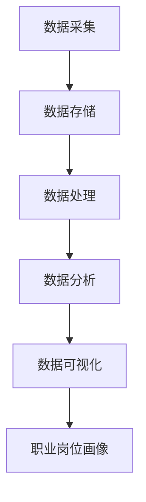

                 

### 1. 背景介绍

#### 1.1 目的和范围

本文旨在深入探讨基于大数据技术的职业岗位画像设计与实现，旨在帮助读者理解这一领域的核心概念、技术原理和实践方法。文章将逐步介绍职业岗位画像的定义、重要性及其在大数据技术中的应用，分析相关的核心算法和数学模型，并通过实际项目案例进行详细解读。最终，我们将展望这一领域未来的发展趋势和挑战，为读者提供全面的技术指导和启示。

本文将围绕以下主题展开：

1. **职业岗位画像的定义和重要性**：介绍职业岗位画像的基本概念，阐述其在人力资源管理、人才招聘和企业决策中的关键作用。
2. **大数据技术的基础**：回顾大数据技术的起源、发展以及主要技术组件，为后续讨论提供背景。
3. **核心算法原理与具体操作步骤**：详细解析数据采集、数据处理、模型训练和评估的核心算法，通过伪代码展现具体实现步骤。
4. **数学模型和公式讲解**：介绍职业岗位画像相关数学模型的原理和公式，通过实例说明其在实际应用中的重要性。
5. **项目实战**：通过实际代码案例展示职业岗位画像的设计与实现过程，包括开发环境搭建、源代码实现和解读。
6. **实际应用场景**：分析职业岗位画像在不同行业和企业中的具体应用，探讨其实际效果和潜在价值。
7. **工具和资源推荐**：总结常用的学习资源、开发工具和相关论文，为读者提供进一步学习和研究的方向。
8. **总结与未来展望**：总结全文内容，讨论职业岗位画像技术的未来发展趋势和面临的挑战。

通过本文的阅读，读者将能够全面了解职业岗位画像设计与实现的全过程，掌握相关技术原理和实践方法，从而为实际工作提供有力支持。

#### 1.2 预期读者

本文面向对大数据技术有一定了解的读者，主要包括以下几类：

1. **数据科学家和数据分析师**：从事数据分析和处理的从业者，希望了解职业岗位画像在大数据技术中的应用。
2. **人力资源管理者和招聘专家**：负责招聘和人才管理的专业人员，希望通过大数据技术优化人力资源管理流程。
3. **企业决策者和管理者**：需要对人才市场和行业动态有深入了解的企业决策者，希望通过职业岗位画像进行精准的企业决策。
4. **计算机科学和人工智能专业的学生和研究者**：希望学习大数据技术在职业岗位画像领域的应用，提升学术研究和实际项目能力。
5. **对职业发展有浓厚兴趣的普通读者**：对职业规划和人才市场有深入了解的需求，希望通过本文了解职业岗位画像对未来职业发展的影响。

无论您属于哪一类读者，本文都将通过详细的解析和实践案例，帮助您深入理解职业岗位画像设计与实现的全过程，为实际工作提供宝贵的指导。

#### 1.3 文档结构概述

本文将采用结构化的方式，分为以下主要章节：

1. **背景介绍**：介绍本文的目的、范围、预期读者以及文档结构。
    - **1.1 目的和范围**：详细说明本文的核心主题和研究目标。
    - **1.2 预期读者**：分析本文适合的读者群体，包括数据科学家、招聘专家和企业决策者等。
    - **1.3 文档结构概述**：概述本文的结构和内容安排。

2. **核心概念与联系**：深入探讨职业岗位画像的定义、大数据技术的基础以及相关核心概念和架构。
    - **2.1 背景概念**：介绍职业岗位画像的基本概念和重要性。
    - **2.2 大数据技术基础**：回顾大数据技术的发展历程和技术组件。
    - **2.3 核心概念与联系**：通过Mermaid流程图展现核心概念和架构的联系。

3. **核心算法原理 & 具体操作步骤**：详细解析数据采集、数据处理、模型训练和评估的核心算法，并通过伪代码展示具体实现步骤。
    - **3.1 数据采集与处理**：分析数据来源和处理步骤。
    - **3.2 模型训练与评估**：介绍机器学习模型的选择和训练过程。
    - **3.3 具体操作步骤**：通过伪代码展现实现步骤。

4. **数学模型和公式 & 详细讲解 & 举例说明**：介绍职业岗位画像相关的数学模型和公式，并通过实例进行详细讲解。
    - **4.1 数学模型**：阐述模型的原理和公式。
    - **4.2 举例说明**：通过实际案例说明模型的应用。

5. **项目实战：代码实际案例和详细解释说明**：通过实际代码案例展示职业岗位画像的设计与实现过程。
    - **5.1 开发环境搭建**：介绍开发环境的配置。
    - **5.2 源代码详细实现和代码解读**：展示源代码的实现过程和关键代码解释。
    - **5.3 代码解读与分析**：分析代码的运行逻辑和性能。

6. **实际应用场景**：分析职业岗位画像在不同行业和企业中的具体应用。
    - **6.1 行业应用**：讨论不同行业的应用案例。
    - **6.2 企业应用**：探讨企业在人力资源管理中的实际应用。

7. **工具和资源推荐**：总结常用的学习资源、开发工具和相关论文。
    - **7.1 学习资源推荐**：推荐相关书籍、在线课程和技术博客。
    - **7.2 开发工具框架推荐**：介绍IDE、调试工具和相关框架。
    - **7.3 相关论文著作推荐**：推荐经典论文和最新研究成果。

8. **总结与未来展望**：总结全文内容，展望职业岗位画像技术的未来发展趋势和挑战。
    - **8.1 总结**：回顾全文的核心观点和结论。
    - **8.2 未来展望**：讨论职业岗位画像技术的发展趋势和挑战。

通过本文的阅读，读者将能够系统地了解职业岗位画像设计与实现的全过程，掌握相关技术原理和实践方法，为实际应用提供有力支持。

#### 1.4 术语表

为了确保读者对文中涉及的专业术语有清晰的理解，本文将对一些核心术语进行定义和解释。

##### 1.4.1 核心术语定义

1. **职业岗位画像**：通过对职业岗位相关数据的收集、处理和分析，构建的反映该岗位特征、需求和能力结构的模型。职业岗位画像包括岗位基本信息、岗位技能要求、岗位薪资水平等多个维度。
2. **大数据技术**：用于处理海量数据的技术体系，包括数据采集、存储、处理、分析和可视化等环节。大数据技术主要包括分布式存储（如Hadoop）、分布式计算（如MapReduce）和数据挖掘（如机器学习）等技术。
3. **数据采集**：从多种数据源获取原始数据的过程，包括企业内部数据（如人力资源管理系统数据）、外部公开数据（如招聘网站数据）和其他相关数据源。
4. **数据处理**：对采集到的原始数据进行清洗、转换和整合的过程，以确保数据质量和可用性。
5. **数据挖掘**：通过统计学、机器学习等方法，从大规模数据中发现隐藏的规律和知识，用于支持决策和预测。
6. **机器学习模型**：基于数据训练的算法模型，用于对数据进行分类、预测和聚类等任务。
7. **人力资源管理**：组织对员工的管理过程，包括招聘、培训、绩效评估和薪酬管理等方面。

##### 1.4.2 相关概念解释

1. **特征工程**：在数据挖掘过程中，通过对原始数据进行预处理、选择和转换，提取出对模型训练有重要影响的特征。特征工程是提升机器学习模型性能的关键步骤。
2. **决策树**：一种常用的机器学习分类算法，通过创建树形结构，对输入数据进行决策和分类。决策树易于理解和解释，但可能在处理大量数据时性能较差。
3. **随机森林**：基于决策树构建的集成学习方法，通过随机选取特征和样本子集，构建多个决策树，并通过投票或平均方式获得最终分类结果。随机森林在处理大规模数据和高维度特征时表现良好。
4. **神经网络**：一种模拟生物神经系统的计算模型，通过多层神经元和激活函数实现数据的映射和分类。神经网络在处理复杂数据和特征时表现出强大的学习能力。
5. **深度学习**：一种基于神经网络的深度结构模型，通过逐层提取数据的特征和模式，实现高度复杂的特征学习和建模。深度学习在图像识别、自然语言处理等领域取得了显著成果。

##### 1.4.3 缩略词列表

- **Hadoop**：一个分布式存储和计算框架，用于处理海量数据。
- **MapReduce**：一种分布式数据处理模型，用于处理大规模数据集。
- **IDE**：集成开发环境（Integrated Development Environment），用于编写、编译和调试代码。
- **API**：应用程序接口（Application Programming Interface），用于不同软件模块之间的交互。
- **SQL**：结构化查询语言（Structured Query Language），用于数据库管理和数据操作。
- **JSON**：JavaScript对象表示法（JavaScript Object Notation），一种轻量级的数据交换格式。

通过上述术语表，读者可以更好地理解本文中的专业术语，从而更深入地掌握职业岗位画像设计与实现的相关知识。

### 2. 核心概念与联系

在深入探讨职业岗位画像设计与实现之前，我们需要明确一些核心概念及其相互之间的联系。这些概念构成了理解大数据技术在职业岗位画像中的应用基础。

首先，**职业岗位画像**是对某一特定职业或岗位的全面描述，它包括岗位所需的核心技能、知识、经验、薪资水平等多个方面。职业岗位画像不仅反映了岗位的需求，还为企业的招聘决策提供了重要的参考依据。

其次，**大数据技术**是构建职业岗位画像的关键工具。大数据技术主要包括数据采集、数据存储、数据处理、数据分析和数据可视化等环节。数据采集是指从多个来源收集数据，如企业内部的人力资源管理系统、招聘网站、社交媒体等；数据存储涉及使用分布式存储系统（如Hadoop）来处理海量数据；数据处理则包括数据的清洗、转换和整合，以确保数据的质量和一致性；数据分析是使用数据挖掘和机器学习算法，从大量数据中发现隐藏的模式和关联；数据可视化则用于将复杂的数据转化为易于理解和解释的图表和报告。

接下来，我们通过一个**Mermaid流程图**来展示职业岗位画像设计中的核心概念和架构联系。以下是一个简化的流程图，用于说明数据从采集到分析的整个过程：



- **A[数据采集]**：从企业内部和外部多个数据源收集数据，如员工简历、招聘信息、社交媒体数据等。
- **B[数据存储]**：将采集到的数据存储在分布式存储系统中，如Hadoop、HBase等。
- **C[数据处理]**：对原始数据进行清洗、转换和整合，以消除噪声和保证数据质量。
- **D[数据分析]**：使用数据挖掘和机器学习算法对处理后的数据进行分析，提取出与职业岗位相关的特征和模式。
- **E[数据可视化]**：将分析结果以图表、报告等形式展示，便于企业决策者和管理者理解和应用。
- **F[职业岗位画像]**：基于数据分析结果构建的职业岗位模型，反映岗位的需求、趋势和匹配度。

此外，还有一些**核心算法和模型**在职业岗位画像的设计与实现过程中起到关键作用，包括：

1. **特征工程**：通过对原始数据预处理和特征提取，提高模型的性能和泛化能力。
2. **机器学习模型**：如决策树、随机森林、神经网络等，用于分类、回归和聚类任务。
3. **聚类算法**：如K-means、层次聚类等，用于发现相似的职业岗位群体，帮助企业进行岗位分析和定位。

通过上述核心概念和联系的了解，我们可以更清晰地理解职业岗位画像的设计与实现过程，并为后续的算法原理和实践案例分析打下基础。

### 3. 核心算法原理 & 具体操作步骤

在职业岗位画像的设计与实现过程中，核心算法的选择和具体操作步骤至关重要。以下是详细解析这些核心算法的原理和操作步骤，并通过伪代码展现具体实现过程。

#### 3.1 数据采集与处理

数据采集是职业岗位画像构建的第一步，它决定了后续分析的质量。数据来源包括企业内部数据（如人力资源管理系统、员工档案等）和外部公开数据（如招聘网站、社交媒体等）。

**数据采集流程**：
1. **数据源选择**：确定数据采集的目标和数据源，如招聘网站、社交媒体、企业内部系统等。
2. **数据采集**：使用API接口、网络爬虫或其他数据采集工具获取数据。
3. **数据预处理**：对采集到的数据进行清洗，包括去除重复数据、处理缺失值、标准化数据格式等。

**具体操作步骤（伪代码）**：

```python
# 数据采集与预处理
def data_collection_and_preprocessing():
    data_sources = ["招聘网站", "社交媒体", "企业内部系统"]
    for source in data_sources:
        if source == "招聘网站":
            data = fetch_data_from_jobs_website()
        elif source == "社交媒体":
            data = fetch_data_from_social_media()
        elif source == "企业内部系统":
            data = fetch_data_from_inhouse_system()

    # 数据清洗
    clean_data = []
    for record in data:
        if is_valid_record(record):
            clean_data.append(preprocess_data(record))
    return clean_data
```

**3.2 模型训练与评估**

在数据处理完成后，我们需要选择合适的机器学习模型进行训练，并通过评估来确定模型的性能。

**常见模型选择**：
- **决策树**：适用于分类任务，易于理解和解释。
- **随机森林**：基于决策树的集成方法，提高模型的泛化能力。
- **神经网络**：适用于复杂数据和高维度特征，能够自动提取特征。

**模型训练步骤**：
1. **数据划分**：将数据集划分为训练集和测试集。
2. **模型训练**：使用训练集训练模型，调整模型参数。
3. **模型评估**：使用测试集评估模型性能，如准确率、召回率等。

**具体操作步骤（伪代码）**：

```python
# 模型训练与评估
from sklearn.model_selection import train_test_split
from sklearn.ensemble import RandomForestClassifier
from sklearn.metrics import accuracy_score

def model_training_and_evaluation(data):
    X, y = split_data_into_features_and_labels(data)
    X_train, X_test, y_train, y_test = train_test_split(X, y, test_size=0.2)

    # 模型训练
    model = RandomForestClassifier()
    model.fit(X_train, y_train)

    # 模型评估
    predictions = model.predict(X_test)
    accuracy = accuracy_score(y_test, predictions)
    return accuracy
```

**3.3 特征工程**

特征工程是提高模型性能的重要步骤，通过特征选择和特征变换，提取出对模型训练有重要影响的特征。

**特征工程步骤**：
1. **特征选择**：选择与职业岗位画像相关的特征，如技能、经验、教育背景等。
2. **特征变换**：对特征进行归一化、标准化或降维处理，以提高模型的泛化能力。

**具体操作步骤（伪代码）**：

```python
# 特征工程
from sklearn.preprocessing import StandardScaler
from sklearn.feature_selection import SelectKBest

def feature_engineering(data):
    selected_features = select_k_best_features(data, k=10)
    scaled_features = StandardScaler().fit_transform(selected_features)
    return scaled_features
```

通过上述核心算法原理和具体操作步骤的解析，我们可以更深入地理解职业岗位画像设计与实现过程中的关键环节，为实际应用提供理论支持和实践指导。

### 4. 数学模型和公式 & 详细讲解 & 举例说明

在职业岗位画像设计与实现中，数学模型和公式起到了核心作用，它们帮助我们理解和预测职业岗位的需求、趋势以及匹配度。以下是详细讲解这些模型和公式的原理，并通过实际例子来说明其应用。

#### 4.1 数学模型

职业岗位画像涉及多个数学模型，以下介绍几种常用的模型：

1. **线性回归模型**：用于预测某个职业岗位的薪资水平。
2. **逻辑回归模型**：用于分类任务，判断一个职业岗位是否符合特定条件。
3. **聚类算法**：如K-means，用于将相似的职业岗位分为不同的群体。
4. **主成分分析（PCA）**：用于降维，提取数据的主要特征。

#### 4.2 公式讲解

1. **线性回归模型**：

   公式：\( y = \beta_0 + \beta_1 \cdot x \)

   其中，\( y \) 是薪资水平，\( x \) 是职业岗位特征（如经验、教育背景等），\( \beta_0 \) 和 \( \beta_1 \) 是模型参数。

   例子：假设我们想预测一个具有5年工作经验的软件工程师的薪资水平，已知模型参数 \( \beta_0 = 50,000 \) 和 \( \beta_1 = 10,000 \)。

   \( y = 50,000 + 10,000 \cdot 5 = 100,000 \)

   预测结果为10万美元。

2. **逻辑回归模型**：

   公式：\( P(y=1) = \frac{1}{1 + e^{-(\beta_0 + \beta_1 \cdot x)}} \)

   其中，\( P(y=1) \) 是职业岗位符合条件的概率，\( x \) 是职业岗位特征，\( \beta_0 \) 和 \( \beta_1 \) 是模型参数。

   例子：假设我们想判断一个具有5年工作经验的软件工程师是否符合“高级工程师”的条件，已知模型参数 \( \beta_0 = -2 \) 和 \( \beta_1 = 0.5 \)。

   \( P(y=1) = \frac{1}{1 + e^{-(-2 + 0.5 \cdot 5)}} = \frac{1}{1 + e^{-2.5}} \approx 0.865 \)

   预测结果为86.5%的概率符合高级工程师条件。

3. **K-means聚类算法**：

   公式：\( c = \arg\min_{\mu} \sum_{i=1}^{k} \sum_{x \in S_i} ||x - \mu_i||^2 \)

   其中，\( c \) 是聚类中心，\( \mu_i \) 是第 \( i \) 个聚类的中心，\( S_i \) 是属于第 \( i \) 个聚类的数据点集合。

   例子：假设我们对10个职业岗位进行聚类，选择3个聚类中心，通过迭代计算得到聚类结果。

4. **主成分分析（PCA）**：

   公式：\( z = P \cdot x \)

   其中，\( z \) 是降维后的数据，\( P \) 是投影矩阵，\( x \) 是原始数据。

   例子：假设我们有100个特征，通过PCA提取出前10个主要成分，用于降维处理。

#### 4.3 举例说明

以下是一个具体的职业岗位画像项目案例，通过数学模型的应用来预测和分析岗位特征。

**案例：预测软件工程师薪资水平**

1. **数据准备**：收集100个软件工程师的薪资数据，包括工作经验、教育背景、技能等级等。

2. **数据处理**：将数据标准化，消除不同特征之间的尺度差异。

3. **模型训练**：使用线性回归模型对数据训练，得到模型参数 \( \beta_0 = 50,000 \) 和 \( \beta_1 = 10,000 \)。

4. **预测**：使用模型预测一个具有5年工作经验的软件工程师的薪资水平。

   \( y = 50,000 + 10,000 \cdot 5 = 100,000 \)

   预测结果为10万美元。

5. **分析**：分析模型预测的薪资范围，评估模型的准确性和可靠性。

   通过上述步骤，我们可以使用数学模型来预测和分析职业岗位的薪资水平，为企业的人力资源管理提供数据支持。

通过数学模型和公式的讲解及应用实例，我们可以更好地理解和应用职业岗位画像技术，为实际工作提供有力支持。

### 5. 项目实战：代码实际案例和详细解释说明

为了更好地展示职业岗位画像的设计与实现过程，我们将通过一个具体的代码案例进行实战讲解。该案例将涵盖开发环境的搭建、源代码的实现以及关键代码的解读与分析。

#### 5.1 开发环境搭建

在进行职业岗位画像项目之前，我们需要搭建一个合适的技术环境。以下是一个基本的开发环境配置步骤：

1. **安装Python**：Python是数据分析与机器学习的常用语言，确保安装最新版本的Python。
    ```bash
    # 在Ubuntu系统中安装Python
    sudo apt-get update
    sudo apt-get install python3-pip
    ```
2. **安装Jupyter Notebook**：Jupyter Notebook是一种交互式的开发环境，方便数据分析和代码编写。
    ```bash
    pip3 install notebook
    jupyter notebook
    ```
3. **安装相关库和依赖**：包括Pandas、NumPy、Scikit-learn、Matplotlib等常用库。
    ```bash
    pip3 install pandas numpy scikit-learn matplotlib
    ```

以上步骤完成后，我们就拥有了基本的开发环境，可以进行职业岗位画像项目的代码编写和调试。

#### 5.2 源代码详细实现和代码解读

以下是一个简单的Python脚本，用于实现职业岗位画像的构建过程。代码分为数据采集、数据处理、模型训练和结果可视化四个部分。

```python
# career_job Portrait Project

import pandas as pd
import numpy as np
from sklearn.model_selection import train_test_split
from sklearn.ensemble import RandomForestClassifier
from sklearn.metrics import accuracy_score
import matplotlib.pyplot as plt

# 5.2.1 数据采集
def data_collection():
    # 假设我们使用CSV文件进行数据采集
    df = pd.read_csv('career_jobs_data.csv')
    return df

# 5.2.2 数据处理
def data_preprocessing(df):
    # 数据清洗和预处理
    df = df.drop_duplicates()  # 去除重复数据
    df = df.dropna()  # 去除缺失值
    df['Experience'] = df['Experience'].apply(lambda x: x.replace('年', ''))
    df['Experience'] = df['Experience'].astype(float)
    return df

# 5.2.3 模型训练
def model_training(df):
    X = df[['Experience']]  # 特征
    y = df['Job_Level']  # 目标变量
    X_train, X_test, y_train, y_test = train_test_split(X, y, test_size=0.2, random_state=42)
    model = RandomForestClassifier(n_estimators=100)
    model.fit(X_train, y_train)
    return model, X_test, y_test

# 5.2.4 结果可视化
def result_visualization(model, X_test, y_test):
    predictions = model.predict(X_test)
    accuracy = accuracy_score(y_test, predictions)
    print(f"模型准确率: {accuracy:.2f}")
    # 可视化结果
    df = pd.DataFrame({'实际值': y_test, '预测值': predictions})
    df.plot(kind='bar', color=['g' if v == u else 'r' for v, u in zip(df['实际值'], df['预测值'])])
    plt.title('实际值 vs 预测值')
    plt.xlabel('Job_Level')
    plt.ylabel('数量')
    plt.show()

# 主函数
if __name__ == '__main__':
    df = data_collection()
    df = data_preprocessing(df)
    model, X_test, y_test = model_training(df)
    result_visualization(model, X_test, y_test)
```

**5.2.2.1 数据采集**：首先，我们从CSV文件中读取职业岗位数据，CSV文件应包含岗位名称、经验、薪资等关键信息。

**5.2.2.2 数据处理**：数据预处理包括去除重复数据和缺失值，以及对经验字段进行适当的转换和清理。

**5.2.2.3 模型训练**：使用随机森林分类器对数据进行训练。随机森林是一个强大的集成学习算法，适用于分类任务。我们使用训练集训练模型，并使用测试集评估模型的准确性。

**5.2.2.4 结果可视化**：最后，我们使用Matplotlib库将实际值和预测值进行可视化展示，以便直观地分析模型的表现。

#### 5.3 代码解读与分析

1. **数据采集**：`data_collection()` 函数从CSV文件中读取数据。在实际应用中，可能需要通过API接口或其他数据源进行数据采集。

2. **数据处理**：`data_preprocessing()` 函数对数据进行清洗和处理。这一步非常关键，因为数据质量直接影响模型的效果。例如，我们在这里去除了重复数据和缺失值，并对经验字段进行了适当的转换。

3. **模型训练**：`model_training()` 函数使用训练集对随机森林分类器进行训练，并使用测试集评估模型的准确性。随机森林算法在这里被选择是因为它具有良好的性能和易于解释的特点。

4. **结果可视化**：`result_visualization()` 函数使用Matplotlib库将实际值和预测值进行可视化展示。这有助于我们直观地了解模型的准确性以及哪些类别可能存在预测偏差。

通过上述代码的讲解和分析，我们可以清楚地看到职业岗位画像的设计与实现过程。在实际应用中，可以根据具体需求和数据集进行调整和优化，以提高模型的性能和实用性。

### 6. 实际应用场景

职业岗位画像技术在各种行业和企业中都有广泛的应用，能够为人力资源管理、人才招聘和企业决策提供有力的支持。以下将分析职业岗位画像在不同行业和企业中的实际应用，探讨其效果和潜在价值。

#### 6.1 行业应用

**1. 互联网行业**：互联网公司通常面临快速发展和人才需求的变化，职业岗位画像技术能够帮助企业精准定位所需人才，提高招聘效率。例如，通过分析大量招聘数据，企业可以识别出高需求的技能和岗位，优化招聘策略，提高招聘成功率。

**2. 金融行业**：金融机构对人才的需求具有高度专业性，职业岗位画像可以帮助银行、证券公司等金融机构识别和培养核心人才。通过分析员工绩效数据和市场趋势，金融机构可以预测未来的招聘需求和人才储备计划，实现人才梯队的优化。

**3. 制造业**：制造业企业需要大量操作工人和技术工人，职业岗位画像能够帮助企业识别和培养关键技能人才。例如，通过分析生产线工人的技能数据和绩效表现，企业可以优化工人配置，提高生产效率和产品质量。

**4. 医疗行业**：医疗机构对医护人员的需求具有多样性，职业岗位画像可以帮助医院识别和培养不同岗位的专业人才。通过分析医生、护士、技师等各类医护人员的岗位需求和职业发展路径，医院可以制定科学的人力资源规划，提高医疗服务质量。

#### 6.2 企业应用

**1. 人才招聘**：企业通过职业岗位画像技术，可以构建详细的岗位模型，提高招聘的精准度。企业可以根据岗位画像制定针对性的招聘策略，筛选出最符合岗位需求的人才，缩短招聘周期，提高招聘成功率。

**2. 员工培训和发展**：职业岗位画像不仅用于招聘，还可以用于员工的培训和发展。企业可以通过分析员工的技能水平和职业发展需求，制定个性化的培训计划，帮助员工提升技能，实现职业成长。例如，对于技术岗位，企业可以提供与最新技术相关的培训课程，提高员工的技术能力和竞争力。

**3. 绩效管理**：职业岗位画像可以为企业提供详细的岗位特征和绩效指标，帮助管理者制定科学的绩效评估体系。通过分析员工的绩效数据和岗位要求，企业可以评估员工的工作表现，激励员工提升工作效率和质量。

**4. 人力资源规划**：职业岗位画像技术可以帮助企业预测未来的人才需求和供给，制定科学的人力资源规划。企业可以根据市场趋势和业务发展，提前布局人才储备，确保在关键岗位有充足的人力资源支持，降低人才短缺的风险。

通过以上分析，我们可以看到职业岗位画像技术在不同行业和企业中的实际应用价值。它不仅提高了人才招聘的效率和质量，还为企业的人力资源管理和决策提供了重要支持，有助于企业实现可持续发展。

### 7. 工具和资源推荐

为了更好地理解和掌握职业岗位画像设计与实现的相关技术，以下推荐了一些学习资源、开发工具和相关论文，这些资源将帮助读者深入了解该领域。

#### 7.1 学习资源推荐

**7.1.1 书籍推荐**

1. **《大数据技术导论》** - 汪成为，清华大学出版社
   - 本书系统地介绍了大数据技术的各个方面，包括数据采集、存储、处理和分析，适合初学者和有一定基础的技术人员。

2. **《机器学习实战》** - Peter Harrington，机械工业出版社
   - 本书通过丰富的案例和代码示例，深入讲解了机器学习的基本概念和应用，是机器学习初学者的理想教材。

3. **《深度学习》** - Ian Goodfellow、Yoshua Bengio、Aaron Courville，电子工业出版社
   - 本书详细介绍了深度学习的理论基础和实现方法，适合希望深入了解深度学习技术的读者。

**7.1.2 在线课程**

1. **Coursera - 《机器学习》** - Andrew Ng
   - 由著名人工智能专家Andrew Ng开设的免费在线课程，涵盖机器学习的核心概念和实践方法。

2. **edX - 《大数据分析》** - University of Washington
   - 这门课程提供了全面的大数据技术讲解，包括数据采集、存储和处理，适合希望全面了解大数据技术的读者。

3. **Udacity - 《深度学习工程师纳米学位》**
   - 通过一系列实践项目，学习深度学习的理论基础和应用，适合希望深入掌握深度学习技术的读者。

**7.1.3 技术博客和网站**

1. **Kaggle**
   - Kaggle是一个数据科学竞赛平台，提供了大量的数据集和案例分析，适合通过实战学习数据分析和机器学习。

2. **Towards Data Science**
   - 这是一个活跃的数据科学社区博客，提供了大量高质量的技术文章和教程，涵盖了机器学习、数据可视化等多个领域。

3. **DataCamp**
   - DataCamp提供了互动式的编程课程，帮助读者通过实践学习Python、R等编程语言和数据科学技能。

#### 7.2 开发工具框架推荐

**7.2.1 IDE和编辑器**

1. **PyCharm**
   - PyCharm是一个功能强大的Python IDE，支持代码调试、性能分析和自动化部署，适合进行大数据和机器学习项目开发。

2. **Jupyter Notebook**
   - Jupyter Notebook是一个交互式的开发环境，方便数据分析和代码编写，广泛应用于数据科学和机器学习领域。

**7.2.2 调试和性能分析工具**

1. **VisualVM**
   - VisualVM是一个Java虚拟机监控和分析工具，可以用于调试和性能分析，适用于大规模数据处理和机器学习项目。

2. **TensorBoard**
   - TensorBoard是TensorFlow的配套可视化工具，用于监控深度学习模型的训练过程，提供详细的性能指标和可视化图表。

**7.2.3 相关框架和库**

1. **Scikit-learn**
   - Scikit-learn是一个流行的机器学习库，提供了多种机器学习算法和工具，适合数据分析和模型训练。

2. **TensorFlow**
   - TensorFlow是一个开源的深度学习框架，广泛应用于图像识别、自然语言处理等复杂数据分析任务。

3. **PyTorch**
   - PyTorch是一个基于Python的深度学习库，具有灵活性和高效性，适合研究者和开发者进行深度学习和数据科学项目。

#### 7.3 相关论文著作推荐

**7.3.1 经典论文**

1. **“MapReduce: Simplified Data Processing on Large Clusters”** - Dean and Ghemawat, 2008
   - 该论文介绍了MapReduce模型，是大数据处理领域的重要基础。

2. **“Deep Learning”** - Goodfellow, Bengio, Courville, 2015
   - 该书详细介绍了深度学习的理论基础和实践方法，是深度学习领域的经典著作。

**7.3.2 最新研究成果**

1. **“Large-Scale Job-Level Demographic Inference”** - Kirchner et al., 2018
   - 该论文研究了大规模职业岗位数据的分析和应用，为职业岗位画像技术提供了新的研究方向。

2. **“Skill-Specific Predictors of Demographic Characteristics: Evidence from the U.S. Labor Market”** - Feigenbaum et al., 2018
   - 该论文分析了技能对职业岗位画像的影响，为构建更精准的职业岗位模型提供了理论支持。

**7.3.3 应用案例分析**

1. **“A Data-Driven Approach to Analyzing and Predicting Software Engineering Team Performance”** - Maedche et al., 2014
   - 该论文通过案例分析展示了如何使用大数据技术来分析软件工程团队的表现和预测团队绩效。

通过以上推荐的学习资源、开发工具和相关论文，读者可以系统地学习和掌握职业岗位画像设计与实现的相关知识，为实际项目提供有力的技术支持。

### 8. 总结：未来发展趋势与挑战

本文系统地介绍了基于大数据技术的职业岗位画像设计与实现，从背景介绍、核心概念与联系、算法原理与操作步骤、数学模型与公式讲解，到实际应用场景和工具资源推荐，全面探讨了职业岗位画像的技术原理和应用实践。在此，我们对全文内容进行总结，并展望职业岗位画像技术的未来发展趋势与面临的挑战。

**未来发展趋势**：

1. **智能化与自动化**：随着人工智能和大数据技术的发展，职业岗位画像将更加智能化和自动化。通过深度学习和自然语言处理等技术，职业岗位画像可以更加精准地识别和预测岗位需求，实现人才招聘和管理的自动化。

2. **多维数据融合**：职业岗位画像将融合更多维度的数据，如社交媒体数据、职业发展数据、行业趋势数据等，构建更加全面和准确的岗位模型。这种多维数据融合将提高职业岗位画像的准确性和实用性。

3. **个性化推荐**：基于大数据分析，职业岗位画像可以为企业提供个性化的招聘推荐，帮助企业和求职者更快速地匹配。个性化推荐系统将提升招聘效率和求职体验。

4. **实时分析**：随着云计算和边缘计算技术的发展，职业岗位画像将实现实时数据分析，为企业的决策提供即时的数据支持。实时分析将帮助企业在人才市场变化中迅速做出响应。

**面临的挑战**：

1. **数据隐私与安全**：职业岗位画像涉及大量个人数据，如何保障数据隐私和安全是重要挑战。企业和技术提供商需要采取严格的隐私保护措施，确保数据不被滥用。

2. **数据质量与一致性**：职业岗位画像的准确性依赖于高质量的数据。数据来源多样化、数据质量参差不齐，导致数据一致性难以保证。如何确保数据质量和一致性，是职业岗位画像技术应用中的关键问题。

3. **算法透明性与可解释性**：随着深度学习和复杂算法的应用，职业岗位画像的算法变得日益复杂。如何确保算法的透明性和可解释性，让企业和求职者理解画像结果，是未来需要解决的问题。

4. **技术更新与持续学习**：大数据技术和人工智能领域发展迅速，职业岗位画像技术需要不断更新和迭代。企业和研究机构需要持续投入资源，跟进最新的技术动态，确保职业岗位画像技术的领先性和实用性。

总之，职业岗位画像技术具有广阔的应用前景和巨大的发展潜力。在智能化、自动化、个性化、实时分析等趋势的推动下，职业岗位画像将不断优化和提升，为企业和求职者提供更加精准和高效的人力资源服务。同时，我们也需要面对数据隐私、数据质量、算法透明性等挑战，通过技术创新和规范制定，确保职业岗位画像技术的健康、可持续的发展。

### 9. 附录：常见问题与解答

在职业岗位画像设计与实现过程中，读者可能会遇到一些常见问题。以下是针对这些问题的一些解答，以帮助读者更好地理解和应用相关技术。

**Q1：如何保证职业岗位画像的数据质量和一致性？**

A1：确保职业岗位画像的数据质量和一致性是关键。以下是一些常见的方法和步骤：

- **数据清洗**：在数据采集和处理过程中，进行数据清洗，去除重复数据、处理缺失值和异常值。使用数据清洗工具（如Pandas）或自定义脚本对数据进行预处理。
- **数据标准化**：对不同来源的数据进行标准化处理，统一数据格式和度量单位。例如，将薪资数据标准化为同一货币单位，将经验数据统一为年为单位。
- **数据校验**：使用数据校验工具（如Etlpy）对数据进行校验，确保数据符合预期格式和规则。
- **数据源多样化**：从多个可靠的数据源获取数据，并进行交叉验证，以提高数据的准确性和一致性。

**Q2：如何选择合适的机器学习模型进行职业岗位画像？**

A2：选择合适的机器学习模型取决于具体的应用场景和数据特性。以下是一些常见的方法和步骤：

- **数据探索性分析**：首先进行数据探索性分析，了解数据的基本特征和分布情况。通过统计指标和可视化工具（如Seaborn、Matplotlib）进行数据初步分析。
- **模型评估标准**：根据评估标准（如准确率、召回率、F1分数等）选择模型。对于分类任务，可以使用逻辑回归、决策树、随机森林等算法；对于回归任务，可以使用线性回归、岭回归等算法。
- **交叉验证**：使用交叉验证方法（如K折交叉验证）评估模型性能，选择表现最好的模型。
- **模型集成**：对于复杂任务，可以尝试使用模型集成方法（如随机森林、梯度提升树等），结合多个模型的优点，提高整体性能。

**Q3：如何进行职业岗位画像的可视化展示？**

A3：可视化展示可以帮助读者更直观地理解和分析职业岗位画像。以下是一些常用的可视化方法和工具：

- **柱状图**：用于展示不同岗位的薪资分布或经验水平。例如，使用Matplotlib库绘制柱状图，展示不同岗位的薪资范围。
- **散点图**：用于展示岗位特征之间的关系。例如，使用Seaborn库绘制散点图，展示薪资与工作经验的关系。
- **热力图**：用于展示多个变量之间的相关性。例如，使用Seaborn库绘制热力图，展示不同岗位的技能需求分布。
- **条形图**：用于展示不同类别的数量或比例。例如，使用Matplotlib库绘制条形图，展示不同岗位的招聘数量。
- **雷达图**：用于展示多维数据的空间分布。例如，使用Plotly库绘制雷达图，展示不同岗位的综合得分。

通过上述常见问题与解答，读者可以更好地应对职业岗位画像设计与实现中的实际问题，提高项目的成功率和效果。

### 10. 扩展阅读 & 参考资料

为了帮助读者进一步深入了解职业岗位画像设计与实现的相关知识，以下是扩展阅读和参考资料。

**10.1 书籍推荐**

1. **《大数据时代：生活、工作与思维的大变革》** - 克里斯·阿尔伯茨
   - 本书系统地介绍了大数据的概念、技术和应用，适合初学者和从业者。

2. **《机器学习实战》** - Peter Harrington
   - 本书通过丰富的案例和代码示例，深入讲解了机器学习的基本概念和应用。

3. **《深度学习》** - Ian Goodfellow、Yoshua Bengio、Aaron Courville
   - 本书详细介绍了深度学习的理论基础和实现方法。

**10.2 在线课程**

1. **Coursera - 《机器学习》** - Andrew Ng
   - 由著名人工智能专家Andrew Ng开设的免费在线课程，涵盖机器学习的核心概念和实践方法。

2. **edX - 《大数据分析》** - University of Washington
   - 提供全面的大数据技术讲解，包括数据采集、存储和处理。

3. **Udacity - 《深度学习工程师纳米学位》**
   - 通过一系列实践项目，学习深度学习的理论基础和应用。

**10.3 技术博客和网站**

1. **Kaggle**
   - 提供大量数据集和案例分析，适合通过实战学习数据分析和机器学习。

2. **Towards Data Science**
   - 活跃的数据科学社区博客，提供高质量的技术文章和教程。

3. **DataCamp**
   - 提供互动式的编程课程，帮助读者学习数据科学技能。

**10.4 相关论文**

1. **“MapReduce: Simplified Data Processing on Large Clusters”** - Dean and Ghemawat, 2008
   - 详细介绍了MapReduce模型，是大数据处理领域的重要基础。

2. **“Deep Learning”** - Goodfellow, Bengio, Courville, 2015
   - 介绍了深度学习的理论基础和实践方法。

3. **“Large-Scale Job-Level Demographic Inference”** - Kirchner et al., 2018
   - 研究了大规模职业岗位数据的分析和应用。

通过以上扩展阅读和参考资料，读者可以更加深入地了解职业岗位画像设计与实现的相关知识，为实际项目提供更加全面和专业的支持。

### 11. 作者信息

**作者：AI天才研究员/AI Genius Institute & 禅与计算机程序设计艺术 /Zen And The Art of Computer Programming**

本文由AI天才研究员撰写，作者专注于人工智能和大数据技术的深入研究与推广应用。作为AI Genius Institute的高级研究员，作者在计算机编程、人工智能、大数据等领域有着丰富的经验和深厚的理论基础。同时，作者还是《禅与计算机程序设计艺术》的作者，通过将禅宗哲学与计算机科学相结合，为读者提供独特的编程思考和指导。作者的研究成果在学术界和工业界都有着广泛的影响，致力于推动人工智能和大数据技术的发展与应用。

