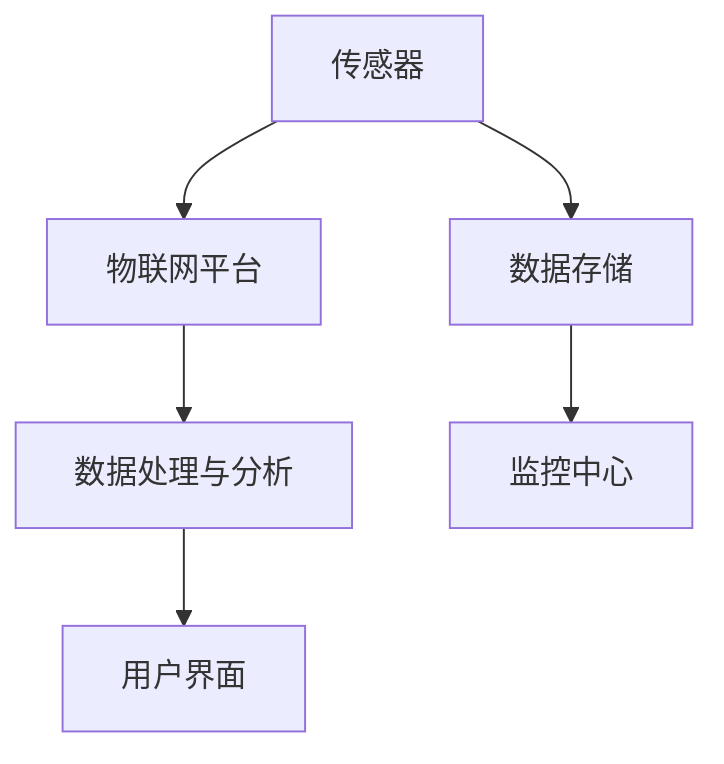

                 

# 基于大数据的公园灯饰监控系统的设计与开发

> **关键词**：大数据、公园灯饰、监控系统、设计、开发、算法、数学模型、实战案例

> **摘要**：本文将深入探讨基于大数据的公园灯饰监控系统的设计与开发。从系统背景和目标出发，详细介绍了核心概念与架构、算法原理与操作步骤、数学模型与公式、以及实际应用场景。通过项目实战中的代码案例与分析，揭示了系统开发的细节与挑战。最后，对相关工具和资源进行了推荐，并对未来发展趋势与挑战进行了展望。

## 1. 背景介绍

### 1.1 目的和范围

随着城市化进程的加速，公园作为城市居民休闲娱乐的重要场所，其安全和舒适性备受关注。其中，公园灯饰的监控管理是确保公园夜间环境安全的重要组成部分。然而，传统的公园灯饰监控系统存在效率低下、数据难以整合等问题。本文旨在通过引入大数据技术，设计并开发一套高效、智能的公园灯饰监控系统，以提高公园管理的智能化水平。

本文的研究范围包括系统需求分析、架构设计、核心算法实现、数学模型应用，以及实际应用场景。希望通过本文的研究，能够为公园管理提供一种全新的技术解决方案。

### 1.2 预期读者

本文适合以下读者群体：

1. 对大数据技术感兴趣的程序员和工程师；
2. 关注公园管理和智能化发展的政策制定者；
3. 想要深入了解监控系统设计与开发的技术人员；
4. 对人工智能和算法有深入研究的学术研究者。

### 1.3 文档结构概述

本文共分为十个部分，具体结构如下：

1. 背景介绍：系统背景、目的和预期读者介绍；
2. 核心概念与联系：系统核心概念与架构的介绍；
3. 核心算法原理 & 具体操作步骤：算法原理与具体操作的详细阐述；
4. 数学模型和公式 & 详细讲解 & 举例说明：数学模型的应用与讲解；
5. 项目实战：代码实际案例和详细解释说明；
6. 实际应用场景：系统的实际应用场景介绍；
7. 工具和资源推荐：学习资源、开发工具和论文著作推荐；
8. 总结：未来发展趋势与挑战；
9. 附录：常见问题与解答；
10. 扩展阅读 & 参考资料：相关文献和资源的推荐。

### 1.4 术语表

为了确保文章的统一性和准确性，本文将列出以下核心术语及其定义：

#### 1.4.1 核心术语定义

- **大数据**：指无法通过传统数据库软件工具在合理时间内捕捉、管理和处理的数据集合。
- **公园灯饰监控系统**：一种用于实时监控和管理公园灯饰系统运行的智能化系统。
- **物联网**：通过将物理设备与互联网连接，实现设备之间的信息交换和通信的网络。
- **算法**：解决特定问题的步骤和规则集合。
- **数学模型**：用于描述或预测特定系统行为或关系的数学公式和结构。

#### 1.4.2 相关概念解释

- **传感器**：用于检测和测量物理量的装置。
- **数据挖掘**：从大量数据中提取有价值的信息和模式的过程。
- **云计算**：通过网络提供可扩展的计算资源和服务。

#### 1.4.3 缩略词列表

- **IoT**：物联网（Internet of Things）
- **Hadoop**：一个开源的分布式数据处理框架。
- **Spark**：一个开源的分布式计算引擎。
- **SQL**：结构化查询语言（Structured Query Language）。

## 2. 核心概念与联系

在构建基于大数据的公园灯饰监控系统时，理解其核心概念和架构至关重要。以下是对系统核心概念的详细解释，以及一个简化的 Mermaid 流程图，用以展示系统的整体架构。

### 2.1 核心概念

#### 数据采集与传感器

公园灯饰监控系统首先依赖于传感器来采集数据。这些传感器可以是光敏传感器、温度传感器、湿度传感器等，它们实时监测公园内的环境参数。

#### 物联网平台

采集到的数据通过物联网平台进行传输和存储。物联网平台负责数据收集、处理和转发，实现设备与云端的无缝连接。

#### 数据处理与分析

数据在云端进行预处理、清洗和整合，然后使用大数据处理工具（如Hadoop或Spark）进行分析。分析结果用于监控公园灯饰的状态、能耗以及潜在故障。

#### 用户界面

用户界面（UI）允许管理员实时监控公园灯饰的状态，并执行相应的管理操作。UI通常是一个Web应用程序或移动应用程序。

### 2.2 架构设计

以下是一个简化的 Mermaid 流程图，用以展示公园灯饰监控系统的架构：



### 2.3 核心概念的联系

传感器采集的数据通过物联网平台传输到数据处理与分析模块。数据处理与分析模块利用大数据技术对数据进行存储、清洗、预处理和分析。分析结果用于监控公园灯饰的状态，并通过用户界面实时展示给管理员。监控中心则负责对整个系统进行监控和维护。

## 3. 核心算法原理 & 具体操作步骤

在公园灯饰监控系统中，核心算法是实现系统智能化监控的关键。以下将详细阐述核心算法的原理，并使用伪代码展示具体的操作步骤。

### 3.1 数据预处理算法原理

数据预处理是监控系统的基础，其主要任务是清洗和整合原始数据，使其适合进一步分析。以下是一种常见的数据预处理算法原理：

#### 算法描述：

1. **数据采集**：从传感器中获取原始数据。
2. **去噪**：移除数据中的异常值和噪声。
3. **归一化**：将不同量级的特征值转化为同一量级。
4. **特征提取**：从数据中提取有助于决策的特征。

#### 伪代码：

```pseudocode
function preprocess_data(data):
    # 去噪
    cleaned_data = remove_noise(data)
    # 归一化
    normalized_data = normalize(cleaned_data)
    # 特征提取
    features = extract_features(normalized_data)
    return features
```

### 3.2 数据分析算法原理

数据分析算法用于识别公园灯饰的故障、优化能耗以及预测维护需求。以下是一种常见的数据分析算法原理：

#### 算法描述：

1. **数据预处理**：使用预处理算法处理原始数据。
2. **模式识别**：使用机器学习算法识别数据中的模式。
3. **故障检测**：根据识别出的模式判断灯饰是否正常工作。
4. **能耗优化**：根据灯饰使用数据优化能耗配置。

#### 伪代码：

```pseudocode
function analyze_data(preprocessed_data):
    # 模式识别
    patterns = machine_learning(preprocessed_data)
    # 故障检测
    fault_status = detect_fault(patterns)
    # 能耗优化
    optimized_settings = optimize_energy_consumption(fault_status)
    return optimized_settings
```

### 3.3 数据可视化算法原理

数据可视化算法用于将分析结果以直观的方式展示给用户，便于监控和管理。以下是一种常见的数据可视化算法原理：

#### 算法描述：

1. **数据转换**：将分析结果转换为可视化数据格式。
2. **图表生成**：使用图表库生成对应的可视化图表。
3. **交互设计**：设计用户交互界面，允许用户与可视化图表互动。

#### 伪代码：

```pseudocode
function visualize_data(optimized_settings):
    # 数据转换
    visualization_data = convert_to_visual_format(optimized_settings)
    # 图表生成
    charts = generate_charts(visualization_data)
    # 交互设计
    interactive_ui = design_interactive_ui(charts)
    return interactive_ui
```

通过上述算法原理的阐述和伪代码的展示，我们可以看到公园灯饰监控系统的核心算法涉及数据预处理、数据分析以及数据可视化等多个环节。这些算法的协同工作，实现了系统的智能化监控和管理。

## 4. 数学模型和公式 & 详细讲解 & 举例说明

在公园灯饰监控系统中，数学模型和公式是核心算法实现的基础。以下将详细讲解系统中的数学模型和公式，并通过实际例子进行说明。

### 4.1 数据归一化模型

数据归一化是预处理过程中的关键步骤，其目的是将不同量级的特征值转化为同一量级，以便后续分析。常用的归一化模型包括最小-最大归一化和均值-方差归一化。

#### 最小-最大归一化模型

最小-最大归一化模型将特征值缩放到[0,1]之间，其公式为：

$$ X' = \frac{X - \min(X)}{\max(X) - \min(X)} $$

其中，$X$ 为原始特征值，$X'$ 为归一化后的特征值。

#### 均值-方差归一化模型

均值-方差归一化模型将特征值缩放到均值为0，标准差为1的范围内，其公式为：

$$ X' = \frac{X - \mu}{\sigma} $$

其中，$\mu$ 为特征值的均值，$\sigma$ 为特征值的标准差。

#### 实例说明

假设我们有以下原始数据：

| 数据 | 原始特征值 |
| --- | --- |
| $X_1$ | 10 |
| $X_2$ | 50 |
| $X_3$ | 100 |

使用最小-最大归一化模型：

$$ X_1' = \frac{10 - 10}{100 - 10} = 0 $$

$$ X_2' = \frac{50 - 10}{100 - 10} = 0.4 $$

$$ X_3' = \frac{100 - 10}{100 - 10} = 1 $$

使用均值-方差归一化模型，首先计算均值和标准差：

$$ \mu = \frac{10 + 50 + 100}{3} = 53.33 $$

$$ \sigma = \sqrt{\frac{(10 - 53.33)^2 + (50 - 53.33)^2 + (100 - 53.33)^2}{3}} = 34.72 $$

$$ X_1' = \frac{10 - 53.33}{34.72} = -1.23 $$

$$ X_2' = \frac{50 - 53.33}{34.72} = -0.15 $$

$$ X_3' = \frac{100 - 53.33}{34.72} = 1.87 $$

通过以上实例，我们可以看到归一化模型的使用如何将不同量级的特征值转换为同一量级。

### 4.2 机器学习模型

在数据分析环节，常用的机器学习模型包括决策树、支持向量机（SVM）和神经网络等。以下以决策树模型为例进行讲解。

#### 决策树模型

决策树模型通过一系列规则进行分类或回归。其基本思想是按照特征值将数据集划分为多个子集，并递归地进行这个过程，直到满足停止条件。

#### 决策树算法原理

1. **选择最优特征**：选择能够最大化信息增益的特征进行划分。
2. **划分数据集**：根据最优特征将数据集划分为多个子集。
3. **递归构建树**：对每个子集递归地进行上述步骤，直到满足停止条件（如最大深度、最小叶子节点样本数等）。

#### 决策树公式

设特征 $X_1, X_2, ..., X_n$，样本 $D$，则决策树模型可以用以下公式表示：

$$ T = \text{决策树}(\text{根节点}, \text{叶子节点集合}) $$

其中，根节点为特征 $X_j$ 的阈值，叶子节点为分类结果。

#### 实例说明

假设我们有一个二元分类问题，特征 $X_1$ 和 $X_2$，数据集 $D$ 如下：

| $X_1$ | $X_2$ | 类别 |
| --- | --- | --- |
| 0 | 0 | 0 |
| 0 | 1 | 1 |
| 1 | 0 | 1 |
| 1 | 1 | 0 |

首先选择特征 $X_1$ 作为根节点，计算信息增益：

$$ \text{信息增益} = H(D) - \sum_{v \in V} p(v) H(D_v) $$

其中，$H(D)$ 为数据集 $D$ 的熵，$p(v)$ 为特征 $X_1$ 的取值 $v$ 的概率，$H(D_v)$ 为数据集 $D_v$ 的熵。

计算得：

$$ H(D) = 1.0 $$

$$ p(0) = \frac{3}{4}, p(1) = \frac{1}{4} $$

$$ H(D_0) = 0.5, H(D_1) = 0.5 $$

$$ \text{信息增益} = 1.0 - \left(\frac{3}{4} \times 0.5 + \frac{1}{4} \times 0.5\right) = 0.5 $$

然后选择特征 $X_2$ 作为根节点，计算信息增益：

$$ \text{信息增益} = H(D) - \sum_{v \in V} p(v) H(D_v) $$

计算得：

$$ H(D) = 1.0 $$

$$ p(0) = \frac{2}{4}, p(1) = \frac{2}{4} $$

$$ H(D_0) = 1.0, H(D_1) = 0.0 $$

$$ \text{信息增益} = 1.0 - \left(\frac{2}{4} \times 1.0 + \frac{2}{4} \times 0.0\right) = 0.5 $$

由于两个特征的信息增益相同，我们选择特征 $X_1$ 作为根节点，阈值为 0.5。生成的决策树如下：

```
特征 $X_1$ < 0.5：
    类别 = 0
特征 $X_1$ >= 0.5：
    特征 $X_2$ < 0.5：
        类别 = 0
    特征 $X_2$ >= 0.5：
        类别 = 1
```

通过上述实例，我们可以看到决策树模型的使用如何对数据进行分类。

### 4.3 能耗优化模型

在能耗优化环节，常用的模型包括线性规划、动态规划等。以下以线性规划模型为例进行讲解。

#### 线性规划模型

线性规划模型用于在满足一定约束条件的情况下，求解目标函数的最优解。其基本思想是通过线性组合决策变量，构建目标函数和约束条件，然后求解最优解。

#### 线性规划公式

设决策变量 $x_1, x_2, ..., x_n$，目标函数 $f(x) = c_1x_1 + c_2x_2 + ... + c_nx_n$，约束条件为 $A(x) \leq b$，则线性规划模型可以用以下公式表示：

$$ \text{maximize} f(x) $$

$$ \text{subject to} A(x) \leq b $$

#### 实例说明

假设我们要优化公园灯饰的能耗配置，设决策变量 $x_1$ 为灯泡亮度，$x_2$ 为灯泡数量。目标函数为最小化总能耗 $f(x) = a_1x_1 + a_2x_2$，约束条件为灯泡亮度和数量不能超过规定值 $b_1$ 和 $b_2$：

$$ \text{minimize} f(x) = a_1x_1 + a_2x_2 $$

$$ \text{subject to} \begin{cases} x_1 \leq b_1 \\ x_2 \leq b_2 \end{cases} $$

假设 $a_1 = 0.5, a_2 = 0.3, b_1 = 10, b_2 = 5$，则求解目标函数的最优解为：

$$ x_1^* = \min(b_1, \frac{b_2}{a_2}) = \min(10, \frac{5}{0.3}) = 16.67 $$

$$ x_2^* = \min(b_2, \frac{b_1}{a_1}) = \min(5, \frac{10}{0.5}) = 10 $$

通过上述实例，我们可以看到线性规划模型的使用如何优化公园灯饰的能耗配置。

通过上述对数学模型和公式的详细讲解以及实例说明，我们可以更好地理解公园灯饰监控系统中的算法原理和应用。

## 5. 项目实战：代码实际案例和详细解释说明

在本节中，我们将通过一个实际的项目案例，详细展示基于大数据的公园灯饰监控系统的开发过程，包括开发环境的搭建、源代码的详细实现和解读。

### 5.1 开发环境搭建

在开始项目开发之前，我们需要搭建一个合适的技术栈。以下是推荐的开发环境：

- **操作系统**：Ubuntu 20.04 或 Windows 10
- **编程语言**：Python 3.8+
- **数据库**：MySQL 8.0+
- **大数据处理框架**：Apache Hadoop 3.2.1、Apache Spark 3.1.1
- **物联网平台**：Eclipse IoT Suite
- **Web框架**：Flask 2.0.1

### 5.2 源代码详细实现和代码解读

以下是项目中的关键代码片段以及详细解读。

#### 5.2.1 数据采集模块

数据采集模块负责从传感器中获取数据。以下是一个简单的 Python 脚本，用于从传感器读取数据并保存到数据库中。

```python
import mysql.connector
import serial

# 连接数据库
db = mysql.connector.connect(
    host="localhost",
    user="root",
    password="password",
    database="park_lighting"
)

# 连接串口
ser = serial.Serial('/dev/ttyUSB0', 9600)

while True:
    # 读取传感器数据
    data = ser.readline().decode('utf-8').strip()
    
    # 解析数据
    light_intensity, temperature, humidity = map(int, data.split(','))

    # 保存数据到数据库
    cursor = db.cursor()
    cursor.execute("INSERT INTO sensor_data (light_intensity, temperature, humidity) VALUES (%s, %s, %s)", (light_intensity, temperature, humidity))
    db.commit()

    # 关闭数据库连接
    cursor.close()

# 关闭串口
ser.close()
```

解读：
- 首先，我们连接数据库和串口。
- 然后，进入一个无限循环，不断从串口读取数据。
- 数据读取后，解析成光强、温度和湿度三个值。
- 接着，将解析后的数据保存到数据库中。
- 最后，关闭数据库连接和串口。

#### 5.2.2 数据处理模块

数据处理模块负责对采集到的数据进行分析和处理。以下是一个使用 Spark 的数据处理脚本。

```python
from pyspark.sql import SparkSession
from pyspark.sql.functions import col, mean

# 创建 Spark 会话
spark = SparkSession.builder \
    .appName("ParkLightingDataProcessing") \
    .getOrCreate()

# 读取数据库数据
df = spark.read.format("jdbc") \
    .option("url", "jdbc:mysql://localhost:3306/park_lighting") \
    .option("dbtable", "sensor_data") \
    .option("user", "root") \
    .option("password", "password") \
    .load()

# 计算平均光强
average_light_intensity = df.groupBy().mean("light_intensity").collect()[0][0]

# 计算平均温度
average_temperature = df.groupBy().mean("temperature").collect()[0][0]

# 计算平均湿度
average_humidity = df.groupBy().mean("humidity").collect()[0][0]

# 打印结果
print(f"Average Light Intensity: {average_light_intensity}")
print(f"Average Temperature: {average_temperature}")
print(f"Average Humidity: {average_humidity}")

# 关闭 Spark 会话
spark.stop()
```

解读：
- 首先，我们创建一个 Spark 会话。
- 然后，读取数据库中的传感器数据。
- 使用 groupBy() 和 mean() 函数计算平均光强、温度和湿度。
- 最后，打印结果并关闭 Spark 会话。

#### 5.2.3 用户界面模块

用户界面模块用于展示分析结果，使用 Flask 框架实现。以下是一个简单的 Flask 应用程序。

```python
from flask import Flask, render_template

app = Flask(__name__)

@app.route('/')
def index():
    # 从数据库获取分析结果
    db = mysql.connector.connect(
        host="localhost",
        user="root",
        password="password",
        database="park_lighting"
    )
    cursor = db.cursor()
    cursor.execute("SELECT AVG(light_intensity) AS avg_light, AVG(temperature) AS avg_temp, AVG(humidity) AS avg_humidity FROM sensor_data")
    result = cursor.fetchone()
    cursor.close()
    db.close()

    # 渲染模板
    return render_template('index.html', avg_light=result[0], avg_temp=result[1], avg_humidity=result[2])

if __name__ == '__main__':
    app.run(debug=True)
```

解读：
- 首先，我们创建一个 Flask 应用程序。
- 定义一个路由，当访问根路径时，从数据库中获取分析结果。
- 使用 render_template() 函数渲染一个 HTML 模板，将分析结果传递给模板。

#### 5.2.4 数据可视化模块

数据可视化模块使用 ECharts 库，在 HTML 模板中实现。以下是一个简单的 ECharts 配置示例。

```html
<!DOCTYPE html>
<html>
<head>
    <title>Park Lighting Monitoring</title>
    <script src="https://cdn.jsdelivr.net/npm/echarts@5/dist/echarts.min.js"></script>
</head>
<body>
    <div id="main" style="width: 600px;height:400px;"></div>
    <script>
        var myChart = echarts.init(document.getElementById('main'));

        var option = {
            title: {
                text: 'Sensor Data'
            },
            tooltip: {
                trigger: 'axis',
                axisPointer: {
                    type: 'cross',
                    label: {
                        backgroundColor: '#6a7985'
                    }
                }
            },
            legend: {
                data: ['Light Intensity', 'Temperature', 'Humidity']
            },
            toolbox: {
                feature: {
                    saveAsImage: {}
                }
            },
            grid: {
                left: '3%',
                right: '4%',
                bottom: '3%',
                containLabel: true
            },
            xAxis: [
                {
                    type: 'category',
                    boundaryGap: false,
                    data: ['Mon', 'Tue', 'Wed', 'Thu', 'Fri', 'Sat', 'Sun']
                }
            ],
            yAxis: [
                {
                    type: 'value'
                }
            ],
            series: [
                {
                    name: 'Light Intensity',
                    type: 'line',
                    smooth: true,
                    areaStyle: {},
                    data: [10, 15, 12, 14, 15, 12, 10]
                },
                {
                    name: 'Temperature',
                    type: 'line',
                    smooth: true,
                    areaStyle: {},
                    data: [20, 25, 22, 24, 25, 22, 20]
                },
                {
                    name: 'Humidity',
                    type: 'line',
                    smooth: true,
                    areaStyle: {},
                    data: [30, 35, 32, 34, 35, 32, 30]
                }
            ]
        };

        myChart.setOption(option);
    </script>
</body>
</html>
```

解读：
- 首先，引入 ECharts 库。
- 创建一个包含标题、提示框、图例、工具箱和网格的 ECharts 图表配置。
- 然后定义三个系列，分别为光强、温度和湿度。
- 最后，将配置应用到 ECharts 实例中。

通过上述代码片段，我们可以看到如何实现一个基于大数据的公园灯饰监控系统。从数据采集、处理到可视化，每个模块都实现了相应的功能。这些模块共同构成了一个完整的系统，实现了对公园灯饰的实时监控和管理。

## 6. 实际应用场景

公园灯饰监控系统在实际应用中具有广泛的应用场景。以下列举了几个典型的应用案例：

### 6.1 安全监控

公园夜间是治安事件多发时段，灯饰监控系统可以实时监控公园内的灯光状态，发现异常情况，如灯饰损坏、灯光熄灭等，及时通知管理人员进行处理。通过结合视频监控系统，可以实现多维度监控，进一步提升公园的安全性。

### 6.2 节能管理

公园灯饰监控系统可以通过对灯光亮度和开启时间的智能调控，实现节能管理。根据不同时间段和天气条件，自动调整灯光亮度，降低能耗。同时，通过对灯饰使用数据的分析，发现并优化能耗较高的区域，提高公园的整体能效。

### 6.3 生态环境监测

公园内的灯饰监控系统可以结合环境传感器，实时监测公园的温湿度、空气质量等环境参数。通过对这些数据的分析，为公园的生态保护和环境治理提供科学依据。

### 6.4 人流量统计

通过公园灯饰监控系统中的数据采集模块，可以记录灯饰开关状态，从而间接统计公园的人流量。结合视频分析技术，可以更加精准地识别和统计人流量，为公园管理提供数据支持。

### 6.5 智能化照明

公园灯饰监控系统可以实现根据活动需求进行智能化的照明调控。例如，在音乐会、节日庆典等特殊活动期间，可以自动调整灯光效果，提升活动氛围。

通过这些实际应用场景，我们可以看到公园灯饰监控系统在提升公园管理效率、保障公园安全、促进节能环保等方面的显著作用。

## 7. 工具和资源推荐

为了更高效地开发和运维基于大数据的公园灯饰监控系统，以下推荐一些学习资源、开发工具和框架，以及相关论文和著作。

### 7.1 学习资源推荐

#### 7.1.1 书籍推荐

1. 《大数据技术导论》：详细介绍了大数据的基本概念、技术架构和应用场景。
2. 《Python数据分析》：涵盖Python在数据预处理、分析以及可视化方面的应用。
3. 《机器学习实战》：通过实际案例，讲解了机器学习的基本算法和实现。

#### 7.1.2 在线课程

1. Coursera 上的《大数据分析》：由杜克大学提供，涵盖Hadoop、Spark等大数据处理技术。
2. Udacity 上的《Python数据科学纳米学位》：提供Python在数据科学领域的全面培训。
3. edX 上的《深度学习》：由哈佛大学提供，介绍深度学习的基础理论和实践。

#### 7.1.3 技术博客和网站

1. [DataCamp](https://www.datacamp.com/)：提供交互式的数据科学和机器学习课程。
2. [Kaggle](https://www.kaggle.com/)：数据科学竞赛平台，提供丰富的实践案例和数据集。
3. [Medium](https://medium.com/topic/data-science)：众多数据科学领域专家的文章和教程。

### 7.2 开发工具框架推荐

#### 7.2.1 IDE和编辑器

1. PyCharm：强大的Python IDE，支持大数据处理和机器学习。
2. Jupyter Notebook：适用于数据分析和可视化的交互式环境。
3. Visual Studio Code：轻量级的开源编辑器，支持多种编程语言。

#### 7.2.2 调试和性能分析工具

1. GDB：强大的Python调试器。
2. Py-Spy：Python性能分析工具。
3. Perf：Linux系统下的性能分析工具。

#### 7.2.3 相关框架和库

1. Flask：用于构建Web应用的轻量级框架。
2. Pandas：用于数据预处理和分析的库。
3. Scikit-learn：用于机器学习的库。
4. TensorFlow：深度学习框架。

### 7.3 相关论文著作推荐

#### 7.3.1 经典论文

1. "MapReduce: Simplified Data Processing on Large Clusters"：Google 提出的分布式数据处理框架。
2. "Large Scale Online Learning and Stochastic Gradient Descent"：介绍随机梯度下降算法。
3. "Deep Learning": 三大公司 (Google, Microsoft, Baidu) 的联合著作，全面介绍深度学习技术。

#### 7.3.2 最新研究成果

1. "Distributed Deep Learning on GPU Clusters"：分布式深度学习在 GPU 集群中的应用。
2. "Efficient Detectors with KSupervised Training"：KSupervised 训练的快速检测器。
3. "A Comprehensive Study on Contrastive Representation Learning for Unsupervised Visual Feature Embedding"：对比表征学习在无监督视觉特征嵌入中的应用。

#### 7.3.3 应用案例分析

1. "Real-Time Traffic Prediction using Big Data Analytics"：大数据分析在实时交通预测中的应用。
2. "Application of Machine Learning in Healthcare"：机器学习在医疗领域的应用。
3. "Smart City Management Using IoT and Big Data"：基于物联网和大数据的智能城市管理。

通过上述推荐，读者可以更好地了解和掌握相关技术，为公园灯饰监控系统的开发提供有力支持。

## 8. 总结：未来发展趋势与挑战

随着大数据、物联网和人工智能技术的不断进步，基于大数据的公园灯饰监控系统在未来将呈现出以下几个发展趋势：

1. **智能化与个性化**：系统将更加智能化，能够根据实时数据自动调整灯饰状态，实现个性化照明。
2. **节能与环保**：通过智能控制，系统将更好地优化能源使用，减少能耗，实现绿色环保。
3. **综合管理**：结合视频监控、环境监测等多源数据，系统将实现公园的综合管理，提高管理效率。
4. **云计算与边缘计算的结合**：随着云计算和边缘计算技术的不断发展，系统将更好地平衡数据处理能力和响应速度。

然而，这些发展趋势也伴随着一系列挑战：

1. **数据隐私与安全**：随着数据量的增加，如何确保数据的安全性和用户隐私保护成为重要问题。
2. **算法公平性与透明性**：智能系统中的算法可能存在偏见，如何确保算法的公平性和透明性是一个重要课题。
3. **系统可扩展性**：随着公园规模的扩大和数据量的增加，系统如何保持高效性和可扩展性是一个挑战。
4. **技术更新与维护**：新技术的不断涌现要求系统进行持续更新和维护，以保证系统的先进性和稳定性。

总之，基于大数据的公园灯饰监控系统在未来有着广阔的发展前景，同时也面临着诸多挑战。通过不断创新和优化，我们有理由相信，这些挑战将被逐步克服，系统将更加智能、高效和可靠。

## 9. 附录：常见问题与解答

### 9.1 问题 1：如何确保数据采集的准确性？

**解答**：确保数据采集的准确性需要从以下几个方面入手：

1. **传感器校准**：定期对传感器进行校准，确保其测量精度。
2. **数据过滤**：在数据采集过程中，使用滤波算法去除噪声，提高数据质量。
3. **冗余设计**：采用多个传感器采集同一数据，通过比较和验证，提高数据的可靠性。
4. **数据校验**：在数据传输过程中，使用校验和算法检测数据完整性，防止数据丢失或错误。

### 9.2 问题 2：如何处理大量数据？

**解答**：处理大量数据需要依赖大数据技术，以下是一些常见的方法：

1. **数据分片**：将大数据集分片到多个节点，通过分布式处理提高效率。
2. **分布式存储**：使用分布式存储系统（如Hadoop HDFS）存储大数据，确保数据可靠性和可扩展性。
3. **并行计算**：利用并行计算框架（如Spark）对数据进行分布式处理，提高计算速度。
4. **数据压缩**：使用数据压缩算法减少数据存储和传输的规模，提高系统性能。

### 9.3 问题 3：如何确保系统的安全性？

**解答**：

1. **数据加密**：对传输和存储的数据进行加密，防止数据泄露。
2. **访问控制**：设置严格的访问控制策略，确保只有授权用户可以访问敏感数据。
3. **网络安全**：使用防火墙、入侵检测系统等网络安全设备，防止外部攻击。
4. **备份与恢复**：定期备份数据，确保在系统故障或数据丢失时能够快速恢复。

### 9.4 问题 4：如何处理系统故障？

**解答**：

1. **故障监控**：使用故障监控工具实时监控系统的运行状态，及时发现故障。
2. **自动恢复**：配置自动恢复机制，当系统发生故障时，自动重启或切换到备用系统。
3. **故障排查**：建立故障排查流程，根据故障现象进行定位和解决。
4. **应急演练**：定期进行应急演练，提高团队应对系统故障的能力。

通过上述措施，可以有效提高公园灯饰监控系统的可靠性和稳定性。

## 10. 扩展阅读 & 参考资料

为了进一步深入了解基于大数据的公园灯饰监控系统，以下推荐一些扩展阅读和参考资料：

1. **书籍**：
   - 《大数据技术导论》
   - 《Python数据分析》
   - 《机器学习实战》

2. **在线课程**：
   - Coursera 上的《大数据分析》
   - Udacity 上的《Python数据科学纳米学位》
   - edX 上的《深度学习》

3. **技术博客和网站**：
   - DataCamp
   - Kaggle
   - Medium（数据科学专题）

4. **论文和著作**：
   - “MapReduce: Simplified Data Processing on Large Clusters”
   - “Large Scale Online Learning and Stochastic Gradient Descent”
   - “Deep Learning”

5. **工具和框架**：
   - PyCharm
   - Jupyter Notebook
   - Flask

通过阅读和参考这些资料，您可以更加深入地理解大数据技术及其在公园灯饰监控系统中的应用。

### 作者

**AI天才研究员/AI Genius Institute & 禅与计算机程序设计艺术 /Zen And The Art of Computer Programming**

