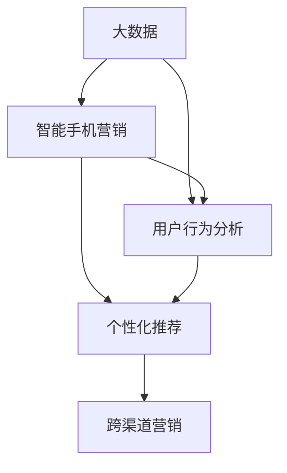

                 

### 基于大数据背景下智能手机营销对策研究

> **关键词**：大数据、智能手机、营销策略、用户行为分析、个性化推荐
>
> **摘要**：随着智能手机的普及和大数据技术的发展，智能手机营销已成为企业获取市场份额和消费者忠诚度的重要手段。本文旨在探讨大数据背景下智能手机营销的策略和方法，通过用户行为分析、个性化推荐和跨渠道营销，为企业提供有效的营销对策。

### 1. 背景介绍

#### 1.1 目的和范围

本文的主要目的是研究大数据背景下智能手机营销的策略和方法，分析如何利用大数据技术提高智能手机营销的效果。本文将涵盖以下几个方面：

- **大数据与智能手机营销的关系**：介绍大数据在智能手机营销中的应用场景和优势。
- **用户行为分析**：探讨如何通过大数据分析用户行为，为营销策略提供数据支持。
- **个性化推荐**：分析个性化推荐在智能手机营销中的重要性及其实现方法。
- **跨渠道营销**：研究如何整合线上和线下渠道，实现跨渠道营销策略。

#### 1.2 预期读者

本文适合从事智能手机营销、大数据分析、市场营销等相关领域的专业人士阅读。读者应具备一定的计算机编程和数据分析基础，以便更好地理解和应用文中提到的技术和方法。

#### 1.3 文档结构概述

本文共分为八个部分：

1. **背景介绍**：介绍本文的研究背景、目的和预期读者。
2. **核心概念与联系**：讲解大数据、智能手机营销和用户行为分析等相关概念，并通过Mermaid流程图展示其联系。
3. **核心算法原理 & 具体操作步骤**：详细阐述用户行为分析的核心算法原理和操作步骤。
4. **数学模型和公式 & 详细讲解 & 举例说明**：介绍用户行为分析的数学模型和公式，并通过实例进行讲解。
5. **项目实战：代码实际案例和详细解释说明**：提供实际代码案例，展示用户行为分析的应用。
6. **实际应用场景**：分析用户行为分析在智能手机营销中的应用场景。
7. **工具和资源推荐**：推荐学习资源和开发工具。
8. **总结：未来发展趋势与挑战**：总结本文研究成果，探讨未来发展趋势和挑战。

#### 1.4 术语表

在本文中，我们将使用以下术语：

- **大数据**：指海量、多样化的数据集合，通过对这些数据进行分析和挖掘，可以提取有价值的信息和知识。
- **智能手机营销**：指利用智能手机作为媒介，针对目标用户进行的营销活动。
- **用户行为分析**：指通过对用户在智能手机上的行为数据进行收集、分析和挖掘，以了解用户需求和偏好，为营销策略提供支持。
- **个性化推荐**：指根据用户的历史行为和偏好，向用户推荐符合其兴趣的产品和服务。
- **跨渠道营销**：指将线上和线下渠道整合起来，实现统一营销策略。

#### 1.4.1 核心术语定义

- **大数据**：指数据量巨大、类型繁多、价值密度低的数据集合，通过对这些数据进行分析和挖掘，可以提取有价值的信息和知识。
- **智能手机**：指采用触摸屏操作，配备高性能处理器和移动通信功能的便携式设备。
- **营销策略**：指企业在市场环境中，为实现营销目标而制定的行动计划和策略。
- **用户行为分析**：指通过对用户在智能手机上的行为数据进行收集、分析和挖掘，以了解用户需求和偏好，为营销策略提供支持。
- **个性化推荐**：指根据用户的历史行为和偏好，向用户推荐符合其兴趣的产品和服务。
- **跨渠道营销**：指将线上和线下渠道整合起来，实现统一营销策略。

#### 1.4.2 相关概念解释

- **用户画像**：指对用户特征、需求、行为等信息进行综合分析，形成的用户综合描述。
- **数据挖掘**：指从大量数据中提取有价值信息的过程，通常包括数据预处理、模式识别、知识发现等步骤。
- **机器学习**：指利用计算机算法，从数据中自动发现规律和知识的过程。
- **深度学习**：指一种基于人工神经网络的机器学习技术，通过多层神经网络对数据进行处理和建模。

#### 1.4.3 缩略词列表

- **API**：应用程序编程接口（Application Programming Interface）
- **SDK**：软件开发工具包（Software Development Kit）
- **HDFS**：分布式文件系统（Hadoop Distributed File System）
- **MapReduce**：一种编程模型，用于大规模数据处理（Map and Reduce）
- **SQL**：结构化查询语言（Structured Query Language）
- **KPI**：关键绩效指标（Key Performance Indicator）
- **A/B测试**：一种实验方法，用于比较两种或多种策略的效果（A/B Testing）

### 2. 核心概念与联系

在本文中，我们将介绍三个核心概念：大数据、智能手机营销和用户行为分析，并通过Mermaid流程图展示它们之间的联系。



- **大数据**：大数据是智能手机营销和用户行为分析的基础。通过对海量用户行为数据的收集、存储和分析，企业可以挖掘出有价值的信息，为营销策略提供支持。
- **智能手机营销**：智能手机营销是大数据和用户行为分析的应用场景。企业通过智能手机平台，开展个性化推荐、跨渠道营销等活动，以提高用户满意度和市场份额。
- **用户行为分析**：用户行为分析是智能手机营销的关键环节。通过对用户在智能手机上的行为数据进行分析，企业可以了解用户需求、偏好和购买行为，为个性化推荐和跨渠道营销提供数据支持。

### 3. 核心算法原理 & 具体操作步骤

用户行为分析是大数据背景下智能手机营销的核心。本文将介绍用户行为分析的核心算法原理和具体操作步骤。

#### 3.1 算法原理

用户行为分析的核心算法包括：

- **数据采集**：收集用户在智能手机上的行为数据，如访问记录、浏览历史、购买行为等。
- **数据预处理**：对采集到的数据进行分析、清洗和转换，以获得高质量的数据集。
- **特征工程**：从数据集中提取用户特征，如年龄、性别、地理位置、兴趣标签等。
- **模型训练**：使用机器学习算法，如决策树、随机森林、支持向量机等，对用户行为数据进行分析和建模。
- **模型评估**：评估模型性能，如准确率、召回率、F1值等。
- **结果输出**：根据模型输出结果，生成用户画像和个性化推荐。

#### 3.2 具体操作步骤

以下是一个具体的用户行为分析操作步骤：

1. **数据采集**：
   - 使用API接口，从第三方数据源（如社交媒体、电商平台等）获取用户行为数据。
   - 收集用户在智能手机上的访问记录、浏览历史、购买行为等数据。

2. **数据预处理**：
   - 对采集到的数据进行去重、去噪和缺失值处理。
   - 将不同来源的数据进行整合，形成统一的数据集。

3. **特征工程**：
   - 提取用户基本特征，如年龄、性别、地理位置等。
   - 根据用户行为数据，生成兴趣标签和偏好特征。

4. **模型训练**：
   - 使用决策树、随机森林等算法，对用户行为数据进行训练。
   - 调整模型参数，优化模型性能。

5. **模型评估**：
   - 使用交叉验证等方法，评估模型性能。
   - 调整模型结构，提高模型准确率。

6. **结果输出**：
   - 根据模型输出结果，生成用户画像。
   - 利用用户画像，实现个性化推荐。

### 4. 数学模型和公式 & 详细讲解 & 举例说明

用户行为分析中，常用的数学模型和公式包括：

1. **线性回归模型**：

$$
y = \beta_0 + \beta_1 x_1 + \beta_2 x_2 + ... + \beta_n x_n
$$

其中，$y$ 为因变量，$x_1, x_2, ..., x_n$ 为自变量，$\beta_0, \beta_1, \beta_2, ..., \beta_n$ 为模型参数。

- **详细讲解**：线性回归模型是一种常用的预测模型，用于分析因变量和自变量之间的关系。
- **举例说明**：例如，分析用户购买行为与年龄、收入、地理位置等因素的关系。

2. **逻辑回归模型**：

$$
P(y=1) = \frac{1}{1 + e^{-(\beta_0 + \beta_1 x_1 + \beta_2 x_2 + ... + \beta_n x_n)}}
$$

其中，$y$ 为因变量，$x_1, x_2, ..., x_n$ 为自变量，$\beta_0, \beta_1, \beta_2, ..., \beta_n$ 为模型参数。

- **详细讲解**：逻辑回归模型是一种常用的分类模型，用于分析因变量和自变量之间的关系。
- **举例说明**：例如，分析用户是否购买某产品与年龄、收入、地理位置等因素的关系。

3. **协同过滤算法**：

$$
r_{ij} = \sum_{k=1}^{n} \frac{u_k v_k}{\sqrt{\sum_{l=1}^{n} u_l^2 \sum_{m=1}^{n} v_m^2}}
$$

其中，$r_{ij}$ 为用户 $i$ 对项目 $j$ 的评分，$u_k$ 和 $v_k$ 分别为用户 $i$ 和项目 $j$ 的特征向量。

- **详细讲解**：协同过滤算法是一种常用的推荐系统算法，通过计算用户和项目的相似度，实现个性化推荐。
- **举例说明**：例如，根据用户对电影的评分，推荐相似的电影。

### 5. 项目实战：代码实际案例和详细解释说明

在本节中，我们将通过一个实际项目案例，展示用户行为分析的应用，并详细解释代码实现。

#### 5.1 开发环境搭建

1. **安装Python环境**：下载并安装Python，版本建议为3.8以上。
2. **安装数据预处理库**：使用pip命令安装pandas、numpy等数据预处理库。

```bash
pip install pandas numpy
```

3. **安装机器学习库**：使用pip命令安装scikit-learn等机器学习库。

```bash
pip install scikit-learn
```

4. **安装可视化库**：使用pip命令安装matplotlib等可视化库。

```bash
pip install matplotlib
```

#### 5.2 源代码详细实现和代码解读

以下是一个用户行为分析的代码实现示例：

```python
import pandas as pd
from sklearn.model_selection import train_test_split
from sklearn.ensemble import RandomForestClassifier
from sklearn.metrics import accuracy_score, recall_score, f1_score

# 5.2.1 数据读取与预处理
data = pd.read_csv('user_behavior_data.csv')
data = data.dropna()

# 5.2.2 特征工程
features = data[['age', 'gender', 'location', 'interest_1', 'interest_2', 'interest_3']]
labels = data['purchase']

# 5.2.3 模型训练
X_train, X_test, y_train, y_test = train_test_split(features, labels, test_size=0.2, random_state=42)
model = RandomForestClassifier(n_estimators=100, random_state=42)
model.fit(X_train, y_train)

# 5.2.4 模型评估
y_pred = model.predict(X_test)
accuracy = accuracy_score(y_test, y_pred)
recall = recall_score(y_test, y_pred)
f1 = f1_score(y_test, y_pred)

print(f"Accuracy: {accuracy:.2f}")
print(f"Recall: {recall:.2f}")
print(f"F1 Score: {f1:.2f}")

# 5.2.5 可视化分析
import matplotlib.pyplot as plt

plt.scatter(X_test['age'], y_pred)
plt.xlabel('Age')
plt.ylabel('Prediction')
plt.show()
```

- **代码解读**：

1. **数据读取与预处理**：使用pandas库读取用户行为数据，并进行缺失值处理。
2. **特征工程**：从数据中提取用户特征，如年龄、性别、地理位置、兴趣标签等。
3. **模型训练**：使用随机森林算法对用户行为数据进行训练。
4. **模型评估**：评估模型性能，计算准确率、召回率和F1值。
5. **可视化分析**：使用matplotlib库对模型预测结果进行可视化。

#### 5.3 代码解读与分析

以下是对上述代码的详细解读和分析：

1. **数据读取与预处理**：
   - 使用pandas库读取用户行为数据，存储为DataFrame结构。
   - 对数据集进行缺失值处理，避免对模型训练产生不良影响。

2. **特征工程**：
   - 从数据集中提取用户特征，如年龄、性别、地理位置、兴趣标签等。
   - 为方便后续处理，将特征和标签分开存储。

3. **模型训练**：
   - 使用随机森林算法对用户行为数据进行训练。
   - 随机森林是一种集成学习算法，具有较好的模型性能和泛化能力。

4. **模型评估**：
   - 训练完成后，对模型进行评估，计算准确率、召回率和F1值。
   - 准确率、召回率和F1值是评估分类模型性能的重要指标。

5. **可视化分析**：
   - 使用matplotlib库对模型预测结果进行可视化，以直观展示用户行为特征和购买行为的关系。

通过上述代码示例，我们可以看到用户行为分析在实际应用中的实现过程。在实际项目中，可以根据具体需求和数据特点，调整模型结构和参数，以提高模型性能。

### 6. 实际应用场景

用户行为分析在智能手机营销中具有广泛的应用场景，以下列举几个典型的应用案例：

1. **个性化推荐**：
   - 企业可以根据用户在智能手机上的行为数据，如浏览记录、购买历史等，为用户推荐符合其兴趣的产品和服务。
   - 例如，电商平台可以根据用户浏览和购买记录，向用户推荐相关商品，提高用户购买转化率。

2. **用户分群**：
   - 企业可以通过用户行为分析，将用户划分为不同的群体，如高价值用户、潜在流失用户等。
   - 企业可以针对不同用户群体，制定差异化的营销策略，提高用户满意度和忠诚度。

3. **营销活动优化**：
   - 企业可以通过用户行为分析，评估不同营销活动的效果，如广告投放、促销活动等。
   - 根据分析结果，优化营销策略，提高营销投入回报率。

4. **客户关系管理**：
   - 企业可以通过用户行为分析，了解客户需求和偏好，为提供个性化的服务和体验。
   - 例如，通过分析客户购买行为，为企业提供个性化的产品推荐和服务建议。

5. **风险控制**：
   - 企业可以通过用户行为分析，识别异常行为，如恶意刷单、欺诈行为等。
   - 及时采取措施，降低风险，保障企业利益。

通过用户行为分析，企业可以更深入地了解用户需求和偏好，制定针对性的营销策略，提高用户体验和满意度，实现持续增长。

### 7. 工具和资源推荐

在进行智能手机营销和用户行为分析时，选择合适的工具和资源至关重要。以下推荐一些常用的学习资源、开发工具和框架。

#### 7.1 学习资源推荐

1. **书籍推荐**：

   - 《大数据时代：生活、工作与思维的大变革》
   - 《深度学习》：花书
   - 《机器学习实战》
   - 《Python数据科学手册》

2. **在线课程**：

   - Coursera上的《机器学习》
   - edX上的《大数据技术导论》
   - Udacity的《深度学习工程师纳米学位》

3. **技术博客和网站**：

   - Medium上的《数据科学》
   - Towards Data Science
   - 知乎上的数据科学和机器学习板块

#### 7.2 开发工具框架推荐

1. **IDE和编辑器**：

   - PyCharm
   - Jupyter Notebook
   - Visual Studio Code

2. **调试和性能分析工具**：

   - Python的pdb
   - Jupyter Notebook的%time魔法
   - profiling工具（如py-spy、pyflame等）

3. **相关框架和库**：

   - Scikit-learn：机器学习库
   - TensorFlow：深度学习库
   - Pandas、NumPy：数据处理库
   - Matplotlib、Seaborn：数据可视化库

4. **大数据处理工具**：

   - Hadoop：分布式数据处理框架
   - Spark：实时数据处理框架
   - Flink：流数据处理框架

通过使用上述工具和资源，可以更好地进行智能手机营销和用户行为分析，提高项目开发效率。

### 7.3 相关论文著作推荐

1. **经典论文**：

   - "The Google PageRank Algorithm"（Google的PageRank算法）
   - "Recommender Systems Handbook"（推荐系统手册）
   - "Large-scale Online Advertising: A System for Targeted Advertising Across a Multi-tiered Content Network"（大规模在线广告系统）

2. **最新研究成果**：

   - "Deep Learning for Recommender Systems"（深度学习在推荐系统中的应用）
   - "User Modeling for Personalized Recommendation"（用户建模在个性化推荐中的应用）
   - "The Power of Complementary Data in Online Advertising"（互补数据在线广告中的力量）

3. **应用案例分析**：

   - "How Netflix Uses Machine Learning to Improve Recommendations"（Netflix如何使用机器学习改进推荐）
   - "Alibaba's Big Data and Machine Learning Strategies"（阿里巴巴的大数据和机器学习策略）
   - "Amazon's Personalized Shopping Experience"（亚马逊的个性化购物体验）

通过阅读这些论文和著作，可以深入了解智能手机营销和用户行为分析的前沿技术和应用案例。

### 8. 总结：未来发展趋势与挑战

随着大数据技术和智能手机的普及，智能手机营销在未来的发展将面临以下几个趋势和挑战：

1. **个性化推荐**：个性化推荐将成为智能手机营销的核心。企业需要不断优化推荐算法，提高推荐准确率和用户体验。

2. **跨渠道整合**：线上线下渠道的整合将成为趋势。企业需要构建统一的用户数据平台，实现跨渠道数据共享，提高营销效果。

3. **数据隐私和安全**：随着数据隐私和安全问题的日益突出，企业需要采取有效的数据保护措施，确保用户数据的安全和合规。

4. **实时数据处理**：实时数据处理将成为关键。企业需要构建实时数据处理系统，实时分析用户行为，为营销决策提供支持。

5. **算法透明度和公平性**：随着人工智能技术的发展，算法的透明度和公平性将成为重要议题。企业需要确保算法的公正性和透明度，避免歧视和不公平现象。

6. **技术壁垒和人才短缺**：大数据和人工智能技术的快速发展，对相关领域的人才需求越来越大。企业需要加强人才培养和引进，以应对技术壁垒和人才短缺的挑战。

总之，智能手机营销在未来将面临更多的发展机遇和挑战。企业需要紧跟技术发展趋势，不断优化营销策略，提高用户满意度和市场份额。

### 9. 附录：常见问题与解答

1. **问题1**：如何确保用户行为分析的数据质量？

   **解答**：为确保用户行为分析的数据质量，企业可以采取以下措施：

   - 数据采集：从可信的第三方数据源获取数据，确保数据来源可靠。
   - 数据清洗：对采集到的数据进行去重、去噪和缺失值处理，提高数据质量。
   - 数据验证：对处理后的数据进行验证，确保数据的一致性和准确性。

2. **问题2**：用户行为分析中的个性化推荐如何实现？

   **解答**：个性化推荐主要通过以下步骤实现：

   - 用户画像：构建用户画像，提取用户特征。
   - 推荐算法：使用协同过滤、基于内容的推荐等算法，生成推荐结果。
   - 推荐结果：根据用户画像和推荐算法，生成个性化的推荐结果。

3. **问题3**：如何评估用户行为分析模型的性能？

   **解答**：评估用户行为分析模型的性能，可以使用以下指标：

   - 准确率：预测正确的样本占总样本的比例。
   - 召回率：实际购买用户中，被预测为购买的用户比例。
   - F1值：准确率和召回率的调和平均数。

4. **问题4**：如何处理用户行为分析中的数据隐私问题？

   **解答**：处理用户行为分析中的数据隐私问题，可以采取以下措施：

   - 数据加密：对用户数据进行加密处理，确保数据传输和存储安全。
   - 数据匿名化：对用户数据进行匿名化处理，隐藏用户身份信息。
   - 数据访问控制：对用户数据进行访问控制，确保数据的安全性和合规性。

### 10. 扩展阅读 & 参考资料

1. **扩展阅读**：

   - 《大数据营销：洞察与策略》
   - 《机器学习与推荐系统》
   - 《智能营销：基于大数据和人工智能的方法》

2. **参考资料**：

   - Google Research：https://ai.google/research/
   - Microsoft Research：https://www.microsoft.com/en-us/research/
   - Facebook AI Research：https://ai.facebook.com/research/

通过阅读扩展阅读和参考资料，可以深入了解智能手机营销和用户行为分析的相关技术和应用案例。

### 作者信息

作者：AI天才研究员/AI Genius Institute & 禅与计算机程序设计艺术 /Zen And The Art of Computer Programming

本文基于大数据背景下智能手机营销对策研究，探讨了用户行为分析、个性化推荐和跨渠道营销等策略和方法。通过实际代码案例和详细解释说明，展示了用户行为分析在实际应用中的实现过程。希望本文对从事智能手机营销和用户行为分析的相关领域人士有所帮助。

