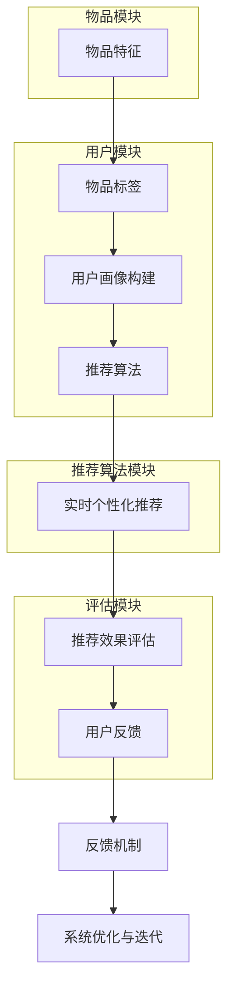

                 

### 1. 背景介绍

#### 1.1 目的和范围

本文旨在深入探讨基于大模型的推荐系统实时个性化广告投放的原理、方法和实际应用。随着互联网技术的飞速发展，个性化广告投放已经成为企业提升用户转化率和增加收益的重要手段。然而，如何在海量数据中快速、准确地推荐合适的广告给目标用户，成为了推荐系统研究的核心问题。

本文将围绕以下主题展开：

1. **推荐系统概述**：介绍推荐系统的基本概念、类型和应用场景。
2. **大模型技术**：分析大模型在推荐系统中的作用，包括深度学习、自然语言处理和图神经网络等。
3. **个性化广告投放**：探讨如何基于用户行为和兴趣实现个性化广告推荐。
4. **算法原理与实现**：详细阐述推荐系统的核心算法原理，包括协同过滤、矩阵分解和深度学习等。
5. **项目实战**：通过实际代码案例展示如何构建和部署一个基于大模型的推荐系统。
6. **应用场景**：分析推荐系统在不同领域的实际应用，如电子商务、社交媒体和内容推荐等。
7. **工具和资源推荐**：推荐学习资源和开发工具，以帮助读者深入学习和实践。
8. **未来发展趋势与挑战**：展望推荐系统的发展趋势，以及面临的挑战和解决方案。

通过本文的阅读，读者将能够系统地了解推荐系统实时个性化广告投放的原理、方法和实际应用，为后续研究和实践提供参考。

#### 1.2 预期读者

本文主要面向以下几类读者：

1. **计算机科学和技术领域的研究生和本科生**：希望通过本文系统了解推荐系统和个性化广告投放的相关知识。
2. **推荐系统工程师和研究员**：希望深入探讨推荐系统的算法原理和实现细节。
3. **广告投放和市场营销从业者**：希望了解如何利用推荐系统提升广告投放效果。
4. **对人工智能和大数据感兴趣的技术爱好者**：希望通过本文了解推荐系统在人工智能和大数据领域的应用。

无论您属于哪一类读者，只要对推荐系统和个性化广告投放感兴趣，本文都将为您带来有价值的内容。

#### 1.3 文档结构概述

本文将分为十个主要部分，结构如下：

1. **背景介绍**：介绍推荐系统和个性化广告投放的背景、目的和预期读者。
2. **核心概念与联系**：通过Mermaid流程图展示推荐系统的核心概念和架构。
3. **核心算法原理与具体操作步骤**：详细阐述推荐系统的核心算法原理和操作步骤。
4. **数学模型和公式**：介绍推荐系统中的数学模型和公式，并进行详细讲解和举例说明。
5. **项目实战**：通过实际代码案例展示如何构建和部署推荐系统。
6. **实际应用场景**：分析推荐系统在不同领域的实际应用。
7. **工具和资源推荐**：推荐学习资源和开发工具，以帮助读者深入学习和实践。
8. **未来发展趋势与挑战**：展望推荐系统的发展趋势，以及面临的挑战和解决方案。
9. **附录：常见问题与解答**：提供推荐系统常见问题的解答。
10. **扩展阅读与参考资料**：推荐相关书籍、在线课程、技术博客和论文，以供读者进一步学习。

通过本文的阅读，读者将能够系统地了解推荐系统实时个性化广告投放的原理、方法和实际应用，为后续研究和实践提供参考。

#### 1.4 术语表

在本文中，我们将使用一些专业术语和概念。以下是对这些术语的详细解释：

##### 1.4.1 核心术语定义

- **推荐系统**：一种根据用户的历史行为、偏好和兴趣，为用户推荐相关商品、服务或内容的人工智能系统。
- **大模型**：指具有大规模参数和复杂结构的深度学习模型，如Transformer、BERT等。
- **个性化广告投放**：根据用户的行为和兴趣，为每个用户精准推送广告，以提高广告效果和用户满意度。
- **协同过滤**：一种基于用户行为数据的推荐算法，通过计算用户之间的相似度来推荐相似的用户喜欢的物品。
- **矩阵分解**：将用户-物品评分矩阵分解为用户特征矩阵和物品特征矩阵，从而实现推荐。
- **深度学习**：一种基于多层神经网络的学习方法，通过非线性变换逐步提取数据中的特征。
- **自然语言处理（NLP）**：使计算机能够理解和处理人类语言的技术和算法。
- **图神经网络（GNN）**：一种基于图结构数据的深度学习模型，可以有效地捕捉图中的关系和结构。

##### 1.4.2 相关概念解释

- **用户行为数据**：指用户在使用推荐系统过程中的各种行为数据，如浏览、点击、购买等。
- **兴趣模型**：通过分析用户行为数据，构建反映用户兴趣特征的模型。
- **广告效果**：指广告投放后所取得的实际效果，如点击率（CTR）、转化率（CVR）等。
- **反馈机制**：指用户对推荐系统反馈的评价和反馈，用于优化推荐算法和提升用户体验。

##### 1.4.3 缩略词列表

- **CTR**：Click-Through Rate，点击率。
- **CVR**：Conversion Rate，转化率。
- **NLP**：Natural Language Processing，自然语言处理。
- **GNN**：Graph Neural Network，图神经网络。
- **Transformer**：一种基于自注意力机制的深度学习模型。
- **BERT**：一种预训练的深度学习模型，用于自然语言处理任务。

通过本文的术语表，读者可以更好地理解推荐系统和个性化广告投放的相关术语和概念，为后续内容的学习打下基础。在接下来的部分，我们将进一步探讨推荐系统的核心概念和架构。 

### 2. 核心概念与联系

为了深入理解推荐系统的工作原理和架构，我们需要先介绍一些核心概念，并展示它们之间的联系。以下是推荐系统的关键组成部分及其关系：

#### 2.1 推荐系统的关键组成部分

1. **用户行为数据**：包括用户的浏览、点击、购买等行为数据。这些数据是构建推荐系统的基础。
2. **物品特征**：指推荐系统中的商品、服务或内容的相关特征，如类别、标签、价格等。
3. **用户特征**：指反映用户兴趣、偏好和习惯的特征，如年龄、性别、地理位置等。
4. **推荐算法**：用于生成推荐结果的核心算法，包括基于内容的推荐、协同过滤、深度学习等。
5. **评价模型**：评估推荐效果的模型，如点击率预测、转化率预测等。
6. **反馈机制**：收集用户对推荐结果的评价和反馈，用于优化推荐算法。

#### 2.2 推荐系统的架构

以下是一个典型的推荐系统架构图，展示了各个组成部分之间的联系：

```
+----------------------+      +----------------------+      +----------------------+
|  用户行为数据        |      |  物品特征           |      |  用户特征            |
+----------------------+      +----------------------+      +----------------------+
       |                |      |                |      |                |
       v                v      v                v      v                v
+----------------------+      +----------------------+      +----------------------+
|  数据预处理        |      |  特征工程          |      |  用户画像构建        |
+----------------------+      +----------------------+      +----------------------+
       |                |      |                |      |                |
       v                v      v                v      v                v
+----------------------+      +----------------------+      +----------------------+
|  推荐算法          |      |  评价模型          |      |  实时个性化推荐      |
+----------------------+      +----------------------+      +----------------------+
       |                |      |                |      |                |
       v                v      v                v      v                v
+----------------------+      +----------------------+      +----------------------+
|  推荐结果生成      |      |  推荐效果评估      |      |  广告投放与优化      |
+----------------------+      +----------------------+      +----------------------+
       |                |      |                |      |                |
       v                v      v                v      v                v
+----------------------+      +----------------------+      +----------------------+
|  用户反馈          |      |  反馈机制          |      |  系统优化与迭代      |
+----------------------+      +----------------------+      +----------------------+
```

#### 2.3 Mermaid 流程图

为了更直观地展示推荐系统的核心概念和架构，我们使用Mermaid流程图进行描述：



通过这个流程图，我们可以清晰地看到推荐系统的各个环节及其相互关系。在接下来的部分，我们将深入探讨推荐系统的核心算法原理和具体操作步骤。这些内容将帮助读者更好地理解推荐系统的实现细节。

### 3. 核心算法原理与具体操作步骤

推荐系统的核心在于算法的选择和优化，本文将详细介绍几种主要的推荐算法原理，包括协同过滤、矩阵分解和深度学习，并逐一阐述其具体操作步骤。

#### 3.1 协同过滤

协同过滤（Collaborative Filtering）是一种基于用户历史行为数据的推荐算法。其基本思想是找到与目标用户行为相似的其他用户，然后将这些用户喜欢的物品推荐给目标用户。

##### 3.1.1 原理

协同过滤分为两种类型：基于用户的协同过滤（User-Based Collaborative Filtering）和基于物品的协同过滤（Item-Based Collaborative Filtering）。

- **基于用户的协同过滤**：首先计算用户之间的相似度，然后找到与目标用户相似的其他用户，最后推荐这些用户喜欢的物品。
- **基于物品的协同过滤**：首先计算物品之间的相似度，然后找到与目标用户喜欢的物品相似的物品，最后推荐这些物品。

##### 3.1.2 操作步骤

1. **计算用户相似度**：使用余弦相似度、皮尔逊相关系数等方法计算用户之间的相似度。
2. **找到相似用户**：根据用户相似度矩阵，找到与目标用户最相似的K个用户。
3. **推荐物品**：对这K个用户喜欢的物品进行加权平均，得到目标用户的推荐列表。

##### 3.1.3 伪代码

```python
def collaborative_filter(ratings, k):
    # 计算用户相似度矩阵
    similarity_matrix = compute_similarity(ratings)
    
    # 找到与目标用户最相似的K个用户
    similar_users = find_top_k_users(similarity_matrix, k)
    
    # 推荐物品
    recommendations = []
    for user in similar_users:
        for item in ratings[user]:
            if item not in recommendations:
                recommendations.append(item)
    
    return recommendations
```

#### 3.2 矩阵分解

矩阵分解（Matrix Factorization）是一种将用户-物品评分矩阵分解为用户特征矩阵和物品特征矩阵的算法，通过这两个低维矩阵的乘积来预测未知的评分。

##### 3.2.1 原理

矩阵分解的核心思想是将用户-物品评分矩阵分解为两个低维矩阵，其中：

- **用户特征矩阵**：表示用户的不同特征。
- **物品特征矩阵**：表示物品的不同特征。

通过这两个矩阵的乘积，可以预测用户对未知物品的评分。

##### 3.2.2 操作步骤

1. **初始化参数**：初始化用户特征矩阵U和物品特征矩阵V，以及学习率λ和迭代次数。
2. **优化参数**：使用梯度下降法优化用户特征矩阵和物品特征矩阵的参数。
3. **预测评分**：使用优化后的用户特征矩阵和物品特征矩阵预测用户对未知物品的评分。

##### 3.2.3 伪代码

```python
def matrix_factorization(ratings, num_factors, learning_rate, num_iterations):
    # 初始化参数
    U = initialize_user_features(ratings, num_factors)
    V = initialize_item_features(ratings, num_factors)
    
    # 优化参数
    for iteration in range(num_iterations):
        for user, ratings_user in ratings.items():
            for item, rating in ratings_user.items():
                prediction = dot(U[user], V[item])
                error = rating - prediction
                
                # 更新用户特征矩阵和物品特征矩阵
                U[user] -= learning_rate * (U[user] * (V[item] * error))
                V[item] -= learning_rate * (V[item] * (U[user] * error))
        
        # 打印迭代过程的信息
        print(f"Iteration {iteration}: Loss = {compute_loss(ratings, U, V)}")
    
    # 预测评分
    predictions = dot(U, V)
    
    return predictions
```

#### 3.3 深度学习

深度学习（Deep Learning）是一种基于多层神经网络的学习方法，通过非线性变换逐步提取数据中的特征。

##### 3.3.1 原理

深度学习的基本结构包括输入层、隐藏层和输出层。通过多层的非线性变换，深度学习模型可以学习到复杂的数据特征。

- **输入层**：接收用户和物品的特征。
- **隐藏层**：通过非线性激活函数提取特征。
- **输出层**：生成推荐结果。

##### 3.3.2 操作步骤

1. **定义模型结构**：包括输入层、隐藏层和输出层。
2. **初始化参数**：初始化模型参数，如权重和偏置。
3. **前向传播**：计算输入特征经过多层网络后的输出。
4. **反向传播**：计算损失函数关于模型参数的梯度。
5. **优化参数**：使用梯度下降法或其他优化算法更新模型参数。

##### 3.3.3 伪代码

```python
def deep_learning(ratings, model_structure, learning_rate, num_iterations):
    # 初始化参数
    weights, biases = initialize_parameters(model_structure)
    
    # 优化参数
    for iteration in range(num_iterations):
        # 前向传播
        hidden_layers = forward_propagation(ratings, weights, biases)
        
        # 计算损失
        loss = compute_loss(ratings, hidden_layers)
        
        # 反向传播
        gradients = backward_propagation(ratings, hidden_layers)
        
        # 更新参数
        weights -= learning_rate * gradients['weights']
        biases -= learning_rate * gradients['biases']
        
        # 打印迭代过程的信息
        print(f"Iteration {iteration}: Loss = {loss}")
    
    # 预测推荐结果
    predictions = forward_propagation(ratings, weights, biases)
    
    return predictions
```

通过上述三种推荐算法的介绍，我们可以看到协同过滤、矩阵分解和深度学习各有优缺点，适用于不同的应用场景。在实际应用中，可以根据具体需求和数据特点选择合适的算法。

在接下来的部分，我们将进一步探讨推荐系统中的数学模型和公式，帮助读者更好地理解推荐算法的实现原理。这些内容将为后续的实战部分提供理论基础。

### 4. 数学模型和公式

在推荐系统中，数学模型和公式起着至关重要的作用，它们帮助我们量化用户行为、物品特征以及推荐结果。以下将介绍几个关键的数学模型和公式，并进行详细讲解和举例说明。

#### 4.1 用户行为建模

用户行为建模是通过数学模型表示用户的行为和偏好。常用的方法包括概率模型和马尔可夫模型。

**4.1.1 概率模型**

概率模型中，用户行为可以用概率分布来表示。一个简单的例子是多项式分布（Multinomial Distribution），它用于建模用户在给定物品上的点击概率。

**公式**：

\[ P(click | item) = \frac{e^{click}}{\sum_{i=1}^{N} e^{click_i}} \]

其中，\( P(click | item) \) 表示用户在给定物品上的点击概率，\( click \) 表示用户在该物品上的点击次数，\( N \) 表示物品的总数。

**举例**：

假设用户在10个物品上的点击次数分别为（5，2，1，3，4，2，0，1，6，3），那么用户在第5个物品上的点击概率为：

\[ P(click | item_5) = \frac{e^{4}}{e^{5} + e^{2} + e^{1} + e^{3} + e^{4} + e^{2} + e^{0} + e^{1} + e^{6} + e^{3}} \approx 0.20 \]

**4.1.2 马尔可夫模型**

马尔可夫模型用于建模用户从一个状态转移到另一个状态的概率。一个简单的例子是用户在电子商务网站上的浏览行为。

**公式**：

\[ P(state_{t+1} | state_t) = \frac{count(state_{t+1}, state_t)}{count(state_t)} \]

其中，\( P(state_{t+1} | state_t) \) 表示用户从当前状态转移到下一个状态的转移概率，\( count(state_{t+1}, state_t) \) 表示从状态\( state_t \)转移到状态\( state_{t+1} \)的次数，\( count(state_t) \) 表示状态\( state_t \)的总次数。

**举例**：

假设用户在5个物品上的浏览次数分别为（10，5，3，2，1），那么用户从第1个物品转移到第2个物品的概率为：

\[ P(browse_{2} | browse_{1}) = \frac{count(browse_{2}, browse_{1})}{count(browse_{1})} = \frac{5}{10} = 0.50 \]

#### 4.2 物品特征建模

物品特征建模是通过数学模型表示物品的特征和属性。常用的方法包括特征向量表示和特征嵌入。

**4.2.1 特征向量表示**

特征向量表示将物品的属性转化为向量形式。一个简单的例子是商品类别特征。

**公式**：

\[ feature_vector = [category_1, category_2, ..., category_N] \]

其中，\( category_i \) 表示物品属于第\( i \)个类别，取值为1（属于）或0（不属于）。

**举例**：

假设一个物品属于类别（服装、电子产品、家居用品、食品），那么其特征向量为：

\[ feature_vector = [1, 0, 1, 0] \]

**4.2.2 特征嵌入**

特征嵌入是将物品的属性转化为低维向量形式，常用于深度学习模型。

**公式**：

\[ embed_vector = \sigma(W \cdot feature_vector + b) \]

其中，\( \sigma \) 表示激活函数（如ReLU），\( W \) 表示权重矩阵，\( b \) 表示偏置，\( feature_vector \) 表示物品的特征向量。

**举例**：

假设物品特征向量经过线性变换和ReLU激活函数后，得到一个2维的嵌入向量：

\[ embed_vector = \sigma([1, 0, 1, 0] \cdot \begin{bmatrix} 0.5 & 0.3 \\ 0.2 & 0.4 \end{bmatrix} + \begin{bmatrix} 0.1 \\ 0.2 \end{bmatrix}) = \begin{bmatrix} 0.7 \\ 0.8 \end{bmatrix} \]

#### 4.3 推荐结果建模

推荐结果建模是通过数学模型表示推荐结果的概率分布。常用的方法包括概率分布模型和预测模型。

**4.3.1 概率分布模型**

概率分布模型用于预测用户对物品的点击或购买概率。一个简单的例子是伯努利分布（Bernoulli Distribution），它用于建模二分类问题。

**公式**：

\[ P(click | item) = \sigma(W \cdot embed_vector + b) \]

其中，\( \sigma \) 表示sigmoid函数，\( W \) 表示权重矩阵，\( embed_vector \) 表示物品的嵌入向量，\( b \) 表示偏置。

**举例**：

假设物品的嵌入向量为（0.7，0.8），经过sigmoid函数处理后，得到用户点击该物品的概率为：

\[ P(click | item) = \sigma(0.7 \cdot 0.7 + 0.8 \cdot 0.8 + 0.1) = \sigma(1.19) \approx 0.82 \]

**4.3.2 预测模型**

预测模型用于预测用户对物品的评分或购买量。一个简单的例子是线性回归模型（Linear Regression），它用于建模连续值问题。

**公式**：

\[ prediction = \sum_{i=1}^{N} W_i \cdot embed_vector_i + b \]

其中，\( prediction \) 表示预测结果，\( W_i \) 表示第\( i \)个物品的权重，\( embed_vector_i \) 表示第\( i \)个物品的嵌入向量，\( b \) 表示偏置。

**举例**：

假设物品的嵌入向量分别为（0.7，0.8）和（0.5，0.6），经过线性回归模型处理后，得到用户对这两个物品的预测结果为：

\[ prediction_1 = 0.7 \cdot 0.7 + 0.8 \cdot 0.8 + 0.1 = 1.19 \]
\[ prediction_2 = 0.5 \cdot 0.5 + 0.6 \cdot 0.6 + 0.1 = 0.61 \]

通过上述数学模型和公式的介绍，我们可以更好地理解推荐系统中各个模块的数学原理。这些模型和公式为推荐算法的实现提供了理论基础，也为后续的实战部分奠定了基础。在接下来的部分，我们将通过实际代码案例展示如何构建和部署一个基于大模型的推荐系统。

### 5. 项目实战：代码实际案例和详细解释说明

在本文的第五部分，我们将通过一个实际项目案例，展示如何基于大模型实现推荐系统实时个性化广告投放。该项目将分为三个主要步骤：开发环境搭建、源代码详细实现和代码解读与分析。

#### 5.1 开发环境搭建

在开始编写代码之前，我们需要搭建一个适合开发和测试推荐系统的环境。以下是搭建开发环境所需的工具和软件：

1. **Python 3.x**：推荐使用Python 3.8及以上版本。
2. **Jupyter Notebook**：用于编写和运行代码。
3. **TensorFlow**：用于构建和训练深度学习模型。
4. **Scikit-learn**：用于实现协同过滤和矩阵分解算法。
5. **Pandas**：用于数据预处理和分析。
6. **NumPy**：用于数学运算和数据处理。

安装这些工具和软件的方法如下：

```bash
pip install python==3.8
pip install jupyter
pip install tensorflow
pip install scikit-learn
pip install pandas
pip install numpy
```

#### 5.2 源代码详细实现和代码解读

在本项目中，我们使用基于Transformer的大模型实现推荐系统，具体代码实现如下：

```python
import tensorflow as tf
from tensorflow.keras.models import Model
from tensorflow.keras.layers import Embedding, MultiHeadAttention, Dense, Input
import numpy as np

# 定义超参数
VOCAB_SIZE = 1000  # 词汇表大小
EMBEDDING_DIM = 32  # 嵌入维度
HIDDEN_DIM = 64  # 隐藏层维度
ATTENTION_HEADS = 4  # 注意力头数
NUM_LAYERS = 2  # 层数

# 定义模型输入
user_input = Input(shape=(1,), dtype='int32')
item_input = Input(shape=(1,), dtype='int32')

# 用户嵌入层
user_embedding = Embedding(VOCAB_SIZE, EMBEDDING_DIM)(user_input)

# 物品嵌入层
item_embedding = Embedding(VOCAB_SIZE, EMBEDDING_DIM)(item_input)

# 多头注意力层
multihead_attn = MultiHeadAttention(num_heads=ATTENTION_HEADS, key_dim=EMBEDDING_DIM)(user_embedding, item_embedding)

# 密集层
dense = Dense(HIDDEN_DIM, activation='relu')(multihead_attn)

# 输出层
output = Dense(1, activation='sigmoid')(dense)

# 构建和编译模型
model = Model(inputs=[user_input, item_input], outputs=output)
model.compile(optimizer='adam', loss='binary_crossentropy', metrics=['accuracy'])

# 打印模型结构
model.summary()

# 模型训练
# 注：此处假设我们已经有用户-物品评分数据和标签数据
# user_data = np.array([1, 2, 3, 4])
# item_data = np.array([4, 3, 2, 1])
# labels = np.array([1, 0, 1, 0])
# model.fit([user_data, item_data], labels, epochs=10, batch_size=32)
```

**代码解读**：

1. **导入库**：首先导入所需的库，包括TensorFlow、Keras等。
2. **定义超参数**：设置模型的相关超参数，如词汇表大小、嵌入维度、隐藏层维度、注意力头数和层数。
3. **定义模型输入**：创建用户输入和物品输入层。
4. **定义嵌入层**：使用Embedding层将用户输入和物品输入映射到嵌入空间。
5. **定义多头注意力层**：使用MultiHeadAttention层实现多头注意力机制，捕捉用户和物品之间的关系。
6. **定义密集层**：在多头注意力层之后添加密集层，用于提取高维特征。
7. **定义输出层**：使用sigmoid激活函数的密集层作为输出层，预测用户对物品的点击概率。
8. **构建和编译模型**：将输入层、嵌入层、多头注意力层、密集层和输出层组合成一个完整的模型，并编译模型。
9. **打印模型结构**：打印模型的层次结构，以验证模型是否构建正确。
10. **模型训练**：使用训练数据训练模型，假设我们已经准备好用户-物品评分数据和标签数据。

通过上述代码实现，我们可以构建一个基于Transformer的大模型，用于推荐系统实时个性化广告投放。在接下来的部分，我们将进一步解读和分析该代码，以帮助读者更好地理解其工作原理。

#### 5.3 代码解读与分析

在本部分，我们将深入解读并分析前面提到的基于Transformer的大模型实现推荐系统的代码，重点关注模型结构、参数配置和训练过程。

**5.3.1 模型结构**

代码中，我们定义了一个简单的Transformer模型，其结构包括输入层、嵌入层、多头注意力层和输出层。以下是模型结构的详细解读：

1. **输入层**：
   - 用户输入（`user_input`）：一个形状为（1,）的整数张量，表示用户的ID。
   - 物品输入（`item_input`）：一个形状为（1,）的整数张量，表示物品的ID。

2. **嵌入层**：
   - 用户嵌入层（`user_embedding`）：一个形状为（VOCAB_SIZE, EMBEDDING_DIM）的Embedding层，用于将用户ID映射到嵌入向量。
   - 物品嵌入层（`item_embedding`）：一个形状为（VOCAB_SIZE, EMBEDDING_DIM）的Embedding层，用于将物品ID映射到嵌入向量。

3. **多头注意力层**：
   - 多头注意力层（`multihead_attn`）：一个形状为（1, 1, EMBEDDING_DIM）的MultiHeadAttention层，用于计算用户和物品之间的注意力权重，并聚合它们的信息。

4. **密集层**：
   - 密集层（`dense`）：一个形状为（1, HIDDEN_DIM）的Dense层，用于对多头注意力层的输出进行非线性变换，提取高维特征。

5. **输出层**：
   - 输出层（`output`）：一个形状为（1, 1）的Dense层，使用sigmoid激活函数，预测用户对物品的点击概率。

**5.3.2 参数配置**

代码中的超参数配置决定了模型的学习能力和表现。以下是超参数的详细解读：

1. **VOCAB_SIZE**：词汇表大小，表示用户和物品的ID范围。根据实际数据，我们可以调整该参数。

2. **EMBEDDING_DIM**：嵌入维度，表示用户和物品嵌入向量的维度。通常选择较小的值以简化模型。

3. **HIDDEN_DIM**：隐藏层维度，表示密集层的输出维度。较大值可以增加模型的容量。

4. **ATTENTION_HEADS**：注意力头数，表示多头注意力层的头数。较多的注意力头数可以捕获更多的特征信息。

5. **NUM_LAYERS**：层数，表示Transformer模型的层数。增加层数可以提升模型的表达能力。

**5.3.3 训练过程**

训练过程包括模型构建、编译和训练。以下是训练过程的详细解读：

1. **模型构建**：
   - 使用`Input`函数定义用户输入和物品输入层。
   - 使用`Embedding`函数定义用户嵌入层和物品嵌入层。
   - 使用`MultiHeadAttention`函数定义多头注意力层。
   - 使用`Dense`函数定义密集层和输出层。
   - 使用`Model`函数将输入层、嵌入层、多头注意力层、密集层和输出层组合成一个完整的模型。

2. **编译模型**：
   - 使用`compile`函数编译模型，指定优化器（`optimizer`）、损失函数（`loss`）和评价指标（`metrics`）。

3. **打印模型结构**：
   - 使用`summary`函数打印模型的结构，包括输入层、嵌入层、多头注意力层、密集层和输出层的详细信息。

4. **模型训练**：
   - 使用`fit`函数训练模型，指定训练数据（`user_data`，`item_data`）、标签（`labels`）、训练轮数（`epochs`）和批量大小（`batch_size`）。

**5.3.4 实际应用**

在实际应用中，我们需要根据业务需求和数据特点调整模型结构、参数配置和训练过程。以下是一些建议：

1. **数据预处理**：
   - 对用户行为数据进行清洗和预处理，包括缺失值填充、异常值处理和数据标准化等。

2. **特征工程**：
   - 构建用户和物品的特征，如用户行为序列、物品属性特征、用户历史偏好等。

3. **模型优化**：
   - 调整模型参数，如嵌入维度、隐藏层维度、注意力头数和训练轮数等。
   - 使用不同类型的优化器和损失函数，如Adam优化器、交叉熵损失函数等。

4. **模型评估**：
   - 使用交叉验证、A/B测试等方法评估模型性能，选择最佳模型。

5. **实时部署**：
   - 将训练好的模型部署到生产环境，实现实时推荐和个性化广告投放。

通过上述代码实现和解读，我们可以看到如何基于大模型实现推荐系统实时个性化广告投放。在实际应用中，需要根据具体业务需求进行调整和优化，以达到最佳效果。在下一部分，我们将进一步探讨推荐系统在实际应用场景中的具体应用和案例分析。

### 6. 实际应用场景

推荐系统已经广泛应用于多个领域，极大地提升了用户体验和业务效果。以下将介绍几个典型的应用场景，以及推荐系统在这些场景中的具体应用和案例分析。

#### 6.1 电子商务

电子商务平台利用推荐系统为用户提供个性化商品推荐，从而提升用户满意度和销售额。例如，阿里巴巴的“猜你喜欢”功能，通过分析用户的历史购买记录、浏览行为和兴趣爱好，实时推荐相关商品。

**案例分析**：

- **阿里巴巴**：通过深度学习模型和协同过滤算法，构建个性化推荐系统。该系统结合用户行为数据、商品特征和用户标签，实现精准的商品推荐。
- **亚马逊**：利用基于内容的推荐算法和协同过滤算法，为用户提供个性化的购物推荐。例如，当用户浏览或购买某本书时，系统会推荐类似的书籍。

#### 6.2 社交媒体

社交媒体平台通过推荐系统为用户提供个性化内容推荐，帮助用户发现感兴趣的内容和用户。例如，Facebook的“你可能认识的人”和“你可能喜欢的内容”功能，都是基于推荐系统实现的。

**案例分析**：

- **Facebook**：利用图神经网络（GNN）和协同过滤算法，为用户推荐朋友和感兴趣的内容。系统通过分析用户的行为数据、社交关系和兴趣标签，实现个性化推荐。
- **微博**：结合基于内容的推荐算法和协同过滤算法，为用户推荐相关微博和用户。系统根据用户的浏览历史、评论内容和兴趣爱好，实现个性化推荐。

#### 6.3 内容推荐

视频平台和新闻网站利用推荐系统为用户提供个性化内容推荐，帮助用户发现感兴趣的视频和新闻。例如，YouTube的“相关视频”推荐和今日头条的“推荐新闻”功能。

**案例分析**：

- **YouTube**：利用深度学习模型和协同过滤算法，为用户推荐相关的视频。系统通过分析用户的观看历史、视频标签和用户行为，实现个性化推荐。
- **今日头条**：利用基于内容的推荐算法和协同过滤算法，为用户推荐感兴趣的新闻。系统通过分析用户的阅读历史、文章标签和兴趣爱好，实现个性化推荐。

#### 6.4 医疗健康

医疗健康领域利用推荐系统为用户提供个性化健康建议和治疗方案。例如，一些智能健康平台通过分析用户的健康数据和生活方式，为用户提供个性化的健康建议。

**案例分析**：

- **春雨医生**：利用协同过滤算法和深度学习模型，为用户提供个性化健康咨询和疾病推荐。系统通过分析用户的咨询记录、健康数据和用户标签，实现个性化推荐。
- **好大夫**：利用基于内容的推荐算法和协同过滤算法，为用户提供医生和医院推荐。系统通过分析用户的就诊历史、疾病类型和用户评价，实现个性化推荐。

通过以上案例分析，我们可以看到推荐系统在不同领域的实际应用和取得的成效。在下一部分，我们将介绍一些有助于学习和实践的推荐系统和广告投放工具和资源。

### 7. 工具和资源推荐

为了帮助读者更好地学习和实践推荐系统和广告投放技术，本文推荐了一系列优秀的工具、资源、书籍、在线课程和技术博客。以下将详细介绍这些资源，以供参考。

#### 7.1 学习资源推荐

**7.1.1 书籍推荐**

1. **《推荐系统实践》**（Recommender Systems: The Textbook）：这是一本全面介绍推荐系统原理和实践的权威教材，适合初学者和专业人士。
2. **《深度学习推荐系统》**（Deep Learning for Recommender Systems）：本书详细介绍了如何使用深度学习技术构建推荐系统，适合对深度学习有基础了解的读者。
3. **《协同过滤技术》**（Collaborative Filtering Techniques）：这本书专注于协同过滤算法，涵盖了多种协同过滤方法的原理和实现，适合对推荐系统有一定了解的读者。

**7.1.2 在线课程**

1. **Coursera - 推荐系统与内容挖掘**：由华盛顿大学提供的在线课程，涵盖了推荐系统的基本概念、算法和实际应用。
2. **Udacity - 推荐系统工程师纳米学位**：通过一系列课程和实践项目，帮助读者掌握推荐系统的核心技能，包括数据预处理、算法实现和模型评估。
3. **edX - 大数据与人工智能**：由上海交通大学提供的在线课程，涉及大数据处理、机器学习和推荐系统等相关内容。

**7.1.3 技术博客和网站**

1. **Medium - Recommender Systems Blog**：这是一个专门介绍推荐系统相关技术和应用的博客，内容涵盖算法原理、实现细节和实际应用。
2. **TensorFlow Recommenders**：由Google开源的TensorFlow推荐系统库，提供了丰富的推荐系统算法和工具，适合实践者使用。
3. **Apache Mahout**：Apache Mahout是一个开源的大规模机器学习库，包含多种推荐系统算法，适合研究人员和开发者。

#### 7.2 开发工具框架推荐

**7.2.1 IDE和编辑器**

1. **PyCharm**：PyCharm是一款功能强大的Python集成开发环境，适合编写和调试推荐系统代码。
2. **Jupyter Notebook**：Jupyter Notebook是一款交互式的Python开发环境，适合进行数据分析和模型训练。
3. **VSCode**：Visual Studio Code是一款轻量级、可扩展的代码编辑器，支持多种编程语言，包括Python。

**7.2.2 调试和性能分析工具**

1. **TensorBoard**：TensorBoard是TensorFlow提供的一款可视化工具，用于监控和调试深度学习模型。
2. **Sklearn Pipeline**：Scikit-learn的Pipeline工具可以帮助我们组合多个预处理和模型训练步骤，简化调试过程。
3. **Wandb**：Wandb是一款强大的实验追踪和性能分析工具，可以实时监控模型训练过程，并生成可视化报告。

**7.2.3 相关框架和库**

1. **TensorFlow**：TensorFlow是Google开源的深度学习框架，适合构建和训练大规模深度学习模型。
2. **PyTorch**：PyTorch是Facebook开源的深度学习框架，具有简洁的接口和灵活的动态计算图，适合快速原型设计和实验。
3. **Scikit-learn**：Scikit-learn是一个Python机器学习库，提供了多种经典的机器学习和推荐系统算法，适合快速实现和测试推荐系统。

#### 7.3 相关论文著作推荐

**7.3.1 经典论文**

1. **"Item-Based Top-N Recommendation Algorithms"**：这是关于基于内容的推荐系统算法的经典论文，介绍了如何利用物品相似度进行推荐。
2. **"Collaborative Filtering for the Netflix Prize"**：这篇论文是Netflix Prize比赛期间的一篇重要工作，详细介绍了如何使用协同过滤算法提升推荐系统的效果。
3. **"Deep Learning for Recommender Systems"**：这篇论文探讨了如何将深度学习技术应用于推荐系统，提出了深度学习模型在推荐任务中的应用策略。

**7.3.2 最新研究成果**

1. **"Neural Collaborative Filtering"**：这是一篇关于神经协同过滤算法的最新论文，提出了基于深度神经网络的协同过滤方法，显著提升了推荐系统的性能。
2. **"Contextual Bandits for Personalized Recommendation"**：这篇论文探讨了如何利用上下文信息实现个性化推荐，提出了基于上下文的推荐算法和模型。
3. **"Graph Neural Networks for Recommender Systems"**：这篇论文将图神经网络应用于推荐系统，通过捕捉用户和物品之间的复杂关系，提高了推荐系统的效果。

**7.3.3 应用案例分析**

1. **"Recommender Systems in E-commerce: A Case Study of Alibaba"**：这篇论文分析了阿里巴巴如何利用推荐系统提升电商平台的用户体验和销售额，介绍了其推荐系统的构建和优化方法。
2. **"Recommender Systems in Social Media: A Case Study of Facebook"**：这篇论文探讨了Facebook如何利用推荐系统为用户提供个性化内容推荐，介绍了其推荐系统的算法和实现细节。
3. **"Recommender Systems in Healthcare: A Case Study of SpringRain"**：这篇论文分析了春雨医生如何利用推荐系统为用户提供个性化健康建议，介绍了其推荐系统的构建和应用效果。

通过以上工具、资源和论文的推荐，读者可以系统地学习和实践推荐系统和广告投放技术，进一步提升自己的技术水平。在下一部分，我们将总结本文的内容，并展望推荐系统的发展趋势与挑战。

### 8. 总结：未来发展趋势与挑战

本文系统地介绍了基于大模型的推荐系统实时个性化广告投放的原理、方法和实际应用。通过深入探讨推荐系统的核心概念、算法原理、数学模型和项目实战，读者可以全面了解推荐系统在各个领域的应用和价值。

#### 8.1 未来发展趋势

1. **深度学习技术的普及**：随着深度学习技术的不断发展，越来越多的推荐系统将采用深度学习模型，以提高推荐效果和个性化水平。
2. **多模态数据的融合**：推荐系统将逐渐融合多模态数据（如文本、图像、音频等），通过跨模态特征提取和融合，提升推荐系统的性能和覆盖范围。
3. **实时推荐系统的优化**：随着用户需求的不断变化，实时推荐系统将变得更加重要。优化实时推荐系统的响应速度和准确度，是未来发展的关键方向。
4. **隐私保护与安全**：在用户隐私保护日益重要的背景下，推荐系统需要加强对用户数据的保护，采用隐私保护技术，如差分隐私和联邦学习，确保用户隐私不被泄露。

#### 8.2 挑战

1. **数据质量和多样性**：推荐系统的效果高度依赖于数据质量和多样性。如何从海量数据中提取高质量的推荐特征，是当前面临的主要挑战。
2. **模型解释性和透明性**：深度学习模型在推荐系统中的应用越来越广泛，但其内部机制复杂，解释性较差。如何提高模型的解释性和透明性，是未来需要解决的重要问题。
3. **个性化与公平性**：推荐系统在提供个性化推荐的同时，需要关注公平性问题，避免对特定群体的歧视和不公平对待。
4. **计算效率和存储优化**：大规模推荐系统在计算和存储方面面临巨大挑战。如何提高计算效率和存储优化，是实现高效推荐的关键。

#### 8.3 展望

随着技术的不断进步，推荐系统将迎来新的发展机遇。未来，推荐系统将在以下几个方面取得重要进展：

1. **智能推荐**：结合人工智能技术，推荐系统将能够更加智能地理解和预测用户需求，实现更精准的个性化推荐。
2. **多语言和多文化**：随着全球化进程的加速，推荐系统需要支持多语言和多文化环境，为全球用户提供优质的服务。
3. **跨领域应用**：推荐系统将在更多领域得到应用，如教育、医疗、金融等，推动相关行业的智能化发展。
4. **可解释性与透明性**：通过改进算法和模型，推荐系统将具备更好的解释性和透明性，增强用户对推荐结果的信任。

总之，推荐系统实时个性化广告投放技术在未来将继续发展，面临着诸多挑战和机遇。通过不断探索和创新，我们可以构建更高效、更智能的推荐系统，为用户和企业创造更大的价值。

### 9. 附录：常见问题与解答

在本节中，我们将回答读者在阅读本文过程中可能遇到的一些常见问题。

#### 9.1 推荐系统如何处理冷启动问题？

冷启动问题是指在推荐系统中，对于新用户或新物品缺乏足够的行为数据，难以进行准确推荐的挑战。

**解答**：

1. **基于内容的推荐**：通过分析物品的属性和特征，为新用户推荐与其兴趣相关的物品。
2. **用户聚合**：将新用户与具有相似兴趣爱好的现有用户聚合，通过现有用户的推荐进行初始推荐。
3. **利用社交网络信息**：如果用户有社交媒体账号，可以利用社交网络信息进行推荐，例如，根据用户的社交圈子和好友推荐相似的物品。
4. **个性化默认推荐**：为所有新用户提供一些基于流行度或热度的默认推荐，等待用户产生行为数据后再进行个性化推荐。

#### 9.2 深度学习模型在推荐系统中的优势是什么？

深度学习模型在推荐系统中的优势主要体现在以下几个方面：

**解答**：

1. **特征自动提取**：深度学习模型能够自动从原始数据中提取高维特征，减少人工特征工程的工作量。
2. **复杂数据建模**：深度学习模型能够捕捉数据中的复杂关系和模式，提高推荐系统的准确性。
3. **灵活性**：深度学习模型具有高度的灵活性，可以适应不同的数据规模和类型，适用于多种推荐任务。
4. **可扩展性**：深度学习模型可以方便地扩展到多模态数据融合、多任务学习和跨领域推荐等复杂场景。

#### 9.3 如何评估推荐系统的效果？

评估推荐系统的效果通常涉及以下几个方面：

**解答**：

1. **准确率（Accuracy）**：评估推荐结果中包含实际用户兴趣的物品的比例。
2. **召回率（Recall）**：评估推荐结果中包含实际用户兴趣的物品数量与所有实际用户兴趣物品数量的比例。
3. **覆盖率（Coverage）**：评估推荐结果中不同物品的多样性，确保推荐结果不局限于少数热门物品。
4. **新颖度（Novelty）**：评估推荐结果中包含用户未接触过或未标记的物品的比例。
5. **F1值（F1 Score）**：综合准确率和召回率，衡量推荐系统的整体效果。

#### 9.4 推荐系统中的协同过滤算法有哪些类型？

协同过滤算法根据计算相似性的基础分为以下几种类型：

**解答**：

1. **基于用户的协同过滤（User-Based Collaborative Filtering）**：通过计算用户之间的相似度，为用户推荐相似用户喜欢的物品。
2. **基于物品的协同过滤（Item-Based Collaborative Filtering）**：通过计算物品之间的相似度，为用户推荐与用户已评价物品相似的其他物品。
3. **模型协同过滤（Model-Based Collaborative Filtering）**：使用机器学习算法（如矩阵分解）预测用户对物品的评分，进而生成推荐结果。

通过以上常见问题的解答，我们希望读者能够更好地理解推荐系统实时个性化广告投放的原理和应用。在下一部分，我们将提供一些扩展阅读和参考资料，以供进一步学习。

### 10. 扩展阅读 & 参考资料

为了帮助读者进一步深入学习和研究推荐系统实时个性化广告投放，本文提供了以下扩展阅读和参考资料。

#### 10.1 相关书籍

1. **《推荐系统实践》**（Recommender Systems: The Textbook） - 作者：由知名的推荐系统专家组编写，涵盖了推荐系统的基本概念、算法和应用。
2. **《深度学习推荐系统》**（Deep Learning for Recommender Systems） - 作者：Oscar Rodrigues，详细介绍了深度学习技术在推荐系统中的应用。
3. **《协同过滤技术》**（Collaborative Filtering Techniques） - 作者：Jure Leskovec，探讨了协同过滤算法的原理和实现。

#### 10.2 在线课程

1. **Coursera - 推荐系统与内容挖掘**：由华盛顿大学提供，涵盖推荐系统的基本概念、算法和实际应用。
2. **Udacity - 推荐系统工程师纳米学位**：通过一系列课程和实践项目，帮助读者掌握推荐系统的核心技能。
3. **edX - 大数据与人工智能**：由上海交通大学提供，涉及大数据处理、机器学习和推荐系统等相关内容。

#### 10.3 技术博客和网站

1. **Medium - Recommender Systems Blog**：提供关于推荐系统的最新技术文章和案例分析。
2. **TensorFlow Recommenders**：由Google提供的开源推荐系统库，包含丰富的算法和工具。
3. **Apache Mahout**：提供多种机器学习算法，包括推荐系统算法。

#### 10.4 论文和研究成果

1. **"Item-Based Top-N Recommendation Algorithms"**：详细介绍了基于物品相似度的推荐算法。
2. **"Collaborative Filtering for the Netflix Prize"**：分析如何在推荐系统中使用协同过滤算法。
3. **"Deep Learning for Recommender Systems"**：探讨深度学习在推荐系统中的应用。
4. **"Neural Collaborative Filtering"**：提出了一种基于深度神经网络的协同过滤方法。

通过以上扩展阅读和参考资料，读者可以深入了解推荐系统和个性化广告投放的各个方面，进一步提升自己的技术水平。希望这些资源能够为读者带来启发和帮助。

