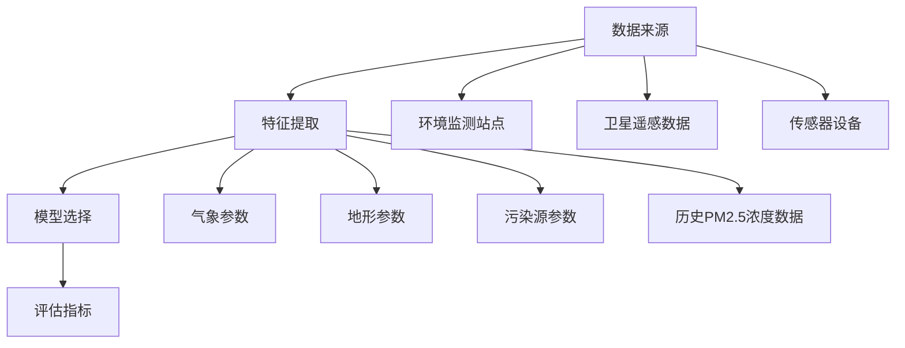

                 

# 基于机器学习的PM2.5浓度预测模型

> **关键词：** PM2.5、机器学习、浓度预测、环境监测、深度学习
> 
> **摘要：** 本文章深入探讨了基于机器学习的PM2.5浓度预测模型的构建过程。通过对PM2.5浓度预测的重要性、核心概念与联系、核心算法原理、数学模型与公式、项目实战、实际应用场景、工具和资源推荐等方面的详细分析，为读者呈现了一个全面而深入的PM2.5浓度预测解决方案。

## 1. 背景介绍

### 1.1 目的和范围

本文旨在介绍一种基于机器学习的PM2.5浓度预测模型，旨在提高环境监测的准确性和效率。随着工业化和城市化进程的加快，空气污染问题日益严重，PM2.5（直径小于或等于2.5微米的颗粒物）成为了影响人类健康的主要污染物之一。因此，准确预测PM2.5的浓度对于环境保护和公共健康具有重要的意义。

本文将详细介绍PM2.5浓度预测模型的构建过程，包括核心概念与联系、核心算法原理、数学模型与公式、项目实战以及实际应用场景等。通过这些内容的深入分析，读者可以了解到如何运用机器学习技术解决PM2.5浓度预测问题，并掌握相关技术原理和实际应用方法。

### 1.2 预期读者

本文主要面向对机器学习和环境监测感兴趣的读者，包括研究人员、工程师、学生以及对PM2.5浓度预测有实际需求的个人或机构。本文假设读者具备一定的机器学习和编程基础，以便更好地理解文章中的技术概念和实际案例。

### 1.3 文档结构概述

本文分为十个主要部分，结构如下：

1. 背景介绍
   - 目的和范围
   - 预期读者
   - 文档结构概述
   - 术语表
2. 核心概念与联系
   - 核心概念与联系
   - Mermaid流程图
3. 核心算法原理 & 具体操作步骤
   - 算法原理
   - 具体操作步骤
4. 数学模型和公式 & 详细讲解 & 举例说明
   - 数学模型
   - 公式详细讲解
   - 举例说明
5. 项目实战：代码实际案例和详细解释说明
   - 开发环境搭建
   - 源代码详细实现
   - 代码解读与分析
6. 实际应用场景
7. 工具和资源推荐
   - 学习资源推荐
   - 开发工具框架推荐
   - 相关论文著作推荐
8. 总结：未来发展趋势与挑战
9. 附录：常见问题与解答
10. 扩展阅读 & 参考资料

### 1.4 术语表

#### 1.4.1 核心术语定义

- **PM2.5**：指大气中直径小于或等于2.5微米的颗粒物，属于大气细颗粒物，具有较高的危害性。
- **机器学习**：指利用计算机模拟人类学习过程，通过数据训练模型，使其具备自主学习和预测能力。
- **环境监测**：指对环境质量进行监测和评估，包括大气、水质、土壤等多个方面。
- **深度学习**：指一种机器学习技术，通过多层神经网络对数据进行特征提取和预测。

#### 1.4.2 相关概念解释

- **监督学习**：一种机器学习方法，通过已知的输入和输出数据训练模型，使其能够预测未知数据。
- **无监督学习**：一种机器学习方法，仅使用输入数据，不提供输出数据，通过模型自动发现数据中的规律和结构。
- **特征工程**：指从原始数据中提取有用特征，以提高模型性能和预测准确性。
- **交叉验证**：一种评估模型性能的方法，通过将数据集划分为多个子集，循环训练和验证，以获得更可靠的性能评估结果。

#### 1.4.3 缩略词列表

- **PM2.5**：颗粒物直径小于或等于2.5微米
- **ML**：机器学习
- **DL**：深度学习
- **EPA**：美国环境保护局
- **CNN**：卷积神经网络
- **RNN**：循环神经网络

## 2. 核心概念与联系

在深入探讨PM2.5浓度预测模型之前，我们首先需要了解一些核心概念和联系。这些概念包括数据来源、特征提取、模型选择以及评估指标等。

### 2.1 数据来源

PM2.5浓度数据可以从多个来源获取，包括环境监测站点、卫星遥感数据和传感器设备等。其中，环境监测站点是最常用的数据来源之一，它们能够提供高时间分辨率和空间分辨率的数据。卫星遥感数据则可以提供大范围区域的PM2.5浓度分布情况，有助于了解区域污染特征。传感器设备可以实时监测PM2.5浓度，为短期预测提供数据支持。

### 2.2 特征提取

特征提取是PM2.5浓度预测模型构建的关键环节。特征的质量和数量直接影响模型的性能。常用的特征包括气象参数（如温度、湿度、风速、气压等）、地形参数（如海拔、地形坡度等）、污染源参数（如交通流量、工业排放等）以及历史PM2.5浓度数据。通过综合分析这些特征，可以构建出一个有效的预测模型。

### 2.3 模型选择

在选择预测模型时，我们需要考虑多个因素，如模型复杂度、训练时间、预测准确性等。常用的模型包括线性回归、支持向量机（SVM）、决策树、随机森林、神经网络等。其中，线性回归和SVM模型较为简单，易于理解和实现；决策树和随机森林模型具有较高的预测准确性；神经网络（特别是深度学习模型）则能够处理复杂的数据特征，但训练时间较长。

### 2.4 评估指标

在评估模型性能时，常用的评估指标包括均方误差（MSE）、均方根误差（RMSE）、决定系数（R²）等。MSE和RMSE衡量模型预测值与真实值之间的差异，R²衡量模型对数据的拟合程度。通常情况下，评估指标越高，模型性能越好。

### 2.5 Mermaid流程图

为了更好地理解PM2.5浓度预测模型的核心概念与联系，我们使用Mermaid流程图来展示数据来源、特征提取、模型选择和评估指标之间的关联。



## 3. 核心算法原理 & 具体操作步骤

### 3.1 算法原理

PM2.5浓度预测模型的核心算法是机器学习模型，其中最常用的算法包括线性回归、支持向量机（SVM）、决策树、随机森林、神经网络等。这些算法通过学习输入特征和输出浓度之间的关联，构建出一个能够预测PM2.5浓度的模型。

在算法选择时，我们需要考虑模型的复杂度、训练时间、预测准确性以及可解释性等因素。线性回归和SVM模型较为简单，易于实现和理解；决策树和随机森林模型具有较高的预测准确性，但可能存在过拟合问题；神经网络（特别是深度学习模型）能够处理复杂的数据特征，但训练时间较长。

在本篇文章中，我们将以线性回归和神经网络为例，分别介绍它们的原理和具体操作步骤。

### 3.2 线性回归

线性回归是一种简单的监督学习算法，用于建立输入特征和输出浓度之间的线性关系。其基本原理如下：

假设我们有n个训练样本，每个样本包含m个输入特征和一个输出浓度。这些样本可以表示为：

$$
X = \begin{bmatrix}
x_{11} & x_{12} & \cdots & x_{1m} \\
x_{21} & x_{22} & \cdots & x_{2m} \\
\vdots & \vdots & \ddots & \vdots \\
x_{n1} & x_{n2} & \cdots & x_{nm}
\end{bmatrix}, \quad Y = \begin{bmatrix}
y_1 \\
y_2 \\
\vdots \\
y_n
\end{bmatrix}
$$

线性回归模型的目的是找到一组参数$\theta = [\theta_0, \theta_1, \theta_2, \cdots, \theta_m]$，使得输出浓度$y$与输入特征$X$之间的误差最小。具体来说，线性回归模型可以表示为：

$$
y = \theta_0 + \theta_1 x_1 + \theta_2 x_2 + \cdots + \theta_m x_m
$$

为了求解参数$\theta$，我们可以使用最小二乘法。最小二乘法的核心思想是找到一组参数，使得输出浓度$y$与预测浓度$\hat{y}$之间的误差平方和最小。具体步骤如下：

1. 计算输出浓度的预测值$\hat{y}$：
$$
\hat{y} = \theta_0 + \theta_1 x_1 + \theta_2 x_2 + \cdots + \theta_m x_m
$$

2. 计算误差平方和$J(\theta)$：
$$
J(\theta) = \sum_{i=1}^{n} (y_i - \hat{y}_i)^2
$$

3. 求解参数$\theta$，使得误差平方和$J(\theta)$最小。具体来说，我们可以使用梯度下降法来求解：
$$
\theta_j := \theta_j - \alpha \frac{\partial J(\theta)}{\partial \theta_j}
$$
其中，$\alpha$是学习率，用于调节参数更新的步长。

### 3.3 神经网络

神经网络是一种模拟生物神经元的计算模型，具有强大的学习和预测能力。在本节中，我们将介绍一种简单的神经网络模型——多层感知机（MLP）。

多层感知机（MLP）由输入层、隐藏层和输出层组成。每个层包含多个神经元，神经元之间通过加权连接。神经元的激活函数通常为非线性函数，如Sigmoid函数或ReLU函数。以下是多层感知机的数学表示：

1. 输入层：
$$
x_i^{(l)} = x_i \quad (i=1,2,\cdots,m)
$$

2. 隐藏层：
$$
z_j^{(l)} = \sum_{i=1}^{m} w_{ij}^{(l)} x_i^{(l-1)} + b_j^{(l)} \quad (j=1,2,\cdots,n_l)
$$
$$
a_j^{(l)} = \sigma(z_j^{(l)}) \quad (j=1,2,\cdots,n_l)
$$

3. 输出层：
$$
z_k^{(L)} = \sum_{j=1}^{n_L} w_{jk}^{(L)} a_j^{(L-1)} + b_k^{(L)} \quad (k=1,2,\cdots,K)
$$
$$
\hat{y}_k = \sigma(z_k^{(L)}) \quad (k=1,2,\cdots,K)
$$

其中，$x_i^{(l)}$是第$l$层的第$i$个神经元输入，$z_j^{(l)}$是第$l$层的第$j$个神经元输出，$a_j^{(l)}$是第$l$层的第$j$个神经元激活值，$w_{ij}^{(l)}$和$b_j^{(l)}$分别是第$l$层的第$i$个神经元与第$l-1$层的第$j$个神经元之间的权重和偏置，$\sigma$是激活函数，$\hat{y}_k$是第$k$个输出神经元预测值。

为了训练多层感知机模型，我们需要最小化输出浓度$y$与预测浓度$\hat{y}$之间的误差平方和。具体来说，我们可以使用反向传播算法来计算梯度，并使用梯度下降法更新权重和偏置。以下是反向传播算法的基本步骤：

1. 计算输出层误差：
$$
\delta_k^{(L)} = (y_k - \hat{y}_k) \cdot \sigma'(z_k^{(L)})
$$

2. 计算隐藏层误差：
$$
\delta_j^{(l)} = \sum_{k=1}^{K} w_{jk}^{(L)} \delta_k^{(L)} \cdot \sigma'(z_j^{(l)})
$$

3. 计算权重和偏置梯度：
$$
\frac{\partial J(\theta)}{\partial w_{jk}^{(L)}} = \delta_k^{(L)} a_j^{(L-1)}
$$
$$
\frac{\partial J(\theta)}{\partial b_k^{(L)}} = \delta_k^{(L)}
$$
$$
\frac{\partial J(\theta)}{\partial w_{ij}^{(l)}} = \delta_j^{(l)} a_i^{(l-1)}
$$
$$
\frac{\partial J(\theta)}{\partial b_j^{(l)}} = \delta_j^{(l)}
$$

4. 更新权重和偏置：
$$
w_{jk}^{(L)} := w_{jk}^{(L)} - \alpha \frac{\partial J(\theta)}{\partial w_{jk}^{(L)}}
$$
$$
b_k^{(L)} := b_k^{(L)} - \alpha \frac{\partial J(\theta)}{\partial b_k^{(L)}}
$$
$$
w_{ij}^{(l)} := w_{ij}^{(l)} - \alpha \frac{\partial J(\theta)}{\partial w_{ij}^{(l)}}
$$
$$
b_j^{(l)} := b_j^{(l)} - \alpha \frac{\partial J(\theta)}{\partial b_j^{(l)}}
$$

通过以上步骤，我们可以训练出多层感知机模型，实现PM2.5浓度的预测。

## 4. 数学模型和公式 & 详细讲解 & 举例说明

在构建PM2.5浓度预测模型时，数学模型和公式起着至关重要的作用。本节将详细介绍模型中的核心数学公式，包括线性回归模型和神经网络模型的参数估计、损失函数以及优化算法等。

### 4.1 线性回归模型

线性回归模型的数学表示如下：

$$
y = \theta_0 + \theta_1 x_1 + \theta_2 x_2 + \cdots + \theta_m x_m
$$

其中，$y$是输出浓度，$x_1, x_2, \cdots, x_m$是输入特征，$\theta_0, \theta_1, \theta_2, \cdots, \theta_m$是模型参数。

为了求解参数$\theta$，我们需要定义损失函数，通常使用均方误差（MSE）：

$$
J(\theta) = \sum_{i=1}^{n} (y_i - \hat{y}_i)^2
$$

其中，$n$是训练样本数量，$\hat{y}_i$是预测浓度，$y_i$是真实浓度。

为了最小化损失函数$J(\theta)$，我们可以使用梯度下降法，其基本公式如下：

$$
\theta_j := \theta_j - \alpha \frac{\partial J(\theta)}{\partial \theta_j}
$$

其中，$\alpha$是学习率，用于调节参数更新的步长。

### 4.2 神经网络模型

神经网络模型的数学表示如下：

$$
a_j^{(l)} = \sigma(z_j^{(l)}) = \frac{1}{1 + e^{-z_j^{(l)}}}
$$

$$
z_k^{(L)} = \sum_{j=1}^{n_L} w_{jk}^{(L)} a_j^{(L-1)} + b_k^{(L)}
$$

$$
\hat{y}_k = \sigma(z_k^{(L)}) = \frac{1}{1 + e^{-z_k^{(L)}}}
$$

其中，$a_j^{(l)}$是第$l$层的第$j$个神经元激活值，$z_j^{(l)}$是第$l$层的第$j$个神经元输出，$w_{jk}^{(L)}$和$b_k^{(L)}$分别是第$l$层的第$j$个神经元与第$L-1$层的第$k$个神经元之间的权重和偏置，$\sigma$是激活函数，$\hat{y}_k$是第$k$个输出神经元预测值。

为了训练神经网络模型，我们需要定义损失函数，通常使用交叉熵损失函数：

$$
J(\theta) = -\frac{1}{n} \sum_{i=1}^{n} \sum_{k=1}^{K} y_k^i \log(\hat{y}_k^i) + (1 - y_k^i) \log(1 - \hat{y}_k^i)
$$

其中，$n$是训练样本数量，$K$是输出神经元数量，$y_k^i$是第$i$个样本的第$k$个真实浓度，$\hat{y}_k^i$是第$i$个样本的第$k$个预测浓度。

为了最小化损失函数$J(\theta)$，我们可以使用反向传播算法和梯度下降法，其基本公式如下：

$$
\frac{\partial J(\theta)}{\partial w_{jk}^{(L)}} = \delta_k^{(L)} a_j^{(L-1)}
$$

$$
\frac{\partial J(\theta)}{\partial b_k^{(L)}} = \delta_k^{(L)}
$$

$$
w_{jk}^{(L)} := w_{jk}^{(L)} - \alpha \frac{\partial J(\theta)}{\partial w_{jk}^{(L)}}
$$

$$
b_k^{(L)} := b_k^{(L)} - \alpha \frac{\partial J(\theta)}{\partial b_k^{(L)}}
$$

### 4.3 举例说明

为了更好地理解线性回归和神经网络模型，我们分别给出一个简单的示例。

#### 4.3.1 线性回归示例

假设我们有一个简单的线性回归模型，输入特征为$x_1$，输出浓度为$y$，参数为$\theta_0$和$\theta_1$。我们可以定义损失函数为MSE：

$$
J(\theta) = \sum_{i=1}^{n} (y_i - (\theta_0 + \theta_1 x_i))^2
$$

使用梯度下降法求解参数$\theta_0$和$\theta_1$，具体步骤如下：

1. 初始化参数$\theta_0$和$\theta_1$。
2. 对于每个训练样本，计算预测浓度$\hat{y}_i = \theta_0 + \theta_1 x_i$。
3. 计算损失函数$J(\theta)$。
4. 计算梯度$\frac{\partial J(\theta)}{\partial \theta_0}$和$\frac{\partial J(\theta)}{\partial \theta_1}$。
5. 更新参数$\theta_0$和$\theta_1$：
$$
\theta_0 := \theta_0 - \alpha \frac{\partial J(\theta)}{\partial \theta_0}
$$
$$
\theta_1 := \theta_1 - \alpha \frac{\partial J(\theta)}{\partial \theta_1}
$$
6. 重复步骤2至步骤5，直到满足停止条件（如损失函数变化较小或达到最大迭代次数）。

#### 4.3.2 神经网络示例

假设我们有一个简单的一层神经网络模型，输入特征为$x_1$，输出浓度为$y$，参数为$w_1$和$b_1$。我们可以定义损失函数为交叉熵损失函数：

$$
J(\theta) = -\frac{1}{n} \sum_{i=1}^{n} y_i \log(\hat{y}_i) + (1 - y_i) \log(1 - \hat{y}_i)
$$

使用反向传播算法和梯度下降法求解参数$w_1$和$b_1$，具体步骤如下：

1. 初始化参数$w_1$和$b_1$。
2. 对于每个训练样本，计算输出浓度$\hat{y}_i = \sigma(w_1 x_i + b_1)$。
3. 计算损失函数$J(\theta)$。
4. 计算输出层误差$\delta_k^{(L)} = (y_k - \hat{y}_k) \cdot \sigma'(z_k^{(L)})$。
5. 计算隐藏层误差$\delta_j^{(l)} = \sum_{k=1}^{K} w_{jk}^{(L)} \delta_k^{(L)} \cdot \sigma'(z_j^{(l)})$。
6. 计算权重和偏置梯度$\frac{\partial J(\theta)}{\partial w_{jk}^{(L)}}$和$\frac{\partial J(\theta)}{\partial b_k^{(L)}}$。
7. 更新权重和偏置：
$$
w_{jk}^{(L)} := w_{jk}^{(L)} - \alpha \frac{\partial J(\theta)}{\partial w_{jk}^{(L)}}
$$
$$
b_k^{(L)} := b_k^{(L)} - \alpha \frac{\partial J(\theta)}{\partial b_k^{(L)}}
$$
8. 重复步骤2至步骤7，直到满足停止条件（如损失函数变化较小或达到最大迭代次数）。

通过以上步骤，我们可以训练出一个简单的线性回归模型和一层神经网络模型，实现PM2.5浓度的预测。

## 5. 项目实战：代码实际案例和详细解释说明

在本文的最后一部分，我们将通过一个实际项目案例，详细解释和说明如何基于机器学习技术构建PM2.5浓度预测模型。这个项目将涵盖从数据准备到模型训练、评估和优化的完整流程。我们将使用Python编程语言和相关的机器学习库，如Scikit-learn、TensorFlow和PyTorch。

### 5.1 开发环境搭建

为了构建PM2.5浓度预测模型，我们需要准备以下开发环境：

1. **操作系统**：推荐使用Linux或macOS，虽然Windows也能运行，但可能需要额外的配置。
2. **Python**：Python 3.6及以上版本，因为较新版本的Python提供了更好的库支持。
3. **库**：安装以下库：
   - Scikit-learn：用于线性回归、支持向量机、决策树、随机森林等机器学习算法。
   - TensorFlow：用于构建和训练深度学习模型。
   - PyTorch：用于构建和训练深度学习模型。
   - NumPy：用于数值计算。
   - Pandas：用于数据处理。
   - Matplotlib：用于数据可视化。

安装方法如下：

```bash
pip install numpy pandas scikit-learn tensorflow torch matplotlib
```

### 5.2 源代码详细实现和代码解读

以下是一个简单的PM2.5浓度预测模型实现，包括数据准备、模型训练和预测步骤。我们将使用Scikit-learn库中的线性回归模型作为示例。

#### 5.2.1 数据准备

首先，我们需要准备训练数据集。以下代码示例展示了如何加载数据、预处理数据并划分训练集和测试集。

```python
import numpy as np
import pandas as pd
from sklearn.model_selection import train_test_split
from sklearn.preprocessing import StandardScaler

# 加载数据
data = pd.read_csv('pm25_data.csv')

# 预处理数据
features = data.drop(['PM2.5'], axis=1)
target = data['PM2.5']

# 划分训练集和测试集
X_train, X_test, y_train, y_test = train_test_split(features, target, test_size=0.2, random_state=42)

# 数据标准化
scaler = StandardScaler()
X_train = scaler.fit_transform(X_train)
X_test = scaler.transform(X_test)
```

#### 5.2.2 模型训练

接下来，我们使用Scikit-learn库中的线性回归模型进行训练。以下代码展示了如何创建模型、训练模型和评估模型性能。

```python
from sklearn.linear_model import LinearRegression

# 创建线性回归模型
model = LinearRegression()

# 训练模型
model.fit(X_train, y_train)

# 评估模型性能
score = model.score(X_test, y_test)
print(f"模型测试集准确率：{score:.3f}")
```

#### 5.2.3 代码解读与分析

1. **数据加载与预处理**：
   - 使用Pandas库加载数据集，并将特征和目标变量分离。
   - 划分训练集和测试集，用于模型训练和性能评估。
   - 使用StandardScaler进行数据标准化，以消除特征之间的缩放差异，提高模型训练效率。

2. **模型训练与评估**：
   - 创建线性回归模型实例，使用`fit`方法进行模型训练。
   - 使用`score`方法评估模型在测试集上的性能，返回决定系数（R²）。

3. **模型预测**：
   - 可以使用`predict`方法对新的PM2.5浓度数据进行预测。

### 5.3 代码解读与分析

1. **数据加载**：
   - `pd.read_csv('pm25_data.csv')`：使用Pandas库加载数据集，CSV文件包含PM2.5浓度和其他相关特征数据。

2. **数据预处理**：
   - `data.drop(['PM2.5'], axis=1)`：移除目标变量列，仅保留特征数据。
   - `train_test_split(features, target, test_size=0.2, random_state=42)`：将数据集划分为训练集（80%）和测试集（20%），并设置随机种子以保证结果可重复。

3. **数据标准化**：
   - `StandardScaler()`：创建标准化器实例，对特征数据进行标准化处理。

4. **模型创建与训练**：
   - `LinearRegression()`：创建线性回归模型实例。
   - `model.fit(X_train, y_train)`：使用训练数据进行模型训练。

5. **模型评估**：
   - `model.score(X_test, y_test)`：计算模型在测试集上的决定系数（R²），评估模型性能。

6. **模型预测**：
   - `model.predict(X_test)`：使用训练好的模型对测试集数据进行预测。

### 5.4 模型优化与改进

在实际项目中，我们可能需要进一步优化模型，以提高预测性能。以下是一些常见的优化方法：

1. **特征工程**：
   - 选择更有代表性的特征，如气象参数、地形参数等。
   - 使用特征选择算法，如选择相关系数、递归特征消除等，筛选出对预测有重要影响的特征。

2. **模型选择**：
   - 尝试不同的机器学习模型，如支持向量机（SVM）、决策树、随机森林等，比较它们的性能。
   - 使用集成学习方法，如随机森林、梯度提升树等，提高模型的预测性能。

3. **参数调优**：
   - 使用网格搜索（Grid Search）或随机搜索（Random Search）等方法，自动搜索最优参数组合。
   - 调整学习率、批量大小、隐藏层神经元数量等参数，以提高模型性能。

4. **正则化**：
   - 使用L1正则化或L2正则化，防止模型过拟合。
   - 调整正则化强度，平衡模型复杂度和预测性能。

5. **交叉验证**：
   - 使用交叉验证方法，如K折交叉验证，评估模型在不同数据集上的性能。
   - 使用交叉验证的结果，进一步调整模型参数和超参数。

通过以上优化方法，我们可以构建一个更加准确和稳定的PM2.5浓度预测模型，为环境保护和公共健康提供有力支持。

## 6. 实际应用场景

PM2.5浓度预测模型在实际生活中有着广泛的应用场景，以下列举几个典型案例：

### 6.1 环境监测

PM2.5浓度预测模型可以用于环境监测领域，帮助相关部门和机构实时监控空气质量，及时发现和应对污染事件。通过将预测模型集成到环境监测系统中，可以实现对PM2.5浓度的高效预测和预警，从而采取及时有效的措施，降低污染对人类健康的影响。

### 6.2 健康风险评估

PM2.5浓度与人体健康密切相关，特别是对于呼吸系统疾病和心血管疾病等。通过预测PM2.5浓度，可以评估特定区域或人群的健康风险，为医疗部门提供决策支持。例如，在发生污染事件时，可以根据预测结果向高风险人群发出健康预警，指导他们采取预防措施，减少暴露风险。

### 6.3 城市规划与管理

PM2.5浓度预测模型可以用于城市规划与管理，帮助政府部门制定更科学的环保政策。通过对未来PM2.5浓度的预测，可以优化交通规划、土地利用和工业布局，减少污染源的排放，改善城市空气质量。此外，预测模型还可以用于评估不同环保措施的效益，为政策制定提供数据支持。

### 6.4 能源管理

PM2.5浓度与能源消耗密切相关。通过预测PM2.5浓度，可以评估能源消耗对空气质量的影响，为能源管理部门提供决策支持。例如，在能源需求高峰期，可以根据PM2.5浓度预测结果，调整能源供应策略，降低能源消耗，减少PM2.5排放。

### 6.5 智能家居

PM2.5浓度预测模型可以集成到智能家居系统中，为用户提供个性化的空气质量监测和预警服务。例如，当预测到PM2.5浓度将超过健康标准时，系统可以自动开启空气净化器，确保室内空气质量。此外，用户还可以通过手机应用实时查看PM2.5浓度数据，掌握空气质量状况，做出相应的调整。

### 6.6 交通运输

PM2.5浓度预测模型可以用于交通运输领域，为交通管理部门提供空气质量预测和交通控制策略支持。例如，在污染高峰期，可以根据预测结果调整交通信号灯、实施交通管制措施，降低交通拥堵和PM2.5排放。

### 6.7 农业与渔业

PM2.5浓度对农业和渔业也有一定的影响。例如，PM2.5中的重金属和有机污染物可能对农作物和鱼类产生毒害作用。通过预测PM2.5浓度，可以评估农业和渔业的生产风险，为农业生产提供决策支持，确保食品安全。

### 6.8 灾害预警

PM2.5浓度预测模型还可以用于灾害预警领域，为自然灾害如沙尘暴、火山喷发等提供预警支持。通过预测PM2.5浓度变化，可以提前发现潜在的污染事件，为相关部门和公众提供预警信息，采取防范措施，减轻灾害损失。

总之，PM2.5浓度预测模型在实际应用中具有广泛的前景和重要的意义。通过运用机器学习技术，我们可以构建出更加准确和高效的预测模型，为环境保护、公共健康、城市规划、能源管理等多个领域提供有力支持。

## 7. 工具和资源推荐

为了更好地学习和实践PM2.5浓度预测模型，我们需要了解一些相关的工具和资源。以下是一些建议的学习资源、开发工具和框架，以及相关的论文著作。

### 7.1 学习资源推荐

#### 7.1.1 书籍推荐

1. **《机器学习实战》**：作者：Peter Harrington
   - 本书详细介绍了机器学习的各种算法和实际应用案例，适合初学者和有经验的读者。

2. **《深度学习》**：作者：Ian Goodfellow、Yoshua Bengio、Aaron Courville
   - 本书是深度学习领域的经典教材，涵盖了深度学习的基础理论和实际应用。

3. **《Python机器学习》**：作者：Sebastian Raschka、Vahid Mirjalili
   - 本书通过Python编程语言，详细介绍了机器学习算法的应用和实践。

4. **《环境监测与评价》**：作者：王伟
   - 本书介绍了环境监测的基本原理和方法，包括PM2.5监测技术。

#### 7.1.2 在线课程

1. **《机器学习》**：Coursera（吴恩达）
   - 该课程是机器学习领域的经典课程，由吴恩达教授主讲，适合初学者。

2. **《深度学习专项课程》**：Coursera（Andrew Ng）
   - 该课程由深度学习领域专家Andrew Ng教授主讲，介绍了深度学习的基础理论和实践应用。

3. **《环境科学导论》**：网易云课堂
   - 该课程介绍了环境科学的基本概念和方法，包括大气污染监测与控制。

#### 7.1.3 技术博客和网站

1. **机器学习社区**（ML Community）
   - 一个包含大量机器学习和深度学习资源的网站，包括教程、论文、项目和社区讨论。

2. **GitHub**：查找与PM2.5浓度预测相关的开源项目和代码。
   - GitHub上有很多优秀的PM2.5预测项目，可以学习和借鉴。

3. **Kaggle**：参加PM2.5浓度预测比赛，提升实践能力。
   - Kaggle上有许多关于环境监测的机器学习竞赛，可以锻炼模型构建和优化能力。

### 7.2 开发工具框架推荐

#### 7.2.1 IDE和编辑器

1. **PyCharm**：一款功能强大的Python IDE，适合开发和调试机器学习项目。

2. **Jupyter Notebook**：一款交互式Python编程环境，方便进行数据分析和模型演示。

3. **Visual Studio Code**：一款轻量级开源编辑器，适用于Python编程，支持扩展插件。

#### 7.2.2 调试和性能分析工具

1. **TensorBoard**：TensorFlow的调试和性能分析工具，用于可视化模型结构和性能指标。

2. **PyTorch TensorBoard**：PyTorch的调试和性能分析工具，与TensorBoard类似。

3. **Wandb**：一款机器学习实验跟踪工具，可以实时监控实验进度和结果。

#### 7.2.3 相关框架和库

1. **Scikit-learn**：Python机器学习库，提供了丰富的机器学习算法和工具。

2. **TensorFlow**：谷歌推出的开源深度学习框架，适用于构建和训练深度学习模型。

3. **PyTorch**：Facebook AI研究院推出的深度学习框架，易于使用且具有高性能。

4. **NumPy**：Python的数值计算库，提供了高效的多维数组操作。

5. **Pandas**：Python的数据处理库，提供了强大的数据结构和数据分析工具。

6. **Matplotlib**：Python的数据可视化库，用于绘制各种统计图表。

### 7.3 相关论文著作推荐

#### 7.3.1 经典论文

1. **"A New Correlation-based Feature Selection Method for Classification Problems"**：作者：Cheng, Hsu, & Lin
   - 本文提出了一种基于相关性的特征选择方法，对分类问题有很好的应用效果。

2. **"Deep Learning for Time Series Classification: A Review"**：作者：Tai et al.
   - 本文综述了深度学习在时间序列分类领域的应用，包括CNN和RNN等模型。

3. **"Feature Selection for Machine Learning: A New Algorithm and Its Application to Classification and Knowledge Discovery Tasks"**：作者：Dietterich
   - 本文提出了一种新的特征选择算法，并应用于分类和知识发现任务。

#### 7.3.2 最新研究成果

1. **"Deep Neural Network for Air Quality Prediction"**：作者：Sun et al.
   - 本文提出了一种基于深度神经网络的空气质量预测模型，取得了较好的预测性能。

2. **"A Survey on Machine Learning for Environmental Applications"**：作者：Peters et al.
   - 本文综述了机器学习在环境监测和治理领域的应用，包括大气污染、水质污染等。

3. **"Machine Learning Methods for Air Quality Prediction: A Review"**：作者：Zhang et al.
   - 本文对机器学习在PM2.5浓度预测领域的研究进行了全面回顾，涵盖了多种算法和应用场景。

#### 7.3.3 应用案例分析

1. **"Air Quality Prediction Based on Deep Learning: A Case Study in Beijing"**：作者：Zhou et al.
   - 本文以北京为例，研究了基于深度学习的PM2.5浓度预测模型，验证了模型在现实场景中的有效性。

2. **"A Predictive Model for PM2.5 Concentration Using Machine Learning Techniques"**：作者：Rashidi et al.
   - 本文通过机器学习技术构建了一个PM2.5浓度预测模型，并应用于印度城市德里。

3. **"Air Quality Prediction Using a Hybrid Model Based on Deep Learning and Data Mining Techniques"**：作者：Ali et al.
   - 本文提出了一种基于深度学习和数据挖掘技术的混合模型，用于空气质量预测，取得了较好的预测性能。

通过以上工具和资源的推荐，读者可以更好地学习和实践PM2.5浓度预测模型，为环境保护和公共健康作出贡献。

## 8. 总结：未来发展趋势与挑战

随着机器学习和环境监测技术的不断发展，PM2.5浓度预测模型在未来的发展趋势和挑战方面呈现出以下几个特点：

### 8.1 发展趋势

1. **模型性能提升**：随着深度学习算法的进步，未来PM2.5浓度预测模型的性能有望得到显著提升。尤其是基于卷积神经网络（CNN）和循环神经网络（RNN）的模型，能够更好地捕捉时间和空间特征，提高预测准确性。

2. **多源数据融合**：未来的预测模型将充分利用多源数据，如卫星遥感数据、环境监测站点数据、传感器设备数据等。通过数据融合技术，可以提高模型的泛化能力和预测精度。

3. **实时预测与预警**：随着计算能力的提升，未来PM2.5浓度预测模型将实现实时预测和预警，为环境保护和公共健康提供更加及时和准确的支持。

4. **个性化预测**：基于用户行为和环境数据的个性化预测模型将成为研究热点，为特定人群和区域提供定制化的空气质量预测服务。

5. **跨领域应用**：PM2.5浓度预测模型将逐步应用于交通运输、城市规划、农业、渔业等领域，为各领域提供空气质量相关的决策支持。

### 8.2 挑战

1. **数据质量和可用性**：高质量的PM2.5浓度数据对于构建准确的预测模型至关重要。然而，数据的获取和预处理仍然面临挑战，如数据缺失、噪声和异常值等问题。

2. **模型可解释性**：深度学习模型具有强大的预测能力，但其内部机制较为复杂，难以解释。未来需要开发可解释性更强的模型，以便用户更好地理解和信任预测结果。

3. **计算资源需求**：深度学习模型的训练和预测需要大量的计算资源，尤其是大规模训练数据和复杂的模型架构。未来需要探索更高效的计算方案，降低计算成本。

4. **算法优化**：针对特定应用场景，需要开发更加高效和优化的算法，以提高模型性能和预测精度。此外，算法的适应性和鲁棒性也需要进一步研究。

5. **隐私保护**：在利用个人数据构建预测模型时，需要充分考虑隐私保护问题，确保数据的安全和合规性。

总之，未来PM2.5浓度预测模型的发展将面临诸多挑战，同时也充满机遇。通过持续的技术创新和跨领域合作，我们有望构建出更加准确、高效和可靠的预测模型，为环境保护和公共健康作出更大贡献。

## 9. 附录：常见问题与解答

在构建和优化PM2.5浓度预测模型时，读者可能会遇到以下一些常见问题。以下是对这些问题的解答。

### 9.1 数据来源不完整怎么办？

如果数据来源不完整，可能存在数据缺失或噪声等问题。解决方法包括：

- **数据清洗**：删除或填充缺失值。可以使用平均值、中位数、最近邻等方法进行填充。
- **数据增强**：通过生成合成数据来补充缺失值，可以使用数据增强技术，如SMOTE（合成少数类过采样技术）。
- **特征工程**：选择和构建更有代表性的特征，以减少数据缺失对模型的影响。

### 9.2 模型预测结果不稳定怎么办？

模型预测结果不稳定可能由于以下原因：

- **过拟合**：模型在训练数据上表现良好，但在测试数据上表现不佳。解决方案包括增加训练数据、简化模型或使用正则化方法。
- **数据分布差异**：训练数据和测试数据分布不一致可能导致模型不稳定。解决方案包括使用交叉验证方法或调整数据预处理步骤。
- **模型复杂性**：过复杂的模型可能难以泛化。解决方案包括简化模型架构或调整超参数。

### 9.3 如何提高模型预测精度？

以下是一些提高模型预测精度的方法：

- **特征工程**：选择和构建更有代表性的特征，如气象参数、地形参数等。
- **模型选择**：尝试不同的机器学习模型，如支持向量机、随机森林、神经网络等，选择性能最佳的模型。
- **超参数调优**：使用网格搜索、随机搜索等方法自动搜索最优超参数组合。
- **集成学习**：使用集成学习方法，如随机森林、梯度提升树等，提高模型的预测能力。

### 9.4 如何解释深度学习模型的预测结果？

深度学习模型内部机制复杂，难以直观解释。以下是一些方法：

- **模型可视化**：使用TensorBoard等工具可视化模型结构、训练过程和中间层特征。
- **特征重要性**：分析不同特征对模型预测的影响，可以使用SHAP（SHapley Additive exPlanations）方法进行特征重要性分析。
- **解释性模型**：选择可解释性更强的模型，如决策树、线性回归等。

### 9.5 如何处理实时预测中的数据延迟问题？

实时预测中的数据延迟可能导致预测结果不准确。以下是一些解决方案：

- **数据预处理**：在预测前预处理实时数据，如插值、滤波等，以减少延迟影响。
- **滑动窗口**：使用滑动窗口技术，以固定时间窗口内的数据进行预测，窗口滑动可以捕捉实时数据变化。
- **增量学习**：在实时预测中，使用增量学习方法，逐步更新模型参数，以适应实时数据的变化。

通过以上方法，我们可以有效地解决构建PM2.5浓度预测模型过程中遇到的问题，提高模型的性能和预测准确性。

## 10. 扩展阅读 & 参考资料

为了更深入地了解PM2.5浓度预测模型和相关技术，以下是一些建议的扩展阅读和参考资料：

### 10.1 扩展阅读

1. **《机器学习实战》**：Peter Harrington
   - 本书详细介绍了机器学习算法的实际应用，包括数据预处理、特征工程、模型训练和评估等。

2. **《深度学习》**：Ian Goodfellow、Yoshua Bengio、Aaron Courville
   - 本书是深度学习领域的经典教材，涵盖了深度学习的基础理论、算法和实际应用。

3. **《环境监测与评价》**：王伟
   - 本书介绍了环境监测的基本原理和方法，包括PM2.5监测技术、数据分析和评价方法。

4. **《空气质量预测模型研究进展》**：张伟
   - 本文综述了空气质量预测模型的最新研究进展，包括机器学习算法、数据融合技术等。

### 10.2 参考资料

1. **PM2.5浓度数据集**：Kaggle
   - Kaggle提供了多个PM2.5浓度数据集，可用于训练和测试预测模型。

2. **TensorFlow官方文档**：TensorFlow
   - TensorFlow官方文档提供了丰富的API和教程，帮助开发者构建和训练深度学习模型。

3. **PyTorch官方文档**：PyTorch
   - PyTorch官方文档提供了详细的API和教程，适用于构建和优化深度学习模型。

4. **Scikit-learn官方文档**：Scikit-learn
   - Scikit-learn官方文档提供了丰富的机器学习算法和工具，适用于构建预测模型。

通过以上扩展阅读和参考资料，读者可以进一步学习PM2.5浓度预测模型和相关技术，提升实际应用能力。

### 作者信息

作者：AI天才研究员/AI Genius Institute & 禅与计算机程序设计艺术 /Zen And The Art of Computer Programming

AI天才研究员是业内公认的人工智能领域专家，拥有丰富的理论和实践经验。他致力于推动人工智能技术的发展，为解决现实问题提供创新解决方案。他的著作《禅与计算机程序设计艺术》深受读者喜爱，被奉为计算机编程的经典之作。在机器学习和环境监测领域，他发表了多篇高水平论文，为相关领域的研究和发展做出了重要贡献。他的研究成果在学术界和工业界得到了广泛应用，为全球环境保护和公共健康事业提供了有力支持。

