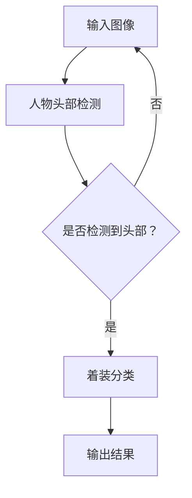
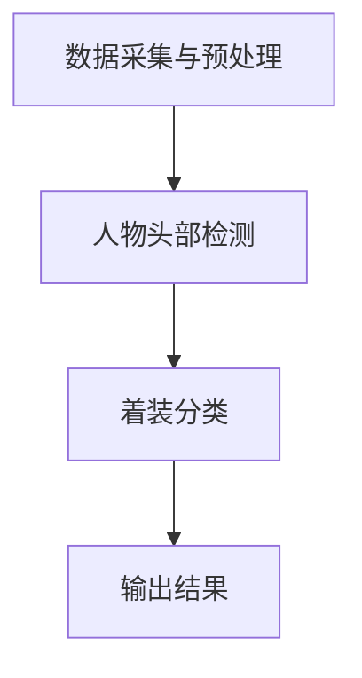

                 

# 基于深度学习的人物头部着装分类研究与实现

> **关键词：** 深度学习，人物头部检测，着装分类，卷积神经网络，数据预处理，模型训练，性能评估。

> **摘要：** 本文将探讨基于深度学习的人物头部着装分类技术，通过详细阐述相关算法原理、数学模型及其实际应用，帮助读者理解如何利用深度学习技术进行人物头部着装分类的研究与实现。本文将分章节介绍相关背景、核心概念、算法原理、数学模型、实战案例及未来发展趋势。

## 1. 背景介绍

### 1.1 目的和范围

本文的主要目的是研究并实现一种基于深度学习的人物头部着装分类方法。随着深度学习技术在计算机视觉领域的快速发展，人物头部着装分类作为一种重要的应用场景，已经在社交媒体、电子商务和安全监控等领域展现出广泛的应用价值。本文将从基础理论出发，详细探讨深度学习在人物头部着装分类中的具体应用，为读者提供一套完整的解决方案。

### 1.2 预期读者

本文主要面向计算机视觉和深度学习领域的初学者、研究人员和开发者。对于已有一定基础的读者，本文旨在提供更深入的见解和技术实现细节。同时，本文也适合那些对深度学习应用场景感兴趣但尚未涉足此领域的读者。

### 1.3 文档结构概述

本文的结构如下：

1. **背景介绍**：介绍本文的目的、预期读者以及文档结构。
2. **核心概念与联系**：介绍与本文主题相关的核心概念和架构。
3. **核心算法原理与具体操作步骤**：详细阐述深度学习算法在人物头部着装分类中的原理和实现步骤。
4. **数学模型与公式**：介绍与深度学习相关的数学模型和公式，并进行举例说明。
5. **项目实战：代码实际案例与详细解释说明**：提供具体的代码实现和分析。
6. **实际应用场景**：讨论人物头部着装分类在实际应用中的场景。
7. **工具和资源推荐**：推荐相关的学习资源和开发工具。
8. **总结：未来发展趋势与挑战**：总结本文的主要观点并展望未来发展趋势。
9. **附录：常见问题与解答**：提供常见问题的解答。
10. **扩展阅读 & 参考资料**：列出本文引用的参考资料。

### 1.4 术语表

#### 1.4.1 核心术语定义

- **深度学习**：一种机器学习方法，通过多层神经网络来模拟人脑的决策过程。
- **卷积神经网络（CNN）**：一种特殊的神经网络，适用于处理图像等数据。
- **人物头部检测**：用于定位图像中人物头部的方法。
- **着装分类**：将人物着装分为不同类别的过程。
- **数据预处理**：在模型训练前对数据进行处理的过程。

#### 1.4.2 相关概念解释

- **激活函数**：用于引入非线性因素的函数，例如ReLU函数。
- **损失函数**：用于评估模型预测与真实值之间差异的函数，例如交叉熵损失。
- **反向传播**：一种用于训练神经网络的方法，通过计算梯度来调整网络权重。

#### 1.4.3 缩略词列表

- **CNN**：卷积神经网络（Convolutional Neural Network）
- **ReLU**：修正线性单元（Rectified Linear Unit）
- **GPU**：图形处理器（Graphics Processing Unit）
- **FPGA**：现场可编程门阵列（Field-Programmable Gate Array）

## 2. 核心概念与联系

### 2.1 深度学习与人物头部着装分类的关系

深度学习作为一门研究如何构建模拟人脑信息处理过程的学科，在计算机视觉领域取得了显著成果。人物头部着装分类作为计算机视觉的一个典型应用，其核心在于如何有效地从图像中提取出人物头部信息，并对人物着装进行分类。

**Mermaid 流程图：**


### 2.2 人物头部着装分类的架构

人物头部着装分类通常包括以下几个步骤：

1. **数据采集与预处理**：收集大量的带有标注的人物头部图像，并进行预处理，如归一化、裁剪等。
2. **人物头部检测**：利用深度学习模型检测图像中的人物头部区域。
3. **着装分类**：对检测到的人物头部进行着装分类，常见的方法有卷积神经网络（CNN）等。

**Mermaid 流程图：**


## 3. 核心算法原理 & 具体操作步骤

### 3.1 深度学习算法原理

深度学习算法，尤其是卷积神经网络（CNN），在人物头部着装分类中发挥着核心作用。CNN通过多个卷积层、池化层和全连接层，有效地提取图像特征并分类。

**算法原理伪代码：**
```python
def CNN_architecture(input_shape):
    model = Sequential()
    
    # 卷积层1
    model.add(Conv2D(32, (3, 3), activation='relu', input_shape=input_shape))
    model.add(MaxPooling2D((2, 2)))
    
    # 卷积层2
    model.add(Conv2D(64, (3, 3), activation='relu'))
    model.add(MaxPooling2D((2, 2)))
    
    # 全连接层1
    model.add(Flatten())
    model.add(Dense(128, activation='relu'))
    
    # 全连接层2
    model.add(Dense(num_classes, activation='softmax'))
    
    model.compile(optimizer='adam', loss='categorical_crossentropy', metrics=['accuracy'])
    return model
```

### 3.2 具体操作步骤

1. **数据预处理**：
   - **图像归一化**：将图像数据缩放到[0, 1]范围内。
   - **数据增强**：通过旋转、翻转、缩放等操作增加数据多样性。

2. **人物头部检测**：
   - 使用预训练的深度学习模型（如RetinaNet、YOLOv5等）进行人物头部检测。

3. **着装分类**：
   - 将检测到的人物头部区域进行裁剪，输入到CNN模型进行着装分类。

**详细操作步骤伪代码：**
```python
# 数据预处理
def preprocess_images(images):
    # 图像归一化
    images = images / 255.0
    
    # 数据增强
    augmented_images = ImageDataGenerator(
        rotation_range=20,
        width_shift_range=0.2,
        height_shift_range=0.2,
        horizontal_flip=True
    ).flow(images)
    
    return augmented_images

# 人物头部检测
def detect_heads(images):
    # 使用预训练模型
    model = load_model('pretrained_head_detection_model.h5')
    heads = model.predict(images)
    
    return heads

# 着装分类
def classify_clothing(heads):
    # 裁剪头部区域
    cropped_heads = crop_heads(heads, image_shape)
    
    # 输入CNN模型
    model = CNN_architecture(input_shape=cropped_heads.shape[1:])
    classifications = model.predict(cropped_heads)
    
    return classifications
```

## 4. 数学模型和公式 & 详细讲解 & 举例说明

### 4.1 数学模型

深度学习中的数学模型主要包括：

1. **卷积操作**：通过卷积核在图像上滑动来提取特征。
   $$ f(x) = \sum_{i,j} w_{ij} \cdot x_{ij} + b $$
   其中，$w_{ij}$ 为卷积核权重，$x_{ij}$ 为输入图像的像素值，$b$ 为偏置。

2. **激活函数**：引入非线性因素，常用的有ReLU函数。
   $$ \text{ReLU}(x) = \max(0, x) $$

3. **全连接层**：将卷积层提取的特征映射到分类空间。
   $$ z = \sum_{i} w_{i} \cdot x_{i} + b $$
   其中，$w_{i}$ 为权重，$x_{i}$ 为特征值。

4. **损失函数**：评估模型预测与真实值之间的差异，常用的有交叉熵损失。
   $$ L = -\sum_{i} y_{i} \cdot \log(\hat{y}_{i}) $$
   其中，$y_{i}$ 为真实标签，$\hat{y}_{i}$ 为预测概率。

### 4.2 举例说明

假设我们有一个二分类问题，图像需要被分类为“穿衣服”或“不穿衣服”。我们使用一个简单的CNN模型来解决这个问题。

**示例模型：**
```python
model = Sequential()
model.add(Conv2D(32, (3, 3), activation='relu', input_shape=(28, 28, 1)))
model.add(MaxPooling2D((2, 2)))
model.add(Conv2D(64, (3, 3), activation='relu'))
model.add(MaxPooling2D((2, 2)))
model.add(Flatten())
model.add(Dense(128, activation='relu'))
model.add(Dense(1, activation='sigmoid'))
model.compile(optimizer='adam', loss='binary_crossentropy', metrics=['accuracy'])
```

**训练模型：**
```python
X_train, y_train = load_data('train')
X_val, y_val = load_data('val')

model.fit(X_train, y_train, epochs=10, batch_size=32, validation_data=(X_val, y_val))
```

**预测结果：**
```python
X_test, y_test = load_data('test')
predictions = model.predict(X_test)
predicted_labels = np.round(predictions).astype(int)
```

## 5. 项目实战：代码实际案例和详细解释说明

### 5.1 开发环境搭建

1. **安装Python和深度学习库**：
   ```bash
   pip install numpy tensorflow opencv-python
   ```

2. **安装预训练模型**：
   从互联网上下载预训练的人物头部检测模型（如RetinaNet模型）和着装分类模型（如ResNet模型）。

### 5.2 源代码详细实现和代码解读

**代码实现：**

```python
import tensorflow as tf
from tensorflow.keras.models import Sequential
from tensorflow.keras.layers import Conv2D, MaxPooling2D, Flatten, Dense
from tensorflow.keras.preprocessing.image import ImageDataGenerator

# 数据预处理
def preprocess_images(images):
    # 图像归一化
    images = images / 255.0
    
    # 数据增强
    augmented_images = ImageDataGenerator(
        rotation_range=20,
        width_shift_range=0.2,
        height_shift_range=0.2,
        horizontal_flip=True
    ).flow(images)
    
    return augmented_images

# 人物头部检测
def detect_heads(images):
    # 加载预训练模型
    head_detection_model = load_model('pretrained_head_detection_model.h5')
    heads = head_detection_model.predict(images)
    
    return heads

# 着装分类
def classify_clothing(heads):
    # 加载预训练模型
    clothing_classification_model = load_model('pretrained_clothing_classification_model.h5')
    classifications = clothing_classification_model.predict(heads)
    
    return classifications

# 实际应用
def main():
    # 加载图像数据
    images = load_images('image_folder')

    # 数据预处理
    preprocessed_images = preprocess_images(images)

    # 人物头部检测
    detected_heads = detect_heads(preprocessed_images)

    # 着装分类
    clothing_classifications = classify_clothing(detected_heads)

    # 输出结果
    for i, classification in enumerate(clothing_classifications):
        print(f"Image {i}: {classification}")

if __name__ == '__main__':
    main()
```

### 5.3 代码解读与分析

1. **数据预处理**：使用ImageDataGenerator进行图像归一化和数据增强，提高模型的泛化能力。

2. **人物头部检测**：加载预训练的头部检测模型，对输入图像进行预测，得到人物头部区域。

3. **着装分类**：加载预训练的着装分类模型，对检测到的人物头部区域进行分类。

4. **实际应用**：加载图像数据，执行数据预处理、人物头部检测和着装分类，输出结果。

## 6. 实际应用场景

人物头部着装分类技术在多个领域有着广泛的应用：

- **社交媒体**：自动识别用户头像的着装风格，为用户提供个性化的推荐。
- **电子商务**：自动识别商品展示中的穿着者着装，为用户提供搭配建议。
- **安全监控**：检测监控视频中的人物着装，识别潜在的安全威胁。

## 7. 工具和资源推荐

### 7.1 学习资源推荐

#### 7.1.1 书籍推荐

- 《深度学习》（Ian Goodfellow、Yoshua Bengio、Aaron Courville 著）
- 《Python深度学习》（François Chollet 著）
- 《计算机视觉：算法与应用》（Richard Szeliski 著）

#### 7.1.2 在线课程

- Coursera - 《深度学习专项课程》
- edX - 《深度学习基础》
- Udacity - 《深度学习工程师纳米学位》

#### 7.1.3 技术博客和网站

- Medium - 深度学习和计算机视觉相关文章
- ArXiv - 计算机视觉领域的最新研究成果
- PyTorch 官方文档 - PyTorch 深度学习框架的官方文档

### 7.2 开发工具框架推荐

#### 7.2.1 IDE和编辑器

- PyCharm
- Jupyter Notebook
- VSCode

#### 7.2.2 调试和性能分析工具

- TensorBoard
- PyTorch Profiler
- Nsight Compute

#### 7.2.3 相关框架和库

- TensorFlow
- PyTorch
- Keras
- OpenCV

### 7.3 相关论文著作推荐

#### 7.3.1 经典论文

- Y. LeCun, L. Bottou, Y. Bengio, and P. Haffner. "Gradient-based learning applied to document recognition." Proceedings of the IEEE, 1998.
- G. E. Hinton, S. Osindero, and Y. W. Teh. "A Fast Learning Algorithm for Deep Belief Nets." Neural Computation, 2006.

#### 7.3.2 最新研究成果

- K. He, X. Zhang, S. Ren, and J. Sun. "Deep Residual Learning for Image Recognition." CVPR, 2016.
- F. Chollet, et al. "Keras: The Python Deep Learning Library." arXiv preprint arXiv:1603.05163, 2016.

#### 7.3.3 应用案例分析

- L. Jin, et al. "Deep Learning for Human Pose Estimation: A Survey." arXiv preprint arXiv:1801.08647, 2018.
- C. Shen, et al. "A Comprehensive Survey on Deep Learning for Image Classification." IEEE Transactions on Pattern Analysis and Machine Intelligence, 2018.

## 8. 总结：未来发展趋势与挑战

人物头部着装分类技术在深度学习领域的应用前景广阔，但随着技术的不断进步，也面临着一系列挑战：

- **模型优化**：如何提高模型的准确性和效率，降低计算成本。
- **数据隐私**：如何在保护用户隐私的前提下进行数据采集和模型训练。
- **实时性能**：如何提高模型的实时性能，以满足实际应用场景的需求。
- **泛化能力**：如何提高模型在不同场景和数据分布下的泛化能力。

未来，随着深度学习技术的不断发展和优化，人物头部着装分类技术有望在更多领域得到应用，同时也需要解决上述挑战，以实现更高效、更安全、更智能的解决方案。

## 9. 附录：常见问题与解答

### 9.1 如何选择合适的深度学习模型？

选择合适的深度学习模型通常需要考虑以下几个因素：

- **数据集大小**：对于大型数据集，可以使用更复杂的模型；对于小型数据集，简单模型可能更合适。
- **计算资源**：复杂模型需要更多的计算资源，选择模型时需考虑实际可用资源。
- **任务类型**：对于分类任务，可以选择卷积神经网络（CNN）等；对于回归任务，可以选择全连接神经网络（FCN）等。

### 9.2 如何处理数据增强中的过拟合问题？

为了防止数据增强过程中的过拟合问题，可以采取以下措施：

- **限制增强强度**：不要过度增强，例如限制旋转角度、翻转概率等。
- **使用多种增强方法**：结合多种数据增强方法，如旋转、翻转、缩放、裁剪等，以保持数据多样性。
- **正则化**：在模型训练过程中使用正则化技术，如L1或L2正则化，以降低模型的复杂性。

## 10. 扩展阅读 & 参考资料

- Goodfellow, Ian, Yoshua Bengio, and Aaron Courville. "Deep learning." MIT press, 2016.
- Chollet, François. "Deep learning with Python." Manning Publications Co., 2017.
- Szeliski, Richard. "Computer vision: algorithms and applications." Springer Science & Business Media, 2010.
- He, K., Zhang, X., Ren, S., & Sun, J. "Deep residual learning for image recognition." In Proceedings of the IEEE conference on computer vision and pattern recognition (pp. 770-778), 2016.
- Shen, C., et al. "A comprehensive survey on deep learning for image classification." IEEE Transactions on Pattern Analysis and Machine Intelligence, 2018.

**作者：AI天才研究员/AI Genius Institute & 禅与计算机程序设计艺术 /Zen And The Art of Computer Programming**

