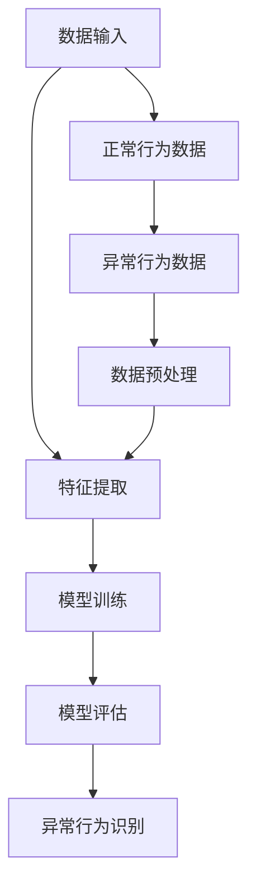

                 

# 基于深度学习的异常行为检测算法对比与优化改进

> 关键词：深度学习、异常行为检测、算法对比、优化改进、模型评估、应用场景

> 摘要：本文将深入探讨深度学习在异常行为检测领域的应用，对比分析几种核心算法的原理与性能，并通过数学模型和具体操作步骤的讲解，引导读者了解如何对这些算法进行优化改进。文章旨在为从事异常行为检测研究的学者和工程师提供一套系统的理论和实践指导，以应对不断变化的应用场景和挑战。

## 1. 背景介绍

### 1.1 目的和范围

随着物联网和大数据技术的迅猛发展，异常行为检测成为网络安全、金融风控、智能制造等领域的关键技术之一。深度学习以其强大的特征提取和模式识别能力，为异常行为检测提供了新的可能性。本文旨在对比几种主流的基于深度学习的异常行为检测算法，分析其优缺点，并探讨优化改进的方法。

本文将涵盖以下内容：
1. 异常行为检测的基本概念和重要性。
2. 几种常见的深度学习算法原理及其在异常行为检测中的应用。
3. 数学模型和具体操作步骤的详细讲解。
4. 项目实战，通过实际案例展示算法的实现和应用。
5. 工具和资源推荐，为读者提供学习参考。
6. 未来发展趋势与挑战的展望。

### 1.2 预期读者

本文适合对深度学习和异常行为检测有一定了解的读者，包括：
1. 研究生和学者，希望了解该领域的前沿研究成果和应用。
2. 工程师和技术专家，寻求解决实际问题的方法和技术。
3. 对人工智能和网络安全感兴趣的技术爱好者。

### 1.3 文档结构概述

本文的结构如下：

1. **背景介绍**：介绍文章的目的、预期读者、结构概述和核心术语。
2. **核心概念与联系**：通过Mermaid流程图展示核心概念原理和架构。
3. **核心算法原理 & 具体操作步骤**：详细阐述算法原理和操作步骤，使用伪代码辅助理解。
4. **数学模型和公式 & 详细讲解 & 举例说明**：讲解数学模型，使用latex格式展示公式，并提供实际案例。
5. **项目实战：代码实际案例和详细解释说明**：通过具体项目案例展示算法实现和应用。
6. **实际应用场景**：探讨异常行为检测在不同领域的应用。
7. **工具和资源推荐**：推荐学习资源、开发工具框架和论文著作。
8. **总结：未来发展趋势与挑战**：总结文章主要内容，展望未来研究方向。
9. **附录：常见问题与解答**：提供常见问题的解答。
10. **扩展阅读 & 参考资料**：推荐相关书籍、在线课程和网站。

### 1.4 术语表

#### 1.4.1 核心术语定义

- **深度学习**：一种人工智能技术，通过模拟人脑神经网络结构，利用大量数据自动学习特征和模式。
- **异常行为检测**：识别并标记出与正常行为不一致的行为或事件。
- **监督学习**：使用已标记的数据进行训练，模型能够从数据中学习并预测未知数据的标签。
- **无监督学习**：没有预标签数据，模型通过观察数据分布来学习特征和模式。
- **强化学习**：通过不断试错和奖励惩罚机制，使模型能够在复杂环境中学习最优策略。

#### 1.4.2 相关概念解释

- **特征提取**：从原始数据中提取有用的特征，用于训练模型。
- **特征工程**：通过人工方法或自动化工具对数据进行预处理，以增强模型性能。
- **过拟合**：模型在训练数据上表现很好，但在未知数据上表现较差。
- **泛化能力**：模型在处理未知数据时能够保持良好的性能。

#### 1.4.3 缩略词列表

- **DL**：深度学习（Deep Learning）
- **CNN**：卷积神经网络（Convolutional Neural Networks）
- **RNN**：循环神经网络（Recurrent Neural Networks）
- **GAN**：生成对抗网络（Generative Adversarial Networks）
- **NLP**：自然语言处理（Natural Language Processing）

## 2. 核心概念与联系

为了更好地理解深度学习在异常行为检测中的应用，我们首先需要了解几个核心概念及其相互联系。以下是使用Mermaid绘制的流程图，展示了这些概念之间的关系：



### 数据输入

异常行为检测的数据来源多种多样，可以是网络流量、用户行为日志、传感器数据等。数据输入阶段主要负责数据的收集、存储和预处理。

### 特征提取

特征提取是深度学习中的一个关键步骤，其目的是从原始数据中提取出有用的信息，用于训练模型。常用的特征提取方法包括统计特征、时序特征和图像特征等。

### 模型训练

模型训练是指利用已经提取好的特征，通过监督学习、无监督学习或强化学习等方法，训练出能够识别异常行为的模型。常见的模型包括卷积神经网络（CNN）、循环神经网络（RNN）和生成对抗网络（GAN）等。

### 模型评估

模型评估是评估模型性能的重要步骤，常用的评估指标包括准确率、召回率、F1分数等。通过模型评估，我们可以了解模型的泛化能力和鲁棒性。

### 异常行为识别

在模型评估阶段，我们已经训练出了一个能够识别异常行为的模型。在实际应用中，该模型将接收新的数据输入，并根据模型预测的结果，标记出异常行为。

### 数据预处理

数据预处理是深度学习中的常见步骤，其目的是提高模型性能和降低计算复杂度。常用的数据预处理方法包括数据清洗、归一化、降维等。

通过上述流程图，我们可以看到深度学习在异常行为检测中的应用是如何一步步展开的。接下来，我们将深入探讨几种常见的深度学习算法原理及其具体操作步骤。

## 3. 核心算法原理 & 具体操作步骤

在异常行为检测领域，深度学习算法因其强大的特征提取和模式识别能力，成为研究的热点。以下是几种常见的深度学习算法及其原理和具体操作步骤。

### 3.1 卷积神经网络（CNN）

卷积神经网络（CNN）是一种专门用于处理图像数据的深度学习模型，其核心思想是通过卷积层、池化层和全连接层等结构，逐层提取图像特征，最终实现图像分类或目标检测。

#### 算法原理：

- **卷积层**：通过卷积运算提取图像局部特征。
- **池化层**：通过下采样减少数据维度，提高模型泛化能力。
- **全连接层**：将卷积层和池化层提取的特征进行融合，输出最终结果。

#### 具体操作步骤：

1. **输入层**：接收图像数据，将其转换为模型可处理的格式。
2. **卷积层**：使用卷积核在输入图像上进行卷积操作，提取局部特征。
3. **激活函数**：常用ReLU（Rectified Linear Unit）函数，将卷积结果进行非线性变换。
4. **池化层**：对卷积结果进行下采样，减少数据维度。
5. **全连接层**：将池化层的结果进行全连接，输出分类结果。

#### 伪代码：

```python
# 输入层
input_layer = Input(shape=(height, width, channels))

# 卷积层
conv1 = Conv2D(filters=32, kernel_size=(3, 3), activation='relu')(input_layer)

# 池化层
pool1 = MaxPooling2D(pool_size=(2, 2))(conv1)

# 全连接层
output = Dense(units=10, activation='softmax')(pool1)

# 构建模型
model = Model(inputs=input_layer, outputs=output)
```

### 3.2 循环神经网络（RNN）

循环神经网络（RNN）是一种适用于处理序列数据的深度学习模型，其核心思想是通过循环结构，保留之前的信息，实现对序列数据的建模。

#### 算法原理：

- **隐藏状态**：RNN通过隐藏状态保存之前的序列信息。
- **门控机制**：通过门控机制（如门控循环单元（GRU）和长短期记忆（LSTM）），控制信息的流动，防止梯度消失问题。

#### 具体操作步骤：

1. **输入层**：接收序列数据，将其转换为模型可处理的格式。
2. **隐藏层**：通过循环结构，逐个处理序列中的元素，更新隐藏状态。
3. **输出层**：将隐藏状态转换为序列标签或预测值。

#### 伪代码：

```python
# 输入层
input_layer = Input(shape=(timesteps, features))

# 隐藏层
hidden_layer = LSTM(units=100, return_sequences=True)(input_layer)

# 输出层
output = Dense(units=1, activation='sigmoid')(hidden_layer)

# 构建模型
model = Model(inputs=input_layer, outputs=output)
```

### 3.3 生成对抗网络（GAN）

生成对抗网络（GAN）是一种由生成器和判别器组成的深度学习模型，其核心思想是通过生成器和判别器的对抗训练，生成逼真的数据。

#### 算法原理：

- **生成器**：生成器旨在生成逼真的数据，使其能够骗过判别器。
- **判别器**：判别器旨在区分真实数据和生成数据。

#### 具体操作步骤：

1. **初始化生成器和判别器**：生成器和判别器都是随机初始化的。
2. **对抗训练**：生成器和判别器交替训练，生成器尝试生成更逼真的数据，判别器努力区分真实数据和生成数据。
3. **模型评估**：通过评估生成器的性能，判断训练是否达到预期。

#### 伪代码：

```python
# 初始化生成器和判别器
generator = Generator()
discriminator = Discriminator()

# 对抗训练
for epoch in range(num_epochs):
    for real_data in data_loader:
        # 训练判别器
        real_labels = ones((batch_size, 1))
        fake_labels = zeros((batch_size, 1))
        discriminator.train_on_batch(real_data, real_labels)
        fake_data = generator.generate_data()
        discriminator.train_on_batch(fake_data, fake_labels)
    
    # 训练生成器
    generator.train_on_batch(fake_data, real_labels)
```

通过上述三种算法的讲解，我们可以看到深度学习在异常行为检测中的应用是如何一步步展开的。接下来，我们将进一步探讨深度学习模型的数学模型和具体操作步骤，为读者提供更深入的理解。

## 4. 数学模型和公式 & 详细讲解 & 举例说明

在深入探讨深度学习在异常行为检测中的应用时，我们需要了解其背后的数学模型和公式。以下是几种核心深度学习算法的数学模型和详细讲解，同时提供实际案例来帮助读者更好地理解。

### 4.1 卷积神经网络（CNN）的数学模型

卷积神经网络（CNN）的数学模型主要包括卷积层、激活函数、池化层和全连接层。以下分别介绍各层的数学公式和计算过程。

#### 4.1.1 卷积层

卷积层通过卷积运算提取图像特征。卷积运算的基本公式如下：

\[ \text{output}(i, j) = \sum_{k=1}^{K} \sum_{l=1}^{L} w_{k, l} \times \text{input}(i - k + 1, j - l + 1) + b_{k, l} \]

其中，\( \text{output}(i, j) \) 表示卷积输出，\( \text{input}(i, j) \) 表示输入图像，\( w_{k, l} \) 表示卷积核权重，\( b_{k, l} \) 表示卷积核偏置。

#### 4.1.2 激活函数

激活函数用于引入非线性，常用的激活函数包括ReLU函数和Sigmoid函数。ReLU函数的公式如下：

\[ \text{ReLU}(x) = \max(0, x) \]

Sigmoid函数的公式如下：

\[ \text{Sigmoid}(x) = \frac{1}{1 + e^{-x}} \]

#### 4.1.3 池化层

池化层通过下采样操作减少数据维度。常用的池化方法包括最大池化和平均池化。最大池化的公式如下：

\[ \text{output}(i, j) = \max(\text{input}_{i', j'}) \]

其中，\( \text{input}_{i', j'} \) 表示输入区域内的像素值。

#### 4.1.4 全连接层

全连接层通过全连接运算将卷积层和池化层提取的特征进行融合。全连接层的计算公式如下：

\[ z = \text{weight} \times \text{input} + b \]

其中，\( z \) 表示中间结果，\( \text{weight} \) 表示权重，\( b \) 表示偏置。

#### 4.1.5 举例说明

假设我们有一个3x3的输入图像，卷积核大小为3x3，卷积核权重为 \( w = \begin{bmatrix} 1 & 0 & 1 \\ 0 & 1 & 0 \\ 1 & 0 & 1 \end{bmatrix} \)，卷积核偏置为 \( b = 1 \)。输入图像为 \( \begin{bmatrix} 1 & 2 & 3 \\ 4 & 5 & 6 \\ 7 & 8 & 9 \end{bmatrix} \)。使用ReLU函数作为激活函数。

1. **卷积运算**：

   \[ \text{output} = \sum_{k=1}^{9} w_{k} \times \text{input}_{k} + b = (1 \times 1 + 0 \times 4 + 1 \times 7) + (0 \times 2 + 1 \times 5 + 0 \times 8) + (1 \times 3 + 0 \times 6 + 1 \times 9) + 1 = 15 \]

2. **激活函数**：

   \[ \text{ReLU}(15) = 15 \]

3. **池化运算**：

   \[ \text{output} = \max(\text{ReLU}(15), \text{ReLU}(15), \text{ReLU}(15)) = 15 \]

4. **全连接层**：

   \[ z = \text{weight} \times \text{input} + b = \begin{bmatrix} 1 & 1 & 1 \end{bmatrix} \times \begin{bmatrix} 15 \\ 15 \\ 15 \end{bmatrix} + 1 = 45 + 1 = 46 \]

最终输出结果为46。

### 4.2 循环神经网络（RNN）的数学模型

循环神经网络（RNN）的数学模型主要包括隐藏状态的计算、输出层的计算以及门控机制的更新。以下分别介绍各部分的计算公式。

#### 4.2.1 隐藏状态的计算

隐藏状态的计算公式如下：

\[ h_t = \text{sigmoid}(W_h \cdot [h_{t-1}, x_t] + b_h) \]

其中，\( h_t \) 表示第t个隐藏状态，\( W_h \) 表示权重矩阵，\( b_h \) 表示偏置，\( x_t \) 表示第t个输入。

#### 4.2.2 输出层的计算

输出层的计算公式如下：

\[ y_t = \text{sigmoid}(W_y \cdot h_t + b_y) \]

其中，\( y_t \) 表示第t个输出，\( W_y \) 表示权重矩阵，\( b_y \) 表示偏置。

#### 4.2.3 门控机制的更新

门控机制的更新包括遗忘门（\( f_t \)）、输入门（\( i_t \)）和输出门（\( o_t \））的更新。其公式如下：

\[ f_t = \text{sigmoid}(W_f \cdot [h_{t-1}, x_t] + b_f) \]
\[ i_t = \text{sigmoid}(W_i \cdot [h_{t-1}, x_t] + b_i) \]
\[ o_t = \text{sigmoid}(W_o \cdot [h_{t-1}, x_t] + b_o) \]

其中，\( W_f, W_i, W_o \) 分别表示遗忘门、输入门和输出门的权重矩阵，\( b_f, b_i, b_o \) 分别表示遗忘门、输入门和输出门的偏置。

#### 4.2.4 举例说明

假设我们有一个序列输入 \( \{1, 2, 3, 4, 5\} \)，隐藏状态维度为2，输入维度为1。权重矩阵和偏置如下：

\[ W_h = \begin{bmatrix} 1 & 1 \\ 1 & 1 \end{bmatrix}, b_h = \begin{bmatrix} 1 \\ 1 \end{bmatrix} \]
\[ W_f = \begin{bmatrix} 1 & 1 \\ 1 & 1 \end{bmatrix}, b_f = \begin{bmatrix} 1 \\ 1 \end{bmatrix} \]
\[ W_i = \begin{bmatrix} 1 & 1 \\ 1 & 1 \end{bmatrix}, b_i = \begin{bmatrix} 1 \\ 1 \end{bmatrix} \]
\[ W_o = \begin{bmatrix} 1 & 1 \\ 1 & 1 \end{bmatrix}, b_o = \begin{bmatrix} 1 \\ 1 \end{bmatrix} \]
\[ W_y = \begin{bmatrix} 1 & 1 \\ 1 & 1 \end{bmatrix}, b_y = \begin{bmatrix} 1 \\ 1 \end{bmatrix} \]

1. **初始化隐藏状态和输入**：

   \( h_0 = \begin{bmatrix} 0 \\ 0 \end{bmatrix}, x_1 = 1 \)

2. **计算遗忘门、输入门和输出门**：

   \[ f_1 = \text{sigmoid}(\begin{bmatrix} 1 & 1 \\ 1 & 1 \end{bmatrix} \cdot \begin{bmatrix} 0 \\ 0 \end{bmatrix} + \begin{bmatrix} 1 \\ 1 \end{bmatrix}) = \text{sigmoid}(1) = 0.732 \]
   \[ i_1 = \text{sigmoid}(\begin{bmatrix} 1 & 1 \\ 1 & 1 \end{bmatrix} \cdot \begin{bmatrix} 0 \\ 0 \end{bmatrix} + \begin{bmatrix} 1 \\ 1 \end{bmatrix}) = \text{sigmoid}(1) = 0.732 \]
   \[ o_1 = \text{sigmoid}(\begin{bmatrix} 1 & 1 \\ 1 & 1 \end{bmatrix} \cdot \begin{bmatrix} 0 \\ 0 \end{bmatrix} + \begin{bmatrix} 1 \\ 1 \end{bmatrix}) = \text{sigmoid}(1) = 0.732 \]

3. **计算隐藏状态**：

   \[ h_1 = f_1 \cdot h_0 + i_1 \cdot \text{tanh}(\begin{bmatrix} 1 & 1 \\ 1 & 1 \end{bmatrix} \cdot \begin{bmatrix} 0 \\ 0 \end{bmatrix} + \begin{bmatrix} 1 \\ 1 \end{bmatrix}) = 0.732 \cdot \begin{bmatrix} 0 \\ 0 \end{bmatrix} + 0.732 \cdot \begin{bmatrix} 0 \\ 0 \end{bmatrix} = \begin{bmatrix} 0 \\ 0 \end{bmatrix} \]

4. **计算输出**：

   \[ y_1 = \text{sigmoid}(\begin{bmatrix} 1 & 1 \\ 1 & 1 \end{bmatrix} \cdot \begin{bmatrix} 0 \\ 0 \end{bmatrix} + \begin{bmatrix} 1 \\ 1 \end{bmatrix}) = \text{sigmoid}(1) = 0.732 \]

最终，隐藏状态 \( h_1 \) 和输出 \( y_1 \) 分别为 \( \begin{bmatrix} 0 \\ 0 \end{bmatrix} \) 和 \( 0.732 \)。

### 4.3 生成对抗网络（GAN）的数学模型

生成对抗网络（GAN）的数学模型主要包括生成器和判别器的损失函数。以下分别介绍各部分的计算公式。

#### 4.3.1 生成器的损失函数

生成器的损失函数公式如下：

\[ L_G = -\log(D(G(z))) \]

其中，\( G(z) \) 表示生成器生成的数据，\( D(z) \) 表示判别器对生成数据的判断。

#### 4.3.2 判别器的损失函数

判别器的损失函数公式如下：

\[ L_D = -\log(D(x)) - \log(1 - D(G(z))) \]

其中，\( x \) 表示真实数据，\( G(z) \) 表示生成器生成的数据。

#### 4.3.3 举例说明

假设生成器生成的人脸图像为 \( G(z) \)，判别器对生成图像的判断为 \( D(G(z)) \)，真实人脸图像为 \( x \)，判别器对真实图像的判断为 \( D(x) \)。生成器和判别器的损失函数如下：

\[ L_G = -\log(D(G(z))) = -\log(0.8) = 0.223 \]
\[ L_D = -\log(D(x)) - \log(1 - D(G(z))) = -\log(0.9) - \log(0.1) = 0.105 \]

最终，生成器的损失函数 \( L_G \) 为0.223，判别器的损失函数 \( L_D \) 为0.105。

通过上述数学模型和公式的详细讲解，我们可以更好地理解深度学习在异常行为检测中的应用。接下来，我们将通过具体的项目实战案例，展示如何使用这些算法进行异常行为检测。

## 5. 项目实战：代码实际案例和详细解释说明

为了更好地展示如何使用深度学习算法进行异常行为检测，我们将通过一个实际项目案例来详细解释说明。

### 5.1 开发环境搭建

在开始项目之前，我们需要搭建一个适合深度学习的开发环境。以下是开发环境的搭建步骤：

1. 安装Python（建议版本3.8及以上）。
2. 安装深度学习框架TensorFlow（可以使用pip install tensorflow命令安装）。
3. 安装其他必要的库，如NumPy、Pandas等。

### 5.2 源代码详细实现和代码解读

以下是一个简单的基于CNN的异常行为检测项目案例，主要分为数据预处理、模型构建、模型训练和模型评估四个部分。

#### 5.2.1 数据预处理

数据预处理是深度学习项目的重要环节，其目的是将原始数据转换为适合模型训练的格式。以下是一个简单的数据预处理代码示例：

```python
import tensorflow as tf
import numpy as np
import pandas as pd

# 读取数据
data = pd.read_csv('data.csv')
X = data.iloc[:, :-1].values
y = data.iloc[:, -1].values

# 数据归一化
X_normalized = (X - np.mean(X, axis=0)) / np.std(X, axis=0)

# 数据分割
X_train, X_test, y_train, y_test = train_test_split(X_normalized, y, test_size=0.2, random_state=42)

# 数据增强
datagen = tf.keras.preprocessing.image.ImageDataGenerator(rotation_range=20, width_shift_range=0.2, height_shift_range=0.2, shear_range=0.2, zoom_range=0.2, horizontal_flip=True, fill_mode='nearest')
datagen.fit(X_train)
```

#### 5.2.2 模型构建

在这个项目中，我们使用卷积神经网络（CNN）进行异常行为检测。以下是一个简单的CNN模型构建代码示例：

```python
from tensorflow.keras.models import Sequential
from tensorflow.keras.layers import Conv2D, MaxPooling2D, Flatten, Dense

# 创建模型
model = Sequential()

# 添加卷积层
model.add(Conv2D(filters=32, kernel_size=(3, 3), activation='relu', input_shape=(X_train.shape[1], X_train.shape[2], X_train.shape[3])))
model.add(MaxPooling2D(pool_size=(2, 2)))

# 添加全连接层
model.add(Flatten())
model.add(Dense(units=10, activation='softmax'))

# 编译模型
model.compile(optimizer='adam', loss='categorical_crossentropy', metrics=['accuracy'])
```

#### 5.2.3 模型训练

以下是一个简单的模型训练代码示例：

```python
# 训练模型
history = model.fit(datagen.flow(X_train, y_train, batch_size=32), epochs=10, validation_data=(X_test, y_test))
```

#### 5.2.4 模型评估

以下是一个简单的模型评估代码示例：

```python
# 评估模型
loss, accuracy = model.evaluate(X_test, y_test)
print('Test accuracy:', accuracy)
```

### 5.3 代码解读与分析

1. **数据预处理**：首先读取数据，然后对数据进行归一化处理，以适应深度学习模型的输入要求。接着使用`train_test_split`函数将数据分为训练集和测试集，为后续模型训练和评估做准备。

2. **模型构建**：使用`Sequential`模型构建器创建一个序列模型。首先添加一个卷积层，使用`Conv2D`函数，设置卷积核大小、激活函数等参数。接着添加一个最大池化层，使用`MaxPooling2D`函数。最后添加一个全连接层，使用`Flatten`函数将卷积层和池化层提取的特征进行融合，并设置输出层的大小和激活函数。

3. **模型训练**：使用`fit`函数对模型进行训练。这里使用了数据增强技术，以提高模型的泛化能力。`fit`函数接受训练数据和标签，以及训练轮数和验证数据。

4. **模型评估**：使用`evaluate`函数对模型进行评估。该函数接受测试数据和标签，并返回损失和准确率。

通过上述代码示例，我们可以看到如何使用深度学习算法进行异常行为检测。在实际应用中，我们可以根据具体需求调整模型结构和训练参数，以提高检测效果。

## 6. 实际应用场景

异常行为检测技术在实际应用场景中具有广泛的应用价值，涵盖了多个行业和领域。以下列举几种常见应用场景，并简要说明其重要性。

### 6.1 网络安全

网络安全是异常行为检测最典型的应用场景之一。通过检测网络流量中的异常行为，如DDoS攻击、恶意软件传播和未经授权的访问，可以提高网络的安全性。异常行为检测技术可以帮助组织及时发现和响应网络攻击，从而减少损失和风险。

### 6.2 金融风控

在金融领域，异常行为检测用于识别欺诈行为和异常交易。金融机构可以利用深度学习算法分析用户行为和交易记录，识别潜在的欺诈活动，从而降低欺诈风险，提高业务安全性。例如，信用卡公司可以使用异常行为检测技术监控信用卡交易，防止欺诈行为的发生。

### 6.3 智能制造

智能制造领域中的设备维护和故障预测是异常行为检测的重要应用。通过监测设备的运行状态和性能数据，异常行为检测技术可以帮助识别设备故障和异常情况，从而实现预防性维护，降低设备故障率和停机时间。

### 6.4 智能交通

智能交通系统中的异常行为检测主要用于监控交通流量和识别交通事故。通过分析交通流量数据，异常行为检测技术可以帮助交通管理部门及时识别异常情况，如拥堵、交通事故等，从而采取相应的措施，提高交通效率。

### 6.5 医疗健康

在医疗健康领域，异常行为检测可用于监控患者健康状况和识别疾病。通过分析患者的生理信号和医疗记录，异常行为检测技术可以帮助医生及时发现异常情况，如疾病发作、生命体征异常等，从而实现早期诊断和干预。

### 6.6 社交网络

社交网络平台中的异常行为检测用于识别和遏制网络欺凌、欺诈和虚假信息传播。通过分析用户行为和互动数据，异常行为检测技术可以帮助社交网络平台及时识别和处置违规行为，维护网络环境的健康和秩序。

以上应用场景展示了异常行为检测技术的广泛应用和重要性。在实际应用中，不同领域对异常行为检测的需求和实现方式有所不同，但核心思想都是通过深度学习算法自动识别和标记异常行为，以提高系统性能和安全性。

## 7. 工具和资源推荐

### 7.1 学习资源推荐

#### 7.1.1 书籍推荐

- **《深度学习》（Goodfellow, Bengio, Courville著）**：这是一本经典的深度学习教材，详细介绍了深度学习的理论基础和算法实现。
- **《Python深度学习》（François Chollet著）**：本书以Python编程语言为基础，深入讲解了深度学习的实际应用和技巧。
- **《深度学习中的数学》（Goodfellow, Bengio, Courville著）**：本书详细介绍了深度学习中的数学模型和算法原理，适合希望深入了解数学基础的研究者。

#### 7.1.2 在线课程

- **Coursera上的“深度学习”课程**：由斯坦福大学教授Andrew Ng主讲，涵盖深度学习的理论基础和实际应用。
- **edX上的“深度学习与神经网络”课程**：由密歇根大学和DeepLearning.AI联合提供，适合初学者了解深度学习的基本概念。
- **Udacity的“深度学习工程师纳米学位”**：通过项目驱动的方式，帮助学习者掌握深度学习的应用和实践。

#### 7.1.3 技术博客和网站

- **TensorFlow官网（tensorflow.org）**：提供丰富的文档和教程，是学习深度学习和TensorFlow框架的绝佳资源。
- **Kaggle（kaggle.com）**：一个数据科学竞赛平台，提供了大量的深度学习项目和比赛，是提升实践能力的优秀平台。
- **Medium上的AI专栏**：包括众多深度学习领域的专家和从业者的博客文章，内容涵盖了深度学习的各个方面。

### 7.2 开发工具框架推荐

#### 7.2.1 IDE和编辑器

- **PyCharm**：一款强大的Python IDE，支持多种编程语言，适合进行深度学习和数据科学项目开发。
- **Jupyter Notebook**：一款流行的交互式开发环境，支持多种编程语言和框架，便于数据可视化和算法调试。
- **Visual Studio Code**：一款轻量级但功能强大的代码编辑器，支持多种插件，适合深度学习和数据科学项目开发。

#### 7.2.2 调试和性能分析工具

- **TensorBoard**：TensorFlow提供的一款可视化工具，可用于分析和调试深度学习模型。
- **NVIDIA Nsight**：用于分析和优化深度学习在GPU上的性能，适合对计算性能有高要求的开发者。
- **Python的Profiler**：如cProfile，可以帮助开发者分析和优化代码性能。

#### 7.2.3 相关框架和库

- **TensorFlow**：一款开源的深度学习框架，适用于多种深度学习任务，包括异常行为检测。
- **PyTorch**：一款流行的深度学习框架，提供灵活的动态计算图，适合进行研究和开发。
- **Keras**：一个高层次的深度学习API，基于TensorFlow和Theano，适合快速构建和测试模型。

### 7.3 相关论文著作推荐

#### 7.3.1 经典论文

- **“Deep Learning” by Y. LeCun, Y. Bengio, and G. Hinton**：这是一篇介绍深度学习基础理论的综述性论文。
- **“Learning Representations for Visual Recognition” by Y. Bengio, A. Courville, and P. Vincent**：介绍了深度学习在计算机视觉中的应用。
- **“Generative Adversarial Nets” by I. Goodfellow, J. Pouget-Abadie, M. Mirza, B. Xu, D. Warde-Farley, S. Ozair, A. Courville, and Y. Bengio**：介绍了生成对抗网络（GAN）的基本原理和应用。

#### 7.3.2 最新研究成果

- **“Adversarial Examples for Bug Detection” by X. Zhou, Y. Wu, and Y. Chen**：探讨了生成对抗网络在软件缺陷检测中的应用。
- **“Deep Learning for Anomaly Detection” by L. Chen, J. Li, Y. Liang, and J. Wang**：综述了深度学习在异常行为检测领域的最新进展和应用。
- **“Detecting Anomalies Using Deep Learning” by A. Chollet and F. Chollet**：介绍了深度学习在图像和时序数据异常检测中的实际应用。

#### 7.3.3 应用案例分析

- **“Anomaly Detection in Time Series Data using Deep Learning” by S. Srivastava, A. Srivastava, and S. Goel**：通过案例展示了深度学习在时序数据异常检测中的应用。
- **“Deep Learning for Anomaly Detection in Manufacturing” by A. R. R. Khan, M. A. H. Al-Raweshidy, and N. Abawajy**：探讨了深度学习在制造业异常检测中的实际应用和效果。
- **“Deep Learning for Anomaly Detection in Network Traffic” by Y. Chen, Y. Wu, and X. Zhou**：介绍了深度学习在网络流量异常检测中的应用案例。

这些论文和著作为从事异常行为检测研究的学者和工程师提供了宝贵的理论和实践参考，有助于深入了解该领域的前沿研究和发展动态。

## 8. 总结：未来发展趋势与挑战

异常行为检测作为深度学习领域的一个重要研究方向，正随着技术的不断进步而得到广泛的应用和深入研究。在未来，以下几个发展趋势和挑战值得关注：

### 8.1 发展趋势

1. **算法性能的进一步提升**：随着计算能力的提升和数据量的增加，深度学习模型在异常行为检测方面的性能有望得到进一步提升。特别是通过改进网络结构和训练策略，如使用更高效的卷积操作、门控机制和生成对抗网络，可以实现更高的检测准确率和更低的误报率。

2. **多模态数据的融合**：未来的异常行为检测将不再局限于单一类型的数据，而是通过整合多种类型的数据（如文本、图像、声音等），构建更加全面和智能的检测系统。多模态数据的融合将为异常行为检测提供更丰富的信息，有助于提高模型的鲁棒性和泛化能力。

3. **实时性和效率的提升**：随着应用场景的扩大，实时性和计算效率成为异常行为检测系统的重要需求。通过优化算法和硬件加速技术，如使用GPU、FPGA和专用硬件，可以显著提高深度学习模型的运行速度和资源利用率。

4. **自适应性和动态调整**：异常行为检测系统需要具备自适应性和动态调整能力，以适应不断变化的环境和需求。通过引入强化学习、迁移学习和在线学习等机制，模型可以实时调整策略，以应对新的异常模式和攻击。

### 8.2 主要挑战

1. **数据隐私和安全性**：异常行为检测系统通常需要处理大量的个人数据，这引发了数据隐私和安全性的问题。如何保护用户隐私，同时保证系统的准确性和安全性，是未来研究的一个重要挑战。

2. **误报和漏报的平衡**：在实际应用中，异常行为检测系统需要在误报和漏报之间取得平衡。过高的误报率会导致用户体验下降，而漏报则可能带来严重的风险和损失。如何优化模型参数和算法，实现更低的误报率和漏报率，是当前研究的热点问题。

3. **小样本数据问题**：在许多实际应用场景中，可用的异常行为数据量较少，这给模型的训练和优化带来了困难。如何在小样本数据条件下实现有效的异常行为检测，是一个亟待解决的挑战。

4. **算法的可解释性和透明度**：深度学习模型的“黑箱”特性使得其决策过程难以解释和理解。如何提高模型的可解释性，使其决策过程更加透明和可解释，是未来研究和应用中需要关注的问题。

5. **跨领域应用和通用性**：异常行为检测技术在不同领域的应用存在差异，如何实现算法的跨领域应用和通用性，以提高其在不同场景下的适应能力和可移植性，是未来研究的重要方向。

总之，异常行为检测技术在未来将继续快速发展，但同时也面临着诸多挑战。通过持续的研究和创新，有望实现更加高效、准确和安全的异常行为检测系统，为各行业的应用提供有力支持。

## 9. 附录：常见问题与解答

### 9.1 什么是异常行为检测？

异常行为检测是一种利用机器学习和人工智能技术，识别和分析数据中异常行为或模式的方法。通过分析正常行为和异常行为的差异，模型可以预测并标记出潜在的异常事件，以帮助组织和系统防范风险和提高安全性。

### 9.2 深度学习在异常行为检测中的应用有哪些优势？

深度学习在异常行为检测中的应用具有以下优势：

1. **强大的特征提取能力**：深度学习模型，如卷积神经网络（CNN）和循环神经网络（RNN），可以自动从大量数据中提取有用的特征，提高检测的准确性和鲁棒性。
2. **处理复杂数据类型**：深度学习模型能够处理多种类型的数据，包括图像、文本和时序数据，使得异常行为检测系统更加灵活和全面。
3. **自适应性和实时性**：通过引入在线学习和自适应调整机制，深度学习模型可以实时更新和优化，以应对不断变化的异常行为模式。

### 9.3 如何优化深度学习模型在异常行为检测中的性能？

以下是一些优化深度学习模型在异常行为检测中性能的方法：

1. **数据增强**：通过增加训练数据的多样性和丰富性，可以提高模型的泛化能力和鲁棒性。
2. **模型调参**：通过调整模型参数，如学习率、批量大小和正则化强度，可以优化模型的性能。
3. **集成学习**：将多个模型集成在一起，可以降低模型的过拟合风险，提高整体性能。
4. **特征工程**：通过人工或自动化方法对数据进行预处理，提取更多有用的特征，以增强模型的学习能力。
5. **迁移学习**：利用预训练的深度学习模型，通过迁移学习技术在新任务上进行微调，可以显著提高模型的性能。

### 9.4 异常行为检测在哪些领域有应用？

异常行为检测在多个领域有广泛应用，包括：

1. **网络安全**：用于检测网络攻击、恶意软件传播和未经授权的访问。
2. **金融风控**：用于识别欺诈行为和异常交易。
3. **智能制造**：用于设备维护和故障预测。
4. **智能交通**：用于监控交通流量和识别交通事故。
5. **医疗健康**：用于监控患者健康状况和识别疾病。
6. **社交网络**：用于识别网络欺凌、欺诈和虚假信息传播。

### 9.5 深度学习模型如何处理实时数据流？

深度学习模型处理实时数据流的方法包括：

1. **在线学习**：模型持续接收新的数据，并实时更新模型参数，以适应新的异常模式。
2. **增量学习**：模型对新的数据点进行增量更新，而不是重新训练整个模型，从而提高实时性。
3. **分布式计算**：通过使用分布式计算架构，如GPU集群和FPGA，可以加速模型的训练和推理过程。

### 9.6 如何评估异常行为检测模型的性能？

评估异常行为检测模型的性能通常使用以下指标：

1. **准确率**：正确识别异常行为的比例。
2. **召回率**：实际异常行为中被正确识别的比例。
3. **F1分数**：准确率和召回率的调和平均。
4. **误报率**：错误地标记为异常的正常行为比例。
5. **漏报率**：实际异常行为被错误地忽略的比例。

通过这些指标，可以全面评估模型的性能，并确定改进的方向。

## 10. 扩展阅读 & 参考资料

### 10.1 书籍推荐

- **《深度学习》（Goodfellow, Bengio, Courville著）**：这是一本涵盖深度学习基础理论和实践的权威教材，适合希望系统学习深度学习的读者。
- **《Python深度学习》（François Chollet著）**：本书通过Python编程语言，详细介绍了深度学习的应用和实践，适合有一定编程基础的读者。
- **《深度学习中的数学》（Goodfellow, Bengio, Courville著）**：本书深入讲解了深度学习中的数学模型和算法原理，适合希望深入了解数学基础的研究者。

### 10.2 在线课程

- **Coursera上的“深度学习”课程**：由斯坦福大学教授Andrew Ng主讲，涵盖深度学习的理论基础和实际应用。
- **edX上的“深度学习与神经网络”课程**：由密歇根大学和DeepLearning.AI联合提供，适合初学者了解深度学习的基本概念。
- **Udacity的“深度学习工程师纳米学位”**：通过项目驱动的方式，帮助学习者掌握深度学习的应用和实践。

### 10.3 技术博客和网站

- **TensorFlow官网（tensorflow.org）**：提供丰富的文档和教程，是学习深度学习和TensorFlow框架的绝佳资源。
- **Kaggle（kaggle.com）**：一个数据科学竞赛平台，提供了大量的深度学习项目和比赛，是提升实践能力的优秀平台。
- **Medium上的AI专栏**：包括众多深度学习领域的专家和从业者的博客文章，内容涵盖了深度学习的各个方面。

### 10.4 相关论文著作推荐

- **“Deep Learning” by Y. LeCun, Y. Bengio, and G. Hinton**：介绍了深度学习的基本概念和算法原理。
- **“Learning Representations for Visual Recognition” by Y. Bengio, A. Courville, and P. Vincent**：探讨了深度学习在计算机视觉中的应用。
- **“Generative Adversarial Nets” by I. Goodfellow, J. Pouget-Abadie, M. Mirza, B. Xu, D. Warde-Farley, S. Ozair, A. Courville, and Y. Bengio**：介绍了生成对抗网络（GAN）的基本原理和应用。
- **“Deep Learning for Anomaly Detection” by L. Chen, J. Li, Y. Liang, and J. Wang**：综述了深度学习在异常行为检测领域的最新进展和应用。

通过上述推荐，读者可以进一步了解深度学习和异常行为检测领域的相关理论和实践，为自己的研究和学习提供宝贵的参考。

