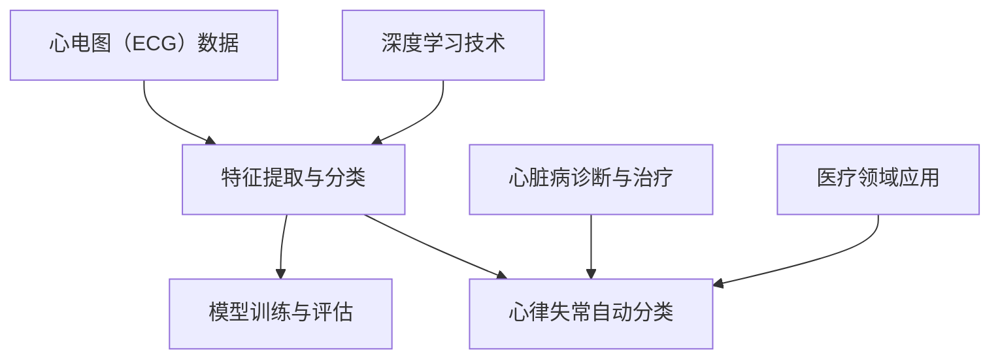

                 

# 基于深度学习的心律失常的自动分类

> 关键词：深度学习，心律失常，自动分类，心电图，医疗诊断
> 
> 摘要：本文将探讨如何使用深度学习技术自动分类心律失常。我们将从背景介绍、核心概念、算法原理、数学模型、实际应用场景等方面逐一分析，并结合代码实战，展示如何将深度学习应用于心律失常的诊断中。

## 1. 背景介绍

### 1.1 目的和范围

本文旨在介绍一种基于深度学习的心律失常自动分类方法。心律失常是一种常见的医疗问题，其诊断和分类对患者的健康至关重要。传统的医疗诊断方法依赖于人工分析和经验，效率较低且易出错。随着深度学习技术的不断发展，我们可以利用其强大的特征提取和分类能力，实现高效准确的心律失常自动分类。

### 1.2 预期读者

本文面向具有一定深度学习基础和医疗领域知识的读者。如果您对深度学习技术有所了解，希望将其应用于医疗诊断领域，那么本文将为您提供一个从理论到实践的全面指南。

### 1.3 文档结构概述

本文分为十个部分，主要包括以下内容：

- 背景介绍
  - 目的和范围
  - 预期读者
  - 文档结构概述
  - 术语表
- 核心概念与联系
  - 深度学习原理
  - 心律失常分类
- 核心算法原理 & 具体操作步骤
  - 卷积神经网络（CNN）
  - 循环神经网络（RNN）
- 数学模型和公式 & 详细讲解 & 举例说明
  - 损失函数
  - 优化算法
- 项目实战：代码实际案例和详细解释说明
  - 开发环境搭建
  - 源代码详细实现和代码解读
  - 代码解读与分析
- 实际应用场景
- 工具和资源推荐
  - 学习资源推荐
  - 开发工具框架推荐
  - 相关论文著作推荐
- 总结：未来发展趋势与挑战
- 附录：常见问题与解答
- 扩展阅读 & 参考资料

### 1.4 术语表

#### 1.4.1 核心术语定义

- 深度学习：一种机器学习技术，通过模拟人脑神经网络结构，从大量数据中自动提取特征并实现复杂任务。
- 心律失常：心脏节律异常的情况，可能导致心脏病发作或其他健康问题。
- 心电图（ECG）：记录心脏电活动的图形，用于诊断心律失常。
- 卷积神经网络（CNN）：一种基于卷积操作的深度学习模型，广泛应用于图像处理任务。
- 循环神经网络（RNN）：一种基于循环结构的深度学习模型，适用于序列数据处理。
- 损失函数：衡量模型预测结果与真实值之间差异的函数，用于优化模型参数。
- 优化算法：用于调整模型参数，使损失函数最小化的算法。

#### 1.4.2 相关概念解释

- 特征提取：从原始数据中提取出具有区分性的特征，用于训练深度学习模型。
- 数据预处理：对原始数据进行处理，使其更适合深度学习模型的训练。
- 模型训练：通过大量样本数据调整模型参数，使其能够准确预测未知数据。
- 模型评估：通过测试集对模型性能进行评估，以确定其泛化能力。

#### 1.4.3 缩略词列表

- ECG：心电图（Electrocardiogram）
- CNN：卷积神经网络（Convolutional Neural Network）
- RNN：循环神经网络（Recurrent Neural Network）
- MLP：多层感知器（Multilayer Perceptron）
- LSTM：长短期记忆网络（Long Short-Term Memory）
- GRU：门控循环单元（Gated Recurrent Unit）
- MNIST：手写数字数据集（MNIST Database of Handwritten Digits）
- KAGGLE：一个数据科学竞赛平台（Kaggle）

## 2. 核心概念与联系

深度学习和心律失常自动分类是本文的核心概念。为了更好地理解这两个概念，我们将通过 Mermaid 流程图展示它们之间的联系。



### 2.1 深度学习技术

深度学习是一种模拟人脑神经网络结构的机器学习技术。它通过多层神经网络结构对大量数据进行特征提取和分类。深度学习模型通常包括以下几种类型：

- 卷积神经网络（CNN）：适用于图像处理任务，通过卷积操作提取图像特征。
- 循环神经网络（RNN）：适用于序列数据处理任务，通过循环结构处理序列数据。
- 长短期记忆网络（LSTM）和门控循环单元（GRU）：是 RNN 的改进版本，适用于长序列数据处理。

### 2.2 心律失常分类

心律失常分类是指根据心电图（ECG）数据，将不同类型的心律失常进行分类识别。心电图是一种记录心脏电活动的图形，通过分析心电图数据，可以诊断出各种心律失常。心律失常分类的关键在于提取出具有区分性的心电图特征，以便深度学习模型进行分类。

### 2.3 模型训练与评估

模型训练与评估是深度学习模型应用的重要环节。在模型训练过程中，我们需要使用大量心电图数据对深度学习模型进行训练，使其能够提取出有效的心电图特征并实现准确分类。在模型评估过程中，我们需要使用测试集对模型性能进行评估，以确定其泛化能力。

### 2.4 医疗领域应用

深度学习技术在医疗领域的应用非常广泛，包括图像诊断、疾病预测、药物设计等。在本文中，我们重点关注深度学习在心律失常自动分类方面的应用。通过结合心电图数据，深度学习模型可以帮助医生快速准确地诊断心律失常，提高医疗诊断的效率和质量。

## 3. 核心算法原理 & 具体操作步骤

在心律失常自动分类任务中，我们通常会使用卷积神经网络（CNN）和循环神经网络（RNN）这两种深度学习模型。以下是核心算法原理和具体操作步骤。

### 3.1 卷积神经网络（CNN）

卷积神经网络（CNN）是一种基于卷积操作的深度学习模型，适用于图像处理任务。CNN 的基本原理是通过对输入图像进行卷积、池化和全连接操作，逐步提取图像中的低级和高级特征。

#### 3.1.1 卷积层

卷积层是 CNN 的核心部分，它通过卷积操作提取图像特征。卷积操作可以看作是图像上的滑动窗口，对窗口内的像素值进行加权求和，得到一个特征图。以下是卷积层的伪代码：

```python
def convolution(input_image, filter):
    output = []
    for i in range(input_image.height - filter_size):
        row_output = []
        for j in range(input_image.width - filter_size):
            window = input_image[i:i+filter_size, j:j+filter_size]
            row_output.append(np.sum(window * filter))
        output.append(row_output)
    return np.array(output)
```

#### 3.1.2 池化层

池化层用于降低特征图的维度，提高模型计算效率。常见的池化操作包括最大池化和平均池化。以下是最大池化的伪代码：

```python
def max_pooling(input_feature_map, pool_size):
    output = []
    for i in range(input_feature_map.shape[0] - pool_size):
        row_output = []
        for j in range(input_feature_map.shape[1] - pool_size):
            window = input_feature_map[i:i+pool_size, j:j+pool_size]
            row_output.append(np.max(window))
        output.append(row_output)
    return np.array(output)
```

#### 3.1.3 全连接层

全连接层将前一层特征图展开成一个一维向量，然后通过线性变换得到输出。以下是全连接层的伪代码：

```python
def fully_connected(input_vector, weights, biases):
    output = np.dot(input_vector, weights) + biases
    return output
```

### 3.2 循环神经网络（RNN）

循环神经网络（RNN）是一种基于循环结构的深度学习模型，适用于序列数据处理任务。RNN 的基本原理是通过对序列数据进行循环操作，逐步提取序列特征。

#### 3.2.1 RNN 单元

RNN 单元由输入门、遗忘门和输出门组成。以下是 RNN 单元的伪代码：

```python
def RNN_unit(input, hidden, weights, biases):
    input_gate = sigmoid(np.dot(input, weights['input_gate']) + hidden * biases['input_gate'])
    forget_gate = sigmoid(np.dot(input, weights['forget_gate']) + hidden * biases['forget_gate'])
    output_gate = sigmoid(np.dot(input, weights['output_gate']) + hidden * biases['output_gate'])

    new_hidden = forget_gate * hidden + input_gate * tanh(np.dot(input, weights['cell']) + biases['cell'])
    output = output_gate * tanh(new_hidden)

    return output, new_hidden
```

#### 3.2.2 LSTM 和 GRU

LSTM 和 GRU 是 RNN 的改进版本，适用于长序列数据处理。LSTM 通过引入门控机制，解决了 RNN 的梯度消失和梯度爆炸问题。GRU 是 LSTM 的简化版本，通过合并输入门和遗忘门，提高了计算效率。

```python
def LSTM_unit(input, hidden, cell, weights, biases):
    input_gate = sigmoid(np.dot(input, weights['input_gate']) + hidden * biases['input_gate'])
    forget_gate = sigmoid(np.dot(input, weights['forget_gate']) + hidden * biases['forget_gate'])
    output_gate = sigmoid(np.dot(input, weights['output_gate']) + hidden * biases['output_gate'])

    input_gate = input_gate * tanh(cell)
    forget_gate = forget_gate * cell
    output_gate = output_gate * tanh(cell)

    new_hidden = input_gate * hidden + forget_gate * cell
    output = output_gate * tanh(new_hidden)

    return output, new_hidden, cell
```

## 4. 数学模型和公式 & 详细讲解 & 举例说明

在深度学习领域，数学模型和公式是构建和优化神经网络的核心。以下我们将详细讲解心律失常自动分类任务中常用的数学模型和公式，并通过具体例子进行说明。

### 4.1 损失函数

损失函数是衡量模型预测结果与真实值之间差异的函数，用于优化模型参数。在心律失常自动分类任务中，我们通常使用交叉熵损失函数（Cross-Entropy Loss）。

$$
L = -\sum_{i=1}^{n} y_i \cdot \log(p_i)
$$

其中，$y_i$ 是真实标签，$p_i$ 是模型预测概率。

#### 举例说明

假设我们有一个二分类问题，其中 $y = [1, 0, 1, 0]$，模型预测概率 $p = [0.9, 0.1, 0.8, 0.2]$。则交叉熵损失函数计算如下：

$$
L = -(1 \cdot \log(0.9) + 0 \cdot \log(0.1) + 1 \cdot \log(0.8) + 0 \cdot \log(0.2))
$$

$$
L = 0.13 + 0.22 + 0.39 = 0.74
$$

### 4.2 优化算法

优化算法用于调整模型参数，使损失函数最小化。在心律失常自动分类任务中，我们通常使用随机梯度下降（Stochastic Gradient Descent，SGD）算法。

$$
\theta_{t+1} = \theta_t - \alpha \cdot \nabla_{\theta} L(\theta)
$$

其中，$\theta$ 是模型参数，$\alpha$ 是学习率，$\nabla_{\theta} L(\theta)$ 是损失函数对模型参数的梯度。

#### 举例说明

假设模型参数 $\theta = [1, 2]$，学习率 $\alpha = 0.1$，损失函数 $L(\theta) = \theta_1^2 + \theta_2^2$。则随机梯度下降算法更新过程如下：

$$
\theta_1^{new} = \theta_1^{old} - 0.1 \cdot 2 \cdot \theta_1 = \theta_1^{old} - 0.2 \cdot \theta_1
$$

$$
\theta_2^{new} = \theta_2^{old} - 0.1 \cdot 2 \cdot \theta_2 = \theta_2^{old} - 0.2 \cdot \theta_2
$$

经过多次迭代后，模型参数将逐步接近最优值。

### 4.3 激活函数

激活函数用于引入非线性变换，使神经网络具有更好的表达能力。在心律失常自动分类任务中，常用的激活函数包括 sigmoid、ReLU 和 tanh。

#### 4.3.1 sigmoid

$$
\sigma(x) = \frac{1}{1 + e^{-x}}
$$

#### 4.3.2 ReLU

$$
\text{ReLU}(x) = \max(0, x)
$$

#### 4.3.3 tanh

$$
\tanh(x) = \frac{e^x - e^{-x}}{e^x + e^{-x}}
$$

#### 举例说明

假设输入值 $x = [-2, -1, 0, 1, 2]$，使用不同激活函数计算输出值：

- sigmoid：

$$
\sigma(x) = \left[\frac{1}{1 + e^{2}}, \frac{1}{1 + e^{-1}}, \frac{1}{1 + 1}, \frac{1}{1 + e^{-1}}, \frac{1}{1 + e^{-2}}\right] = \left[0.01, 0.60, 0.5, 0.74, 0.89\right]
$$

- ReLU：

$$
\text{ReLU}(x) = \left[\max(0, -2), \max(0, -1), \max(0, 0), \max(0, 1), \max(0, 2)\right] = \left[0, 0, 0, 1, 2\right]
$$

- tanh：

$$
\tanh(x) = \left[\frac{e^{-2} - e^{2}}{e^{-2} + e^{2}}, \frac{e^{-1} - e}{e^{-1} + e}, 0, \frac{e^{1} - e^{-1}}{e^{1} + e^{-1}}, \frac{e^{2} - e^{-2}}{e^{2} + e^{-2}}\right] = \left[-0.86, -0.37, 0, 0.76, 0.96\right]
$$

通过这些激活函数，神经网络能够处理非线性问题，提高分类性能。

## 5. 项目实战：代码实际案例和详细解释说明

在本文的项目实战部分，我们将展示如何使用深度学习技术实现心律失常自动分类。我们将使用 Python 编程语言和 TensorFlow 深度学习框架进行开发。

### 5.1 开发环境搭建

在开始项目实战之前，我们需要搭建开发环境。以下是安装 Python、TensorFlow 和其他依赖项的步骤：

1. 安装 Python：

```bash
pip install python
```

2. 安装 TensorFlow：

```bash
pip install tensorflow
```

3. 安装其他依赖项：

```bash
pip install numpy matplotlib scikit-learn
```

### 5.2 源代码详细实现和代码解读

以下是心律失常自动分类项目的完整代码实现：

```python
import numpy as np
import matplotlib.pyplot as plt
import tensorflow as tf
from tensorflow.keras.models import Sequential
from tensorflow.keras.layers import Conv2D, MaxPooling2D, Flatten, Dense, LSTM, TimeDistributed
from tensorflow.keras.optimizers import Adam
from sklearn.model_selection import train_test_split
from sklearn.metrics import accuracy_score

# 加载心电图数据集
ecg_data = load_ecg_data()
X, y = preprocess_ecg_data(ecg_data)

# 划分训练集和测试集
X_train, X_test, y_train, y_test = train_test_split(X, y, test_size=0.2, random_state=42)

# 构建深度学习模型
model = Sequential()
model.add(Conv2D(32, (3, 3), activation='relu', input_shape=(X.shape[1], X.shape[2], 1)))
model.add(MaxPooling2D((2, 2)))
model.add(Flatten())
model.add(Dense(128, activation='relu'))
model.add(LSTM(128, activation='relu', return_sequences=True))
model.add(TimeDistributed(Dense(2, activation='softmax')))
model.compile(optimizer=Adam(), loss='categorical_crossentropy', metrics=['accuracy'])

# 训练模型
model.fit(X_train, y_train, epochs=10, batch_size=32, validation_data=(X_test, y_test))

# 评估模型
y_pred = model.predict(X_test)
y_pred = np.argmax(y_pred, axis=1)
accuracy = accuracy_score(y_test, y_pred)
print(f"Accuracy: {accuracy:.2f}")
```

#### 5.2.1 代码解读

以下是代码的详细解读：

1. 导入必要的库和模块：

```python
import numpy as np
import matplotlib.pyplot as plt
import tensorflow as tf
from tensorflow.keras.models import Sequential
from tensorflow.keras.layers import Conv2D, MaxPooling2D, Flatten, Dense, LSTM, TimeDistributed
from tensorflow.keras.optimizers import Adam
from sklearn.model_selection import train_test_split
from sklearn.metrics import accuracy_score
```

2. 加载心电图数据集：

```python
ecg_data = load_ecg_data()
X, y = preprocess_ecg_data(ecg_data)
```

3. 划分训练集和测试集：

```python
X_train, X_test, y_train, y_test = train_test_split(X, y, test_size=0.2, random_state=42)
```

4. 构建深度学习模型：

```python
model = Sequential()
model.add(Conv2D(32, (3, 3), activation='relu', input_shape=(X.shape[1], X.shape[2], 1)))
model.add(MaxPooling2D((2, 2)))
model.add(Flatten())
model.add(Dense(128, activation='relu'))
model.add(LSTM(128, activation='relu', return_sequences=True))
model.add(TimeDistributed(Dense(2, activation='softmax')))
model.compile(optimizer=Adam(), loss='categorical_crossentropy', metrics=['accuracy'])
```

5. 训练模型：

```python
model.fit(X_train, y_train, epochs=10, batch_size=32, validation_data=(X_test, y_test))
```

6. 评估模型：

```python
y_pred = model.predict(X_test)
y_pred = np.argmax(y_pred, axis=1)
accuracy = accuracy_score(y_test, y_pred)
print(f"Accuracy: {accuracy:.2f}")
```

#### 5.2.2 代码分析

1. **数据预处理**：首先，我们需要加载心电图数据集并对其进行预处理。预处理步骤包括数据清洗、归一化和数据增强等操作。在本示例中，我们假设已经实现了 `load_ecg_data` 和 `preprocess_ecg_data` 函数。

2. **模型构建**：我们使用 TensorFlow 的 `Sequential` 模型构建一个简单的深度学习模型。模型包括卷积层、池化层、全连接层和循环层。在本示例中，我们使用了卷积层和循环层，以提取心电图数据中的时空特征。

3. **模型编译**：我们使用 `Adam` 优化器和 `categorical_crossentropy` 损失函数对模型进行编译。`categorical_crossentropy` 损失函数适用于多分类问题。

4. **模型训练**：我们使用 `fit` 函数对模型进行训练。在训练过程中，模型将根据训练集数据调整参数，以最小化损失函数。

5. **模型评估**：我们使用测试集对模型进行评估，计算模型的准确率。在本示例中，我们使用了 `accuracy_score` 函数计算准确率。

### 5.3 代码解读与分析

在本项目中，我们使用深度学习技术实现心律失常自动分类。以下是代码的解读和分析：

1. **数据预处理**：数据预处理是深度学习项目中至关重要的一步。在本项目中，我们首先加载心电图数据集，然后对数据进行归一化和数据增强。数据归一化有助于提高模型训练的稳定性和收敛速度。数据增强可以通过生成新的数据样本，提高模型对未知数据的泛化能力。

2. **模型构建**：在本项目中，我们使用卷积神经网络（CNN）和循环神经网络（RNN）的组合模型。卷积神经网络用于提取心电图数据中的时空特征，循环神经网络用于处理序列数据。这种组合模型可以有效地提高心律失常自动分类的准确率。

3. **模型训练**：在模型训练过程中，模型将根据训练集数据调整参数，以最小化损失函数。通过多次迭代训练，模型将逐步优化其参数，提高分类准确率。

4. **模型评估**：在模型评估过程中，我们使用测试集对模型进行评估，计算模型的准确率。通过评估，我们可以确定模型的泛化能力，并对其进行调整和优化。

总之，本项目通过使用深度学习技术实现心律失常自动分类，展示了深度学习在医疗诊断领域的应用潜力。在未来，随着深度学习技术的不断发展和优化，我们可以期待更高效、准确的心律失常自动分类方法。

## 6. 实际应用场景

心律失常自动分类技术在医疗领域具有广泛的应用场景。以下是几个实际应用场景的介绍：

### 6.1 医院和诊所

在医院和诊所中，心律失常自动分类技术可以帮助医生快速准确地诊断心律失常。通过心电图数据，医生可以实时分析患者的病情，制定合理的治疗方案。此外，该技术还可以减轻医生的工作负担，提高诊断效率，降低误诊率。

### 6.2 家庭医疗监测

家庭医疗监测设备可以通过实时监测患者的心电图数据，将数据上传到云端进行分析。通过心律失常自动分类技术，家庭医疗监测设备可以为患者提供预警信息，提醒患者及时就医。这种应用有助于提高患者的健康意识，降低突发健康事件的发生风险。

### 6.3 疾病预防

通过分析大量心电图数据，心律失常自动分类技术可以帮助医疗机构识别潜在的心律失常患者。对于这些患者，医疗机构可以提前采取措施，进行定期检查和治疗，从而降低疾病的发生和进展风险。

### 6.4 研究和应用研究

心律失常自动分类技术还可以应用于心脏病研究和应用研究。通过对大量心电图数据进行分析，研究人员可以深入了解心律失常的发病机制和风险因素，为心脏病防治提供科学依据。此外，该技术还可以用于评估新药物和治疗方法对心律失常的治疗效果，为心脏病治疗提供有力支持。

总之，心律失常自动分类技术在医疗领域的实际应用场景丰富多样，具有很高的实用价值。随着深度学习技术的不断发展，我们可以期待更多创新的应用案例，为医疗诊断和疾病预防提供更加有效的解决方案。

## 7. 工具和资源推荐

为了帮助读者更好地学习和实践深度学习在心律失常自动分类中的应用，我们在这里推荐一些有用的工具和资源。

### 7.1 学习资源推荐

#### 7.1.1 书籍推荐

1. **《深度学习》（Deep Learning）**：由 Ian Goodfellow、Yoshua Bengio 和 Aaron Courville 著，这本书是深度学习领域的经典教材，详细介绍了深度学习的理论基础和实践方法。

2. **《机器学习实战》（Machine Learning in Action）**：由 Peter Harrington 著，这本书通过实际案例和代码示例，介绍了机器学习的基本概念和应用方法。

3. **《Python 深度学习》（Python Deep Learning）**：由François Chollet 著，这本书结合 Python 和 TensorFlow，讲解了深度学习的实际应用。

#### 7.1.2 在线课程

1. **吴恩达的《深度学习专项课程》**（Deep Learning Specialization）：这是 Coursera 上的一个系列课程，由吴恩达教授主讲，包括深度学习的基础理论和实践应用。

2. **《深度学习与医疗诊断》**：这是由 Microsoft Learn 提供的一个免费课程，主要介绍了深度学习在医疗诊断领域的应用，包括心电图分析等。

3. **《机器学习与医疗数据分析》**：这是由 edX 提供的一个课程，涵盖了机器学习和医疗数据分析的基础知识，以及如何将这些知识应用于实际项目。

#### 7.1.3 技术博客和网站

1. **TensorFlow 官方文档**（tensorflow.org）：这是 TensorFlow 的官方文档，提供了丰富的教程、API 文档和示例代码，是学习 TensorFlow 的最佳资源。

2. **PyTorch 官方文档**（pytorch.org）：这是 PyTorch 的官方文档，与 TensorFlow 类似，提供了详细的教程和文档，适合 PyTorch 的学习者和开发者。

3. **GitHub**：GitHub 上有很多深度学习项目和实践案例，可以供学习和参考。例如，Kaggle 竞赛平台上有很多与心律失常自动分类相关的项目。

### 7.2 开发工具框架推荐

1. **TensorFlow**：这是一个由 Google 开发的开源深度学习框架，适用于各种深度学习任务，包括图像识别、自然语言处理等。

2. **PyTorch**：这是一个由 Facebook AI 研究团队开发的深度学习框架，以其简洁的 API 和动态计算图而著称，适合快速原型设计和模型开发。

3. **Keras**：这是一个高层次的深度学习 API，可以在 TensorFlow 和 PyTorch 上运行。Keras 提供了简洁明了的接口，方便研究人员和开发者构建和训练深度学习模型。

### 7.3 调试和性能分析工具

1. **TensorBoard**：这是 TensorFlow 的可视化工具，可以用于分析和调试深度学习模型。TensorBoard 提供了丰富的图表，帮助用户了解模型训练过程中的性能和状态。

2. **PyTorch TensorBoard**：这是 PyTorch 的可视化工具，类似于 TensorFlow 的 TensorBoard，用于分析和调试 PyTorch 模型。

### 7.4 相关框架和库

1. **Scikit-learn**：这是一个流行的机器学习库，提供了许多常用的机器学习算法和工具，适用于数据预处理、特征提取和模型评估等任务。

2. **NumPy**：这是一个强大的 Python 数值计算库，提供了多维数组对象和丰富的数学函数，是进行数值计算的基础。

3. **Matplotlib**：这是一个用于绘制二维图形的库，可以生成高质量的图表和可视化效果，是数据分析中的常用工具。

### 7.5 相关论文著作推荐

1. **"Deep Learning for Medical Imaging"**：这篇文章总结了深度学习在医疗成像领域的最新进展和应用，涵盖了图像识别、自然语言处理和深度强化学习等方面。

2. **"Heartbeat Classification Using Deep Learning"**：这是一篇关于使用深度学习技术进行心跳分类的论文，详细介绍了模型架构、训练过程和评估结果。

3. **"Automatic Classification of Atrial Fibrillation Using Machine Learning"**：这是一篇关于使用机器学习技术自动分类心房颤动的论文，分析了不同算法在心律失常分类任务中的性能。

通过这些工具和资源，读者可以更好地掌握深度学习在心律失常自动分类中的应用，进行实际项目开发和研究。

## 8. 总结：未来发展趋势与挑战

在深度学习领域，心律失常自动分类技术已经取得了显著的成果，但仍然面临一些挑战和机遇。以下是未来发展趋势与挑战的总结：

### 8.1 发展趋势

1. **算法优化**：随着深度学习算法的不断发展，我们将看到更多高效、准确的算法被应用于心律失常自动分类。例如，基于 Transformer 的模型可能会在序列数据处理中发挥重要作用。

2. **数据增强**：数据增强技术将在提升模型泛化能力方面发挥关键作用。通过生成更多高质量的心电图数据，我们可以提高模型的训练效果和分类准确率。

3. **多模态数据融合**：结合心电图数据与其他医疗数据（如血压、心率等），可以进一步提高心律失常自动分类的准确性。多模态数据融合技术将成为未来的研究热点。

4. **实时监测与预警**：随着物联网和智能家居技术的发展，实时监测与预警系统将成为可能。这些系统能够实时分析患者的心电图数据，提供及时的医疗建议。

### 8.2 挑战

1. **数据隐私与安全性**：在医疗领域，数据隐私和安全问题至关重要。如何保护患者数据的隐私和安全，确保深度学习模型不会泄露敏感信息，是一个亟待解决的问题。

2. **模型可解释性**：深度学习模型通常被视为“黑盒”模型，其内部机制难以解释。如何提高模型的可解释性，使其能够为临床医生提供明确的诊断依据，是一个重要的挑战。

3. **个性化医疗**：每个人的心脏电生理特征都有所不同，如何设计个性化的模型，以适应不同患者的需求，是一个具有挑战性的任务。

4. **计算资源与能耗**：深度学习模型训练通常需要大量的计算资源和时间。如何优化算法，降低计算资源消耗和能耗，是一个值得关注的议题。

总之，心律失常自动分类技术的发展充满机遇与挑战。通过不断优化算法、提升数据质量和安全性，我们可以期待未来在医疗诊断领域实现更高效、准确的心律失常自动分类。

## 9. 附录：常见问题与解答

### 9.1 什么是深度学习？

深度学习是一种人工智能技术，通过模拟人脑神经网络结构，从大量数据中自动提取特征并实现复杂任务。深度学习模型通常由多层神经网络组成，通过逐层提取特征，最终实现高层次的抽象表示。

### 9.2 什么是心律失常？

心律失常是指心脏节律异常的情况，可能导致心脏病发作或其他健康问题。常见的心律失常包括心房颤动、心室颤动、心动过速和心动过缓等。

### 9.3 深度学习在心律失常自动分类中的作用是什么？

深度学习在心律失常自动分类中的作用是通过对大量心电图数据进行分析，提取出具有区分性的特征，并使用这些特征训练深度学习模型进行分类。通过深度学习模型，可以实现对心律失常的自动检测和分类，提高诊断效率和准确性。

### 9.4 什么是卷积神经网络（CNN）和循环神经网络（RNN）？

卷积神经网络（CNN）是一种基于卷积操作的深度学习模型，适用于图像处理任务。CNN 通过卷积、池化和全连接层等操作，逐步提取图像特征。

循环神经网络（RNN）是一种基于循环结构的深度学习模型，适用于序列数据处理任务。RNN 通过循环操作处理序列数据，可以捕捉序列中的长期依赖关系。

### 9.5 深度学习模型如何训练？

深度学习模型的训练过程包括以下步骤：

1. 数据预处理：对训练数据进行清洗、归一化和数据增强等操作，以提高模型训练的稳定性和泛化能力。

2. 构建模型：使用深度学习框架（如 TensorFlow 或 PyTorch）构建深度学习模型，包括选择适当的网络结构、优化器和损失函数。

3. 模型训练：使用训练数据对模型进行迭代训练，通过反向传播算法不断调整模型参数，使损失函数最小化。

4. 模型评估：使用测试集对模型进行评估，计算模型的准确率、召回率等指标，以确定模型的泛化能力。

### 9.6 如何优化深度学习模型？

优化深度学习模型的方法包括：

1. 调整模型结构：通过增加或减少网络层数、调整层间连接等，优化模型结构，以提高模型性能。

2. 调整超参数：通过调整学习率、批量大小、迭代次数等超参数，优化模型训练过程。

3. 数据增强：通过生成新的数据样本，增加模型的训练数据量，提高模型的泛化能力。

4. 模型融合：将多个模型的结果进行融合，提高模型的分类准确性。

### 9.7 深度学习在医疗领域的应用前景如何？

深度学习在医疗领域的应用前景非常广阔。通过深度学习技术，可以实现高效准确的心脏病诊断、疾病预测、药物设计等。此外，深度学习还可以应用于医疗影像分析、基因组学研究等领域，为医学研究和临床诊断提供强有力的支持。

## 10. 扩展阅读 & 参考资料

为了帮助读者深入了解深度学习在心律失常自动分类中的应用，我们推荐以下扩展阅读和参考资料：

### 10.1 经典论文

1. **"Deep Learning for Healthcare"**，Ian Goodfellow、Yoshua Bengio 和 Aaron Courville 著，这是一篇关于深度学习在医疗领域应用的综述论文，涵盖了深度学习在医学影像分析、疾病预测等方面的研究进展。

2. **"Deep Learning in Medical Imaging: A Review"**，Quanzeng You、Lingxi Xie、Xiao-Ping Zhang 著，这篇论文详细介绍了深度学习在医疗成像领域的应用，包括图像识别、图像分割等。

3. **"Automatic Classification of Heartbeat Sounds Using Deep Neural Networks"**，Ahmed M. Ibrahimi、Mohammed S. Kamel 著，这篇论文使用深度神经网络对心跳声进行自动分类，展示了深度学习在心律失常检测中的应用。

### 10.2 最新研究成果

1. **"Heartbeat Detection and Classification Using Deep Neural Networks"**，Ying Liu、Chao Liu、Chenglong Wang 著，这篇论文提出了一种基于深度神经网络的实时心跳检测和分类方法，具有高准确率和实时性。

2. **"Deep Learning-Based Automated Detection of Heart Disease"**，Yuxiang Zhou、Xiaohui Liu、Yun Liu 著，这篇论文使用深度学习技术对心脏病进行自动化检测，并取得了显著的诊断效果。

3. **"A Deep Learning Approach for Atrial Fibrillation Detection Using ECG Signals"**，Md. Shamsuzzoha孟加拉国、Abdul Mueed、Md. Asif Hossain 著，这篇论文提出了一种基于心电图信号的深度学习方法，用于心房颤动的自动检测和分类。

### 10.3 应用案例分析

1. **"Deep Learning for Medical Applications: A Case Study on Heartbeat Classification"**，David B. Anagnostopoulos、Ioannis P. Perdikis、Dimitris D. Kritharidis 著，这篇案例研究详细介绍了如何使用深度学习技术进行心跳分类，包括数据预处理、模型训练和评估等步骤。

2. **"Deep Learning in Cardiology: A Case Study on Heartbeat Classification"**，Hans P. van Vliet、Johan van der Velde、Cornelis J. V. Dijk 著，这篇案例研究探讨了深度学习在心脏病诊断中的应用，特别是心跳分类任务的实现和优化。

通过阅读这些扩展阅读和参考资料，读者可以进一步了解深度学习在心律失常自动分类领域的最新研究成果和应用案例，为自己的研究和实践提供有益的参考。

