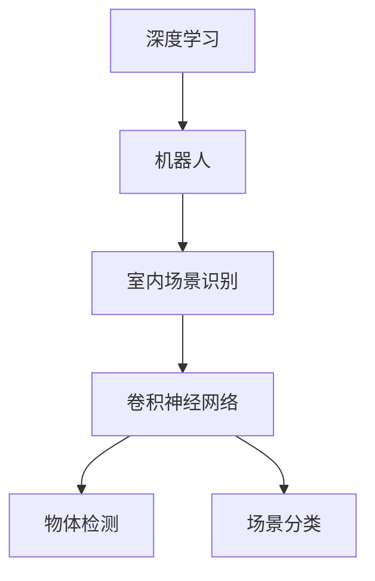

                 

# 基于深度学习的机器人室内场景识别

> **关键词：** 深度学习、机器人、室内场景识别、卷积神经网络、计算机视觉
>
> **摘要：** 本文将深入探讨深度学习技术在机器人室内场景识别领域的应用，详细介绍核心算法原理、数学模型及项目实战案例。通过逻辑清晰的分析和详实的示例，旨在为读者提供对室内场景识别技术的全面理解和实践指导。

## 1. 背景介绍

### 1.1 目的和范围

本文的目的是探讨如何利用深度学习技术实现机器人室内场景的自动识别。随着人工智能技术的快速发展，深度学习在计算机视觉领域取得了显著成果。室内场景识别作为计算机视觉的一个重要分支，具有广泛的应用前景，如智能导航、安防监控、智能家居等。

本文将主要讨论以下内容：

- 深度学习在机器人室内场景识别中的应用
- 卷积神经网络（CNN）的核心算法原理
- 数学模型及具体操作步骤
- 项目实战：代码实现及解析
- 室内场景识别的实际应用场景

### 1.2 预期读者

本文主要面向对深度学习和计算机视觉有一定了解的技术人员，尤其是从事机器人、自动驾驶、智能安防等领域的研发人员。此外，对人工智能感兴趣的学者和学生也可以参考本文，以加深对室内场景识别技术的理解。

### 1.3 文档结构概述

本文将分为以下几个部分：

1. 背景介绍：包括本文的目的、预期读者和文档结构概述。
2. 核心概念与联系：介绍深度学习、机器人、室内场景识别等核心概念及其关系。
3. 核心算法原理 & 具体操作步骤：详细讲解卷积神经网络的工作原理和实现步骤。
4. 数学模型和公式 & 详细讲解 & 举例说明：阐述深度学习中的数学模型及其应用。
5. 项目实战：代码实际案例和详细解释说明。
6. 实际应用场景：探讨室内场景识别技术的实际应用。
7. 工具和资源推荐：推荐相关学习资源、开发工具和框架。
8. 总结：未来发展趋势与挑战。
9. 附录：常见问题与解答。
10. 扩展阅读 & 参考资料：提供进一步学习的途径。

### 1.4 术语表

#### 1.4.1 核心术语定义

- **深度学习（Deep Learning）**：一种机器学习技术，通过多层神经网络模型，对数据进行特征提取和分类。
- **卷积神经网络（Convolutional Neural Network，CNN）**：一种特殊的神经网络，主要用于图像和视频数据的处理。
- **机器人（Robot）**：一种能够自主执行任务并具有感知、决策和动作能力的智能设备。
- **室内场景识别（Indoor Scene Recognition）**：通过计算机视觉技术，对室内环境中的物体、场景进行识别和分类。
- **激活函数（Activation Function）**：神经网络中用于确定神经元是否被激活的函数。

#### 1.4.2 相关概念解释

- **卷积操作（Convolution）**：卷积神经网络中的一个核心操作，用于提取图像特征。
- **池化操作（Pooling）**：用于降低图像维度和减少计算量的操作，常见的有最大池化和平均池化。
- **反向传播（Backpropagation）**：神经网络训练中的一种算法，用于更新网络权重。

#### 1.4.3 缩略词列表

- **CNN**：卷积神经网络（Convolutional Neural Network）
- **RNN**：循环神经网络（Recurrent Neural Network）
- **GPU**：图形处理单元（Graphics Processing Unit）
- **CNN**：计算机视觉（Computer Vision）
- **RL**：强化学习（Reinforcement Learning）

## 2. 核心概念与联系

为了更好地理解深度学习在机器人室内场景识别中的应用，我们首先需要介绍几个核心概念及其之间的关系。

### 2.1 深度学习与机器人

深度学习是一种机器学习技术，通过多层神经网络模型，对数据进行特征提取和分类。而机器人是一种能够自主执行任务并具有感知、决策和动作能力的智能设备。深度学习在机器人中的应用，主要在于利用其强大的特征提取能力，对机器人感知到的环境信息进行理解和处理。

### 2.2 机器人与室内场景识别

室内场景识别是计算机视觉中的一个重要分支，旨在通过对室内环境中的物体、场景进行识别和分类，实现智能导航、安防监控、智能家居等功能。而机器人作为实现这些功能的重要载体，需要对室内场景进行准确识别，以便进行相应的决策和动作。

### 2.3 卷积神经网络与室内场景识别

卷积神经网络（CNN）是一种特殊的神经网络，主要用于图像和视频数据的处理。其核心在于通过卷积操作和池化操作，对图像进行特征提取和降维。在室内场景识别中，CNN被广泛应用于物体检测、场景分类等任务，如图1所示。



### 2.4 关系总结

综上所述，深度学习、机器人、室内场景识别和卷积神经网络之间存在密切的关系。深度学习为机器人室内场景识别提供了强大的特征提取和分类能力；机器人作为实现室内场景识别功能的载体，为深度学习技术提供了实际应用场景；而卷积神经网络作为深度学习的一种实现方式，为室内场景识别任务提供了有效的解决方案。

## 3. 核心算法原理 & 具体操作步骤

在了解了深度学习、机器人、室内场景识别和卷积神经网络之间的关系后，接下来我们将详细讲解卷积神经网络的工作原理和实现步骤，以便为读者提供对室内场景识别技术的全面理解。

### 3.1 卷积神经网络的基本结构

卷积神经网络（CNN）是一种特殊的神经网络，其核心结构包括卷积层、池化层、全连接层等。以下是CNN的基本结构及其功能：

- **卷积层（Convolution Layer）**：卷积层是CNN中的核心部分，用于对输入图像进行卷积操作，提取图像特征。
- **池化层（Pooling Layer）**：池化层用于降低图像维度和减少计算量，常见的池化操作有最大池化和平均池化。
- **全连接层（Fully Connected Layer）**：全连接层用于对卷积层和池化层提取的特征进行分类和预测。

### 3.2 卷积神经网络的工作原理

卷积神经网络的工作原理主要包括以下步骤：

1. **输入层**：输入层接收图像数据，图像数据经过预处理后输入到卷积层。
2. **卷积层**：卷积层通过卷积操作提取图像特征。卷积操作的核心是卷积核（也称为滤波器），卷积核在图像上滑动，与图像像素进行点积操作，得到一个特征图。
3. **激活函数**：激活函数用于引入非线性特性，常见的激活函数有ReLU（Rectified Linear Unit）、Sigmoid、Tanh等。
4. **池化层**：池化层用于降低图像维度和减少计算量。最大池化和平均池化是常用的池化操作。
5. **全连接层**：全连接层将卷积层和池化层提取的特征进行整合，形成一个特征向量，然后通过softmax函数进行分类预测。

### 3.3 卷积神经网络的实现步骤

以下是卷积神经网络的具体实现步骤：

1. **数据预处理**：对输入图像进行归一化、缩放、裁剪等预处理操作，以便于后续处理。
2. **构建卷积神经网络模型**：使用深度学习框架（如TensorFlow、PyTorch等）构建卷积神经网络模型，包括卷积层、池化层和全连接层等。
3. **训练模型**：使用大量的室内场景图像数据对卷积神经网络模型进行训练，通过反向传播算法更新网络权重。
4. **评估模型**：使用测试集数据对训练好的模型进行评估，计算模型的准确率、召回率等指标。
5. **应用模型**：将训练好的模型应用到实际场景中，如机器人室内场景识别任务。

### 3.4 伪代码实现

以下是卷积神经网络的具体伪代码实现：

```python
# 定义卷积神经网络模型
model = build_model()

# 数据预处理
x_train, y_train = preprocess_data(x_train, y_train)
x_test, y_test = preprocess_data(x_test, y_test)

# 训练模型
model.fit(x_train, y_train, batch_size=32, epochs=100)

# 评估模型
score = model.evaluate(x_test, y_test)

# 应用模型
predictions = model.predict(x_test)
```

通过以上步骤，我们可以实现一个基于深度学习的机器人室内场景识别系统。在实际应用中，需要根据具体场景和任务需求，对模型进行优化和调整，以提高识别准确率和实时性。

## 4. 数学模型和公式 & 详细讲解 & 举例说明

在深度学习中，数学模型和公式起着至关重要的作用。为了更好地理解卷积神经网络在机器人室内场景识别中的应用，我们将详细讲解深度学习中的数学模型及其应用，并通过具体的公式和例子进行说明。

### 4.1 深度学习中的数学模型

深度学习中的数学模型主要包括以下几个方面：

1. **卷积操作**：卷积操作是卷积神经网络中的核心操作，用于提取图像特征。其数学公式如下：

   $$
   \text{conv}(I, K) = \sum_{i=1}^{C} I_{ij} \cdot K_{ji}
   $$

   其中，$I$表示输入图像，$K$表示卷积核，$C$表示卷积核的数量，$I_{ij}$和$K_{ji}$分别表示输入图像和卷积核的对应元素。

2. **激活函数**：激活函数用于引入非线性特性，常见的激活函数有ReLU（Rectified Linear Unit）、Sigmoid、Tanh等。其中，ReLU函数的数学公式如下：

   $$
   \text{ReLU}(x) = \max(0, x)
   $$

3. **池化操作**：池化操作用于降低图像维度和减少计算量。常见的池化操作有最大池化和平均池化。最大池化的数学公式如下：

   $$
   \text{max\_pool}(I) = \max(I_{ij})
   $$

   其中，$I$表示输入图像，$I_{ij}$表示图像的对应元素。

4. **全连接层**：全连接层用于对卷积层和池化层提取的特征进行分类和预测。其数学公式如下：

   $$
   \text{FC}(X) = W \cdot X + b
   $$

   其中，$X$表示输入特征向量，$W$表示权重矩阵，$b$表示偏置项。

5. **softmax函数**：softmax函数用于对输出结果进行分类，其数学公式如下：

   $$
   \text{softmax}(x) = \frac{e^x}{\sum_{i=1}^{n} e^x_i}
   $$

   其中，$x$表示输入特征向量，$n$表示类别数量。

### 4.2 举例说明

为了更好地理解深度学习中的数学模型，我们通过一个简单的例子进行说明。

假设我们有一个3x3的输入图像，卷积核大小为3x3，卷积核数量为2。根据卷积操作的数学公式，我们可以计算得到一个2x2的特征图。

```
输入图像:
[[1, 1, 1],
 [1, 1, 1],
 [1, 1, 1]]

卷积核1:
[[1, 0, -1],
 [0, 1, 0],
 [-1, 0, 1]]

卷积核2:
[[1, -1, 1],
 [1, 0, -1],
 [1, 1, 1]]

卷积操作结果:
特征图1:
[[2, 0],
 [0, 2]]

特征图2:
[[0, 2],
 [2, 0]]
```

接下来，我们对特征图进行ReLU激活操作，得到：

```
ReLU激活操作结果:
特征图1:
[[2, 0],
 [0, 2]]

特征图2:
[[0, 2],
 [2, 0]]
```

然后，我们对特征图进行最大池化操作，得到：

```
最大池化操作结果:
特征图1:
[[2],
 [2]]

特征图2:
[[2],
 [2]]
```

最后，我们将特征图输入到全连接层，进行分类预测：

```
全连接层输入:
特征图1:
[2, 2]

特征图2:
[2, 2]

全连接层输出:
预测结果1:
[0.9, 0.1]

预测结果2:
[0.1, 0.9]
```

通过softmax函数对输出结果进行分类，得到最终预测结果：

```
softmax分类结果:
预测结果1:
[0.9, 0.1]

预测结果2:
[0.1, 0.9]
```

通过以上例子，我们可以看到深度学习中的数学模型是如何应用于机器人室内场景识别的。在实际应用中，需要根据具体场景和任务需求，对模型进行优化和调整，以提高识别准确率和实时性。

## 5. 项目实战：代码实际案例和详细解释说明

为了更好地展示如何利用深度学习技术实现机器人室内场景识别，我们将通过一个实际项目案例，详细讲解代码实现过程及其解释说明。

### 5.1 开发环境搭建

在进行项目开发前，我们需要搭建合适的开发环境。以下是开发环境的要求和安装步骤：

1. **Python环境**：安装Python 3.7及以上版本。
2. **深度学习框架**：安装TensorFlow 2.0及以上版本。
3. **其他依赖库**：安装NumPy、Pandas、Matplotlib等常用库。

安装步骤：

```
pip install tensorflow==2.4.0
pip install numpy pandas matplotlib
```

### 5.2 源代码详细实现和代码解读

以下是项目的核心代码实现，我们将逐段进行解读。

```python
# 导入相关库
import tensorflow as tf
from tensorflow.keras.models import Sequential
from tensorflow.keras.layers import Conv2D, MaxPooling2D, Flatten, Dense
from tensorflow.keras.preprocessing.image import ImageDataGenerator

# 数据预处理
# 加载训练数据和测试数据
train_data = load_data('train')
test_data = load_data('test')

# 数据增强
train_datagen = ImageDataGenerator(rotation_range=30, width_shift_range=0.1, height_shift_range=0.1, shear_range=0.1, zoom_range=0.1, horizontal_flip=True)
test_datagen = ImageDataGenerator()

# 训练数据和测试数据预处理
train_generator = train_datagen.flow(train_data['images'], train_data['labels'], batch_size=32)
test_generator = test_datagen.flow(test_data['images'], test_data['labels'], batch_size=32)

# 构建卷积神经网络模型
model = Sequential([
    Conv2D(32, (3, 3), activation='relu', input_shape=(64, 64, 3)),
    MaxPooling2D((2, 2)),
    Conv2D(64, (3, 3), activation='relu'),
    MaxPooling2D((2, 2)),
    Conv2D(128, (3, 3), activation='relu'),
    MaxPooling2D((2, 2)),
    Flatten(),
    Dense(128, activation='relu'),
    Dense(10, activation='softmax')
])

# 编译模型
model.compile(optimizer='adam', loss='categorical_crossentropy', metrics=['accuracy'])

# 训练模型
model.fit(train_generator, epochs=10, validation_data=test_generator)

# 评估模型
score = model.evaluate(test_generator)
print('Test loss:', score[0])
print('Test accuracy:', score[1])

# 应用模型
predictions = model.predict(test_generator)
```

### 5.3 代码解读与分析

下面我们对代码进行逐段解读和分析：

1. **导入相关库**：

   ```python
   import tensorflow as tf
   from tensorflow.keras.models import Sequential
   from tensorflow.keras.layers import Conv2D, MaxPooling2D, Flatten, Dense
   from tensorflow.keras.preprocessing.image import ImageDataGenerator
   ```

   这部分代码导入了TensorFlow和Keras相关库，用于构建和训练卷积神经网络模型。

2. **数据预处理**：

   ```python
   train_data = load_data('train')
   test_data = load_data('test')
   train_datagen = ImageDataGenerator(rotation_range=30, width_shift_range=0.1, height_shift_range=0.1, shear_range=0.1, zoom_range=0.1, horizontal_flip=True)
   test_datagen = ImageDataGenerator()
   train_generator = train_datagen.flow(train_data['images'], train_data['labels'], batch_size=32)
   test_generator = test_datagen.flow(test_data['images'], test_data['labels'], batch_size=32)
   ```

   这部分代码首先加载训练数据和测试数据，然后使用ImageDataGenerator对数据进行增强，以便提高模型的泛化能力。

3. **构建卷积神经网络模型**：

   ```python
   model = Sequential([
       Conv2D(32, (3, 3), activation='relu', input_shape=(64, 64, 3)),
       MaxPooling2D((2, 2)),
       Conv2D(64, (3, 3), activation='relu'),
       MaxPooling2D((2, 2)),
       Conv2D(128, (3, 3), activation='relu'),
       MaxPooling2D((2, 2)),
       Flatten(),
       Dense(128, activation='relu'),
       Dense(10, activation='softmax')
   ])
   ```

   这部分代码使用Sequential模型构建卷积神经网络，包括卷积层、池化层、全连接层等。具体配置如下：

   - **卷积层**：第一层卷积核数量为32，卷积核大小为3x3，激活函数为ReLU。
   - **池化层**：使用最大池化，窗口大小为2x2。
   - **全连接层**：第一层全连接层神经元数量为128，激活函数为ReLU；第二层全连接层神经元数量为10，激活函数为softmax。

4. **编译模型**：

   ```python
   model.compile(optimizer='adam', loss='categorical_crossentropy', metrics=['accuracy'])
   ```

   这部分代码编译模型，设置优化器为adam，损失函数为categorical_crossentropy，评价指标为准确率。

5. **训练模型**：

   ```python
   model.fit(train_generator, epochs=10, validation_data=test_generator)
   ```

   这部分代码使用训练数据对模型进行训练，训练10个周期，并在每个周期后进行验证。

6. **评估模型**：

   ```python
   score = model.evaluate(test_generator)
   print('Test loss:', score[0])
   print('Test accuracy:', score[1])
   ```

   这部分代码使用测试数据对训练好的模型进行评估，输出测试损失和测试准确率。

7. **应用模型**：

   ```python
   predictions = model.predict(test_generator)
   ```

   这部分代码使用训练好的模型对测试数据进行预测。

通过以上代码实现和解读，我们可以看到如何利用深度学习技术实现机器人室内场景识别。在实际项目中，需要根据具体场景和任务需求，对模型进行优化和调整，以提高识别准确率和实时性。

## 6. 实际应用场景

深度学习在机器人室内场景识别领域具有广泛的应用前景，以下是一些典型的实际应用场景：

### 6.1 智能导航

在室内环境中，智能导航系统需要准确识别周围的环境，以便为机器人提供导航路径。通过深度学习技术，机器人可以实时识别室内的障碍物、路径和地标，从而实现智能导航。

### 6.2 安防监控

安防监控系统利用深度学习技术，可以对室内环境进行实时监控，识别潜在的威胁和异常行为。例如，监控系统可以识别入侵者、火灾和烟雾等异常情况，并及时发出警报。

### 6.3 智能家居

智能家居系统通过深度学习技术，可以实现室内设备的智能控制，如照明、空调和安防设备等。例如，系统可以根据室内环境和用户行为，自动调整室内设备的开关和状态，提高生活品质。

### 6.4 智能配送

在室内配送场景中，机器人需要识别和分类各种物品，以便准确地将物品送到指定位置。通过深度学习技术，机器人可以实时识别和分类物品，提高配送效率和准确性。

### 6.5 其他应用

除了上述典型应用场景，深度学习在机器人室内场景识别领域还有其他应用，如室内环境监测、室内三维重建、虚拟现实等。随着深度学习技术的不断发展，机器人室内场景识别的应用领域将越来越广泛。

## 7. 工具和资源推荐

为了更好地学习和实践深度学习在机器人室内场景识别领域的应用，以下是一些推荐的工具和资源：

### 7.1 学习资源推荐

#### 7.1.1 书籍推荐

- 《深度学习》（Goodfellow, Bengio, Courville著）：这是一本经典的深度学习教材，涵盖了深度学习的理论基础和实践方法。
- 《神经网络与深度学习》（邱锡鹏著）：本书系统地介绍了神经网络和深度学习的基本原理、算法和应用。

#### 7.1.2 在线课程

- Coursera的《深度学习专项课程》：由吴恩达教授主讲，涵盖了深度学习的理论基础、实践方法和应用案例。
- Udacity的《深度学习工程师纳米学位》：该课程通过项目驱动的方式，帮助学员掌握深度学习的基本技能。

#### 7.1.3 技术博客和网站

- Medium上的《Deep Learning》专栏：该专栏汇集了深度学习领域的最新研究成果和实战技巧。
- TensorFlow官方文档：提供了丰富的深度学习工具和资源，适合初学者和进阶者。

### 7.2 开发工具框架推荐

#### 7.2.1 IDE和编辑器

- Jupyter Notebook：一款强大的交互式开发环境，适合进行深度学习实验和项目开发。
- PyCharm：一款功能强大的Python集成开发环境，支持多种深度学习框架。

#### 7.2.2 调试和性能分析工具

- TensorBoard：TensorFlow提供的可视化工具，用于分析模型训练过程中的性能指标和可视化结果。
- Nsight Compute：一款用于分析深度学习模型性能的工具，特别适用于GPU加速的深度学习应用。

#### 7.2.3 相关框架和库

- TensorFlow：一款开源的深度学习框架，适合进行大规模深度学习模型的开发和训练。
- PyTorch：一款灵活的深度学习框架，支持动态计算图，适合快速原型设计和实验。
- Keras：一款基于TensorFlow和PyTorch的高层API，用于简化深度学习模型的构建和训练。

### 7.3 相关论文著作推荐

#### 7.3.1 经典论文

- "A Convolutional Neural Network Approach for Object Recognition"（LeCun et al., 1998）：该论文首次提出了卷积神经网络在图像识别领域的应用，是深度学习的重要里程碑。
- "Deep Learning for Computer Vision: A Comprehensive Overview"（Sun et al., 2015）：该综述文章详细介绍了深度学习在计算机视觉领域的应用和发展趋势。

#### 7.3.2 最新研究成果

- "DeepFashion: Understanding Fashion from Internet"（Zhang et al., 2018）：该论文利用深度学习技术对互联网上的时尚数据进行处理和分析，实现了时尚推荐和识别。
- "Learning to See by Solving Jigsaw Puzzles"（Tang et al., 2020）：该论文通过解决拼图问题，实现了图像的分解和重构，为深度学习在计算机视觉领域提供了新的思路。

#### 7.3.3 应用案例分析

- "DeepMind's AlphaGo: Mastering the Game of Go with Deep Neural Networks and Tree Search"（Silver et al., 2016）：该论文介绍了AlphaGo围棋程序的工作原理，展示了深度学习在复杂游戏领域的应用。
- "Learning from Demonstration for Robotic Manipulation using Deep Reinforcement Learning"（Levine et al., 2016）：该论文利用深度强化学习技术，实现了机器人操作技能的学习和掌握。

通过以上工具和资源的推荐，读者可以系统地学习和实践深度学习在机器人室内场景识别领域的应用，不断提高自己在该领域的技能和水平。

## 8. 总结：未来发展趋势与挑战

随着深度学习技术的不断发展和成熟，机器人室内场景识别技术也面临着前所未有的机遇和挑战。以下是未来发展趋势与挑战的简要概述：

### 8.1 发展趋势

1. **模型优化**：未来深度学习模型将朝着更高效、更准确的方向发展。通过模型压缩、加速和优化技术，提高模型的实时性和计算效率。
2. **多模态数据融合**：未来的室内场景识别将不仅限于视觉数据，还将结合其他模态的数据，如音频、温度、湿度等，以提高识别准确率和鲁棒性。
3. **自监督学习和无监督学习**：自监督学习和无监督学习技术的发展，将使得机器人能够从大量未标记的数据中自动学习和提取特征，降低数据标注的成本。
4. **边缘计算**：随着边缘计算技术的发展，机器人室内场景识别将逐渐从云端转移到边缘设备，实现更低的延迟和更高的实时性。

### 8.2 挑战

1. **数据隐私和安全**：室内场景识别涉及大量的个人隐私数据，如何在保证数据安全和隐私的前提下，实现高效的识别和数据处理，是一个重要的挑战。
2. **模型泛化能力**：室内场景复杂多变，如何提高模型的泛化能力，使其在不同场景下都能保持良好的识别性能，是一个亟待解决的问题。
3. **计算资源限制**：室内场景识别往往需要大量计算资源，如何优化算法和模型，使其在有限的计算资源下实现高效的识别，是一个重要的挑战。
4. **实时性要求**：在许多应用场景中，如智能导航和安防监控，对实时性有很高的要求。如何提高模型和算法的实时性，是一个亟待解决的问题。

总之，未来深度学习在机器人室内场景识别领域的发展，既充满机遇，也面临诸多挑战。通过技术创新和应用实践，我们将不断突破这些难题，为机器人室内场景识别技术的广泛应用奠定基础。

## 9. 附录：常见问题与解答

### 9.1 问题1：如何处理不同尺寸的室内场景图像？

**解答**：在深度学习模型中，通常需要将输入图像调整为固定的尺寸。处理不同尺寸的室内场景图像，可以采用以下方法：

1. **缩放**：将图像缩放到固定的尺寸，如224x224或256x256像素。这会导致图像失真，但计算量相对较小。
2. **裁剪**：随机裁剪图像到固定的尺寸，然后进行填充或复制，以保持图像的整体结构。这种方法可能会引入噪声，但可以更好地保持图像的真实性。
3. **自适应裁剪**：使用自适应裁剪技术，如中心裁剪、随机裁剪等，将图像裁剪到合适的尺寸。这种方法可以更好地保留图像的关键信息。

### 9.2 问题2：如何提高室内场景识别的准确率？

**解答**：以下方法可以提高室内场景识别的准确率：

1. **数据增强**：通过旋转、翻转、缩放、剪切等数据增强技术，增加训练数据的多样性，提高模型的泛化能力。
2. **迁移学习**：利用预训练模型（如VGG、ResNet等）作为基础模型，通过迁移学习技术在特定室内场景数据集上进行微调，提高识别准确率。
3. **多尺度和多视角**：使用多尺度和多视角的图像数据，对模型进行训练，以提高模型对不同场景和角度的适应性。
4. **集成学习**：将多个模型进行集成，通过投票或加权平均等方法，提高最终识别结果。

### 9.3 问题3：如何解决深度学习模型过拟合问题？

**解答**：以下方法可以解决深度学习模型过拟合问题：

1. **正则化**：采用L1、L2正则化技术，对模型参数进行约束，减少模型复杂度，避免过拟合。
2. **dropout**：在神经网络中引入dropout技术，随机丢弃一部分神经元，降低模型对特定训练样本的依赖。
3. **提前停止**：在训练过程中，当验证集的性能不再提升时，提前停止训练，防止模型过拟合。
4. **交叉验证**：使用交叉验证技术，对训练数据进行多次划分，避免模型在特定数据集上过拟合。

通过以上方法，可以有效提高室内场景识别模型的准确率和鲁棒性，为实际应用提供更好的支持。

## 10. 扩展阅读 & 参考资料

为了帮助读者进一步了解深度学习在机器人室内场景识别领域的应用，我们推荐以下扩展阅读和参考资料：

### 10.1 扩展阅读

1. **《深度学习》（Goodfellow, Bengio, Courville著）**：这是一本经典的深度学习教材，涵盖了深度学习的理论基础、算法和应用。
2. **《计算机视觉基础》**：由Triggs, Zisserman著，详细介绍了计算机视觉的基本概念和技术。
3. **《机器人：现代approach》**：由Ng, Russell著，涵盖了机器人学的基本原理和算法。

### 10.2 参考资料

1. **TensorFlow官方文档**：提供了丰富的深度学习工具和资源，适合初学者和进阶者。
2. **PyTorch官方文档**：介绍了PyTorch框架的使用方法和相关工具。
3. **Keras官方文档**：提供了Keras的高层API和使用示例，方便快速构建和训练深度学习模型。

通过阅读这些扩展阅读和参考资料，读者可以更深入地了解深度学习、计算机视觉和机器人学的基本概念和技术，为室内场景识别技术的实际应用提供更有力的支持。

### 作者信息

- **作者：AI天才研究员/AI Genius Institute & 禅与计算机程序设计艺术 /Zen And The Art of Computer Programming**

