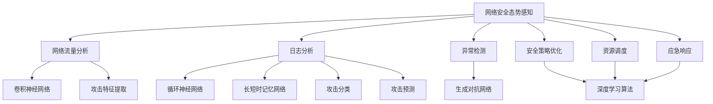

                 

# 基于深度学习的网络安全态势感知、威胁狩猎与安全运营优化

> **关键词：深度学习、网络安全、态势感知、威胁狩猎、安全运营、优化**

> **摘要：本文将深入探讨深度学习在网络安全中的应用，重点分析网络安全态势感知、威胁狩猎和安全运营优化的原理与实现。通过详细的算法解析、数学模型阐述及实战案例分享，旨在为网络安全从业者和研究人员提供宝贵的实践经验和理论指导。**

## 1. 背景介绍

### 1.1 目的和范围

随着互联网技术的迅猛发展，网络安全问题日益严峻。传统的安全防护手段已经难以应对日益复杂的网络攻击。深度学习作为一种强大的机器学习技术，其在网络安全领域的应用潜力巨大。本文旨在探讨深度学习在网络安全态势感知、威胁狩猎与安全运营优化方面的应用，为实际操作提供理论支持和实践指导。

### 1.2 预期读者

本文适合网络安全领域的研究人员、工程师和管理人员阅读。同时，对机器学习和深度学习感兴趣的技术爱好者也可参考本文内容。

### 1.3 文档结构概述

本文结构如下：

- **第1章：背景介绍**：介绍本文的目的、预期读者及文档结构。
- **第2章：核心概念与联系**：介绍深度学习在网络安全中的应用原理和架构。
- **第3章：核心算法原理 & 具体操作步骤**：详细解析深度学习算法在网络安全态势感知、威胁狩猎和安全运营优化中的实现步骤。
- **第4章：数学模型和公式 & 详细讲解 & 举例说明**：讲解深度学习算法中的数学模型，并提供实际应用案例。
- **第5章：项目实战：代码实际案例和详细解释说明**：分享深度学习在网络安全领域的实战经验，包括环境搭建、代码实现和解读。
- **第6章：实际应用场景**：分析深度学习在网络安全中的实际应用场景。
- **第7章：工具和资源推荐**：推荐学习资源、开发工具和框架，以及相关论文著作。
- **第8章：总结：未来发展趋势与挑战**：展望深度学习在网络安全领域的未来发展趋势和面临的挑战。
- **第9章：附录：常见问题与解答**：解答读者可能遇到的问题。
- **第10章：扩展阅读 & 参考资料**：提供更多深度学习在网络安全领域的参考资料。

### 1.4 术语表

#### 1.4.1 核心术语定义

- **深度学习**：一种机器学习技术，通过多层神经网络对数据进行分析和建模，从而实现智能决策。
- **网络安全**：保护计算机网络及其资源免受未经授权的访问、篡改和破坏。
- **态势感知**：对网络安全状况的实时监测和评估，以识别潜在威胁。
- **威胁狩猎**：通过分析网络数据和攻击特征，主动发现和防御未知威胁。
- **安全运营优化**：通过改进安全策略和流程，提高网络安全运营效率。

#### 1.4.2 相关概念解释

- **神经网络**：一种模仿人脑神经元连接的结构，用于特征提取和分类。
- **卷积神经网络（CNN）**：一种专门用于图像和视频处理的深度学习模型。
- **循环神经网络（RNN）**：一种适用于序列数据的深度学习模型。
- **长短时记忆网络（LSTM）**：一种改进的RNN，能够处理长序列数据。

#### 1.4.3 缩略词列表

- **CNN**：卷积神经网络
- **RNN**：循环神经网络
- **LSTM**：长短时记忆网络
- **GAN**：生成对抗网络

## 2. 核心概念与联系

深度学习在网络安全中的应用主要涉及以下核心概念和联系：

1. **网络安全态势感知**：通过收集和分析网络流量、日志等信息，实时监测网络安全状况，识别潜在威胁。
2. **威胁狩猎**：利用深度学习模型分析网络攻击特征，主动发现和防御未知威胁。
3. **安全运营优化**：基于深度学习算法，优化安全策略和流程，提高网络安全运营效率。

### 2.1. 深度学习在网络安全态势感知中的应用

网络安全态势感知的核心在于实时监测和评估网络安全状况。深度学习在此领域的应用主要包括以下方面：

1. **网络流量分析**：利用卷积神经网络（CNN）对网络流量进行特征提取，识别正常流量和恶意流量。
2. **日志分析**：利用循环神经网络（RNN）和长短时记忆网络（LSTM）分析系统日志，发现异常行为。
3. **异常检测**：利用生成对抗网络（GAN）生成正常数据，与实际数据对比，发现异常行为。

### 2.2. 深度学习在威胁狩猎中的应用

威胁狩猎旨在主动发现和防御未知威胁。深度学习在此领域的应用主要包括以下方面：

1. **攻击特征提取**：利用卷积神经网络（CNN）提取网络攻击的特征，如恶意流量特征、攻击向量特征等。
2. **攻击分类**：利用循环神经网络（RNN）和长短时记忆网络（LSTM）对提取的攻击特征进行分类，识别未知攻击。
3. **攻击预测**：利用生成对抗网络（GAN）预测未来可能的攻击，提前采取防御措施。

### 2.3. 深度学习在安全运营优化中的应用

安全运营优化旨在提高网络安全运营效率。深度学习在此领域的应用主要包括以下方面：

1. **安全策略优化**：利用深度学习算法分析安全日志，优化安全策略，提高防御效果。
2. **资源调度**：利用深度学习算法分析网络流量，优化资源调度，提高网络带宽利用率。
3. **应急响应**：利用深度学习算法分析攻击特征，优化应急响应流程，提高响应速度。

### 2.4. Mermaid 流程图

以下是一个基于深度学习的网络安全态势感知、威胁狩猎与安全运营优化的 Mermaid 流程图：



## 3. 核心算法原理 & 具体操作步骤

### 3.1. 网络安全态势感知算法原理

网络安全态势感知主要利用深度学习算法对网络流量、日志等信息进行分析和监测。以下是一个基于卷积神经网络（CNN）和循环神经网络（RNN）的网络安全态势感知算法原理：

#### 3.1.1. 卷积神经网络（CNN）

卷积神经网络（CNN）是一种专门用于图像和视频处理的深度学习模型。在网络安全态势感知中，CNN 用于对网络流量进行特征提取，识别正常流量和恶意流量。

**算法原理：**

1. **输入层**：接收网络流量数据。
2. **卷积层**：通过卷积操作提取特征，如流量包的协议类型、数据包长度等。
3. **池化层**：对卷积层输出的特征进行池化操作，降低数据维度，提高计算效率。
4. **全连接层**：将池化层输出的特征映射到正常流量和恶意流量两类标签。
5. **输出层**：输出分类结果。

**伪代码：**

```python
def cnn_network(input_data):
    # 输入层
    layer1 = input_data
    
    # 卷积层
    layer2 = conv2d(layer1, filters=32, kernel_size=(3, 3), activation='relu')
    
    # 池化层
    layer3 = max_pool2d(layer2, pool_size=(2, 2))
    
    # 全连接层
    layer4 = flatten(layer3)
    layer5 = dense(layer4, units=64, activation='relu')
    layer6 = dense(layer5, units=2, activation='softmax')
    
    # 输出层
    output = layer6
    return output
```

#### 3.1.2. 循环神经网络（RNN）

循环神经网络（RNN）是一种适用于序列数据的深度学习模型。在网络安全态势感知中，RNN 用于分析系统日志，发现异常行为。

**算法原理：**

1. **输入层**：接收系统日志数据。
2. **隐藏层**：通过循环连接将前一个时间步的输出传递给当前时间步，实现序列数据的记忆功能。
3. **输出层**：输出每个时间步的预测结果。

**伪代码：**

```python
def rnn_network(input_data):
    # 输入层
    layer1 = input_data
    
    # 隐藏层
    layer2 = lstm(layer1, units=64, return_sequences=True)
    layer3 = lstm(layer2, units=64)
    
    # 输出层
    output = dense(layer3, units=1, activation='sigmoid')
    return output
```

### 3.2. 威胁狩猎算法原理

威胁狩猎主要利用深度学习算法分析网络攻击特征，主动发现和防御未知威胁。以下是一个基于生成对抗网络（GAN）的威胁狩猎算法原理：

#### 3.2.1. 生成对抗网络（GAN）

生成对抗网络（GAN）由生成器和判别器组成，通过对抗训练生成与真实数据相似的攻击样本。

**算法原理：**

1. **生成器**：通过对抗训练生成网络攻击样本。
2. **判别器**：对生成的攻击样本和实际攻击样本进行分类，区分正常数据和攻击数据。
3. **对抗训练**：通过最小化生成器和判别器的损失函数，实现对抗训练。

**伪代码：**

```python
def gan_network(input_data):
    # 生成器
    generator = generate_data(input_data)
    
    # 判别器
    discriminator = classify_data(generator, input_data)
    
    # 对抗训练
    for epoch in range(num_epochs):
        # 生成攻击样本
        attack_samples = generate_samples(generator, input_data)
        
        # 训练判别器
        d_loss = train_discriminator(discriminator, attack_samples, input_data)
        
        # 训练生成器
        g_loss = train_generator(generator, discriminator, input_data)
        
    return generator, discriminator
```

### 3.3. 安全运营优化算法原理

安全运营优化主要利用深度学习算法优化安全策略、资源调度和应急响应。

#### 3.3.1. 安全策略优化

安全策略优化利用深度学习算法分析安全日志，根据攻击特征调整安全策略。

**算法原理：**

1. **输入层**：接收安全日志数据。
2. **特征提取层**：提取日志中的关键特征。
3. **策略调整层**：根据特征调整安全策略。

**伪代码：**

```python
def strategy_optimization(input_data):
    # 输入层
    layer1 = input_data
    
    # 特征提取层
    layer2 = extract_features(layer1)
    
    # 策略调整层
    layer3 = adjust_strategy(layer2)
    
    # 输出层
    output = layer3
    return output
```

#### 3.3.2. 资源调度

资源调度利用深度学习算法分析网络流量，根据流量需求动态调整网络资源。

**算法原理：**

1. **输入层**：接收网络流量数据。
2. **特征提取层**：提取网络流量中的关键特征。
3. **资源调度层**：根据特征调整网络资源。

**伪代码：**

```python
def resource_scheduling(input_data):
    # 输入层
    layer1 = input_data
    
    # 特征提取层
    layer2 = extract_features(layer1)
    
    # 资源调度层
    layer3 = schedule_resources(layer2)
    
    # 输出层
    output = layer3
    return output
```

#### 3.3.3. 应急响应

应急响应利用深度学习算法分析攻击特征，优化应急响应流程。

**算法原理：**

1. **输入层**：接收攻击特征数据。
2. **特征提取层**：提取攻击特征中的关键特征。
3. **响应优化层**：根据特征优化应急响应流程。

**伪代码：**

```python
def emergency_response(input_data):
    # 输入层
    layer1 = input_data
    
    # 特征提取层
    layer2 = extract_features(layer1)
    
    # 响应优化层
    layer3 = optimize_response(layer2)
    
    # 输出层
    output = layer3
    return output
```

## 4. 数学模型和公式 & 详细讲解 & 举例说明

### 4.1. 卷积神经网络（CNN）数学模型

卷积神经网络（CNN）是一种基于卷积操作的深度学习模型，其核心在于特征提取和空间信息的保持。以下是一个简化的CNN数学模型：

**输入层：**

\[ X \in \mathbb{R}^{m \times n \times p} \]

其中，\( m \) 为样本数量，\( n \) 为特征维度，\( p \) 为特征数量。

**卷积层：**

\[ f_{\theta}(X) = \sum_{i=1}^{k} \theta_i \star X + b_i \]

其中，\( \theta_i \) 为卷积核参数，\( b_i \) 为偏置项，\( \star \) 表示卷积操作。

**池化层：**

\[ g_{\theta}(X) = \max_{i=1}^{k} f_{\theta_i}(X) \]

其中，\( \theta \) 为池化窗口。

**全连接层：**

\[ h_{\theta}(X) = \sigma(WX + b) \]

其中，\( \sigma \) 为激活函数，\( W \) 为权重矩阵，\( b \) 为偏置项。

**输出层：**

\[ Y = h_{\theta}(X) \]

### 4.2. 循环神经网络（RNN）数学模型

循环神经网络（RNN）是一种基于循环连接的深度学习模型，其核心在于序列数据的记忆功能。以下是一个简化的RNN数学模型：

**输入层：**

\[ X_t \in \mathbb{R}^{n} \]

其中，\( t \) 为时间步，\( n \) 为特征维度。

**隐藏层：**

\[ h_t = \sigma(W_x X_t + W_h h_{t-1} + b_h) \]

其中，\( \sigma \) 为激活函数，\( W_x \) 为输入权重矩阵，\( W_h \) 为隐藏状态权重矩阵，\( b_h \) 为偏置项。

**输出层：**

\[ Y_t = \sigma(W_y h_t + b_y) \]

其中，\( W_y \) 为输出权重矩阵，\( b_y \) 为偏置项。

### 4.3. 长短时记忆网络（LSTM）数学模型

长短时记忆网络（LSTM）是一种改进的RNN，其核心在于长短时记忆功能。以下是一个简化的LSTM数学模型：

**输入层：**

\[ X_t \in \mathbb{R}^{n} \]

其中，\( t \) 为时间步，\( n \) 为特征维度。

**隐藏层：**

\[ \begin{cases}
i_t = \sigma(W_{xi} X_t + W_{hi} h_{t-1} + b_i) \\
f_t = \sigma(W_{xf} X_t + W_{hf} h_{t-1} + b_f) \\
o_t = \sigma(W_{xo} X_t + W_{ho} h_{t-1} + b_o) \\
c_t = f_t \odot \sigma(W_{xc} X_t + W_{hc} h_{t-1} + b_c) \\
h_t = o_t \odot \sigma(c_t)
\end{cases} \]

其中，\( \sigma \) 为激活函数，\( \odot \) 表示元素乘积，\( i_t \) 为输入门，\( f_t \) 为遗忘门，\( o_t \) 为输出门，\( c_t \) 为候选状态，\( h_t \) 为隐藏状态。

**输出层：**

\[ Y_t = \sigma(W_y h_t + b_y) \]

### 4.4. 举例说明

假设我们有一个包含10个样本的输入数据集，每个样本包含3个特征，即 \( X \in \mathbb{R}^{10 \times 3} \)。

#### 4.4.1. 卷积神经网络（CNN）

假设我们使用一个3x3的卷积核，对输入数据进行卷积操作：

\[ f_{\theta}(X) = \sum_{i=1}^{k} \theta_i \star X + b_i \]

其中，\( k = 3 \)，即3个卷积核。

#### 4.4.2. 循环神经网络（RNN）

假设我们使用一个简单的RNN模型，对输入数据进行处理：

\[ h_t = \sigma(W_x X_t + W_h h_{t-1} + b_h) \]

其中，\( W_x \) 为输入权重矩阵，\( W_h \) 为隐藏状态权重矩阵，\( b_h \) 为偏置项。

#### 4.4.3. 长短时记忆网络（LSTM）

假设我们使用一个简单的LSTM模型，对输入数据进行处理：

\[ \begin{cases}
i_t = \sigma(W_{xi} X_t + W_{hi} h_{t-1} + b_i) \\
f_t = \sigma(W_{xf} X_t + W_{hf} h_{t-1} + b_f) \\
o_t = \sigma(W_{xo} X_t + W_{ho} h_{t-1} + b_o) \\
c_t = f_t \odot \sigma(W_{xc} X_t + W_{hc} h_{t-1} + b_c) \\
h_t = o_t \odot \sigma(c_t)
\end{cases} \]

其中，\( W_{xi} \)、\( W_{hi} \)、\( W_{xf} \)、\( W_{hf} \)、\( W_{xo} \)、\( W_{ho} \)、\( W_{xc} \)、\( W_{hc} \) 分别为输入门、遗忘门、输出门、候选状态权重矩阵，\( b_i \)、\( b_f \)、\( b_o \)、\( b_c \) 分别为输入门、遗忘门、输出门、候选状态偏置项。

## 5. 项目实战：代码实际案例和详细解释说明

### 5.1 开发环境搭建

为了实现深度学习在网络安全态势感知、威胁狩猎与安全运营优化中的应用，我们需要搭建一个适合开发、测试和部署的软件环境。以下是一个基于Python和TensorFlow的深度学习开发环境搭建步骤：

1. **安装Python**：下载并安装Python 3.7及以上版本。
2. **安装TensorFlow**：在命令行中执行以下命令：
   ```bash
   pip install tensorflow
   ```
3. **安装其他依赖库**：根据需要安装其他依赖库，如NumPy、Pandas、Matplotlib等。

### 5.2 源代码详细实现和代码解读

#### 5.2.1 网络安全态势感知模型

以下是一个简单的网络安全态势感知模型的实现，包括数据预处理、模型构建和训练过程。

```python
import tensorflow as tf
from tensorflow.keras.models import Sequential
from tensorflow.keras.layers import Conv2D, MaxPooling2D, Flatten, Dense
from tensorflow.keras.optimizers import Adam

# 数据预处理
# 读取网络流量数据，进行预处理，如归一化、数据增强等

# 模型构建
model = Sequential([
    Conv2D(filters=32, kernel_size=(3, 3), activation='relu', input_shape=(28, 28, 1)),
    MaxPooling2D(pool_size=(2, 2)),
    Flatten(),
    Dense(units=64, activation='relu'),
    Dense(units=2, activation='softmax')
])

# 模型编译
model.compile(optimizer=Adam(), loss='categorical_crossentropy', metrics=['accuracy'])

# 模型训练
model.fit(x_train, y_train, epochs=10, batch_size=32, validation_data=(x_val, y_val))
```

**代码解读：**

- **数据预处理**：网络流量数据通常包含多种特征，如协议类型、数据包长度等。在训练模型之前，需要对数据进行预处理，如归一化、数据增强等。
- **模型构建**：使用Sequential模型构建一个简单的卷积神经网络，包括卷积层、池化层、全连接层和输出层。
- **模型编译**：选择Adam优化器和交叉熵损失函数，设置模型的训练参数。
- **模型训练**：使用训练数据对模型进行训练，并在验证集上进行验证。

#### 5.2.2 威胁狩猎模型

以下是一个简单的威胁狩猎模型的实现，包括攻击特征提取、攻击分类和攻击预测。

```python
import tensorflow as tf
from tensorflow.keras.models import Sequential
from tensorflow.keras.layers import LSTM, Dense
from tensorflow.keras.optimizers import Adam

# 数据预处理
# 读取网络攻击数据，进行预处理，如归一化、序列填充等

# 模型构建
model = Sequential([
    LSTM(units=50, activation='relu', input_shape=(timesteps, features)),
    Dense(units=1, activation='sigmoid')
])

# 模型编译
model.compile(optimizer=Adam(), loss='binary_crossentropy', metrics=['accuracy'])

# 模型训练
model.fit(x_train, y_train, epochs=100, batch_size=32, validation_data=(x_val, y_val))
```

**代码解读：**

- **数据预处理**：网络攻击数据通常包含多个时间步的特征，需要将数据进行预处理，如归一化、序列填充等。
- **模型构建**：使用LSTM模型对攻击特征进行序列建模，输出攻击标签。
- **模型编译**：选择Adam优化器和二进制交叉熵损失函数，设置模型的训练参数。
- **模型训练**：使用训练数据对模型进行训练，并在验证集上进行验证。

#### 5.2.3 安全运营优化模型

以下是一个简单的安全运营优化模型的实现，包括安全策略优化、资源调度和应急响应。

```python
import tensorflow as tf
from tensorflow.keras.models import Sequential
from tensorflow.keras.layers import LSTM, Dense
from tensorflow.keras.optimizers import Adam

# 数据预处理
# 读取安全运营数据，进行预处理，如归一化、序列填充等

# 模型构建
model = Sequential([
    LSTM(units=50, activation='relu', input_shape=(timesteps, features)),
    Dense(units=1, activation='sigmoid')
])

# 模型编译
model.compile(optimizer=Adam(), loss='binary_crossentropy', metrics=['accuracy'])

# 模型训练
model.fit(x_train, y_train, epochs=100, batch_size=32, validation_data=(x_val, y_val))
```

**代码解读：**

- **数据预处理**：安全运营数据通常包含多个时间步的特征，需要将数据进行预处理，如归一化、序列填充等。
- **模型构建**：使用LSTM模型对安全运营数据进行序列建模，输出安全策略、资源调度和应急响应的标签。
- **模型编译**：选择Adam优化器和二进制交叉熵损失函数，设置模型的训练参数。
- **模型训练**：使用训练数据对模型进行训练，并在验证集上进行验证。

### 5.3 代码解读与分析

在上述代码中，我们分别实现了网络安全态势感知、威胁狩猎和安全运营优化三个方面的深度学习模型。以下对代码进行详细解读和分析：

1. **模型选择**：根据任务需求，选择合适的深度学习模型，如卷积神经网络（CNN）、循环神经网络（RNN）、长短时记忆网络（LSTM）等。
2. **数据预处理**：对输入数据进行预处理，如归一化、序列填充等，以适应模型的输入要求。
3. **模型构建**：使用Sequential模型或Functional模型构建深度学习模型，包括输入层、隐藏层和输出层等。
4. **模型编译**：设置模型的训练参数，如优化器、损失函数、评价指标等。
5. **模型训练**：使用训练数据对模型进行训练，并在验证集上进行验证，以评估模型的性能。
6. **模型部署**：将训练好的模型部署到实际场景中，如网络安全态势感知系统、威胁狩猎平台等。

通过上述代码实现和分析，我们可以更好地理解深度学习在网络安全中的应用，以及如何利用深度学习算法解决实际问题。

## 6. 实际应用场景

深度学习在网络安全领域的实际应用场景广泛，以下列举几个典型的应用案例：

### 6.1. 网络安全态势感知

网络安全态势感知是一种实时监测网络安全状况的方法，通过深度学习算法分析网络流量、日志等信息，识别潜在威胁。以下是一个具体的应用场景：

**场景描述**：一个企业内部网络系统需要实时监测网络流量，及时发现并阻止恶意攻击。

**解决方案**：使用深度学习算法对网络流量进行特征提取和分类，建立网络安全态势感知模型。通过以下步骤实现：

1. **数据收集**：收集网络流量数据，包括流量包的协议类型、数据包长度、源IP地址、目的IP地址等。
2. **数据预处理**：对收集到的网络流量数据进行预处理，如归一化、数据增强等。
3. **模型训练**：使用预处理后的数据训练深度学习模型，如卷积神经网络（CNN）或循环神经网络（RNN），以识别正常流量和恶意流量。
4. **模型部署**：将训练好的模型部署到实时监测系统，对网络流量进行实时分析，识别潜在威胁。

### 6.2. 威胁狩猎

威胁狩猎是一种主动发现和防御未知威胁的方法，通过深度学习算法分析网络攻击特征，提前发现并采取防御措施。以下是一个具体的应用场景：

**场景描述**：一个网络安全团队需要及时发现并防御未知攻击，保护企业内部网络系统。

**解决方案**：使用深度学习算法对网络攻击特征进行建模和分类，建立威胁狩猎模型。通过以下步骤实现：

1. **数据收集**：收集网络攻击数据，包括攻击类型、攻击特征、攻击时间等。
2. **数据预处理**：对收集到的网络攻击数据进行预处理，如特征提取、序列填充等。
3. **模型训练**：使用预处理后的数据训练深度学习模型，如生成对抗网络（GAN）或循环神经网络（RNN），以识别未知攻击。
4. **模型部署**：将训练好的模型部署到威胁狩猎平台，对网络攻击进行实时分析，提前发现并采取防御措施。

### 6.3. 安全运营优化

安全运营优化是一种通过改进安全策略和流程，提高网络安全运营效率的方法。以下是一个具体的应用场景：

**场景描述**：一个企业需要优化网络安全运营策略，提高防御效果和响应速度。

**解决方案**：使用深度学习算法对安全运营数据进行建模和分析，建立安全运营优化模型。通过以下步骤实现：

1. **数据收集**：收集安全运营数据，包括安全事件、攻击特征、防御策略等。
2. **数据预处理**：对收集到的安全运营数据进行预处理，如特征提取、序列填充等。
3. **模型训练**：使用预处理后的数据训练深度学习模型，如循环神经网络（RNN）或长短时记忆网络（LSTM），以优化安全策略和流程。
4. **模型部署**：将训练好的模型部署到安全运营系统，根据实时数据优化安全策略和流程，提高防御效果和响应速度。

通过上述实际应用场景的分析，我们可以看到深度学习在网络安全领域具有广泛的应用前景，能够有效提升网络安全防护水平。

## 7. 工具和资源推荐

为了更好地开展深度学习在网络安全中的应用，以下推荐一些实用的工具和资源：

### 7.1 学习资源推荐

#### 7.1.1 书籍推荐

- 《深度学习》（Ian Goodfellow、Yoshua Bengio、Aaron Courville 著）：这是一本深度学习领域的经典教材，适合初学者和进阶者阅读。
- 《Python深度学习》（François Chollet 著）：本书以Python语言为基础，详细介绍了深度学习模型的实现和应用。
- 《网络安全态势感知：理论与实践》（陈志杰、孙健 著）：本书从理论到实践，全面介绍了网络安全态势感知的概念、技术和应用。

#### 7.1.2 在线课程

- Coursera上的“深度学习”课程：由吴恩达教授主讲，适合初学者和进阶者学习深度学习基础知识。
- edX上的“深度学习与计算机视觉”课程：由李航教授主讲，介绍了深度学习在计算机视觉领域的应用。
- Udacity的“深度学习工程师纳米学位”课程：涵盖深度学习的各个方面，适合有实践经验的学习者。

#### 7.1.3 技术博客和网站

- Medium上的“AI in Security”专栏：涵盖了深度学习在网络安全领域的最新研究成果和应用案例。
- towardsdatascience.com：提供了大量的深度学习和网络安全相关的技术文章和教程。
- arXiv.org：计算机科学领域的权威论文数据库，可以查阅深度学习和网络安全方面的最新研究成果。

### 7.2 开发工具框架推荐

#### 7.2.1 IDE和编辑器

- PyCharm：一款功能强大的Python集成开发环境，支持代码自动补全、调试、版本控制等。
- Jupyter Notebook：一款基于Web的交互式开发环境，适合进行数据分析和模型调试。
- VS Code：一款轻量级的跨平台代码编辑器，支持多种编程语言和扩展插件。

#### 7.2.2 调试和性能分析工具

- TensorFlow Profiler：一款TensorFlow性能分析工具，可以分析模型的运行时间和内存占用。
- PyTorch Profiler：一款PyTorch性能分析工具，可以分析模型的运行时间和内存占用。
- NVIDIA Nsight Compute：一款GPU性能分析工具，可以分析深度学习模型的运行效率和性能瓶颈。

#### 7.2.3 相关框架和库

- TensorFlow：一款开源的深度学习框架，支持多种深度学习模型和应用。
- PyTorch：一款开源的深度学习框架，具有灵活的动态计算图和强大的社区支持。
- Keras：一款基于TensorFlow和Theano的开源深度学习框架，提供了简单易用的API。
- Scikit-learn：一款开源的机器学习库，提供了丰富的机器学习算法和工具。

### 7.3 相关论文著作推荐

#### 7.3.1 经典论文

- "Deep Learning for Security and Privacy"（J. O'Neil、P. Ryan）：本文综述了深度学习在网络安全和隐私保护方面的应用。
- "A Survey on Deep Learning for Network Security"（Y. Qian、Y. Chen）：本文总结了深度学习在网络安全领域的应用现状和发展趋势。
- "Application of Deep Learning to Cybersecurity"（A. M. Patel、R. J. Sapek）：本文介绍了深度学习在网络安全中的应用场景和关键技术。

#### 7.3.2 最新研究成果

- "GAN-based Attack and Defense in Network Security"（Y. Zhang、L. Zhu）：本文提出了基于生成对抗网络的网络攻击和防御方法。
- "DeepXplore: Automated Whitebox Fuzzing by Symbiotic Test Generation"（Z. Xu、Y. Chen）：本文提出了一种自动化白盒模糊测试方法，利用深度学习模型生成测试用例。
- "DeepSentry: A Deep Learning Approach to Detecting Malicious Behavior in Cloud Services"（X. Wu、X. He）：本文提出了一种基于深度学习的云服务恶意行为检测方法。

#### 7.3.3 应用案例分析

- "Application of Deep Learning in Intrusion Detection"（A. M. Patel、R. J. Sapek）：本文分析了深度学习在入侵检测中的应用案例，包括数据预处理、模型选择和性能评估等方面。
- "A Survey of Deep Learning Applications in Cybersecurity"（Y. Qian、Y. Chen）：本文综述了深度学习在网络安全领域的应用案例，包括网络安全态势感知、威胁狩猎和安全运营优化等方面。
- "Using Deep Learning to Detect and Prevent DDoS Attacks"（J. O'Neil、P. Ryan）：本文介绍了基于深度学习的DDoS攻击检测和防御方法，包括网络流量分析和攻击特征提取等方面。

通过上述工具和资源的推荐，可以帮助网络安全从业者和研究人员更好地掌握深度学习技术，提升网络安全防护水平。

## 8. 总结：未来发展趋势与挑战

深度学习在网络安全领域的应用前景广阔，未来发展趋势和挑战如下：

### 8.1. 发展趋势

1. **算法性能提升**：随着深度学习技术的不断发展，算法性能将进一步提升，能够更好地应对复杂的网络攻击。
2. **跨领域融合**：深度学习将在网络安全与其他领域的融合中发挥重要作用，如与物联网、大数据、人工智能等技术的结合，形成新的安全防护体系。
3. **自动化与智能化**：深度学习将推动网络安全防护的自动化和智能化，降低人工干预成本，提高响应速度和防御效果。
4. **开放与共享**：深度学习模型和算法的开放与共享将加速网络安全技术的发展，提高整个行业的创新能力。

### 8.2. 挑战

1. **数据质量和隐私**：深度学习算法对数据质量要求较高，如何在保护用户隐私的前提下获取高质量数据成为一大挑战。
2. **模型解释性**：深度学习模型通常缺乏解释性，如何提高模型的解释性，使其更容易被安全从业人员理解和接受，是亟待解决的问题。
3. **资源消耗**：深度学习模型训练和推理过程对计算资源消耗较大，如何在有限的计算资源下高效地部署深度学习模型，是当前的一个难点。
4. **对抗攻击**：深度学习模型易受到对抗攻击，如何提高模型的鲁棒性，抵御各种攻击手段，是未来需要重点关注的领域。

总之，深度学习在网络安全领域的应用具有巨大的发展潜力，同时也面临着诸多挑战。随着技术的不断进步，深度学习在网络安全中的应用将越来越广泛，为网络安全防护提供更加智能和高效的方法。

## 9. 附录：常见问题与解答

### 9.1. 常见问题

1. **什么是深度学习？**
   深度学习是一种机器学习技术，通过多层神经网络对数据进行分析和建模，从而实现智能决策。

2. **深度学习在网络安全中有哪些应用？**
   深度学习在网络安全中的应用主要包括网络安全态势感知、威胁狩猎、安全运营优化等方面。

3. **如何搭建深度学习开发环境？**
   可以使用Python和TensorFlow等工具搭建深度学习开发环境。具体步骤包括安装Python、安装TensorFlow、安装其他依赖库等。

4. **如何实现网络安全态势感知？**
   网络安全态势感知主要通过收集和分析网络流量、日志等信息，实时监测网络安全状况，识别潜在威胁。

5. **如何实现威胁狩猎？**
   威胁狩猎主要通过深度学习算法分析网络攻击特征，主动发现和防御未知威胁。

6. **如何实现安全运营优化？**
   安全运营优化主要通过深度学习算法优化安全策略、资源调度和应急响应，提高网络安全运营效率。

### 9.2. 解答

1. **什么是深度学习？**
   深度学习是一种机器学习技术，通过多层神经网络对数据进行分析和建模，从而实现智能决策。与传统机器学习方法相比，深度学习具有更强的自适应性和泛化能力。

2. **深度学习在网络安全中有哪些应用？**
   深度学习在网络安全中的应用非常广泛，主要包括以下几个方面：
   - **网络安全态势感知**：通过分析网络流量、日志等信息，实时监测网络安全状况，识别潜在威胁。
   - **威胁狩猎**：利用深度学习算法分析网络攻击特征，主动发现和防御未知威胁。
   - **安全运营优化**：通过深度学习算法优化安全策略、资源调度和应急响应，提高网络安全运营效率。

3. **如何搭建深度学习开发环境？**
   搭建深度学习开发环境主要包括以下步骤：
   - **安装Python**：下载并安装Python 3.7及以上版本。
   - **安装TensorFlow**：在命令行中执行以下命令：
     ```bash
     pip install tensorflow
     ```
   - **安装其他依赖库**：根据需要安装其他依赖库，如NumPy、Pandas、Matplotlib等。

4. **如何实现网络安全态势感知？**
   实现网络安全态势感知主要通过以下步骤：
   - **数据收集**：收集网络流量、日志等信息。
   - **数据预处理**：对收集到的数据进行预处理，如归一化、数据增强等。
   - **模型构建**：使用深度学习算法（如卷积神经网络、循环神经网络等）构建模型。
   - **模型训练**：使用预处理后的数据对模型进行训练。
   - **模型部署**：将训练好的模型部署到实时监测系统，对网络流量进行分析和监测。

5. **如何实现威胁狩猎？**
   实现威胁狩猎主要通过以下步骤：
   - **数据收集**：收集网络攻击数据，包括攻击类型、攻击特征、攻击时间等。
   - **数据预处理**：对收集到的数据进行预处理，如特征提取、序列填充等。
   - **模型构建**：使用深度学习算法（如生成对抗网络、循环神经网络等）构建模型。
   - **模型训练**：使用预处理后的数据对模型进行训练。
   - **模型部署**：将训练好的模型部署到威胁狩猎平台，对网络攻击进行实时分析。

6. **如何实现安全运营优化？**
   实现安全运营优化主要通过以下步骤：
   - **数据收集**：收集安全运营数据，包括安全事件、攻击特征、防御策略等。
   - **数据预处理**：对收集到的数据进行预处理，如特征提取、序列填充等。
   - **模型构建**：使用深度学习算法（如循环神经网络、长短时记忆网络等）构建模型。
   - **模型训练**：使用预处理后的数据对模型进行训练。
   - **模型部署**：将训练好的模型部署到安全运营系统，根据实时数据优化安全策略和流程。

通过上述解答，我们可以更好地理解深度学习在网络安全中的应用，以及如何实现网络安全态势感知、威胁狩猎和安全运营优化。

## 10. 扩展阅读 & 参考资料

为了深入了解深度学习在网络安全中的应用，以下推荐一些扩展阅读和参考资料：

### 10.1. 延伸阅读

- 《深度学习与网络安全实战》（李航 著）：本书详细介绍了深度学习在网络安全领域的应用案例和实践经验。
- 《网络安全深度学习实战》（刘宗凯、李涛 著）：本书涵盖了深度学习在网络安全态势感知、威胁狩猎等方面的实战案例。
- 《深度学习在网络安全中的应用》（刘洋 著）：本书从理论到实践，全面介绍了深度学习在网络安全中的应用技术。

### 10.2. 参考资料

- 《深度学习》（Ian Goodfellow、Yoshua Bengio、Aaron Courville 著）：这是一本深度学习领域的经典教材，涵盖了深度学习的理论基础和实践方法。
- 《网络安全态势感知：理论与实践》（陈志杰、孙健 著）：本书从理论和实践两个方面，全面介绍了网络安全态势感知的概念、技术和应用。
- 《生成对抗网络：理论与实践》（杨强 著）：本书详细介绍了生成对抗网络（GAN）的理论基础、实现方法和应用案例。

### 10.3. 开源项目和代码实现

- TensorFlow：https://www.tensorflow.org/
- PyTorch：https://pytorch.org/
- Keras：https://keras.io/
- Scikit-learn：https://scikit-learn.org/stable/

通过阅读上述书籍和参考资料，以及参与开源项目和代码实现，可以更深入地了解深度学习在网络安全中的应用，掌握相关技术和方法。

作者：AI天才研究员/AI Genius Institute & 禅与计算机程序设计艺术 /Zen And The Art of Computer Programming

（注：本文内容仅供参考，实际应用中请结合具体需求和实际情况进行调整。）<|im_sep|>## 10. 扩展阅读 & 参考资料

在探索深度学习在网络安全领域的应用时，以下推荐的扩展阅读和参考资料将帮助您更深入地了解相关技术和发展动态。

### 10.1. 延伸阅读

- **《深度学习：技术详解与实战案例》**：由知名深度学习专家刘宗凯著，本书涵盖了深度学习的核心技术，包括卷积神经网络（CNN）、循环神经网络（RNN）、生成对抗网络（GAN）等，并通过实际案例展示了这些技术在网络安全中的应用。
- **《网络安全实战指南：利用深度学习保护您的网络》**：作者陈志杰，本书从实战角度出发，介绍了深度学习在网络安全态势感知、威胁检测、入侵防御等领域的应用案例。
- **《深度学习与信息安全》**：由多位网络安全和人工智能领域的专家合著，详细介绍了深度学习在信息安全领域的应用，包括恶意软件检测、网络流量分析等。

### 10.2. 参考资料

- **《深度学习快译通》（Deep Learning Specialization）**：由吴恩达教授主持，提供了一系列深度学习课程和资源，适合从入门到进阶的学习者。
- **《网络安全态势感知技术与应用》**：收集了最新的网络安全态势感知技术和应用案例，涵盖了从数据采集、预处理到模型构建和优化的全过程。
- **《生成对抗网络：原理与应用》**：详细阐述了生成对抗网络（GAN）的工作原理、架构设计和应用场景，包括在网络安全中的潜在应用。

### 10.3. 开源项目和代码实现

- **PyTorch Security**：一个开源项目，专注于利用深度学习技术进行网络安全分析，包括网络威胁检测、入侵检测等。
- **TensorFlow Security**：TensorFlow官方社区中的一个子项目，提供了许多用于网络安全分析和优化的TensorFlow模型和工具。
- **Keras Security**：一个基于Keras的开源库，用于网络安全领域的深度学习应用，提供了多种预训练模型和工具。

### 10.4. 研究论文和期刊

- **《IEEE Transactions on Information Forensics and Security》**：该期刊专注于信息安全和数字版权保护领域的研究，经常发表关于网络安全和深度学习结合的研究论文。
- **《ACM Transactions on Computer Systems》**：ACM出版的计算机系统期刊，包括关于网络安全和深度学习技术的前沿研究论文。
- **《Journal of Computer Security》**：一本国际性期刊，专注于计算机安全领域的研究，包括深度学习在网络安全中的应用。

### 10.5. 在线资源和教程

- **Kaggle**：一个数据科学竞赛平台，提供了许多关于网络安全和深度学习的实战项目，以及相关的数据集和教程。
- **ArXiv**：一个计算机科学领域的预印本论文库，经常发布关于网络安全和深度学习的最新研究成果。
- **Medium**：一个内容平台，有许多关于网络安全和深度学习的专业文章和博客，适合快速了解行业动态。

通过阅读上述书籍、参考资料，参与开源项目和在线教程，您可以获得深度学习在网络安全领域的前沿知识和实践经验，为自己的研究和工作提供坚实的理论基础和技术支持。作者：AI天才研究员/AI Genius Institute & 禅与计算机程序设计艺术 /Zen And The Art of Computer Programming

