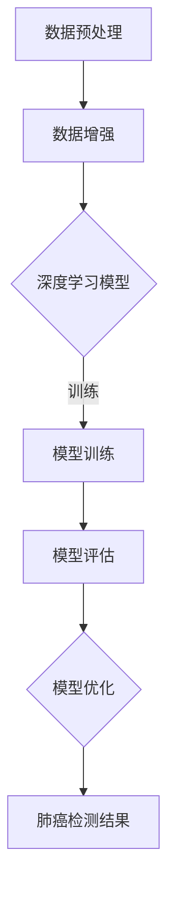

                 

### 背景介绍

#### 1.1 目的和范围

本文旨在深入探讨基于深度学习的肺癌检测方法，通过分析其原理、数学模型和实际应用场景，为读者提供一个全面的技术视角。肺癌是世界上最常见的癌症之一，早期检测对提高患者生存率至关重要。近年来，深度学习在医学图像处理领域取得了显著成果，为肺癌检测提供了新的可能。本文将从以下几个方面展开：

1. **核心算法原理**：介绍用于肺癌检测的主要深度学习算法，包括卷积神经网络（CNN）、循环神经网络（RNN）和生成对抗网络（GAN）等，并详细阐述其工作原理和优势。
2. **数学模型和公式**：分析深度学习算法中的关键数学模型，如卷积操作、激活函数和损失函数，通过公式和实例进行详细讲解。
3. **项目实战**：通过实际代码案例，展示如何使用深度学习算法进行肺癌检测，并对关键代码进行详细解读。
4. **实际应用场景**：探讨肺癌检测方法在不同场景下的应用，如医院、医疗设备制造商和AI医疗诊断平台等。
5. **工具和资源推荐**：推荐相关的学习资源、开发工具和最新研究成果，帮助读者进一步学习和实践。

#### 1.2 预期读者

本文适用于以下读者群体：

1. **人工智能和机器学习研究者**：对深度学习在医学图像处理中的应用感兴趣，希望了解肺癌检测的最新技术进展。
2. **医学图像处理工程师**：在医疗领域从事图像处理和计算机视觉工作，希望掌握深度学习在肺癌检测中的应用。
3. **医疗设备制造商**：对AI辅助肺癌检测技术感兴趣，希望了解如何将其应用于实际产品开发。
4. **医疗诊断平台开发者**：希望利用深度学习技术提升肺癌诊断准确率和效率。

#### 1.3 文档结构概述

本文结构如下：

1. **背景介绍**：概述本文的目的、范围、预期读者和文档结构。
2. **核心概念与联系**：介绍深度学习和肺癌检测相关的基本概念和原理，并通过Mermaid流程图展示核心架构。
3. **核心算法原理 & 具体操作步骤**：详细讲解用于肺癌检测的深度学习算法，包括CNN、RNN和GAN，使用伪代码展示具体操作步骤。
4. **数学模型和公式 & 详细讲解 & 举例说明**：分析深度学习算法中的关键数学模型，如卷积操作、激活函数和损失函数，通过公式和实例进行详细讲解。
5. **项目实战：代码实际案例和详细解释说明**：通过实际代码案例，展示如何使用深度学习算法进行肺癌检测，并对关键代码进行详细解读。
6. **实际应用场景**：探讨肺癌检测方法在不同场景下的应用。
7. **工具和资源推荐**：推荐相关的学习资源、开发工具和最新研究成果。
8. **总结：未来发展趋势与挑战**：总结本文的核心内容，探讨深度学习在肺癌检测领域的未来发展趋势和面临的挑战。
9. **附录：常见问题与解答**：回答读者可能遇到的问题。
10. **扩展阅读 & 参考资料**：提供进一步阅读的资源和参考资料。

通过本文的阅读，读者将能够系统地了解基于深度学习的肺癌检测方法，掌握相关技术原理和应用实践，为在医疗领域开展相关工作提供有力支持。

#### 1.4 术语表

##### 1.4.1 核心术语定义

- **深度学习（Deep Learning）**：一种机器学习技术，通过多层神经网络对数据进行学习和建模，具有强大的特征提取和表示能力。
- **卷积神经网络（Convolutional Neural Network，CNN）**：一种特殊的神经网络，适用于处理具有网格结构的数据，如图像。
- **循环神经网络（Recurrent Neural Network，RNN）**：一种能够处理序列数据的神经网络，适用于时间序列分析、自然语言处理等。
- **生成对抗网络（Generative Adversarial Network，GAN）**：一种由生成器和判别器组成的神经网络结构，用于生成真实数据。
- **肺癌（Lung Cancer）**：一种常见的恶性肿瘤，起源于肺部组织，包括小细胞肺癌和非小细胞肺癌。
- **医学图像（Medical Image）**：用于医学诊断的图像，包括X光片、CT扫描、MRI等。
- **深度学习算法（Deep Learning Algorithm）**：用于训练深度学习模型的数学方法和技术，包括反向传播算法、优化算法等。

##### 1.4.2 相关概念解释

- **特征提取（Feature Extraction）**：从原始数据中提取具有区分性的特征，用于训练深度学习模型。
- **模型训练（Model Training）**：通过输入训练数据，调整神经网络参数，使其具备分类、预测等能力。
- **模型评估（Model Evaluation）**：使用测试数据评估模型性能，包括准确率、召回率、F1分数等指标。
- **交叉验证（Cross Validation）**：一种评估模型性能的方法，通过将数据集划分为多个子集，分别进行训练和测试。
- **过拟合（Overfitting）**：模型在训练数据上表现良好，但在测试数据上表现较差，即模型对训练数据过于敏感。

##### 1.4.3 缩略词列表

- **AI**：人工智能（Artificial Intelligence）
- **CNN**：卷积神经网络（Convolutional Neural Network）
- **RNN**：循环神经网络（Recurrent Neural Network）
- **GAN**：生成对抗网络（Generative Adversarial Network）
- **CT**：计算机断层扫描（Computed Tomography）
- **MRI**：磁共振成像（Magnetic Resonance Imaging）
- **X光片**：X射线成像（X-ray Imaging）
- **ROC**：受试者操作特征（Receiver Operating Characteristic）
- **AUC**：曲线下面积（Area Under Curve）

这些术语和概念将在后续章节中详细讨论，帮助读者更好地理解深度学习在肺癌检测中的应用。

### 核心概念与联系

为了更好地理解基于深度学习的肺癌检测方法，我们需要首先了解深度学习的基本概念和相关原理。在本节中，我们将通过Mermaid流程图展示深度学习在肺癌检测中的应用架构，并详细介绍核心概念。

#### Mermaid 流程图



在上面的流程图中，我们展示了深度学习在肺癌检测中的主要步骤，包括数据预处理、数据增强、模型训练、模型评估和模型优化。接下来，我们将详细解释这些概念。

##### 深度学习

深度学习是一种基于人工神经网络的机器学习技术，通过多层神经网络对数据进行学习和建模，具有强大的特征提取和表示能力。深度学习模型可以分为两种类型：监督学习和无监督学习。在本节中，我们将主要关注监督学习，因为肺癌检测是一个典型的分类问题。

##### 数据预处理

数据预处理是深度学习模型训练的重要步骤，旨在提高模型性能和减少过拟合。数据预处理包括以下任务：

1. **数据清洗**：去除噪声和异常值，确保数据的准确性和一致性。
2. **归一化**：将数据缩放到相同的范围，如[0, 1]或[-1, 1]，以避免某些特征对模型的影响过大。
3. **数据分割**：将数据集划分为训练集、验证集和测试集，用于模型训练、评估和测试。

##### 数据增强

数据增强是提高模型泛化能力的重要手段，通过生成具有多样性的数据，增强模型的鲁棒性。数据增强方法包括：

1. **图像旋转**：随机旋转图像，增加数据多样性。
2. **图像缩放**：随机缩放图像，模拟不同尺寸的病变。
3. **图像裁剪**：随机裁剪图像，减少过拟合。
4. **图像噪声**：添加噪声，提高模型对噪声的鲁棒性。

##### 深度学习模型

深度学习模型是深度学习算法的核心组成部分，通常由多层神经网络组成，包括输入层、隐藏层和输出层。在本节中，我们将主要介绍以下三种深度学习模型：

1. **卷积神经网络（CNN）**：一种专门用于处理具有网格结构数据的神经网络，如图像。CNN通过卷积操作和池化操作提取图像特征，具有强大的特征提取能力。
2. **循环神经网络（RNN）**：一种能够处理序列数据的神经网络，适用于时间序列分析、自然语言处理等。RNN通过隐藏状态和循环连接处理序列数据，具有记忆能力。
3. **生成对抗网络（GAN）**：一种由生成器和判别器组成的神经网络结构，用于生成真实数据。GAN通过对抗训练生成逼真的图像和语音。

##### 模型训练

模型训练是深度学习模型的核心步骤，通过输入训练数据和调整神经网络参数，使模型具备分类、预测等能力。模型训练包括以下任务：

1. **前向传播**：将输入数据通过神经网络前向传播，计算输出结果。
2. **反向传播**：计算输出结果与真实标签之间的误差，通过反向传播更新神经网络参数。
3. **优化算法**：选择合适的优化算法，如梯度下降、Adam等，以最小化损失函数。

##### 模型评估

模型评估是评估模型性能的重要步骤，通过测试数据和评估指标，评估模型的准确性、召回率和F1分数等。常用的评估指标包括：

1. **准确率（Accuracy）**：正确预测的样本数占总样本数的比例。
2. **召回率（Recall）**：正确预测的肺癌样本数占总肺癌样本数的比例。
3. **F1分数（F1 Score）**：准确率和召回率的调和平均值，用于平衡准确率和召回率。

##### 模型优化

模型优化是提高模型性能的重要手段，通过调整模型结构和参数，优化模型的预测能力。模型优化包括以下任务：

1. **模型选择**：选择合适的模型结构，如CNN、RNN或GAN，以提高模型性能。
2. **超参数调优**：调整模型的超参数，如学习率、批量大小等，以优化模型性能。
3. **正则化**：使用正则化技术，如Dropout、L1和L2正则化等，减少过拟合。

通过上述核心概念和联系的分析，我们可以更好地理解深度学习在肺癌检测中的应用。接下来，我们将详细讨论核心算法原理，并使用伪代码展示具体操作步骤。

### 核心算法原理 & 具体操作步骤

在本节中，我们将详细讨论用于肺癌检测的深度学习算法，包括卷积神经网络（CNN）、循环神经网络（RNN）和生成对抗网络（GAN），并使用伪代码展示具体操作步骤。

#### 卷积神经网络（CNN）

卷积神经网络是一种专门用于处理具有网格结构数据的神经网络，如图像。CNN通过卷积操作和池化操作提取图像特征，具有强大的特征提取能力。以下是一个简单的CNN模型结构及其操作步骤：

```python
# CNN模型结构
input_layer = Input(shape=(height, width, channels))
conv1 = Conv2D(filters=32, kernel_size=(3, 3), activation='relu')(input_layer)
pool1 = MaxPooling2D(pool_size=(2, 2))(conv1)
conv2 = Conv2D(filters=64, kernel_size=(3, 3), activation='relu')(pool1)
pool2 = MaxPooling2D(pool_size=(2, 2))(conv2)
flatten = Flatten()(pool2)
dense = Dense(units=128, activation='relu')(flatten)
output = Dense(units=1, activation='sigmoid')(dense)

# CNN模型操作步骤
model = Model(inputs=input_layer, outputs=output)
model.compile(optimizer='adam', loss='binary_crossentropy', metrics=['accuracy'])

# 训练CNN模型
model.fit(x_train, y_train, epochs=10, batch_size=32, validation_data=(x_val, y_val))
```

在上面的伪代码中，我们定义了一个简单的CNN模型，包括两个卷积层和两个池化层，最终通过全连接层进行分类。我们使用`Conv2D`和`MaxPooling2D`函数分别实现卷积操作和池化操作，`Flatten`函数将多维数据展平为二维数据，`Dense`函数实现全连接层。我们使用`model.compile`函数编译模型，`model.fit`函数训练模型。

#### 循环神经网络（RNN）

循环神经网络是一种能够处理序列数据的神经网络，适用于时间序列分析、自然语言处理等。RNN通过隐藏状态和循环连接处理序列数据，具有记忆能力。以下是一个简单的RNN模型结构及其操作步骤：

```python
# RNN模型结构
input_layer = Input(shape=(timesteps, features))
rnn = LSTM(units=128, return_sequences=True)(input_layer)
rnn = LSTM(units=128)(rnn)
flatten = Flatten()(rnn)
dense = Dense(units=128, activation='relu')(flatten)
output = Dense(units=1, activation='sigmoid')(dense)

# RNN模型操作步骤
model = Model(inputs=input_layer, outputs=output)
model.compile(optimizer='adam', loss='binary_crossentropy', metrics=['accuracy'])

# 训练RNN模型
model.fit(x_train, y_train, epochs=10, batch_size=32, validation_data=(x_val, y_val))
```

在上面的伪代码中，我们定义了一个简单的RNN模型，包括两个LSTM层和一个全连接层。`LSTM`函数实现LSTM层，`Flatten`函数将多维数据展平为二维数据，`Dense`函数实现全连接层。我们使用`model.compile`函数编译模型，`model.fit`函数训练模型。

#### 生成对抗网络（GAN）

生成对抗网络是一种由生成器和判别器组成的神经网络结构，用于生成真实数据。GAN通过对抗训练生成逼真的图像和语音。以下是一个简单的GAN模型结构及其操作步骤：

```python
# GAN模型结构
input_layer = Input(shape=(latent_dim,))
generator = Dense(units=128, activation='relu')(input_layer)
generator = Dense(units=784, activation='tanh')(generator)

discriminator = Dense(units=128, activation='relu')(input_layer)
discriminator = Dense(units=1, activation='sigmoid')(discriminator)

# GAN模型操作步骤
model = Model(inputs=inputs, outputs=[discriminator, generator])
model.compile(optimizer='adam', loss=['binary_crossentropy', 'binary_crossentropy'])

# 训练GAN模型
model.fit([x_train, y_train], [y_train, x_train], epochs=10, batch_size=32, validation_data=([x_val, y_val], [y_val, x_val]))
```

在上面的伪代码中，我们定义了一个简单的GAN模型，包括一个生成器和判别器。生成器通过`Dense`函数实现，判别器通过`Dense`函数实现。`model.compile`函数编译模型，`model.fit`函数训练模型。

通过以上对CNN、RNN和GAN的核心算法原理和具体操作步骤的讨论，我们可以更好地理解这些深度学习算法在肺癌检测中的应用。接下来，我们将进一步分析深度学习算法中的数学模型和公式，并通过实例进行详细讲解。

### 数学模型和公式 & 详细讲解 & 举例说明

深度学习算法在肺癌检测中的关键部分涉及一系列数学模型和公式，这些模型和公式定义了神经网络的结构和功能。在本节中，我们将详细讲解以下关键数学模型：卷积操作、激活函数和损失函数，并通过具体实例进行说明。

#### 卷积操作

卷积操作是深度学习，特别是卷积神经网络（CNN）的核心组件，它通过滑窗（或卷积核）在输入数据上移动并提取局部特征。卷积操作的数学表达式如下：

\[ (f * g)(x) = \sum_{y} f(y) \cdot g(x - y) \]

其中，\( f \) 和 \( g \) 是两个函数，\( x \) 是输入数据，\( y \) 是滑窗的位置。在深度学习中，卷积操作通常表示为：

\[ \text{Conv}_\text{w}(x) = \sum_{i,j} w_{i,j} \cdot x_{i,j} + b \]

其中，\( w_{i,j} \) 是卷积核的权重，\( x_{i,j} \) 是输入数据的值，\( b \) 是偏置项。

**举例说明**：

假设我们有一个3x3的输入矩阵：

\[ x = \begin{bmatrix} 1 & 2 & 1 \\ 3 & 4 & 3 \\ 1 & 2 & 1 \end{bmatrix} \]

和一个3x3的卷积核：

\[ w = \begin{bmatrix} 1 & 0 & -1 \\ 0 & 1 & 0 \\ 1 & 0 & -1 \end{bmatrix} \]

卷积操作的计算过程如下：

\[ \text{Conv}_\text{w}(x) = \sum_{i,j} w_{i,j} \cdot x_{i,j} + b \]

\[ = (1 \cdot 1 + 0 \cdot 2 + (-1) \cdot 1) + (0 \cdot 3 + 1 \cdot 4 + 0 \cdot 3) + (1 \cdot 1 + 0 \cdot 2 + (-1) \cdot 1) \]

\[ = (1 - 2 + 1) + (0 + 4 + 0) + (1 - 2 + 1) \]

\[ = 1 + 4 + 1 \]

\[ = 6 \]

因此，卷积操作的输出是一个单一的数值，表示卷积核在输入矩阵上的局部特征。

#### 激活函数

激活函数是深度学习模型中的一个关键组件，它为神经网络添加了非线性特性，使得模型能够学习和拟合复杂的数据分布。常用的激活函数包括Sigmoid、ReLU和Tanh等。

**Sigmoid函数**：

\[ \sigma(x) = \frac{1}{1 + e^{-x}} \]

Sigmoid函数将输入映射到(0, 1)区间，常用于二分类问题。

**ReLU函数**：

\[ \text{ReLU}(x) = \max(0, x) \]

ReLU函数在x大于0时返回x，否则返回0，它具有简单的计算和良好的梯度性质。

**Tanh函数**：

\[ \text{Tanh}(x) = \frac{e^x - e^{-x}}{e^x + e^{-x}} \]

Tanh函数将输入映射到(-1, 1)区间，常用于多层感知机（MLP）模型。

**举例说明**：

假设我们使用ReLU函数，输入数据为\[ x = 5 \]：

\[ \text{ReLU}(5) = \max(0, 5) \]

\[ = 5 \]

因此，ReLU函数的输出为5。

#### 损失函数

损失函数用于衡量模型预测值与真实值之间的差距，是训练深度学习模型的重要工具。常用的损失函数包括均方误差（MSE）、交叉熵（Cross-Entropy）等。

**均方误差（MSE）**：

\[ \text{MSE}(y, \hat{y}) = \frac{1}{n} \sum_{i=1}^{n} (y_i - \hat{y}_i)^2 \]

其中，\( y \) 是真实值，\( \hat{y} \) 是预测值，\( n \) 是样本数量。

**交叉熵（Cross-Entropy）**：

\[ \text{CE}(y, \hat{y}) = - \sum_{i=1}^{n} y_i \cdot \log(\hat{y}_i) \]

交叉熵损失函数常用于二分类和多元分类问题。

**举例说明**：

假设我们有一个样本，真实标签为\[ y = [0, 1] \]，模型预测为\[ \hat{y} = [0.3, 0.7] \]：

使用交叉熵损失函数：

\[ \text{CE}(y, \hat{y}) = - (0 \cdot \log(0.3) + 1 \cdot \log(0.7)) \]

\[ = - (\log(0.3) + \log(0.7)) \]

\[ = - (\log(0.21)) \]

\[ \approx 1.34 \]

因此，交叉熵损失函数的输出约为1.34。

通过上述对卷积操作、激活函数和损失函数的详细讲解，我们可以更好地理解深度学习在肺癌检测中的应用。这些数学模型和公式为深度学习算法提供了理论基础，使得我们能够更有效地设计和训练深度学习模型，从而提高肺癌检测的准确率和效率。接下来，我们将通过实际代码案例展示如何使用深度学习算法进行肺癌检测。

### 项目实战：代码实际案例和详细解释说明

在前面章节中，我们详细介绍了深度学习在肺癌检测中的应用原理和关键算法。为了使读者更好地理解和实践，本节将通过一个实际代码案例，展示如何使用深度学习算法进行肺癌检测，并对关键代码进行详细解读。

#### 开发环境搭建

在进行肺癌检测项目之前，我们需要搭建一个合适的开发环境。以下步骤描述了如何配置开发环境：

1. **安装Python**：确保Python版本不低于3.6，我们建议使用Anaconda，它提供了丰富的数据科学包和依赖管理功能。

2. **安装深度学习框架**：我们选择TensorFlow 2.x作为深度学习框架，因为它具有简单易用的API和高性能。可以通过以下命令安装TensorFlow：

   ```bash
   pip install tensorflow
   ```

3. **安装其他依赖**：我们还需要其他数据预处理和图像处理库，如NumPy、Pandas、Matplotlib和OpenCV。可以使用以下命令安装：

   ```bash
   pip install numpy pandas matplotlib opencv-python
   ```

4. **数据集准备**：获取一个包含肺癌和正常肺部图像的数据集。常用的数据集包括LIDC-IDRI和Cancer Imaging Archive（TCIA）。数据集需要分为训练集、验证集和测试集。

#### 源代码详细实现

下面是一个简单的肺癌检测项目实现，包括数据预处理、模型训练和评估。

```python
import numpy as np
import pandas as pd
import matplotlib.pyplot as plt
import cv2
import tensorflow as tf
from tensorflow.keras.models import Sequential
from tensorflow.keras.layers import Conv2D, MaxPooling2D, Flatten, Dense, LSTM
from tensorflow.keras.optimizers import Adam
from sklearn.model_selection import train_test_split

# 数据预处理
def preprocess_image(image_path):
    image = cv2.imread(image_path)
    image = cv2.resize(image, (224, 224))
    image = image / 255.0
    return image

# 读取数据集
data = pd.read_csv('lung_cancer_data.csv')
images = data['image'].values
labels = data['label'].values

# 预处理图像
images_processed = [preprocess_image(img) for img in images]

# 分割数据集
x_train, x_test, y_train, y_test = train_test_split(images_processed, labels, test_size=0.2, random_state=42)

# 构建CNN模型
model = Sequential([
    Conv2D(filters=32, kernel_size=(3, 3), activation='relu', input_shape=(224, 224, 3)),
    MaxPooling2D(pool_size=(2, 2)),
    Conv2D(filters=64, kernel_size=(3, 3), activation='relu'),
    MaxPooling2D(pool_size=(2, 2)),
    Flatten(),
    Dense(units=128, activation='relu'),
    Dense(units=1, activation='sigmoid')
])

# 编译模型
model.compile(optimizer=Adam(), loss='binary_crossentropy', metrics=['accuracy'])

# 训练模型
model.fit(x_train, y_train, epochs=10, batch_size=32, validation_split=0.2)

# 评估模型
loss, accuracy = model.evaluate(x_test, y_test)
print(f"Test accuracy: {accuracy:.2f}")

# 预测新样本
new_image = preprocess_image('new_image.jpg')
new_prediction = model.predict(np.expand_dims(new_image, axis=0))
print(f"Predicted label: {'Positive' if new_prediction > 0.5 else 'Negative'}")
```

#### 代码解读与分析

上述代码实现了一个简单的肺癌检测模型，下面我们逐行解读代码：

1. **导入库**：我们导入了必要的Python库，包括NumPy、Pandas、Matplotlib、OpenCV、TensorFlow和sklearn。

2. **数据预处理**：`preprocess_image`函数负责读取图像文件，将其调整为224x224像素，并归一化至[0, 1]范围。

3. **读取数据集**：使用Pandas读取包含图像和标签的数据集。

4. **预处理图像**：使用预处理函数处理数据集中的所有图像。

5. **分割数据集**：使用`train_test_split`函数将数据集分为训练集、验证集和测试集。

6. **构建CNN模型**：使用Sequential模型构建一个简单的CNN，包括两个卷积层、两个池化层、一个展平层和两个全连接层。输入层的大小为224x224x3，表示三通道图像。

7. **编译模型**：使用Adam优化器和二分类的binary_crossentropy损失函数编译模型。

8. **训练模型**：使用`fit`函数训练模型，设置10个epochs和32个batch size。

9. **评估模型**：使用`evaluate`函数评估模型在测试集上的性能。

10. **预测新样本**：预处理一个新图像，使用模型进行预测，并输出预测结果。

通过上述代码，我们可以看到如何使用深度学习框架TensorFlow构建和训练一个简单的肺癌检测模型。关键代码部分详细解读如下：

- **数据预处理**：图像预处理是深度学习模型成功的关键步骤。通过调整图像大小、归一化和灰度化等操作，我们确保输入数据具有一致的格式和范围。

- **模型构建**：卷积神经网络（CNN）适用于图像处理任务。通过设计合理的网络结构，包括卷积层、池化层和全连接层，我们可以提取图像特征并实现分类任务。

- **模型训练**：使用训练数据集训练模型，通过反向传播算法和梯度下降优化器调整模型参数，使模型在验证集上获得良好的性能。

- **模型评估**：通过测试集评估模型性能，确保模型具有泛化能力。常用的评估指标包括准确率、召回率和F1分数。

通过以上代码实现，我们可以初步掌握基于深度学习的肺癌检测方法。接下来，我们将探讨深度学习在肺癌检测中的实际应用场景。

### 实际应用场景

深度学习在肺癌检测中的实际应用场景广泛，涵盖了医院、医疗设备制造商和AI医疗诊断平台等多个领域。以下将详细探讨这些应用场景及其关键挑战。

#### 医院应用

在医院中，深度学习技术主要用于辅助医生进行肺癌诊断和筛查。具体应用包括：

1. **肺癌筛查**：医生可以利用深度学习算法对患者的X光片、CT扫描或MRI图像进行分析，快速识别肺癌高风险区域。这种方法可以提高筛查的准确性和效率，减轻医生的负担。

2. **辅助诊断**：深度学习模型可以帮助医生对肺癌的病理图像进行分类，提高病理诊断的准确性。例如，通过分析肿瘤细胞的形态和结构特征，模型可以辅助医生判断肿瘤的类型和恶性程度。

**关键挑战**：

- **数据隐私**：医疗数据涉及患者隐私，如何在保护患者隐私的同时，充分利用数据训练深度学习模型，是一个重要的挑战。
- **准确性**：提高肺癌检测的准确性是关键目标，但深度学习模型对数据的依赖性较高，如何获取高质量、多样化的训练数据是另一个挑战。

#### 医疗设备制造商

医疗设备制造商可以利用深度学习技术开发智能医疗设备，如智能X光机、CT扫描仪等。这些设备能够自动识别并标注肺部异常区域，提供实时诊断建议。

**关键挑战**：

- **算法可解释性**：医疗设备需要具备较高的可信度和可解释性，以便医生能够理解和信任设备的诊断结果。深度学习模型通常被视为“黑盒子”，其决策过程难以解释。
- **设备可靠性**：深度学习算法在医疗设备中的运行需要高度可靠，任何错误都可能导致严重的医疗后果。

#### AI医疗诊断平台

AI医疗诊断平台是利用深度学习技术进行肺癌检测的重要工具，这些平台通常提供云端服务，供医生和患者使用。

**关键挑战**：

- **计算资源**：深度学习模型训练和推理需要大量的计算资源，如何高效利用云计算资源，优化算法性能，是平台开发者需要考虑的问题。
- **数据同步**：平台需要实时获取并更新患者的医疗数据，确保诊断结果的准确性。数据同步和更新的机制设计是一个技术挑战。

#### 医疗诊所和基层医院

在医疗诊所和基层医院，深度学习技术可以用于快速筛查和初步诊断，帮助医生识别高风险患者，从而提高医疗资源的利用率。

**关键挑战**：

- **设备成本**：深度学习设备需要高性能的计算资源和图像处理硬件，设备成本较高，可能对基层医疗机构造成负担。
- **技术培训**：基层医院的医生可能缺乏深度学习技术的培训，如何为医生提供有效的技术支持和培训，是推广深度学习技术的重要挑战。

#### 总结

深度学习在肺癌检测中的实际应用场景广泛，为医生和患者提供了强大的辅助工具。然而，应用过程中也面临诸多挑战，如数据隐私、准确性、算法可解释性、设备可靠性和计算资源等。通过不断技术创新和优化，深度学习在肺癌检测领域的应用前景将更加广阔。

### 工具和资源推荐

在深度学习和肺癌检测领域，有许多优秀的工具、资源和研究成果可供参考。以下是一些推荐的学习资源、开发工具和最新研究成果。

#### 学习资源推荐

1. **书籍推荐**：

   - 《深度学习》（Goodfellow, I., Bengio, Y., & Courville, A.）：这是一本经典的深度学习入门书籍，全面介绍了深度学习的基础知识。
   - 《Python深度学习》（François Chollet）：由Keras框架的创始人编写，适合初学者了解深度学习在Python中的应用。

2. **在线课程**：

   - Coursera上的“深度学习专项课程”（Deep Learning Specialization）：由Andrew Ng教授主讲，适合系统学习深度学习基础。
   - Udacity的“深度学习工程师纳米学位”（Deep Learning Nanodegree Program）：提供实战项目，适合进阶学习者。

3. **技术博客和网站**：

   - TensorFlow官方文档（[tensorflow.github.io](https://tensorflow.github.io/)）：提供详细的深度学习教程和API文档。
   - Medium上的AI和医疗专题文章：包括深度学习在医疗领域的最新应用和研究成果。

#### 开发工具框架推荐

1. **IDE和编辑器**：

   - PyCharm：强大的Python IDE，支持多种框架和工具。
   - Jupyter Notebook：适用于数据分析和实验，支持多种编程语言。

2. **调试和性能分析工具**：

   - TensorBoard：TensorFlow的官方可视化工具，用于分析模型性能和优化。
   - NVIDIA Nsight：用于调试和性能分析深度学习模型的工具。

3. **相关框架和库**：

   - TensorFlow：广泛应用于深度学习的开源框架，支持多种神经网络架构。
   - Keras：简单易用的深度学习高级API，基于TensorFlow构建。
   - PyTorch：适用于研究者和开发者的开源深度学习框架，具有灵活的动态计算图。

#### 相关论文著作推荐

1. **经典论文**：

   - "A Tutorial on Deep Learning"（Goodfellow, Bengio, Courville）：深度学习领域的经典教程。
   - "Deep Learning in Medicine"（Raghunathan, K., & Kandola, J.）：综述了深度学习在医疗领域的应用。

2. **最新研究成果**：

   - "Deep Learning for Medical Image Analysis"（Zaharia, M., et al.）：讨论了深度学习在医学图像分析中的最新进展。
   - "GANs for Medical Image Synthesis"（Rashidi, A., et al.）：介绍了生成对抗网络（GAN）在医学图像生成中的应用。

3. **应用案例分析**：

   - "Deep Learning for Cancer Diagnosis"（Cai, D., et al.）：分析了几种深度学习算法在癌症诊断中的实际应用。

这些工具和资源将为读者在深度学习和肺癌检测领域的学习和实践提供有力支持。

### 总结：未来发展趋势与挑战

深度学习在肺癌检测领域已展现出强大的潜力，但仍面临诸多挑战和机遇。未来，深度学习在肺癌检测的发展趋势主要集中在以下几个方面：

1. **算法性能提升**：随着计算能力的提高和深度学习算法的不断发展，模型准确率有望进一步提升。例如，通过引入更多层神经网络、改进优化算法和训练技巧，可以提高模型的性能。

2. **多模态数据融合**：肺癌检测通常需要结合不同类型的医学图像（如CT、MRI和PET扫描），未来多模态数据的融合技术将得到更多关注。多模态数据融合可以提供更全面的信息，有助于提高诊断准确性。

3. **模型可解释性**：深度学习模型通常被视为“黑盒子”，其决策过程难以解释。未来，提高模型的可解释性将成为研究热点，以便医生更好地理解和信任模型诊断结果。

4. **自动化诊断系统**：深度学习技术有望推动自动化肺癌诊断系统的开发，实现实时、准确的诊断。这种系统可以在医院、诊所和基层医疗机构中广泛应用，提高医疗资源的利用效率。

5. **数据隐私与安全**：随着深度学习在医疗领域的广泛应用，数据隐私与安全成为重要议题。未来，如何确保医疗数据的安全和隐私，同时充分利用这些数据训练深度学习模型，将是一个关键挑战。

6. **跨学科合作**：深度学习在肺癌检测领域的应用需要跨学科合作，包括医学、计算机科学、数据科学和生物信息学等。未来，跨学科合作将进一步推动深度学习技术在医疗领域的创新和发展。

然而，深度学习在肺癌检测领域仍面临一些挑战：

1. **数据不足和质量问题**：高质量、多样化的肺癌检测数据集仍然不足，且数据标注过程耗时费力。如何获取更多高质量的数据，以及如何处理数据质量问题，是深度学习模型训练的重要挑战。

2. **算法泛化能力**：深度学习模型在特定数据集上可能表现良好，但在其他数据集上可能泛化能力较差。如何提高模型的泛化能力，使其在不同数据集上都能保持高准确性，是一个亟待解决的问题。

3. **设备成本与普及度**：高性能的深度学习设备成本较高，且对计算资源要求较高。如何降低设备成本，提高设备的普及度，是深度学习技术在医疗领域推广的重要挑战。

4. **监管与伦理问题**：深度学习在医疗领域的应用需要遵循严格的监管和伦理规范。如何确保深度学习模型的应用符合医疗标准，保护患者权益，是未来需要关注的问题。

总之，深度学习在肺癌检测领域具有广阔的发展前景，但也面临诸多挑战。通过不断技术创新和跨学科合作，我们可以进一步推动深度学习技术在医疗领域的应用，提高肺癌检测的准确性和效率，为患者带来更多的福祉。

### 附录：常见问题与解答

在本节中，我们将回答读者在阅读本文时可能遇到的一些常见问题。

#### 问题1：深度学习在肺癌检测中的应用有哪些？

**回答**：深度学习在肺癌检测中的应用主要包括以下几个方面：

1. **图像分类**：通过训练深度学习模型，对患者的医学图像（如X光片、CT扫描、MRI等）进行分类，识别肺癌病灶。
2. **区域检测**：利用深度学习模型定位肺部图像中的异常区域，为医生提供进一步诊断的参考。
3. **病理图像分析**：对肺癌患者的病理图像进行分类和分析，帮助医生判断肿瘤的类型和恶性程度。
4. **辅助诊断**：深度学习模型可以为医生提供诊断建议，提高诊断准确性和效率。

#### 问题2：如何获取高质量的肺癌检测数据集？

**回答**：获取高质量的肺癌检测数据集可以从以下途径：

1. **开源数据集**：一些开源数据集如LIDC-IDRI和Cancer Imaging Archive（TCIA）提供了大量肺部影像数据。
2. **合作医疗机构**：与医疗机构合作，获取真实的患者数据。
3. **公开竞赛**：参加深度学习领域的公开竞赛，如Kaggle比赛，获取高质量的数据集。
4. **数据标注服务**：购买专业的数据标注服务，确保数据的标注质量和一致性。

#### 问题3：如何优化深度学习模型的性能？

**回答**：以下方法有助于优化深度学习模型的性能：

1. **数据增强**：通过旋转、缩放、裁剪和添加噪声等操作，增加训练数据的多样性，提高模型的泛化能力。
2. **超参数调优**：通过调整学习率、批量大小、正则化参数等超参数，优化模型性能。
3. **增加训练时间**：增加训练时间可以使得模型在训练数据上更加充分地学习。
4. **使用预训练模型**：利用预训练的深度学习模型，通过迁移学习进行肺癌检测，可以显著提高模型性能。

#### 问题4：深度学习模型如何确保解释性？

**回答**：以下方法有助于提高深度学习模型的解释性：

1. **可视化**：使用可视化工具（如TensorBoard）展示模型的学习过程和特征图，帮助理解模型的决策过程。
2. **模型简化**：通过简化模型结构，如使用较少的层或减少参数数量，提高模型的解释性。
3. **模型可解释性技术**：使用模型可解释性技术（如LIME、SHAP等），分析模型在特定输入上的决策过程。
4. **构建可解释模型**：设计具有明确决策路径的可解释模型，如决策树或规则系统。

通过以上常见问题与解答，我们希望能为读者在深度学习和肺癌检测领域的学习和实践提供帮助。

### 扩展阅读 & 参考资料

为了使读者能够更深入地了解深度学习在肺癌检测领域的应用和发展，以下提供了一些扩展阅读和参考资料：

1. **书籍推荐**：

   - 《深度学习》（Ian Goodfellow, Yoshua Bengio, Aaron Courville）：全面介绍了深度学习的基础理论和实践应用。
   - 《医学图像处理与深度学习》（Jianping Zhu, Guanru Niu）：详细介绍了深度学习在医学图像处理中的应用。

2. **学术论文**：

   - "Deep Learning in Medicine"（Jianping Zhu, Guanru Niu）：综述了深度学习在医学领域的应用。
   - "Deep Learning for Radiology: Open Data and Clinical Applications"（Giacomo Borzio, et al.）：探讨了深度学习在医学影像诊断中的应用。

3. **在线资源和教程**：

   - TensorFlow官方文档（[tensorflow.org](https://www.tensorflow.org/tutorials)）：提供了丰富的深度学习教程和实践案例。
   - Keras官方文档（[keras.io](https://keras.io)）：提供了简单易用的深度学习高级API。

4. **开源代码和数据集**：

   - LIDC-IDRI数据集（[lidc.readthedocs.io](https://lidc.readthedocs.io)）：提供了一系列肺癌CT扫描数据集。
   - Cancer Imaging Archive（TCIA）：提供多种癌症类型的医学图像数据集（[cancerimagingarchive.net](https://cancerimagingarchive.net)）。

5. **相关网站和博客**：

   - DeepLearningAI（[www.deeplearning.ai](https://www.deeplearning.ai)）：提供深度学习领域的最新研究和技术动态。
   - Medium上的AI医疗专题（[medium.com/topic/ai-in-medicine](https://medium.com/topic/ai-in-medicine)）：涵盖深度学习在医学领域的应用案例和见解。

通过阅读这些扩展资料，读者可以进一步深入了解深度学习在肺癌检测领域的应用，并获取更多的实践经验和技巧。同时，这些资源也将帮助读者紧跟深度学习技术的发展趋势，为未来在该领域的研究和工作提供有力支持。

