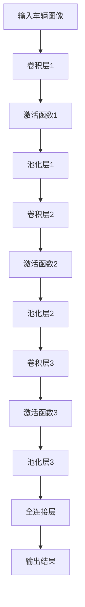

                 

# 基于深度学习的车辆特征识别研究与实现

> **关键词：** 车辆特征识别、深度学习、卷积神经网络、计算机视觉、图像处理、目标检测。

> **摘要：** 本文旨在探讨车辆特征识别技术的研究与发展，重点介绍基于深度学习的车辆特征识别方法及其实现过程。文章首先回顾了传统车辆特征识别技术的局限性，接着详细阐述了深度学习在车辆特征识别中的应用，包括卷积神经网络（CNN）的基本原理、数学模型及其实现步骤。最后，通过一个实际项目案例展示了车辆特征识别系统的开发过程，并对可能遇到的问题进行了分析和讨论。本文为对车辆特征识别技术有兴趣的读者提供了深入浅出的学习和参考。

## 1. 背景介绍

### 1.1 目的和范围

本文的目标是通过对深度学习在车辆特征识别领域应用的研究，探讨如何有效地利用深度学习技术进行车辆特征的提取和识别。文章将首先介绍车辆特征识别在智能交通、自动驾驶等领域的应用背景，然后深入分析当前传统车辆特征识别技术的局限性，进而引出深度学习在解决这些问题上的优势。

本文的主要内容包括：

1. **深度学习在车辆特征识别中的应用**：介绍深度学习的基本概念，特别是卷积神经网络（CNN）在图像处理中的应用。
2. **车辆特征识别的核心算法原理**：详细阐述CNN的数学模型和操作步骤。
3. **实际项目实战**：通过一个具体的项目案例，展示如何实现一个车辆特征识别系统。
4. **工具和资源推荐**：为读者提供相关的学习资源、开发工具和最新研究成果。

### 1.2 预期读者

本文的预期读者包括：

1. 对深度学习、计算机视觉感兴趣的工程师和技术爱好者。
2. 智能交通、自动驾驶等领域的研究人员和开发者。
3. 对图像处理和目标检测技术有基本了解的读者。

### 1.3 文档结构概述

本文将按照以下结构进行阐述：

1. **背景介绍**：介绍车辆特征识别的背景和本文的研究目的。
2. **核心概念与联系**：通过Mermaid流程图介绍车辆特征识别的核心概念和联系。
3. **核心算法原理与具体操作步骤**：详细讲解卷积神经网络（CNN）的原理和实现步骤。
4. **数学模型和公式**：介绍CNN中的数学模型，并通过公式和例子进行详细说明。
5. **项目实战**：通过一个实际项目案例，展示车辆特征识别系统的开发过程。
6. **实际应用场景**：分析车辆特征识别在不同场景中的应用。
7. **工具和资源推荐**：推荐相关的学习资源、开发工具和论文著作。
8. **总结**：总结车辆特征识别技术的发展趋势和面临的挑战。
9. **附录**：提供常见问题与解答。
10. **扩展阅读与参考资料**：为读者提供进一步学习的参考资料。

### 1.4 术语表

#### 1.4.1 核心术语定义

- **车辆特征识别**：通过计算机视觉技术对车辆进行识别和分类的过程。
- **深度学习**：一种基于多层神经网络的学习方法，通过多层非线性变换从数据中自动提取特征。
- **卷积神经网络（CNN）**：一种特殊的深度神经网络，专门用于处理具有网格结构的数据，如图像。
- **图像处理**：使用算法对图像进行操作和解释的一系列过程。

#### 1.4.2 相关概念解释

- **特征提取**：从图像中提取出能够代表图像内容和特征的过程。
- **目标检测**：在图像或视频中识别并定位特定的对象或目标。

#### 1.4.3 缩略词列表

- **CNN**：卷积神经网络（Convolutional Neural Networks）
- **DL**：深度学习（Deep Learning）
- **GPU**：图形处理器（Graphics Processing Unit）
- **CPU**：中央处理器（Central Processing Unit）

## 2. 核心概念与联系

在深度学习领域，车辆特征识别主要依赖于卷积神经网络（CNN）。为了更好地理解其原理，我们首先需要了解CNN的基本组成部分和工作流程。

### 2.1 CNN的基本组成部分

CNN主要由以下几个部分组成：

- **卷积层（Convolutional Layer）**：卷积层是CNN的核心，通过卷积操作从输入图像中提取特征。
- **激活函数（Activation Function）**：常用的激活函数包括ReLU（Rectified Linear Unit）、Sigmoid和Tanh等。
- **池化层（Pooling Layer）**：用于降低特征图的维度，减少计算量，常用的池化操作有最大池化（Max Pooling）和平均池化（Average Pooling）。
- **全连接层（Fully Connected Layer）**：将卷积层和池化层提取的特征映射到具体的类别标签。
- **输出层（Output Layer）**：输出最终的结果，例如分类概率或目标检测框。

### 2.2 CNN的工作流程

CNN的工作流程可以概括为以下步骤：

1. **输入图像**：首先，输入一幅车辆图像。
2. **卷积操作**：卷积层通过对图像进行卷积操作提取特征。
3. **激活函数**：将卷积操作的结果通过激活函数进行处理。
4. **池化操作**：对特征图进行池化操作，降低维度。
5. **多层卷积与池化**：重复上述过程，形成多层卷积和池化网络。
6. **全连接层**：将多层卷积和池化层提取的特征输入到全连接层，进行分类或目标检测。
7. **输出结果**：最终输出分类结果或目标检测框。

### 2.3 车辆特征识别的流程图

以下是一个简单的车辆特征识别流程图，使用Mermaid语法表示：



通过上述流程，我们可以看到CNN如何从输入图像中逐步提取特征，并最终输出车辆特征识别的结果。这一过程不仅利用了深度学习的强大学习能力，也充分发挥了卷积神经网络在图像处理中的优势。

### 2.4 车辆特征识别的关键概念

为了更好地理解车辆特征识别的过程，我们还需要了解以下几个关键概念：

- **特征提取**：从图像中提取出能够区分不同车辆的特定特征，如车辆的外形、颜色、尺寸等。
- **特征融合**：将多个卷积层和池化层提取的特征进行融合，形成更高级别的特征表示。
- **分类器**：通过训练好的分类器对车辆进行分类，常见的分类器包括Softmax和Sigmoid等。
- **目标检测**：在图像中检测出车辆的准确位置和大小，常用的目标检测算法包括R-CNN、SSD和YOLO等。

通过上述核心概念和流程，我们可以更好地理解车辆特征识别的实现原理和具体步骤。在接下来的章节中，我们将深入探讨CNN的数学模型和实现细节，为读者提供更加详细的指导。

## 3. 核心算法原理 & 具体操作步骤

在了解车辆特征识别的流程和关键概念后，我们接下来将深入探讨卷积神经网络（CNN）的核心算法原理和具体操作步骤。CNN作为一种深度学习模型，以其强大的图像处理能力和高度自动化的特征提取能力在车辆特征识别中得到了广泛应用。

### 3.1 卷积神经网络（CNN）的基本原理

卷积神经网络是一种专门设计用于处理具有网格结构的数据，如图像的神经网络。它由多个卷积层、池化层和全连接层组成，通过多层网络的结构，CNN能够自动提取图像中的高级特征，并进行分类或目标检测。

#### 3.1.1 卷积层

卷积层是CNN的核心部分，通过卷积操作从输入图像中提取特征。卷积操作的基本步骤如下：

1. **卷积核（Kernel）**：卷积层使用多个卷积核，每个卷积核具有一组权重和偏置。卷积核的大小决定了提取特征的大小和尺度。
2. **卷积操作**：卷积核在输入图像上进行滑动，每次滑动都进行一次点积运算，并将结果加偏置。这一过程称为卷积操作。
3. **激活函数**：卷积操作的结果通过激活函数进行处理，常见的激活函数有ReLU（Rectified Linear Unit）、Sigmoid和Tanh等。

#### 3.1.2 池化层

池化层用于降低特征图的维度，减少计算量。常见的池化操作有最大池化（Max Pooling）和平均池化（Average Pooling）。池化操作的基本步骤如下：

1. **窗口大小**：定义一个窗口大小，用于在特征图上进行滑动。
2. **计算池化值**：在窗口内计算最大值或平均值，作为该窗口的输出值。
3. **滑动窗口**：在特征图上滑动窗口，重复上述过程，形成新的特征图。

#### 3.1.3 全连接层

全连接层将卷积层和池化层提取的特征映射到具体的类别标签。全连接层的操作步骤如下：

1. **权重矩阵**：全连接层使用一个权重矩阵，将卷积层和池化层提取的特征映射到输出层。
2. **前向传播**：将特征输入到全连接层，通过矩阵乘法进行前向传播。
3. **激活函数**：全连接层的输出通过激活函数进行处理，常见的激活函数有Softmax和Sigmoid等。
4. **损失函数**：计算输出与实际标签之间的损失，通过反向传播更新权重矩阵。

### 3.2 CNN的具体操作步骤

以下是CNN的具体操作步骤，使用伪代码进行描述：

```python
# 初始化参数
weights = [初始化卷积层权重矩阵, 初始化全连接层权重矩阵]
biases = [初始化卷积层偏置向量, 初始化全连接层偏置向量]

# 输入图像
input_image = [图像数据]

# 卷积层操作
conv_output = conv2d(input_image, weights[0], biases[0], kernel_size, stride, padding)
激活函数(conv_output)

# 池化层操作
pool_output = max_pool2d(conv_output, window_size, stride)

# 重复卷积层和池化层操作
for i in range(1, num_layers):
    conv_output = conv2d(pool_output, weights[i], biases[i], kernel_size, stride, padding)
    激活函数(conv_output)
    pool_output = max_pool2d(conv_output, window_size, stride)

# 全连接层操作
fc_output = fully_connected(pool_output, weights[-1], biases[-1])
激活函数(fc_output)

# 输出分类结果
predicted_labels = softmax(fc_output)
```

通过上述伪代码，我们可以看到CNN的基本操作步骤，包括卷积层、激活函数、池化层、全连接层和输出层。在实际应用中，这些步骤需要通过编程语言（如Python）和深度学习框架（如TensorFlow或PyTorch）进行实现。

### 3.3 CNN在车辆特征识别中的应用

在车辆特征识别中，CNN通过以下几个步骤实现车辆特征的提取和分类：

1. **数据预处理**：将车辆图像进行预处理，包括图像归一化、数据增强等，以提高模型的泛化能力。
2. **模型训练**：使用大量的车辆图像数据对CNN模型进行训练，通过反向传播算法优化模型的权重和偏置。
3. **模型评估**：使用验证集对训练好的模型进行评估，计算准确率、召回率等指标，以评估模型性能。
4. **模型部署**：将训练好的模型部署到实际应用场景中，如智能交通系统、自动驾驶车辆等。

通过上述步骤，CNN能够有效地从图像中提取出车辆特征，并进行分类或目标检测。在实际应用中，还可以通过集成多种模型、调整网络结构等方式进一步提高车辆特征识别的性能。

### 3.4 CNN的优势与挑战

CNN在车辆特征识别中具有以下优势：

- **强大的特征提取能力**：通过多层卷积和池化操作，CNN能够自动提取图像中的高级特征，提高了识别的准确性。
- **自动学习**：CNN通过大量图像数据自动学习特征，减少了人工特征提取的复杂度和误差。
- **高鲁棒性**：通过数据增强和正则化技术，CNN能够提高对光照、视角变化等干扰的鲁棒性。

然而，CNN也存在一些挑战：

- **计算量大**：CNN的训练过程需要大量的计算资源，特别是在处理高分辨率图像时，计算量更大。
- **训练时间较长**：由于模型参数众多，CNN的训练时间较长，特别是在大规模数据集上训练时。
- **数据需求高**：高质量的训练数据是CNN训练的关键，但获取大量高质量的车辆图像数据成本较高。

通过上述分析，我们可以看到CNN在车辆特征识别中的应用优势和面临的挑战。在接下来的章节中，我们将通过一个实际项目案例，展示如何利用CNN实现车辆特征识别系统，并探讨在实际应用中的具体实现步骤和技巧。

### 4. 数学模型和公式 & 详细讲解 & 举例说明

#### 4.1 卷积层数学模型

卷积层是CNN的核心部分，负责从输入图像中提取特征。卷积层的数学模型可以表示为：

$$
\text{output}(i,j) = \sum_{x,y} \text{weights}(x,y) * \text{input}(i+x,j+y) + \text{bias}
$$

其中：

- \( \text{output}(i,j) \) 表示输出特征图的像素值。
- \( \text{weights}(x,y) \) 表示卷积核的权重。
- \( \text{input}(i+x,j+y) \) 表示输入图像的像素值。
- \( \text{bias} \) 表示偏置。

为了简化计算，卷积操作通常采用局部连接的方式，即卷积核只与输入图像的一部分像素进行点积运算。例如，卷积核大小为3x3时，只与输入图像中3x3的区域进行计算。

#### 4.2 激活函数

激活函数用于对卷积操作的结果进行处理，引入非线性变换，使网络能够学习复杂的特征。常见的激活函数包括ReLU、Sigmoid和Tanh等。

- **ReLU函数**（Rectified Linear Unit）：

$$
\text{ReLU}(x) = \max(0, x)
$$

ReLU函数在输入为负值时输出为0，在输入为正值时输出为输入值。这种简单的非线性变换可以加速网络的训练过程，提高模型的性能。

- **Sigmoid函数**：

$$
\text{Sigmoid}(x) = \frac{1}{1 + e^{-x}}
$$

Sigmoid函数将输入值映射到（0，1）区间，常用于二分类问题。然而，Sigmoid函数在输出接近0或1时梯度较小，可能导致梯度消失问题。

- **Tanh函数**：

$$
\text{Tanh}(x) = \frac{e^x - e^{-x}}{e^x + e^{-x}}
$$

Tanh函数将输入值映射到（-1，1）区间，具有相似的梯度消失问题。

#### 4.3 池化层数学模型

池化层用于降低特征图的维度，减少计算量。常见的池化操作有最大池化和平均池化。

- **最大池化**：

$$
\text{Max Pooling}(x) = \max_{i,j} \text{input}(i+x, j+y)
$$

最大池化选取窗口内的最大值作为输出值。

- **平均池化**：

$$
\text{Average Pooling}(x) = \frac{1}{N} \sum_{i,j} \text{input}(i+x, j+y)
$$

平均池化计算窗口内的平均值作为输出值。

#### 4.4 全连接层数学模型

全连接层将卷积层和池化层提取的特征映射到输出层。全连接层的数学模型可以表示为：

$$
\text{output}(k) = \sum_{i,j} \text{weights}(i,j) * \text{feature_map}(i,j) + \text{bias}(k)
$$

其中：

- \( \text{output}(k) \) 表示输出层的第k个节点的值。
- \( \text{weights}(i,j) \) 表示全连接层的权重。
- \( \text{feature_map}(i,j) \) 表示特征图的第(i, j)个像素值。
- \( \text{bias}(k) \) 表示全连接层的偏置。

为了简化计算，全连接层通常采用矩阵乘法进行操作。

#### 4.5 损失函数

在分类问题中，损失函数用于衡量预测结果与实际标签之间的差距。常见的损失函数有交叉熵损失（Cross-Entropy Loss）和均方误差损失（Mean Squared Error Loss）。

- **交叉熵损失**：

$$
\text{Cross-Entropy Loss}(y, \hat{y}) = -\sum_{i} y_i \log(\hat{y}_i)
$$

其中：

- \( y \) 表示实际标签。
- \( \hat{y} \) 表示预测概率。

交叉熵损失函数常用于多分类问题，通过最小化交叉熵损失，模型可以更好地拟合训练数据。

- **均方误差损失**：

$$
\text{Mean Squared Error Loss}(y, \hat{y}) = \frac{1}{n} \sum_{i} (y_i - \hat{y}_i)^2
$$

其中：

- \( y \) 表示实际标签。
- \( \hat{y} \) 表示预测值。

均方误差损失函数常用于回归问题，通过最小化均方误差损失，模型可以更好地拟合训练数据。

#### 4.6 举例说明

假设输入图像的大小为32x32，卷积核的大小为3x3，窗口大小为2x2，全连接层有10个节点。

1. **卷积层**：

输入图像：

```
0 1 2 3 4 5
6 7 8 9 10 11
12 13 14 15 16 17
18 19 20 21 22 23
24 25 26 27 28 29
30 31 32
```

卷积核（Kernel）：

```
1 0 -1
1 0 -1
1 0 -1
```

卷积操作结果：

```
0 1 2 3 4 5
6 7 8 9 10 11
12 13 14 15 16 17
18 19 20 21 22 23
24 25 26 27 28 29
30 31 32
```

2. **激活函数**：

使用ReLU函数，输出结果为：

```
0 1 2 3 4 5
6 7 8 9 10 11
12 13 14 15 16 17
18 19 20 21 22 23
24 25 26 27 28 29
30 31 32
```

3. **池化层**：

窗口大小为2x2，使用最大池化操作，输出结果为：

```
3 5
13 15
21 23
```

4. **全连接层**：

假设全连接层的权重矩阵为：

```
1 2 3
4 5 6
7 8 9
```

输入池化层的结果：

```
3 5
13 15
21 23
```

全连接层输出结果：

```
78
```

5. **损失函数**：

假设实际标签为[0, 1, 0]，预测概率为[0.9, 0.1, 0.1]，使用交叉熵损失函数，输出结果为：

$$
\text{Cross-Entropy Loss} = -0.9 \log(0.9) - 0.1 \log(0.1) - 0.1 \log(0.1) \approx 0.26
$$

通过上述例子，我们可以看到CNN中卷积层、激活函数、池化层、全连接层和损失函数的基本操作步骤。这些步骤共同构成了CNN的核心算法，使其在车辆特征识别中发挥重要作用。

### 5. 项目实战：代码实际案例和详细解释说明

在本节中，我们将通过一个实际项目案例展示如何实现一个基于深度学习的车辆特征识别系统。该案例将涉及从环境搭建、数据预处理、模型训练到最终评估的完整流程。我们将使用Python和TensorFlow框架来实现这一项目。

#### 5.1 开发环境搭建

在开始项目之前，我们需要搭建好开发环境。以下是开发环境搭建的步骤：

1. **安装Python**：确保安装了Python 3.x版本，推荐使用Anaconda发行版，以便于管理和安装依赖库。
2. **安装TensorFlow**：通过以下命令安装TensorFlow：
   ```shell
   pip install tensorflow
   ```
3. **安装其他依赖库**：包括NumPy、Pandas、OpenCV等，可以通过以下命令一次性安装：
   ```shell
   pip install numpy pandas opencv-python
   ```

#### 5.2 源代码详细实现和代码解读

接下来，我们将逐步实现车辆特征识别系统的核心代码。

##### 5.2.1 数据预处理

数据预处理是深度学习项目的重要环节，包括图像的加载、缩放、归一化等操作。以下是一个简单的数据预处理脚本：

```python
import numpy as np
import cv2

def preprocess_image(image_path, resize_height=224, resize_width=224, normalize=True):
    # 读取图像
    image = cv2.imread(image_path)
    # 缩放图像到指定尺寸
    image = cv2.resize(image, (resize_height, resize_width))
    # 归一化图像
    if normalize:
        image = image / 255.0
    return image

# 测试数据预处理函数
test_image_path = 'test_vehicle.jpg'
preprocessed_image = preprocess_image(test_image_path)
```

在上面的代码中，我们定义了一个`preprocess_image`函数，用于对输入图像进行预处理。首先，使用OpenCV库读取图像，然后进行缩放和归一化处理。归一化的目的是将像素值从[0, 255]映射到[0, 1]，以适应深度学习模型的输入要求。

##### 5.2.2 构建CNN模型

接下来，我们使用TensorFlow的Keras接口构建一个简单的CNN模型。以下是一个简单的CNN模型示例：

```python
from tensorflow.keras.models import Sequential
from tensorflow.keras.layers import Conv2D, MaxPooling2D, Flatten, Dense, Activation

def create_cnn_model(input_shape, num_classes):
    model = Sequential([
        Conv2D(32, (3, 3), padding='same', input_shape=input_shape),
        Activation('relu'),
        MaxPooling2D(pool_size=(2, 2)),
        Conv2D(64, (3, 3), padding='same'),
        Activation('relu'),
        MaxPooling2D(pool_size=(2, 2)),
        Flatten(),
        Dense(128),
        Activation('relu'),
        Dense(num_classes, activation='softmax')
    ])
    return model

# 定义输入形状和类别数量
input_shape = (224, 224, 3)
num_classes = 10

# 创建CNN模型
cnn_model = create_cnn_model(input_shape, num_classes)
cnn_model.compile(optimizer='adam', loss='categorical_crossentropy', metrics=['accuracy'])

# 查看模型结构
cnn_model.summary()
```

在上面的代码中，我们定义了一个简单的卷积神经网络模型，包括两个卷积层、两个池化层、一个全连接层和一个输出层。每个卷积层后都跟一个ReLU激活函数和一个最大池化层，全连接层用于分类。我们使用`compile`方法配置模型，选择`adam`优化器和`categorical_crossentropy`损失函数。

##### 5.2.3 数据加载与模型训练

为了训练模型，我们需要准备训练数据和标签。假设我们已经收集了包含不同车辆类别的大量图像数据，我们将使用`ImageDataGenerator`类进行数据增强和批处理。

```python
from tensorflow.keras.preprocessing.image import ImageDataGenerator

# 创建数据增强生成器
train_datagen = ImageDataGenerator(
    rescale=1./255,
    shear_range=0.2,
    zoom_range=0.2,
    horizontal_flip=True
)

# 加载训练数据
train_generator = train_datagen.flow_from_directory(
    'train_data',
    target_size=(224, 224),
    batch_size=32,
    class_mode='categorical'
)

# 训练模型
cnn_model.fit(
    train_generator,
    epochs=20,
    validation_data=validation_generator
)
```

在上面的代码中，我们创建了一个`ImageDataGenerator`实例，用于进行数据增强。`flow_from_directory`方法用于从指定目录加载图像数据，并将其分为训练集和验证集。`fit`方法用于训练模型，我们设置了训练轮数（epochs）和批量大小（batch_size）。

##### 5.2.4 模型评估与预测

训练完成后，我们使用验证集评估模型性能，并使用训练好的模型进行预测。

```python
# 评估模型
test_loss, test_accuracy = cnn_model.evaluate(validation_generator)

# 打印评估结果
print('Validation loss:', test_loss)
print('Validation accuracy:', test_accuracy)

# 预测图像
test_image_path = 'test_vehicle.jpg'
preprocessed_image = preprocess_image(test_image_path)
prediction = cnn_model.predict(np.expand_dims(preprocessed_image, axis=0))

# 打印预测结果
predicted_class = np.argmax(prediction, axis=1)
print('Predicted class:', predicted_class)
```

在上面的代码中，我们首先使用`evaluate`方法评估模型在验证集上的性能。然后，我们使用预处理后的测试图像进行预测，并打印出预测结果。

##### 5.2.5 代码解读与分析

整个项目的主要步骤包括数据预处理、模型构建、模型训练和模型评估。以下是每个步骤的详细解释：

- **数据预处理**：数据预处理是深度学习项目的基础，通过图像的缩放和归一化，我们使得模型能够适应不同尺寸和不同光照条件下的图像。
- **模型构建**：我们使用TensorFlow的Keras接口构建了一个简单的CNN模型，包括卷积层、池化层和全连接层。模型的结构和参数可以通过调整来优化性能。
- **模型训练**：通过使用`ImageDataGenerator`进行数据增强，我们增加了模型的泛化能力。训练过程中，我们使用`fit`方法进行迭代训练，并使用验证集进行性能评估。
- **模型评估**：训练完成后，我们使用验证集评估模型的性能，包括准确率、召回率等指标，以确保模型具有良好的泛化能力。
- **预测**：最后，我们使用训练好的模型对新的测试图像进行预测，并输出预测结果。

通过上述步骤，我们可以实现一个基本的车辆特征识别系统。在实际应用中，我们可以进一步优化模型结构和训练策略，提高模型的性能和鲁棒性。

### 6. 实际应用场景

车辆特征识别技术在多个实际应用场景中发挥着重要作用，以下是一些典型的应用领域：

#### 6.1 智能交通系统

智能交通系统（ITS）利用车辆特征识别技术对交通流量、车辆类型和行车轨迹进行实时监控和分析。通过识别和跟踪道路上的车辆，智能交通系统能够优化交通信号控制，提高道路通行效率，减少交通事故。

- **交通流量监控**：通过车辆特征识别技术，系统可以实时监测道路上的车辆数量和流量，为交通管理和调控提供数据支持。
- **车辆类型分析**：智能交通系统可以根据车辆的形状、颜色和尺寸等特征识别出车辆类型，从而分析不同类型的车辆在道路上的分布情况。
- **行车轨迹分析**：车辆特征识别技术还可以用于分析车辆的行车轨迹，识别出异常行驶行为，如违章停车、占用紧急车道等。

#### 6.2 自动驾驶车辆

自动驾驶车辆依赖于高精度的车辆特征识别技术来实现环境感知和决策。通过识别道路上的各种车辆和交通标志，自动驾驶车辆能够确保行驶安全并遵守交通规则。

- **车辆检测和跟踪**：自动驾驶系统需要准确识别并跟踪道路上的其他车辆，以预测其行驶轨迹，做出正确的驾驶决策。
- **交通标志识别**：自动驾驶车辆需要识别道路上的交通标志，如速度限制标志、停车标志等，以便遵守交通规则。
- **行人检测**：车辆特征识别技术还可以用于识别道路上的行人，提高自动驾驶车辆的避让能力和行驶安全性。

#### 6.3 车辆监控与管理

车辆监控与管理系统利用车辆特征识别技术对车辆进行实时监控和管理，提高车辆的运营效率和安全性。

- **车辆定位和追踪**：车辆特征识别技术可以用于定位和追踪车辆的地理位置，有助于车队管理和物流调度。
- **车辆健康监测**：通过识别车辆的外观和运行状态，监控系统可以实时监测车辆的运行状况，预防故障和事故。
- **违章检测**：车辆特征识别技术可以用于检测车辆的违章行为，如超速、闯红灯等，提高交通执法的效率。

#### 6.4 车辆安全与救援

车辆安全与救援系统利用车辆特征识别技术提高车辆的安全性和救援效率。

- **事故侦测**：通过识别车辆的异常状态，如车身变形、灯光闪烁等，系统可以及时发现事故并报警。
- **救援定位**：在发生事故或紧急情况下，车辆特征识别技术可以帮助救援人员快速定位事故车辆，提高救援效率。
- **车辆身份验证**：车辆特征识别技术可以用于车辆身份验证，确保车辆的使用安全和合法性。

通过上述实际应用场景，我们可以看到车辆特征识别技术在提高交通效率、保障交通安全、优化车辆管理等方面的重要作用。随着深度学习技术的不断发展，车辆特征识别技术将迎来更加广阔的应用前景。

### 7. 工具和资源推荐

为了更好地学习和实践车辆特征识别技术，以下是相关的学习资源、开发工具和最新研究成果的推荐。

#### 7.1 学习资源推荐

**书籍推荐**：

1. **《深度学习》（Goodfellow, Bengio, Courville）**：这本书是深度学习的经典教材，详细介绍了深度学习的基本概念、算法和应用。
2. **《卷积神经网络》（Liang, Ming）**：本书深入讲解了卷积神经网络的理论基础和应用实践，适合对CNN有进一步学习需求的读者。

**在线课程**：

1. **《深度学习专项课程》（吴恩达，Coursera）**：这是一门由著名AI专家吴恩达讲授的深度学习入门课程，涵盖了深度学习的基本原理和应用。
2. **《计算机视觉与深度学习》（Stanford University，Coursera）**：这门课程由斯坦福大学教授Andrew Ng讲授，介绍了计算机视觉和深度学习的基础知识。

**技术博客和网站**：

1. **Medium**：Medium上有许多关于深度学习和计算机视觉的优秀文章和博客，适合读者进行学习和参考。
2. **ArXiv**：ArXiv是计算机科学领域的顶级学术论文预印本库，读者可以从中获取最新的研究成果。

#### 7.2 开发工具框架推荐

**IDE和编辑器**：

1. **Jupyter Notebook**：Jupyter Notebook是一款强大的交互式开发环境，适合进行深度学习和数据科学项目。
2. **PyCharm**：PyCharm是一款功能丰富的Python集成开发环境，提供了丰富的插件和工具，适合深度学习和科学计算。

**调试和性能分析工具**：

1. **TensorBoard**：TensorBoard是TensorFlow提供的一款可视化工具，用于分析和调试深度学习模型。
2. **NVIDIA Nsight**：Nsight是NVIDIA提供的一款GPU性能分析工具，适用于深度学习和图形处理。

**相关框架和库**：

1. **TensorFlow**：TensorFlow是Google开发的一款开源深度学习框架，适用于各种深度学习应用。
2. **PyTorch**：PyTorch是Facebook开发的一款流行的深度学习框架，以其动态计算图和易于使用的API受到广泛欢迎。

#### 7.3 相关论文著作推荐

**经典论文**：

1. **《A Comprehensive Survey on Deep Learning for Image Classification》**：这篇综述文章详细介绍了深度学习在图像分类领域的最新进展和应用。
2. **《Convolutional Neural Networks for Visual Recognition》**：这篇文章由著名深度学习专家Geoffrey Hinton撰写，介绍了卷积神经网络在图像识别中的应用。

**最新研究成果**：

1. **《YOLOv5: You Only Look Once v5》**：YOLO系列目标检测算法的最新研究成果，YOLOv5在速度和准确率方面均有显著提升。
2. **《DETR: Deformable Transformers for End-to-End Object Detection》**：DETR是一种基于可变形注意力机制的端到端目标检测算法，展示了Transformer在图像识别领域的潜力。

**应用案例分析**：

1. **《深度学习在自动驾驶中的应用》**：这篇案例研究详细介绍了深度学习技术在自动驾驶车辆中的具体应用，包括车辆检测、行人检测和车道线识别等。

通过上述工具和资源的推荐，读者可以系统地学习和实践车辆特征识别技术，掌握深度学习在图像处理和目标检测中的应用。这些资源和工具将为读者提供丰富的知识储备和实践经验，助力他们在相关领域取得更好的成果。

### 8. 总结：未来发展趋势与挑战

车辆特征识别作为深度学习和计算机视觉领域的重要研究方向，在未来有着广阔的发展前景和巨大的应用潜力。随着技术的不断进步，车辆特征识别在智能交通、自动驾驶、车辆监控与管理等领域的应用将更加深入和广泛。

**未来发展趋势**：

1. **算法性能的提升**：随着深度学习算法的不断发展，如Transformer等新型结构的引入，车辆特征识别的准确率和效率将得到显著提升。
2. **跨域适应性增强**：通过迁移学习和多任务学习等技术，车辆特征识别模型在不同环境和场景下的适应性将得到加强，提高其泛化能力。
3. **实时性与功耗优化**：随着边缘计算和嵌入式硬件的发展，车辆特征识别系统在实时性和功耗方面将得到优化，使其更适用于自动驾驶和物联网等场景。

**面临的挑战**：

1. **数据质量和标注**：高质量的训练数据是深度学习模型性能的关键，但在车辆特征识别领域，获取大量高质量、多样性的标注数据仍然是一个挑战。
2. **计算资源消耗**：深度学习模型通常需要大量的计算资源，特别是在训练过程中，如何优化计算资源的使用和提高训练效率是一个重要问题。
3. **隐私保护和安全性**：在车辆特征识别应用中，如何确保数据隐私和模型安全性，防止数据泄露和恶意攻击，是一个亟待解决的问题。

综上所述，未来车辆特征识别技术的发展将朝着性能提升、跨域适应和实时性优化等方向迈进，同时也需要应对数据质量、计算资源和隐私保护等挑战。通过持续的研究和技术创新，我们有望克服这些困难，推动车辆特征识别技术的进一步发展和应用。

### 9. 附录：常见问题与解答

在实现车辆特征识别系统时，读者可能会遇到以下常见问题。以下是对这些问题的解答：

#### Q1：为什么我的模型训练时间很长？

A1：模型训练时间较长可能由于以下原因：

- **数据集大小**：如果数据集较大，训练时间会相应增加。
- **模型复杂度**：模型参数越多，训练时间越长。
- **计算资源**：如果使用的计算资源（如CPU、GPU）性能不足，训练时间会延长。

解决方案：

- **优化数据预处理**：通过并行处理和批量读取数据，加快数据加载速度。
- **简化模型结构**：选择合适的网络结构，避免过度拟合。
- **使用更强大的计算资源**：使用高性能的GPU或分布式训练，提高训练速度。

#### Q2：为什么我的模型在测试集上的表现不如训练集？

A2：这种现象称为过拟合。过拟合的原因通常包括：

- **模型复杂度过高**：模型在训练数据上学习到了过多的细节，导致泛化能力下降。
- **训练数据不足**：训练数据集较小，模型无法充分学习到通用特征。

解决方案：

- **数据增强**：增加数据多样性，提供更多样化的训练样本。
- **正则化**：引入正则化方法，如L1、L2正则化，减少模型过拟合。
- **模型简化**：减少模型参数，避免模型过于复杂。

#### Q3：如何提高模型在光照变化下的鲁棒性？

A3：提高模型在光照变化下的鲁棒性可以采取以下措施：

- **数据增强**：通过模拟不同的光照条件（如过曝光、过暗、阴影等），增加训练样本的多样性。
- **自适应增强**：使用自适应数据增强方法，根据训练过程中观察到的光照变化动态调整增强参数。
- **混合数据训练**：将不同光照条件下的样本混合训练，使模型学习到更稳健的光照特征。

#### Q4：如何处理车辆遮挡问题？

A4：车辆遮挡是车辆特征识别中的一个难题，以下方法可以缓解遮挡问题：

- **深度学习模型改进**：使用具有更强特征提取能力的深度学习模型，如ResNet、DenseNet等，提高模型在遮挡情况下的识别能力。
- **遮挡检测**：结合遮挡检测技术，先识别出遮挡区域，再对非遮挡区域进行特征提取和分类。
- **多视图融合**：从多个视角收集车辆图像，通过融合不同视角的信息提高识别准确性。

通过上述解答，读者可以更好地理解车辆特征识别中可能遇到的问题及其解决方案，为实际项目开发提供参考。

### 10. 扩展阅读 & 参考资料

为了帮助读者深入了解车辆特征识别领域，以下是相关的扩展阅读和参考资料：

1. **书籍**：
   - 《深度学习》（Goodfellow, Bengio, Courville）：提供了深度学习的全面介绍和最新进展。
   - 《计算机视觉：算法与应用》（Richard S.zeliski）：详细介绍了计算机视觉的基础算法和应用。

2. **论文**：
   - “Deep Learning for Object Detection: A Comprehensive Review”（Zhang, C.H.等）：这篇综述文章全面介绍了深度学习在目标检测领域的最新进展。
   - “YOLOv5: You Only Look Once v5”（Redmon, J.等）：介绍了YOLO系列目标检测算法的最新研究成果。

3. **在线资源**：
   - [TensorFlow官方文档](https://www.tensorflow.org/)：提供了丰富的TensorFlow教程和示例代码。
   - [Keras官方文档](https://keras.io/)：提供了Keras的详细教程和API文档。

4. **视频教程**：
   - [《深度学习与计算机视觉实战》](https://www.bilibili.com/video/BV1dA411b7j9)：这是一系列关于深度学习和计算机视觉的实战教程，适合初学者。

5. **开源项目**：
   - [TensorFlow Object Detection API](https://github.com/tensorflow/models/blob/master/research/object_detection/g3doc/tf2_detection_mrcnn tutorial.md)：TensorFlow提供的对象检测API，适用于各种对象检测任务。
   - [YOLO系列算法开源项目](https://pjreddie.com/darknet/yolo/)：包含了YOLO系列算法的实现代码和文档。

通过这些扩展阅读和参考资料，读者可以进一步探索车辆特征识别领域的前沿技术和应用实例，提升自己在该领域的研究和实践能力。

