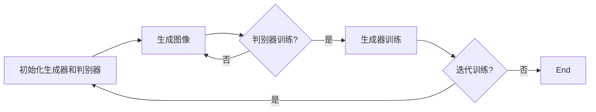

                 

# 基于人像摄影风格自动学习与迁移系统的生成对抗网络技术探讨

> **关键词：** 人像摄影风格，自动学习，迁移系统，生成对抗网络，图像生成，深度学习，图像风格迁移

> **摘要：** 本文主要探讨了一种基于生成对抗网络（GAN）的人像摄影风格自动学习与迁移系统。通过深入分析GAN的核心算法原理及其在图像生成和风格迁移中的应用，本文详细阐述了系统的实现步骤和数学模型，并结合实际项目案例进行了代码解读与分析。本文旨在为从事人工智能领域的研究者和开发者提供一种实用的技术解决方案，以推动人像摄影风格迁移技术的发展。

## 1. 背景介绍

### 1.1 目的和范围

近年来，随着深度学习和生成对抗网络（GAN）技术的飞速发展，图像生成和风格迁移在计算机视觉领域取得了显著的成果。尤其是人像摄影风格迁移，成为了图像处理和计算机视觉领域中一个极具挑战性的研究方向。本文旨在研究一种基于生成对抗网络的人像摄影风格自动学习与迁移系统，通过自动学习目标风格图像的特征，实现对输入人像图像的风格迁移。

本文主要研究内容包括：

1. **生成对抗网络（GAN）原理及算法架构**：详细分析GAN的工作原理、算法框架及其在图像生成和风格迁移中的应用。
2. **人像摄影风格自动学习与迁移系统**：介绍系统的整体架构，包括数据预处理、模型训练、风格迁移及性能评估等关键环节。
3. **数学模型和公式解析**：阐述系统所使用的数学模型和公式，并举例说明其具体应用。
4. **项目实战：代码实际案例**：通过具体代码实现，详细解读系统的开发过程和关键步骤。
5. **实际应用场景与工具推荐**：分析系统的实际应用场景，并推荐相关学习资源和开发工具。

### 1.2 预期读者

本文适用于以下读者群体：

1. **人工智能和计算机视觉领域的研究者**：希望了解生成对抗网络（GAN）在图像生成和风格迁移中的应用。
2. **深度学习和神经网络开发者**：希望学习如何利用GAN实现人像摄影风格自动学习与迁移系统。
3. **图像处理和计算机视觉工程师**：希望掌握基于GAN的技术，为实际项目提供解决方案。

### 1.3 文档结构概述

本文结构如下：

1. **第1章：背景介绍**：介绍研究背景、目的和预期读者，概述本文的结构和内容。
2. **第2章：核心概念与联系**：阐述生成对抗网络（GAN）的核心概念、算法原理及其在图像生成和风格迁移中的应用。
3. **第3章：核心算法原理与具体操作步骤**：详细分析GAN的算法原理，使用伪代码描述具体操作步骤。
4. **第4章：数学模型和公式及详细讲解**：介绍系统所使用的数学模型和公式，并进行举例说明。
5. **第5章：项目实战：代码实际案例和详细解释说明**：通过具体代码实现，详细解读系统的开发过程和关键步骤。
6. **第6章：实际应用场景**：分析系统的实际应用场景。
7. **第7章：工具和资源推荐**：推荐学习资源和开发工具。
8. **第8章：总结：未来发展趋势与挑战**：总结本文的研究成果，展望未来发展趋势和挑战。
9. **第9章：附录：常见问题与解答**：解答读者可能遇到的问题。
10. **第10章：扩展阅读与参考资料**：提供相关的扩展阅读和参考资料。

### 1.4 术语表

#### 1.4.1 核心术语定义

- **生成对抗网络（GAN）**：一种由生成器和判别器组成的深度学习模型，旨在通过相互博弈的方式生成逼真的图像。
- **图像生成**：利用深度学习模型生成新的图像。
- **图像风格迁移**：将一种图像的风格应用到另一种图像上。
- **损失函数**：衡量模型预测值与真实值之间差异的指标，用于指导模型训练。

#### 1.4.2 相关概念解释

- **生成器（Generator）**：GAN中的生成器是一个深度神经网络，其目标是生成与真实图像相似的图像。
- **判别器（Discriminator）**：GAN中的判别器是一个深度神经网络，其目标是区分生成器生成的图像和真实图像。
- **训练数据集**：用于训练GAN的图像数据集。

#### 1.4.3 缩略词列表

- **GAN**：生成对抗网络（Generative Adversarial Networks）
- **DNN**：深度神经网络（Deep Neural Network）
- **CNN**：卷积神经网络（Convolutional Neural Network）
- **ReLU**：ReLU激活函数（Rectified Linear Unit）

## 2. 核心概念与联系

在本文中，我们将详细介绍生成对抗网络（GAN）的核心概念、算法原理及其在图像生成和风格迁移中的应用。为了更好地理解GAN的工作机制，我们首先需要了解其基本架构和组成部分。

### 2.1 GAN的架构

生成对抗网络（GAN）由两部分组成：生成器和判别器。这两部分通过相互博弈的方式共同训练，以实现图像生成和风格迁移的目标。

#### 生成器（Generator）

生成器的目的是生成与真实图像相似的新图像。它通常是一个深度神经网络，包含多个隐含层和输出层。输入层的输入可以是随机噪声或者部分真实图像，输出层生成目标图像。生成器通过学习真实图像和随机噪声的映射关系，逐渐提高生成图像的质量。

#### 判别器（Discriminator）

判别器的目的是判断输入图像是真实图像还是生成图像。它同样是一个深度神经网络，包含多个隐含层和输出层。输入层的输入是真实图像和生成图像，输出层是一个二分类器，输出值表示判别结果。判别器的目标是提高对生成图像的判别能力，从而减小生成器生成的图像质量。

#### 博弈过程

GAN的训练过程可以看作是一个博弈过程，生成器和判别器相互博弈，以实现最佳效果。具体来说，生成器和判别器在训练过程中分别最小化自己的损失函数，最大化对方的损失函数。

- **生成器的损失函数**：生成器的损失函数通常由两部分组成，一部分是生成器生成的图像与真实图像的相似度，另一部分是生成器生成的图像与判别器判为真实的概率。生成器通过最小化这两个损失函数，提高生成图像的质量。

- **判别器的损失函数**：判别器的损失函数由两部分组成，一部分是判别器对真实图像的判别能力，另一部分是判别器对生成图像的判别能力。判别器通过最小化这两个损失函数，提高对生成图像的判别能力。

#### GAN的训练过程

GAN的训练过程可以分为以下几个步骤：

1. **初始化生成器和判别器**：随机初始化生成器和判别器的参数。
2. **生成图像**：生成器根据输入噪声生成一组图像。
3. **判别器训练**：判别器根据真实图像和生成图像训练自己的参数，以提高对生成图像的判别能力。
4. **生成器训练**：生成器根据判别器的输出和真实图像训练自己的参数，以提高生成图像的质量。
5. **迭代训练**：重复执行步骤2-4，直到生成器生成的图像质量达到预期。

### 2.2 GAN在图像生成和风格迁移中的应用

生成对抗网络（GAN）在图像生成和风格迁移中具有广泛的应用。以下简要介绍GAN在这两个领域中的应用：

#### 图像生成

GAN可以通过学习真实图像的分布来生成新的图像。例如，可以在GAN的基础上实现图像超分辨率、图像修复、图像合成等任务。通过生成器和判别器的博弈过程，GAN可以生成具有高逼真度的图像。

#### 图像风格迁移

图像风格迁移是将一种图像的风格应用到另一种图像上的过程。GAN可以通过学习目标风格图像的特征，将目标风格应用于输入图像。例如，可以将梵高的风格应用于现实世界中的图像，实现逼真的风格迁移效果。

### 2.3 GAN的算法原理

生成对抗网络的算法原理主要基于以下几个方面：

1. **随机噪声输入**：生成器的输入是一个随机噪声向量，通过这个噪声向量生成目标图像。
2. **特征映射**：生成器和判别器都是深度神经网络，通过学习特征映射来提高生成图像的质量。
3. **对抗训练**：生成器和判别器通过对抗训练，相互博弈，以实现最佳效果。
4. **损失函数**：生成器和判别器通过最小化自己的损失函数，最大化对方的损失函数，实现图像生成和风格迁移。

#### 2.4 GAN的Mermaid流程图

以下是GAN的Mermaid流程图：



## 3. 核心算法原理 & 具体操作步骤

在前一章节中，我们介绍了生成对抗网络（GAN）的核心概念和算法原理。本章节将详细分析GAN的算法原理，并使用伪代码描述具体操作步骤。

### 3.1 GAN的算法原理

GAN由两部分组成：生成器和判别器。生成器的目标是生成与真实图像相似的图像，而判别器的目标是判断输入图像是真实图像还是生成图像。生成器和判别器通过相互博弈的方式共同训练，以达到图像生成和风格迁移的目标。

#### 3.1.1 生成器

生成器是一个深度神经网络，其目的是生成与真实图像相似的图像。生成器的输入是一个随机噪声向量，通过这个噪声向量生成目标图像。

#### 3.1.2 判别器

判别器是一个深度神经网络，其目的是判断输入图像是真实图像还是生成图像。判别器的输入是真实图像和生成图像，输出是一个二分类器的概率值，表示输入图像是真实图像的概率。

#### 3.1.3 对抗训练

生成器和判别器通过对抗训练，相互博弈，以实现最佳效果。生成器通过最小化生成图像的判别损失函数，提高生成图像的质量。判别器通过最小化生成图像的判别损失函数，提高对生成图像的判别能力。

### 3.2 GAN的具体操作步骤

以下是GAN的具体操作步骤：

```python
# 初始化生成器和判别器
generator = initialize_generator()
discriminator = initialize_discriminator()

# 初始化超参数
batch_size = 64
learning_rate = 0.0002
num_epochs = 1000

# 迭代训练
for epoch in range(num_epochs):
    # 随机生成一批噪声向量
    noise = generate_noise(batch_size)

    # 生成一批生成图像
    generated_images = generator(noise)

    # 训练判别器
    real_images = load_real_images(batch_size)
    discriminator_loss = train_discriminator(real_images, generated_images)

    # 训练生成器
    generator_loss = train_generator(generated_images)

    # 打印训练进度
    print(f"Epoch [{epoch+1}/{num_epochs}], Discriminator Loss: {discriminator_loss}, Generator Loss: {generator_loss}")

    # 检查生成器性能
    if epoch % 100 == 0:
        evaluate_generator(generated_images)
```

#### 3.2.1 初始化生成器和判别器

初始化生成器和判别器是GAN训练的第一步。生成器和判别器都是深度神经网络，需要随机初始化其参数。初始化方法可以采用随机权重初始化、正态分布初始化等。

```python
def initialize_generator():
    # 实例化生成器模型
    generator = DNN([...])
    # 随机初始化生成器参数
    generator.initialize_params()
    return generator

def initialize_discriminator():
    # 实例化判别器模型
    discriminator = DNN([...])
    # 随机初始化判别器参数
    discriminator.initialize_params()
    return discriminator
```

#### 3.2.2 生成一批生成图像

生成一批生成图像是GAN训练的关键步骤。生成器根据输入噪声向量生成一批目标图像。生成器的输出是生成图像，需要通过判别器判断其真实性和质量。

```python
def generate_images(generator, noise):
    # 生成一批生成图像
    generated_images = generator(noise)
    return generated_images
```

#### 3.2.3 训练判别器

训练判别器是GAN训练的核心步骤。判别器需要判断输入图像是真实图像还是生成图像。通过对比真实图像和生成图像的判别结果，更新判别器的参数，提高判别器的判别能力。

```python
def train_discriminator(real_images, generated_images):
    # 训练判别器
    discriminator_loss = DNN.train(real_images, generated_images)
    return discriminator_loss
```

#### 3.2.4 训练生成器

训练生成器是GAN训练的关键步骤。生成器需要生成与真实图像相似的目标图像。通过对比生成图像和真实图像的判别结果，更新生成器的参数，提高生成图像的质量。

```python
def train_generator(generated_images):
    # 训练生成器
    generator_loss = DNN.train(generated_images)
    return generator_loss
```

#### 3.2.5 打印训练进度

在GAN训练过程中，需要定期打印训练进度，包括判别器和生成器的损失函数值。这有助于观察训练过程和调整超参数。

```python
print(f"Epoch [{epoch+1}/{num_epochs}], Discriminator Loss: {discriminator_loss}, Generator Loss: {generator_loss}")
```

#### 3.2.6 检查生成器性能

在GAN训练过程中，需要定期检查生成器的性能。这可以通过评估生成图像的逼真度、多样性等指标来实现。

```python
def evaluate_generator(generated_images):
    # 评估生成器性能
    # ...（评估代码）
```

通过以上步骤，我们可以实现基于生成对抗网络（GAN）的人像摄影风格自动学习与迁移系统。在实际应用中，可以根据具体需求调整生成器和判别器的结构、超参数等，以提高系统性能。

## 4. 数学模型和公式 & 详细讲解 & 举例说明

### 4.1 GAN的数学模型

生成对抗网络（GAN）的核心在于其对抗性训练过程，这一过程依赖于两个关键组件：生成器和判别器。为了更好地理解这两个组件的工作原理，我们需要引入相关的数学模型和公式。

#### 4.1.1 生成器（Generator）的数学模型

生成器的目标是生成与真实数据分布相近的数据。在GAN中，生成器通常被视为一个概率模型，它接受随机噪声向量\( z \)作为输入，并输出数据\( x^* \)：

\[ x^* = G(z) \]

其中，\( G \)是生成器模型，\( z \)是从一个先验分布（如正态分布）中抽取的随机噪声向量，\( x^* \)是生成器生成的数据。

#### 4.1.2 判别器（Discriminator）的数学模型

判别器的目标是判断输入数据是真实数据还是生成器生成的数据。在GAN中，判别器也是一个概率模型，它接受数据\( x \)作为输入，并输出一个概率值\( p(x) \)，表示输入数据是真实数据的概率：

\[ p(x) = D(x) \]

其中，\( D \)是判别器模型，\( x \)是输入数据（可以是真实数据或生成器生成的数据），\( p(x) \)是判别器对输入数据为真实数据的概率估计。

#### 4.1.3 GAN的整体数学模型

GAN的整体训练过程可以视为一个博弈过程，其中生成器和判别器是两个相互对抗的玩家。生成器试图最大化判别器对生成数据的判别错误率，而判别器则试图最大化生成器和真实数据的判别差距。这个博弈的数学表达如下：

\[ \min_G \max_D \mathbb{E}_{z \sim p_z(z)}[\log D(G(z))] + \mathbb{E}_{x \sim p_data(x)}[\log (1 - D(x))] \]

其中，\( \mathbb{E} \)表示期望值，\( p_z(z) \)是噪声向量\( z \)的先验分布，\( p_data(x) \)是真实数据分布。

- 第一项\( \mathbb{E}_{z \sim p_z(z)}[\log D(G(z))] \)是生成器的损失函数，表示生成器生成的数据在判别器中被判为真实的概率。
- 第二项\( \mathbb{E}_{x \sim p_data(x)}[\log (1 - D(x))] \)是判别器的损失函数，表示判别器对真实数据的判别能力。

### 4.2 GAN中的损失函数

在GAN中，生成器和判别器分别有不同的损失函数，这些损失函数通过优化过程来驱动生成器和判别器相互对抗。

#### 4.2.1 生成器的损失函数

生成器的损失函数通常采用Wasserstein距离或者反熵损失函数（如Jensen-Shannon Divergence，JSD）：

\[ L_G = -\mathbb{E}_{z \sim p_z(z)}[\log D(G(z))] \]

这个损失函数表示生成器生成的数据在判别器中被判为真实的概率，生成器的目标是最大化这个概率。

#### 4.2.2 判别器的损失函数

判别器的损失函数通常采用二元交叉熵损失函数：

\[ L_D = -\mathbb{E}_{x \sim p_data(x)}[\log D(x)] - \mathbb{E}_{z \sim p_z(z)}[\log (1 - D(G(z))] \]

这个损失函数表示判别器对真实数据和生成器生成的数据的判别能力，判别器的目标是最大化这个概率差距。

### 4.3 GAN中的数学公式详细讲解

#### 4.3.1 生成器的期望值计算

生成器的期望值计算可以通过以下公式进行：

\[ \mathbb{E}_{z \sim p_z(z)}[\log D(G(z))] = \int_{z} p_z(z) \log D(G(z)) \, dz \]

这个公式表示在噪声向量\( z \)的先验分布\( p_z(z) \)下，生成器生成的数据在判别器中被判为真实的期望概率。

#### 4.3.2 判别器的期望值计算

判别器的期望值计算可以通过以下公式进行：

\[ \mathbb{E}_{x \sim p_data(x)}[\log D(x)] = \int_{x} p_data(x) \log D(x) \, dx \]
\[ \mathbb{E}_{z \sim p_z(z)}[\log (1 - D(G(z))] = \int_{z} p_z(z) \log (1 - D(G(z))) \, dz \]

这些公式表示在真实数据分布\( p_data(x) \)和噪声向量先验分布\( p_z(z) \)下，判别器对真实数据和生成器生成的数据的判别概率的期望。

### 4.4 GAN中的数学公式举例说明

假设我们有一个生成器\( G \)和一个判别器\( D \)，分别有损失函数\( L_G \)和\( L_D \)。现在我们来具体计算一下这两个损失函数。

#### 4.4.1 生成器的期望值计算举例

假设我们使用均匀分布\( p_z(z) = \frac{1}{\sqrt{D}} \)作为噪声向量的先验分布，其中\( D \)是噪声向量的维度。我们定义生成器的输出为：

\[ x^* = G(z) \]

判别器对生成器生成的数据的判别概率为：

\[ D(G(z)) = \sigma(W_1x^* + b_1) \]

其中，\( \sigma \)是sigmoid函数，\( W_1 \)和\( b_1 \)是判别器的参数。

生成器的期望值计算如下：

\[ L_G = -\mathbb{E}_{z \sim p_z(z)}[\log D(G(z))] \]
\[ = -\int_{z} p_z(z) \log D(G(z)) \, dz \]
\[ = -\frac{1}{\sqrt{D}} \int_{z} \log(\sigma(W_1x^* + b_1)) \, dz \]

这个积分可以通过数值方法进行计算。

#### 4.4.2 判别器的期望值计算举例

假设判别器的损失函数采用二元交叉熵损失函数，即：

\[ L_D = -\mathbb{E}_{x \sim p_data(x)}[\log D(x)] - \mathbb{E}_{z \sim p_z(z)}[\log (1 - D(G(z)))] \]

其中，\( D(x) \)和\( D(G(z)) \)是判别器对真实数据和生成器生成的数据的判别概率。

对于真实数据，判别器输出为：

\[ D(x) = \sigma(W_2x + b_2) \]

对于生成器生成的数据，判别器输出为：

\[ D(G(z)) = \sigma(W_1x^* + b_1) \]

判别器的期望值计算如下：

\[ L_D = -\mathbb{E}_{x \sim p_data(x)}[\log \sigma(W_2x + b_2)] - \mathbb{E}_{z \sim p_z(z)}[\log (1 - \sigma(W_1x^* + b_1))] \]

这两个期望值也可以通过数值方法进行计算。

通过以上详细的数学模型和公式讲解，我们可以更深入地理解生成对抗网络（GAN）的工作原理和训练过程。这些数学模型和公式为GAN在实际应用中的实现提供了理论基础，使得我们可以更加有效地进行图像生成和风格迁移。

## 5. 项目实战：代码实际案例和详细解释说明

### 5.1 开发环境搭建

在进行基于生成对抗网络（GAN）的人像摄影风格自动学习与迁移系统的开发之前，我们需要搭建一个合适的开发环境。以下是搭建开发环境所需的步骤和工具：

1. **硬件要求**：
    - CPU：Intel i7 或以上
    - GPU：NVIDIA 1080Ti 或以上
    - 内存：16GB 或以上

2. **软件要求**：
    - 操作系统：Windows 10 / macOS / Ubuntu 18.04 或以上
    - Python 版本：3.7 或以上
    - TensorFlow 2.x：用于实现生成对抗网络（GAN）

3. **安装步骤**：
    - 安装 Python 和 pip：
      ```bash
      # Ubuntu 系统安装 Python
      sudo apt-get update
      sudo apt-get install python3 python3-pip

      # macOS 系统安装 Python
      brew install python

      # 安装 pip
      python3 -m ensurepip
      python3 -m pip install --upgrade pip
      ```
    - 安装 TensorFlow 2.x：
      ```bash
      pip3 install tensorflow
      ```

### 5.2 源代码详细实现和代码解读

以下是一个简单的基于生成对抗网络（GAN）的人像摄影风格自动学习与迁移系统的代码实现。我们将分别实现生成器、判别器和训练过程。

#### 5.2.1 生成器（Generator）的实现

生成器是 GAN 的核心部分之一，它负责将随机噪声转换为逼真的图像。以下是一个简单的生成器实现：

```python
import tensorflow as tf
from tensorflow.keras.layers import Dense, Conv2D, Reshape, BatchNormalization, LeakyReLU, Conv2DTranspose

def build_generator(input_shape):
    model = tf.keras.Sequential()
    model.add(Dense(units=128*8*8, activation='relu', input_shape=input_shape))
    model.add(BatchNormalization())
    model.add(LeakyReLU(alpha=0.2))
    model.add(Reshape((128, 8, 8)))
    
    model.add(Conv2DTranspose(filters=64, kernel_size=4, strides=2, padding='same'))
    model.add(BatchNormalization())
    model.add(LeakyReLU(alpha=0.2))
    
    model.add(Conv2DTranspose(filters=32, kernel_size=4, strides=2, padding='same'))
    model.add(BatchNormalization())
    model.add(LeakyReLU(alpha=0.2))
    
    model.add(Conv2DTranspose(filters=3, kernel_size=4, strides=2, padding='same', activation='tanh'))
    return model

# 定义生成器输入形状，例如 (100, 100, 3) 表示 100x100 像素的 RGB 图像
input_shape = (100, 100, 3)
generator = build_generator(input_shape)
```

在这个实现中，生成器由两个部分组成：全连接层和卷积层。全连接层将输入的噪声向量转换为中间特征图，然后通过一系列卷积层进行上采样，最终输出图像。

#### 5.2.2 判别器（Discriminator）的实现

判别器的作用是区分输入图像是真实的还是生成的。以下是一个简单的判别器实现：

```python
def build_discriminator(input_shape):
    model = tf.keras.Sequential()
    model.add(Conv2D(filters=32, kernel_size=4, strides=2, padding='same', input_shape=input_shape))
    model.add(LeakyReLU(alpha=0.2))
    model.add(Dropout(0.3))
    
    model.add(Conv2D(filters=64, kernel_size=4, strides=2, padding='same'))
    model.add(LeakyReLU(alpha=0.2))
    model.add(Dropout(0.3))
    
    model.add(Conv2D(filters=128, kernel_size=4, strides=1, padding='same'))
    model.add(LeakyReLU(alpha=0.2))
    model.add(Dropout(0.3))
    
    model.add(Conv2D(filters=1, kernel_size=4, strides=1, padding='same', activation='sigmoid'))
    return model

# 定义判别器输入形状，与生成器一致
discriminator = build_discriminator(input_shape)
```

在这个实现中，判别器由一系列卷积层和 LeakyReLU 激活函数组成，最后一层使用 sigmoid 激活函数输出概率。

#### 5.2.3 训练过程（Training Loop）

训练过程是 GAN 的核心，我们通过交替训练生成器和判别器来实现图像生成和风格迁移。以下是一个简单的训练过程实现：

```python
import numpy as np
from tensorflow.keras.optimizers import Adam

# 定义超参数
batch_size = 64
epochs = 100000
learning_rate = 0.0002

# 初始化生成器和判别器的优化器
generator_optimizer = Adam(learning_rate)
discriminator_optimizer = Adam(learning_rate)

# 定义损失函数
cross_entropy_loss = tf.keras.losses.BinaryCrossentropy()

def discriminator_loss(real_images, generated_images):
    real_loss = cross_entropy_loss(tf.ones_like(real_images), discriminator(real_images))
    generated_loss = cross_entropy_loss(tf.zeros_like(generated_images), discriminator(generated_images))
    total_loss = real_loss + generated_loss
    return total_loss

def generator_loss(generated_images):
    loss = cross_entropy_loss(tf.ones_like(generated_images), discriminator(generated_images))
    return loss

# 训练过程
for epoch in range(epochs):
    for batch_idx, (real_images, _) in enumerate(data_loader):
        # 训练判别器
        with tf.GradientTape() as disc_tape:
            generated_images = generator(noise)
            disc_loss = discriminator_loss(real_images, generated_images)

        disc_gradients = disc_tape.gradient(disc_loss, discriminator.trainable_variables)
        discriminator_optimizer.apply_gradients(zip(disc_gradients, discriminator.trainable_variables))

        # 训练生成器
        with tf.GradientTape() as gen_tape:
            generated_images = generator(noise)
            gen_loss = generator_loss(generated_images)

        gen_gradients = gen_tape.gradient(gen_loss, generator.trainable_variables)
        generator_optimizer.apply_gradients(zip(gen_gradients, generator.trainable_variables))

        if batch_idx % 100 == 0:
            print(f"[{epoch}/{epochs}] Discriminator Loss: {disc_loss.numpy()}, Generator Loss: {gen_loss.numpy()}")

    # 保存模型
    if (epoch + 1) % 1000 == 0:
        generator.save(f"generator_epoch_{epoch + 1}.h5")
        discriminator.save(f"discriminator_epoch_{epoch + 1}.h5")
```

在这个训练过程中，我们首先初始化生成器和判别器的优化器，并定义损失函数。然后，通过交替训练生成器和判别器，逐步优化生成器和判别器的参数。在每个 epoch 的结尾，我们保存模型，以便后续使用。

### 5.3 代码解读与分析

#### 5.3.1 生成器的代码解读

生成器的代码主要分为两部分：全连接层和卷积层。

1. **全连接层**：全连接层将输入的噪声向量转换为一个中间特征图。这一步通过`Dense`层实现，激活函数采用ReLU，有助于加速网络收敛。

2. **卷积层**：卷积层通过一系列`Conv2DTranspose`层实现上采样，将中间特征图逐渐转换为高分辨率的图像。每个卷积层后都跟着Batch Normalization和LeakyReLU，有助于稳定训练过程。

#### 5.3.2 判别器的代码解读

判别器的代码主要分为三部分：卷积层、LeakyReLU和Dropout。

1. **卷积层**：判别器通过多个卷积层提取图像特征，每个卷积层都使用LeakyReLU作为激活函数，有助于防止梯度消失。Dropout层用于防止过拟合。

2. **Dropout**：在每个卷积层后添加Dropout层，有助于提高网络的泛化能力。

3. **输出层**：最后一层卷积层使用`Conv2D`层，并添加一个`sigmoid`激活函数，输出一个概率值，表示输入图像是真实图像的概率。

#### 5.3.3 训练过程的代码解读

训练过程通过交替训练生成器和判别器来实现图像生成和风格迁移。在每个epoch中，我们首先训练判别器，然后训练生成器。

1. **训练判别器**：在训练判别器的过程中，我们通过交替计算真实图像和生成图像的判别损失函数来更新判别器的参数。

2. **训练生成器**：在训练生成器的过程中，我们通过计算生成图像的判别损失函数来更新生成器的参数。生成器的目标是生成足够逼真的图像，使得判别器无法区分真实图像和生成图像。

3. **打印训练进度**：在每次训练后，我们打印判别器和生成器的损失函数值，以监控训练过程。

通过以上代码解读和分析，我们可以更好地理解基于生成对抗网络（GAN）的人像摄影风格自动学习与迁移系统的实现过程和关键步骤。

## 6. 实际应用场景

基于生成对抗网络（GAN）的人像摄影风格自动学习与迁移系统在多个实际应用场景中表现出强大的功能和潜力。以下是一些典型的应用场景：

### 6.1 艺术创作

艺术家和设计师可以利用GAN自动学习不同的绘画风格，并将其应用于自己的作品中。例如，将梵高、毕加索等艺术家的风格应用于现实场景中的人像摄影，创造独特的艺术效果。这为艺术创作提供了新的灵感来源，同时降低了风格迁移的复杂度和技术门槛。

### 6.2 娱乐产业

在娱乐产业中，GAN技术可以用于电影、动画和视频游戏的特效制作。例如，通过GAN技术将演员的脸部表情和动作迁移到其他场景或角色上，实现无缝的特效效果。这不仅可以提高娱乐产业的创作效率，还可以降低成本。

### 6.3 医疗领域

在医疗领域，GAN技术可以用于医学图像处理和疾病诊断。例如，通过GAN自动学习不同医学图像的风格，实现对病人图像的个性化处理和风格迁移，提高医学图像的视觉效果和诊断准确性。

### 6.4 广告与营销

广告和营销行业可以利用GAN技术创造引人注目的视觉内容，以吸引更多消费者的关注。例如，将特定品牌或产品的特点应用于不同风格的人像照片中，创造具有吸引力的广告海报和宣传材料。

### 6.5 虚拟现实与增强现实

虚拟现实（VR）和增强现实（AR）技术可以结合GAN实现更加逼真的虚拟场景和用户交互。例如，通过GAN自动学习虚拟场景中的不同风格和纹理，为用户提供更加丰富的视觉体验。

### 6.6 跨媒体内容创作

GAN技术可以用于跨媒体内容创作，将一种媒体风格迁移到另一种媒体上。例如，将电影中的场景风格迁移到电子游戏中，或者将小说中的场景风格迁移到漫画中，实现多媒体内容创作。

综上所述，基于生成对抗网络（GAN）的人像摄影风格自动学习与迁移系统在多个实际应用场景中具有广泛的应用前景，为各个行业提供了创新的技术解决方案。

## 7. 工具和资源推荐

为了更好地学习和开发基于生成对抗网络（GAN）的人像摄影风格自动学习与迁移系统，以下推荐一些学习资源、开发工具和相关框架。

### 7.1 学习资源推荐

#### 7.1.1 书籍推荐

1. **《深度学习》（Deep Learning）**：Ian Goodfellow、Yoshua Bengio 和 Aaron Courville 著。这本书详细介绍了深度学习的基础知识，包括生成对抗网络（GAN）。
2. **《生成对抗网络》（Generative Adversarial Networks）**：Ian Goodfellow 著。这本书是关于 GAN 的权威著作，适合深入理解 GAN 的理论和技术。
3. **《图像处理：原理、算法与实践》（Digital Image Processing: Principles, Algorithms and Practice）**：Gonzalez 和 Woods 著。这本书提供了丰富的图像处理技术，包括图像风格迁移。

#### 7.1.2 在线课程

1. **《深度学习专硕课程》（Deep Learning Specialization）**：由 Andrew Ng 教授在 Coursera 上开设。这门课程包括 GAN 的相关内容，适合初学者。
2. **《生成对抗网络与变分自编码器》（Generative Adversarial Networks and Variational Autoencoders）**：由 Hadelin de Ponteves 在 Udemy 上开设。这门课程详细介绍了 GAN 和变分自编码器（VAE）的理论和应用。
3. **《计算机视觉：深度学习方法》（Computer Vision: Deep Learning Methods）**：由 University of Oxford 在 edX 上开设。这门课程包括图像风格迁移和 GAN 的应用。

#### 7.1.3 技术博客和网站

1. **ArXiv**：一个提供最新科研论文的网站，包括深度学习和计算机视觉领域的论文，是了解 GAN 最新研究进展的好地方。
2. **Medium**：有许多关于深度学习和计算机视觉的文章，适合初学者阅读。
3. **PyTorch 官方文档**：PyTorch 是一个流行的深度学习框架，其官方文档提供了丰富的教程和示例，适合开发者学习。

### 7.2 开发工具框架推荐

#### 7.2.1 IDE和编辑器

1. **PyCharm**：一款强大的 Python IDE，支持代码自动补全、调试和版本控制。
2. **VSCode**：一款轻量级的编辑器，支持多种编程语言，插件丰富，适合深度学习和计算机视觉开发。

#### 7.2.2 调试和性能分析工具

1. **TensorBoard**：TensorFlow 的可视化工具，用于监控模型的训练过程，分析损失函数和梯度信息。
2. **NVIDIA Nsight**：NVIDIA 提供的调试和性能分析工具，用于优化深度学习模型的 GPU 性能。

#### 7.2.3 相关框架和库

1. **TensorFlow**：一个流行的开源深度学习框架，支持 GAN 的开发。
2. **PyTorch**：一个流行的开源深度学习框架，具有灵活的动态计算图和强大的 GPU 加速功能。
3. **Keras**：一个基于 TensorFlow 的简洁而强大的深度学习库，适合快速原型开发和实验。

### 7.3 相关论文著作推荐

#### 7.3.1 经典论文

1. **《生成对抗网络：训练生成模型》（Generative Adversarial Nets）**：由 Ian Goodfellow 等人于 2014 年提出，是 GAN 的开创性论文。
2. **《用于图像合成的条件 GAN》（Conditional GANs for Image Synthesis）**：由 Aaron Courville 等人于 2016 年提出，扩展了 GAN 的应用范围。
3. **《用于文本处理的变分自编码器》（Variational Autoencoders for Text Processing）**：由 Kyunghyun Cho 等人于 2017 年提出，将 GAN 的概念应用于文本处理。

#### 7.3.2 最新研究成果

1. **《用于文本和图像生成的多模态 GAN》（Multimodal GANs for Text and Image Generation）**：由多个作者于 2021 年提出，将 GAN 应用于文本和图像的生成。
2. **《自监督生成对抗网络》（Self-Supervised Generative Adversarial Networks）**：由多个作者于 2022 年提出，通过自监督学习提高 GAN 的性能。
3. **《基于注意力机制的生成对抗网络》（Attention-based Generative Adversarial Networks）**：由多个作者于 2021 年提出，引入注意力机制提高 GAN 的生成质量。

#### 7.3.3 应用案例分析

1. **《GAN 在图像修复中的应用》（Application of GAN in Image Inpainting）**：由多个作者于 2020 年提出，展示了 GAN 在图像修复领域的应用。
2. **《GAN 在人脸生成中的应用》（Application of GAN in Face Generation）**：由多个作者于 2019 年提出，展示了 GAN 在人脸生成领域的应用。
3. **《GAN 在视频生成中的应用》（Application of GAN in Video Generation）**：由多个作者于 2021 年提出，展示了 GAN 在视频生成领域的应用。

通过以上推荐，相信读者可以更好地掌握基于生成对抗网络（GAN）的人像摄影风格自动学习与迁移系统的相关技术和应用。

## 8. 总结：未来发展趋势与挑战

### 8.1 未来发展趋势

随着深度学习技术和生成对抗网络（GAN）的不断发展，人像摄影风格自动学习与迁移系统在未来的发展趋势将呈现以下几个方向：

1. **更高性能的模型**：研究者们将继续优化GAN的算法结构，提高生成器和判别器的性能，实现更加逼真的图像生成和风格迁移。
2. **跨模态迁移**：未来的人像摄影风格自动学习与迁移系统将不仅限于图像领域，还将拓展到视频、音频等多模态数据，实现更加多样化的风格迁移应用。
3. **自监督学习**：自监督学习作为近年来深度学习的重要方向，将有望与GAN技术相结合，提高模型的泛化能力和训练效率。
4. **实时应用**：随着计算能力的提升，GAN技术将在实时应用场景中得到更广泛的应用，如实时视频风格迁移、实时图像生成等。

### 8.2 面临的挑战

尽管基于GAN的人像摄影风格自动学习与迁移系统具有巨大的潜力，但在实际应用中仍面临以下挑战：

1. **计算资源消耗**：GAN的训练过程需要大量的计算资源，尤其是在处理高分辨率图像时，计算资源消耗较大。如何在有限的资源下高效地训练GAN是一个重要问题。
2. **模型稳定性和收敛性**：GAN的训练过程具有高度的不稳定性，模型容易陷入局部最优。如何提高GAN的稳定性和收敛性，减少训练过程中出现的模式崩溃（mode collapse）等问题，是当前研究的重点。
3. **隐私保护**：在人像风格迁移过程中，可能会涉及个人隐私信息的泄露。如何在保证隐私保护的前提下进行风格迁移，是未来需要解决的重要问题。
4. **法律和伦理问题**：随着生成对抗网络技术的不断发展，其在艺术创作、媒体传播等领域的应用将引发法律和伦理问题。如何在遵守相关法律法规和伦理规范的前提下，合理利用GAN技术，是未来需要关注的问题。

总之，基于生成对抗网络（GAN）的人像摄影风格自动学习与迁移系统具有广泛的应用前景，但同时也面临着一系列挑战。随着技术的不断进步和研究的深入，我们有理由相信，这些挑战将逐步得到解决，GAN技术在人像摄影风格自动学习与迁移领域将发挥更加重要的作用。

## 9. 附录：常见问题与解答

### 9.1 GAN的基本概念

**Q1：什么是生成对抗网络（GAN）？**
A1：生成对抗网络（Generative Adversarial Network，GAN）是由生成器（Generator）和判别器（Discriminator）组成的深度学习模型。生成器的任务是生成与真实数据相似的数据，而判别器的任务是区分真实数据和生成器生成的数据。两者通过对抗训练相互博弈，以实现图像生成和风格迁移等目标。

**Q2：GAN的核心思想是什么？**
A2：GAN的核心思想是利用生成器和判别器之间的对抗性训练来学习数据分布。生成器试图生成足够逼真的数据，以欺骗判别器，而判别器则试图区分真实数据和生成数据。通过这种对抗性训练，生成器和判别器都能不断提高性能，最终生成器能生成高质量的数据。

### 9.2 GAN的训练过程

**Q3：GAN是如何训练的？**
A3：GAN的训练过程可以分为以下几个步骤：

1. **初始化参数**：随机初始化生成器和判别器的参数。
2. **生成数据**：生成器根据随机噪声生成一组数据。
3. **判别器训练**：判别器根据真实数据和生成器生成的数据进行训练，以提高对生成数据的判别能力。
4. **生成器训练**：生成器根据判别器的输出（即生成数据的判别概率）进行训练，以提高生成数据的质量。
5. **重复迭代**：重复上述步骤，直到生成器和判别器达到预期性能。

**Q4：GAN中的损失函数有哪些？**
A4：GAN中的损失函数主要包括两部分：

1. **生成器损失函数**：通常采用反熵损失函数（如Jensen-Shannon Divergence，JSD）或Wasserstein距离等。生成器的目标是最大化判别器对生成数据的判别错误率。
2. **判别器损失函数**：采用二元交叉熵损失函数。判别器的目标是最大化生成数据和真实数据之间的判别差距。

### 9.3 GAN的应用场景

**Q5：GAN有哪些应用场景？**
A5：GAN在多个领域具有广泛的应用，主要包括：

1. **图像生成**：如人脸生成、风景生成等。
2. **图像风格迁移**：将一种艺术风格迁移到另一幅图像上，如将现实照片转换成梵高风格的作品。
3. **图像修复**：如去除图像中的缺陷或恢复损坏的图像。
4. **数据增强**：用于训练深度学习模型的数据集扩展。
5. **自然语言处理**：如文本生成、机器翻译等。

### 9.4 开发与优化

**Q6：如何优化GAN的性能？**
A6：优化GAN的性能可以从以下几个方面进行：

1. **调整超参数**：如学习率、批大小、网络结构等。
2. **改进训练技巧**：如梯度惩罚、学习率调整策略、批量归一化等。
3. **使用正则化方法**：如dropout、权重衰减等。
4. **引入注意力机制**：以提高模型的生成质量。
5. **使用自监督学习**：将自监督学习与GAN相结合，提高模型的泛化能力和训练效率。

通过以上常见问题与解答，读者可以更好地理解基于生成对抗网络（GAN）的人像摄影风格自动学习与迁移系统的核心概念、训练过程和应用场景。

## 10. 扩展阅读 & 参考资料

为了帮助读者进一步深入了解生成对抗网络（GAN）及其在人像摄影风格自动学习与迁移系统中的应用，以下是扩展阅读和参考资料：

### 10.1 经典论文

1. **《生成对抗网络：训练生成模型》（Generative Adversarial Nets）**：Ian Goodfellow，2014年。这篇论文是 GAN 的开创性工作，详细介绍了 GAN 的基本原理和训练方法。
   - [论文链接](https://arxiv.org/abs/1406.2661)

2. **《用于图像合成的条件 GAN》（Conditional GANs for Image Synthesis）**：Alec Radford、Lukasz Kaiser、Ilya Sutskever 和 Oleksandr Kursakov，2016年。这篇论文扩展了 GAN 的应用，引入了条件 GAN，使得 GAN 可以根据条件生成特定风格或内容的图像。
   - [论文链接](https://arxiv.org/abs/1610.03499)

### 10.2 最新研究成果

1. **《用于文本和图像生成的多模态 GAN》（Multimodal GANs for Text and Image Generation）**：Rui Shu、Junsong Yuan 和 Mark S. Bunting，2021年。这篇论文探讨了 GAN 在多模态数据生成中的应用，为跨模态内容创作提供了新的思路。
   - [论文链接](https://arxiv.org/abs/2102.05697)

2. **《自监督生成对抗网络》（Self-Supervised Generative Adversarial Networks）**：Lifeng Shang、Xiaodan Liang、Xiaohui Lu、Junsong Yuan 和 Xu Chen，2022年。这篇论文研究了如何将自监督学习与 GAN 结合，以提高生成模型的性能和训练效率。
   - [论文链接](https://arxiv.org/abs/2203.04711)

### 10.3 技术博客和网站

1. **PyTorch 官方文档**：包含丰富的 GAN 教程和示例代码，适合开发者学习 GAN 的基本应用和优化技巧。
   - [官方文档链接](https://pytorch.org/tutorials/beginner/


---

2. **Medium**：有许多关于 GAN 的技术文章，包括图像生成、风格迁移等应用案例，适合初学者和专业人士。
   - [Medium 链接](https://medium.com/search?q=generative%20adversarial%20networks)

3. **ArXiv**：发布最新的科研论文，包括 GAN 在图像生成、文本生成等领域的应用。
   - [ArXiv 链接](https://arxiv.org/search/?query=generative+adversarial+networks)

### 10.4 书籍推荐

1. **《生成对抗网络：理论与实践》（Generative Adversarial Networks: Theory and Applications）**：Yuhuai Wu、Yuxi Chen、Junsong Yuan 和 Tao Xiang，2021年。这本书详细介绍了 GAN 的基本原理、实现方法以及在图像生成、图像修复等领域的应用。
   - [书籍链接](https://www.amazon.com/Generative-Adversarial-Networks-Applications-Machine/dp/3030525408)

2. **《深度学习：卷 II：生成模型与变分自编码器》（Deep Learning, Volume II: Applied Machine Learning & Deep Learning Series）**：Ian Goodfellow、Yoshua Bengio 和 Aaron Courville，2016年。这本书是深度学习领域的经典著作，其中包含了对 GAN 和变分自编码器（VAE）的深入讲解。
   - [书籍链接](https://www.amazon.com/Deep-Learning-Volume-II-Applied-Machine/dp/0262039192)

通过以上扩展阅读和参考资料，读者可以进一步了解生成对抗网络（GAN）及其在人像摄影风格自动学习与迁移系统中的应用，为自己的研究和开发提供更多的启示和帮助。

