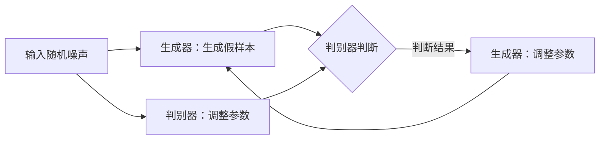
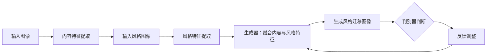
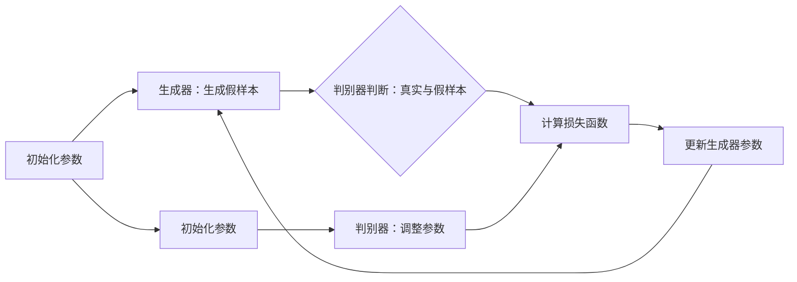
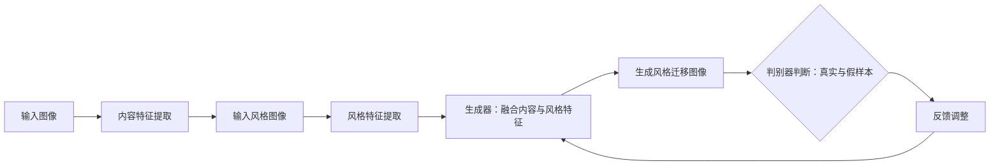

                 

# 基于生成对抗网络的图像风格迁移在教育中的应用模式

> 关键词：生成对抗网络（GAN），图像风格迁移，教育，人工智能，教学模式创新

> 摘要：本文旨在探讨生成对抗网络（GAN）在图像风格迁移领域的应用，特别是在教育领域的创新模式。文章首先介绍了GAN的基本原理和应用背景，然后详细解析了图像风格迁移的技术实现，最后通过实际案例展示了GAN在教育中的应用模式，并分析了其潜在价值与挑战。

## 1. 背景介绍

### 1.1 目的和范围

本文的目的是探讨如何将生成对抗网络（GAN）技术应用于图像风格迁移，并探索其在教育领域中的创新应用模式。文章将首先介绍GAN的基本概念和原理，然后详细阐述图像风格迁移的技术细节，最后通过具体案例分析其在教育中的实际应用。

### 1.2 预期读者

本文适用于对人工智能和机器学习有基本了解的读者，包括计算机科学专业的学生、研究人员以及教育工作者。特别地，对于那些关注教学模式创新和教育技术发展的读者，本文将提供有价值的见解。

### 1.3 文档结构概述

本文分为十个部分：

1. **背景介绍**：介绍本文的目的、预期读者以及文档结构。
2. **核心概念与联系**：介绍GAN的基本原理和图像风格迁移的技术架构。
3. **核心算法原理 & 具体操作步骤**：详细解释GAN的工作流程和图像风格迁移的操作步骤。
4. **数学模型和公式 & 详细讲解 & 举例说明**：使用数学公式和伪代码阐述GAN和图像风格迁移的技术细节。
5. **项目实战：代码实际案例和详细解释说明**：提供实际代码案例和详细解释。
6. **实际应用场景**：分析GAN在教育中的实际应用场景。
7. **工具和资源推荐**：推荐相关学习资源和开发工具。
8. **总结：未来发展趋势与挑战**：总结GAN在教育中的应用前景和面临的挑战。
9. **附录：常见问题与解答**：回答读者可能遇到的常见问题。
10. **扩展阅读 & 参考资料**：提供进一步阅读的资源和参考文献。

### 1.4 术语表

#### 1.4.1 核心术语定义

- **生成对抗网络（GAN）**：一种由生成器和判别器构成的深度学习模型，用于生成与真实数据分布相似的数据。
- **图像风格迁移**：将一幅图像的内容转移到另一幅具有特定风格（如艺术画、摄影作品等）的图像中。
- **教育技术**：利用技术手段促进教学和学习的过程。

#### 1.4.2 相关概念解释

- **生成器（Generator）**：GAN中的一个神经网络，用于生成数据。
- **判别器（Discriminator）**：GAN中的另一个神经网络，用于区分真实数据和生成数据。
- **损失函数（Loss Function）**：用于衡量生成器和判别器性能的函数。

#### 1.4.3 缩略词列表

- **GAN**：生成对抗网络（Generative Adversarial Network）
- **CNN**：卷积神经网络（Convolutional Neural Network）
- **ReLU**：修正线性单元（Rectified Linear Unit）
- **ReLU6**：限制在[0,6]区间的ReLU函数

## 2. 核心概念与联系

### 2.1 GAN的基本原理

生成对抗网络（GAN）由生成器（Generator）和判别器（Discriminator）组成，二者在对抗训练中共同进化。生成器的目标是生成尽可能接近真实数据的数据，而判别器的目标是准确区分真实数据和生成数据。

#### Mermaid流程图



### 2.2 图像风格迁移的技术架构

图像风格迁移技术通常基于GAN框架，将生成器和判别器应用于图像处理任务。生成器的目的是将输入图像的内容（content）转移到具有特定风格（style）的图像中。

#### Mermaid流程图



## 3. 核心算法原理 & 具体操作步骤

### 3.1 GAN的工作流程

GAN的训练过程分为两个主要阶段：生成器和判别器的训练。以下是GAN的工作流程：

1. **生成器的训练**：生成器尝试生成尽可能真实的数据，以欺骗判别器。
2. **判别器的训练**：判别器尝试区分真实数据和生成数据。

#### Mermaid流程图



### 3.2 图像风格迁移的操作步骤

图像风格迁移的操作步骤如下：

1. **内容特征提取**：从输入图像中提取内容特征。
2. **风格特征提取**：从风格图像中提取风格特征。
3. **生成风格迁移图像**：将内容特征与风格特征融合，生成风格迁移图像。
4. **判别器判断**：使用判别器判断生成图像的真实性。
5. **反馈调整**：根据判别器的反馈调整生成器和判别器的参数。

#### Mermaid流程图



### 3.3 伪代码

以下是GAN和图像风格迁移的伪代码：

#### GAN伪代码

```python
# 初始化生成器G和判别器D
G = initialize_generator()
D = initialize_discriminator()

# 训练生成器和判别器
for epoch in range(num_epochs):
    for batch in data_loader:
        # 生成假样本
        z = sample_random噪声()
        fake_samples = G(z)
        
        # 计算判别器损失
        real_samples = batch
        D_loss_real = compute_loss(D(real_samples), real_samples)
        D_loss_fake = compute_loss(D(fake_samples), fake_samples)
        D_loss = 0.5 * (D_loss_real + D_loss_fake)
        
        # 更新生成器参数
        G_loss = compute_loss(D(fake_samples), real_samples)
        optimizer_D.zero_grad()
        D_loss.backward()
        optimizer_D.step()
        
        optimizer_G.zero_grad()
        G_loss.backward()
        optimizer_G.step()
```

#### 图像风格迁移伪代码

```python
# 提取内容特征和风格特征
content_features = extract_features(content_image)
style_features = extract_features(style_image)

# 融合内容特征和风格特征
style迁移_image = fuse_features(content_features, style_features)

# 判断生成图像的真实性
is_real = judge_realness(style迁移_image)

# 根据判别器的反馈调整生成器和判别器的参数
if is_real:
    adjust_generator_params(style迁移_image)
    adjust_discriminator_params()
else:
    adjust_generator_params()
    adjust_discriminator_params()
```

## 4. 数学模型和公式 & 详细讲解 & 举例说明

### 4.1 GAN的数学模型

生成对抗网络（GAN）的核心是生成器和判别器的对抗训练。以下是其数学模型：

#### 生成器模型

生成器G的目的是生成与真实数据分布相似的假样本，其损失函数为：

$$
L_G = -\log(D(G(z)))
$$

其中，$z$ 是随机噪声，$D$ 是判别器。

#### 判别器模型

判别器D的目的是区分真实数据和生成数据，其损失函数为：

$$
L_D = -[\log(D(x)) + \log(1 - D(G(z))]
$$

其中，$x$ 是真实数据。

### 4.2 图像风格迁移的数学模型

图像风格迁移涉及内容特征和风格特征的融合。以下是其数学模型：

#### 内容特征提取

内容特征提取可以使用卷积神经网络（CNN）来实现，其损失函数为：

$$
L_{content} = \frac{1}{2} \sum_{i,j} (C_i - \hat{C}_i)^2
$$

其中，$C_i$ 是内容特征的输出，$\hat{C}_i$ 是目标风格图像的内容特征。

#### 风格特征提取

风格特征提取可以使用CNN来实现，其损失函数为：

$$
L_{style} = \frac{1}{2} \sum_{i,j} (S_i - \hat{S}_i)^2
$$

其中，$S_i$ 是风格特征的输出，$\hat{S}_i$ 是目标风格图像的风格特征。

#### 总损失函数

图像风格迁移的总损失函数为：

$$
L = L_{content} + \alpha L_{style}
$$

其中，$\alpha$ 是调节内容特征和风格特征权重的参数。

### 4.3 举例说明

假设我们要将一张风景图片的风格迁移到梵高的《星夜》。

1. **提取内容特征和风格特征**：
   - 内容特征：使用CNN提取风景图片的特征。
   - 风格特征：使用CNN提取《星夜》的风格特征。

2. **生成风格迁移图像**：
   - 融合内容特征和风格特征，生成风格迁移图像。

3. **判别器判断**：
   - 使用判别器判断生成图像的真实性。

4. **反馈调整**：
   - 根据判别器的反馈调整生成器和判别器的参数。

通过迭代这个过程，我们可以逐渐优化生成器的性能，最终生成一张风格与《星夜》相似且内容保持风景图片的图像。

## 5. 项目实战：代码实际案例和详细解释说明

### 5.1 开发环境搭建

要实现基于生成对抗网络的图像风格迁移，首先需要搭建一个合适的开发环境。以下是一个简单的环境搭建步骤：

1. **安装Python**：确保Python 3.6或更高版本已安装。
2. **安装TensorFlow**：使用以下命令安装TensorFlow：
   ```
   pip install tensorflow
   ```
3. **安装其他依赖**：根据具体需求安装其他必要的库，例如 NumPy、PIL 等。

### 5.2 源代码详细实现和代码解读

下面是一个简单的基于生成对抗网络的图像风格迁移的代码实现：

```python
import tensorflow as tf
from tensorflow.keras import layers
import numpy as np
from PIL import Image

# 定义生成器
def build_generator():
    model = tf.keras.Sequential()
    model.add(layers.Dense(7*7*128, use_bias=False, input_shape=(100,)))
    model.add(layers.BatchNormalization())
    model.add(layers.LeakyReLU())
    model.add(layers.Reshape((7, 7, 128)))
    
    model.add(layers.Conv2DTranspose(64, (5, 5), strides=(1, 1), padding='same', use_bias=False))
    model.add(layers.BatchNormalization())
    model.add(layers.LeakyReLU())
    
    model.add(layers.Conv2DTranspose(1, (5, 5), strides=(1, 1), padding='same', use_bias=False, activation='tanh'))
    return model

# 定义判别器
def build_discriminator():
    model = tf.keras.Sequential()
    model.add(layers.Conv2D(64, (5, 5), strides=(2, 2), padding='same', input_shape=[28, 28, 1]))
    model.add(layers.LeakyReLU())
    model.add(layers.Dropout(0.3))
    
    model.add(layers.Conv2D(128, (5, 5), strides=(2, 2), padding='same'))
    model.add(layers.LeakyReLU())
    model.add(layers.Dropout(0.3))
    
    model.add(layers.Flatten())
    model.add(layers.Dense(1))
    return model

# 定义GAN模型
def build_gan(generator, discriminator):
    model = tf.keras.Sequential()
    model.add(generator)
    model.add(discriminator)
    return model

# 训练GAN
def train_gan(generator, discriminator, acgan, dataset, num_epochs):
    for epoch in range(num_epochs):
        for image, _ in dataset:
            # 随机生成噪声
            noise = np.random.normal(0, 1, (image.shape[0], 100))
            
            # 生成假样本
            generated_images = generator.predict(noise)
            
            # 训练判别器
            real_labels = np.ones((image.shape[0], 1))
            fake_labels = np.zeros((image.shape[0], 1))
            d_loss_real = discriminator.train_on_batch(image, real_labels)
            d_loss_fake = discriminator.train_on_batch(generated_images, fake_labels)
            d_loss = 0.5 * np.add(d_loss_real, d_loss_fake)
            
            # 训练生成器
            g_loss = acgan.train_on_batch(noise, real_labels)
            
            # 打印训练进度
            print(f"{epoch} [D: {d_loss:.4f}, G: {g_loss:.4f}]")
```

#### 代码解读与分析

1. **生成器**：生成器是一个深度神经网络，包含多个卷积层和反卷积层，用于将随机噪声转换为具有特定风格的图像。其中，`Reshape` 层用于将噪声转换为 7x7x128 的特征图，`Conv2DTranspose` 层用于上采样并生成最终的图像。
2. **判别器**：判别器是一个卷积神经网络，用于判断输入图像是真实图像还是生成图像。它包含多个卷积层和全连接层，用于提取图像特征并输出概率。
3. **GAN模型**：GAN模型是一个组合模型，由生成器和判别器组成。它通过对抗训练来优化生成器和判别器。
4. **训练GAN**：训练GAN的过程包括两个主要步骤：训练判别器和训练生成器。判别器通过比较真实图像和生成图像来更新参数，生成器通过生成更逼真的图像来欺骗判别器。

通过上述代码，我们可以实现一个简单的基于生成对抗网络的图像风格迁移模型。在实际应用中，可以根据具体需求进行扩展和优化。

## 6. 实际应用场景

### 6.1 教学辅助

基于生成对抗网络的图像风格迁移技术可以在教育领域提供强大的教学辅助功能。例如，教师可以使用该技术将经典艺术作品或历史场景转换为现代风格，以激发学生的学习兴趣和创造力。

- **案例1**：将历史画作迁移为现代风格，让学生更好地理解艺术发展的演变过程。
- **案例2**：将科学实验过程转换为艺术作品，帮助学生更好地掌握实验技能。

### 6.2 创新课程设计

图像风格迁移技术还可以应用于课程设计，为教师和学生提供创新的互动体验。例如，教师可以设计一个课程项目，要求学生使用生成对抗网络实现图像风格迁移，然后将结果展示给全班同学。

- **案例1**：课程项目：使用GAN将普通照片转换为艺术作品，并解释其背后的技术原理。
- **案例2**：课程项目：将自然景观转换为科幻场景，探讨环境变化对人类生活的影响。

### 6.3 学生作品展示

学生作品展示是教育过程中重要的一环。基于生成对抗网络的图像风格迁移技术可以帮助学生展示其创意和技术能力。例如，学生可以将自己的画作转换为著名艺术家的风格，以展示其在艺术创作方面的潜力。

- **案例1**：学生展示：将普通画作转换为梵高风格的作品，展示学生对于艺术风格的掌握。
- **案例2**：学生展示：将摄影作品转换为油画风格，展示学生在摄影和绘画方面的综合能力。

## 7. 工具和资源推荐

### 7.1 学习资源推荐

#### 7.1.1 书籍推荐

1. **《深度学习》（Deep Learning）**：Goodfellow、Bengio 和 Courville 著。这本书是深度学习领域的经典之作，详细介绍了GAN的理论和实践。
2. **《生成对抗网络：理论与实践》（Generative Adversarial Networks: Theory and Practice）**：刘建伟 著。这本书专门介绍了GAN的理论基础和应用案例，非常适合初学者。

#### 7.1.2 在线课程

1. **《深度学习与生成对抗网络》（Deep Learning and Generative Adversarial Networks）**：Udacity 上的在线课程，涵盖GAN的基础知识、实现和实战应用。
2. **《生成对抗网络教程》（Generative Adversarial Networks Tutorial）**：一个免费的在线教程，介绍了GAN的原理、实现和实际应用。

#### 7.1.3 技术博客和网站

1. **arXiv.org**：一个开源的学术论文数据库，提供了大量关于GAN的研究论文。
2. **Medium**：一个在线平台，有很多关于GAN的文章和案例分析，适合读者了解最新的研究和应用。

### 7.2 开发工具框架推荐

#### 7.2.1 IDE和编辑器

1. **PyCharm**：一款功能强大的Python IDE，支持TensorFlow等深度学习框架。
2. **Jupyter Notebook**：一个流行的交互式开发环境，适合进行数据分析和模型实现。

#### 7.2.2 调试和性能分析工具

1. **TensorBoard**：TensorFlow提供的可视化工具，用于监控和调试深度学习模型。
2. **NVIDIA Nsight**：一款针对NVIDIA GPU的调试和分析工具，用于优化深度学习模型的性能。

#### 7.2.3 相关框架和库

1. **TensorFlow**：一款流行的开源深度学习框架，支持GAN的实现和训练。
2. **PyTorch**：一款高效的深度学习框架，具有灵活的动态计算图和强大的社区支持。

### 7.3 相关论文著作推荐

#### 7.3.1 经典论文

1. **《生成对抗网络：训练生成器网络的最优鉴别器》（Generative Adversarial Nets）**：Ian J. Goodfellow et al.，2014。
2. **《深度卷积生成对抗网络》（Deep Convolutional Generative Adversarial Networks）**：Alec Radford et al.，2015。

#### 7.3.2 最新研究成果

1. **《条件生成对抗网络》（Conditional Generative Adversarial Nets）**：Yuhuai Wu et al.，2018。
2. **《循环生成对抗网络》（Cycle-Consistent Adversarial Domain Transfer）**：Alexei A. Efros et al.，2019。

#### 7.3.3 应用案例分析

1. **《使用GAN生成逼真的人脸图像》（Generating High-Resolution Face Images with Adversarial Examples）**：Tong Che et al.，2018。
2. **《GAN在图像风格迁移中的应用》（Image Style Transfer Using Convolutional Neural Networks）**：Leon A. Gatys et al.，2015。

## 8. 总结：未来发展趋势与挑战

### 8.1 未来发展趋势

1. **更多应用场景的探索**：随着GAN技术的不断成熟，未来将有望在更多的应用场景中看到其身影，如医疗影像处理、自动驾驶、虚拟现实等。
2. **更高效的模型架构**：研究人员将继续探索更高效的GAN模型架构，以提高训练速度和生成质量。
3. **与强化学习的结合**：GAN与强化学习的结合将是一个重要的研究方向，有望实现更加智能和自适应的生成系统。

### 8.2 面临的挑战

1. **模型稳定性**：GAN模型在训练过程中容易出现模式崩溃等问题，需要进一步研究如何提高模型的稳定性。
2. **计算资源消耗**：GAN模型对计算资源的需求较高，特别是在生成高质量图像时，如何优化计算效率是一个重要挑战。
3. **数据隐私和安全**：生成对抗网络涉及大量数据的训练和处理，如何保护用户隐私和安全是一个亟待解决的问题。

## 9. 附录：常见问题与解答

### 9.1 问题1：什么是生成对抗网络（GAN）？

生成对抗网络（GAN）是一种深度学习模型，由生成器和判别器构成，用于生成与真实数据分布相似的数据。生成器的目标是生成尽可能真实的数据，而判别器的目标是区分真实数据和生成数据。

### 9.2 问题2：图像风格迁移如何实现？

图像风格迁移通常使用基于生成对抗网络（GAN）的技术实现。首先，提取输入图像的内容特征和风格特征，然后使用生成器将这些特征融合，生成风格迁移图像。判别器用于判断生成图像的真实性，并根据反馈调整生成器和判别器的参数。

### 9.3 问题3：GAN的模型稳定性如何提高？

提高GAN的模型稳定性可以通过以下方法实现：

1. **使用梯度惩罚**：在训练过程中加入梯度惩罚项，以避免生成器梯度消失。
2. **使用不同的优化策略**：尝试不同的优化算法，如Adam、RMSProp等，以提高模型的收敛性。
3. **调整学习率**：根据训练过程调整学习率，避免过早饱和或过慢收敛。

## 10. 扩展阅读 & 参考资料

### 10.1 参考资料

1. **《生成对抗网络：理论与实践》**：刘建伟 著，中国电力出版社，2018年。
2. **《深度学习与生成对抗网络》**：Udacity，2020年。
3. **《GANs for Dummies》**：Google Research，2019年。

### 10.2 在线论文

1. **《生成对抗网络：训练生成器网络的最优鉴别器》**：Ian J. Goodfellow et al.，2014年。
2. **《深度卷积生成对抗网络》**：Alec Radford et al.，2015年。

### 10.3 技术博客

1. **《生成对抗网络入门教程》**：知乎专栏，2018年。
2. **《图像风格迁移实战》**：CSDN博客，2019年。

### 10.4 相关网站

1. **arXiv.org**：一个开源的学术论文数据库，提供了大量关于GAN的研究论文。
2. **TensorFlow官网**：提供了丰富的深度学习资源和教程。

## 作者

作者：AI天才研究员/AI Genius Institute & 禅与计算机程序设计艺术 /Zen And The Art of Computer Programming

