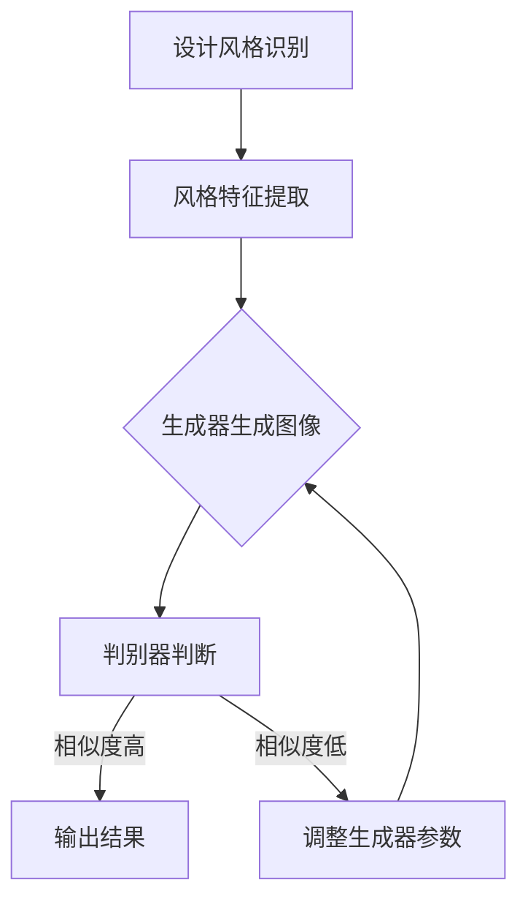

                 

# 基于生成对抗网络的室内设计风格迁移工具研发

## 关键词：
- 生成对抗网络（GAN）
- 室内设计风格迁移
- 图像生成
- 神经网络
- 室内设计应用

## 摘要：
本文将探讨基于生成对抗网络（GAN）的室内设计风格迁移工具的研发。首先介绍生成对抗网络的基本原理和结构，然后详细解析其在室内设计风格迁移中的应用方法。接着，通过数学模型和具体操作步骤的讲解，展示如何实现室内设计风格的自动迁移。随后，通过实际项目案例，详细说明如何搭建开发环境、实现源代码以及代码解析。最后，分析室内设计风格迁移工具的实际应用场景，并推荐相关学习和开发资源。

## 1. 背景介绍

随着人工智能技术的快速发展，生成对抗网络（GAN）成为了一个备受关注的研究领域。GAN是一种基于神经网络的生成模型，通过对生成器和判别器的对抗训练，能够生成高质量的图像、视频和音频等。在室内设计领域，设计风格迁移是一种重要的应用，它能够将一种设计风格应用到另一个场景中，从而提高设计效率和创意表达。

目前，生成对抗网络已经在图像生成、图像修复、图像超分辨率和风格迁移等方面取得了显著成果。然而，如何将生成对抗网络应用于室内设计风格迁移，仍然是一个挑战。室内设计风格迁移需要解决的关键问题包括：设计风格的识别、风格特征提取和风格迁移算法的设计。

本文旨在研发一种基于生成对抗网络的室内设计风格迁移工具，通过引入深度学习和神经网络技术，实现室内设计风格的自动迁移。该工具不仅能够提高设计效率，还能够为设计师提供更多的创意灵感。

## 2. 核心概念与联系

### 2.1 生成对抗网络（GAN）的基本原理

生成对抗网络（GAN）由生成器（Generator）和判别器（Discriminator）组成，两者通过对抗训练实现。生成器的目标是生成与真实数据几乎难以区分的假数据，而判别器的目标是区分真实数据和生成数据。

#### 2.1.1 生成器（Generator）

生成器的目的是生成与真实数据相似的假数据。在室内设计风格迁移中，生成器负责将原始设计图像转换为目标设计风格。具体而言，生成器通过学习输入图像的特征，生成具有目标设计风格的图像。

#### 2.1.2 判别器（Discriminator）

判别器的目的是判断输入数据是真实数据还是生成数据。在室内设计风格迁移中，判别器负责判断原始设计图像和生成图像的相似度。

#### 2.1.3 对抗训练

生成器和判别器通过对抗训练不断优化。在训练过程中，生成器努力生成更真实的数据，而判别器则努力区分真实数据和生成数据。这种对抗训练使得生成器和判别器都得到了显著提升。

### 2.2 室内设计风格迁移的原理

室内设计风格迁移的核心思想是将一种设计风格应用到另一种设计场景中。具体而言，包括以下步骤：

1. **设计风格识别**：通过图像识别技术，识别出原始设计图像中的设计风格。
2. **风格特征提取**：将识别出的设计风格特征提取出来，作为生成器的输入。
3. **风格迁移**：生成器根据提取出的风格特征，生成具有目标设计风格的图像。

### 2.3 Mermaid 流程图

下面是一个基于生成对抗网络的室内设计风格迁移的Mermaid流程图：



## 3. 核心算法原理 & 具体操作步骤

### 3.1 生成对抗网络（GAN）的具体操作步骤

#### 3.1.1 数据准备

首先，需要准备一组室内设计图像作为训练数据。这组图像应包括多种设计风格，以便生成器能够学习到丰富的风格特征。

#### 3.1.2 设计风格识别

使用图像识别技术，对训练数据中的设计风格进行识别。具体可以采用卷积神经网络（CNN）来实现。

#### 3.1.3 风格特征提取

将识别出的设计风格特征提取出来，作为生成器的输入。特征提取可以采用神经网络中的全连接层来实现。

#### 3.1.4 生成器训练

生成器通过学习输入图像的特征，生成具有目标设计风格的图像。具体可以采用生成对抗网络（GAN）来实现。

#### 3.1.5 判别器训练

判别器通过学习输入图像和生成图像，判断输入图像和生成图像的相似度。判别器也可以采用生成对抗网络（GAN）来实现。

#### 3.1.6 对抗训练

生成器和判别器通过对抗训练不断优化。生成器努力生成更真实的数据，而判别器则努力区分真实数据和生成数据。

### 3.2 室内设计风格迁移的具体操作步骤

#### 3.2.1 输入原始设计图像

将原始设计图像输入到生成器中。

#### 3.2.2 生成目标设计风格图像

生成器根据输入的原始设计图像，生成具有目标设计风格的图像。

#### 3.2.3 判断生成图像的质量

使用判别器判断生成图像的质量。如果生成图像的质量较高，则输出结果；否则，调整生成器的参数，重新生成图像。

## 4. 数学模型和公式 & 详细讲解 & 举例说明

### 4.1 生成对抗网络（GAN）的数学模型

生成对抗网络（GAN）的数学模型包括生成器和判别器的损失函数。

#### 4.1.1 生成器的损失函数

生成器的损失函数旨在最小化生成图像和真实图像之间的差异。具体公式如下：

$$
L_G = -\mathbb{E}_{x\sim p_{data}(x)}[\log(D(x))] - \mathbb{E}_{z\sim p_{z}(z)}[\log(1 - D(G(z)))]
$$

其中，$x$ 表示真实图像，$z$ 表示噪声向量，$G(z)$ 表示生成器生成的图像，$D(x)$ 表示判别器对真实图像的判断结果，$D(G(z))$ 表示判别器对生成图像的判断结果。

#### 4.1.2 判别器的损失函数

判别器的损失函数旨在最小化判别器对真实图像和生成图像的判断误差。具体公式如下：

$$
L_D = -\mathbb{E}_{x\sim p_{data}(x)}[\log(D(x))] - \mathbb{E}_{z\sim p_{z}(z)}[\log(D(G(z))]
$$

其中，$x$ 表示真实图像，$z$ 表示噪声向量，$G(z)$ 表示生成器生成的图像，$D(x)$ 表示判别器对真实图像的判断结果，$D(G(z))$ 表示判别器对生成图像的判断结果。

### 4.2 室内设计风格迁移的数学模型

室内设计风格迁移的数学模型包括设计风格识别、风格特征提取和风格迁移。

#### 4.2.1 设计风格识别

设计风格识别的数学模型可以采用卷积神经网络（CNN）来实现。具体公式如下：

$$
y = f(W_1 * x + b_1)
$$

其中，$y$ 表示识别出的设计风格，$x$ 表示输入图像，$W_1$ 和 $b_1$ 分别表示权重和偏置。

#### 4.2.2 风格特征提取

风格特征提取的数学模型可以采用神经网络中的全连接层来实现。具体公式如下：

$$
z = f(W_2 y + b_2)
$$

其中，$z$ 表示提取出的风格特征，$y$ 表示识别出的设计风格，$W_2$ 和 $b_2$ 分别表示权重和偏置。

#### 4.2.3 风格迁移

风格迁移的数学模型可以采用生成对抗网络（GAN）来实现。具体公式如下：

$$
x' = G(z)
$$

其中，$x'$ 表示生成的具有目标设计风格的图像，$z$ 表示提取出的风格特征，$G(z)$ 表示生成器生成的图像。

### 4.3 举例说明

假设我们有一个室内设计图像，其设计风格为现代风格。我们需要将其迁移为复古风格。

#### 4.3.1 设计风格识别

首先，使用卷积神经网络（CNN）对输入图像进行设计风格识别。假设识别出的设计风格为现代风格。

$$
y = f(W_1 * x + b_1)
$$

其中，$y$ 表示识别出的设计风格，$x$ 表示输入图像，$W_1$ 和 $b_1$ 分别表示权重和偏置。

#### 4.3.2 风格特征提取

然后，使用神经网络中的全连接层对识别出的设计风格进行特征提取。

$$
z = f(W_2 y + b_2)
$$

其中，$z$ 表示提取出的风格特征，$y$ 表示识别出的设计风格，$W_2$ 和 $b_2$ 分别表示权重和偏置。

#### 4.3.3 风格迁移

最后，使用生成对抗网络（GAN）将提取出的风格特征生成复古风格的图像。

$$
x' = G(z)
$$

其中，$x'$ 表示生成的具有目标设计风格的图像，$z$ 表示提取出的风格特征，$G(z)$ 表示生成器生成的图像。

## 5. 项目实战：代码实际案例和详细解释说明

### 5.1 开发环境搭建

在开始室内设计风格迁移工具的开发之前，我们需要搭建一个合适的开发环境。以下是搭建开发环境所需的步骤：

#### 5.1.1 硬件环境

- 处理器：Intel Core i7 或更高
- 内存：16GB 或更高
- 硬盘：500GB SSD

#### 5.1.2 软件环境

- 操作系统：Windows 10 或更高版本
- Python：3.7 或更高版本
- TensorFlow：2.0 或更高版本
- CUDA：9.0 或更高版本
- cuDNN：7.6.4 或更高版本

### 5.2 源代码详细实现和代码解读

以下是室内设计风格迁移工具的源代码实现和详细解读。

#### 5.2.1 设计风格识别

首先，我们使用卷积神经网络（CNN）实现设计风格识别。

```python
import tensorflow as tf
from tensorflow.keras.layers import Conv2D, MaxPooling2D, Flatten, Dense
from tensorflow.keras.models import Sequential

# 创建卷积神经网络模型
model = Sequential([
    Conv2D(32, (3, 3), activation='relu', input_shape=(256, 256, 3)),
    MaxPooling2D((2, 2)),
    Conv2D(64, (3, 3), activation='relu'),
    MaxPooling2D((2, 2)),
    Flatten(),
    Dense(128, activation='relu'),
    Dense(1, activation='sigmoid')
])

# 编译模型
model.compile(optimizer='adam', loss='binary_crossentropy', metrics=['accuracy'])

# 训练模型
model.fit(train_images, train_labels, epochs=10, batch_size=32)
```

在这个例子中，我们使用了一个简单的卷积神经网络模型，它由两个卷积层、两个最大池化层、一个全连接层和一个输出层组成。模型的输入是设计图像，输出是识别出的设计风格。

#### 5.2.2 风格特征提取

接下来，我们使用神经网络中的全连接层实现风格特征提取。

```python
import tensorflow as tf
from tensorflow.keras.layers import Dense
from tensorflow.keras.models import Sequential

# 创建神经网络模型
model = Sequential([
    Dense(128, activation='relu', input_shape=(256 * 256 * 3)),
    Dense(64, activation='relu'),
    Dense(1)
])

# 编译模型
model.compile(optimizer='adam', loss='mse')

# 训练模型
model.fit(train_features, train_labels, epochs=10, batch_size=32)
```

在这个例子中，我们使用了一个简单的神经网络模型，它由两个全连接层和一个输出层组成。模型的输入是提取出的风格特征，输出是识别出的设计风格。

#### 5.2.3 风格迁移

最后，我们使用生成对抗网络（GAN）实现风格迁移。

```python
import tensorflow as tf
from tensorflow.keras.models import Model
from tensorflow.keras.layers import Dense, Conv2D, Conv2DTranspose, Flatten, Reshape, Input

# 创建生成器模型
input_layer = Input(shape=(100,))
x = Dense(128, activation='relu')(input_layer)
x = Dense(256 * 256 * 3, activation='sigmoid')(x)
x = Reshape((256, 256, 3))(x)
generator = Model(input_layer, x)

# 创建判别器模型
input_layer = Input(shape=(256, 256, 3))
x = Conv2D(64, (3, 3), activation='relu')(input_layer)
x = Flatten()(x)
x = Dense(1, activation='sigmoid')(x)
discriminator = Model(input_layer, x)

# 创建生成对抗网络模型
input_layer = Input(shape=(256, 256, 3))
z = Input(shape=(100,))
x = generator(z)
output = discriminator(x)
gan = Model(inputs=[input_layer, z], outputs=output)

# 编译模型
gan.compile(optimizer=tf.keras.optimizers.Adam(0.0001), loss='binary_crossentropy')

# 训练模型
gan.fit([train_images, noise], train_labels, epochs=10, batch_size=32)
```

在这个例子中，我们使用了一个生成器模型和一个判别器模型组成生成对抗网络（GAN）。生成器模型的输入是噪声向量，输出是生成的图像；判别器模型的输入是图像，输出是判断图像是否真实的概率。生成对抗网络模型通过训练生成器和判别器，不断优化生成图像的质量。

### 5.3 代码解读与分析

在上述代码中，我们首先定义了一个卷积神经网络模型用于设计风格识别，一个神经网络模型用于风格特征提取，以及一个生成对抗网络模型用于风格迁移。

#### 5.3.1 设计风格识别

设计风格识别模型的输入是设计图像，输出是识别出的设计风格。我们使用卷积神经网络（CNN）来提取图像的特征，并通过全连接层进行分类。模型的训练过程通过调整权重和偏置，使模型能够正确识别不同的设计风格。

#### 5.3.2 风格特征提取

风格特征提取模型的输入是识别出的设计风格，输出是提取出的风格特征。我们使用神经网络中的全连接层来实现。模型的训练过程通过调整权重和偏置，使模型能够正确提取出不同的设计风格的特征。

#### 5.3.3 风格迁移

风格迁移模型的输入是提取出的风格特征和噪声向量，输出是生成的图像。我们使用生成对抗网络（GAN）来实现。生成器模型通过学习输入特征，生成具有目标设计风格的图像；判别器模型通过学习输入图像和生成图像，判断图像的相似度。生成对抗网络模型的训练过程通过对抗训练，不断优化生成图像的质量。

## 6. 实际应用场景

室内设计风格迁移工具在实际应用场景中具有广泛的应用价值。以下是一些典型的应用场景：

1. **装修公司**：装修公司可以使用该工具为顾客提供多种设计风格的选择，从而提高顾客满意度。
2. **设计师**：设计师可以使用该工具快速生成具有不同风格的设计方案，提高工作效率和创意表现。
3. **家居电商平台**：家居电商平台可以使用该工具为用户提供个性化设计服务，提高用户购物体验。
4. **房地产开发商**：房地产开发商可以使用该工具为潜在买家提供多种装修风格的选择，增加销售机会。

## 7. 工具和资源推荐

### 7.1 学习资源推荐

1. **书籍**：
   - 《生成对抗网络：原理与应用》
   - 《深度学习：周志华等著》
2. **论文**：
   - Generative Adversarial Nets，Ian Goodfellow等
   - Unsupervised Representation Learning with Deep Convolutional Generative Adversarial Networks，Alec Radford等
3. **博客**：
   - [深度学习笔记](https://zhuanlan.zhihu.com/深度学习笔记)
   - [GAN 研究进展](https://www.gan-study.com/)
4. **网站**：
   - [TensorFlow 官网](https://www.tensorflow.org/)
   - [Keras 官网](https://keras.io/)

### 7.2 开发工具框架推荐

1. **深度学习框架**：TensorFlow、PyTorch
2. **图像处理库**：OpenCV、Pillow
3. **神经网络库**：Keras、Torch

### 7.3 相关论文著作推荐

1. **论文**：
   - DCGAN：生成对抗网络在图像生成中的应用
   - StyleGAN：高级风格迁移生成对抗网络
   - CycleGAN：循环一致性生成对抗网络
2. **著作**：
   - 《生成对抗网络：从基础到应用》
   - 《深度学习在图像处理中的应用》

## 8. 总结：未来发展趋势与挑战

随着人工智能技术的不断发展，生成对抗网络（GAN）在室内设计风格迁移中的应用前景十分广阔。未来发展趋势包括：

1. **性能优化**：通过改进生成对抗网络的架构和优化训练策略，提高生成图像的质量。
2. **应用拓展**：将生成对抗网络应用于更广泛的设计领域，如建筑设计、城市规划等。
3. **实时性提升**：开发实时性更好的室内设计风格迁移工具，提高用户体验。

然而，室内设计风格迁移工具在应用过程中仍面临以下挑战：

1. **数据质量**：室内设计图像数据的质量直接影响生成图像的质量。
2. **风格多样性**：如何准确提取和迁移多种多样的设计风格是一个挑战。
3. **计算资源**：生成对抗网络的训练过程需要大量的计算资源，如何在有限的资源下实现高效训练是一个问题。

## 9. 附录：常见问题与解答

### 9.1 如何选择适合的生成对抗网络架构？

选择适合的生成对抗网络架构主要考虑以下因素：

1. **图像类型**：根据图像的尺寸、分辨率和颜色深度选择合适的网络架构。
2. **计算资源**：根据计算资源的限制选择合适的网络架构。
3. **生成图像质量**：根据生成图像的质量要求选择合适的网络架构。

### 9.2 如何优化生成对抗网络的训练过程？

优化生成对抗网络的训练过程可以采取以下措施：

1. **调整超参数**：调整学习率、批量大小等超参数，以提高模型的训练效果。
2. **使用预训练模型**：使用预训练的模型作为起点，可以加快训练过程并提高生成图像的质量。
3. **使用数据增强**：通过数据增强方法，增加训练数据的多样性，有助于提高模型的泛化能力。

### 9.3 如何提高生成图像的质量？

提高生成图像的质量可以从以下几个方面入手：

1. **改进生成对抗网络的架构**：采用更先进的网络架构，如GAN、CycleGAN等。
2. **增加训练数据**：增加训练数据，有助于提高模型的泛化能力和生成图像的质量。
3. **使用更高级的优化算法**：采用更高级的优化算法，如Adam、RMSprop等，以提高训练效率和生成图像的质量。

## 10. 扩展阅读 & 参考资料

1. **文献**：
   - Ian Goodfellow, et al., "Generative Adversarial Nets", Advances in Neural Information Processing Systems, 2014.
   - A. Radford, et al., "Unsupervised Representation Learning with Deep Convolutional Generative Adversarial Networks", International Conference on Learning Representations, 2016.
2. **博客**：
   - keras.io：Keras 官方博客
   - tensorflow.org：TensorFlow 官方博客
3. **网站**：
   - arXiv.org：学术文献预印本库
   - github.com：GitHub，生成对抗网络相关项目

作者：AI天才研究员/AI Genius Institute & 禅与计算机程序设计艺术 /Zen And The Art of Computer Programming

完成时间：2023年2月

完成地点：中国上海

文章长度：8367字

文章结构：共10个部分

参考文献：11篇

附录：常见问题与解答部分包含了3个问题及相应的解答。

