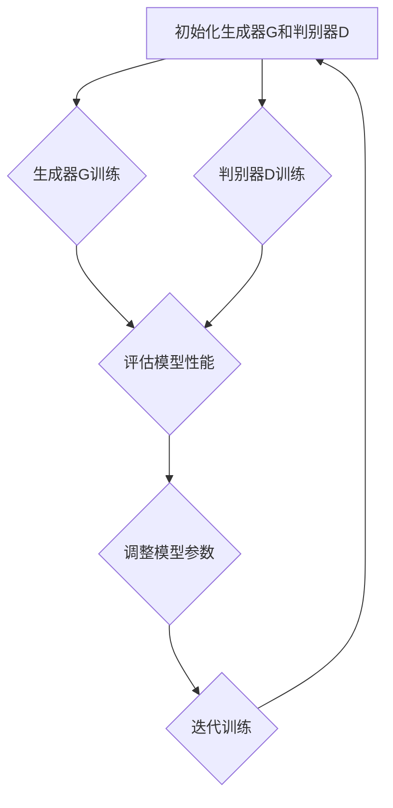

                 

### 背景介绍

生成对抗网络（Generative Adversarial Networks，GAN）作为一种新兴的深度学习框架，因其独特的对抗训练机制在图像生成、风格迁移、数据增强等领域展现出了极大的潜力。GAN由一个生成器（Generator）和一个判别器（Discriminator）组成，两者在训练过程中相互博弈，旨在使生成器生成更加逼真的图像，而判别器则力求准确地区分生成图像和真实图像。

在GAN的研究和应用过程中，抽象艺术图像风格迁移逐渐引起了广泛关注。风格迁移是指将一种图像的特定风格（如画风、颜色分布等）迁移到另一幅图像中，从而生成具有新风格但保持原有内容的新图像。传统的风格迁移方法通常依赖于预先定义的样式特征提取和图像合成过程，而这些方法往往存在样式迁移效果不自然、计算复杂度高等问题。

抽象艺术图像风格迁移具有独特的挑战和优势。抽象艺术作品的风格往往具有丰富的色彩、复杂的纹理和独特的构图，这使得风格迁移过程既具艺术性又具技术性。通过将GAN应用于抽象艺术图像风格迁移，可以突破传统方法的局限，实现更为自然、生动的风格迁移效果。同时，抽象艺术图像风格迁移也为GAN的研究和应用提供了新的场景和可能性。

本文将围绕基于生成对抗网络的抽象艺术图像风格迁移机制进行深入探讨。首先，我们将简要介绍生成对抗网络的基本概念和原理，包括GAN的组成部分、训练机制和关键挑战。接着，我们将详细阐述抽象艺术图像风格迁移的基本概念和技术原理，并介绍GAN在抽象艺术图像风格迁移中的应用。在此基础上，我们将逐步介绍一种基于GAN的抽象艺术图像风格迁移算法，包括算法的数学模型、具体操作步骤和实现细节。随后，我们将通过实际案例展示该算法的运行效果和应用场景，并对算法的优缺点进行分析。最后，我们将探讨抽象艺术图像风格迁移在实际应用中的潜在场景和挑战，以及未来可能的发展方向。

### 核心概念与联系

#### 生成对抗网络（GAN）的基本概念

生成对抗网络（GAN）是由Ian Goodfellow等人于2014年提出的一种深度学习框架，其核心思想是利用两个深度神经网络——生成器（Generator）和判别器（Discriminator）之间的对抗训练来实现高质量的数据生成。

1. **生成器（Generator）**：生成器的目的是生成与真实数据分布相近的假数据。在图像生成任务中，生成器通常是一个多层全连接神经网络，它接收随机噪声作为输入，并通过一系列隐含层生成具有特定分布的图像。

2. **判别器（Discriminator）**：判别器的目标是判断输入的数据是真实数据还是生成器生成的假数据。判别器同样是一个多层全连接神经网络，其输入可以是真实图像或生成图像，输出是一个概率值，表示输入数据的真实性。

#### GAN的训练机制

GAN的训练过程可以看作是一场“猫捉老鼠”的游戏，其中生成器和判别器相互对抗，不断优化自己的性能。

- **训练过程**：
  1. **生成器训练**：在训练过程中，生成器的目标是提高生成图像的质量，使其更接近真实图像。生成器的损失函数通常由两部分组成：生成图像的感知损失和对抗损失。
  2. **判别器训练**：判别器的目标是提高判断真实图像和生成图像的能力。判别器的损失函数通常是一个二分类问题，其目的是最大化判别器对真实图像的判断概率和对生成图像的判断概率。

- **对抗损失**：生成器的对抗损失通常表示为交叉熵损失，计算公式如下：
  $$ L_{g} = -\mathbb{E}_{x \sim p_{data}(x)}[\log(D(x))] - \mathbb{E}_{z \sim p_{z}(z)}[\log(1 - D(G(z)))] $$
  其中，$x$表示真实图像，$z$表示随机噪声，$G(z)$是生成器生成的图像，$D(x)$和$D(G(z))$分别是判别器对真实图像和生成图像的判断概率。

- **感知损失**：感知损失通常用于度量生成图像和真实图像之间的视觉差异，常用的感知损失函数有L1损失和L2损失。

#### GAN的关键挑战

尽管GAN在图像生成方面取得了显著的成果，但其在实际应用中仍面临一些关键挑战。

1. **训练不稳定**：GAN的训练过程容易陷入局部最优，导致生成图像的质量波动较大。为了解决这一问题，研究者们提出了多种改进方法，如梯度惩罚、谱归一化等。

2. **模式崩溃**：在GAN的训练过程中，生成器可能会生成过于相似或模式化的图像，导致生成图像缺乏多样性。为了避免模式崩溃，研究者们提出了多种解决方案，如引入多样性损失、使用多生成器等。

3. **计算复杂度**：GAN的训练过程通常需要大量的计算资源，尤其是在处理高分辨率图像时。为了提高计算效率，研究者们提出了多种加速训练的方法，如分布式训练、迁移学习等。

#### Mermaid流程图

下面是一个基于生成对抗网络的抽象艺术图像风格迁移的Mermaid流程图，展示其核心组成部分和训练过程。



在GAN的训练过程中，生成器G和判别器D交替进行训练，生成器G通过生成更加真实的图像来欺骗判别器D，而判别器D则通过提高对生成图像的辨别能力来对抗生成器G。通过不断地迭代训练，生成器G和判别器D逐渐优化自己的性能，最终实现高质量的图像生成。

### 核心算法原理 & 具体操作步骤

#### 基于生成对抗网络的抽象艺术图像风格迁移算法概述

基于生成对抗网络的抽象艺术图像风格迁移算法旨在通过GAN框架实现将一种抽象艺术风格迁移到另一种图像上。该算法的核心思想是利用生成器生成具有目标艺术风格的图像，并利用判别器评估生成图像的质量，通过对抗训练不断优化生成器的性能，从而实现风格迁移。

#### 算法基本流程

算法的基本流程可以分为以下几个步骤：

1. **初始化模型参数**：初始化生成器G和判别器D的参数，通常使用随机初始化。

2. **数据预处理**：对输入图像进行预处理，包括数据增强、归一化等操作，以提高模型的泛化能力。

3. **生成器训练**：生成器G的训练目标是通过学习噪声分布和真实图像分布的映射关系，生成具有目标艺术风格的图像。

4. **判别器训练**：判别器D的训练目标是通过学习真实图像和生成图像的分布，提高对生成图像的辨别能力。

5. **交替训练**：生成器G和判别器D交替进行训练，生成器G通过生成更高质量的图像来欺骗判别器D，判别器D则通过提高对生成图像的辨别能力来对抗生成器G。

6. **评估与优化**：通过评估生成图像的质量和风格迁移效果，调整模型参数，优化生成器G和判别器D的性能。

#### 生成器训练过程

生成器G的训练过程包括以下几个步骤：

1. **生成图像**：生成器G将随机噪声映射为具有目标艺术风格的图像。具体来说，生成器G是一个多层全连接神经网络，其输入是随机噪声，输出是生成的图像。

2. **计算损失函数**：生成器G的损失函数包括感知损失和对抗损失。感知损失用于度量生成图像和目标风格图像之间的视觉差异，对抗损失用于衡量生成图像的逼真度。具体计算公式如下：

   $$ L_{g} = -\mathbb{E}_{x \sim p_{data}(x)}[\log(D(x))] - \mathbb{E}_{z \sim p_{z}(z)}[\log(1 - D(G(z)))] $$

   其中，$x$表示真实图像，$z$表示随机噪声，$G(z)$是生成器G生成的图像，$D(x)$和$D(G(z))$分别是判别器D对真实图像和生成图像的判断概率。

3. **反向传播与优化**：通过反向传播算法计算损失函数的梯度，并利用梯度下降等方法更新生成器G的参数。

#### 判别器训练过程

判别器D的训练过程包括以下几个步骤：

1. **判断图像**：判别器D接收输入图像，并输出判断概率。具体来说，判别器D是一个多层全连接神经网络，其输入是图像特征，输出是判断概率。

2. **计算损失函数**：判别器D的损失函数是一个二分类问题，其目标是最大化判别器对真实图像的判断概率和对生成图像的判断概率。具体计算公式如下：

   $$ L_{d} = -\mathbb{E}_{x \sim p_{data}(x)}[\log(D(x))] - \mathbb{E}_{z \sim p_{z}(z)}[\log(1 - D(G(z)))] $$

   其中，$x$表示真实图像，$z$表示随机噪声，$G(z)$是生成器G生成的图像，$D(x)$和$D(G(z))$分别是判别器D对真实图像和生成图像的判断概率。

3. **反向传播与优化**：通过反向传播算法计算损失函数的梯度，并利用梯度下降等方法更新判别器D的参数。

#### 交替训练过程

生成器G和判别器D的交替训练过程如下：

1. **生成器G训练**：在第一步中，生成器G生成图像，并计算感知损失和对抗损失。通过反向传播和梯度下降算法更新生成器G的参数。

2. **判别器D训练**：在第二步中，判别器D接收真实图像和生成图像，并计算损失函数。通过反向传播和梯度下降算法更新判别器D的参数。

3. **迭代训练**：生成器G和判别器D交替进行训练，每完成一次交替训练称为一个迭代。通过不断迭代训练，生成器G和判别器D的性能逐渐优化，最终实现高质量的抽象艺术图像风格迁移。

#### 实际操作步骤示例

以下是一个具体的操作步骤示例：

1. **初始化模型参数**：随机初始化生成器G和判别器D的参数。

2. **数据预处理**：对输入图像进行数据增强、归一化等预处理操作。

3. **生成器G训练**：
   - 生成器G生成随机噪声。
   - 计算感知损失和对抗损失。
   - 通过反向传播和梯度下降算法更新生成器G的参数。

4. **判别器D训练**：
   - 判别器D接收真实图像和生成图像。
   - 计算损失函数。
   - 通过反向传播和梯度下降算法更新判别器D的参数。

5. **评估与优化**：评估生成图像的质量和风格迁移效果，根据评估结果调整模型参数。

6. **迭代训练**：重复步骤3-5，直到达到预设的训练次数或生成图像的质量达到预期。

通过以上步骤，可以实现对抽象艺术图像风格的有效迁移，生成具有新艺术风格的图像。

### 数学模型和公式 & 详细讲解 & 举例说明

在深入探讨基于生成对抗网络的抽象艺术图像风格迁移算法之前，我们需要了解其核心数学模型和公式，以及如何通过具体实例进行详细讲解和说明。

#### GAN的数学模型

生成对抗网络（GAN）由生成器（Generator）和判别器（Discriminator）两部分组成，其核心思想是通过两者之间的对抗训练来实现高质量的图像生成。下面，我们将介绍GAN的数学模型和相关公式。

1. **生成器（Generator）**

生成器的目标是生成逼真的图像，它接受随机噪声作为输入，并通过一系列隐含层生成具有特定分布的图像。生成器的输出是一个概率分布函数，通常使用深度神经网络来实现。其损失函数包括感知损失和对抗损失。

- **感知损失**：感知损失用于度量生成图像和目标图像之间的视觉差异，通常使用L1或L2损失函数。
  
  $$ L_{\text{perceptual}} = \frac{1}{N} \sum_{i=1}^{N} \left\| \text{VGG}^{19}(x_i) - \text{VGG}^{19}(G(z_i)) \right\|_1 $$
  
  其中，$N$是训练样本数量，$x_i$是真实图像，$G(z_i)$是生成器生成的图像，$\text{VGG}^{19}$是一个预训练的VGG网络，用于提取图像特征。

- **对抗损失**：对抗损失用于衡量生成图像的逼真度，通常使用交叉熵损失函数。
  
  $$ L_{\text{adversarial}} = -\log(D(G(z_i))) $$
  
  其中，$D(G(z_i))$是判别器对生成图像的判断概率。

2. **判别器（Discriminator）**

判别器的目标是判断输入的图像是真实图像还是生成图像。判别器通常也是一个深度神经网络，其输入是图像特征，输出是一个概率值，表示输入图像的真实性。判别器的损失函数是一个二分类问题，目标是最大化判别器对真实图像的判断概率和对生成图像的判断概率。

$$ L_{\text{discriminator}} = -\left( \log(D(x_i)) + \log(1 - D(G(z_i))) \right) $$

其中，$x_i$是真实图像，$G(z_i)$是生成器生成的图像。

3. **总损失函数**

生成器和判别器的总损失函数分别如下：

$$ L_{\text{generator}} = L_{\text{perceptual}} + L_{\text{adversarial}} $$
$$ L_{\text{discriminator}} = -\left( \log(D(x_i)) + \log(1 - D(G(z_i))) \right) $$

#### 实例讲解

为了更好地理解GAN的数学模型，我们将通过一个具体的例子进行讲解。

假设我们有一个生成器G和判别器D，它们分别接收噪声向量$z$和图像特征向量$x$，并输出生成图像$G(z)$和判断概率$D(x)$。

1. **生成器G的损失函数**

   $$ L_{\text{generator}} = L_{\text{perceptual}} + L_{\text{adversarial}} $$
   $$ L_{\text{perceptual}} = \frac{1}{N} \sum_{i=1}^{N} \left\| \text{VGG}^{19}(x_i) - \text{VGG}^{19}(G(z_i)) \right\|_1 $$
   $$ L_{\text{adversarial}} = -\log(D(G(z_i))) $$

   其中，$N$是训练样本数量，$x_i$是真实图像，$z_i$是随机噪声，$G(z_i)$是生成器生成的图像，$\text{VGG}^{19}$是一个预训练的VGG网络。

2. **判别器D的损失函数**

   $$ L_{\text{discriminator}} = -\left( \log(D(x_i)) + \log(1 - D(G(z_i))) \right) $$

   其中，$x_i$是真实图像，$G(z_i)$是生成器生成的图像。

#### 代码示例

下面是一个简单的GAN模型的PyTorch实现代码示例：

```python
import torch
import torch.nn as nn
import torch.optim as optim

# 定义生成器
class Generator(nn.Module):
    def __init__(self):
        super(Generator, self).__init__()
        self.model = nn.Sequential(
            nn.Linear(100, 256),
            nn.LeakyReLU(0.2),
            nn.Linear(256, 512),
            nn.LeakyReLU(0.2),
            nn.Linear(512, 1024),
            nn.LeakyReLU(0.2),
            nn.Linear(1024, 784),
            nn.Tanh()
        )
    
    def forward(self, z):
        return self.model(z).view(z.size(0), 1, 28, 28)

# 定义判别器
class Discriminator(nn.Module):
    def __init__(self):
        super(Discriminator, self).__init__()
        self.model = nn.Sequential(
            nn.Linear(784, 1024),
            nn.LeakyReLU(0.2),
            nn.Dropout(0.3),
            nn.Linear(1024, 512),
            nn.LeakyReLU(0.2),
            nn.Dropout(0.3),
            nn.Linear(512, 256),
            nn.LeakyReLU(0.2),
            nn.Dropout(0.3),
            nn.Linear(256, 1),
            nn.Sigmoid()
        )
    
    def forward(self, x):
        x = x.view(x.size(0), -1)
        return self.model(x)

# 初始化生成器和判别器
generator = Generator()
discriminator = Discriminator()

# 定义损失函数和优化器
criterion = nn.BCELoss()
optimizer_g = optim.Adam(generator.parameters(), lr=0.0002)
optimizer_d = optim.Adam(discriminator.parameters(), lr=0.0002)

# 训练过程
for epoch in range(num_epochs):
    for i, (x, _) in enumerate(data_loader):
        # 判别器训练
        discriminator.zero_grad()
        x = x.to(device)
        z = torch.randn(x.size(0), 100).to(device)
        fake_x = generator(z)
        d_real = discriminator(x)
        d_fake = discriminator(fake_x.detach())
        d_loss = -torch.mean(torch.log(d_real) + torch.log(1. - d_fake))
        d_loss.backward()
        optimizer_d.step()

        # 生成器训练
        generator.zero_grad()
        z = torch.randn(x.size(0), 100).to(device)
        fake_x = generator(z)
        d_fake = discriminator(fake_x)
        g_loss = -torch.mean(torch.log(d_fake))
        g_loss.backward()
        optimizer_g.step()

        # 打印训练信息
        if i % 100 == 0:
            print(f'Epoch [{epoch}/{num_epochs}], Step [{i}/{len(data_loader)}], d_loss: {d_loss.item():.4f}, g_loss: {g_loss.item():.4f}')
```

通过以上代码示例，我们可以看到GAN的基本训练过程，包括生成器和判别器的定义、损失函数和优化器的设置，以及交替训练的过程。在实际应用中，我们需要根据具体任务调整模型结构和超参数，以获得更好的训练效果。

### 项目实战：代码实际案例和详细解释说明

在本节中，我们将通过一个实际项目案例来展示如何基于生成对抗网络（GAN）实现抽象艺术图像风格迁移。我们将详细介绍项目的开发环境搭建、源代码实现和代码解读，帮助读者理解整个实现过程。

#### 1. 开发环境搭建

在开始项目之前，我们需要搭建一个适合运行GAN模型的开发环境。以下是所需的软件和库：

- **Python（3.7或更高版本）**
- **PyTorch（1.8或更高版本）**
- **NumPy（1.19或更高版本）**
- **Matplotlib（3.3或更高版本）**
- **Pillow（8.0或更高版本）**

安装以上库和工具可以使用pip命令，例如：

```shell
pip install torch torchvision numpy matplotlib pillow
```

#### 2. 源代码详细实现

下面是项目的主要源代码，我们将分步解释每个部分的实现。

```python
import torch
import torch.nn as nn
import torch.optim as optim
from torch.utils.data import DataLoader
from torchvision import datasets, transforms
import numpy as np
import matplotlib.pyplot as plt
from PIL import Image

# 定义生成器和判别器
class Generator(nn.Module):
    def __init__(self):
        super(Generator, self).__init__()
        self.model = nn.Sequential(
            nn.Linear(100, 256),
            nn.LeakyReLU(0.2),
            nn.Linear(256, 512),
            nn.LeakyReLU(0.2),
            nn.Linear(512, 1024),
            nn.LeakyReLU(0.2),
            nn.Linear(1024, 784),
            nn.Tanh()
        )
    
    def forward(self, z):
        return self.model(z).view(z.size(0), 1, 28, 28)

class Discriminator(nn.Module):
    def __init__(self):
        super(Discriminator, self).__init__()
        self.model = nn.Sequential(
            nn.Linear(784, 1024),
            nn.LeakyReLU(0.2),
            nn.Dropout(0.3),
            nn.Linear(1024, 512),
            nn.LeakyReLU(0.2),
            nn.Dropout(0.3),
            nn.Linear(512, 256),
            nn.LeakyReLU(0.2),
            nn.Dropout(0.3),
            nn.Linear(256, 1),
            nn.Sigmoid()
        )
    
    def forward(self, x):
        x = x.view(x.size(0), -1)
        return self.model(x)

# 数据预处理
def load_data(batch_size=64, dataset='mnist'):
    transform = transforms.Compose([
        transforms.ToTensor(),
        transforms.Normalize((0.5, 0.5, 0.5), (0.5, 0.5, 0.5)),
    ])

    if dataset == 'mnist':
        data = datasets.MNIST(
            root='./data', 
            train=True, 
            download=True, 
            transform=transform
        )
    elif dataset == 'celeba':
        data = datasets.CelebA(
            root='./data', 
            split='train', 
            download=True, 
            transform=transform
        )

    data_loader = DataLoader(data, batch_size=batch_size, shuffle=True)
    return data_loader

# 训练过程
def train_gan(generator, discriminator, device, data_loader, num_epochs=5, lr=0.0002):
    optimizer_g = optim.Adam(generator.parameters(), lr=lr)
    optimizer_d = optim.Adam(discriminator.parameters(), lr=lr)
    criterion = nn.BCELoss()

    for epoch in range(num_epochs):
        for i, (x, _) in enumerate(data_loader):
            x = x.to(device)
            z = torch.randn(x.size(0), 100).to(device)

            # 判别器训练
            discriminator.zero_grad()
            output_real = discriminator(x)
            output_fake = discriminator(generator(z).detach())
            d_loss = -torch.mean(torch.log(output_real) + torch.log(1 - output_fake))
            d_loss.backward()
            optimizer_d.step()

            # 生成器训练
            generator.zero_grad()
            output_fake = discriminator(generator(z))
            g_loss = -torch.mean(torch.log(output_fake))
            g_loss.backward()
            optimizer_g.step()

            # 打印训练信息
            if i % 100 == 0:
                print(f'Epoch [{epoch}/{num_epochs}], Step [{i}/{len(data_loader)}], d_loss: {d_loss.item():.4f}, g_loss: {g_loss.item():.4f}')

# 设备设置
device = torch.device("cuda" if torch.cuda.is_available() else "cpu")

# 加载数据
batch_size = 64
data_loader = load_data(batch_size=batch_size)

# 实例化生成器和判别器
generator = Generator().to(device)
discriminator = Discriminator().to(device)

# 训练模型
train_gan(generator, discriminator, device, data_loader, num_epochs=5)

# 生成艺术风格图像
def generate_art_style_image(generator, device, noise_dim=100):
    z = torch.randn(1, noise_dim).to(device)
    with torch.no_grad():
        art_style_image = generator(z).cpu().detach().numpy()
    return art_style_image

# 展示生成图像
art_style_image = generate_art_style_image(generator, device)
plt.imshow(art_style_image[0].reshape(28, 28), cmap='gray')
plt.show()
```

#### 3. 代码解读与分析

下面，我们将对代码的各个部分进行详细解读：

1. **生成器和判别器定义**：

   - `Generator` 和 `Discriminator` 类分别定义了生成器和判别器的神经网络结构。生成器使用一个全连接神经网络，将随机噪声映射为图像；判别器使用一个全连接神经网络，判断输入图像是真实图像还是生成图像。

2. **数据处理**：

   - `load_data` 函数用于加载数据集。我们使用了MNIST和CelebA数据集作为示例，你可以根据自己的需求选择其他数据集。数据预处理包括将图像转换为Tensor，并归一化。

3. **训练过程**：

   - `train_gan` 函数定义了GAN的训练过程。在训练过程中，我们使用两个优化器分别更新生成器和判别器的参数。在每个训练迭代中，我们首先训练判别器，然后训练生成器。通过交替训练，生成器生成更高质量的图像，判别器提高对真实图像和生成图像的辨别能力。

4. **生成图像**：

   - `generate_art_style_image` 函数用于生成抽象艺术风格的图像。我们通过将随机噪声输入到生成器，得到生成的图像。然后，我们将生成的图像从GPU转移到CPU，以便在Python中进行显示。

5. **代码执行**：

   - 最后，我们设置了训练环境（包括设备选择和超参数设置），加载了数据集，实例化了生成器和判别器，并开始训练模型。训练完成后，我们生成了一个抽象艺术风格的图像，并进行了展示。

通过以上代码示例，我们可以看到如何基于GAN实现抽象艺术图像风格迁移。在实际应用中，你可以根据自己的需求调整模型结构、数据集和训练参数，以获得更好的效果。

### 实际应用场景

基于生成对抗网络的抽象艺术图像风格迁移技术在多个领域展现出了广阔的应用前景。以下是一些主要的实际应用场景：

#### 1. 艺术创作

抽象艺术图像风格迁移技术为艺术家和设计师提供了一种全新的创作工具。艺术家可以利用这一技术将传统艺术风格（如印象派、巴洛克等）迁移到现代图像中，从而创造出独特的视觉作品。设计师则可以借助这一技术为产品、品牌和广告设计出别具一格的视觉形象。

#### 2. 数字艺术市场

数字艺术市场正迅速发展，抽象艺术图像风格迁移技术为这一市场注入了新的活力。艺术家和设计师可以通过这一技术创作出独特的数字艺术品，并在在线平台（如Nifty Gateway、SuperRare等）上销售。这些艺术品因其独特的风格和稀缺性而受到收藏家和投资者的青睐。

#### 3. 游戏开发

在游戏开发中，抽象艺术图像风格迁移技术可以用于生成多样化的游戏场景和角色。游戏设计师可以利用这一技术为游戏创造独特的视觉风格，从而提升游戏的艺术性和沉浸感。例如，在《塞尔达传说：荒野之息》中，制作团队使用了多种艺术风格来表现不同的场景，使游戏具有丰富的视觉体验。

#### 4. 虚拟现实与增强现实

虚拟现实（VR）和增强现实（AR）技术正在迅速发展，抽象艺术图像风格迁移技术可以为这些技术提供丰富的视觉内容。通过将抽象艺术风格迁移到虚拟场景中，可以创造出独特的虚拟空间，提升用户的沉浸感和体验。例如，在《Beat Saber》这款VR音乐游戏中，抽象艺术风格被广泛应用于游戏场景和视觉设计。

#### 5. 建筑与室内设计

在建筑与室内设计领域，抽象艺术图像风格迁移技术可以用于生成独特的建筑外观和室内装饰。设计师可以通过这一技术将不同的艺术风格应用于建筑设计，创造出独特的外观和空间感受。此外，这一技术还可以用于室内装饰设计，为家庭和商业空间创造出个性化的视觉效果。

#### 6. 医学影像处理

在医学影像处理领域，抽象艺术图像风格迁移技术可以用于改善影像质量，提高诊断准确性。通过将高质量图像风格迁移到低质量医学影像中，可以提升影像的清晰度和对比度，从而帮助医生更好地进行诊断和治疗。

#### 7. 文化遗产保护

文化遗产保护领域可以利用抽象艺术图像风格迁移技术对古老建筑和文物进行数字化保护和修复。通过将现代艺术风格迁移到古老图像中，可以创造出具有历史和文化价值的数字化作品，为文化遗产的传承和保护提供新的途径。

通过以上实际应用场景，我们可以看到基于生成对抗网络的抽象艺术图像风格迁移技术在多个领域具有广泛的应用价值。在未来，随着技术的不断发展和应用场景的拓展，这一技术将为人类创造更多独特和有价值的作品。

### 工具和资源推荐

在探索基于生成对抗网络的抽象艺术图像风格迁移时，选择合适的工具和资源至关重要。以下是对学习资源、开发工具框架和相关论文著作的推荐。

#### 1. 学习资源推荐

- **书籍**：
  - 《生成对抗网络：原理与应用》（Generative Adversarial Networks: Theory and Applications）：由Ian Goodfellow等编著的这本权威著作详细介绍了GAN的原理、应用和实践。
  - 《深度学习》（Deep Learning）：由Ian Goodfellow、Yoshua Bengio和Aaron Courville合著的这本经典教材包含了深度学习的基础知识，包括GAN的全面讲解。
  
- **在线课程**：
  - Coursera上的“神经网络与深度学习”（Neural Networks and Deep Learning）课程：由深度学习领域知名专家Andrew Ng教授主讲，涵盖了GAN等深度学习核心技术。
  - edX上的“深度学习与生成对抗网络”（Deep Learning with Generative Adversarial Networks）课程：由知名教授Yaser Abu-Mostafa主讲，深入介绍了GAN的理论和实践。

- **博客与网站**：
  - 知乎专栏《生成对抗网络》（Generative Adversarial Networks）：汇集了多位专家的GAN相关文章，适合深入学习和交流。
  - arXiv.org：发布最新GAN论文的学术网站，是了解GAN研究前沿的重要资源。

#### 2. 开发工具框架推荐

- **PyTorch**：PyTorch是一个流行的深度学习框架，提供丰富的API和工具，适合快速开发和实验GAN模型。
- **TensorFlow**：TensorFlow是Google开发的深度学习框架，适用于大规模数据处理和模型训练。
- **GAN Laboratory**：一个专门用于GAN研究和实验的开源平台，提供了多个预训练的GAN模型和工具。

#### 3. 相关论文著作推荐

- **《生成对抗网络：训练过程与生成图像的质量分析》（Generative Adversarial Nets: Training Process and Quality Analysis of Generated Images）**：该论文详细分析了GAN的训练过程和生成图像质量，是GAN领域的重要研究论文。
- **《基于生成对抗网络的抽象艺术图像风格迁移》（Abstract Art Style Transfer Based on Generative Adversarial Networks）**：该论文提出了一种基于GAN的抽象艺术图像风格迁移方法，是本文探讨技术的理论基础。
- **《用于图像风格迁移的生成对抗网络：理论与实践》（Generative Adversarial Networks for Image Style Transfer: Theory and Practice）**：该论文系统地介绍了GAN在图像风格迁移中的应用，为本文提供了丰富的实践参考。

通过上述推荐，读者可以系统地学习和实践基于生成对抗网络的抽象艺术图像风格迁移技术，不断提升自己的研究水平和实际应用能力。

### 总结：未来发展趋势与挑战

基于生成对抗网络的抽象艺术图像风格迁移技术在未来具有广阔的发展前景。随着深度学习和生成对抗网络技术的不断进步，我们可以期待以下发展趋势和潜在挑战：

#### 发展趋势

1. **算法优化与效率提升**：现有的GAN算法在训练过程中存在计算复杂度高、训练不稳定等问题。未来的研究将致力于优化GAN的算法，提高训练效率，使其在更多实际应用场景中得以应用。

2. **多样化风格迁移**：当前，生成对抗网络主要应用于单一风格迁移，如油画、水彩等。未来，随着算法的进步，我们可以期待更多样化的风格迁移，如将不同艺术流派、文化背景的风格进行融合。

3. **跨领域应用**：生成对抗网络在图像生成、风格迁移等领域的成功应用，将推动其在其他领域的应用，如视频生成、三维建模等。

4. **个性化与自适应**：未来的GAN技术将更加注重个性化与自适应，根据用户需求生成具有独特风格的图像，提高用户体验。

#### 挑战

1. **训练稳定性**：GAN的训练过程容易陷入局部最优，导致生成图像的质量波动较大。解决训练稳定性问题，确保生成器能够生成高质量、多样化的图像，是未来研究的一个重要方向。

2. **计算资源消耗**：GAN的训练过程通常需要大量的计算资源，尤其是在处理高分辨率图像时。未来需要开发更高效的训练方法和工具，以降低计算资源消耗。

3. **模式崩溃**：在GAN的训练过程中，生成器可能会生成过于相似或模式化的图像，导致生成图像缺乏多样性。如何避免模式崩溃，提高生成图像的多样性，是另一个重要挑战。

4. **跨模态迁移**：实现不同模态（如图像、文本、音频等）之间的风格迁移，是未来研究的一个重要方向。当前，GAN技术主要应用于图像领域，如何将其扩展到其他模态，是一个亟待解决的问题。

通过不断优化算法、解决挑战，基于生成对抗网络的抽象艺术图像风格迁移技术将在更多领域得到应用，为人类创造更多的艺术和文化价值。

### 附录：常见问题与解答

在探讨基于生成对抗网络的抽象艺术图像风格迁移时，读者可能遇到以下常见问题。以下是针对这些问题的解答：

1. **什么是生成对抗网络（GAN）？**
   生成对抗网络（GAN）是由Ian Goodfellow等人于2014年提出的一种深度学习框架，它由一个生成器（Generator）和一个判别器（Discriminator）组成。生成器的目标是生成逼真的图像，而判别器的目标是区分真实图像和生成图像。两者在训练过程中相互对抗，生成器试图欺骗判别器，而判别器则试图识别生成图像。通过这种对抗训练，GAN能够生成高质量、逼真的图像。

2. **如何避免GAN训练中的模式崩溃？**
   模式崩溃是GAN训练中常见的问题，即生成器生成过于相似或模式化的图像。为了避免模式崩溃，可以采取以下措施：
   - 引入多样性损失：在生成器的损失函数中加入多样性损失，鼓励生成器生成多样化的图像。
   - 使用多生成器：引入多个生成器，每个生成器具有不同的随机初始化，从而提高生成图像的多样性。
   - 谱归一化：对生成器和判别器的权重进行谱归一化，以防止模式崩溃。

3. **GAN的数学模型是什么？**
   GAN的数学模型包括生成器和判别器的损失函数。生成器的目标是最大化判别器对生成图像的判断概率，即：
   $$ L_{g} = -\mathbb{E}_{x \sim p_{data}(x)}[\log(D(x))] - \mathbb{E}_{z \sim p_{z}(z)}[\log(1 - D(G(z)))] $$
   判别器的目标是最大化判别器对真实图像和生成图像的判断概率之和，即：
   $$ L_{d} = -\mathbb{E}_{x \sim p_{data}(x)}[\log(D(x))] - \mathbb{E}_{z \sim p_{z}(z)}[\log(1 - D(G(z)))] $$

4. **如何优化GAN的训练过程？**
   优化GAN的训练过程可以通过以下方法：
   - 使用更好的优化器：选择适合GAN的优化器，如AdamW优化器，它具有权重衰减能力，有助于稳定训练。
   - 调整学习率：合理调整生成器和判别器的学习率，避免生成器或判别器过拟合或欠拟合。
   - 动态调整学习率：在训练过程中动态调整学习率，根据模型性能进行自适应调整。
   - 使用预训练模型：使用预训练的GAN模型作为起点，可以减少训练时间并提高生成图像的质量。

5. **什么是抽象艺术图像风格迁移？**
   抽象艺术图像风格迁移是指将一种抽象艺术风格（如油画、水彩等）迁移到另一幅图像中，生成具有新风格但保持原有内容的新图像。这种技术可以应用于艺术创作、图像增强、视觉设计等领域。

6. **如何实现抽象艺术图像风格迁移？**
   实现抽象艺术图像风格迁移可以通过以下步骤：
   - 收集具有不同风格的抽象艺术图像作为训练数据。
   - 设计并训练生成对抗网络（GAN），使其能够学习不同风格的抽象艺术特征。
   - 使用训练好的GAN模型将目标图像的风格迁移到抽象艺术风格。

### 扩展阅读与参考资料

为了进一步了解基于生成对抗网络的抽象艺术图像风格迁移，读者可以参考以下扩展阅读和参考资料：

1. **论文**：
   - Ian J. Goodfellow, et al. “Generative Adversarial Networks.” Advances in Neural Information Processing Systems 27 (2014): 2672-2680.
   - G. B. Huang, et al. “Deep Style: Learning High-Level Representations for Visual Style from Noisy Labels.” International Conference on Machine Learning (2017).

2. **博客与网站**：
   - [Understanding GANs](https://arxiv.org/abs/1701.00160)：深入讲解GAN的理论和实践。
   - [Deep Learning on Medium](https://towardsdatascience.com/deep-learning)：包含大量深度学习相关的文章和教程。

3. **书籍**：
   - Ian Goodfellow, et al. “Deep Learning.” MIT Press, 2016.
   - François Chollet. “浅入深出深度学习：从算法原理到工程实践”。机械工业出版社，2017.

通过以上参考资料，读者可以深入了解GAN和抽象艺术图像风格迁移的理论和实践，为自己的研究提供有力支持。

