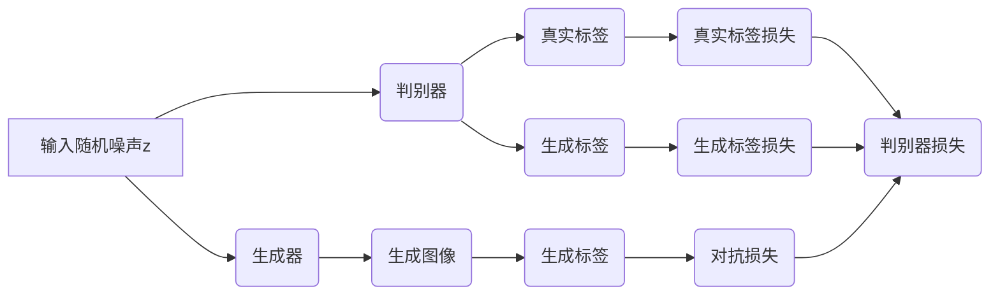
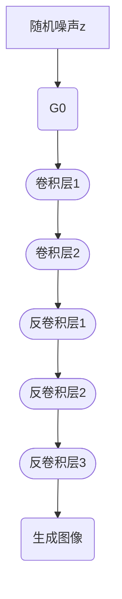
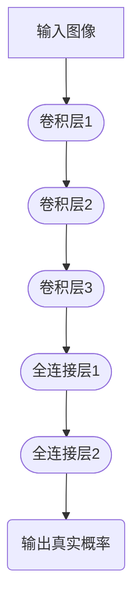

                 

# 基于生成对抗网络的艺术品仿真与风格迁移技术

> 关键词：生成对抗网络（GAN）、艺术品仿真、风格迁移、图像生成、深度学习、人工智能

> 摘要：本文将深入探讨生成对抗网络（GAN）在艺术品仿真与风格迁移领域的应用。首先，我们回顾GAN的核心概念及其在图像生成中的应用。随后，详细分析GAN在艺术品仿真中的优势，并介绍基于GAN的艺术品风格迁移技术。最后，通过实际案例和代码解析，展示GAN在实际项目中的应用，并对未来发展趋势和挑战进行展望。

## 1. 背景介绍

### 1.1 目的和范围

本文旨在介绍生成对抗网络（GAN）在艺术品仿真与风格迁移技术中的研究和应用。通过深入剖析GAN的核心算法原理，以及其在图像生成、风格迁移中的具体实现，帮助读者了解GAN技术的优势和实际应用。

### 1.2 预期读者

本文适合对深度学习、人工智能、图像处理有基础了解的读者。无论您是研究人员、工程师还是对这一领域感兴趣的学习者，都能从本文中获得宝贵的知识和经验。

### 1.3 文档结构概述

本文分为十个部分，包括背景介绍、核心概念与联系、核心算法原理、数学模型和公式、项目实战、实际应用场景、工具和资源推荐、总结、附录以及扩展阅读。每个部分都围绕GAN在艺术品仿真与风格迁移中的应用进行详细阐述。

### 1.4 术语表

#### 1.4.1 核心术语定义

- **生成对抗网络（GAN）**：一种基于博弈论的深度学习模型，由生成器和判别器两个神经网络组成，通过相互竞争来学习数据的分布。
- **艺术品仿真**：利用GAN模型生成与真实艺术品具有相似外观、风格和特性的图像。
- **风格迁移**：将一种艺术风格转移到另一幅图像上，使其呈现出特定艺术家的风格或时代风格。

#### 1.4.2 相关概念解释

- **生成器（Generator）**：GAN中的生成器负责生成具有真实数据特征的图像，目的是欺骗判别器。
- **判别器（Discriminator）**：GAN中的判别器负责判断输入图像是真实数据还是生成器生成的图像。
- **损失函数（Loss Function）**：用于衡量生成器和判别器在训练过程中的性能，常见的有交叉熵损失、均方误差等。

#### 1.4.3 缩略词列表

- **GAN**：生成对抗网络（Generative Adversarial Network）
- **DNN**：深度神经网络（Deep Neural Network）
- **CNN**：卷积神经网络（Convolutional Neural Network）
- **SGD**：随机梯度下降（Stochastic Gradient Descent）

## 2. 核心概念与联系

### 2.1 GAN原理概述

生成对抗网络（GAN）由生成器和判别器两个神经网络组成。生成器的目标是生成逼真的图像，判别器的目标是区分输入图像是真实图像还是生成器生成的图像。两个网络在训练过程中相互竞争，生成器试图生成更逼真的图像，判别器试图准确判断图像的真实性。通过这种博弈过程，生成器逐渐学会生成符合真实数据分布的图像。

### 2.2 GAN架构分析

下面是一个简化的GAN架构图，其中包含生成器（Generator）、判别器（Discriminator）和损失函数（Loss Function）。



### 2.3 GAN工作流程

1. **初始化生成器和判别器**：生成器和判别器通常都是DNN或CNN，初始化为随机权重。
2. **生成器生成图像**：生成器接收随机噪声作为输入，通过神经网络生成图像。
3. **判别器判断图像**：判别器接收真实数据和生成图像作为输入，输出一个介于0和1之间的值，表示图像的真实概率。
4. **计算损失函数**：生成器和判别器分别计算损失函数，损失函数用于衡量生成器和判别器的性能。
5. **更新模型参数**：通过反向传播算法和优化器（如SGD）更新生成器和判别器的参数。
6. **重复步骤2-5**：不断重复以上步骤，生成器和判别器逐渐收敛，生成逼真的图像。

## 3. 核心算法原理 & 具体操作步骤

### 3.1 生成器算法原理

生成器是GAN的核心组成部分，其主要任务是生成逼真的图像。生成器通常采用DNN或CNN架构，输入为随机噪声，输出为图像。

#### 3.1.1 生成器架构

生成器的架构通常由多个卷积层和反卷积层组成，卷积层用于提取图像特征，反卷积层用于将特征扩展到生成图像的空间。



#### 3.1.2 生成器算法步骤

1. **初始化生成器**：初始化生成器的权重和偏置，通常使用随机初始化。
2. **生成随机噪声**：生成一个随机噪声向量作为生成器的输入。
3. **通过卷积层提取特征**：将随机噪声通过多个卷积层，提取图像特征。
4. **通过反卷积层生成图像**：将卷积层提取的特征通过多个反卷积层，扩展到生成图像的空间。
5. **生成图像**：生成器输出一个具有真实数据特征的图像。

### 3.2 判别器算法原理

判别器是GAN的另一个核心组成部分，其主要任务是判断输入图像是真实图像还是生成图像。判别器通常采用CNN架构，输入为图像，输出为一个介于0和1之间的值，表示图像的真实概率。

#### 3.2.1 判别器架构

判别器的架构通常由多个卷积层和全连接层组成，卷积层用于提取图像特征，全连接层用于输出图像的真实概率。



#### 3.2.2 判别器算法步骤

1. **初始化判别器**：初始化判别器的权重和偏置，通常使用随机初始化。
2. **通过卷积层提取特征**：将输入图像通过多个卷积层，提取图像特征。
3. **通过全连接层计算真实概率**：将卷积层提取的特征通过多个全连接层，计算图像的真实概率。
4. **输出真实概率**：判别器输出一个介于0和1之间的值，表示图像的真实概率。

### 3.3 GAN训练过程

GAN的训练过程包括生成器和判别器的迭代训练，目的是使生成器生成的图像越来越逼真，判别器能够准确区分真实图像和生成图像。

#### 3.3.1 训练步骤

1. **初始化生成器和判别器**：使用随机初始化初始化生成器和判别器的权重和偏置。
2. **生成随机噪声**：生成一个随机噪声向量作为生成器的输入。
3. **生成器生成图像**：通过生成器生成一个图像。
4. **判别器判断图像**：将真实图像和生成图像输入判别器，计算真实概率。
5. **计算损失函数**：计算生成器和判别器的损失函数，包括真实标签损失、生成标签损失和对抗损失。
6. **更新模型参数**：通过反向传播算法和优化器更新生成器和判别器的参数。
7. **重复步骤2-6**：不断重复以上步骤，直到生成器和判别器收敛。

### 3.4 伪代码实现

下面是GAN的伪代码实现，用于生成和训练生成器和判别器。

```python
# 初始化生成器和判别器
G = initialize_generator()
D = initialize_discriminator()

# 初始化优化器
G_optimizer = initialize_optimizer(G)
D_optimizer = initialize_optimizer(D)

# 训练GAN
for epoch in range(num_epochs):
    for batch in data_loader:
        # 训练判别器
        D_optimizer.zero_grad()
        real_images = get_real_images(batch)
        real_labels = compute_real_labels(real_images)
        
        # 生成图像
        z = get_random_noise()
        generated_images = G(z)
        generated_labels = compute_generated_labels(generated_images)
        
        # 计算判别器损失
        D_loss = compute_discriminator_loss(D, real_images, generated_images, real_labels, generated_labels)
        
        # 反向传播和更新参数
        D_loss.backward()
        D_optimizer.step()
        
        # 训练生成器
        G_optimizer.zero_grad()
        
        # 生成图像
        z = get_random_noise()
        generated_images = G(z)
        generated_labels = compute_generated_labels(generated_images)
        
        # 计算生成器损失
        G_loss = compute_generator_loss(G, generated_images, generated_labels)
        
        # 反向传播和更新参数
        G_loss.backward()
        G_optimizer.step()
```

## 4. 数学模型和公式 & 详细讲解 & 举例说明

### 4.1 GAN的数学模型

生成对抗网络（GAN）的数学模型主要包括生成器（Generator）和判别器（Discriminator）的损失函数。

#### 4.1.1 生成器损失函数

生成器的目标是生成逼真的图像，使其在判别器上的输出接近于1。生成器的损失函数通常使用对抗损失（Adversarial Loss）来衡量。

$$
L_G = -\mathbb{E}_{z \sim p_z(z)}[\log(D(G(z))]
$$

其中，$z$表示随机噪声，$G(z)$表示生成器生成的图像，$D(G(z))$表示判别器对生成图像的判断结果，接近于1表示生成图像逼真。

#### 4.1.2 判别器损失函数

判别器的目标是区分真实图像和生成图像，使其在真实图像上的输出接近于1，在生成图像上的输出接近于0。判别器的损失函数通常使用二元交叉熵损失（Binary Cross-Entropy Loss）来衡量。

$$
L_D = -[\mathbb{E}_{x \sim p_{data}(x)}[\log(D(x))] + \mathbb{E}_{z \sim p_z(z)}[\log(1 - D(G(z)))]
$$

其中，$x$表示真实图像，$G(z)$表示生成器生成的图像，$D(x)$表示判别器对真实图像的判断结果，$D(G(z))$表示判别器对生成图像的判断结果。

### 4.2 损失函数的详细讲解

#### 4.2.1 生成器损失函数

生成器损失函数$L_G$表示生成器在判别器上的输出期望的对数。当生成器生成的图像逼真时，判别器输出的概率接近于1，因此生成器损失函数的值较小。

#### 4.2.2 判别器损失函数

判别器损失函数$L_D$由两部分组成：

1. **真实图像损失**：表示判别器在真实图像上的输出期望的对数。当判别器能够准确判断真实图像时，输出概率接近于1，因此损失较小。
2. **生成图像损失**：表示判别器在生成图像上的输出期望的对数。当判别器能够准确判断生成图像时，输出概率接近于0，因此损失较小。

### 4.3 举例说明

假设有一个生成对抗网络，其中生成器和判别器的损失函数分别为：

$$
L_G = -\mathbb{E}_{z \sim p_z(z)}[\log(D(G(z))]
$$

$$
L_D = -[\mathbb{E}_{x \sim p_{data}(x)}[\log(D(x))] + \mathbb{E}_{z \sim p_z(z)}[\log(1 - D(G(z)))]
$$

其中，$z$表示随机噪声，$G(z)$表示生成器生成的图像，$D(G(z))$表示判别器对生成图像的判断结果。

#### 4.3.1 生成器损失函数的举例

假设生成器生成的图像逼真，判别器输出的概率接近于1，即：

$$
D(G(z)) \approx 1
$$

代入生成器损失函数：

$$
L_G = -\mathbb{E}_{z \sim p_z(z)}[\log(1)] = 0
$$

因此，生成器损失函数的值为0，表示生成器生成的图像逼真。

#### 4.3.2 判别器损失函数的举例

假设判别器能够准确判断真实图像，输出概率接近于1，同时能够准确判断生成图像，输出概率接近于0，即：

$$
D(x) \approx 1
$$

$$
D(G(z)) \approx 0
$$

代入判别器损失函数：

$$
L_D = -[\mathbb{E}_{x \sim p_{data}(x)}[\log(1)] + \mathbb{E}_{z \sim p_z(z)}[\log(0)]]
$$

由于$\log(0)$趋于负无穷，因此判别器损失函数的值为负无穷，表示判别器在真实图像和生成图像上的判断结果准确。

## 5. 项目实战：代码实际案例和详细解释说明

### 5.1 开发环境搭建

在开始之前，我们需要搭建一个适合GAN训练和测试的开发环境。以下是搭建环境的步骤：

1. **安装Python**：下载并安装Python，版本建议为3.7或更高。
2. **安装PyTorch**：使用pip命令安装PyTorch库，命令如下：

   ```shell
   pip install torch torchvision
   ```

3. **安装其他依赖库**：安装其他所需的库，例如NumPy、matplotlib等，命令如下：

   ```shell
   pip install numpy matplotlib
   ```

### 5.2 源代码详细实现和代码解读

以下是实现一个简单的GAN模型的Python代码，用于生成和训练生成器和判别器。

```python
import torch
import torch.nn as nn
import torch.optim as optim
import torchvision.transforms as transforms
from torch.utils.data import DataLoader
from torchvision import datasets
import numpy as np
import matplotlib.pyplot as plt

# 初始化参数
batch_size = 64
image_size = 64
nz = 100
num_epochs = 5
lr = 0.0002
beta1 = 0.5

# 创建数据加载器
transform = transforms.Compose([
    transforms.ToTensor(),
    transforms.Normalize((0.5, 0.5, 0.5), (0.5, 0.5, 0.5))
])
train_dataset = datasets.MNIST(
    root='./data', train=True, download=True, transform=transform)
train_loader = DataLoader(dataset=train_dataset, batch_size=batch_size, shuffle=True)

# 创建生成器和判别器
class Generator(nn.Module):
    def __init__(self):
        super(Generator, self).__init__()
        self.main = nn.Sequential(
            nn.Linear(nz, 128),
            nn.LeakyReLU(0.2, inplace=True),
            nn.Linear(128, 256),
            nn.LeakyReLU(0.2, inplace=True),
            nn.Linear(256, 512),
            nn.LeakyReLU(0.2, inplace=True),
            nn.Linear(512, 1024),
            nn.LeakyReLU(0.2, inplace=True),
            nn.Linear(1024, image_size * image_size * 3),
            nn.Tanh()
        )

    def forward(self, input):
        return self.main(input)

class Discriminator(nn.Module):
    def __init__(self):
        super(Discriminator, self).__init__()
        self.main = nn.Sequential(
            nn.Linear(image_size * image_size * 3, 1024),
            nn.LeakyReLU(0.2, inplace=True),
            nn.Dropout(0.3),
            nn.Linear(1024, 512),
            nn.LeakyReLU(0.2, inplace=True),
            nn.Dropout(0.3),
            nn.Linear(512, 256),
            nn.LeakyReLU(0.2, inplace=True),
            nn.Dropout(0.3),
            nn.Linear(256, 1),
            nn.Sigmoid()
        )

    def forward(self, input):
        return self.main(input)

G = Generator()
D = Discriminator()

# 创建损失函数和优化器
criterion = nn.BCELoss()
G_optimizer = optim.Adam(G.parameters(), lr=lr, betas=(beta1, 0.999))
D_optimizer = optim.Adam(D.parameters(), lr=lr, betas=(beta1, 0.999))

# 训练GAN
for epoch in range(num_epochs):
    for i, data in enumerate(train_loader, 0):
        # 训练判别器
        D_optimizer.zero_grad()
        real_images = data[0].to(device)
        batch_size = real_images.size(0)
        labels = torch.full((batch_size,), 1, device=device)
        
        # 生成图像
        z = torch.randn(batch_size, nz, device=device)
        fake_images = G(z)
        fake_labels = torch.full((batch_size,), 0, device=device)
        
        # 计算判别器损失
        D_real = D(real_images).view(-1)
        D_fake = D(fake_images).view(-1)
        D_loss = criterion(D_real, labels) + criterion(D_fake, fake_labels)
        
        # 反向传播和更新参数
        D_loss.backward()
        D_optimizer.step()
        
        # 训练生成器
        G_optimizer.zero_grad()
        
        # 生成图像
        z = torch.randn(batch_size, nz, device=device)
        fake_images = G(z)
        fake_labels = torch.full((batch_size,), 1, device=device)
        
        # 计算生成器损失
        D_fake = D(fake_images).view(-1)
        G_loss = criterion(D_fake, fake_labels)
        
        # 反向传播和更新参数
        G_loss.backward()
        G_optimizer.step()
        
        # 打印训练过程
        if i % 100 == 0:
            print(f'[{epoch}/{num_epochs}][{i}/{len(train_loader)}] D_loss: {D_loss.item():.4f} G_loss: {G_loss.item():.4f}')
```

### 5.3 代码解读与分析

上述代码实现了一个简单的GAN模型，用于生成和训练生成器和判别器。下面是对代码的解读和分析：

1. **数据加载器**：首先，我们创建了一个数据加载器，用于加载MNIST数据集。数据加载器将数据分为批次，每个批次包含64个图像。
2. **生成器和判别器**：然后，我们定义了生成器和判别器的架构。生成器使用多层全连接层和激活函数，将随机噪声映射到图像空间。判别器使用多层全连接层、激活函数和丢弃层，用于区分真实图像和生成图像。
3. **损失函数和优化器**：接着，我们定义了损失函数和优化器。损失函数使用二元交叉熵损失，优化器使用Adam优化器。
4. **训练GAN**：在训练过程中，我们首先训练判别器，然后训练生成器。每次迭代中，我们通过真实图像和生成图像来更新判别器和生成器的参数。判别器通过计算真实图像和生成图像的损失来更新参数，生成器通过计算生成图像的损失来更新参数。
5. **打印训练过程**：在每次迭代中，我们打印判别器和生成器的损失，以便了解训练过程。

通过上述代码和解析，我们可以实现一个简单的GAN模型，用于生成和训练生成器和判别器。

## 6. 实际应用场景

### 6.1 艺术品仿真

GAN在艺术品仿真领域具有广泛的应用。通过GAN模型，我们可以生成具有真实艺术品外观、风格和特性的图像。以下是一些实际应用场景：

1. **艺术品修复**：使用GAN模型生成缺失或损坏部分的艺术品，以便进行修复和保存。
2. **艺术风格模仿**：利用GAN模型模仿著名艺术家的绘画风格，生成与艺术家作品相似的艺术品。
3. **艺术创作辅助**：艺术家可以使用GAN模型作为创作工具，生成新颖的艺术作品，为艺术创作提供灵感。

### 6.2 风格迁移

风格迁移是GAN在图像处理领域的另一个重要应用。通过GAN模型，我们可以将一种艺术风格转移到另一幅图像上，使其呈现出特定艺术家的风格或时代风格。以下是一些实际应用场景：

1. **艺术作品风格化**：将普通照片转换为具有某种艺术风格的作品，如印象派、野兽派等。
2. **广告创意设计**：利用风格迁移技术为广告创意设计添加特定艺术风格，提高广告的吸引力。
3. **电影特效制作**：将电影中的场景风格化，为观众带来视觉上的冲击和体验。

### 6.3 其他应用场景

除了艺术品仿真和风格迁移，GAN在以下领域也具有广泛应用：

1. **医疗影像处理**：使用GAN模型对医疗影像进行处理，提高影像质量和诊断准确性。
2. **自然语言处理**：GAN模型在自然语言处理领域用于生成逼真的文本、对话等。
3. **图像超分辨率**：使用GAN模型将低分辨率图像转换为高分辨率图像，提高图像质量。

## 7. 工具和资源推荐

### 7.1 学习资源推荐

#### 7.1.1 书籍推荐

1. **《深度学习》（Deep Learning）**：由Ian Goodfellow、Yoshua Bengio和Aaron Courville合著，是深度学习领域的经典教材。
2. **《生成对抗网络：理论与应用》（Generative Adversarial Networks: Theory and Applications）**：详细介绍了GAN的理论基础和应用场景。

#### 7.1.2 在线课程

1. **Coursera上的“深度学习”课程**：由斯坦福大学教授Andrew Ng讲授，涵盖深度学习的理论基础和应用。
2. **Udacity上的“生成对抗网络”课程**：深入讲解GAN的理论和应用，包括图像生成、风格迁移等。

#### 7.1.3 技术博客和网站

1. **arXiv**：提供最新的学术论文和研究成果，包括GAN领域的最新研究。
2. **Medium上的GAN专题**：汇集了GAN领域的专家和技术人员分享的见解和经验。

### 7.2 开发工具框架推荐

#### 7.2.1 IDE和编辑器

1. **PyCharm**：一款功能强大的Python集成开发环境，支持PyTorch库。
2. **Jupyter Notebook**：适合数据科学和机器学习的交互式开发环境，方便进行实验和调试。

#### 7.2.2 调试和性能分析工具

1. **PyTorch Profiler**：用于分析和优化PyTorch模型的性能。
2. **TensorBoard**：用于可视化PyTorch模型的训练过程，包括损失函数、梯度等。

#### 7.2.3 相关框架和库

1. **PyTorch**：一款强大的深度学习框架，支持GPU加速。
2. **TensorFlow**：由Google开发的深度学习框架，支持多种编程语言。

### 7.3 相关论文著作推荐

#### 7.3.1 经典论文

1. **“Generative Adversarial Nets”**：Ian Goodfellow等人在2014年发表的经典论文，提出了GAN的概念和架构。
2. **“Unsupervised Representation Learning with Deep Convolutional Generative Adversarial Networks”**：由Alexy

