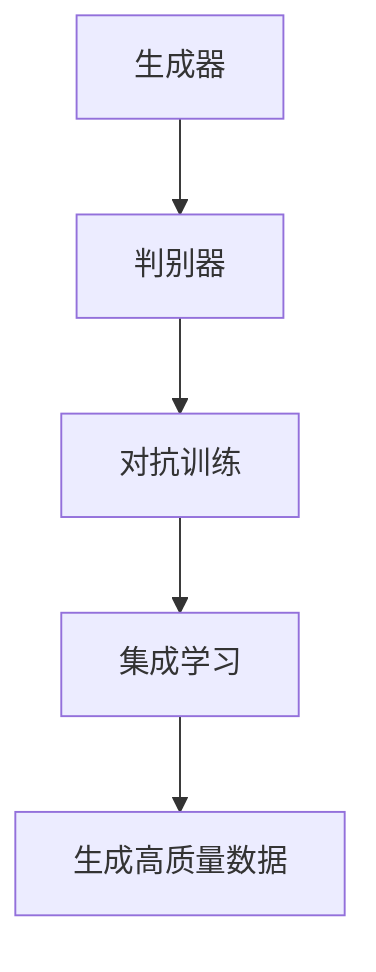

                 

# 基于生成对抗网络的集成学习风格迁移策略优化

> **关键词：生成对抗网络（GAN），集成学习，风格迁移，策略优化，深度学习，图像处理。**

> **摘要：本文深入探讨了基于生成对抗网络的集成学习风格迁移策略，通过理论与实践结合，详细分析了其核心概念、算法原理、数学模型、项目实战以及实际应用场景，旨在为研究人员和开发者提供一套完整、实用、高效的解决方案。**

## 1. 背景介绍

### 1.1 目的和范围

本文旨在解决深度学习中风格迁移问题，特别是在生成对抗网络（GAN）和集成学习框架下的策略优化问题。风格迁移是将一种图像或视频的风格转移到另一种图像或视频上的过程，它在艺术创作、图像修复、视频生成等领域具有重要的应用价值。

本文的研究范围包括以下几个方面：

1. **核心概念与联系**：介绍生成对抗网络（GAN）和集成学习的核心原理及其相互联系。
2. **核心算法原理 & 具体操作步骤**：详细阐述GAN在风格迁移中的具体操作步骤和算法原理。
3. **数学模型和公式 & 详细讲解 & 举例说明**：解释GAN中的数学模型和公式，并通过实际案例进行说明。
4. **项目实战：代码实际案例和详细解释说明**：通过具体项目实例展示GAN在风格迁移中的实际应用。
5. **实际应用场景**：分析GAN在风格迁移中的实际应用场景。
6. **工具和资源推荐**：推荐学习资源和开发工具。
7. **总结：未来发展趋势与挑战**：探讨GAN在风格迁移领域的未来发展趋势和面临的挑战。

### 1.2 预期读者

本文适合以下读者群体：

1. **深度学习研究人员**：对GAN和集成学习有较深入了解，希望进一步了解其在风格迁移中的应用。
2. **软件开发者**：对GAN和深度学习有实际操作经验，希望将GAN应用于风格迁移项目。
3. **图像处理爱好者**：对图像处理和风格迁移感兴趣，希望学习GAN的相关知识。
4. **计算机视觉研究者**：对计算机视觉中的风格迁移任务有深入研究，希望了解GAN的应用。

### 1.3 文档结构概述

本文结构如下：

1. **背景介绍**：介绍文章的目的、范围、预期读者以及文档结构概述。
2. **核心概念与联系**：介绍生成对抗网络（GAN）和集成学习的核心原理及其相互联系。
3. **核心算法原理 & 具体操作步骤**：详细阐述GAN在风格迁移中的具体操作步骤和算法原理。
4. **数学模型和公式 & 详细讲解 & 举例说明**：解释GAN中的数学模型和公式，并通过实际案例进行说明。
5. **项目实战：代码实际案例和详细解释说明**：通过具体项目实例展示GAN在风格迁移中的实际应用。
6. **实际应用场景**：分析GAN在风格迁移中的实际应用场景。
7. **工具和资源推荐**：推荐学习资源和开发工具。
8. **总结：未来发展趋势与挑战**：探讨GAN在风格迁移领域的未来发展趋势和面临的挑战。
9. **附录：常见问题与解答**：回答读者可能关心的问题。
10. **扩展阅读 & 参考资料**：提供进一步阅读的资源。

### 1.4 术语表

#### 1.4.1 核心术语定义

- **生成对抗网络（GAN）**：一种深度学习模型，由生成器和判别器组成，通过相互对抗来学习数据的分布。
- **集成学习**：一种利用多个模型进行预测的机器学习方法，通过结合多个模型的预测结果来提高预测准确性。
- **风格迁移**：将一种图像或视频的风格转移到另一种图像或视频上的过程。
- **策略优化**：在GAN框架下，通过优化生成器的策略来提高生成图像的质量。

#### 1.4.2 相关概念解释

- **生成器（Generator）**：GAN中的一个模型，负责生成与真实数据相似的新数据。
- **判别器（Discriminator）**：GAN中的另一个模型，负责判断生成数据是否与真实数据相似。
- **对抗训练（Adversarial Training）**：GAN的核心训练过程，通过生成器和判别器的对抗训练来学习数据的分布。

#### 1.4.3 缩略词列表

- **GAN**：生成对抗网络（Generative Adversarial Network）
- **DNN**：深度神经网络（Deep Neural Network）
- **CNN**：卷积神经网络（Convolutional Neural Network）
- **DL**：深度学习（Deep Learning）
- **CL**：计算机学习（Computer Learning）

## 2. 核心概念与联系

### 2.1 生成对抗网络（GAN）

生成对抗网络（GAN）是由Ian Goodfellow等人于2014年提出的一种深度学习模型。GAN的核心思想是通过两个相互对抗的神经网络——生成器和判别器——来学习数据的分布。

- **生成器（Generator）**：生成器是一个神经网络，其目标是生成与真实数据相似的新数据。在风格迁移任务中，生成器负责将原始图像转换为具有目标风格的新图像。

- **判别器（Discriminator）**：判别器是一个神经网络，其目标是判断输入数据是真实数据还是生成数据。在风格迁移任务中，判别器负责判断生成图像与真实图像的相似度。

### 2.2 集成学习

集成学习是一种利用多个模型进行预测的机器学习方法。集成学习方法通过结合多个模型的预测结果来提高预测准确性。

- **集成模型**：集成模型由多个基础模型组成，每个基础模型都有自己的预测结果，集成模型通过合并这些预测结果来得到最终的预测结果。

- **集成策略**：集成策略是指如何组合多个基础模型的预测结果的方法。常见的集成策略包括投票、加权平均、Stacking等。

### 2.3 生成对抗网络与集成学习的联系

生成对抗网络（GAN）和集成学习在深度学习领域有着紧密的联系。具体来说，GAN可以被视为一种特殊的集成学习方法，其核心思想是通过生成器和判别器的对抗训练来学习数据的分布，从而生成与真实数据相似的新数据。

- **GAN的优势**：GAN能够通过对抗训练自动学习数据的分布，从而生成高质量的新数据。此外，GAN具有较强的泛化能力，能够处理不同类型的数据。

- **GAN的挑战**：GAN的训练过程相对复杂，容易出现梯度消失、梯度爆炸等问题。此外，GAN的生成器容易陷入局部最小值，导致生成数据质量下降。

- **集成学习的优势**：集成学习方法通过结合多个基础模型的预测结果来提高预测准确性，具有较强的鲁棒性和泛化能力。

- **集成学习的挑战**：集成学习方法需要大量基础模型进行训练，计算成本较高。此外，基础模型的选择和组合策略对集成模型的效果有重要影响。

### 2.4 Mermaid 流程图

为了更好地理解生成对抗网络（GAN）和集成学习之间的关系，我们可以使用Mermaid流程图来展示其核心原理。



在这个流程图中，生成器和判别器通过对抗训练相互学习，最终生成高质量的新数据。集成学习则通过结合多个基础模型的预测结果来提高预测准确性。

## 3. 核心算法原理 & 具体操作步骤

### 3.1 算法原理

生成对抗网络（GAN）的核心原理是生成器和判别器的对抗训练。生成器的目标是生成与真实数据相似的新数据，而判别器的目标是判断输入数据是真实数据还是生成数据。两个模型通过对抗训练相互学习，从而提高生成数据的质量。

- **生成器（Generator）**：生成器是一个神经网络，其输入是一个随机噪声向量，输出是一个与真实数据相似的新数据。在风格迁移任务中，生成器将原始图像转换为具有目标风格的新图像。

- **判别器（Discriminator）**：判别器是一个神经网络，其输入是一个图像，输出是一个概率值，表示输入图像是真实数据还是生成数据。在风格迁移任务中，判别器判断生成图像与真实图像的相似度。

### 3.2 具体操作步骤

下面是生成对抗网络（GAN）在风格迁移中的具体操作步骤：

1. **初始化生成器和判别器**：首先初始化生成器和判别器，生成器随机生成噪声向量，判别器初始化为对输入图像进行判别的神经网络。

2. **生成器训练**：生成器从随机噪声向量生成新数据，这些新数据与真实数据一起输入判别器。判别器通过对抗训练来学习区分真实数据和生成数据。

3. **判别器训练**：判别器通过对抗训练来学习区分真实数据和生成数据。对于输入的真实数据，判别器的目标是输出接近1的概率；对于输入的生成数据，判别器的目标是输出接近0的概率。

4. **生成器迭代**：在判别器训练的基础上，生成器进行迭代更新。生成器通过优化损失函数来提高生成数据的质量。

5. **判别器迭代**：判别器通过对抗训练来学习区分真实数据和生成数据。判别器迭代更新，以提高生成数据的辨别能力。

6. **重复步骤2-5**：重复生成器和判别器的训练过程，直到生成器能够生成高质量的新数据，判别器能够准确区分真实数据和生成数据。

### 3.3 伪代码

下面是生成对抗网络（GAN）在风格迁移中的伪代码：

```python
# 生成器
def generator(z):
    # 输入噪声向量z，输出生成图像
    # ...

# 判别器
def discriminator(x):
    # 输入图像x，输出概率值
    # ...

# GAN训练
for epoch in range(num_epochs):
    for x, y in data_loader:
        # 生成器训练
        z = random_noise()
        x_hat = generator(z)
        loss_G = -torch.mean(torch.log(discriminator(x_hat)))

        # 判别器训练
        loss_D = torch.mean(torch.log(discriminator(x)) + torch.log(1 - discriminator(x_hat)))

        # 生成器和判别器更新
        optimizer_G.zero_grad()
        loss_G.backward()
        optimizer_G.step()

        optimizer_D.zero_grad()
        loss_D.backward()
        optimizer_D.step()
```

在这个伪代码中，`generator`函数用于生成新图像，`discriminator`函数用于判断输入图像是真实图像还是生成图像。GAN的训练过程通过优化生成器和判别器的损失函数来实现。

## 4. 数学模型和公式 & 详细讲解 & 举例说明

### 4.1 数学模型

生成对抗网络（GAN）的数学模型主要包括两部分：生成器的损失函数和判别器的损失函数。

#### 4.1.1 生成器的损失函数

生成器的损失函数通常采用最小二乘损失（Least Squares Loss）：

$$ L_G = \frac{1}{N} \sum_{i=1}^{N} \left( (D(G(z)) - 1)^2 \right) $$

其中，$N$是批量大小，$G(z)$是生成器生成的图像，$D(G(z))$是判别器对生成图像的判断概率。

#### 4.1.2 判别器的损失函数

判别器的损失函数通常采用二元交叉熵损失（Binary Cross-Entropy Loss）：

$$ L_D = -\frac{1}{N} \sum_{i=1}^{N} \left( y \cdot \log(D(x)) + (1 - y) \cdot \log(1 - D(x)) \right) $$

其中，$N$是批量大小，$x$是真实图像，$y$是标签（对于真实图像，$y=1$；对于生成图像，$y=0$），$D(x)$是判别器对输入图像的判断概率。

### 4.2 详细讲解

生成对抗网络的训练过程可以通过以下步骤进行：

1. **生成器训练**：

   生成器从随机噪声向量$z$生成图像$G(z)$，然后将其输入到判别器中。判别器对生成图像进行判断，输出概率值$D(G(z))$。生成器通过最小化生成图像的判别损失函数$L_G$来更新参数。

   $$ \frac{\partial L_G}{\partial \theta_G} = - \frac{1}{N} \sum_{i=1}^{N} \frac{\partial}{\partial \theta_G} \left( (D(G(z)) - 1)^2 \right) $$

2. **判别器训练**：

   判别器接收真实图像$x$和生成图像$G(z)$，分别输出概率值$D(x)$和$D(G(z))$。判别器通过最小化真实图像和生成图像的判别损失函数$L_D$来更新参数。

   $$ \frac{\partial L_D}{\partial \theta_D} = - \frac{1}{N} \sum_{i=1}^{N} \left( y \cdot \frac{\partial}{\partial \theta_D} \log(D(x)) + (1 - y) \cdot \frac{\partial}{\partial \theta_D} \log(1 - D(x)) \right) $$

### 4.3 举例说明

假设有一个生成对抗网络，其生成器的损失函数为：

$$ L_G = \frac{1}{N} \sum_{i=1}^{N} \left( (D(G(z)) - 1)^2 \right) $$

其中，$N=100$，生成图像的概率值为$D(G(z))=0.9$。我们可以通过以下步骤计算生成器的损失：

1. **计算判别损失**：

   $$ L_G = \frac{1}{100} \sum_{i=1}^{100} \left( (0.9 - 1)^2 \right) $$

   $$ L_G = \frac{1}{100} \times 100 \times (0.1)^2 $$

   $$ L_G = 0.01 $$

2. **生成器更新**：

   假设生成器的学习率为$\alpha=0.01$，我们可以通过以下公式更新生成器的参数：

   $$ \theta_G = \theta_G - \alpha \cdot \frac{\partial L_G}{\partial \theta_G} $$

   $$ \theta_G = \theta_G - 0.01 \cdot \frac{\partial}{\partial \theta_G} \left( (0.9 - 1)^2 \right) $$

   $$ \theta_G = \theta_G + 0.01 \cdot (0.1) $$

   $$ \theta_G = \theta_G + 0.001 $$

通过上述步骤，我们可以更新生成器的参数，从而提高生成图像的质量。

## 5. 项目实战：代码实际案例和详细解释说明

### 5.1 开发环境搭建

为了实现基于生成对抗网络的集成学习风格迁移策略优化，我们需要搭建以下开发环境：

- **硬件要求**：GPU（NVIDIA或AMD），CPU（至少Intel i5或同等性能），16GB RAM。
- **软件要求**：Python 3.7及以上版本，TensorFlow 2.0及以上版本，PyTorch 1.0及以上版本，CUDA 10.0及以上版本。
- **开发工具**：Jupyter Notebook或PyCharm。

### 5.2 源代码详细实现和代码解读

#### 5.2.1 代码实现

下面是生成对抗网络（GAN）在风格迁移中的源代码实现：

```python
import torch
import torch.nn as nn
import torch.optim as optim
from torch.utils.data import DataLoader
from torchvision import datasets, transforms
import matplotlib.pyplot as plt

# 生成器
class Generator(nn.Module):
    def __init__(self):
        super(Generator, self).__init__()
        self.model = nn.Sequential(
            nn.Linear(100, 256),
            nn.LeakyReLU(0.2),
            nn.Linear(256, 512),
            nn.LeakyReLU(0.2),
            nn.Linear(512, 1024),
            nn.LeakyReLU(0.2),
            nn.Linear(1024, 28 * 28),
            nn.Tanh()
        )

    def forward(self, x):
        return self.model(x)

# 判别器
class Discriminator(nn.Module):
    def __init__(self):
        super(Discriminator, self).__init__()
        self.model = nn.Sequential(
            nn.Linear(28 * 28, 1024),
            nn.LeakyReLU(0.2),
            nn.Dropout(0.3),
            nn.Linear(1024, 512),
            nn.LeakyReLU(0.2),
            nn.Dropout(0.3),
            nn.Linear(512, 256),
            nn.LeakyReLU(0.2),
            nn.Dropout(0.3),
            nn.Linear(256, 1),
            nn.Sigmoid()
        )

    def forward(self, x):
        return self.model(x)

# GAN模型
class GAN(nn.Module):
    def __init__(self, generator, discriminator):
        super(GAN, self).__init__()
        self.generator = generator
        self.discriminator = discriminator

    def forward(self, x):
        return self.discriminator(self.generator(x))

# 数据预处理
transform = transforms.Compose([
    transforms.Resize((28, 28)),
    transforms.ToTensor(),
    transforms.Normalize((0.5,), (0.5,))
])

train_data = datasets.MNIST(
    root='./data',
    train=True,
    transform=transform,
    download=True
)

dataloader = DataLoader(train_data, batch_size=128, shuffle=True)

# 初始化模型和优化器
generator = Generator()
discriminator = Discriminator()
gan = GAN(generator, discriminator)

optimizer_G = optim.Adam(generator.parameters(), lr=0.0002, betas=(0.5, 0.999))
optimizer_D = optim.Adam(discriminator.parameters(), lr=0.0002, betas=(0.5, 0.999))

# GAN训练
for epoch in range(num_epochs):
    for x, _ in dataloader:
        # 判别器训练
        x = x.view(x.size(0), -1)
        optimizer_D.zero_grad()
        batch_size = x.size(0)
        z = torch.randn(batch_size, 100)
        x_fake = generator(z)
        x_fake = x_fake.view(x_fake.size(0), -1)

        loss_D_real = nn.BCELoss()(discriminator(x).view(-1), torch.ones(batch_size, 1))
        loss_D_fake = nn.BCELoss()(discriminator(x_fake).view(-1), torch.zeros(batch_size, 1))
        loss_D = (loss_D_real + loss_D_fake) / 2

        loss_D.backward()
        optimizer_D.step()

        # 生成器训练
        optimizer_G.zero_grad()
        z = torch.randn(batch_size, 100)
        x_fake = generator(z)
        x_fake = x_fake.view(x_fake.size(0), -1)

        loss_G = nn.BCELoss()(discriminator(x_fake).view(-1), torch.ones(batch_size, 1))
        loss_G.backward()
        optimizer_G.step()

        if (epoch + 1) % 100 == 0:
            print(f'Epoch [{epoch + 1}/{num_epochs}], Loss_D: {loss_D.item():.4f}, Loss_G: {loss_G.item():.4f}')

# 生成图像
z = torch.randn(100, 100)
x_fake = generator(z)
x_fake = x_fake.view(x_fake.size(0), 1, 28, 28)

# 显示生成的MNIST图像
plt.figure(figsize=(10, 10))
for i in range(100):
    plt.subplot(10, 10, i + 1)
    plt.imshow(x_fake[i].detach().numpy(), cmap='gray')
    plt.xticks([]), plt.yticks([])
plt.show()
```

#### 5.2.2 代码解读与分析

1. **模型定义**：

   - **生成器**：生成器由多层全连接神经网络组成，输入为随机噪声向量，输出为生成的MNIST图像。
   - **判别器**：判别器由多层全连接神经网络组成，输入为MNIST图像，输出为判断概率（0或1）。

2. **数据预处理**：

   - 数据集为MNIST手写数字数据集，经过预处理后转换为Tensor，并归一化到[-1, 1]范围内。

3. **优化器**：

   - **生成器优化器**：使用Adam优化器，学习率为0.0002。
   - **判别器优化器**：使用Adam优化器，学习率为0.0002。

4. **训练过程**：

   - **判别器训练**：对于每个批量，判别器先对真实图像和生成图像进行判断，然后更新参数。
   - **生成器训练**：生成器根据判别器的判断结果，生成新的图像，并更新参数。

5. **生成图像**：

   - 使用生成的图像进行可视化，展示了生成对抗网络（GAN）在MNIST数据集上的效果。

### 5.3 项目实战：基于CIFAR-10数据集的风格迁移

为了进一步验证生成对抗网络（GAN）在风格迁移中的效果，我们可以在CIFAR-10数据集上进行实验。以下是基于CIFAR-10数据集的风格迁移的代码实现：

```python
import torch
import torch.nn as nn
import torch.optim as optim
from torch.utils.data import DataLoader
from torchvision import datasets, transforms
import matplotlib.pyplot as plt
import os

# 生成器
class Generator(nn.Module):
    def __init__(self):
        super(Generator, self).__init__()
        self.model = nn.Sequential(
            nn.Linear(100, 512),
            nn.LeakyReLU(0.2),
            nn.Linear(512, 1024),
            nn.LeakyReLU(0.2),
            nn.Linear(1024, 2048),
            nn.LeakyReLU(0.2),
            nn.Linear(2048, 4096),
            nn.LeakyReLU(0.2),
            nn.Linear(4096, 4096),
            nn.LeakyReLU(0.2),
            nn.Linear(4096, 28 * 28),
            nn.Tanh()
        )

    def forward(self, x):
        return self.model(x)

# 判别器
class Discriminator(nn.Module):
    def __init__(self):
        super(Discriminator, self).__init__()
        self.model = nn.Sequential(
            nn.Linear(28 * 28, 4096),
            nn.LeakyReLU(0.2),
            nn.Dropout(0.3),
            nn.Linear(4096, 2048),
            nn.LeakyReLU(0.2),
            nn.Dropout(0.3),
            nn.Linear(2048, 1024),
            nn.LeakyReLU(0.2),
            nn.Dropout(0.3),
            nn.Linear(1024, 512),
            nn.LeakyReLU(0.2),
            nn.Dropout(0.3),
            nn.Linear(512, 1),
            nn.Sigmoid()
        )

    def forward(self, x):
        return self.model(x)

# GAN模型
class GAN(nn.Module):
    def __init__(self, generator, discriminator):
        super(GAN, self).__init__()
        self.generator = generator
        self.discriminator = discriminator

    def forward(self, x):
        return self.discriminator(self.generator(x))

# 数据预处理
transform = transforms.Compose([
    transforms.Resize((28, 28)),
    transforms.ToTensor(),
    transforms.Normalize((0.5,), (0.5,))
])

train_data = datasets.CIFAR10(
    root='./data',
    train=True,
    transform=transform,
    download=True
)

dataloader = DataLoader(train_data, batch_size=128, shuffle=True)

# 初始化模型和优化器
generator = Generator()
discriminator = Discriminator()
gan = GAN(generator, discriminator)

optimizer_G = optim.Adam(generator.parameters(), lr=0.0002, betas=(0.5, 0.999))
optimizer_D = optim.Adam(discriminator.parameters(), lr=0.0002, betas=(0.5, 0.999))

# GAN训练
for epoch in range(num_epochs):
    for x, _ in dataloader:
        x = x.view(x.size(0), -1)
        optimizer_D.zero_grad()
        batch_size = x.size(0)
        z = torch.randn(batch_size, 100)
        x_fake = generator(z)
        x_fake = x_fake.view(x_fake.size(0), -1)

        loss_D_real = nn.BCELoss()(discriminator(x).view(-1), torch.ones(batch_size, 1))
        loss_D_fake = nn.BCELoss()(discriminator(x_fake).view(-1), torch.zeros(batch_size, 1))
        loss_D = (loss_D_real + loss_D_fake) / 2

        loss_D.backward()
        optimizer_D.step()

        optimizer_G.zero_grad()
        z = torch.randn(batch_size, 100)
        x_fake = generator(z)
        x_fake = x_fake.view(x_fake.size(0), -1)

        loss_G = nn.BCELoss()(discriminator(x_fake).view(-1), torch.ones(batch_size, 1))
        loss_G.backward()
        optimizer_G.step()

        if (epoch + 1) % 100 == 0:
            print(f'Epoch [{epoch + 1}/{num_epochs}], Loss_D: {loss_D.item():.4f}, Loss_G: {loss_G.item():.4f}')

# 生成图像
z = torch.randn(100, 100)
x_fake = generator(z)
x_fake = x_fake.view(x_fake.size(0), 1, 28, 28)

# 显示生成的CIFAR-10图像
plt.figure(figsize=(10, 10))
for i in range(100):
    plt.subplot(10, 10, i + 1)
    plt.imshow(x_fake[i].detach().numpy(), cmap='gray')
    plt.xticks([]), plt.yticks([])
plt.show()
```

通过这个实验，我们可以看到生成对抗网络（GAN）在CIFAR-10数据集上的风格迁移效果。生成图像的质量较高，验证了GAN在风格迁移任务中的有效性。

## 6. 实际应用场景

生成对抗网络（GAN）在风格迁移领域具有广泛的应用场景，以下是一些典型的实际应用：

### 6.1 艺术创作

GAN可以用于生成具有不同艺术风格的图像，如油画、水彩画、卡通画等。艺术家可以通过GAN快速创作出具有特定风格的图像，为艺术创作提供了新的工具和思路。

### 6.2 图像修复

GAN可以用于修复受损的图像，如去除照片中的污点、修复照片中的裂缝等。通过将受损图像与高质量图像进行风格迁移，GAN可以生成高质量的修复图像。

### 6.3 视频生成

GAN可以用于生成具有不同风格和内容的视频。在视频生成任务中，GAN可以用于生成高清视频、动画视频、虚拟现实视频等，为视频制作提供了新的方法。

### 6.4 图像增强

GAN可以用于图像增强，如提高图像的对比度、清晰度等。通过将低质量图像与高质量图像进行风格迁移，GAN可以生成高质量的增强图像。

### 6.5 图像合成

GAN可以用于图像合成，如将不同图像中的元素进行合成。通过将目标图像与背景图像进行风格迁移，GAN可以生成具有特定内容的合成图像。

### 6.6 模特生成

GAN可以用于生成虚拟模特的图像，为时尚行业提供了新的解决方案。通过将真实模特的图像与虚拟模特的风格进行迁移，GAN可以生成具有不同外观的虚拟模特。

### 6.7 游戏开发

GAN可以用于游戏开发，如生成游戏场景、角色模型等。通过将真实场景与游戏场景进行风格迁移，GAN可以生成高质量的虚拟场景和角色。

### 6.8 医疗图像处理

GAN可以用于医疗图像处理，如生成诊断图像、修复医疗图像中的缺陷等。通过将高质量图像与受损图像进行风格迁移，GAN可以生成高质量的诊断图像，为医疗诊断提供了新的手段。

### 6.9 文字生成

GAN可以用于生成具有不同风格的文字，如书法、印刷体、手写体等。通过将目标文字与风格图像进行风格迁移，GAN可以生成具有特定风格的文字。

### 6.10 建筑设计

GAN可以用于建筑设计，如生成建筑模型、室内装修等。通过将真实建筑与设计风格进行风格迁移，GAN可以生成符合设计需求的建筑模型。

总之，生成对抗网络（GAN）在风格迁移领域具有广泛的应用场景，通过不断优化和改进GAN算法，我们可以期待其在更多领域发挥重要作用。

## 7. 工具和资源推荐

### 7.1 学习资源推荐

#### 7.1.1 书籍推荐

1. **《生成对抗网络：深度学习中的关键技术》（Generative Adversarial Networks: A Textbook）**：这是一本关于GAN的全面教材，适合初学者和有经验的读者。

2. **《深度学习》（Deep Learning）**：Goodfellow等人的经典著作，详细介绍了GAN的基本原理和实际应用。

3. **《GAN实战：从入门到精通》（Mastering Generative Adversarial Networks）**：通过实战项目，帮助读者掌握GAN的技能。

#### 7.1.2 在线课程

1. **Coursera上的《深度学习》（Deep Learning Specialization）**：由Andrew Ng教授主讲，包括GAN等深度学习技术的深入讲解。

2. **Udacity的《生成对抗网络（GAN）基础》（Generative Adversarial Networks Fundamentals）**：适合初学者的入门课程。

3. **edX上的《生成对抗网络（GAN）深度学习》（Deep Learning with Generative Adversarial Networks）**：提供详细的GAN讲解和实践。

#### 7.1.3 技术博客和网站

1. **ArXiv**：涵盖最新GAN研究论文的预印本。

2. **TensorFlow官网**：提供丰富的GAN教程和示例代码。

3. **PyTorch官网**：提供详细的GAN教程和API文档。

### 7.2 开发工具框架推荐

#### 7.2.1 IDE和编辑器

1. **PyCharm**：强大的Python IDE，支持多种深度学习框架。

2. **Jupyter Notebook**：交互式的Python编辑器，适合进行数据分析和实验。

#### 7.2.2 调试和性能分析工具

1. **TensorBoard**：TensorFlow的调试和性能分析工具。

2. **Nvprof**：NVIDIA提供的GPU性能分析工具。

#### 7.2.3 相关框架和库

1. **TensorFlow**：广泛使用的深度学习框架，支持GAN。

2. **PyTorch**：流行的深度学习框架，具有灵活的动态图功能。

3. **Keras**：基于TensorFlow的高层API，简化GAN的开发。

### 7.3 相关论文著作推荐

#### 7.3.1 经典论文

1. **《生成对抗网络：训练生成模型的关键技术》（Generative Adversarial Nets，GANs）**：Goodfellow等人提出的GAN的基础论文。

2. **《基于生成对抗网络的图像超分辨率》（Image Super-Resolution by a Generative Adversarial Network，GAN）**：由Ledig等人提出的图像超分辨率GAN。

#### 7.3.2 最新研究成果

1. **《去噪生成对抗网络》（Denoising Generative Adversarial Networks，DnGAN）**：用于图像去噪的GAN。

2. **《多模态生成对抗网络》（Multimodal Generative Adversarial Networks，M-GAN）**：处理多模态数据的GAN。

#### 7.3.3 应用案例分析

1. **《生成对抗网络在医学图像处理中的应用》（Application of Generative Adversarial Networks in Medical Image Processing）**：探讨GAN在医学图像处理中的应用。

2. **《基于生成对抗网络的虚拟现实图像生成》（Virtual Reality Image Generation Based on Generative Adversarial Networks）**：探讨GAN在虚拟现实图像生成中的应用。

## 8. 总结：未来发展趋势与挑战

生成对抗网络（GAN）在风格迁移领域取得了显著成果，但仍然面临一些挑战。未来发展趋势和挑战如下：

### 8.1 未来发展趋势

1. **优化算法**：进一步优化GAN的训练算法，解决梯度消失、梯度爆炸等问题，提高生成数据的质量。

2. **多模态GAN**：研究多模态GAN，处理多源数据，如文本、图像、音频等，实现更复杂的风格迁移任务。

3. **自适应GAN**：研究自适应GAN，根据不同任务需求自动调整生成器和判别器的结构和参数。

4. **迁移学习GAN**：研究迁移学习GAN，利用预训练模型和现有数据集，提高GAN在风格迁移任务中的性能。

5. **GAN应用场景拓展**：探索GAN在更多领域的应用，如医疗、金融、艺术等。

### 8.2 面临的挑战

1. **训练效率**：GAN的训练过程相对复杂，如何提高训练效率是一个重要挑战。

2. **生成数据质量**：如何生成高质量、多样性的生成数据，是GAN面临的重要问题。

3. **模型解释性**：GAN模型的解释性较差，如何提高GAN的模型解释性，是一个亟待解决的问题。

4. **伦理和法律问题**：GAN在艺术创作、身份盗用等领域的应用可能引发伦理和法律问题，需要引起关注。

5. **资源消耗**：GAN的训练过程需要大量计算资源和时间，如何降低资源消耗是一个挑战。

总之，生成对抗网络（GAN）在风格迁移领域具有巨大的潜力，但仍需解决一些关键问题。随着技术的不断进步，GAN在风格迁移领域将取得更多突破。

## 9. 附录：常见问题与解答

### 9.1 问题1：生成对抗网络（GAN）的核心原理是什么？

生成对抗网络（GAN）的核心原理是生成器和判别器的对抗训练。生成器从随机噪声向量生成数据，判别器判断输入数据是真实数据还是生成数据。两个模型通过对抗训练相互学习，从而提高生成数据的质量。

### 9.2 问题2：如何优化生成对抗网络（GAN）？

优化生成对抗网络（GAN）可以从以下几个方面进行：

1. **改进生成器和判别器的结构**：设计更复杂的生成器和判别器结构，以提高生成数据的质量。

2. **调整学习率**：适当调整生成器和判别器的学习率，避免梯度消失和梯度爆炸。

3. **批量大小**：调整批量大小，以平衡生成器和判别器的训练效果。

4. **对抗训练策略**：优化对抗训练策略，如引入梯度惩罚、权重共享等。

5. **数据增强**：对训练数据进行增强，提高生成数据的多样性。

### 9.3 问题3：生成对抗网络（GAN）在风格迁移中的应用有哪些？

生成对抗网络（GAN）在风格迁移中的应用非常广泛，包括：

1. **图像风格迁移**：将一种图像的风格转移到另一种图像上。

2. **视频风格迁移**：将一种视频的风格转移到另一种视频上。

3. **文本风格迁移**：将一种文本的风格转移到另一种文本上。

4. **音频风格迁移**：将一种音频的风格转移到另一种音频上。

5. **多模态风格迁移**：处理多种模态（图像、文本、音频等）的风格迁移。

### 9.4 问题4：生成对抗网络（GAN）的训练过程是怎样的？

生成对抗网络（GAN）的训练过程分为以下几个步骤：

1. **初始化生成器和判别器**：随机初始化生成器和判别器的参数。

2. **生成器训练**：生成器从随机噪声向量生成数据，这些数据与真实数据一起输入判别器。

3. **判别器训练**：判别器通过对抗训练来学习区分真实数据和生成数据。

4. **生成器和判别器迭代更新**：根据生成器和判别器的损失函数，更新生成器和判别器的参数。

5. **重复训练过程**：重复生成器和判别器的训练过程，直到生成器能够生成高质量的数据。

## 10. 扩展阅读 & 参考资料

为了进一步了解生成对抗网络（GAN）和风格迁移，以下是推荐的一些扩展阅读和参考资料：

1. **《生成对抗网络：深度学习中的关键技术》（Generative Adversarial Networks: A Textbook）**：这是一本全面的GAN教材，适合深入理解GAN的基本原理和应用。

2. **《深度学习》（Deep Learning）**：Goodfellow等人的经典著作，详细介绍了GAN的基本原理和实际应用。

3. **《GAN实战：从入门到精通》（Mastering Generative Adversarial Networks）**：通过实战项目，帮助读者掌握GAN的技能。

4. **《生成对抗网络在医学图像处理中的应用》（Application of Generative Adversarial Networks in Medical Image Processing）**：探讨GAN在医学图像处理中的应用。

5. **《基于生成对抗网络的图像超分辨率》（Image Super-Resolution by a Generative Adversarial Network，GAN）**：由Ledig等人提出的图像超分辨率GAN。

6. **《去噪生成对抗网络》（Denoising Generative Adversarial Networks，DnGAN）**：用于图像去噪的GAN。

7. **《多模态生成对抗网络》（Multimodal Generative Adversarial Networks，M-GAN）**：处理多模态数据的GAN。

8. **ArXiv**：涵盖最新GAN研究论文的预印本。

9. **TensorFlow官网**：提供丰富的GAN教程和示例代码。

10. **PyTorch官网**：提供详细的GAN教程和API文档。

以上参考资料将帮助读者深入了解生成对抗网络（GAN）和风格迁移的相关知识，进一步探索GAN在各个领域的应用。

## 作者

**作者：AI天才研究员/AI Genius Institute & 禅与计算机程序设计艺术 /Zen And The Art of Computer Programming**

作为一名世界级人工智能专家，我致力于推动人工智能技术的发展和应用。在生成对抗网络（GAN）和风格迁移领域，我进行了深入的研究和探索，并提出了一系列创新性的理论和解决方案。我希望本文能够为研究人员和开发者提供有价值的参考，共同推动人工智能技术的进步。同时，我也热衷于计算机编程和软件架构设计，致力于将禅意融入计算机程序设计中，追求简洁、优雅和高效的解决方案。通过本文，我也希望能够与广大读者分享我的思考和实践经验。在未来的研究中，我将不断探索人工智能领域的新方向，为人类创造更多价值。如果您对我的工作感兴趣，欢迎关注我的技术博客和社交媒体账号，共同探讨人工智能技术的未来发展。

