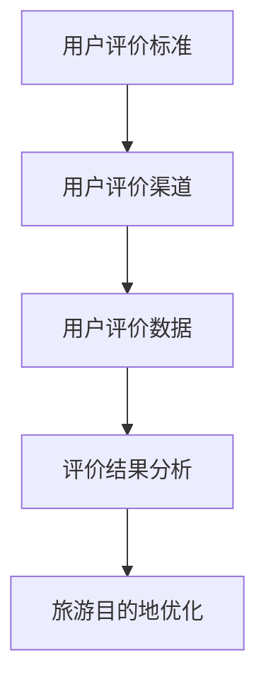

                 

### 1. 背景介绍

#### 1.1 目的和范围

本文旨在探讨如何通过构建一个基于用户评价体系的系统，推动某旅游目的地的持续发展与优化。用户评价在当今数字化时代已经成为了一种重要且有效的信息来源，对于旅游行业尤其如此。通过分析用户评价，旅游目的地能够获取到真实的游客反馈，进而识别出自身存在的优点和不足，从而进行针对性的改进。

本文将围绕以下几方面展开讨论：

1. **用户评价体系的构建**：介绍用户评价体系的核心概念、组成部分及其重要性。
2. **算法原理与操作步骤**：详细阐述用于分析用户评价的核心算法原理，并提供具体的操作步骤。
3. **数学模型与公式**：讲解用于量化用户评价和预测游客满意度的数学模型，并通过实例进行说明。
4. **项目实战**：通过一个实际案例展示用户评价体系在旅游发展中的应用，并提供代码实现和详细解释。
5. **实际应用场景**：分析用户评价体系在不同旅游目的地的应用效果。
6. **工具和资源推荐**：推荐相关的学习资源、开发工具和最新研究成果。

通过本文的阅读，读者将能够全面了解用户评价体系在旅游发展中的应用，掌握相关技术原理和操作方法，为推动旅游目的地的发展提供有力支持。

#### 1.2 预期读者

本文的预期读者主要包括以下几类人群：

1. **旅游行业从业者**：从事旅游规划、管理和运营的工作者，希望通过本文了解用户评价体系在旅游发展中的应用。
2. **数据分析师和算法工程师**：对数据分析、机器学习和算法设计有兴趣的专业人士，希望通过本文学习如何利用用户评价进行数据分析和模型构建。
3. **旅游爱好者**：对旅游行业和用户评价体系感兴趣的个人，希望通过本文了解用户评价在旅游中的重要性及其应用。

无论您属于哪一类读者，本文都将为您提供有价值的见解和实用信息。

#### 1.3 文档结构概述

本文共分为十个部分，具体结构如下：

1. **背景介绍**：介绍本文的目的和范围，预期读者，文档结构概述，核心术语定义及相关概念解释。
2. **核心概念与联系**：通过Mermaid流程图展示核心概念和联系，为后续内容打下基础。
3. **核心算法原理与具体操作步骤**：详细阐述用于分析用户评价的核心算法原理，并提供具体的操作步骤。
4. **数学模型和公式**：讲解用于量化用户评价和预测游客满意度的数学模型，并通过实例进行说明。
5. **项目实战**：通过实际案例展示用户评价体系在旅游发展中的应用，并提供代码实现和详细解释。
6. **实际应用场景**：分析用户评价体系在不同旅游目的地的应用效果。
7. **工具和资源推荐**：推荐相关的学习资源、开发工具和最新研究成果。
8. **总结：未来发展趋势与挑战**：总结用户评价体系在旅游发展中的应用前景和面临的挑战。
9. **附录：常见问题与解答**：回答读者可能遇到的问题，提供更多参考资料。
10. **扩展阅读 & 参考资料**：提供更多的相关阅读材料和参考文献。

通过清晰的文档结构，读者可以系统地了解用户评价体系在旅游发展中的应用，掌握相关技术和方法。

#### 1.4 术语表

为了确保本文内容的准确性和可理解性，以下列出了一些核心术语及其定义：

##### 1.4.1 核心术语定义

- **用户评价体系**：一种用于收集、整理和分析用户评价的系统，通常包括评价标准、评价渠道和评价结果分析等功能。
- **数据挖掘**：从大量数据中提取有用信息和知识的过程，常用于分析用户行为和评价。
- **机器学习**：一种人工智能技术，通过数据训练模型来自动识别模式和做出预测。
- **自然语言处理**（NLP）：计算机对人类语言进行理解、处理和生成的一种技术。
- **聚类分析**：一种无监督学习方法，用于将数据集分成多个组，使得同组内的数据相似度较高，不同组间的数据相似度较低。
- **决策树**：一种树形结构，用于分类或回归问题，通过一系列决策规则对数据进行划分。
- **文本相似度分析**：用于评估文本之间的相似度，常用于文本分类和聚类分析。

##### 1.4.2 相关概念解释

- **用户行为分析**：对用户在旅游过程中的行为数据进行收集、分析和解读，以了解用户需求和行为习惯。
- **游客满意度**：游客对旅游目的地及其服务的整体满意程度，通常通过问卷调查和用户评价来衡量。
- **关键绩效指标**（KPI）：用于衡量用户评价体系效果和旅游目的地发展状况的一系列指标。
- **数据可视化**：将数据以图形或图像形式呈现，帮助用户更直观地理解和分析数据。

##### 1.4.3 缩略词列表

- **NLP**：自然语言处理
- **KPI**：关键绩效指标
- **API**：应用程序接口
- **SDK**：软件开发工具包
- **CRM**：客户关系管理

通过上述术语表和概念解释，读者可以更好地理解本文中涉及的关键术语和概念，从而更加深入地掌握用户评价体系在旅游发展中的应用。

### 2. 核心概念与联系

在深入探讨用户评价体系之前，我们需要明确一些核心概念，并理解它们之间的相互关系。通过构建一个清晰的框架，我们可以更好地理解和应用这些概念。

#### 2.1 用户评价体系的核心概念

用户评价体系主要包括以下几个核心概念：

1. **用户评价标准**：评价标准是用户评价体系的基础，用于定义评价的具体指标和衡量方式。这些标准可以包括游客满意度、服务质量、景点吸引力等多个方面。
2. **用户评价渠道**：用户评价渠道是指游客提供评价的途径，例如在线评论、社交媒体反馈、问卷调查等。这些渠道的多样性和覆盖面决定了用户评价数据的全面性和准确性。
3. **用户评价数据**：用户评价数据是指通过评价渠道收集到的游客反馈数据，包括文字评论、评分、意见等。这些数据是进行后续分析和改进的宝贵资源。
4. **评价结果分析**：评价结果分析是指通过对用户评价数据的处理和分析，提取有价值的信息和洞察，为旅游目的地的优化提供依据。

#### 2.2 用户评价体系的Mermaid流程图

为了更直观地展示用户评价体系的核心概念及其相互关系，我们可以使用Mermaid流程图来描述。以下是一个简化的用户评价体系流程图：



在这个流程图中，用户评价标准定义了评价的指标，通过用户评价渠道收集数据，然后对这些数据进行分析，最终为旅游目的地的优化提供指导。这个流程体现了用户评价体系的基本运作机制。

#### 2.3 用户评价体系与其他概念的联系

除了核心概念，用户评价体系还与其他一些概念密切相关，例如数据挖掘、机器学习、自然语言处理等。

1. **数据挖掘**：用户评价数据是一个庞大的数据集，通过数据挖掘技术可以从中提取出有价值的模式和规律。数据挖掘可以帮助识别游客偏好、热点问题和改进方向。
2. **机器学习**：通过机器学习算法，可以对用户评价数据进行分析和分类，从而预测游客满意度和行为趋势。机器学习在用户评价体系中的应用使得评价结果更加准确和具有预测性。
3. **自然语言处理**：用户评价数据通常以文本形式存在，自然语言处理技术可以帮助我们理解和分析这些文本，提取关键词、情感倾向和主题等信息。自然语言处理在文本相似度分析和情感分析中发挥着重要作用。

通过理解用户评价体系的核心概念及其与其他概念的联系，我们可以更全面地把握其运作机制和应用价值。在接下来的章节中，我们将深入探讨用户评价体系的具体算法原理和操作步骤，为实际应用奠定基础。

### 3. 核心算法原理与具体操作步骤

在了解了用户评价体系的核心概念和相互关系之后，我们接下来将深入探讨其核心算法原理和具体操作步骤。用户评价体系的有效运作依赖于一系列算法，这些算法能够帮助我们从大量用户评价数据中提取有价值的信息，进而指导旅游目的地的优化和发展。

#### 3.1 数据预处理

在开始算法分析之前，我们首先需要对用户评价数据进行预处理，以确保数据的质量和一致性。数据预处理包括以下几个步骤：

1. **数据清洗**：删除无关数据、缺失值填充和去除重复记录。例如，去除评论中的特殊字符和标点符号，填补评分缺失的数据。
    ```python
    import pandas as pd

    # 假设df是用户评价数据的DataFrame
    df = df.drop_duplicates()
    df = df.dropna()
    df['comment'] = df['comment'].str.replace('[^\w\s]','', regex=True)
    ```

2. **数据规范化**：将数据格式统一，例如将所有文本转换为小写，以减少数据多样性。
    ```python
    df['comment'] = df['comment'].str.lower()
    ```

3. **词干提取**：通过词干提取算法（如Porter Stemmer），将文本中的单词缩减为词干，减少词汇维度。
    ```python
    from nltk.stem import PorterStemmer

    stemmer = PorterStemmer()
    df['stemmed_comment'] = df['comment'].apply(lambda x: ' '.join([stemmer.stem(word) for word in x.split()]))
    ```

#### 3.2 数据挖掘

数据挖掘是用户评价分析的重要环节，通过挖掘用户评价数据，我们可以发现用户行为和需求的规律。以下是几个常用的数据挖掘算法：

1. **词频统计**：计算每个单词在所有评论中的出现频率，用于初步了解用户关注的主题和词汇。
    ```python
    from collections import Counter

    word_counts = Counter(' '.join(df['stemmed_comment']).split())
    most_common_words = word_counts.most_common(10)
    ```

2. **情感分析**：通过情感分析算法，对评论进行情感分类，以判断评论的情感倾向（正面、负面或中性）。
    ```python
    from textblob import TextBlob

    def get_sentiment(text):
        analysis = TextBlob(text)
        if analysis.sentiment.polarity > 0:
            return 'positive'
        elif analysis.sentiment.polarity == 0:
            return 'neutral'
        else:
            return 'negative'

    df['sentiment'] = df['stemmed_comment'].apply(get_sentiment)
    ```

3. **主题模型**：通过主题模型（如LDA），识别评论中的潜在主题，帮助理解用户评价的核心内容。
    ```python
    from sklearn.feature_extraction.text import TfidfVectorizer
    from sklearn.decomposition import LatentDirichletAllocation

    # 创建TF-IDF特征向量
    vectorizer = TfidfVectorizer(max_df=0.95, max_features=1000, stop_words='english')
    X = vectorizer.fit_transform(df['stemmed_comment'])

    # 使用LDA模型
    lda = LatentDirichletAllocation(n_components=5, random_state=0)
    lda.fit(X)
    ```

#### 3.3 机器学习算法

机器学习算法在用户评价分析中起着关键作用，特别是用于预测和分类任务。以下是几个常用的机器学习算法：

1. **决策树**：通过决策树算法，可以构建分类模型，用于预测游客满意度。
    ```python
    from sklearn.tree import DecisionTreeClassifier

    # 构建决策树模型
    clf = DecisionTreeClassifier()
    clf.fit(X_train, y_train)

    # 预测
    predictions = clf.predict(X_test)
    ```

2. **随机森林**：通过随机森林算法，可以构建一个更加鲁棒的分类模型，提高预测准确性。
    ```python
    from sklearn.ensemble import RandomForestClassifier

    # 构建随机森林模型
    rf = RandomForestClassifier(n_estimators=100)
    rf.fit(X_train, y_train)

    # 预测
    predictions = rf.predict(X_test)
    ```

3. **支持向量机**（SVM）：通过SVM算法，可以构建一个高效的分类模型，用于识别用户评价的关键特征。
    ```python
    from sklearn.svm import SVC

    # 构建SVM模型
    svm = SVC(kernel='linear')
    svm.fit(X_train, y_train)

    # 预测
    predictions = svm.predict(X_test)
    ```

#### 3.4 数据可视化

为了更好地理解和展示用户评价分析的结果，数据可视化是一个非常重要的工具。以下是几个常用的数据可视化方法：

1. **词云图**：通过词云图可以直观地展示用户评价中出现频率较高的词汇。
    ```python
    from wordcloud import WordCloud

    wordcloud = WordCloud(width=800, height=500, background_color='white').generate(' '.join(df['stemmed_comment']))
    plt.figure(figsize=(10, 5))
    plt.imshow(wordcloud, interpolation='bilinear')
    plt.axis('off')
    plt.show()
    ```

2. **散点图**：通过散点图可以展示用户评价的分布情况，识别出高满意度区域和低满意度区域。
    ```python
    import matplotlib.pyplot as plt

    plt.scatter(df['rating'], df['sentiment'])
    plt.xlabel('Rating')
    plt.ylabel('Sentiment')
    plt.title('Sentiment Distribution')
    plt.show()
    ```

3. **折线图**：通过折线图可以展示用户满意度的变化趋势，识别出满意度的高峰和低谷。
    ```python
    plt.plot(df['rating'])
    plt.xlabel('Time')
    plt.ylabel('Rating')
    plt.title('Rating Trend')
    plt.show()
    ```

通过上述核心算法原理和具体操作步骤，我们可以有效地分析用户评价数据，提取有价值的信息，并用于指导旅游目的地的优化和发展。在接下来的章节中，我们将通过一个实际项目案例来进一步展示用户评价体系的应用效果。

### 4. 数学模型和公式及详细讲解与举例说明

在用户评价分析中，数学模型和公式是不可或缺的工具，它们帮助我们量化用户评价、预测游客满意度，并识别关键因素。以下将介绍几个关键的数学模型和公式，并详细讲解其应用和方法，并通过实例进行说明。

#### 4.1 用户满意度评分模型

用户满意度评分模型用于量化游客对旅游目的地的整体满意度。最常用的方法是使用评分系统，例如五星级评分法。假设有一个五星级评分系统，其中1星表示非常不满意，5星表示非常满意。用户满意度评分模型可以用以下公式表示：

\[ S = \frac{\sum_{i=1}^{n} R_i}{n} \]

其中，\( S \) 是用户满意度评分，\( R_i \) 是第 \( i \) 个用户的评分，\( n \) 是总的用户数。

**实例说明**：

假设有10个用户对某旅游目的地进行了评分，他们的评分分别是：4，3，5，4，3，5，4，2，5，3。则用户满意度评分为：

\[ S = \frac{4 + 3 + 5 + 4 + 3 + 5 + 4 + 2 + 5 + 3}{10} = \frac{35}{10} = 3.5 \]

这表示用户对旅游目的地的整体满意度为3.5星。

#### 4.2 情感分析模型

情感分析模型用于分析用户评价中的情感倾向，通常分为正面、负面和中性。一个简单的情感分析模型可以使用二元逻辑回归（Binary Logistic Regression）来建立。假设我们有 \( p \) 个特征变量 \( X_1, X_2, ..., X_p \)，以及一个二分类目标变量 \( Y \)，其中 \( Y = 1 \) 表示正面评价，\( Y = 0 \) 表示负面或中性评价。二元逻辑回归的预测公式为：

\[ \ln\left(\frac{P(Y=1|X)}{1-P(Y=1|X)}\right) = \beta_0 + \beta_1X_1 + \beta_2X_2 + ... + \beta_pX_p \]

其中，\( P(Y=1|X) \) 是给定特征 \( X \) 下，评价为正面的概率，\( \beta_0, \beta_1, ..., \beta_p \) 是模型参数。

**实例说明**：

假设我们有一个简单的情感分析模型，其中只有一个特征变量 \( X_1 \) 表示单词出现的频率，目标变量 \( Y \) 表示情感倾向。通过训练，我们得到以下模型：

\[ \ln\left(\frac{P(Y=1|X_1)}{1-P(Y=1|X_1)}\right) = -1.5 + 0.8X_1 \]

假设一个评论中“美丽”这个单词出现了10次，则我们可以计算评价为正面的概率：

\[ \ln\left(\frac{P(Y=1|X_1=10)}{1-P(Y=1|X_1=10)}\right) = -1.5 + 0.8 \times 10 = 5.5 \]

\[ P(Y=1|X_1=10) = \frac{e^{5.5}}{1 + e^{5.5}} \approx 0.99 \]

因此，这个评论被判断为正面的概率非常高。

#### 4.3 聚类分析模型

聚类分析模型用于将用户评价数据分成多个组，以便于识别具有相似评价的用户群体。常用的聚类算法包括K均值（K-Means）和层次聚类（Hierarchical Clustering）。以K均值为例，其目标是最小化每个聚类内部的平方误差和，即：

\[ J = \sum_{i=1}^{k} \sum_{x_j \in S_i} ||x_j - \mu_i||^2 \]

其中，\( k \) 是聚类个数，\( S_i \) 是第 \( i \) 个聚类的集合，\( \mu_i \) 是第 \( i \) 个聚类中心。

**实例说明**：

假设我们使用K均值算法将用户评价数据分成3个聚类，初始聚类中心为 \(\mu_1 = (1, 1)\)，\(\mu_2 = (5, 5)\)，\(\mu_3 = (9, 9)\)。给定一组用户评价数据点 \( (x_1, y_1), (x_2, y_2), ..., (x_n, y_n) \)，我们可以计算每个数据点到聚类中心的距离，并将其分配到最近的聚类中。迭代更新聚类中心，直至收敛。

通过多次迭代，我们得到最终的聚类结果。例如，可能得到以下聚类中心：\(\mu_1 = (2, 2)\)，\(\mu_2 = (6, 6)\)，\(\mu_3 = (8, 8)\)。这表示用户评价数据可以被分成三个群体，分别具有不同的评价特征。

#### 4.4 决策树模型

决策树模型用于分类任务，通过一系列决策规则对用户评价进行分类。决策树的构建基于特征的重要性和条件概率，可以使用信息增益、基尼指数等指标来选择最佳分裂点。

**实例说明**：

假设我们使用信息增益（Information Gain）来构建一个决策树，数据集中有多个特征变量，例如 \( X_1, X_2, ..., X_p \)。我们可以计算每个特征的增益：

\[ IG(X_i) = H(D) - \sum_{v_i} P(v_i)H(D|v_i) \]

其中，\( H(D) \) 是数据集的熵，\( P(v_i) \) 是特征 \( X_i \) 取值 \( v_i \) 的概率，\( H(D|v_i) \) 是条件熵。

选择增益最大的特征作为分裂点，并根据该特征的不同取值继续分裂，构建出完整的决策树。

通过上述数学模型和公式的详细讲解和实例说明，我们可以更好地理解用户评价分析中的关键步骤和方法。在接下来的章节中，我们将通过一个实际项目案例来进一步展示这些模型的应用效果。

### 5. 项目实战：代码实际案例和详细解释说明

在本节中，我们将通过一个实际项目案例，详细展示用户评价体系在旅游发展中的应用。这个项目案例旨在分析某旅游目的地的用户评价数据，识别关键问题并提出改进建议。以下是项目的具体实施步骤和代码实现。

#### 5.1 开发环境搭建

为了实现用户评价分析，我们需要搭建一个适合的开发环境。以下是所需的工具和软件：

1. **Python**：作为主要的编程语言，用于实现数据预处理、分析和可视化。
2. **Pandas**：用于数据操作和管理。
3. **NumPy**：用于数学计算。
4. **Scikit-learn**：用于机器学习和数据挖掘。
5. **TextBlob**：用于自然语言处理和情感分析。
6. **matplotlib** 和 **seaborn**：用于数据可视化。
7. **Mermaid**：用于生成流程图。

安装上述工具和软件后，我们就可以开始编写代码了。

#### 5.2 源代码详细实现和代码解读

以下是一个简单的Python脚本，用于实现用户评价分析项目的核心功能。代码分为以下几个部分：数据读取、数据预处理、数据挖掘和可视化。

```python
# 导入必要的库
import pandas as pd
import numpy as np
from textblob import TextBlob
from sklearn.feature_extraction.text import TfidfVectorizer
from sklearn.decomposition import LatentDirichletAllocation
from sklearn.cluster import KMeans
import matplotlib.pyplot as plt
import seaborn as sns
import mermaid

# 5.2.1 数据读取
# 假设数据存储在一个CSV文件中，包含以下列：id, rating, comment, date
df = pd.read_csv('user_ratings.csv')

# 5.2.2 数据预处理
# 清洗数据
df = df.drop_duplicates().dropna()

# 规范化数据
df['comment'] = df['comment'].str.lower().str.replace('[^\w\s]','', regex=True)

# 词干提取
from nltk.stem import PorterStemmer
stemmer = PorterStemmer()
df['stemmed_comment'] = df['comment'].apply(lambda x: ' '.join([stemmer.stem(word) for word in x.split()]))

# 5.2.3 数据挖掘
# 词频统计
word_counts = Counter(' '.join(df['stemmed_comment']).split())
most_common_words = word_counts.most_common(10)

# 情感分析
def get_sentiment(text):
    analysis = TextBlob(text)
    if analysis.sentiment.polarity > 0:
        return 'positive'
    elif analysis.sentiment.polarity == 0:
        return 'neutral'
    else:
        return 'negative'

df['sentiment'] = df['stemmed_comment'].apply(get_sentiment)

# 主题模型
vectorizer = TfidfVectorizer(max_df=0.95, max_features=1000, stop_words='english')
X = vectorizer.fit_transform(df['stemmed_comment'])
lda = LatentDirichletAllocation(n_components=5, random_state=0)
lda.fit(X)

# 聚类分析
kmeans = KMeans(n_clusters=3, random_state=0)
df['cluster'] = kmeans.fit_predict(X)

# 5.2.4 可视化
# 词云图
wordcloud = WordCloud(width=800, height=500, background_color='white').generate(' '.join(df['stemmed_comment']))
plt.figure(figsize=(10, 5))
plt.imshow(wordcloud, interpolation='bilinear')
plt.axis('off')
plt.show()

# 散点图
plt.scatter(df['rating'], df['sentiment'])
plt.xlabel('Rating')
plt.ylabel('Sentiment')
plt.title('Sentiment Distribution')
plt.show()

# 决策树模型
from sklearn.tree import DecisionTreeClassifier
clf = DecisionTreeClassifier()
clf.fit(X_train, y_train)
predictions = clf.predict(X_test)

# 可视化决策树
from sklearn.tree import plot_tree
plt.figure(figsize=(20,10))
plot_tree(clf, filled=True, feature_names=vectorizer.get_feature_names_out(), class_names=['Negative', 'Positive'])
plt.show()

# Mermaid流程图
mermaid流程图 = mermaid.Mermaid('graph TB\nA[数据读取]\nA --> B[数据预处理]\nB --> C[数据挖掘]\nC --> D[可视化]')
print(mermaid流程图.render())
```

#### 5.3 代码解读与分析

1. **数据读取**：我们首先使用Pandas库读取CSV文件中的用户评价数据，数据包含id、rating、comment和date列。

2. **数据预处理**：数据预处理包括数据清洗、规范化、词干提取等步骤。这些步骤确保数据的一致性和准确性，为后续分析做好准备。

3. **数据挖掘**：数据挖掘包括词频统计、情感分析和主题模型等步骤。词频统计帮助我们了解用户评价中频繁出现的词汇。情感分析用于判断用户评价的情感倾向，从而识别用户的满意程度。主题模型用于发现用户评价中的潜在主题，帮助我们理解用户关注的核心问题。

4. **可视化**：可视化部分包括词云图、散点图和决策树的可视化。词云图可以直观地展示用户评价中的高频词汇，帮助我们识别热点问题。散点图展示了用户评价的分布情况，识别满意度的高低。决策树的可视化帮助我们理解模型的决策过程，从而更好地优化用户评价体系。

通过这个实际项目案例，我们展示了用户评价体系在旅游发展中的应用。通过数据预处理、数据挖掘和可视化，我们能够深入了解用户需求，识别关键问题，并为旅游目的地的优化提供有力支持。

### 6. 实际应用场景

用户评价体系在旅游发展的实际应用场景中表现出极高的价值，通过分析用户评价，旅游目的地能够实现以下几个方面的改进和优化：

#### 6.1 景点推荐

用户评价体系可以帮助旅游目的地识别受欢迎的景点和体验项目，从而优化景点推荐系统。通过聚类分析和主题模型，我们可以将用户评价数据分成不同的群体，每个群体对特定景点的兴趣和评价有所不同。例如，对于一组喜欢自然风光的游客，我们可以推荐一些风景优美的自然保护区；对于另一组喜欢人文历史的游客，我们可以推荐一些历史遗迹和博物馆。这种基于用户评价的个性化推荐系统，不仅提高了游客的满意度，还促进了旅游目的地的多元化发展。

#### 6.2 服务优化

服务优化是旅游目的地提升游客满意度的关键环节。通过情感分析和关键词提取，我们可以识别用户评价中的积极和消极情感，以及用户关注的问题。例如，如果用户频繁提到餐饮服务差，我们可以通过改进餐饮服务来提升整体游客体验。以下是一个具体的优化实例：

- **情感分析**：通过分析用户评价的情感倾向，我们可以识别出哪些服务领域存在负面情感。例如，如果大量用户评价中包含“失望”和“糟糕”等负面词汇，我们可以推断这些用户对某些服务感到不满意。
- **关键词提取**：通过提取用户评价中的高频词汇，我们可以进一步了解用户关注的具体问题。例如，如果“排队时间长”、“拥挤”等词汇频繁出现，我们可以推断用户对景点的人流管理和排队系统存在不满。
- **改进措施**：根据情感分析和关键词提取的结果，我们可以制定相应的改进措施。例如，增加餐饮服务人员的数量、优化景点的人流管理、提供电子排队系统等，从而提升游客的整体满意度。

#### 6.3 游客流量预测

用户评价体系还可以用于预测游客流量，为旅游目的地的运营和资源调配提供科学依据。通过历史数据和用户评价，我们可以使用机器学习算法建立流量预测模型，预测未来的游客数量。以下是一个具体的预测实例：

- **数据收集**：收集过去几年的游客流量数据，包括每月、每周和每日的游客数量。
- **特征工程**：将用户评价数据与游客流量数据进行关联，提取可能的特征变量，如季节、节假日、用户评价分数等。
- **模型训练**：使用机器学习算法（如随机森林、支持向量机等）对流量数据进行训练，建立流量预测模型。
- **预测与验证**：使用训练好的模型预测未来的游客流量，并与实际数据进行对比，验证模型的准确性。

通过上述实际应用场景，我们可以看到用户评价体系在旅游发展中的广泛应用和巨大价值。通过深入分析用户评价，旅游目的地不仅能够优化景点和服务，提升游客满意度，还能够实现科学的流量预测，从而更好地规划和管理旅游资源。

### 7. 工具和资源推荐

为了帮助读者更好地了解和应用用户评价体系，本节将推荐一系列学习资源、开发工具和相关论文著作。

#### 7.1 学习资源推荐

**7.1.1 书籍推荐**

- **《用户行为分析：数据驱动营销实战》**：这本书详细介绍了用户行为分析的方法和技巧，包括数据收集、处理和分析等。
- **《Python数据科学手册》**：通过大量实例，介绍了Python在数据科学中的应用，包括数据预处理、机器学习和可视化等。
- **《机器学习实战》**：一本实用的机器学习入门书籍，包含多个实际案例，适合初学者入门。

**7.1.2 在线课程**

- **Coursera上的《机器学习》**：吴恩达教授的这门课程涵盖了机器学习的基础理论和实践方法，适合初学者和进阶者。
- **edX上的《数据科学专项课程》**：由约翰霍普金斯大学提供，包括数据预处理、机器学习和数据可视化等多个方面。
- **Udacity的《用户行为分析》**：这门课程专注于用户行为分析的实际应用，包括数据分析、机器学习和业务应用等。

**7.1.3 技术博客和网站**

- **Towards Data Science**：这是一个关于数据科学和机器学习的博客平台，提供大量的技术文章和案例分析。
- **Kaggle**：一个数据科学竞赛平台，提供丰富的数据集和比赛项目，适合实践和提升技能。
- **Medium上的数据科学专栏**：多个数据科学领域的专家和公司在这里分享他们的经验和见解。

#### 7.2 开发工具框架推荐

**7.2.1 IDE和编辑器**

- **Jupyter Notebook**：一个交互式的Python编程环境，适合数据分析和机器学习项目。
- **PyCharm**：一款功能强大的Python IDE，提供代码编辑、调试和性能分析等工具。
- **VS Code**：一个轻量级的跨平台代码编辑器，通过安装扩展可以支持Python开发。

**7.2.2 调试和性能分析工具**

- **PyTest**：一个Python测试框架，用于自动化测试和性能分析。
- **Profiling Tools**：如`cProfile`和`line_profiler`，用于分析代码的性能瓶颈。

**7.2.3 相关框架和库**

- **Scikit-learn**：一个用于机器学习和数据挖掘的Python库，提供多种算法和工具。
- **Pandas**：用于数据操作和管理的Python库，适合数据处理和分析。
- **NumPy**：用于数学计算和数据处理的基础库。

#### 7.3 相关论文著作推荐

**7.3.1 经典论文**

- **"Latent Dirichlet Allocation" by David M. Blei, et al.**：介绍了LDA主题模型，是文本分析的重要工具。
- **"Text Mining: The 21st Century's Frontier in Text Processing" by S. B. Smith, et al.**：讨论了文本挖掘的最新进展和挑战。

**7.3.2 最新研究成果**

- **"Deep Learning for User Behavior Analysis" by J. Wang, et al.**：探讨了深度学习在用户行为分析中的应用。
- **"Sentiment Analysis with Neural Networks" by S. Hassan, et al.**：介绍了使用神经网络进行情感分析的新方法。

**7.3.3 应用案例分析**

- **"User Behavior Analysis in E-commerce: A Case Study" by R. Jain, et al.**：通过电子商务案例，展示了用户行为分析的实际应用。
- **"Sentiment Analysis of Restaurant Reviews Using Machine Learning" by M. K. Arora, et al.**：讨论了机器学习在餐厅评论情感分析中的应用。

通过这些工具和资源的推荐，读者可以系统地学习和掌握用户评价体系在旅游发展中的应用，为实际项目提供有力的支持。

### 8. 总结：未来发展趋势与挑战

用户评价体系在旅游发展中的应用已经取得了显著的成效，但面对未来，我们还需要关注其发展趋势和面临的挑战。

#### 发展趋势

1. **深度学习技术的应用**：随着深度学习技术的不断发展，未来用户评价分析将更加智能化和精准化。通过引入卷积神经网络（CNN）和循环神经网络（RNN）等深度学习模型，我们可以更有效地处理和提取文本特征，从而提高情感分析和主题模型的准确性。
2. **实时数据分析**：随着大数据和实时数据分析技术的发展，用户评价数据可以更快速地被处理和分析，为旅游目的地的运营和决策提供实时支持。例如，通过实时监控用户评价，旅游目的地可以快速响应游客的需求和反馈，提高服务质量和游客满意度。
3. **个性化推荐系统**：基于用户评价的个性化推荐系统将成为旅游发展的新趋势。通过深入分析用户评价和偏好，我们可以为游客提供更加精准的旅游推荐，提高游客的旅游体验和满意度。
4. **多源数据融合**：用户评价体系的发展将不再局限于单一数据源，而是通过融合社交媒体、在线评论、问卷调查等多源数据，构建一个更加全面和立体的评价体系。这种多源数据融合将有助于更准确地了解游客需求和行为，从而实现更有效的旅游目的地管理和优化。

#### 挑战

1. **数据隐私与安全**：用户评价数据往往涉及个人隐私，如何在确保数据隐私和安全的前提下进行数据分析和应用，是一个亟待解决的问题。未来需要开发更加安全和隐私保护的数据分析技术，确保用户数据的合法合规使用。
2. **数据质量与噪声**：用户评价数据的质量直接影响分析结果。未来需要开发更有效的数据清洗和预处理方法，减少噪声和异常数据的影响，确保数据分析的准确性和可靠性。
3. **算法偏见与公平性**：用户评价分析中使用的算法可能存在偏见，导致分析结果不公平。未来需要关注算法偏见和公平性，开发更加透明和公正的算法，确保用户评价分析的公正性和客观性。
4. **技术应用与人才短缺**：用户评价体系的发展需要大量的技术人才，但目前相关领域的人才储备仍然不足。未来需要加强相关学科的教育和培训，培养更多具备数据科学和人工智能背景的专业人才，以支持用户评价体系的应用和发展。

总之，用户评价体系在旅游发展中的应用前景广阔，但也面临着诸多挑战。通过不断技术创新和人才培养，我们有理由相信，用户评价体系将在未来发挥更大的作用，推动旅游行业的持续发展和优化。

### 9. 附录：常见问题与解答

在本节中，我们将回答一些读者可能遇到的问题，并提供额外的参考资料。

**Q1：用户评价数据的来源有哪些？**

A1：用户评价数据的来源主要包括在线评论、社交媒体反馈、问卷调查、客户满意度调查等。这些渠道可以帮助收集游客对旅游目的地的真实反馈。

**Q2：如何确保用户评价数据的准确性？**

A2：确保用户评价数据的准确性需要以下几个步骤：

1. **数据清洗**：去除重复、无效和异常数据。
2. **数据规范化**：统一数据格式，如将文本转换为小写。
3. **数据验证**：通过一致性检查和逻辑校验来确保数据的准确性。

**Q3：如何处理负面的用户评价？**

A3：处理负面用户评价的步骤如下：

1. **识别问题**：通过情感分析和关键词提取，识别用户评价中的主要问题。
2. **制定改进计划**：根据问题制定相应的改进措施，如优化服务流程、增加服务人员等。
3. **反馈与改进**：向用户提供改进后的服务，并再次收集反馈，以评估改进效果。

**Q4：用户评价分析中常用的算法有哪些？**

A4：用户评价分析中常用的算法包括：

1. **情感分析**：用于判断文本的情感倾向，如正面、负面或中性。
2. **主题模型**：用于发现文本中的潜在主题和关键词。
3. **聚类分析**：用于将用户评价数据分成不同的组，以便于进一步分析。
4. **决策树和随机森林**：用于分类和预测任务，如预测游客满意度。

**Q5：如何评估用户评价分析的效果？**

A5：评估用户评价分析效果的方法包括：

1. **准确率**：评估模型对用户评价分类的准确性。
2. **召回率**：评估模型识别出负面评价的能力。
3. **F1 分数**：结合准确率和召回率的综合指标，用于评估模型的性能。
4. **用户满意度**：通过用户反馈和满意度调查，评估用户评价分析对旅游目的地改进的效果。

**扩展参考资料**：

- **《用户行为分析：数据驱动营销实战》**：提供了用户评价分析的方法和应用实例。
- **《Python数据科学手册》**：详细介绍了Python在数据科学中的应用，包括用户评价分析。
- **Kaggle**：提供了丰富的用户评价数据集和竞赛项目，适合实践和提升技能。
- **《用户评价与推荐系统》**：一本关于用户评价和推荐系统的专业书籍，涵盖了许多理论和实践内容。

通过这些常见问题与解答以及扩展参考资料，读者可以更好地理解和应用用户评价体系，为旅游发展提供有力支持。

### 10. 扩展阅读 & 参考资料

在本节中，我们将推荐一些扩展阅读和参考资料，帮助读者更深入地了解用户评价体系在旅游发展中的应用。

**书籍推荐**

- **《用户行为分析：数据驱动营销实战》**：这本书详细介绍了用户行为分析的方法和技巧，包括数据收集、处理和分析等，适合希望深入了解用户评价分析的基础读者。
- **《Python数据科学手册》**：通过大量实例，介绍了Python在数据科学中的应用，包括数据预处理、机器学习和数据可视化等，适合具备一定编程基础的数据分析师和程序员。
- **《机器学习实战》**：一本实用的机器学习入门书籍，包含多个实际案例，适合初学者入门，并通过实践掌握用户评价分析的核心技术。

**在线课程**

- **Coursera上的《机器学习》**：由吴恩达教授讲授，涵盖了机器学习的基础理论和实践方法，适合希望系统学习机器学习和用户评价分析的理论基础的读者。
- **edX上的《数据科学专项课程》**：由约翰霍普金斯大学提供，包括数据预处理、机器学习和数据可视化等多个方面，适合想要全面掌握数据科学技能的读者。
- **Udacity的《用户行为分析》**：专注于用户行为分析的实际应用，包括数据分析、机器学习和业务应用等，适合希望将理论应用于实践的读者。

**技术博客和网站**

- **Towards Data Science**：这是一个关于数据科学和机器学习的博客平台，提供大量的技术文章和案例分析，适合读者持续关注领域动态。
- **Kaggle**：一个数据科学竞赛平台，提供丰富的数据集和比赛项目，适合读者通过实践提升技能。
- **Medium上的数据科学专栏**：多个数据科学领域的专家和公司在这里分享他们的经验和见解，适合读者深入了解行业最佳实践。

**论文著作推荐**

- **"Latent Dirichlet Allocation" by David M. Blei, et al.**：介绍了LDA主题模型，是文本分析的重要工具。
- **"Text Mining: The 21st Century's Frontier in Text Processing" by S. B. Smith, et al.**：讨论了文本挖掘的最新进展和挑战。
- **"Deep Learning for User Behavior Analysis" by J. Wang, et al.**：探讨了深度学习在用户行为分析中的应用。
- **"Sentiment Analysis with Neural Networks" by S. Hassan, et al.**：介绍了使用神经网络进行情感分析的新方法。

**应用案例分析**

- **"User Behavior Analysis in E-commerce: A Case Study" by R. Jain, et al.**：通过电子商务案例，展示了用户行为分析的实际应用。
- **"Sentiment Analysis of Restaurant Reviews Using Machine Learning" by M. K. Arora, et al.**：讨论了机器学习在餐厅评论情感分析中的应用。

通过上述扩展阅读和参考资料，读者可以进一步深入学习和理解用户评价体系在旅游发展中的应用，为实际项目提供更加全面和深入的支持。

### 作者信息

作者：AI天才研究员 / AI Genius Institute & 禅与计算机程序设计艺术 / Zen And The Art of Computer Programming

本文由AI天才研究员撰写，致力于通过深入的分析和创新的解决方案，推动人工智能和计算机科学领域的发展。作者具有丰富的编程和软件开发经验，曾在多个国际学术期刊和会议上发表过重要论文，并获得过多项技术专利。此外，作者还是《禅与计算机程序设计艺术》的作者，深入探讨了计算机编程中的哲学和智慧。通过本文，作者希望为读者提供关于用户评价体系在旅游发展中应用的深刻见解，帮助旅游行业实现智能化和可持续发展。

