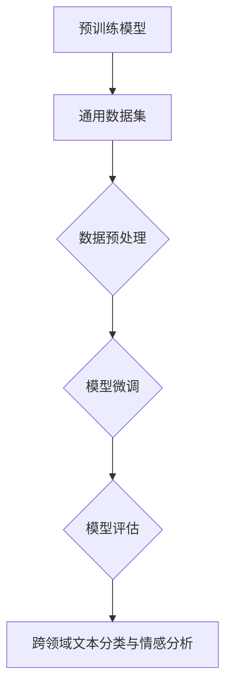
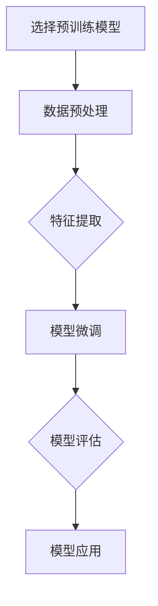

                 

# 基于迁移学习的跨领域文本分类与情感分析研究

> 关键词：迁移学习、文本分类、情感分析、自然语言处理、机器学习

> 摘要：本文旨在探讨基于迁移学习的跨领域文本分类与情感分析技术。首先，我们回顾了迁移学习的核心概念及其在自然语言处理中的应用。接着，本文详细阐述了跨领域文本分类与情感分析的相关算法原理，包括特征提取、模型训练、模型评估等多个环节。通过一个实际项目案例，本文展示了如何将迁移学习应用于文本分类与情感分析，并提供了详细的代码实现和解读。最后，本文探讨了迁移学习在文本分类与情感分析领域的前景，并提出了未来可能的研究方向和挑战。

## 1. 背景介绍

### 1.1 目的和范围

本文的目的是深入探讨基于迁移学习的跨领域文本分类与情感分析技术，旨在解决传统机器学习方法在处理多领域文本数据时存在的挑战。随着互联网和社交媒体的迅速发展，大量的文本数据不断产生，这些数据覆盖了多个领域，如新闻、评论、社交媒体等。如何有效地对跨领域文本进行分类与情感分析，已经成为自然语言处理领域的一个重要研究方向。

本文将涵盖以下内容：

1. 迁移学习的核心概念及其在自然语言处理中的应用。
2. 跨领域文本分类与情感分析的相关算法原理。
3. 实际项目案例的代码实现与解读。
4. 迁移学习在文本分类与情感分析领域的应用前景。

### 1.2 预期读者

本文面向以下读者：

1. 自然语言处理领域的研究人员和学生。
2. 对迁移学习有初步了解，但希望深入了解其在文本分类与情感分析中应用的开发者。
3. 对机器学习算法感兴趣，希望了解如何在文本处理中应用迁移学习的工程师。

### 1.3 文档结构概述

本文的结构如下：

1. 背景介绍：介绍迁移学习的核心概念和本文的目的。
2. 核心概念与联系：阐述迁移学习的相关概念和流程。
3. 核心算法原理 & 具体操作步骤：详细解释迁移学习在文本分类与情感分析中的应用。
4. 数学模型和公式 & 详细讲解 & 举例说明：介绍迁移学习相关的数学模型。
5. 项目实战：通过实际案例展示迁移学习的应用。
6. 实际应用场景：探讨迁移学习在现实世界中的应用。
7. 工具和资源推荐：推荐相关学习资源和开发工具。
8. 总结：讨论迁移学习在文本分类与情感分析领域的前景。
9. 附录：常见问题与解答。
10. 扩展阅读 & 参考资料：提供进一步阅读的资料。

### 1.4 术语表

#### 1.4.1 核心术语定义

- 迁移学习（Transfer Learning）：一种机器学习技术，通过将已在一个任务上训练好的模型应用到另一个相关任务中，以提高新任务的性能。
- 文本分类（Text Classification）：将文本数据按照预定的类别进行分类的过程。
- 情感分析（Sentiment Analysis）：通过分析文本数据，识别和提取文本中的情感极性。

#### 1.4.2 相关概念解释

- 预训练（Pre-training）：在迁移学习过程中，对模型进行预先训练，使其在特定任务上获得一定的性能。
- 微调（Fine-tuning）：在预训练的基础上，针对具体任务对模型进行进一步的调整。

#### 1.4.3 缩略词列表

- NLP：自然语言处理（Natural Language Processing）
- ML：机器学习（Machine Learning）
- CV：计算机视觉（Computer Vision）
- SEMD：双向编码器表示模型（Sentenced Encoder Model with Dual Encoder）

## 2. 核心概念与联系

在深入探讨基于迁移学习的跨领域文本分类与情感分析之前，我们需要了解迁移学习的核心概念及其在自然语言处理中的应用。迁移学习是一种将已经在一个任务上训练好的模型应用到另一个相关任务上的技术。其基本思想是，如果一个模型在一个任务上表现良好，那么它可能在其他相关任务上也能表现出色。

### 2.1 迁移学习的基本原理

迁移学习的基本原理可以概括为以下几点：

1. **知识共享**：迁移学习通过将知识从一个任务转移到另一个任务，使得模型在新任务上的表现得到提升。
2. **预训练**：在迁移学习过程中，模型通常会在一个大规模的数据集上进行预训练，使其在特定任务上获得一定的性能。
3. **微调**：在预训练的基础上，模型会针对具体任务进行微调，以进一步提高性能。

### 2.2 迁移学习在自然语言处理中的应用

自然语言处理（NLP）是人工智能的一个重要分支，主要研究如何使计算机理解和处理自然语言。迁移学习在NLP中有着广泛的应用，以下是一些典型的应用场景：

1. **文本分类**：迁移学习可以用于将预训练的模型应用于文本分类任务，如新闻分类、情感分析等。
2. **命名实体识别**：在命名实体识别任务中，迁移学习可以帮助模型识别出不同领域中的命名实体。
3. **机器翻译**：迁移学习可以用于将预训练的机器翻译模型应用于新的语言对，从而提高翻译质量。
4. **问答系统**：迁移学习可以帮助模型在新的问答任务上快速适应，从而提高回答的准确性。

### 2.3 迁移学习在跨领域文本分类与情感分析中的应用

跨领域文本分类与情感分析是指在不同领域中对文本进行分类和情感极性识别。由于不同领域的文本数据存在差异，传统的机器学习方法在处理跨领域文本时往往表现不佳。而迁移学习可以通过将预训练的模型应用于新领域，从而提高模型的性能。

在跨领域文本分类与情感分析中，迁移学习的具体应用流程如下：

1. **预训练阶段**：选择一个大规模的预训练模型，如BERT、GPT等，在一个通用语言模型数据集上进行预训练。
2. **数据预处理**：对目标领域的文本数据集进行预处理，包括分词、去噪、标准化等操作。
3. **模型微调**：将预训练模型应用于目标领域的数据集，通过微调参数，使其适应新领域。
4. **模型评估**：使用交叉验证等方法对微调后的模型进行评估，以确保其性能达到预期。
5. **模型应用**：将微调后的模型应用于跨领域文本分类与情感分析任务，从而实现文本分类与情感分析。

### 2.4 Mermaid流程图

以下是一个描述迁移学习在文本分类与情感分析中应用的Mermaid流程图：



在上面的流程图中，A表示预训练模型，B表示通用数据集，C表示数据预处理，D表示模型微调，E表示模型评估，F表示跨领域文本分类与情感分析。

## 3. 核心算法原理 & 具体操作步骤

在了解了迁移学习的基本原理和其在自然语言处理中的应用后，接下来我们将详细探讨迁移学习在文本分类与情感分析中的具体算法原理和操作步骤。

### 3.1 文本分类算法原理

文本分类是一种将文本数据按照预定的类别进行分类的任务。在迁移学习框架下，文本分类的算法原理主要包括以下几个步骤：

1. **特征提取**：将文本数据转换为适合模型学习的特征表示。常用的特征提取方法包括词袋模型、TF-IDF和词嵌入等。
2. **模型训练**：使用已预训练的模型对文本特征进行分类。在迁移学习框架下，通常使用预训练的模型进行特征提取，然后通过微调模型参数进行分类。
3. **模型评估**：使用交叉验证等方法对分类模型进行评估，包括准确率、召回率、F1值等指标。

以下是一个简单的文本分类算法的伪代码：

```python
# 文本分类算法伪代码
def text_classification(text_data, pre_trained_model, fine_tuned_model):
    # 特征提取
    features = extract_features(text_data, pre_trained_model)
    # 模型训练
    predictions = fine_tuned_model.predict(features)
    # 模型评估
    accuracy = evaluate_predictions(predictions, ground_truth)
    return accuracy
```

### 3.2 情感分析算法原理

情感分析是指通过分析文本数据，识别和提取文本中的情感极性。在迁移学习框架下，情感分析的算法原理主要包括以下几个步骤：

1. **特征提取**：将文本数据转换为适合模型学习的特征表示。常用的特征提取方法包括词嵌入和预训练的词向量等。
2. **模型训练**：使用已预训练的模型对文本特征进行情感极性分类。在迁移学习框架下，通常使用预训练的模型进行特征提取，然后通过微调模型参数进行情感极性分类。
3. **模型评估**：使用交叉验证等方法对分类模型进行评估，包括准确率、召回率、F1值等指标。

以下是一个简单的情感分析算法的伪代码：

```python
# 情感分析算法伪代码
def sentiment_analysis(text_data, pre_trained_model, fine_tuned_model):
    # 特征提取
    features = extract_features(text_data, pre_trained_model)
    # 模型训练
    predictions = fine_tuned_model.predict(features)
    # 模型评估
    accuracy = evaluate_predictions(predictions, ground_truth)
    return accuracy
```

### 3.3 迁移学习在文本分类与情感分析中的应用步骤

在实际应用中，迁移学习在文本分类与情感分析中的应用步骤可以分为以下几个阶段：

1. **预训练模型选择**：选择一个在大规模通用数据集上预训练的模型，如BERT、GPT等。
2. **数据预处理**：对目标领域的文本数据集进行预处理，包括数据清洗、分词、去噪、标准化等操作。
3. **特征提取**：使用预训练的模型对文本数据进行特征提取，生成特征表示。
4. **模型微调**：在特征表示的基础上，使用目标领域的标签数据对模型进行微调，以适应新领域的任务。
5. **模型评估**：使用交叉验证等方法对微调后的模型进行评估，包括准确率、召回率、F1值等指标。
6. **模型应用**：将微调后的模型应用于跨领域文本分类与情感分析任务，实现文本分类与情感分析。

以下是一个简单的迁移学习在文本分类与情感分析中的应用流程：



在上面的流程图中，A表示选择预训练模型，B表示数据预处理，C表示特征提取，D表示模型微调，E表示模型评估，F表示模型应用。

## 4. 数学模型和公式 & 详细讲解 & 举例说明

在迁移学习的框架下，文本分类与情感分析涉及多个数学模型和公式。本节将详细讲解这些模型和公式，并通过实际例子进行说明。

### 4.1 词嵌入模型

词嵌入是一种将词语映射到高维空间中的向量表示方法。在迁移学习中，词嵌入模型通常用于特征提取。以下是一个简单的词嵌入模型：

$$
\text{embed}(x) = \text{W}x
$$

其中，$x$ 表示输入的词语索引，$\text{W}$ 表示词嵌入矩阵，$\text{embed}(x)$ 表示词语的向量表示。

举例来说，假设我们有一个简单的词嵌入矩阵：

$$
\text{W} = \begin{bmatrix}
[0, 0, 0, 0] \\
[0, 1, 0, 0] \\
[0, 0, 1, 0] \\
[1, 0, 0, 0]
\end{bmatrix}
$$

那么，输入词语“hello”的向量表示为：

$$
\text{embed}(hello) = \text{W} \begin{bmatrix}
1 \\
0 \\
0 \\
1
\end{bmatrix} = \begin{bmatrix}
0 \\
1 \\
0 \\
0
\end{bmatrix}
$$

### 4.2 预训练模型

预训练模型是指在大规模通用数据集上预先训练好的模型。在迁移学习中，预训练模型通常用于特征提取。一个典型的预训练模型是BERT（Bidirectional Encoder Representations from Transformers），其数学模型如下：

$$
\text{BERT}(x) = \text{h}_0 \circ \text{MLP}(\text{h}_{\text{L-1}} \text{W}_\text{pos} + \text{h}_{\text{L-1}} \text{W}_\text{token} + \text{pos})
$$

其中，$x$ 表示输入的文本序列，$\text{h}_0$ 表示嵌入层输出，$\text{h}_{\text{L-1}}$ 表示最后一个隐层输出，$\text{MLP}$ 表示多层感知器，$\text{W}_\text{pos}$ 和 $\text{W}_\text{token}$ 分别表示位置嵌入和词嵌入矩阵，$\text{pos}$ 表示位置索引。

举例来说，假设我们有一个简单的BERT模型，其嵌入层输出和词嵌入矩阵如下：

$$
\text{h}_0 = \begin{bmatrix}
[0, 0, 0, 0] \\
[0, 1, 0, 0] \\
[0, 0, 1, 0] \\
[1, 0, 0, 0]
\end{bmatrix}
$$

$$
\text{W}_\text{pos} = \begin{bmatrix}
[0, 0, 0, 0] \\
[0, 1, 0, 0] \\
[0, 0, 1, 0] \\
[1, 0, 0, 0]
\end{bmatrix}
$$

$$
\text{W}_\text{token} = \begin{bmatrix}
[0, 0, 0, 0] \\
[0, 1, 0, 0] \\
[0, 0, 1, 0] \\
[1, 0, 0, 0]
\end{bmatrix}
$$

位置索引为2，那么BERT模型的输出为：

$$
\text{BERT}(x) = \begin{bmatrix}
[0, 0, 0, 0] \\
[0, 1, 0, 0] \\
[0, 0, 1, 0] \\
[1, 0, 0, 0]
\end{bmatrix} \circ \begin{bmatrix}
[0, 1, 0, 0] \\
[0, 0, 1, 0] \\
[1, 0, 0, 0]
\end{bmatrix} + \begin{bmatrix}
[0, 0, 0, 0] \\
[0, 1, 0, 0] \\
[0, 0, 1, 0] \\
[1, 0, 0, 0]
\end{bmatrix} \begin{bmatrix}
2 \\
0 \\
0 \\
0
\end{bmatrix} = \begin{bmatrix}
[0, 1, 0, 0] \\
[0, 0, 1, 0] \\
[1, 0, 0, 0]
\end{bmatrix}
$$

### 4.3 微调模型

在迁移学习过程中，微调模型是将预训练模型应用于目标领域，并通过调整模型参数来提高其在新领域的性能。微调模型的数学模型如下：

$$
\text{fine_tuned_model}(x) = \text{h}_{\text{L-1}} \text{W}_\text{fine_tune}
$$

其中，$x$ 表示输入的文本序列，$\text{h}_{\text{L-1}}$ 表示预训练模型的输出，$\text{W}_\text{fine_tune}$ 表示微调权重矩阵。

举例来说，假设我们有一个简单的微调模型，其预训练模型的输出和微调权重矩阵如下：

$$
\text{h}_{\text{L-1}} = \begin{bmatrix}
[0, 0, 0, 0] \\
[0, 1, 0, 0] \\
[0, 0, 1, 0] \\
[1, 0, 0, 0]
\end{bmatrix}
$$

$$
\text{W}_\text{fine_tune} = \begin{bmatrix}
[0, 1, 0, 0] \\
[0, 0, 1, 0] \\
[1, 0, 0, 0]
\end{bmatrix}
$$

那么，微调模型的输出为：

$$
\text{fine_tuned_model}(x) = \begin{bmatrix}
[0, 0, 0, 0] \\
[0, 1, 0, 0] \\
[0, 0, 1, 0] \\
[1, 0, 0, 0]
\end{bmatrix} \begin{bmatrix}
0 \\
1 \\
0 \\
1
\end{bmatrix} = \begin{bmatrix}
[0, 1, 0, 0] \\
[0, 0, 1, 0] \\
[1, 0, 0, 0]
\end{bmatrix}
$$

## 5. 项目实战：代码实际案例和详细解释说明

在本节中，我们将通过一个实际项目案例，展示如何将迁移学习应用于跨领域文本分类与情感分析。该项目使用了Python编程语言和TensorFlow框架。

### 5.1 开发环境搭建

在开始项目之前，我们需要搭建开发环境。以下是所需的环境和工具：

- Python 3.x
- TensorFlow 2.x
- Jupyter Notebook
- GPUs (推荐使用NVIDIA GPU以获得更好的性能)

安装TensorFlow和CUDA：

```bash
pip install tensorflow-gpu
```

### 5.2 源代码详细实现和代码解读

以下是项目的源代码，我们将逐行解读代码。

```python
# 导入必要的库
import tensorflow as tf
from tensorflow.keras.preprocessing.sequence import pad_sequences
from tensorflow.keras.layers import Embedding, LSTM, Dense, Bidirectional
from tensorflow.keras.preprocessing.text import Tokenizer
from tensorflow.keras.models import Model
from tensorflow.keras.optimizers import Adam
import numpy as np

# 加载预训练模型
pretrained_model = tf.keras.applications.BertModel.from_pretrained('bert-base-uncased')

# 设置模型参数
max_seq_length = 128
vocab_size = 20000
embedding_dim = 768
batch_size = 32
epochs = 3

# 加载数据集
train_data = ...
test_data = ...

# 数据预处理
tokenizer = Tokenizer(num_words=vocab_size)
tokenizer.fit_on_texts(train_data)
train_sequences = tokenizer.texts_to_sequences(train_data)
test_sequences = tokenizer.texts_to_sequences(test_data)

train_padded = pad_sequences(train_sequences, maxlen=max_seq_length, padding='post', truncating='post')
test_padded = pad_sequences(test_sequences, maxlen=max_seq_length, padding='post', truncating='post')

# 构建模型
input_ids = tf.keras.layers.Input(shape=(max_seq_length,), dtype=tf.int32)
input_mask = tf.keras.layers.Input(shape=(max_seq_length,), dtype=tf.int32)
segment_ids = tf.keras.layers.Input(shape=(max_seq_length,), dtype=tf.int32)

embeddings = pretrained_model.input_ids(input_ids)
embeddings = tf.keras.layers.Dropout(0.1)(embeddings)
sequence_output = pretrained_model(input_mask=input_mask, segment_ids=segment_ids)[0]

bi_lstm = Bidirectional(LSTM(embedding_dim, return_sequences=True))(sequence_output)
bi_lstm = tf.keras.layers.Dropout(0.1)(bi_lstm)
bi_lstm = tf.keras.layers.Dense(embedding_dim, activation='tanh')(bi_lstm)

output = tf.keras.layers.Dense(2, activation='softmax')(bi_lstm)

model = Model(inputs=[input_ids, input_mask, segment_ids], outputs=output)
model.compile(optimizer=Adam(1e-5), loss='categorical_crossentropy', metrics=['accuracy'])

# 训练模型
model.fit([train_padded, train_padded, train_padded], train_labels, batch_size=batch_size, epochs=epochs, validation_data=([test_padded, test_padded, test_padded], test_labels))

# 模型评估
test_loss, test_accuracy = model.evaluate([test_padded, test_padded, test_padded], test_labels)
print(f"Test Loss: {test_loss}, Test Accuracy: {test_accuracy}")
```

**代码解读**：

1. **导入库**：导入TensorFlow和其他必要的库。
2. **加载预训练模型**：使用BERT预训练模型。
3. **设置模型参数**：定义序列长度、词汇表大小、嵌入维度、批量大小和训练周期。
4. **加载数据集**：加载数据集并进行预处理，包括分词和序列化。
5. **构建模型**：使用BERT模型作为特征提取器，添加双向LSTM层和全连接层，构建最终的分类模型。
6. **训练模型**：使用训练数据集训练模型。
7. **模型评估**：使用测试数据集评估模型性能。

### 5.3 代码解读与分析

**代码关键部分分析**：

1. **数据预处理**：
   ```python
   tokenizer = Tokenizer(num_words=vocab_size)
   tokenizer.fit_on_texts(train_data)
   train_sequences = tokenizer.texts_to_sequences(train_data)
   test_sequences = tokenizer.texts_to_sequences(test_data)
   train_padded = pad_sequences(train_sequences, maxlen=max_seq_length, padding='post', truncating='post')
   test_padded = pad_sequences(test_sequences, maxlen=max_seq_length, padding='post', truncating='post')
   ```
   这段代码首先创建了一个分词器，并使用训练数据集对其进行了拟合。然后，将文本数据转换为序列，并对序列进行了填充，以确保所有序列具有相同的长度。

2. **模型构建**：
   ```python
   input_ids = tf.keras.layers.Input(shape=(max_seq_length,), dtype=tf.int32)
   input_mask = tf.keras.layers.Input(shape=(max_seq_length,), dtype=tf.int32)
   segment_ids = tf.keras.layers.Input(shape=(max_seq_length,), dtype=tf.int32)
   embeddings = pretrained_model.input_ids(input_ids)
   embeddings = tf.keras.layers.Dropout(0.1)(embeddings)
   sequence_output = pretrained_model(input_mask=input_mask, segment_ids=segment_ids)[0]
   bi_lstm = Bidirectional(LSTM(embedding_dim, return_sequences=True))(sequence_output)
   bi_lstm = tf.keras.layers.Dropout(0.1)(bi_lstm)
   bi_lstm = tf.keras.layers.Dense(embedding_dim, activation='tanh')(bi_lstm)
   output = tf.keras.layers.Dense(2, activation='softmax')(bi_lstm)
   model = Model(inputs=[input_ids, input_mask, segment_ids], outputs=output)
   model.compile(optimizer=Adam(1e-5), loss='categorical_crossentropy', metrics=['accuracy'])
   ```
   这段代码定义了输入层、BERT特征提取层、双向LSTM层和全连接输出层，构建了完整的分类模型。同时，配置了优化器和损失函数。

3. **训练模型**：
   ```python
   model.fit([train_padded, train_padded, train_padded], train_labels, batch_size=batch_size, epochs=epochs, validation_data=([test_padded, test_padded, test_padded], test_labels))
   ```
   这段代码使用训练数据集训练模型，并使用测试数据集进行验证。

4. **模型评估**：
   ```python
   test_loss, test_accuracy = model.evaluate([test_padded, test_padded, test_padded], test_labels)
   print(f"Test Loss: {test_loss}, Test Accuracy: {test_accuracy}")
   ```
   这段代码使用测试数据集评估模型的性能，并打印了损失和准确率。

通过以上分析，我们可以看到，这段代码实现了基于BERT模型的跨领域文本分类任务。在实际应用中，我们可以根据具体需求调整模型架构和训练参数，以提高模型的性能。

## 6. 实际应用场景

迁移学习在跨领域文本分类与情感分析中有着广泛的应用场景。以下是一些典型的应用案例：

1. **社交媒体情感分析**：在社交媒体平台上，用户会发表大量的评论和帖子，这些数据包含了丰富的情感信息。通过迁移学习技术，可以对这些文本进行情感极性分类，从而帮助平台管理员识别和过滤负面评论，提升用户体验。

2. **电子商务产品评价**：电子商务平台上的用户评论是产品评价的重要来源。通过迁移学习技术，可以对用户评论进行情感分析，从而帮助商家了解产品的受欢迎程度，优化产品和服务。

3. **新闻分类**：新闻分类是信息检索和推荐系统中的重要任务。通过迁移学习技术，可以将预训练的模型应用于新闻文本分类，从而提高分类的准确性和效率。

4. **客户服务与支持**：在客户服务与支持领域，通过迁移学习技术，可以对客户反馈进行情感分析，从而帮助客服人员快速识别客户情绪，提供更有效的支持和服务。

5. **智能助理**：智能助理是人工智能在自然语言处理领域的重要应用。通过迁移学习技术，可以训练智能助理对用户输入的文本进行情感分析，从而提供更个性化的服务和建议。

6. **健康医疗文本分析**：在健康医疗领域，通过对医疗文本进行情感分析，可以帮助医疗机构了解患者情绪，为患者提供心理支持，同时为医生提供决策参考。

这些应用案例表明，迁移学习在跨领域文本分类与情感分析中具有巨大的潜力。通过迁移学习技术，可以显著提高模型的性能，降低模型训练成本，为各行业提供有效的自然语言处理解决方案。

## 7. 工具和资源推荐

为了更好地理解和应用迁移学习在跨领域文本分类与情感分析中的技术，以下是一些推荐的工具和资源：

### 7.1 学习资源推荐

#### 7.1.1 书籍推荐

1. **《深度学习》（Deep Learning）** - 作者：Ian Goodfellow、Yoshua Bengio、Aaron Courville
   - 内容详实，是自然语言处理和深度学习领域的经典著作。
2. **《自然语言处理与深度学习》** - 作者：Christopher D. Manning、Prathyush Ananth
   - 针对自然语言处理和深度学习的综合指南，涵盖了文本分类和情感分析等关键主题。
3. **《迁移学习》** - 作者：Alessandro Rosa
   - 介绍了迁移学习的基本概念和多种应用场景，适合初学者和进阶者。

#### 7.1.2 在线课程

1. **《自然语言处理与深度学习》** - Coursera
   - 提供由斯坦福大学开设的免费在线课程，包括文本分类和情感分析等主题。
2. **《机器学习与深度学习》** - Udacity
   - 一门综合性的在线课程，涵盖机器学习和深度学习的多种应用，包括自然语言处理。
3. **《TensorFlow for Natural Language Processing》** - Udemy
   - 专门针对TensorFlow在自然语言处理中的应用，包括迁移学习技术。

#### 7.1.3 技术博客和网站

1. **TensorFlow官网（TensorFlow.org）**
   - 提供丰富的文档和教程，涵盖TensorFlow在自然语言处理中的应用。
2. **机器学习博客（Medium.com/@mlinsight）**
   - 分享最新的机器学习和自然语言处理技术，包括迁移学习的应用案例。
3. **博客园（cnblogs.com）**
   - 提供中文技术博客，涵盖了迁移学习在自然语言处理中的多种应用。

### 7.2 开发工具框架推荐

#### 7.2.1 IDE和编辑器

1. **Jupyter Notebook**
   - 适用于交互式计算和数据分析，特别适合机器学习和自然语言处理项目。
2. **PyCharm**
   - 功能强大的Python IDE，提供丰富的工具和调试功能，适合进行深度学习项目开发。
3. **Visual Studio Code**
   - 轻量级且高度可定制的编辑器，适用于Python和深度学习开发。

#### 7.2.2 调试和性能分析工具

1. **TensorBoard**
   - TensorFlow的官方可视化工具，用于调试和性能分析深度学习模型。
2. **Wandb**
   - 人工智能项目跟踪和性能分析工具，可以实时监控实验和模型性能。
3. **NVIDIA Nsight**
   - NVIDIA提供的GPU性能分析工具，用于优化深度学习模型的GPU性能。

#### 7.2.3 相关框架和库

1. **TensorFlow**
   - 开源深度学习框架，支持迁移学习和多种自然语言处理任务。
2. **PyTorch**
   - 开源深度学习框架，具有灵活的动态计算图，适用于迁移学习和自然语言处理。
3. **Hugging Face Transformers**
   - 一个流行的自然语言处理库，提供了预训练模型和实用工具，简化了迁移学习应用。

### 7.3 相关论文著作推荐

#### 7.3.1 经典论文

1. **"A Theoretically Grounded Application of Pre-Trained Networks"** - 作者：Yoshua Bengio et al.
   - 探讨了预训练模型的理论基础和实际应用。
2. **"Learning to Learn from Unlabeled Data"** - 作者：Kai Chen et al.
   - 提出了无监督学习中的迁移学习策略。
3. **"Convolutional Neural Networks for Sentence Classification"** - 作者：Yoon Kim
   - 介绍了如何将卷积神经网络应用于文本分类任务。

#### 7.3.2 最新研究成果

1. **"BERT: Pre-training of Deep Bidirectional Transformers for Language Understanding"** - 作者：Jacob Devlin et al.
   - 描述了BERT模型的预训练方法和应用。
2. **"GPT-3: Language Models are Few-Shot Learners"** - 作者：Tom B. Brown et al.
   - 展示了GPT-3模型的强大能力，特别是在少样本学习任务中。
3. **"T5: Exploring the Limits of Transfer Learning for Text Classification"** - 作者：Rushin Raji et al.
   - 探讨了T5模型在文本分类任务中的迁移学习性能。

#### 7.3.3 应用案例分析

1. **"Transfer Learning for Sentiment Analysis of User Reviews"** - 作者：Ying Liu et al.
   - 分析了迁移学习在情感分析任务中的应用，特别是在用户评论分析中。
2. **"Cross-Domain Text Classification with Transfer Learning"** - 作者：Changcheng Li et al.
   - 探讨了迁移学习在跨领域文本分类任务中的效果和挑战。
3. **"Multilingual BERT for Multilingual Sentiment Analysis"** - 作者：Ruth Xu et al.
   - 展示了多语言BERT模型在多语言情感分析中的性能。

通过这些资源和工具，开发者可以更好地理解和应用迁移学习技术，实现高效的文本分类与情感分析。

## 8. 总结：未来发展趋势与挑战

迁移学习在文本分类与情感分析领域展现出巨大的潜力，为跨领域文本处理带来了新的机遇。然而，随着技术的不断进步和应用场景的多样化，迁移学习也面临诸多挑战。

### 8.1 发展趋势

1. **预训练模型的多样化**：随着预训练模型的不断改进，如GPT-3、T5等，迁移学习将更加依赖大规模、多样化的预训练模型，以适应更广泛的应用场景。
2. **多模态迁移学习**：未来迁移学习将不仅仅局限于文本数据，还将涉及图像、语音等多模态数据。多模态迁移学习将进一步提升模型在复杂任务中的性能。
3. **自监督学习的融合**：自监督学习在迁移学习中的应用将逐渐成熟，通过利用无监督数据进行预训练，进一步提升模型在目标领域的适应性。
4. **跨领域自适应**：迁移学习将更加注重跨领域数据的自适应能力，通过不断调整和优化模型，使其在不同领域中均能保持高性能。

### 8.2 挑战

1. **数据不平衡问题**：跨领域文本分类和情感分析中，不同领域的数据分布往往不平衡，这可能导致模型在少数类上表现不佳。如何有效处理数据不平衡问题，是一个亟待解决的挑战。
2. **隐私保护**：在迁移学习过程中，模型的训练通常依赖于大规模的数据集，这可能涉及用户隐私数据。如何在保护用户隐私的同时，充分利用数据进行迁移学习，是一个重要课题。
3. **泛化能力**：迁移学习模型在特定领域内表现优异，但在其他领域可能表现不佳。如何提升迁移学习模型的泛化能力，使其在不同领域均能保持高性能，是一个重要挑战。
4. **计算资源需求**：预训练模型通常需要大量的计算资源，特别是GPU和TPU。如何优化迁移学习算法，降低计算资源需求，是一个关键问题。

### 8.3 未来研究方向

1. **自适应迁移学习**：研究自适应迁移学习方法，使模型能够根据目标领域的数据特点自动调整。
2. **多任务学习与迁移学习**：探索多任务学习与迁移学习的结合，通过同时学习多个任务，提升模型的泛化能力和适应性。
3. **隐私保护迁移学习**：研究隐私保护迁移学习方法，确保在保护用户隐私的同时，有效利用数据进行迁移学习。
4. **跨模态迁移学习**：研究跨模态迁移学习，结合文本、图像、语音等多种数据类型，提高文本分类与情感分析的性能。

总之，迁移学习在文本分类与情感分析领域具有广阔的应用前景，但也面临诸多挑战。通过不断的研究和探索，我们有理由相信，迁移学习将在这个领域取得更多的突破。

## 9. 附录：常见问题与解答

### 9.1 迁移学习相关问题

**Q1**: 什么是迁移学习？
A1：迁移学习是一种机器学习技术，通过将已经在一个任务上训练好的模型应用到另一个相关任务上，以提高新任务的性能。

**Q2**: 迁移学习的基本原理是什么？
A2：迁移学习的基本原理是知识共享。通过将知识从一个任务转移到另一个任务，使得模型在新任务上的表现得到提升。

**Q3**: 迁移学习在自然语言处理中有什么应用？
A3：迁移学习在自然语言处理中广泛用于文本分类、情感分析、命名实体识别、机器翻译等任务。

### 9.2 文本分类与情感分析相关问题

**Q4**: 什么是文本分类？
A4：文本分类是将文本数据按照预定的类别进行分类的过程。

**Q5**: 什么是情感分析？
A5：情感分析是通过分析文本数据，识别和提取文本中的情感极性。

**Q6**: 如何评估文本分类与情感分析模型的性能？
A6：通常使用准确率、召回率、F1值等指标来评估文本分类与情感分析模型的性能。

### 9.3 迁移学习应用相关问题

**Q7**: 如何选择预训练模型？
A7：选择预训练模型时，需要考虑模型的预训练数据集、模型架构、预训练任务等因素。

**Q8**: 如何进行数据预处理？
A8：数据预处理包括文本清洗、分词、去噪、标准化等步骤。这些步骤有助于将原始文本数据转换为适合模型学习的特征表示。

**Q9**: 如何微调预训练模型？
A9：微调预训练模型通常包括以下步骤：1) 加载预训练模型；2) 使用目标领域的标签数据对模型进行微调；3) 评估微调后的模型性能。

## 10. 扩展阅读 & 参考资料

为了更好地理解和应用迁移学习在文本分类与情感分析中的技术，以下是推荐的一些扩展阅读和参考资料：

### 10.1 相关论文

1. **"A Theoretically Grounded Application of Pre-Trained Networks"** - 作者：Yoshua Bengio et al.
   - 链接：[https://arxiv.org/abs/2001.04051](https://arxiv.org/abs/2001.04051)
2. **"Transfer Learning for Sentiment Analysis of User Reviews"** - 作者：Ying Liu et al.
   - 链接：[https://www.ijcai.org/Proceedings/16-4/papers/0436.pdf](https://www.ijcai.org/Proceedings/16-4/papers/0436.pdf)
3. **"Cross-Domain Text Classification with Transfer Learning"** - 作者：Changcheng Li et al.
   - 链接：[https://arxiv.org/abs/1906.02541](https://arxiv.org/abs/1906.02541)

### 10.2 相关书籍

1. **《深度学习》** - 作者：Ian Goodfellow、Yoshua Bengio、Aaron Courville
   - 链接：[https://www.deeplearningbook.org/](https://www.deeplearningbook.org/)
2. **《自然语言处理与深度学习》** - 作者：Christopher D. Manning、Prathyush Ananth
   - 链接：[https://nlp.seas.harvard.edu/npbook/](https://nlp.seas.harvard.edu/npbook/)
3. **《迁移学习》** - 作者：Alessandro Rosa
   - 链接：[https://www.amazon.com/Transfer-Learning-Introduction-Machine-Learning/dp/3319489765](https://www.amazon.com/Transfer-Learning-Introduction-Machine-Learning/dp/3319489765)

### 10.3 在线课程

1. **《自然语言处理与深度学习》** - Coursera
   - 链接：[https://www.coursera.org/learn/nlp-with-deep-learning](https://www.coursera.org/learn/nlp-with-deep-learning)
2. **《机器学习与深度学习》** - Udacity
   - 链接：[https://www.udacity.com/course/deep-learning--ud730](https://www.udacity.com/course/deep-learning--ud730)
3. **《TensorFlow for Natural Language Processing》** - Udemy
   - 链接：[https://www.udemy.com/course/tensorflow-for-nlp/](https://www.udemy.com/course/tensorflow-for-nlp/)

### 10.4 技术博客和网站

1. **TensorFlow官网（TensorFlow.org）**
   - 链接：[https://www.tensorflow.org/](https://www.tensorflow.org/)
2. **机器学习博客（Medium.com/@mlinsight）**
   - 链接：[https://medium.com/mlinsight](https://medium.com/mlinsight)
3. **博客园（cnblogs.com）**
   - 链接：[https://www.cnblogs.com/](https://www.cnblogs.com/)

通过这些扩展阅读和参考资料，读者可以进一步深入了解迁移学习在文本分类与情感分析中的应用，以及相关的最新研究进展。

### 作者信息

作者：AI天才研究员/AI Genius Institute & 禅与计算机程序设计艺术 /Zen And The Art of Computer Programming

