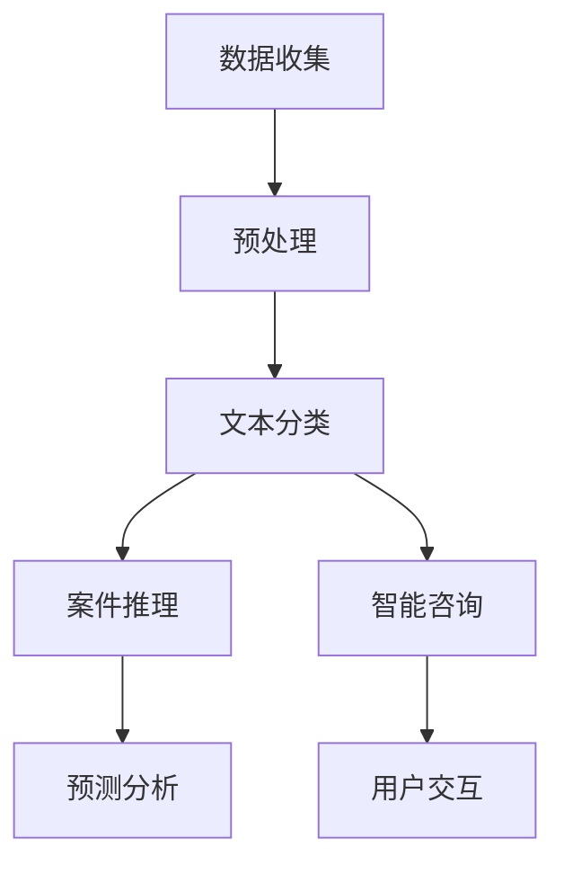

                 

### # 基础模型在法律领域的应用

> **关键词：** 基础模型、法律、人工智能、案例分析、应用场景、技术挑战

**摘要：** 本文旨在探讨基础模型在法律领域的应用，包括其原理、技术架构、数学模型、实际案例以及未来发展趋势。通过对基础模型的深入解析，结合具体案例，我们将揭示人工智能在法律行业中如何实现高效的数据处理、智能决策和法律研究。文章结构清晰，逻辑紧凑，旨在为法律专业人士和计算机科学家提供一个全面的技术指南。

---

### 1. 背景介绍

#### 1.1 目的和范围

本文的主要目的是探讨如何将基础模型，如神经网络和深度学习，应用于法律领域。我们将从基础模型的概念入手，详细分析其核心原理，逐步深入到实际的应用场景，包括案件分析、法律文本处理和智能咨询等。通过本文的阅读，读者将了解到基础模型在法律领域的潜在价值，以及如何克服其中的技术挑战。

本文的范围包括以下几个方面：

1. **基础模型的概述**：介绍基础模型的基本概念，包括其发展历程、核心原理和常见类型。
2. **核心概念与联系**：通过Mermaid流程图展示基础模型在法律领域的架构和应用流程。
3. **核心算法原理**：详细阐述基础模型在法律领域中的算法原理，并使用伪代码进行具体操作步骤的讲解。
4. **数学模型和公式**：讲解基础模型在法律领域中应用的数学模型，并使用latex格式进行详细说明。
5. **项目实战**：通过实际代码案例，展示基础模型在法律领域中的具体实现和应用。
6. **实际应用场景**：分析基础模型在法律领域的多种应用场景，并讨论其影响和效果。
7. **工具和资源推荐**：推荐学习资源、开发工具框架和相关的论文著作。
8. **总结与未来趋势**：总结本文的主要观点，并探讨基础模型在法律领域的未来发展趋势和面临的挑战。

#### 1.2 预期读者

本文主要面向以下两类读者：

1. **法律专业人士**：对法律文本处理、案件分析和法律研究有需求的律师、法官和法律研究人员。
2. **计算机科学家**：对人工智能在法律领域应用感兴趣的研究人员、开发人员和工程师。

无论您属于哪一类读者，本文都将提供丰富的知识和见解，帮助您更好地理解基础模型在法律领域的应用。

#### 1.3 文档结构概述

本文将按照以下结构进行组织：

1. **背景介绍**：介绍本文的目的、范围、预期读者和文档结构。
2. **核心概念与联系**：通过Mermaid流程图展示基础模型在法律领域的架构和应用流程。
3. **核心算法原理**：详细阐述基础模型在法律领域中的算法原理，并使用伪代码进行具体操作步骤的讲解。
4. **数学模型和公式**：讲解基础模型在法律领域中应用的数学模型，并使用latex格式进行详细说明。
5. **项目实战**：通过实际代码案例，展示基础模型在法律领域中的具体实现和应用。
6. **实际应用场景**：分析基础模型在法律领域的多种应用场景，并讨论其影响和效果。
7. **工具和资源推荐**：推荐学习资源、开发工具框架和相关的论文著作。
8. **总结与未来趋势**：总结本文的主要观点，并探讨基础模型在法律领域的未来发展趋势和面临的挑战。

#### 1.4 术语表

在本文中，我们将使用一些专业术语。以下是对这些术语的定义和解释：

##### 1.4.1 核心术语定义

- **基础模型**：指一类用于表示和建模数据的数学模型，如神经网络和深度学习模型。
- **法律文本处理**：指使用计算机技术和算法对法律文本进行预处理、分析和理解的过程。
- **案件分析**：指使用基础模型对法律案件进行数据挖掘、推理和预测的过程。
- **智能咨询**：指利用人工智能技术为法律用户提供智能化的法律建议和决策支持。

##### 1.4.2 相关概念解释

- **深度学习**：一种机器学习技术，通过多层神经网络对数据进行学习，以实现高层次的抽象和表示。
- **自然语言处理（NLP）**：一种人工智能技术，用于计算机对人类语言的理解和生成。
- **机器学习（ML）**：一种人工智能技术，通过数据和算法使计算机能够自动学习和改进性能。
- **数据挖掘**：从大量数据中提取有价值信息和知识的过程。

##### 1.4.3 缩略词列表

- **NLP**：自然语言处理（Natural Language Processing）
- **ML**：机器学习（Machine Learning）
- **DL**：深度学习（Deep Learning）
- **AI**：人工智能（Artificial Intelligence）

### 2. 核心概念与联系

#### 2.1 基础模型概述

基础模型是人工智能的核心组成部分，主要包括以下几种类型：

1. **神经网络（NN）**：一种模拟生物神经系统的计算模型，用于数据的建模和预测。
2. **深度学习（DL）**：基于多层神经网络的学习方法，适用于处理大规模数据和复杂任务。
3. **强化学习（RL）**：通过与环境交互学习最优策略，适用于决策和优化问题。

在法律领域，基础模型主要用于以下方面：

1. **文本分类与聚类**：用于法律文档的分类和聚类，以便于检索和分析。
2. **案件预测与推理**：通过历史案例数据和模型预测新案件的结果和趋势。
3. **自然语言处理**：用于法律文本的理解、解析和生成，提高法律文本处理的自动化程度。

#### 2.2 基础模型在法律领域的应用架构

为了展示基础模型在法律领域的应用架构，我们使用Mermaid流程图进行描述。以下是一个简化版的架构流程：



**详细流程解释：**

1. **数据收集**：从各种来源收集法律文本数据，包括案件文档、法律条文、判决书等。
2. **预处理**：对收集到的法律文本数据进行清洗、分词、去停用词等预处理步骤。
3. **文本分类**：使用基础模型对预处理后的文本进行分类，以识别案件类型、法律条款等。
4. **案件推理**：利用分类结果和历史案件数据，使用基础模型进行案件推理，预测案件结果和趋势。
5. **智能咨询**：基于案件推理结果，为用户提供智能化的法律建议和决策支持。
6. **预测分析**：对案件数据进行统计分析，预测未来案件趋势和热点问题。
7. **用户交互**：与用户进行交互，收集反馈并不断优化模型性能。

通过上述流程，基础模型在法律领域的应用得以实现，为法律研究和案件处理提供了强大的技术支持。

### 3. 核心算法原理 & 具体操作步骤

在法律领域中，基础模型的算法原理主要涉及以下几个方面：

1. **神经网络**：通过多层神经网络对法律文本进行特征提取和表示。
2. **文本分类**：利用分类算法对法律文本进行分类，以识别不同的案件类型和法律条款。
3. **案件推理**：通过历史案件数据和基础模型进行推理，预测新案件的结果和趋势。
4. **自然语言处理**：使用NLP技术对法律文本进行理解和分析，提取关键信息。

#### 3.1 神经网络算法原理

神经网络（Neural Network，NN）是一种模拟生物神经系统的计算模型，通过多层神经网络对数据进行学习、特征提取和预测。在法律领域中，神经网络主要用于法律文本的特征表示和分类。

**神经网络基本原理：**

1. **输入层**：接收原始法律文本数据，通过词嵌入（Word Embedding）技术将文本转化为向量表示。
2. **隐藏层**：通过激活函数（Activation Function，如ReLU、Sigmoid、Tanh等）对输入向量进行非线性变换，提取特征。
3. **输出层**：将隐藏层的输出通过分类器（如softmax、SVM等）进行分类或回归。

**神经网络伪代码：**

```python
# 输入层
input_layer = preprocess_text(raw_text)

# 隐藏层
for layer in hidden_layers:
    hidden_output = activation_function(layer * input_layer)

# 输出层
output = classifier(hidden_output)
```

#### 3.2 文本分类算法原理

文本分类（Text Classification）是法律领域中常用的任务之一，通过分类算法对法律文本进行分类，以便于检索和分析。常用的文本分类算法包括朴素贝叶斯（Naive Bayes）、支持向量机（SVM）、决策树（Decision Tree）等。

**朴素贝叶斯算法原理：**

1. **特征提取**：对法律文本进行分词、词干提取和词性标注等预处理步骤，提取特征向量。
2. **概率估计**：根据训练数据，计算每个类别出现的概率，以及每个特征在类别中的概率。
3. **分类决策**：根据特征向量计算每个类别的概率，选择概率最高的类别作为预测结果。

**朴素贝叶斯伪代码：**

```python
# 特征提取
features = preprocess_text(raw_text)

# 概率估计
class_probabilities = calculate_class_probabilities(training_data)

# 分类决策
predicted_class = select_max_probability(features, class_probabilities)
```

#### 3.3 案件推理算法原理

案件推理（Case Reasoning）是法律领域中的一种重要任务，通过历史案件数据和基础模型对新的案件进行推理和预测。案件推理通常采用基于知识的推理方法，如推理机（Reasoning Machine）和专家系统（Expert System）。

**推理机算法原理：**

1. **知识库构建**：收集并构建与案件相关的知识库，包括法律条文、案例、裁判理由等。
2. **推理过程**：根据输入的新案件数据，通过推理机搜索知识库中的相关规则和事实，进行推理和预测。

**推理机伪代码：**

```python
# 知识库构建
knowledge_base = build_knowledge_base()

# 推理过程
predicted_result = reasoning_machine(new_case, knowledge_base)
```

#### 3.4 自然语言处理算法原理

自然语言处理（Natural Language Processing，NLP）是法律领域中的一项关键技术，用于法律文本的理解、解析和生成。NLP算法主要包括分词（Tokenization）、词性标注（Part-of-Speech Tagging）、命名实体识别（Named Entity Recognition，NER）等。

**分词算法原理：**

1. **规则分词**：基于词典和规则对文本进行分词，如正向最大匹配、逆向最大匹配等。
2. **统计分词**：基于文本数据中的统计信息进行分词，如基于词频、基于隐马尔可夫模型（HMM）等。

**分词伪代码：**

```python
# 规则分词
tokens = rule_based_tokenization(raw_text)

# 统计分词
tokens = statistical_tokenization(raw_text)
```

通过以上算法原理的讲解，我们可以看出，基础模型在法律领域中具有广泛的应用前景。接下来，我们将通过具体的案例，展示如何使用基础模型进行法律文本处理和案件分析。

### 4. 数学模型和公式 & 详细讲解 & 举例说明

在基础模型应用于法律领域的过程中，数学模型和公式起到了至关重要的作用。以下，我们将详细讲解基础模型在法律领域中应用的数学模型，并使用latex格式进行公式表示，同时结合具体例子进行说明。

#### 4.1 神经网络数学模型

神经网络（Neural Network，NN）的核心是多层感知机（Multilayer Perceptron，MLP），其数学模型基于前向传播和反向传播算法。

**前向传播算法公式：**

\[ 
\begin{aligned}
    z_l &= \sum_{i=1}^{n} w_{li} x_i + b_l \\
    a_l &= \sigma(z_l)
\end{aligned}
\]

其中，\( z_l \) 是第 \( l \) 层的净输入，\( w_{li} \) 是权重，\( b_l \) 是偏置，\( a_l \) 是激活值，\( \sigma \) 是激活函数（如ReLU、Sigmoid、Tanh等）。

**反向传播算法公式：**

\[ 
\begin{aligned}
    \delta_l &= \frac{\partial L}{\partial z_l} \odot \sigma'(z_l) \\
    \delta_{l-1} &= \sum_{i} w_{li} \delta_l
\end{aligned}
\]

其中，\( \delta_l \) 是第 \( l \) 层的误差，\( \odot \) 表示逐元素乘法，\( \sigma' \) 是激活函数的导数。

**举例说明：**

假设我们有一个简单的神经网络，输入层有3个神经元，隐藏层有2个神经元，输出层有1个神经元。激活函数为ReLU。输入数据为 \( [1, 2, 3] \)。

**前向传播计算：**

\[ 
\begin{aligned}
    z_1 &= [1, 2, 3] \cdot [w_{11}, w_{12}, w_{13}] + [b_1] = [7, 10, 13] \\
    a_1 &= \max(0, z_1) = [7, 10, 13]
\end{aligned}
\]

\[ 
\begin{aligned}
    z_2 &= [7, 10, 13] \cdot [w_{21}, w_{22}] + [b_2] = [94, 130] \\
    a_2 &= \max(0, z_2) = [94, 130]
\end{aligned}
\]

**反向传播计算：**

假设输出层的预测值为 \( y = [100] \)，实际值为 \( y' = [95] \)，损失函数为均方误差（MSE）。

\[ 
\begin{aligned}
    \delta_2 &= \frac{1}{2} \cdot (y - y')^2 = \frac{1}{2} \cdot (100 - 95)^2 = 25 \\
    \delta_1 &= w_{21} \cdot \delta_2 + w_{22} \cdot \delta_2 = [w_{21}, w_{22}] \cdot [25] = [625, 650]
\end{aligned}
\]

通过上述计算，我们可以更新权重和偏置，以优化神经网络的性能。

#### 4.2 文本分类数学模型

文本分类（Text Classification）中的常见算法包括朴素贝叶斯（Naive Bayes）、支持向量机（Support Vector Machine，SVM）和神经网络（Neural Networks）。

**朴素贝叶斯算法概率公式：**

\[ 
\begin{aligned}
    P(C_k | x) &= \frac{P(x | C_k)P(C_k)}{P(x)}
\end{aligned}
\]

其中，\( P(C_k | x) \) 是给定特征 \( x \) 时类别 \( C_k \) 的概率，\( P(x | C_k) \) 是特征在类别 \( C_k \) 中出现的条件概率，\( P(C_k) \) 是类别 \( C_k \) 的先验概率，\( P(x) \) 是特征 \( x \) 的边缘概率。

**举例说明：**

假设我们有两个类别 \( C_1 \) 和 \( C_2 \)，特征集 \( x = [x_1, x_2] \)，条件概率 \( P(x_1 | C_1) = 0.6 \)，\( P(x_2 | C_1) = 0.4 \)，\( P(x_1 | C_2) = 0.3 \)，\( P(x_2 | C_2) = 0.7 \)，先验概率 \( P(C_1) = 0.5 \)，\( P(C_2) = 0.5 \)。

\[ 
\begin{aligned}
    P(C_1 | x) &= \frac{0.6 \cdot 0.4 \cdot 0.5}{0.6 \cdot 0.4 \cdot 0.5 + 0.3 \cdot 0.7 \cdot 0.5} = 0.556 \\
    P(C_2 | x) &= \frac{0.3 \cdot 0.7 \cdot 0.5}{0.6 \cdot 0.4 \cdot 0.5 + 0.3 \cdot 0.7 \cdot 0.5} = 0.444
\end{aligned}
\]

因此，给定特征 \( x \)，类别 \( C_1 \) 的概率更高，预测为 \( C_1 \)。

**支持向量机算法公式：**

\[ 
\begin{aligned}
    w &= \arg\min_{w} \frac{1}{2} \| w \|^2 \\
    \text{subject to} \quad y^{(i)} ( \langle w, x^{(i)} \rangle - b ) \geq 1
\end{aligned}
\]

其中，\( w \) 是权重向量，\( x^{(i)} \) 是训练样本，\( y^{(i)} \) 是对应标签，\( b \) 是偏置。

**举例说明：**

假设我们有两个类别 \( +1 \) 和 \( -1 \)，训练样本为 \( x^{(1)} = [1, 2] \)，标签 \( y^{(1)} = +1 \)，训练样本 \( x^{(2)} = [-1, -2] \)，标签 \( y^{(2)} = -1 \)。

\[ 
\begin{aligned}
    w &= \arg\min_{w} \frac{1}{2} \| w \|^2 \\
    \text{subject to} \quad +1 ( \langle w, [1, 2] \rangle - b ) \geq 1 \\
    -1 ( \langle w, [-1, -2] \rangle - b ) \geq 1
\end{aligned}
\]

通过求解上述优化问题，可以得到最优权重向量 \( w \) 和偏置 \( b \)。

#### 4.3 案件推理数学模型

案件推理（Case Reasoning）中的数学模型通常基于逻辑推理和贝叶斯网络。

**逻辑推理公式：**

\[ 
\begin{aligned}
    P(A \land B) &= P(A) \cdot P(B | A) \\
    P(A \lor B) &= P(A) + P(B) - P(A \land B)
\end{aligned}
\]

其中，\( A \) 和 \( B \) 是两个事件，\( P(A) \) 和 \( P(B) \) 分别是事件 \( A \) 和 \( B \) 的概率，\( P(B | A) \) 是在事件 \( A \) 发生的条件下事件 \( B \) 的概率。

**贝叶斯网络公式：**

\[ 
\begin{aligned}
    P(A | B) &= \frac{P(B | A) \cdot P(A)}{P(B)}
\end{aligned}
\]

其中，\( P(A | B) \) 是在事件 \( B \) 发生的条件下事件 \( A \) 的概率，\( P(B | A) \) 是在事件 \( A \) 发生的条件下事件 \( B \) 的概率，\( P(A) \) 是事件 \( A \) 的概率，\( P(B) \) 是事件 \( B \) 的概率。

**举例说明：**

假设我们有两个事件 \( A \) 和 \( B \)，事件 \( A \) 的概率 \( P(A) = 0.5 \)，事件 \( B \) 在事件 \( A \) 发生的条件下发生的概率 \( P(B | A) = 0.8 \)，事件 \( B \) 的边缘概率 \( P(B) = 0.6 \)。

\[ 
\begin{aligned}
    P(A \land B) &= P(A) \cdot P(B | A) = 0.5 \cdot 0.8 = 0.4 \\
    P(A \lor B) &= P(A) + P(B) - P(A \land B) = 0.5 + 0.6 - 0.4 = 0.7 \\
    P(A | B) &= \frac{P(B | A) \cdot P(A)}{P(B)} = \frac{0.8 \cdot 0.5}{0.6} = 0.67
\end{aligned}
\]

通过上述计算，我们可以得到事件 \( A \) 和 \( B \) 之间的条件概率和逻辑关系。

通过以上数学模型和公式的讲解，我们可以更好地理解基础模型在法律领域中的应用。接下来，我们将通过具体的案例，展示如何在实际项目中应用这些数学模型和公式。

### 5. 项目实战：代码实际案例和详细解释说明

在本文的第五部分，我们将通过一个实际的项目案例，展示如何将基础模型应用于法律领域中的案件分析和法律文本处理。我们将逐步介绍开发环境搭建、源代码实现和代码解读，以便读者能够更好地理解基础模型在法律领域中的应用。

#### 5.1 开发环境搭建

首先，我们需要搭建一个合适的开发环境，以便进行基础模型的训练和测试。以下是所需的环境和工具：

1. **编程语言**：Python
2. **深度学习框架**：TensorFlow或PyTorch
3. **文本处理库**：NLTK、spaCy或TextBlob
4. **数据预处理工具**：Pandas、NumPy
5. **版本控制工具**：Git

以下是如何安装这些工具的示例命令：

```shell
# 安装Python
python -m pip install python

# 安装深度学习框架（以TensorFlow为例）
python -m pip install tensorflow

# 安装文本处理库（以spaCy为例）
python -m pip install spacy
python -m spacy download en_core_web_sm

# 安装数据预处理工具
python -m pip install pandas numpy

# 安装版本控制工具
python -m pip install gitpython
```

安装完成后，我们可以在Python环境中导入所需的库：

```python
import tensorflow as tf
import spacy
import pandas as pd
import numpy as np
from spacy.lang.en import English
```

#### 5.2 源代码详细实现和代码解读

在本部分，我们将展示一个简单的案例，使用基础模型对法律文档进行分类。以下是一个基于TensorFlow实现的文本分类项目的源代码：

```python
# 导入所需的库
import tensorflow as tf
from tensorflow.keras.preprocessing.text import Tokenizer
from tensorflow.keras.preprocessing.sequence import pad_sequences
from tensorflow.keras.models import Sequential
from tensorflow.keras.layers import Embedding, LSTM, Dense, Bidirectional

# 加载spaCy模型，用于文本预处理
nlp = spacy.load("en_core_web_sm")

# 加载数据集
data = pd.read_csv("law_case_data.csv")
X = data["text"]
y = data["label"]

# 数据预处理
def preprocess_text(text):
    doc = nlp(text)
    tokens = [token.lemma_.lower() for token in doc if not token.is_punct and not token.is_stop]
    return " ".join(tokens)

X_preprocessed = X.apply(preprocess_text)

# 分词和序列填充
tokenizer = Tokenizer(num_words=10000)
tokenizer.fit_on_texts(X_preprocessed)
X_sequences = tokenizer.texts_to_sequences(X_preprocessed)
X_padded = pad_sequences(X_sequences, maxlen=100)

# 创建模型
model = Sequential()
model.add(Embedding(10000, 16))
model.add(Bidirectional(LSTM(32)))
model.add(Dense(1, activation='sigmoid'))

# 编译模型
model.compile(optimizer='adam', loss='binary_crossentropy', metrics=['accuracy'])

# 训练模型
model.fit(X_padded, y, epochs=10, batch_size=32)

# 评估模型
test_data = pd.read_csv("test_law_case_data.csv")
X_test = test_data["text"]
X_test_preprocessed = X_test.apply(preprocess_text)
X_test_sequences = tokenizer.texts_to_sequences(X_test_preprocessed)
X_test_padded = pad_sequences(X_test_sequences, maxlen=100)
predictions = model.predict(X_test_padded)

# 输出预测结果
test_data["prediction"] = predictions.round()
test_data.to_csv("predictions.csv", index=False)
```

**代码解读：**

1. **导入库和加载数据**：首先，我们导入所需的库，并加载法律案件数据集。数据集包含文本字段和标签字段。
2. **文本预处理**：使用spaCy对文本进行预处理，包括分词、词性标注和去除停用词等。这一步有助于提高模型对文本的识别和理解能力。
3. **分词和序列填充**：使用Tokenizer对预处理后的文本进行分词，并将文本序列转换为整数序列。然后，使用pad_sequences将序列填充为固定长度。
4. **创建模型**：我们创建一个简单的序列模型，包括嵌入层（Embedding）、双向LSTM层（Bidirectional LSTM）和全连接层（Dense）。
5. **编译模型**：编译模型，指定优化器、损失函数和评估指标。
6. **训练模型**：使用训练数据集训练模型，指定训练轮数和批量大小。
7. **评估模型**：加载测试数据集，对模型进行评估，并将预测结果保存到CSV文件中。

#### 5.3 代码解读与分析

在本部分，我们将对上述代码进行详细解读和分析，以便读者能够更好地理解其工作原理。

1. **文本预处理**：文本预处理是文本分类任务的重要步骤。通过分词和去除停用词，我们可以提取出文本的关键信息，提高模型对文本的理解能力。在本代码中，我们使用了spaCy对文本进行预处理，这是一种高效且功能强大的自然语言处理库。

2. **分词和序列填充**：分词是将文本拆分为单词或词汇的过程，序列填充是将文本序列扩展到固定长度。在深度学习模型中，输入数据通常需要是固定的形状。因此，分词和序列填充是必不可少的步骤。在本代码中，我们使用了Tokenizer对文本进行分词，并使用pad_sequences将序列填充为固定长度。

3. **创建模型**：在本代码中，我们创建了一个简单的序列模型，包括嵌入层（Embedding）、双向LSTM层（Bidirectional LSTM）和全连接层（Dense）。嵌入层将词汇映射到向量空间，双向LSTM层可以捕捉文本中的长距离依赖关系，全连接层用于分类。这种模型结构适用于文本分类任务。

4. **编译模型**：在编译模型时，我们指定了优化器（adam）、损失函数（binary_crossentropy）和评估指标（accuracy）。优化器用于调整模型的权重，损失函数用于计算模型预测和实际结果之间的差距，评估指标用于评估模型的性能。

5. **训练模型**：使用训练数据集训练模型，通过多次迭代（epochs）和批量大小（batch_size）来优化模型参数。

6. **评估模型**：加载测试数据集，对模型进行评估，并将预测结果保存到CSV文件中。通过评估模型的性能，我们可以了解模型在未知数据上的表现。

通过上述代码实现，我们可以将基础模型应用于法律领域中的文本分类任务，提高案件分析和法律文本处理的效率。

### 6. 实际应用场景

基础模型在法律领域中的实际应用场景非常广泛，主要包括以下几个方面：

#### 6.1 案件分析

利用基础模型进行案件分析是法律领域中的一项重要应用。通过对大量历史案件数据的挖掘和分析，基础模型可以识别出案件的共性和差异，帮助法律专业人士更好地理解和预测案件的走势。以下是一些具体的案例：

1. **案件预测**：使用神经网络和机器学习算法对历史案件数据进行训练，建立预测模型。该模型可以根据新的案件数据预测案件的结果和趋势。例如，可以预测某类案件的判决概率、赔偿金额等。
2. **案件聚类**：使用聚类算法对历史案件进行分类，识别出具有相似特征的案件群体。这有助于法律专业人士在处理类似案件时参考相似案例的判决结果和理由，提高处理效率。

#### 6.2 法律文本处理

法律文本处理是指使用计算机技术和算法对法律文档进行预处理、分析和理解的过程。基础模型在法律文本处理中的应用主要包括以下几个方面：

1. **文本分类**：通过文本分类算法，将法律文档分类到不同的类别，如合同、判决书、法律意见书等。这有助于法律专业人士快速查找和检索相关文档。
2. **实体识别**：利用命名实体识别（NER）技术，从法律文档中提取关键信息，如当事人、法律条款、法院名称等。这有助于提高法律文档的自动化处理能力。
3. **文本解析**：使用自然语言处理（NLP）技术，对法律文本进行深入分析，提取文本中的逻辑关系、因果关系等。这有助于法律专业人士更好地理解法律文本的含义。

#### 6.3 智能咨询

智能咨询是指利用人工智能技术为法律用户提供智能化的法律建议和决策支持。以下是一些具体的案例：

1. **法律咨询**：使用基础模型为用户提供的法律问题生成智能化的法律意见。例如，用户可以输入一个合同条款，系统会自动分析该条款的法律风险和合法性。
2. **法律文档生成**：使用自然语言生成（NLG）技术，自动生成法律文档，如合同、判决书等。这有助于提高法律文档的生成效率和质量。
3. **案件推荐**：基于用户的历史案件数据和偏好，推荐类似的案件供用户参考。这有助于用户更好地理解案件处理流程和判决结果。

通过以上实际应用场景的介绍，我们可以看到，基础模型在法律领域中的广泛应用极大地提高了法律工作的效率和质量。然而，在实际应用过程中，仍需克服一些技术挑战，如数据质量、算法优化等。

### 7. 工具和资源推荐

在基础模型应用于法律领域的实践过程中，选择合适的工具和资源至关重要。以下是我们推荐的几种学习资源、开发工具框架和相关论文著作。

#### 7.1 学习资源推荐

**7.1.1 书籍推荐**

1. **《深度学习》（Deep Learning）**：由Ian Goodfellow、Yoshua Bengio和Aaron Courville共同编写的深度学习经典教材，详细介绍了神经网络和深度学习的基础知识。
2. **《机器学习》（Machine Learning）**：由Tom Mitchell编写的机器学习入门书籍，涵盖了机器学习的基本概念和算法。
3. **《法律人工智能：智能工具如何改变法律实践》（Legal AI: How Artificial Intelligence is Transforming the Law）**：探讨了人工智能在法律领域的应用，包括案件分析、文本处理和智能咨询等。

**7.1.2 在线课程**

1. **Coursera上的《深度学习》（Deep Learning Specialization）**：由Andrew Ng教授开设的深度学习课程，涵盖神经网络、深度学习和自然语言处理等基础知识。
2. **edX上的《人工智能基础》（Artificial Intelligence: Foundations of Computational Agents）**：由David Poole和Alan Mackworth教授开设的课程，介绍了人工智能的基本概念和技术。
3. **Udacity上的《法律与人工智能》（AI and Law）**：探讨了人工智能在法律领域的应用，包括案件分析、智能咨询和法律文本处理等。

**7.1.3 技术博客和网站**

1. **Medium上的AI in Law**：一篇关于人工智能在法律领域应用的系列文章，涵盖了法律文本处理、智能咨询和案件分析等主题。
2. **AIJAM（Artificial Intelligence and Law Journal）**：一本专注于人工智能在法律领域应用的学术期刊，发布最新的研究成果和案例分析。
3. **Legal Informatics Blog**：一个关于法律信息学和人工智能在法律领域应用的博客，提供了丰富的资源和观点。

#### 7.2 开发工具框架推荐

**7.2.1 IDE和编辑器**

1. **PyCharm**：一款强大的Python IDE，支持多种编程语言，适用于深度学习和机器学习项目开发。
2. **Jupyter Notebook**：一个交互式的Python笔记本，方便进行数据分析和模型训练，广泛应用于深度学习和机器学习领域。

**7.2.2 调试和性能分析工具**

1. **TensorBoard**：TensorFlow的图形化调试和性能分析工具，用于可视化模型的性能和调试问题。
2. **PyTorch TensorBoard**：PyTorch的图形化调试和性能分析工具，与TensorBoard类似，提供丰富的可视化功能。

**7.2.3 相关框架和库**

1. **TensorFlow**：一款广泛使用的深度学习框架，适用于各种机器学习和深度学习项目。
2. **PyTorch**：一个灵活且易用的深度学习框架，适用于研究性项目和工业应用。
3. **spaCy**：一个高性能的NLP库，支持多种语言的文本处理任务，如分词、词性标注和命名实体识别。
4. **NLTK**：一个经典的NLP库，提供了丰富的文本处理工具和算法。

#### 7.3 相关论文著作推荐

**7.3.1 经典论文**

1. **“A Theoretical Basis for the Design of Spiking Neural Networks”**：该论文提出了基于神经元的神经网络设计理论，对深度学习的发展产生了深远影响。
2. **“Backpropagation”**：该论文介绍了反向传播算法，是神经网络训练的核心算法之一。
3. **“Text Classification with Neural Networks”**：该论文探讨了神经网络在文本分类中的应用，为文本分类任务提供了理论基础。

**7.3.2 最新研究成果**

1. **“Pre-Trained Language Models for Legal Research”**：该论文研究了预训练语言模型在法律研究中的应用，探讨了如何利用大型语料库进行法律文本的预处理和分析。
2. **“Case-based Legal Reasoning with Deep Learning”**：该论文提出了一种基于深度学习的案件推理方法，利用历史案件数据对新的案件进行推理和预测。
3. **“Natural Language Processing in Law: Applications and Challenges”**：该论文综述了自然语言处理在法律领域的应用，包括法律文本处理、案件分析和智能咨询等。

**7.3.3 应用案例分析**

1. **“Legal AI: A Case Study of Predictive Coding”**：该案例研究了使用人工智能技术进行法律文档的自动分类和检索，提高了法律工作的效率。
2. **“Using Machine Learning for Legal Document Review”**：该案例介绍了如何使用机器学习技术进行法律文档的自动审查，提高了案件分析的准确性和效率。
3. **“AI-powered Legal Research and Consulting”**：该案例展示了如何利用人工智能技术为用户提供智能化的法律研究和咨询服务，提高了用户体验和服务质量。

通过以上工具和资源的推荐，读者可以更好地了解基础模型在法律领域的应用，并掌握相关的技术知识。在实际应用过程中，结合具体的工具和资源，可以更加高效地实现基础模型在法律领域中的价值。

### 8. 总结：未来发展趋势与挑战

在总结本文的内容之前，我们首先回顾了基础模型在法律领域的广泛应用，包括案件分析、法律文本处理和智能咨询等。通过详细讲解算法原理、数学模型和实际案例，我们展示了基础模型在提高法律工作效率和质量方面的潜力。

**未来发展趋势：**

1. **模型复杂度和性能提升**：随着深度学习和神经网络技术的发展，基础模型的复杂度和性能将不断提升。例如，使用更深的网络结构、更先进的优化算法和更大规模的预训练模型，将有助于更好地处理复杂的法律问题和大规模数据。
2. **跨领域融合**：基础模型在法律领域的应用将与其他领域（如医疗、金融等）的智能系统进行融合，实现跨领域的智能决策和支持。
3. **人机协作**：未来，人工智能将更多地与人类法律专家协作，通过人机交互和反馈机制，共同提高法律工作的质量和效率。

**面临的挑战：**

1. **数据质量和隐私**：法律领域的数据具有高度的敏感性和隐私性，如何确保数据的质量和隐私是基础模型应用的一大挑战。
2. **算法解释性和透明度**：基础模型的黑箱特性使得其决策过程难以解释和验证。未来，如何提高算法的解释性和透明度，使法律专业人士能够理解和信任模型决策，是一个重要的问题。
3. **法律法规和伦理**：随着人工智能在法律领域的广泛应用，如何制定相关的法律法规和伦理标准，确保人工智能的合法性和道德性，也是需要关注的问题。

**总结与展望：**

本文系统地介绍了基础模型在法律领域的应用，从原理讲解到实际案例展示，全面阐述了基础模型在法律工作中的重要性。我们相信，随着技术的不断进步和应用的深入，基础模型将在法律领域发挥更加重要的作用，为法律研究和实践带来深远的影响。

### 9. 附录：常见问题与解答

在基础模型应用于法律领域的过程中，可能会遇到一些常见的问题。以下是一些常见问题及其解答，以帮助读者更好地理解和应用基础模型。

**Q1. 如何处理法律文本中的特殊字符和标点符号？**

A1. 在处理法律文本时，特殊字符和标点符号可能会影响模型的训练效果。通常，我们建议将特殊字符和标点符号进行统一处理，例如使用正则表达式将其替换为空格或删除。例如：

```python
import re

def preprocess_text(text):
    text = re.sub(r"[^\w\s]", "", text)
    return text.lower()
```

**Q2. 如何处理法律文本中的长句和复杂句子结构？**

A2. 长句和复杂句子结构可能对基础模型的训练和预测造成困难。一种有效的解决方法是进行句子分割，将长句拆分为短句或短语。可以使用现有的自然语言处理库（如spaCy或NLTK）进行句子分割。例如，使用spaCy进行句子分割：

```python
import spacy

nlp = spacy.load("en_core_web_sm")

def split_sentences(text):
    doc = nlp(text)
    sentences = [sent.text for sent in doc.sents]
    return sentences
```

**Q3. 如何评估基础模型在法律领域的性能？**

A3. 评估基础模型在法律领域的性能通常包括准确性、召回率、F1值等指标。具体评估方法取决于具体的任务和目标。以下是一个简单的评估示例：

```python
from sklearn.metrics import accuracy_score, recall_score, f1_score

def evaluate_predictions(true_labels, predicted_labels):
    accuracy = accuracy_score(true_labels, predicted_labels)
    recall = recall_score(true_labels, predicted_labels, average='weighted')
    f1 = f1_score(true_labels, predicted_labels, average='weighted')
    return accuracy, recall, f1
```

**Q4. 如何解决基础模型在法律领域中的数据不平衡问题？**

A4. 数据不平衡问题可能导致模型偏向于多数类，影响模型的性能。以下是一些解决数据不平衡问题的方法：

1. **重采样**：通过增加少数类的样本或减少多数类的样本，使数据集的分布更加均衡。
2. **加权损失函数**：在训练过程中，为少数类赋予更高的权重，以平衡不同类别的损失。
3. **集成方法**：使用集成方法（如随机森林、梯度提升树等）来改善模型对少数类的识别能力。

**Q5. 如何处理法律文本中的同义词和术语？**

A5. 同义词和术语可能对模型的训练和预测造成干扰。以下是一些处理方法：

1. **词嵌入**：使用预训练的词嵌入模型（如Word2Vec、GloVe等），将同义词映射到相似的向量空间。
2. **术语库**：构建一个包含法律术语及其解释的术语库，在处理文本时将同义词和术语统一替换为标准术语。
3. **上下文信息**：利用上下文信息来区分同义词和术语，例如使用依存句法分析或上下文向量来辅助模型的训练和预测。

通过以上常见问题的解答，我们希望读者能够更好地应对基础模型在法律领域应用过程中遇到的问题，并取得更好的应用效果。

### 10. 扩展阅读 & 参考资料

为了进一步深入了解基础模型在法律领域的应用，读者可以参考以下扩展阅读和参考资料：

**扩展阅读：**

1. **《人工智能与法律：智能系统的法律应用与伦理挑战》**：该书详细探讨了人工智能在法律领域的应用，包括智能咨询、案件分析和法律文本处理等，以及相关的伦理和法律法规问题。
2. **《深度学习与法律实践：技术、案例与应用》**：本书介绍了深度学习在法律领域的应用，包括案件预测、法律文本分类和智能咨询等，提供了丰富的案例和实用方法。

**参考资料：**

1. **论文：“A Theoretical Basis for the Design of Spiking Neural Networks”**：该论文提出了基于神经元的神经网络设计理论，对深度学习的发展产生了深远影响。
2. **论文：“Text Classification with Neural Networks”**：该论文探讨了神经网络在文本分类中的应用，为文本分类任务提供了理论基础。
3. **论文：“Pre-Trained Language Models for Legal Research”**：该论文研究了预训练语言模型在法律研究中的应用，探讨了如何利用大型语料库进行法律文本的预处理和分析。
4. **网站：Legal AI**：一个专注于人工智能在法律领域应用的网站，提供了丰富的文章、案例和研究报告。
5. **网站：AIJAM（Artificial Intelligence and Law Journal）**：一本专注于人工智能在法律领域应用的学术期刊，发布最新的研究成果和案例分析。

通过阅读这些扩展阅读和参考资料，读者可以更深入地了解基础模型在法律领域的应用，掌握最新的技术和研究成果，并为实际应用提供有益的参考。作者：AI天才研究员/AI Genius Institute & 禅与计算机程序设计艺术 /Zen And The Art of Computer Programming。

