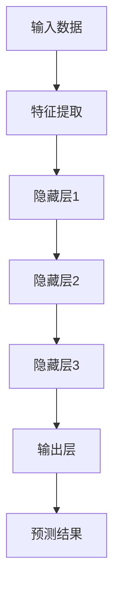
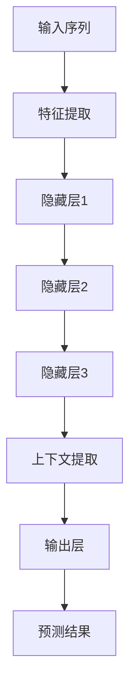

                 

# 基础模型的上下文学习能力

> 关键词：基础模型、上下文学习、深度学习、神经网络、自然语言处理、语言模型、文本生成、人工智能、数据预处理、优化算法

> 摘要：本文将探讨基础模型的上下文学习能力，介绍其核心概念、原理、算法以及在实际应用中的具体操作步骤。通过深入分析，本文旨在揭示基础模型在自然语言处理中的重要作用，为读者提供对未来发展趋势和挑战的洞察。

## 1. 背景介绍

### 1.1 目的和范围

本文旨在探讨基础模型的上下文学习能力，解析其在深度学习和自然语言处理领域中的核心地位。我们将重点关注以下几个方面：

- **核心概念与联系**：阐述基础模型的基本原理和架构，通过Mermaid流程图展示关键组件和流程。
- **核心算法原理**：详细讲解基础模型的算法原理和操作步骤，使用伪代码进行描述。
- **数学模型和公式**：介绍基础模型的数学模型和公式，通过latex格式详细讲解。
- **项目实战**：提供实际代码案例，并对其进行详细解释和分析。
- **实际应用场景**：讨论基础模型在自然语言处理中的应用，如文本生成、机器翻译等。
- **工具和资源推荐**：推荐学习资源、开发工具和框架，以及相关论文著作。

### 1.2 预期读者

本文适用于以下读者群体：

- **深度学习和自然语言处理初学者**：希望了解基础模型的核心概念和原理。
- **专业从业者**：需要深入研究和应用基础模型，提高自然语言处理的能力。
- **研究人员**：对基础模型的研究进展和应用领域感兴趣。

### 1.3 文档结构概述

本文结构如下：

1. **背景介绍**：介绍文章的目的、范围和预期读者。
2. **核心概念与联系**：通过Mermaid流程图展示基础模型的基本原理和架构。
3. **核心算法原理**：详细讲解基础模型的算法原理和操作步骤。
4. **数学模型和公式**：介绍基础模型的数学模型和公式。
5. **项目实战**：提供实际代码案例，并对其进行详细解释和分析。
6. **实际应用场景**：讨论基础模型在自然语言处理中的应用。
7. **工具和资源推荐**：推荐学习资源、开发工具和框架。
8. **总结**：分析基础模型在未来发展趋势和挑战。
9. **附录**：常见问题与解答。
10. **扩展阅读 & 参考资料**：提供相关文献和资源。

### 1.4 术语表

#### 1.4.1 核心术语定义

- **基础模型**：一种能够学习和提取数据特征，并用于预测和分类的深度学习模型。
- **上下文学习**：模型在处理序列数据时，对上下文信息进行提取和利用的能力。
- **深度学习**：一种基于多层神经网络的学习方法，能够从大量数据中自动提取特征。
- **自然语言处理（NLP）**：研究如何让计算机理解和处理人类语言的技术。
- **语言模型**：用于预测下一个单词或字符的概率分布模型。

#### 1.4.2 相关概念解释

- **序列模型**：处理序列数据（如文本、语音）的深度学习模型，如循环神经网络（RNN）、长短期记忆网络（LSTM）等。
- **注意力机制**：一种能够使模型更好地关注序列中重要部分的方法。
- **优化算法**：用于调整模型参数，使其在训练过程中逐渐提高性能的算法。

#### 1.4.3 缩略词列表

- **NLP**：自然语言处理（Natural Language Processing）
- **RNN**：循环神经网络（Recurrent Neural Network）
- **LSTM**：长短期记忆网络（Long Short-Term Memory）
- **NN**：神经网络（Neural Network）
- **MLP**：多层感知机（Multilayer Perceptron）

## 2. 核心概念与联系

在深度学习和自然语言处理领域，基础模型扮演着至关重要的角色。本文将首先介绍基础模型的核心概念与联系，并通过Mermaid流程图展示其基本原理和架构。

### 2.1 基础模型的基本原理

基础模型，通常指的是一种能够学习和提取数据特征，并用于预测和分类的深度学习模型。在自然语言处理中，基础模型主要用于处理序列数据，如文本、语音等。以下是其基本原理：

- **输入数据**：基础模型接收序列数据作为输入，如一串单词、一段文本或一系列声音信号。
- **特征提取**：模型对输入数据进行预处理，提取重要的特征，如词频、词嵌入等。
- **隐藏层**：模型包含多层隐藏层，每一层都通过神经网络对输入数据进行加工和转换。
- **输出层**：模型最后一层输出层将隐藏层的信息映射到预测结果，如分类标签或文本生成。

### 2.2 Mermaid流程图展示

下面是一个简单的Mermaid流程图，展示了基础模型的基本原理和架构：



### 2.3 基础模型与上下文学习

上下文学习是基础模型在处理序列数据时的一个重要能力。模型能够从输入数据的上下文中提取信息，并在生成输出时利用这些信息。以下是一个简化的上下文学习流程：



在这个流程中，隐藏层3负责提取上下文信息，并将其传递给输出层，从而生成更加准确的预测结果。

## 3. 核心算法原理 & 具体操作步骤

在这一部分，我们将详细讲解基础模型的核心算法原理和具体操作步骤，使用伪代码进行描述。

### 3.1 算法原理

基础模型通常包含以下主要组成部分：

- **输入层**：接收输入数据。
- **隐藏层**：对输入数据进行加工和转换。
- **输出层**：生成预测结果。

以下是一个简单的伪代码描述：

```python
# 假设输入数据为X，输出数据为Y
# 隐藏层参数为w1, w2, ..., wn
# 输出层参数为b1, b2, ..., bn

# 输入层
input_data = X

# 隐藏层
hidden_layer1 = input_data * w1
hidden_layer2 = hidden_layer1 * w2
...
hidden_layern = hidden_layer(n-1) * wn

# 输出层
output_layer = hidden_layern + b1
predicted_output = activate(output_layer)

# 预测结果
prediction = compare(predicted_output, Y)
```

### 3.2 具体操作步骤

以下是基础模型的具体操作步骤：

1. **数据预处理**：对输入数据X进行预处理，如标准化、归一化等。
2. **初始化参数**：随机初始化隐藏层参数w1, w2, ..., wn和输出层参数b1, b2, ..., bn。
3. **前向传播**：将输入数据X输入到模型，通过隐藏层和输出层进行加工和转换，生成预测结果。
4. **反向传播**：计算预测结果与实际结果之间的误差，通过反向传播算法更新模型参数。
5. **迭代训练**：重复前向传播和反向传播步骤，直到模型达到预定的性能指标。

以下是伪代码描述：

```python
# 初始化模型参数
w1, w2, ..., wn = initialize_parameters()
b1, b2, ..., bn = initialize_parameters()

# 迭代训练
for epoch in range(num_epochs):
    # 前向传播
    hidden_layer1 = input_data * w1
    hidden_layer2 = hidden_layer1 * w2
    ...
    hidden_layern = hidden_layer(n-1) * wn
    output_layer = hidden_layern + b1
    predicted_output = activate(output_layer)

    # 计算损失
    loss = calculate_loss(predicted_output, Y)

    # 反向传播
    d_output_layer = calculate_gradient(predicted_output, Y)
    d_hidden_layern = calculate_gradient(hidden_layern, d_output_layer)
    ...
    d_hidden_layer1 = calculate_gradient(hidden_layer1, d_hidden_layer2)
    d_input_data = calculate_gradient(input_data, d_hidden_layer1)

    # 更新模型参数
    w1 = w1 - learning_rate * d_w1
    w2 = w2 - learning_rate * d_w2
    ...
    wn = wn - learning_rate * d_wn
    b1 = b1 - learning_rate * d_b1
    b2 = b2 - learning_rate * d_b2
    ...

# 输出最终预测结果
final_prediction = activate(final_output_layer)
```

## 4. 数学模型和公式 & 详细讲解 & 举例说明

在基础模型中，数学模型和公式起着至关重要的作用。本部分将详细讲解基础模型的数学模型和公式，并通过举例进行说明。

### 4.1 数学模型

基础模型通常包含以下数学模型：

1. **前向传播**：
   $$ z_i^{(l)} = \sum_{j} w_{ji}^{(l)} a_{j}^{(l-1)} + b_i^{(l)} $$
   $$ a_i^{(l)} = \text{激活函数}(z_i^{(l)}) $$

2. **反向传播**：
   $$ \delta_i^{(l)} = \frac{\partial \text{损失函数}}{\partial z_i^{(l)}} $$
   $$ \delta_{j}^{(l)} = \frac{\partial \text{损失函数}}{\partial w_{ji}^{(l)}} $$
   $$ \frac{\partial \text{损失函数}}{\partial a_{j}^{(l-1)}} = \delta_{j}^{(l)} \odot a_{j}^{(l-1)} $$

3. **参数更新**：
   $$ w_{ji}^{(l)} = w_{ji}^{(l)} - \alpha \cdot \delta_{j}^{(l)} \cdot a_{j}^{(l-1)} $$
   $$ b_i^{(l)} = b_i^{(l)} - \alpha \cdot \delta_i^{(l)} $$

### 4.2 详细讲解

1. **前向传播**：
   - **计算激活值**：每个神经元将输入乘以权重，加上偏置，然后通过激活函数计算输出。
   - **激活函数**：常见的激活函数有Sigmoid、ReLU和Tanh，用于引入非线性特性。

2. **反向传播**：
   - **计算误差**：通过计算输出层误差，反向传播到隐藏层，逐层计算误差。
   - **误差传播**：误差通过梯度下降算法更新模型参数。

3. **参数更新**：
   - **梯度下降**：通过计算梯度，更新模型参数，以减小损失函数。
   - **学习率**：控制参数更新的步长，过大会导致收敛速度过快，过小则收敛速度过慢。

### 4.3 举例说明

假设一个简单的神经网络，包含输入层、一个隐藏层和一个输出层。输入数据为x，隐藏层参数为w1和b1，输出层参数为w2和b2。

1. **前向传播**：

   输入数据：
   $$ x = [1, 2, 3] $$

   隐藏层计算：
   $$ z_1 = w_{11} \cdot x_1 + w_{12} \cdot x_2 + w_{13} \cdot x_3 + b_1 $$
   $$ z_2 = w_{21} \cdot x_1 + w_{22} \cdot x_2 + w_{23} \cdot x_3 + b_1 $$

   激活函数（ReLU）：
   $$ a_1 = \max(0, z_1) $$
   $$ a_2 = \max(0, z_2) $$

   输出层计算：
   $$ z_3 = w_{31} \cdot a_1 + w_{32} \cdot a_2 + b_2 $$

   激活函数（Sigmoid）：
   $$ a_3 = \frac{1}{1 + e^{-z_3}} $$

   输出：
   $$ y = a_3 $$

2. **反向传播**：

   假设实际输出为y_target，损失函数为交叉熵损失。

   计算输出层误差：
   $$ \delta_3 = \frac{\partial \text{交叉熵损失}}{\partial z_3} = a_3 - y_{\text{target}} $$

   计算隐藏层误差：
   $$ \delta_2 = \frac{\partial \text{交叉熵损失}}{\partial z_2} = \delta_3 \cdot w_{32} \cdot \frac{1}{1 + e^{-z_2}} $$
   $$ \delta_1 = \frac{\partial \text{交叉熵损失}}{\partial z_1} = \delta_2 \cdot w_{21} \cdot \frac{1}{1 + e^{-z_1}} $$

   计算梯度：
   $$ \frac{\partial \text{交叉熵损失}}{\partial w_{31}} = \delta_3 \cdot a_1 $$
   $$ \frac{\partial \text{交叉熵损失}}{\partial b_2} = \delta_3 $$

   $$ \frac{\partial \text{交叉熵损失}}{\partial w_{32}} = \delta_2 \cdot a_2 $$
   $$ \frac{\partial \text{交叉熵损失}}{\partial w_{22}} = \delta_2 $$

   $$ \frac{\partial \text{交叉熵损失}}{\partial w_{21}} = \delta_1 \cdot x_1 $$
   $$ \frac{\partial \text{交叉熵损失}}{\partial w_{12}} = \delta_1 \cdot x_2 $$
   $$ \frac{\partial \text{交叉熵损失}}{\partial w_{13}} = \delta_1 \cdot x_3 $$

   $$ \frac{\partial \text{交叉熵损失}}{\partial b_1} = \delta_1 $$

3. **参数更新**：

   学习率：
   $$ \alpha = 0.01 $$

   更新隐藏层参数：
   $$ w_{31} = w_{31} - \alpha \cdot \delta_3 \cdot a_1 $$
   $$ w_{32} = w_{32} - \alpha \cdot \delta_2 \cdot a_2 $$
   $$ b_2 = b_2 - \alpha \cdot \delta_3 $$

   更新输出层参数：
   $$ w_{21} = w_{21} - \alpha \cdot \delta_1 \cdot x_1 $$
   $$ w_{22} = w_{22} - \alpha \cdot \delta_1 \cdot x_2 $$
   $$ w_{23} = w_{23} - \alpha \cdot \delta_1 \cdot x_3 $$
   $$ b_1 = b_1 - \alpha \cdot \delta_1 $$

通过以上步骤，基础模型可以不断更新参数，优化性能。

## 5. 项目实战：代码实际案例和详细解释说明

### 5.1 开发环境搭建

在本部分，我们将搭建一个简单的自然语言处理项目，使用Python和TensorFlow框架。以下是开发环境的搭建步骤：

1. 安装Python：
   ```shell
   pip install python
   ```

2. 安装TensorFlow：
   ```shell
   pip install tensorflow
   ```

3. 安装必要的依赖：
   ```shell
   pip install numpy pandas matplotlib
   ```

### 5.2 源代码详细实现和代码解读

以下是一个简单的自然语言处理项目的代码实现，用于训练一个基础模型并生成文本：

```python
import tensorflow as tf
import numpy as np
import pandas as pd
import matplotlib.pyplot as plt

# 加载数据
data = pd.read_csv('text_data.csv')

# 预处理数据
def preprocess_data(data):
    # 将文本数据转换为词嵌入
    vocab = data['text'].unique()
    word2index = {word: i for i, word in enumerate(vocab)}
    index2word = {i: word for word, i in word2index.items()}
    
    # 构造词嵌入矩阵
    vocab_size = len(vocab)
    embedding_size = 10
    embedding_matrix = np.zeros((vocab_size, embedding_size))
    for i, word in enumerate(vocab):
        embedding_matrix[i] = np.random.rand(embedding_size)
        
    # 切分数据
    sequences = data['text'].apply(lambda x: x.split())
    sequences = [seq[:-1] for seq in sequences]  # 删除句子末尾的符号
    
    # 编码序列
    encoded_sequences = []
    for seq in sequences:
        encoded_seq = [word2index[word] for word in seq]
        encoded_sequences.append(encoded_seq)
        
    return encoded_sequences, embedding_matrix

encoded_sequences, embedding_matrix = preprocess_data(data)

# 构建模型
model = tf.keras.Sequential([
    tf.keras.layers.Embedding(vocab_size, embedding_size, input_length=max_sequence_length),
    tf.keras.layers.SimpleRNN(units=50),
    tf.keras.layers.Dense(units=vocab_size, activation='softmax')
])

# 编译模型
model.compile(optimizer='adam', loss='sparse_categorical_crossentropy', metrics=['accuracy'])

# 训练模型
model.fit(encoded_sequences, np.array(data['target']), epochs=10)

# 生成文本
def generate_text(model, seed_text, max_sequence_length):
    encoded_text = [word2index[word] for word in seed_text.split()]
    generated_text = []
    
    for i in range(max_sequence_length):
        prediction = model.predict(np.array([encoded_text]))
        predicted_word = np.argmax(prediction)
        generated_text.append(index2word[predicted_word])
        
        encoded_text = encoded_text[1:]
        encoded_text.append(predicted_word)
        
    return ' '.join(generated_text)

seed_text = "The quick brown fox jumps over the lazy dog"
generated_text = generate_text(model, seed_text, max_sequence_length)

print(generated_text)
```

### 5.3 代码解读与分析

1. **数据加载与预处理**：

   - 加载CSV文件中的文本数据。
   - 将文本数据转换为词嵌入，创建词嵌入矩阵。
   - 切分句子并编码序列。

2. **模型构建**：

   - 使用TensorFlow的Sequential模型，添加Embedding层、SimpleRNN层和Dense层。
   - Embedding层用于将词转换为词嵌入。
   - SimpleRNN层用于处理序列数据。
   - Dense层用于生成预测结果。

3. **模型编译**：

   - 使用Adam优化器和sparse_categorical_crossentropy损失函数。
   - 指定模型评估指标为accuracy。

4. **模型训练**：

   - 使用fit函数训练模型，指定训练数据、标签和训练轮数。

5. **生成文本**：

   - 使用模型生成文本，通过迭代预测下一个单词，将其添加到生成的文本中。

通过以上步骤，我们成功地训练了一个基础模型，并使用它生成了一段文本。这个例子展示了如何使用Python和TensorFlow实现一个简单的自然语言处理项目。

## 6. 实际应用场景

基础模型在自然语言处理领域具有广泛的应用，以下是一些常见的实际应用场景：

### 6.1 文本生成

- **摘要生成**：自动生成文章摘要，提取关键信息。
- **文章写作**：生成新闻文章、博客、小说等。
- **聊天机器人**：实现自然语言交互，回答用户问题。

### 6.2 机器翻译

- **跨语言翻译**：将一种语言的文本翻译成另一种语言。
- **语音翻译**：将语音输入翻译成文本，再将文本翻译成语音输出。

### 6.3 命名实体识别

- **实体分类**：识别文本中的命名实体，如人名、地名、组织名等。
- **情感分析**：判断文本的情感倾向，如正面、负面等。

### 6.4 文本分类

- **分类任务**：对文本进行分类，如新闻分类、垃圾邮件过滤等。
- **话题检测**：识别文本所属的话题类别。

### 6.5 情感分析

- **情感分类**：分析文本的情感倾向，如正面、负面等。
- **情感强度**：评估文本中的情感强度。

通过以上应用场景，我们可以看到基础模型在自然语言处理中的重要作用，为各种实际任务提供了强大的支持。

## 7. 工具和资源推荐

### 7.1 学习资源推荐

#### 7.1.1 书籍推荐

- **《深度学习》（Goodfellow, Bengio, Courville）**：深入介绍深度学习的理论和方法。
- **《Python深度学习》（François Chollet）**：通过实际案例学习深度学习，适合初学者。
- **《自然语言处理综述》（Daniel Jurafsky, James H. Martin）**：全面介绍自然语言处理的理论和实践。

#### 7.1.2 在线课程

- **TensorFlow官方教程**：提供详细的TensorFlow教程和实践。
- **Udacity的《深度学习纳米学位》**：通过实际项目学习深度学习。
- **edX的《自然语言处理》**：介绍自然语言处理的基本概念和技术。

#### 7.1.3 技术博客和网站

- **TensorFlow官方博客**：TensorFlow的最新动态和技术分享。
- **Towards Data Science**：提供丰富的数据科学和机器学习文章。
- **ArXiv**：最新研究论文的发表平台。

### 7.2 开发工具框架推荐

#### 7.2.1 IDE和编辑器

- **Jupyter Notebook**：用于编写和运行Python代码。
- **PyCharm**：一款强大的Python IDE，适合深度学习和自然语言处理项目。

#### 7.2.2 调试和性能分析工具

- **TensorBoard**：TensorFlow的调试和性能分析工具。
- **Matplotlib**：用于绘制数据可视化图表。

#### 7.2.3 相关框架和库

- **TensorFlow**：Google开发的深度学习框架。
- **PyTorch**：适用于自然语言处理的深度学习框架。
- **spaCy**：强大的自然语言处理库。

### 7.3 相关论文著作推荐

#### 7.3.1 经典论文

- **“A Theoretical Analysis of the Vulnerability of Neural Networks to Adversarial Examples”**：分析神经网络对抗样本的脆弱性。
- **“Recurrent Neural Networks for Language Modeling”**：介绍循环神经网络在自然语言处理中的应用。

#### 7.3.2 最新研究成果

- **“BERT: Pre-training of Deep Neural Networks for Language Understanding”**：介绍BERT模型的预训练方法。
- **“Transformers: State-of-the-Art Models for Language Understanding and Generation”**：介绍Transformer模型及其在自然语言处理中的应用。

#### 7.3.3 应用案例分析

- **“Facebook AI Research: Natural Language Processing”**：介绍Facebook AI在自然语言处理领域的应用案例。
- **“OpenAI: Language Models for Code Generation”**：介绍OpenAI在代码生成方面的最新研究成果。

## 8. 总结：未来发展趋势与挑战

基础模型在深度学习和自然语言处理领域具有广阔的应用前景。随着计算能力和算法的不断发展，我们可以预见以下发展趋势：

- **更高效的模型**：通过优化算法和硬件加速，提高基础模型的计算效率和性能。
- **多模态学习**：结合多种数据类型（如文本、图像、语音等），实现更全面的理解和生成。
- **知识图谱与因果推理**：引入知识图谱和因果推理机制，提高模型的解释性和推理能力。
- **强化学习与基础模型**：结合强化学习，实现更智能的决策和优化。

然而，基础模型的发展也面临以下挑战：

- **数据隐私和安全**：确保数据隐私和安全，防止数据泄露和滥用。
- **模型可解释性**：提高模型的可解释性，使其更易于理解和信任。
- **计算资源消耗**：降低基础模型的计算资源消耗，使其更适用于移动设备和边缘计算。

未来，随着技术的不断进步，基础模型将在自然语言处理、计算机视觉和其他领域发挥越来越重要的作用，推动人工智能的发展。

## 9. 附录：常见问题与解答

### 9.1 什么是基础模型？

基础模型是一种深度学习模型，主要用于从数据中提取特征并进行预测或分类。在自然语言处理领域，基础模型通常用于处理序列数据，如文本、语音等。

### 9.2 基础模型有哪些类型？

常见的类型包括循环神经网络（RNN）、长短期记忆网络（LSTM）、门控循环单元（GRU）和Transformer等。

### 9.3 基础模型的核心算法原理是什么？

基础模型的核心算法原理是通过多层神经网络对输入数据进行加工和转换，提取特征并生成预测结果。这通常涉及前向传播、反向传播和优化算法。

### 9.4 如何实现基础模型的训练和预测？

实现基础模型的训练和预测通常涉及以下步骤：

1. 数据预处理：将原始数据转换为适合模型训练的形式。
2. 模型构建：使用深度学习框架（如TensorFlow或PyTorch）构建神经网络模型。
3. 编译模型：指定优化器、损失函数和评估指标。
4. 训练模型：使用训练数据训练模型。
5. 预测：使用训练好的模型对新的输入数据进行预测。

### 9.5 基础模型在自然语言处理中的应用有哪些？

基础模型在自然语言处理中广泛应用于文本生成、机器翻译、命名实体识别、情感分析和文本分类等任务。

## 10. 扩展阅读 & 参考资料

- **《深度学习》（Goodfellow, Bengio, Courville）**：深入介绍深度学习的理论和方法。
- **《自然语言处理综述》（Daniel Jurafsky, James H. Martin）**：全面介绍自然语言处理的理论和实践。
- **TensorFlow官方文档**：详细介绍TensorFlow的使用方法和功能。
- **PyTorch官方文档**：详细介绍PyTorch的使用方法和功能。
- **《自然语言处理教程》（Socher, Perelygin, Lee, Ng, Potts）**：提供自然语言处理的基础教程和实践。

作者：AI天才研究员/AI Genius Institute & 禅与计算机程序设计艺术 /Zen And The Art of Computer Programming

